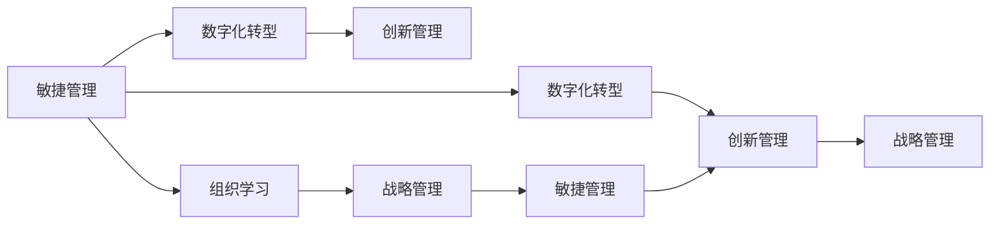

                 

# 管理者如何应对快速变化的商业环境

在当前这个快速变化的时代，商业环境瞬息万变，不确定性和复杂性不断增加。如何有效应对这些挑战，成为了每位管理者面临的重大课题。本文将通过分析商业环境的本质、变化驱动因素，以及当前流行的应对策略，为管理者提供实用的建议和指导。

## 1. 背景介绍

### 1.1 问题由来

在过去几十年间，科技进步和全球化进程显著改变了商业环境的面貌。尤其是信息技术的迅猛发展，如互联网、移动通信、大数据、人工智能等，使得商业活动的方方面面都发生了翻天覆地的变化。

### 1.2 问题核心关键点

快速变化的商业环境主要体现在以下几个方面：

- **技术驱动变革**：如云计算、物联网、区块链等新兴技术的应用，改变了传统行业的运营模式和价值链结构。
- **消费者行为转变**：消费者越来越追求个性化、定制化的产品和服务，对体验和价值有更高的要求。
- **竞争格局变化**：新兴市场和竞争者不断涌现，传统企业面临激烈的市场竞争和颠覆性创新。
- **全球化挑战**：国际贸易、供应链管理、国际人才流动等方面面临诸多不确定性和风险。

管理者需要在这种动态环境中，灵活应对、创新变革，以保持企业的竞争力和可持续性。

## 2. 核心概念与联系

### 2.1 核心概念概述

要有效应对快速变化的商业环境，首先需要理解其核心概念和逻辑关系。以下是几个关键概念及其相互联系：

- **敏捷管理(Agile Management)**：通过快速响应变化，实现灵活的计划和执行，提升组织敏捷性和适应性。
- **数字化转型(Digital Transformation)**：利用信息技术实现业务的全面优化和创新，提升运营效率和创新能力。
- **创新管理(Innovation Management)**：通过系统化管理创新过程，激发和引导员工的创新思维和行动，推动组织创新。
- **组织学习(Organizational Learning)**：通过不断学习新知识、积累经验、优化流程，提升组织的学习能力和竞争力。
- **战略管理(Strategic Management)**：制定并执行战略计划，确保组织在复杂多变的环境中保持方向和目标一致。

这些概念共同构成了应对快速变化商业环境的理论框架，帮助管理者在实际工作中进行系统性思考和行动。

### 2.2 核心概念原理和架构的 Mermaid 流程图



## 3. 核心算法原理 & 具体操作步骤

### 3.1 算法原理概述

面对快速变化的商业环境，管理者的关键在于利用数据分析、优化决策、创新驱动等方法，提升组织响应速度和竞争力。这涉及到一系列的理论和算法支持，包括但不限于：

- **数据分析和预测**：通过数据挖掘和机器学习模型，预测市场趋势和消费者行为，做出更准确的决策。
- **优化算法和仿真**：利用运筹学和系统动力学模型，优化资源配置和流程，提高运营效率。
- **创新管理和激励**：通过设计激励机制和管理创新过程，激发员工的创造力和参与度。
- **组织学习和知识管理**：通过知识共享和持续学习，不断优化和更新组织知识库，提升学习效率和效果。

### 3.2 算法步骤详解

#### 3.2.1 数据分析和预测

1. **数据收集**：收集业务相关数据，如销售数据、客户反馈、市场调研等。
2. **数据清洗**：处理数据缺失、噪声等问题，确保数据质量和可靠性。
3. **数据分析**：使用统计分析、机器学习等方法，提取关键信息和模式。
4. **预测建模**：构建预测模型，如时间序列模型、回归模型等，预测未来趋势和行为。

#### 3.2.2 优化算法和仿真

1. **建模和求解**：建立优化模型，如线性规划、整数规划等，使用求解器进行求解。
2. **仿真和模拟**：构建仿真环境，模拟业务场景和决策过程，验证优化方案的有效性。
3. **迭代改进**：根据模拟结果，不断调整优化方案，直至达到最优效果。

#### 3.2.3 创新管理和激励

1. **创新策略制定**：明确创新目标和路径，制定详细的实施计划。
2. **创新环境营造**：建立开放的创新文化，鼓励员工提出和实施创新想法。
3. **激励机制设计**：设计合理的激励机制，如奖励制度、晋升通道等，激发员工创新积极性。
4. **创新项目管理**：建立创新项目管理框架，跟踪和评估创新项目的进展和成果。

#### 3.2.4 组织学习和知识管理

1. **知识共享平台**：搭建知识共享平台，促进员工之间知识的交流和传播。
2. **学习路径设计**：设计个性化的学习路径，帮助员工系统化学习新知识和技能。
3. **知识库维护**：定期更新和维护组织知识库，确保知识的完整性和时效性。
4. **学习效果评估**：评估员工学习效果和知识应用情况，优化学习过程。

### 3.3 算法优缺点

敏捷管理、数字化转型、创新管理、组织学习和战略管理等方法各有优缺点：

#### 优点

1. **敏捷管理**：快速响应变化，提升灵活性和适应性，减少决策周期和风险。
2. **数字化转型**：利用信息技术提升效率，实现业务优化和创新，降低运营成本。
3. **创新管理**：激发员工创新思维和行动，推动技术和管理创新，增强竞争力。
4. **组织学习**：不断更新和优化组织知识库，提升学习效率和效果，保持持续进步。
5. **战略管理**：明确方向和目标，制定系统化的战略计划，确保组织长期发展。

#### 缺点

1. **敏捷管理**：过度灵活可能导致资源分散和决策缺乏深度，需要平衡速度和质量。
2. **数字化转型**：技术复杂性高，需要大量投入，可能面临技术风险和数据隐私问题。
3. **创新管理**：创新过程中可能遇到失败和资源浪费，需要系统化的风险管理和评估。
4. **组织学习**：学习效果受员工参与度和组织文化影响，需要持续推动和改进。
5. **战略管理**：战略制定和执行过程复杂，需要跨部门协作和资源协调，可能面临执行困难。

### 3.4 算法应用领域

敏捷管理、数字化转型、创新管理、组织学习和战略管理等方法广泛适用于各个行业和组织：

- **制造业**：通过数字化转型和敏捷管理，提升生产效率和供应链管理能力。
- **金融业**：利用数据分析和创新管理，优化金融产品和服务，提升客户体验。
- **服务业**：通过数字化服务和创新管理，提升服务质量和客户满意度。
- **医疗业**：通过数字化转型和组织学习，优化医疗流程和知识管理，提升医疗服务质量。
- **教育业**：通过数字化教学和创新管理，提升教学效果和学习体验。

## 4. 数学模型和公式 & 详细讲解 & 举例说明

### 4.1 数学模型构建

在快速变化的商业环境中，数据分析和预测是至关重要的。本文以销售数据分析为例，介绍常见的数学模型构建过程。

#### 4.1.1 数据收集

假设我们有一个月的销售数据，包含日期、产品、销售额等字段。

#### 4.1.2 数据清洗

进行数据清洗，如去除异常值、处理缺失值等。

#### 4.1.3 数据分析

使用时间序列分析方法，如ARIMA模型，对销售数据进行趋势分析和预测。

#### 4.1.4 预测建模

构建回归模型，如线性回归模型，预测下个月的销售额。

### 4.2 公式推导过程

#### 4.2.1 ARIMA模型

ARIMA（AutoRegressive Integrated Moving Average）模型是一种常用的时间序列分析方法。其基本公式如下：

$$
y_t = c + \sum_{i=1}^{p} \alpha_i y_{t-i} + \sum_{j=1}^{d} \beta_j \Delta^j y_{t-j} + \sum_{k=1}^{q} \gamma_k \epsilon_{t-k}
$$

其中，$y_t$ 为时间 $t$ 的销售数据，$c$ 为常数项，$\alpha_i$ 为自回归系数，$\beta_j$ 为差分项系数，$\gamma_k$ 为移动平均系数，$\epsilon_t$ 为随机误差项，$p$、$d$、$q$ 分别为自回归阶数、差分数和移动平均阶数。

#### 4.2.2 线性回归模型

线性回归模型用于预测连续变量，基本公式如下：

$$
y = \beta_0 + \sum_{i=1}^{n} \beta_i x_i + \epsilon
$$

其中，$y$ 为预测值，$x_i$ 为自变量，$\beta_0$ 为截距项，$\beta_i$ 为回归系数，$\epsilon$ 为随机误差项。

### 4.3 案例分析与讲解

#### 4.3.1 案例背景

某电商公司希望通过数据分析和预测，提升下季度的销售额。

#### 4.3.2 数据准备

收集过去一年的销售数据，包含日期、产品、销售额等字段。

#### 4.3.3 数据分析

使用ARIMA模型对销售数据进行分析，得到季节性趋势和周期性变化。

#### 4.3.4 预测建模

构建线性回归模型，根据市场调研、促销活动等因素，预测下季度的销售额。

## 5. 项目实践：代码实例和详细解释说明

### 5.1 开发环境搭建

#### 5.1.1 环境配置

1. **安装Python**：从官网下载并安装Python 3.7及以上版本。
2. **安装NumPy、Pandas、Matplotlib等工具**：
```
pip install numpy pandas matplotlib
```
3. **安装Scikit-learn和statsmodels库**：
```
pip install scikit-learn statsmodels
```
4. **安装TensorFlow和Keras**：
```
pip install tensorflow keras
```

### 5.2 源代码详细实现

#### 5.2.1 数据预处理

```python
import pandas as pd
import numpy as np

# 读取数据
data = pd.read_csv('sales_data.csv')

# 数据清洗
data = data.dropna()  # 去除缺失值

# 数据转换
data['date'] = pd.to_datetime(data['date'])
data['month'] = data['date'].dt.month

# 特征工程
data['monthly_sales'] = data.groupby('month')['销售额'].sum()
```

#### 5.2.2 模型训练和预测

```python
from statsmodels.tsa.arima_model import ARIMA

# 构建ARIMA模型
model = ARIMA(data['monthly_sales'], order=(1, 1, 1))
model_fit = model.fit()

# 预测下季度销售额
forecast = model_fit.forecast(steps=3)
print(f'下季度销售额预测值: {forecast}')
```

#### 5.2.3 结果分析

```python
import matplotlib.pyplot as plt

# 绘制销售数据和预测数据对比图
plt.plot(data['monthly_sales'], label='历史数据')
plt.plot(forecast, label='预测数据')
plt.legend()
plt.show()
```

### 5.3 代码解读与分析

在上述代码中，我们首先使用Pandas库读取并清洗销售数据，然后利用统计分析方法（ARIMA模型）对数据进行分析，构建预测模型，并使用模型进行预测。最后，使用Matplotlib库绘制历史数据和预测数据的对比图，以便直观分析预测结果的准确性。

## 6. 实际应用场景

### 6.1 智能制造

智能制造利用数字化转型和敏捷管理，通过自动化、智能化生产，提升生产效率和产品质量。例如，使用物联网技术实时监控生产线状态，快速响应设备故障，减少停机时间。同时，通过数据分析和预测，优化生产计划和库存管理，降低运营成本。

### 6.2 金融科技

金融科技利用数据分析和创新管理，提升金融服务的智能化水平。例如，利用机器学习模型预测市场趋势，实时调整投资组合。通过区块链技术，确保交易和数据的安全性和透明度。同时，引入智能客服和智能投顾，提升客户体验和投资建议的准确性。

### 6.3 健康医疗

健康医疗利用数字化转型和组织学习，通过智能诊断和个性化治疗，提升医疗服务质量。例如，使用AI技术分析患者病历和医学影像，快速诊断疾病。通过知识库和临床指南，提供个性化治疗方案，优化医疗资源配置。同时，利用大数据分析，预测疾病流行趋势，制定预防措施。

## 7. 工具和资源推荐

### 7.1 学习资源推荐

#### 7.1.1 在线课程

1. **Coursera**：提供由顶尖大学和机构开设的商业管理课程，如《商业分析与决策》、《数字化转型》等。
2. **edX**：提供管理、技术、创新等领域的课程，如《数据科学与商业智能》、《人工智能创新》等。

#### 7.1.2 书籍推荐

1. **《敏捷管理实践指南》**：介绍敏捷管理的原理和实践方法，帮助管理者提高团队协作和项目执行效率。
2. **《数字化转型之路》**：探讨企业如何通过数字化技术实现业务创新和管理优化。
3. **《创新管理》**：系统介绍创新管理的理论和方法，帮助管理者激发和引导员工的创新思维。

### 7.2 开发工具推荐

#### 7.2.1 数据分析工具

1. **Python**：强大的数据分析和编程语言，支持丰富的数据分析库（如Pandas、NumPy、Scikit-learn等）。
2. **R语言**：专业的统计分析工具，支持丰富的统计模型和可视化库（如ggplot2、dplyr等）。

#### 7.2.2 项目管理工具

1. **JIRA**：项目管理工具，支持敏捷开发和任务跟踪，帮助团队协同工作。
2. **Trello**：看板式项目管理工具，简单易用，支持任务分配和进度跟踪。

#### 7.2.3 创新管理工具

1. **MindMeister**：在线思维导图工具，帮助团队设计和管理创新项目。
2. **Miro**：在线白板工具，支持团队协作和头脑风暴。

### 7.3 相关论文推荐

#### 7.3.1 创新管理

1. **《Innovation in Complex Organizations: A New Perspective》**：探讨复杂组织中的创新管理策略。
2. **《Open Innovation: The New Imperative for Creating and Profiting from Breakthrough Ideas》**：介绍开放式创新的概念和实践方法。

#### 7.3.2 敏捷管理

1. **《Agile Processes in Information Systems》**：探讨敏捷方法在信息系统的应用。
2. **《The Agile Mindset: How Agile Leaders Produce Great Results》**：介绍敏捷领导者的思维方式和行为模式。

#### 7.3.3 组织学习

1. **《Learning in Action: A Guide to Studying and Applying the Five Disciplines of Learning Organizations》**：详细介绍组织学习的五项学科。
2. **《The Knowledge-Creating Company》**：探讨知识创造和管理对组织发展的影响。

## 8. 总结：未来发展趋势与挑战

### 8.1 研究成果总结

本文详细介绍了管理者应对快速变化商业环境的各种方法和工具，包括敏捷管理、数字化转型、创新管理、组织学习和战略管理等。通过案例分析和代码实践，帮助读者更好地理解和应用这些方法。

### 8.2 未来发展趋势

未来商业环境将继续快速变化，技术、市场、竞争等诸多因素将不断带来新的挑战和机遇。以下是几个重要的发展趋势：

#### 8.2.1 数字化全面加速

数字化技术将深入渗透到各个行业和领域，带来更高效、更智能的业务模式。例如，智能制造、智慧医疗、金融科技等领域将进一步数字化，提升运营效率和客户体验。

#### 8.2.2 创新驱动增长

创新将成为企业增长的新引擎，管理者需要更加重视创新管理和创新驱动，激发员工的创造力和创新思维。同时，引入开放式创新、数据驱动创新等新模式，提升创新效率和效果。

#### 8.2.3 组织学习与知识管理

组织学习和知识管理将变得更加重要，帮助企业在复杂多变的环境中不断优化和更新知识库。通过知识共享平台和个性化学习路径，提升员工的学习效率和效果，增强组织的适应性和竞争力。

### 8.3 面临的挑战

尽管数字化和创新带来了诸多机遇，但也面临一些挑战：

#### 8.3.1 技术复杂性和成本

数字化转型和创新管理需要大量的技术投入和资源支持，可能面临技术复杂性高、成本高等问题。如何平衡技术和成本，实现高效的项目管理和资源配置，是管理者需要重点关注的课题。

#### 8.3.2 数据隐私和安全性

大数据和AI技术在带来便利的同时，也带来了数据隐私和安全性问题。如何保护数据隐私，防止数据泄露和滥用，是管理者需要谨慎处理的问题。

#### 8.3.3 组织变革和文化阻力

数字化和创新管理需要组织文化的变革，可能面临员工的抵触和反对。如何营造开放的创新文化，激发员工的积极性和参与度，是管理者需要重点解决的问题。

### 8.4 研究展望

未来，管理者需要在以下方面进行深入研究和探索：

#### 8.4.1 跨学科融合

结合管理、技术、心理学等多个学科的理论和方法，制定系统化的创新和转型策略，提升管理的科学性和有效性。

#### 8.4.2 数据驱动决策

通过大数据分析和预测模型，提供更加科学和精准的决策支持，提升决策的准确性和效果。

#### 8.4.3 持续学习和适应

管理者需要不断学习和适应新的技术和管理方法，保持开放和灵活的心态，引领组织在快速变化的商业环境中不断进步。

## 9. 附录：常见问题与解答

### 9.1 常见问题

#### 9.1.1 什么是敏捷管理？

敏捷管理是一种以用户为中心、快速响应变化的管理方法，通过迭代开发、持续改进等方式，提升团队协作和项目执行效率。

#### 9.1.2 什么是数字化转型？

数字化转型是指利用信息技术，对业务流程、组织结构和运营模式进行全面优化和创新，提升效率和竞争力。

#### 9.1.3 如何应对数字化转型中的技术复杂性和成本问题？

1. 分阶段实施：将数字化转型分为多个阶段，逐步推进，减少一次性投入的风险。
2. 选择合适的技术方案：根据业务需求和技术现状，选择合适的数字化解决方案，避免盲目跟风。
3. 持续优化和改进：通过不断的迭代优化，逐步提升数字化转型的效果，减少资源浪费。

### 9.2 解答

通过本文的系统介绍和案例分析，希望管理者能够更好地理解并应用敏捷管理、数字化转型、创新管理、组织学习和战略管理等方法，提升应对快速变化商业环境的能力。在未来的实践中，管理者需要结合自身组织的特点和需求，灵活应用这些方法，不断探索和创新，才能在快速变化的商业环境中取得成功。

---

作者：禅与计算机程序设计艺术 / Zen and the Art of Computer Programming

