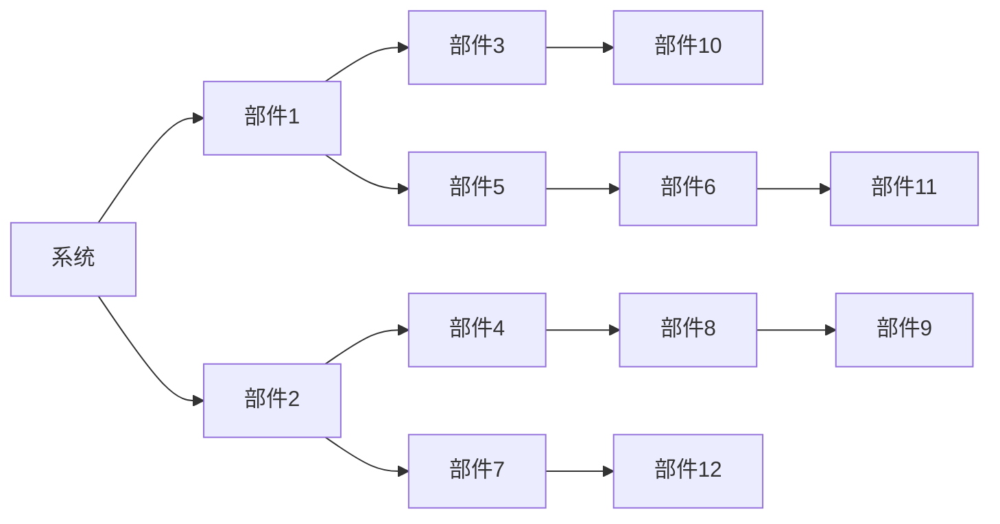

                 

# 系统思考：全面分析问题的关键

系统思考(System Thinking)是一种从整体性、动态性、关联性出发，分析、理解、解决问题的系统方法。它不仅关注单个部件的表现，更关注整个系统的结构、功能和演化过程。在系统思考的框架下，我们能够更全面、深入地理解问题的本质，提出更为系统、科学的解决方案。本文将深入探讨系统思考的核心概念、原理及其在IT领域的应用，为全面分析问题提供一套系统的分析工具和方法。

## 1. 背景介绍

### 1.1 问题由来

在信息化时代，信息量的爆炸性增长和问题复杂性的不断增加，使得传统的“碎片化”思考方式难以应对日益复杂的系统。系统思考作为一种更系统、更全面的思考方式，能够帮助决策者从整体和动态的视角来理解和解决问题。

### 1.2 问题核心关键点

系统思考关注的是系统的整体性、关联性、动态性和适应性。其中：
- **整体性**：系统思考强调整体视角，认为系统中的每个部分都是相互关联的，不能孤立看待。
- **关联性**：系统中的各个部分通过各种反馈机制相互作用，形成复杂的关联网络。
- **动态性**：系统是不断变化的，不同时刻的状态和行为可能完全不同。
- **适应性**：系统能够适应环境的变化，通过调整内部结构来保持稳定和进化。

系统思考的核心在于通过模型化抽象出系统的结构、功能和演化过程，从而更全面地理解系统行为，进而提出科学、有效的解决方案。

## 2. 核心概念与联系

### 2.1 核心概念概述

- **系统(System)**：由多个相互作用的元素（部件）组成的整体，这些元素通过各种关系（如因果、依赖、反馈等）相互联系。
- **部件(Part)或子系统(Subsystem)**：系统中的单个元素或子集，能够相对独立地发挥功能。
- **反馈(Feedback)**：系统中的一个部分向另一部分传递的信息，通常用于调整系统行为以适应环境变化。
- **动态(Dynamics)**：系统随时间变化的特征，包括时间依赖关系、系统演化等。
- **模型(Model)**：对系统结构和行为的抽象表示，通过数学、符号等手段描述系统的组成、行为和变化规律。
- **因果链(Cause-Effect Chain)**：系统中的因果关系链，描述一个部件对另一个部件的影响。

### 2.2 核心概念原理和架构的 Mermaid 流程图



该图展示了一个简单的系统结构，由若干部件通过各种关系（如箭头所示的依赖、反馈）构成。每个部件的输出可以被另一个部件作为输入，形成复杂的网络。

## 3. 核心算法原理 & 具体操作步骤

### 3.1 算法原理概述

系统思考的算法原理主要包括以下几个步骤：
1. **系统建模**：通过模型化抽象出系统的组成和关系，建立系统的结构模型。
2. **因果链分析**：识别系统中的因果关系链，分析系统的输入、输出和反馈机制。
3. **动态仿真**：利用数学模型或仿真工具，模拟系统随时间变化的动态行为。
4. **优化设计**：根据系统的动态仿真结果，设计优化方案，调整系统参数和结构。
5. **迭代改进**：不断迭代优化系统设计，直到系统达到期望的性能指标。

### 3.2 算法步骤详解

以下是系统思考的具体操作步骤：

**Step 1: 系统建模**

系统建模是系统思考的第一步。建模的目的是将系统的复杂性简化，形成一个易于理解和分析的结构模型。建模方法包括但不限于：

- **因果图(Cause-Effect Graph)**：通过图形化展示系统中的因果关系链。
- **系统动力学模型(System Dynamics Model)**：利用微分方程组模拟系统随时间的动态行为。
- **符号化模型(Symbolic Model)**：使用符号和数学表达式描述系统的结构。

**Step 2: 因果链分析**

因果链分析是通过识别系统中的因果关系链，理解系统的输入、输出和反馈机制。具体步骤如下：

1. **识别输入和输出**：分析系统中的输入和输出，理解系统的作用和影响。
2. **识别反馈机制**：理解系统中的反馈关系，识别正反馈和负反馈。
3. **绘制因果图**：通过因果图展示系统的因果关系链，有助于更直观地理解系统的结构。

**Step 3: 动态仿真**

动态仿真是通过数学模型或仿真工具，模拟系统随时间变化的动态行为。步骤如下：

1. **构建数学模型**：根据系统的因果关系链，构建系统的数学模型。
2. **仿真工具选择**：选择合适的仿真工具，如MATLAB、Simulink、PyModel等。
3. **仿真实验**：利用仿真工具，模拟系统随时间的动态行为，观察系统的演化过程。

**Step 4: 优化设计**

优化设计是通过调整系统参数和结构，改进系统的性能。具体步骤如下：

1. **设定目标函数**：根据系统的性能指标，设定优化目标。
2. **选择优化算法**：选择适合的优化算法，如梯度下降、遗传算法、粒子群算法等。
3. **迭代优化**：利用优化算法，迭代调整系统参数和结构，直到达到优化目标。

**Step 5: 迭代改进**

迭代改进是通过不断优化系统设计，提升系统性能。具体步骤如下：

1. **仿真验证**：利用仿真工具，验证优化后的系统设计是否满足性能要求。
2. **反馈调整**：根据仿真结果，调整系统设计和参数，进行迭代优化。
3. **迭代循环**：不断进行仿真验证和反馈调整，直到系统达到理想性能。

### 3.3 算法优缺点

系统思考的优点在于其全面性和系统性，能够从整体和动态视角全面理解问题，提出更为科学、有效的解决方案。但同时也存在以下缺点：

- **复杂度高**：系统建模和因果链分析需要高度抽象思维，对于复杂系统，建模难度较大。
- **数据需求高**：系统思考依赖于大量的数据和信息，数据不足可能导致分析结果不准确。
- **计算资源需求高**：动态仿真和优化设计通常需要高性能计算资源，计算复杂度高。
- **实施难度大**：系统思考涉及多学科知识，实施难度较大，需要跨学科团队协作。

### 3.4 算法应用领域

系统思考在多个领域都有广泛应用，主要包括以下几个方面：

- **IT系统设计**：系统思考在IT系统设计中用于理解系统的组成、结构、功能和动态行为，提出科学、系统的设计方案。
- **业务流程优化**：系统思考用于优化业务流程，识别流程中的瓶颈和改进点，提升业务效率和效果。
- **供应链管理**：系统思考用于优化供应链管理，分析供应链中的因果关系链，提高供应链的效率和稳定性。
- **金融风险管理**：系统思考用于识别金融系统的风险点，提出系统化的风险管理方案。
- **环境保护**：系统思考用于分析环境系统中的因果关系链，提出科学的环境保护方案。

## 4. 数学模型和公式 & 详细讲解 & 举例说明

### 4.1 数学模型构建

系统建模通常使用系统动力学模型(System Dynamics Model)，通过微分方程组描述系统的动态行为。以下是一个简单的系统动力学模型：

$$
\dot{x} = -k(x-x_0)
$$

其中：
- $x$ 表示系统的状态变量。
- $\dot{x}$ 表示系统状态变量的变化率。
- $k$ 表示系统的衰减系数。
- $x_0$ 表示系统的平衡状态。

### 4.2 公式推导过程

上述微分方程可以解为：

$$
x(t) = x_0e^{-k(t-t_0)}
$$

其中：
- $t_0$ 表示初始时刻。
- $t$ 表示当前时刻。

该微分方程描述了系统随时间变化的动态行为，即当状态变量偏离平衡状态 $x_0$ 时，系统会以指数衰减的方式回归到平衡状态。

### 4.3 案例分析与讲解

以下是一个简单的系统动力学模型案例，用于分析一个简单循环系统的动态行为：

假设有一个初始为 $100$ 单位的液体系统，系统中的液体以固定速率向外泄漏，速率与当前液体量成正比，比例系数为 $k$。模型的微分方程为：

$$
\dot{V} = -kV
$$

其中：
- $V$ 表示液体系统的当前体积。
- $k$ 表示单位体积每单位时间的泄漏速率。

这个模型的解为：

$$
V(t) = V_0e^{-k(t-t_0)}
$$

其中：
- $V_0$ 表示初始液体体积。
- $t_0$ 表示初始时刻。

仿真结果如下：

```python
import numpy as np
from scipy.integrate import solve_ivp

# 定义系统参数
V0 = 100  # 初始液体体积
k = 0.01  # 单位体积每单位时间的泄漏速率

# 定义微分方程
def dydt(V, t):
    return -k * V

# 求解微分方程
t_span = [0, 10]  # 时间跨度
sol = solve_ivp(dydt, t_span, V0)

# 输出结果
print(sol.t)
print(sol.y[0])
```

仿真结果表明，液体系统的体积随时间衰减，最终稳定在平衡状态。

## 5. 项目实践：代码实例和详细解释说明

### 5.1 开发环境搭建

在系统思考的实践过程中，我们需要一个合适的开发环境。以下是一个简单的Python开发环境搭建步骤：

1. **安装Python**：安装最新版本的Python，可以通过官网下载安装包或使用包管理工具（如Anaconda、pip等）进行安装。
2. **安装必要的库**：安装系统思考所需的库，如Sympy、NumPy、SciPy等。
3. **安装系统仿真工具**：安装仿真工具，如MATLAB、Simulink等。

### 5.2 源代码详细实现

以下是一个简单的Python代码实现，用于模拟一个简单的系统动力学模型：

```python
import numpy as np
from scipy.integrate import solve_ivp

# 定义系统参数
V0 = 100  # 初始液体体积
k = 0.01  # 单位体积每单位时间的泄漏速率

# 定义微分方程
def dydt(V, t):
    return -k * V

# 求解微分方程
t_span = [0, 10]  # 时间跨度
sol = solve_ivp(dydt, t_span, V0)

# 输出结果
print(sol.t)
print(sol.y[0])
```

### 5.3 代码解读与分析

上述代码实现了系统动力学模型的仿真。代码步骤如下：

1. **定义系统参数**：
   - `V0` 表示初始液体体积。
   - `k` 表示单位体积每单位时间的泄漏速率。

2. **定义微分方程**：
   - `dydt` 函数表示系统的微分方程。

3. **求解微分方程**：
   - `solve_ivp` 函数用于求解微分方程，返回一个解对象 `sol`。
   - `t_span` 表示微分方程的时间跨度。
   - `sol.y[0]` 表示求解结果中状态变量的值。

4. **输出结果**：
   - 通过打印 `sol.t` 和 `sol.y[0]`，输出仿真结果。

## 6. 实际应用场景

### 6.1 IT系统设计

在IT系统设计中，系统思考用于分析系统的组成、结构、功能和动态行为，提出科学、系统的设计方案。具体应用包括：

- **云计算平台设计**：通过系统思考，理解云平台中的各个组件及其相互关系，优化云平台的性能和可靠性。
- **网络安全设计**：通过系统思考，分析网络安全系统中的因果关系链，设计出更安全、高效的网络安全策略。
- **分布式系统设计**：通过系统思考，理解分布式系统中的各个组件及其相互关系，优化分布式系统的性能和可靠性。

### 6.2 业务流程优化

在系统思考的帮助下，我们可以更全面、系统地识别业务流程中的瓶颈和改进点，提升业务效率和效果。具体应用包括：

- **业务流程建模**：通过系统思考，建模业务流程中的因果关系链，识别流程中的瓶颈和改进点。
- **流程自动化设计**：通过系统思考，设计出更高效、可靠的业务流程自动化方案。
- **业务流程仿真**：通过系统思考，进行业务流程仿真，验证改进方案的效果。

### 6.3 供应链管理

在系统思考的帮助下，我们可以更全面、系统地理解供应链系统中的因果关系链，优化供应链管理。具体应用包括：

- **供应链建模**：通过系统思考，建模供应链系统中的因果关系链，识别供应链中的瓶颈和改进点。
- **供应链仿真**：通过系统思考，进行供应链仿真，验证改进方案的效果。
- **供应链优化设计**：通过系统思考，设计出更高效、可靠的供应链优化方案。

### 6.4 金融风险管理

在系统思考的帮助下，我们可以更全面、系统地识别金融系统中的风险点，提出系统化的风险管理方案。具体应用包括：

- **金融系统建模**：通过系统思考，建模金融系统中的因果关系链，识别金融系统中的风险点。
- **金融风险仿真**：通过系统思考，进行金融风险仿真，验证风险管理方案的效果。
- **金融风险优化设计**：通过系统思考，设计出更科学、可靠的风险管理方案。

### 6.5 环境保护

在系统思考的帮助下，我们可以更全面、系统地理解环境系统中的因果关系链，提出科学的环境保护方案。具体应用包括：

- **环境系统建模**：通过系统思考，建模环境系统中的因果关系链，识别环境系统中的问题点。
- **环境保护仿真**：通过系统思考，进行环境保护仿真，验证环境保护方案的效果。
- **环境保护优化设计**：通过系统思考，设计出更科学、可靠的环境保护方案。

## 7. 工具和资源推荐

### 7.1 学习资源推荐

为了帮助开发者系统掌握系统思考的理论基础和实践技巧，这里推荐一些优质的学习资源：

1. **《系统思考原理与实践》**：一本全面介绍系统思考的书籍，深入浅出地讲解了系统思考的基本概念、原理和应用方法。
2. **Coursera《系统思考与创新》课程**：由知名学者开设的系统思考课程，讲解系统思考的基本原理和实践方法。
3. **Simulink官方文档**：Simulink是一款广泛使用的仿真工具，其官方文档详细介绍了系统建模和仿真的方法和工具。
4. **MIT OpenCourseWare《系统动力学》课程**：由MIT开设的公开课，讲解系统动力学的基本原理和应用方法。
5. **Udemy《系统思考》课程**：由Udemy提供的系统思考课程，讲解系统思考的基本概念和实践方法。

通过对这些资源的学习实践，相信你一定能够快速掌握系统思考的精髓，并用于解决实际的系统问题。

### 7.2 开发工具推荐

在系统思考的实践过程中，我们需要一些高效的工具。以下是几款常用的开发工具：

1. **Simulink**：MATLAB的仿真工具，用于系统建模和仿真，广泛应用于工程和科学领域。
2. **PyModel**：Python的仿真工具，支持动态仿真和优化设计，适用于系统动态分析和优化设计。
3. **Modelica**：一种基于对象的建模语言，用于描述复杂系统的动态行为，适用于各种工程领域。
4. **OpenModelica**：Modelica的开放源代码实现，支持多种平台和环境。
5. **SOSA**：一种用于描述复杂系统的建模语言，支持多种仿真工具和环境。

合理利用这些工具，可以显著提升系统思考的开发效率，加快创新迭代的步伐。

### 7.3 相关论文推荐

系统思考是近年来兴起的跨学科研究领域，以下是几篇奠基性的相关论文，推荐阅读：

1. **《系统思考：一种全面分析问题的方法》**：本文提出了系统思考的基本概念和原理，详细讲解了系统思考的应用方法。
2. **《系统动力学在复杂系统中的应用》**：本文详细介绍了系统动力学的基本原理和方法，及其在复杂系统中的应用。
3. **《基于系统思考的业务流程优化》**：本文讲解了系统思考在业务流程优化中的应用，详细分析了业务流程中的因果关系链。
4. **《系统思考与企业战略管理》**：本文探讨了系统思考在企业战略管理中的应用，详细分析了企业战略管理中的因果关系链。
5. **《基于系统思考的环境管理》**：本文探讨了系统思考在环境管理中的应用，详细分析了环境系统中的因果关系链。

这些论文代表了大系统思考理论的发展脉络。通过学习这些前沿成果，可以帮助研究者把握学科前进方向，激发更多的创新灵感。

## 8. 总结：未来发展趋势与挑战

### 8.1 研究成果总结

本文对系统思考的核心概念、原理及其在IT领域的应用进行了全面系统的介绍。系统思考作为一门新兴的跨学科研究方法，其基本思想和应用方法已被广泛接受，并在多个领域取得了显著的应用效果。在系统思考的帮助下，IT系统设计、业务流程优化、供应链管理、金融风险管理、环境保护等领域取得了显著的改进。

### 8.2 未来发展趋势

展望未来，系统思考的发展趋势主要包括以下几个方面：

1. **多学科融合**：系统思考将继续与其他学科进行更深入的融合，如物理学、生物学、社会学等，形成更加综合的系统分析方法。
2. **大数据分析**：系统思考将与大数据分析技术结合，利用大数据分析系统行为，预测系统变化趋势。
3. **人工智能应用**：系统思考将与人工智能技术结合，利用AI模型进行系统动态仿真和优化设计。
4. **跨领域应用**：系统思考将在更多领域得到应用，如医疗、教育、城市管理等，为各领域的系统优化提供有力支持。
5. **方法论创新**：系统思考将继续发展新的分析方法和工具，如因果网络、因果分析、系统动力学仿真等，提升系统分析的深度和广度。

### 8.3 面临的挑战

尽管系统思考在多个领域得到了广泛应用，但在实际应用中也面临诸多挑战：

1. **模型构建难度大**：系统建模需要高度抽象思维，对于复杂系统，建模难度较大。
2. **数据需求高**：系统思考依赖于大量的数据和信息，数据不足可能导致分析结果不准确。
3. **计算资源需求高**：动态仿真和优化设计通常需要高性能计算资源，计算复杂度高。
4. **实施难度大**：系统思考涉及多学科知识，实施难度较大，需要跨学科团队协作。
5. **模型解释性差**：系统模型往往难以解释其内部机制和决策过程，难以进行有效调试和优化。

### 8.4 研究展望

针对系统思考面临的挑战，未来的研究需要在以下几个方面寻求新的突破：

1. **简化建模方法**：开发更加简便、易用的系统建模方法，降低建模难度。
2. **提高数据质量**：利用数据清洗、数据增强等技术，提高数据质量和数据可用性。
3. **优化计算资源**：开发更高效的计算方法和工具，降低计算资源消耗。
4. **增强模型解释性**：研究增强模型解释性的方法，如可解释AI、因果分析等，提升模型的可解释性和可调试性。
5. **跨领域应用**：推动系统思考在更多领域的应用，形成系统分析的通用方法。

系统思考作为一门新兴的跨学科研究方法，其基本思想和应用方法已被广泛接受，并在多个领域取得了显著的应用效果。未来，随着系统思考与其他学科的深入融合，系统思考将为解决更复杂、更综合的系统问题提供有力支持，推动系统科学的发展。

## 9. 附录：常见问题与解答

**Q1：系统思考是否适用于所有系统？**

A: 系统思考适用于大多数系统，特别是那些具有复杂结构和动态行为的系统。但对于简单的线性系统，传统的方法可能更为合适。

**Q2：系统思考在IT系统设计中有哪些具体应用？**

A: 系统思考在IT系统设计中有多种具体应用，如云计算平台设计、网络安全设计、分布式系统设计等。通过系统思考，可以更全面、系统地理解系统的组成、结构和动态行为，提出科学、系统的设计方案。

**Q3：系统思考在业务流程优化中有哪些具体应用？**

A: 系统思考在业务流程优化中有多种具体应用，如业务流程建模、流程自动化设计、流程仿真等。通过系统思考，可以更全面、系统地识别业务流程中的瓶颈和改进点，提升业务效率和效果。

**Q4：系统思考在供应链管理中有哪些具体应用？**

A: 系统思考在供应链管理中有多种具体应用，如供应链建模、供应链仿真、供应链优化设计等。通过系统思考，可以更全面、系统地理解供应链系统中的因果关系链，优化供应链管理。

**Q5：系统思考在金融风险管理中有哪些具体应用？**

A: 系统思考在金融风险管理中有多种具体应用，如金融系统建模、金融风险仿真、金融风险优化设计等。通过系统思考，可以更全面、系统地识别金融系统中的风险点，提出系统化的风险管理方案。

**Q6：系统思考在环境保护中有哪些具体应用？**

A: 系统思考在环境保护中有多种具体应用，如环境系统建模、环境保护仿真、环境保护优化设计等。通过系统思考，可以更全面、系统地理解环境系统中的因果关系链，提出科学的环境保护方案。

**Q7：系统思考在实际应用中需要注意哪些问题？**

A: 系统思考在实际应用中需要注意以下几个问题：
- 选择合适的建模方法和工具。
- 收集高质量的数据和信息。
- 合理分配计算资源，降低计算成本。
- 组建跨学科团队，协作完成系统分析。
- 增强模型解释性，提升系统分析的可解释性和可调试性。

以上问题都是系统思考在实际应用中需要注意的关键点，只有全面考虑这些因素，才能更有效地应用系统思考方法，解决复杂的系统问题。

---

作者：禅与计算机程序设计艺术 / Zen and the Art of Computer Programming

