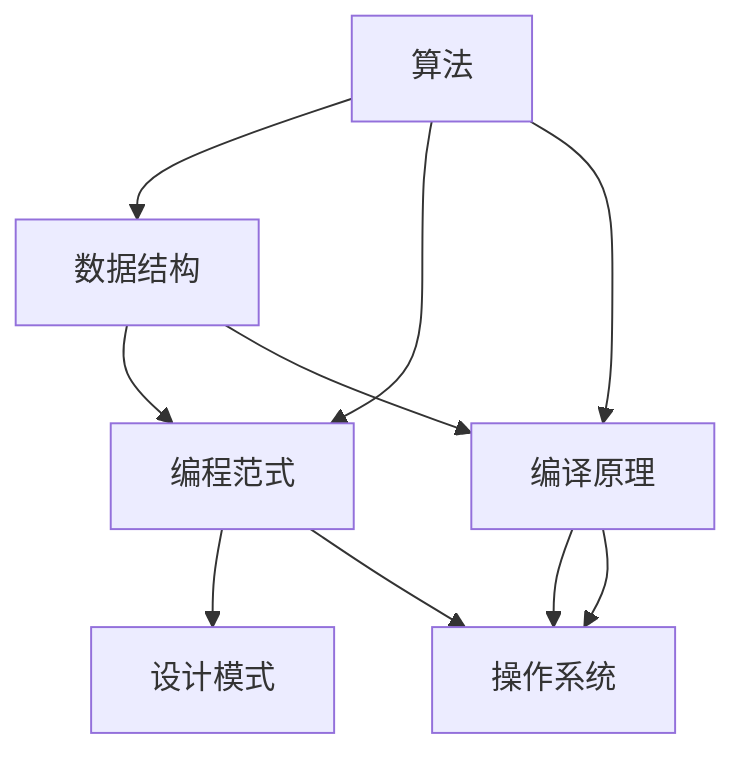

                 

# 经典书籍:夯实认知根基的宝藏

## 1. 背景介绍

在信息技术飞速发展的今天，掌握扎实的计算机知识基础对于每个从事软件开发和人工智能工作的人员来说都是至关重要的。然而，在实际工作和学习过程中，我们经常面临以下几个挑战：

- **知识碎片化**：市面上大量的书籍、文章、课程充斥着各类零碎知识，难以系统化学习。
- **深度理解难**：很多基础概念和算法原理需要长时间学习和实践才能真正掌握。
- **实用性强**：对于初学者来说，书籍中的知识点若不能应用于实践，很难形成有效记忆。
- **前沿进展快**：计算机领域的技术更新速度极快，初学者需要不断跟进最新的动态和趋势。

为了解决上述问题，本文将通过系统化的梳理，为您推荐几本能够夯实计算机认知根基的经典书籍。这些书籍涵盖了计算机科学的基础理论、核心算法和前沿技术，从入门到精通，逐步引领读者走向计算机科学的殿堂。

## 2. 核心概念与联系

### 2.1 核心概念概述

在介绍这些经典书籍之前，我们需要先了解一些核心概念和它们的联系：

- **算法**：计算机科学中的算法是对特定问题的解决步骤或方法的一种描述。算法可以用于数据处理、图像识别、自然语言处理等多个领域。
- **数据结构**：数据结构是组织和管理数据的一种方式，包括数组、链表、树、图等多种类型。
- **编程范式**：编程范式是指程序设计中采用的方法或方式，如过程式编程、面向对象编程、函数式编程等。
- **设计模式**：设计模式是经过实践验证的、可复用的解决方案，用于解决特定场景下的软件设计问题。
- **编译原理**：编译原理涉及源代码到可执行程序的翻译过程，包括词法分析、语法分析、代码生成等步骤。
- **操作系统**：操作系统是管理计算机硬件和软件资源的系统软件，负责处理进程管理、内存管理、文件系统等任务。

这些核心概念之间有着紧密的联系。例如，算法和数据结构是编程的基础，编程范式和设计模式指导编程实践，编译原理是软件开发的底层支持，操作系统则是计算机硬件和软件之间的桥梁。只有理解这些概念及其联系，才能全面掌握计算机科学的知识体系。

### 2.2 核心概念原理和架构的 Mermaid 流程图



## 3. 核心算法原理 & 具体操作步骤

### 3.1 算法原理概述

核心算法原理是计算机科学的核心部分，掌握它们是成为一名优秀程序员的基础。以下是一些经典算法的原理概述：

- **排序算法**：包括冒泡排序、选择排序、插入排序、快速排序、归并排序等，用于对数据进行升序或降序排序。
- **查找算法**：包括线性查找、二分查找、哈希查找等，用于在数据集合中查找特定元素。
- **图算法**：包括广度优先搜索、深度优先搜索、最短路径算法、最小生成树算法等，用于分析和解决图结构相关问题。
- **动态规划**：通过将问题分解成子问题，并保存子问题的解来优化问题求解的过程，常用于优化问题。
- **贪心算法**：每次选择当前最优的解，通过逐步构建得到全局最优解，常用于求解最优化问题。

### 3.2 算法步骤详解

每种算法都有其特定的操作步骤，下面是一些常见算法的详细步骤：

#### 快速排序算法

- 选择一个基准值。
- 将数据分为两部分，小于基准值的部分和大于基准值的部分。
- 递归对两部分数据进行快速排序。
- 合并两部分数据。

#### 二分查找算法

- 将有序数据集合分成两部分。
- 判断目标元素在哪个部分，继续在该部分中进行查找。
- 重复该过程直到找到目标元素或查找结束。

#### 广度优先搜索算法

- 将起始节点加入队列。
- 从队列中取出节点，访问其邻居节点。
- 将邻居节点加入队列，继续搜索。
- 重复该过程直到找到目标节点或搜索结束。

### 3.3 算法优缺点

算法的选择取决于具体问题的特点和性能要求。以下是几种常见算法的优缺点：

- **冒泡排序**：实现简单，但效率低。
- **快速排序**：效率高，但实现复杂。
- **哈希查找**：效率高，但需要额外的空间。
- **深度优先搜索**：能快速找到解决方案，但容易陷入死循环。
- **广度优先搜索**：能找到最优解，但需要大量空间。

### 3.4 算法应用领域

这些核心算法在计算机科学的各个领域中都有广泛应用。例如：

- 排序算法常用于数据库查询、文件系统等。
- 查找算法常用于搜索引擎、数据库索引等。
- 图算法常用于社交网络分析、路由算法等。
- 动态规划常用于计算几何、优化问题等。
- 贪心算法常用于网络流、背包问题等。

## 4. 数学模型和公式 & 详细讲解 & 举例说明

### 4.1 数学模型构建

在计算机科学中，数学模型用于描述和分析算法、数据结构、操作系统等核心概念。例如：

- **时间复杂度**：用于衡量算法执行效率，常用大O记法表示，如$O(n)$、$O(n\log n)$等。
- **空间复杂度**：用于衡量算法和数据结构占用内存大小，也常用大O记法表示。
- **递归关系式**：用于描述递归算法的执行过程，如斐波那契数列等。

### 4.2 公式推导过程

以斐波那契数列为例，其递归关系式为：

$$
f(n) = f(n-1) + f(n-2)
$$

其中，$f(0) = 0, f(1) = 1$。

通过推导可以得到斐波那契数列的通项公式：

$$
f(n) = \frac{1}{\sqrt{5}}\left(\left(\frac{1+\sqrt{5}}{2}\right)^n - \left(\frac{1-\sqrt{5}}{2}\right)^n\right)
$$

### 4.3 案例分析与讲解

在实际应用中，斐波那契数列常用于算法设计和数据结构分析。例如，在斐波那契堆数据结构中，插入、删除、查找最小值等操作的时间复杂度都是$O(1)$，具有极高的效率。

## 5. 项目实践：代码实例和详细解释说明

### 5.1 开发环境搭建

要进行项目实践，首先需要搭建开发环境。以下是Python开发环境搭建的详细步骤：

1. 安装Anaconda：从官网下载并安装Anaconda，用于创建独立的Python环境。

```bash
conda create -n myenv python=3.8
conda activate myenv
```

2. 安装Pip：

```bash
pip install pip
```

3. 安装Python基础库和开发工具：

```bash
pip install numpy pandas matplotlib scikit-learn
```

### 5.2 源代码详细实现

以下是一个使用Python实现的快速排序算法的示例代码：

```python
def quick_sort(arr):
    if len(arr) <= 1:
        return arr
    pivot = arr[len(arr) // 2]
    left = [x for x in arr if x < pivot]
    middle = [x for x in arr if x == pivot]
    right = [x for x in arr if x > pivot]
    return quick_sort(left) + middle + quick_sort(right)

# 测试
arr = [3, 1, 4, 1, 5, 9, 2, 6, 5, 3, 5]
sorted_arr = quick_sort(arr)
print(sorted_arr)
```

### 5.3 代码解读与分析

在上述代码中，我们使用了Python的列表推导式来构建左、中、右三部分数据，并通过递归调用了快速排序函数。该算法的时间复杂度为$O(n\log n)$，空间复杂度为$O(n)$。

## 6. 实际应用场景

### 6.1 数据结构与算法在软件开发中的应用

数据结构和算法是软件开发的核心基础，广泛应用于各种编程任务。以下是一些实际应用场景：

- **算法优化**：通过优化排序算法、查找算法等，提高程序的执行效率。
- **数据结构设计**：选择合适的数据结构，如栈、队列、哈希表等，优化程序的空间和时间复杂度。
- **动态规划**：用于解决复杂问题，如路径规划、背包问题等。

### 6.2 操作系统原理与应用

操作系统是计算机硬件和软件之间的桥梁，其原理与应用在软件开发中具有重要意义。以下是一些实际应用场景：

- **进程管理**：多进程管理、线程调度等，确保程序的稳定性和响应性。
- **内存管理**：内存分配、回收、页面置换等，提高程序的内存利用率。
- **文件系统**：文件读写、目录管理等，实现数据的存储和访问。

## 7. 工具和资源推荐

### 7.1 学习资源推荐

为了帮助读者系统掌握计算机科学的基础理论和核心算法，以下是一些优质的学习资源：

1. **《算法导论》**：作者Thomas H. Cormen，详细讲解了各种经典算法和数据结构，是计算机科学领域的必读书籍。
2. **《数据结构与算法分析》**：作者Robert Sedgewick和Kevin Wayne，讲解了数据结构和算法的基础知识，适合初学者阅读。
3. **《计算机操作系统》**：作者Andrew S. Tanenbaum，讲解了操作系统的原理和应用，是操作系统领域的重要教材。
4. **《深入理解计算机系统》**：作者Randal E. Bryant和David R. O'Hallaron，讲解了计算机系统硬件和软件的各个方面。

### 7.2 开发工具推荐

选择合适的开发工具可以提高编程效率，以下是一些常用的开发工具：

1. **PyCharm**：一款功能强大的Python开发工具，支持多种编程语言，具备完善的IDE特性。
2. **Visual Studio Code**：一款轻量级的代码编辑器，支持各种编程语言和插件。
3. **Git**：一款版本控制系统，用于管理代码的版本和协作开发。
4. **Docker**：一款容器化平台，用于构建和部署应用。

### 7.3 相关论文推荐

以下几篇经典论文是计算机科学领域的里程碑：

1. **《排序和搜索的理论》**：作者C.A.R. Hoare，详细讲解了各种排序和查找算法，是计算机科学领域的经典之作。
2. **《数据结构与算法》**：作者Jon Bentley，讲解了各种数据结构和算法，具有很高的实用价值。
3. **《操作系统概念》**：作者Abraham Silberschatz、Peter B. Galvin和Greg Gagne，讲解了操作系统的原理和应用，是操作系统领域的重要教材。

## 8. 总结：未来发展趋势与挑战

### 8.1 研究成果总结

随着计算机科学的发展，新的算法和数据结构不断涌现，技术趋势也在不断变化。以下是对当前计算机科学领域的研究成果和趋势的总结：

1. **人工智能与深度学习**：深度学习和人工智能技术的快速发展，推动了计算机科学的应用领域。
2. **云计算与分布式系统**：云计算和分布式系统的普及，使得计算机科学的研究和应用更加普及。
3. **安全与隐私保护**：数据隐私和安全问题越来越受到重视，如何保护用户隐私成为了研究热点。
4. **边缘计算与物联网**：边缘计算和物联网技术的发展，为计算机科学的应用提供了新的方向。

### 8.2 未来发展趋势

未来计算机科学的发展趋势将包括以下几个方向：

1. **量子计算**：量子计算的发展将带来计算能力的巨大提升，为计算机科学带来新的突破。
2. **神经网络和深度学习**：神经网络和深度学习将继续发展，解决更多复杂的计算问题。
3. **自动化和智能化**：自动化和智能化技术将进一步普及，提升工作效率和智能化水平。
4. **跨学科融合**：计算机科学与其他学科的融合将带来新的研究热点，如生物计算、化学计算等。

### 8.3 面临的挑战

尽管计算机科学的发展取得了显著成就，但也面临一些挑战：

1. **资源消耗大**：大规模数据和算力消耗成为发展的瓶颈。
2. **算法复杂度高**：复杂算法难以实现和优化。
3. **数据隐私和安全**：数据隐私和安全问题成为研究难点。
4. **跨学科协作**：计算机科学与其他学科的协作难度较大。

### 8.4 研究展望

未来计算机科学的研究方向将包括以下几个方面：

1. **跨学科研究**：计算机科学与其他学科的交叉融合将带来新的研究方向和突破。
2. **计算模式创新**：新的计算模式，如量子计算、生物计算等，将为计算机科学带来新的思路和应用。
3. **自动化与智能化**：自动化和智能化技术将进一步普及，提升工作效率和智能化水平。
4. **数据隐私和安全**：数据隐私和安全问题将成为研究重点，推动相关技术的进步。

## 9. 附录：常见问题与解答

### 9.1 问题1：计算机科学的学习顺序是什么？

答：计算机科学的学习顺序应该是先从基础开始，逐步深入。以下是一些推荐的学习顺序：

1. **数据结构与算法**：掌握基本的数据结构和算法，如数组、链表、排序、查找等。
2. **操作系统**：理解操作系统的基本原理，如进程管理、内存管理、文件系统等。
3. **编程语言**：掌握至少一种编程语言，如C、Python等。
4. **软件工程**：学习软件工程的基本概念和实践，如版本控制、项目管理等。
5. **人工智能与深度学习**：了解人工智能和深度学习的基本原理和应用。

### 9.2 问题2：如何选择适合的编程语言？

答：选择适合的编程语言取决于具体应用场景和个人喜好。以下是一些常见的编程语言及其应用领域：

- **C语言**：系统编程、嵌入式开发、高性能计算等。
- **Python**：数据科学、机器学习、Web开发等。
- **Java**：企业级开发、安卓开发等。
- **JavaScript**：Web前端开发、后端开发等。

### 9.3 问题3：如何提升编程能力？

答：提升编程能力需要不断学习和实践。以下是一些建议：

- **多编程练习**：多做编程练习，提高编程熟练度。
- **阅读源代码**：阅读优秀的开源代码，学习其设计和实现。
- **参与项目**：参与实际项目，积累经验。
- **学习新技术**：不断学习新的编程语言和技术，跟上技术发展趋势。

通过本文的推荐和讲解，相信你对计算机科学有了更深入的理解。从基础知识到核心算法，再到实际应用，一步步构建你的计算机科学认知根基。希望这些经典书籍和资源能够帮助你在未来的学习和工作中，不断提升技术水平，迎接计算机科学的挑战和机遇。

---

作者：禅与计算机程序设计艺术 / Zen and the Art of Computer Programming

