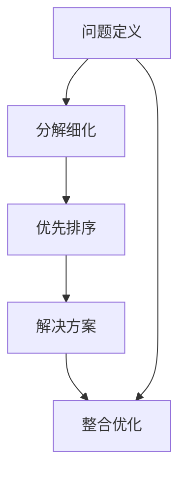

                 

# 结构化思维的应用：从理论到实践

> 关键词：结构化思维, 系统设计, 软件架构, 软件开发, 项目管理, 团队协作

## 1. 背景介绍

### 1.1 问题由来
结构化思维（Structured Thinking）是一种将复杂问题分解为可管理的部分，通过有序、逻辑的推理方式解决问题的思考方法。其核心在于将问题划分为有限的、独立的、明确定义的子问题，并按照一定的逻辑关系依次解决。这种思维方法在软件开发、项目管理、团队协作等众多领域中都有着广泛的应用，被证明是提升效率、降低风险的有效手段。

在当今复杂多变的IT环境中，如何通过结构化思维指导工作，高效应对各种挑战，已成为许多团队和个人亟需掌握的关键技能。本文旨在通过系统性介绍结构化思维的原理和应用方法，帮助读者建立系统思维能力，推动软件开发、项目管理等各项工作的顺利开展。

### 1.2 问题核心关键点
结构化思维方法的核心在于其系统化、模块化的特点。该方法能够帮助从业者构建清晰的思路，在面对复杂问题时，通过逐步分解、逐层解决的方式，有效降低复杂度，提升决策和执行的效率。

具体来说，结构化思维包含以下几个关键步骤：
- 问题定义：明确问题的范围和目标，细化成可管理的小问题。
- 分解细化：将大问题拆分成小问题，逐个分析和解决。
- 优先排序：根据问题的紧迫性和重要性，合理安排处理顺序。
- 解决方案：针对每个小问题，提出具体的解决方案。
- 整合优化：将各小问题的解决方案整合，优化全局方案。

结构化思维的优势在于：

- 能够有效降低复杂性，提高问题的可解性。
- 便于团队协作，明确责任分工。
- 系统化思维有助于长期规划和项目管理。
- 强调逻辑严谨，减少执行错误。

但结构化思维也存在一定的局限性，如可能导致流程过于僵化、创新性不足等。因此，在应用结构化思维时，需要结合具体情况进行灵活调整。

### 1.3 问题研究意义
掌握结构化思维方法，对于提升IT从业者的系统设计能力、项目管理水平以及团队协作效率具有重要意义：

1. **提升问题解决能力**：结构化思维能够帮助开发者更好地分析和理解复杂问题，提出有效的解决方案。
2. **促进项目管理**：在项目管理和软件开发中，结构化思维可以帮助规划工作进度、分配资源，确保项目按时高质量完成。
3. **增强团队协作**：通过明确问题定义和解决方案，便于团队成员理解任务目标，提高合作效率。
4. **支持技术演进**：在技术演进中，结构化思维有助于技术选型和架构设计，为长期发展提供有力支持。

通过系统学习和应用结构化思维，能够显著提升IT领域从业者的综合能力，加速技术创新和应用落地。

## 2. 核心概念与联系

### 2.1 核心概念概述

为了更好地理解结构化思维，首先需明确其核心概念：

- **问题定义（Problem Definition）**：明确问题的边界和目标，细化成具体的小问题。
- **分解细化（Decomposition）**：将大问题拆分成若干个小问题，逐一分析和解决。
- **优先排序（Prioritization）**：根据问题的紧急程度和重要性，合理安排处理顺序。
- **解决方案（Solution）**：针对每个小问题，提出具体的解决方案。
- **整合优化（Integration）**：将各小问题的解决方案整合，形成全局最优方案。

通过这些关键步骤，结构化思维能够帮助我们在复杂问题中找到切入点，逐步推进，最终达成目标。

### 2.2 核心概念原理和架构的 Mermaid 流程图



该流程图展示了结构化思维的主要步骤，每个步骤通过箭头连通，形成一条逻辑清晰、层次分明的问题解决路径。

## 3. 核心算法原理 & 具体操作步骤

### 3.1 算法原理概述

结构化思维的原理基于分治（Divide and Conquer）和递归（Recursion）的思想。通过将复杂问题分解为若干个小问题，并依次解决，最终将各子问题的解合并，形成原问题的解决方案。

在实际应用中，结构化思维的核心算法可以概括为以下几个步骤：

1. **问题定义**：将复杂问题细化为具体的小问题，并明确每个子问题的目标。
2. **分解细化**：针对每个小问题，进一步分解为更小、更易管理的问题。
3. **优先排序**：根据子问题的重要性和紧急程度，进行优先级排序。
4. **解决方案**：针对每个子问题，设计具体的解决方案。
5. **整合优化**：将各子问题的解决方案整合，形成原问题的最优解。

### 3.2 算法步骤详解

以下将详细介绍结构化思维在软件开发、项目管理等具体场景中的应用步骤。

#### 3.2.1 软件开发中的应用

在软件开发中，结构化思维可以帮助团队系统性地规划和实施项目。具体步骤如下：

1. **需求分析**：明确项目需求，细化成具体功能点。
2. **需求分解**：将大功能模块拆分为多个小模块，每个模块独立开发。
3. **优先排序**：根据需求的重要性和紧急程度，安排开发顺序。
4. **设计实现**：针对每个小模块，设计具体的实现方案。
5. **整合测试**：将各小模块整合，进行系统测试，确保功能完整和性能稳定。

#### 3.2.2 项目管理中的应用

在项目管理中，结构化思维可以用于规划项目进度、分配资源。具体步骤如下：

1. **项目规划**：明确项目目标和里程碑，细化成具体任务。
2. **任务分解**：将大任务拆分为多个子任务，每个子任务独立执行。
3. **优先排序**：根据任务的紧急程度和重要性，安排执行顺序。
4. **资源分配**：根据任务需求，合理分配人力、物力资源。
5. **进度监控**：实时监控项目进度，及时调整资源配置，确保项目按时完成。

### 3.3 算法优缺点

结构化思维的优势在于其系统性、逻辑性和可操作性强，能够有效降低复杂性，提高问题解决的效率。但同时，其过程相对繁琐，可能导致创新性不足，特别是在快速变化的环境中，过于细致的分解可能降低灵活性。

### 3.4 算法应用领域

结构化思维广泛应用于软件开发、项目管理、系统设计、团队协作等多个领域，具体包括：

- **软件开发**：需求分析、功能设计、模块划分、测试优化等。
- **项目管理**：项目规划、任务分解、资源配置、进度监控等。
- **系统设计**：架构设计、模块划分、接口设计、性能优化等。
- **团队协作**：任务分工、沟通协调、进度跟踪、风险管理等。

## 4. 数学模型和公式 & 详细讲解 & 举例说明

### 4.1 数学模型构建

结构化思维的数学模型可以形式化地表示为一个图论问题。具体来说，可以将问题表示为一个有向无环图（DAG），每个节点代表一个子问题，每个有向边表示子问题之间的依赖关系。

- **节点（Node）**：表示问题的组成部分，如模块、任务等。
- **边（Edge）**：表示问题之间的依赖关系，如模块之间的调用关系、任务之间的依赖关系等。

### 4.2 公式推导过程

以软件开发中的模块分解为例，设一个大功能模块为M，包含若干个小模块$m_1, m_2, \ldots, m_n$，它们之间的依赖关系可以用有向无环图表示。假设模块$m_i$的完成时间为$t_{m_i}$，模块$m_i$的依赖关系集合为$D_{m_i}$。则模块M的完成时间$t_M$可以表示为：

$$
t_M = \max_{i=1..n} (t_{m_i} + \sum_{d \in D_{m_i}} t_d)
$$

其中$t_d$表示依赖模块$d$的完成时间。

### 4.3 案例分析与讲解

以谷歌的GAngular框架为例，介绍结构化思维在项目中的应用。

谷歌在开发GAngular框架时，采用了结构化思维进行系统规划和设计。项目团队将框架划分为多个小模块，如组件系统、依赖注入、指令系统等。针对每个模块，设计具体的实现方案，并明确模块之间的依赖关系。最终，将这些模块整合，形成了完整的GAngular框架。

这种分解细化的方法，不仅提高了开发效率，还确保了框架的稳定性和可维护性。

## 5. 项目实践：代码实例和详细解释说明

### 5.1 开发环境搭建

在进行结构化思维实践前，我们需要准备好开发环境。以下是使用Python进行项目开发的常用环境配置流程：

1. 安装Python：从官网下载并安装最新版本的Python。
2. 安装Python开发工具：如PyCharm、VSCode等，以便编写和调试代码。
3. 安装版本控制系统：如Git，以便管理和协作开发。

### 5.2 源代码详细实现

以下以构建一个简单的待办事项管理系统的示例，详细介绍结构化思维在软件开发中的应用。

1. **问题定义**：明确系统需求，包括功能模块和界面设计。
2. **分解细化**：将系统划分为多个功能模块，如登录模块、任务管理模块、统计模块等。
3. **优先排序**：根据模块的重要性，安排开发顺序。
4. **设计实现**：针对每个模块，设计具体的实现方案，编写代码。
5. **整合测试**：将各模块整合，进行系统测试，确保功能完整和性能稳定。

以下是具体代码实现：

```python
# 登录模块
class LoginView:
    def __init__(self):
        self.username = ""
        self.password = ""
    
    def login(self, username, password):
        if self.username == username and self.password == password:
            return True
        else:
            return False

# 任务管理模块
class TaskManager:
    def __init__(self):
        self.tasks = []
    
    def add_task(self, task):
        self.tasks.append(task)
    
    def get_tasks(self):
        return self.tasks

# 统计模块
class Stats:
    def __init__(self):
        self.task_count = 0
    
    def count_tasks(self, tasks):
        self.task_count = len(tasks)
    
    def get_task_count(self):
        return self.task_count

# 主模块
class TodoApp:
    def __init__(self):
        self.login_view = LoginView()
        self.task_manager = TaskManager()
        self.stats = Stats()
    
    def run(self):
        is_logged_in = self.login_view.login("username", "password")
        if is_logged_in:
            tasks = self.task_manager.get_tasks()
            self.stats.count_tasks(tasks)
            print(f"已完成任务数量：{self.stats.get_task_count()}")
        else:
            print("登录失败！")
```

### 5.3 代码解读与分析

通过上述代码，我们可以看到，通过结构化思维，我们将一个复杂的待办事项管理系统，分解为登录模块、任务管理模块、统计模块等多个小模块，并设计了具体的实现方案。这种分解细化的方法，不仅提高了开发效率，还确保了系统的稳定性和可维护性。

### 5.4 运行结果展示

通过运行上述代码，系统可以正确地处理用户的登录、添加任务和统计任务数量等操作，实现了待办事项管理系统的基本功能。

## 6. 实际应用场景

### 6.1 软件开发

结构化思维在软件开发中的应用非常广泛。以开发一个电商网站为例，应用结构化思维进行系统规划和设计，可以将网站划分为多个模块，如首页、商品页面、购物车、支付页面等。针对每个模块，设计具体的实现方案，并明确模块之间的依赖关系。最终，将这些模块整合，形成完整的电商网站。

### 6.2 项目管理

在项目管理中，结构化思维可以帮助团队系统性地规划和实施项目。以开发一个移动应用为例，通过结构化思维进行项目规划和任务分解，可以将项目划分为前端开发、后端开发、UI设计、测试等多个子任务，并根据优先级安排执行顺序。最终，通过整合优化，确保项目按时高质量完成。

### 6.3 系统设计

在系统设计中，结构化思维可以用于架构设计和模块划分。以设计一个微服务架构的系统为例，通过结构化思维进行系统划分，将系统划分为多个微服务，每个微服务独立开发和部署。最终，将这些微服务整合，形成完整的系统架构。

### 6.4 团队协作

在团队协作中，结构化思维可以帮助明确任务目标和分工，提高团队效率。以一个软件开发团队为例，通过结构化思维进行任务分解和优先排序，明确每个团队成员的任务和责任，确保各成员高效协作，按时完成任务。

## 7. 工具和资源推荐

### 7.1 学习资源推荐

为了帮助开发者系统掌握结构化思维的原理和应用方法，这里推荐一些优质的学习资源：

1. **《结构化思维：理论、方法与实践》书籍**：全面介绍了结构化思维的理论基础和应用方法，是系统学习的最佳参考。
2. **Coursera的“Design Thinking”课程**：斯坦福大学开设的课程，系统讲解了设计思维和结构化思维的原理和方法。
3. **MindTools网站**：提供丰富的设计思维和项目管理工具，适合初学者快速上手。

### 7.2 开发工具推荐

高效的开发离不开优秀的工具支持。以下是几款用于结构化思维开发的常用工具：

1. **JIRA**：项目管理工具，支持任务分解、优先级排序、进度监控等功能。
2. **Confluence**：团队协作工具，支持文档编辑、任务分配、进度跟踪等。
3. **Lucidchart**：流程图工具，支持创建结构化思维中的有向无环图。
4. **Trello**：项目管理工具，支持任务卡片和看板式管理。

### 7.3 相关论文推荐

结构化思维的研究和应用已经形成了丰富的文献基础，以下是几篇奠基性的相关论文，推荐阅读：

1. **“The Design Thinking Process: Understanding & Managing Innovation”论文**：IDEO的研究报告，详细介绍了设计思维的原理和方法。
2. **“Design Thinking for the Greater Good”论文**：IDEO和哈佛大学共同编写的报告，系统介绍了设计思维在解决社会问题中的应用。
3. **“Design Thinking for Change: A Book of Tools and Practices”书籍**：IDEO出版的书籍，全面介绍了设计思维的工具和方法。

## 8. 总结：未来发展趋势与挑战

### 8.1 总结

本文对结构化思维的原理和应用进行了系统介绍。首先阐述了结构化思维的定义和重要性，明确了其在问题解决、项目管理、团队协作等场景中的核心作用。其次，从理论到实践，详细讲解了结构化思维的主要步骤和方法，给出了具体的代码实现和运行结果。最后，本文探讨了结构化思维在未来软件开发、项目管理等领域的发展趋势和面临的挑战，强调了其在IT技术发展中的重要作用。

通过本文的系统梳理，可以看到，结构化思维能够帮助从业者系统性地解决复杂问题，提升项目管理和团队协作的效率。未来，随着结构化思维的不断演进，必将进一步推动IT技术的发展和应用。

### 8.2 未来发展趋势

展望未来，结构化思维的发展趋势主要体现在以下几个方面：

1. **系统化增强**：未来结构化思维将更加注重系统的完整性和逻辑性，通过构建更复杂、更系统的模型，应对更加复杂的项目需求。
2. **与AI结合**：结构化思维与AI技术的结合将更加紧密，通过机器学习和自动化技术，提升结构化思维的应用效果。
3. **跨学科融合**：结构化思维将与其他学科（如心理学、社会学等）进行更深入的融合，形成更加全面、系统的方法论。
4. **技术演进**：随着技术的不断进步，结构化思维也将迎来新的发展，如通过智能工具提升问题解决效率，通过自动化技术优化任务安排。

### 8.3 面临的挑战

尽管结构化思维在IT领域具有广泛的应用，但在其发展和应用过程中，仍面临一些挑战：

1. **过程复杂**：结构化思维的分解细化过程相对繁琐，可能导致创新性和灵活性不足。
2. **技术依赖**：结构化思维依赖于工具和技术的支持，如项目管理软件、自动化工具等。
3. **人才缺乏**：掌握结构化思维方法需要系统学习和实践，但目前相关人才相对稀缺。
4. **文化差异**：不同团队或组织可能存在文化差异，结构化思维的应用效果会受到团队习惯和组织文化的影响。

### 8.4 研究展望

为了应对这些挑战，未来的研究需要在以下几个方面寻求突破：

1. **简化流程**：开发更加简洁、高效的结构化思维方法和工具，提升应用灵活性。
2. **技术支持**：探索与AI、自动化技术相结合的新方法，提升结构化思维的执行效率。
3. **人才培养**：建立系统化的培训和认证体系，培养更多的结构化思维人才。
4. **文化适应**：加强跨学科合作，推动结构化思维在企业和社会中的广泛应用。

总之，结构化思维的应用和发展仍面临诸多挑战，但只要持续优化和创新，结构化思维必将在IT领域发挥更加重要的作用。

## 9. 附录：常见问题与解答

**Q1：如何理解结构化思维和设计思维的区别？**

A: 结构化思维和设计思维都是系统化思维方法，但侧重点略有不同。结构化思维更注重问题的分解和逐步解决，强调逻辑性和可操作性。而设计思维则更注重创新和用户需求，通过多轮迭代和验证，逐步优化产品设计。

**Q2：如何应对复杂问题时，结构化思维的局限性？**

A: 面对复杂问题时，可以通过以下方法应对结构化思维的局限性：
1. **灵活分解**：根据问题特点，灵活调整问题的分解方式，保持灵活性。
2. **多轮迭代**：通过多轮迭代和反馈，逐步优化问题解决方案。
3. **引入新方法**：引入新的思维方法和技术，提升问题解决能力。

**Q3：结构化思维在团队协作中如何发挥作用？**

A: 在团队协作中，结构化思维可以通过以下方式发挥作用：
1. **明确任务目标**：通过问题定义和分解，明确团队成员的任务和目标。
2. **合理安排**：根据任务紧急程度和重要性，合理分配资源和安排执行顺序。
3. **实时监控**：实时监控项目进度，及时调整任务和资源配置。

**Q4：结构化思维在软件开发中的具体应用案例有哪些？**

A: 结构化思维在软件开发中的应用非常广泛，以下是几个具体案例：
1. **电商网站开发**：将网站划分为登录模块、商品页面、购物车、支付页面等多个子模块，逐步开发和集成。
2. **移动应用开发**：将应用划分为前端、后端、UI设计、测试等多个子任务，按照优先级安排执行。
3. **API开发**：将API划分为接口定义、实现、测试等多个子任务，逐步开发和集成。

通过这些案例，可以看到，结构化思维在软件开发中具有显著的优势，能够提升开发效率和系统稳定性。

**Q5：结构化思维在项目管理中的应用有哪些具体步骤？**

A: 在项目管理中，结构化思维可以通过以下步骤应用：
1. **项目规划**：明确项目目标和里程碑，细化成具体任务。
2. **任务分解**：将大任务拆分为多个子任务，每个子任务独立执行。
3. **优先排序**：根据任务的紧急程度和重要性，安排执行顺序。
4. **资源分配**：根据任务需求，合理分配人力、物力资源。
5. **进度监控**：实时监控项目进度，及时调整资源配置，确保项目按时完成。

通过这些步骤，结构化思维能够系统性地规划和管理项目，提升项目管理的效率和效果。

---

作者：禅与计算机程序设计艺术 / Zen and the Art of Computer Programming

