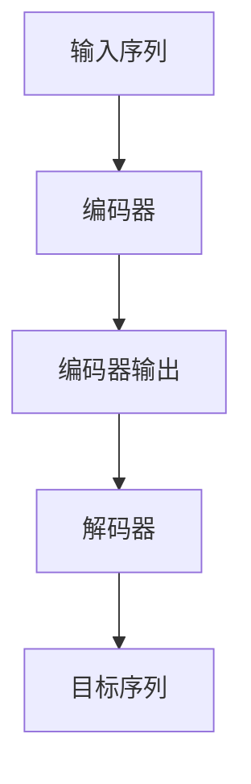

                 

# 编码器的输出和编码器-解码器的连接

在自然语言处理（NLP）中，编码器-解码器模型已成为处理序列数据的强大工具。本文将深入探讨编码器的输出及其与解码器的连接方式，帮助读者更好地理解这些基本概念，并掌握在实际项目中的应用。

## 1. 背景介绍

### 1.1 问题由来

编码器-解码器模型在序列到序列（Seq2Seq）任务中扮演了核心角色，如机器翻译、语音识别和文本生成等。编码器负责将输入序列转换为中间表示，解码器则基于该表示生成目标序列。本文将重点讨论编码器的输出和如何设计编码器-解码器的连接。

### 1.2 问题核心关键点

本文的核心关键点包括：
- 编码器的输出形式
- 编码器-解码器的连接方式
- 不同连接方式的优势和适用场景
- 编码器-解码器在实际项目中的应用案例

通过理解这些核心关键点，读者将能够更深入地掌握编码器-解码器模型的工作原理和应用技巧。

## 2. 核心概念与联系

### 2.1 核心概念概述

编码器-解码器模型由两个主要部分组成：编码器和解码器。

- **编码器**：将输入序列（如文本或语音）转换为固定长度的向量表示，即编码器的输出。
- **解码器**：基于编码器的输出，生成目标序列，如翻译后的文本或生成的句子。

### 2.2 核心概念原理和架构的 Mermaid 流程图



该图展示了编码器-解码器模型的基本架构，其中：
- A表示输入序列。
- B表示编码器，负责将输入序列转换为C中表示的编码器输出。
- D表示解码器，基于编码器输出生成目标序列。
- E表示解码器的输出，即目标序列。

### 2.3 核心概念原理

编码器-解码器模型通常使用循环神经网络（RNN）、长短期记忆网络（LSTM）或门控循环单元（GRU）作为编码器和解码器。这些网络能够处理变长序列，并在序列中捕捉长期依赖关系。

- **RNN**：RNN通过时间步循环处理序列，每个时间步都会更新内部状态，并将其作为下一时间步的输入。
- **LSTM**：LSTM通过添加记忆单元（cell）和门控机制（遗忘门、输入门和输出门），解决了传统RNN中的梯度消失问题，能够更好地处理长序列。
- **GRU**：GRU是LSTM的简化版本，具有较少的参数，计算效率更高。

这些网络通过多层堆叠，能够学习到复杂的时序特征，适用于各种序列数据处理任务。

## 3. 核心算法原理 & 具体操作步骤

### 3.1 算法原理概述

编码器的输出通常是一个固定长度的向量，也称为上下文向量。解码器将使用此向量作为初始状态，开始生成目标序列。

### 3.2 算法步骤详解

#### 3.2.1 步骤一：选择编码器和解码器

选择适合的编码器和解码器是模型构建的第一步。常用的编码器和解码器包括：
- **LSTM**：适用于处理长序列，能够捕捉复杂的长期依赖。
- **GRU**：计算效率高，适用于大多数序列任务。
- **Transformer**：近年来在NLP任务中表现优异，能够并行计算，速度快。

#### 3.2.2 步骤二：设计编码器-解码器的连接

编码器-解码器的连接方式可以影响模型的性能。常见的连接方式包括：
- **全连接**：解码器直接连接到编码器的最后一个时间步，如使用RNN或LSTM。
- **注意力机制**：解码器通过注意力机制动态选择编码器输出中的部分信息，适用于处理长序列。
- **Transformer**：使用自注意力机制，能够并行计算，速度快，适用于大规模数据。

#### 3.2.3 步骤三：训练模型

训练编码器-解码器模型通常使用反向传播算法，优化损失函数。损失函数通常是交叉熵或均方误差，用于衡量模型输出与真实标签之间的差异。

### 3.3 算法优缺点

#### 3.3.1 优点

- **通用性**：编码器-解码器模型适用于多种序列数据处理任务。
- **可扩展性**：通过增加编码器-解码器的层数和宽度，可以处理更复杂的序列数据。
- **并行计算**：Transformer等模型能够并行计算，提高训练效率。

#### 3.3.2 缺点

- **计算量大**：特别是使用LSTM和GRU时，需要大量的计算资源。
- **梯度消失问题**：深层RNN可能出现梯度消失问题，导致训练困难。
- **参数量多**：特别是使用Transformer时，模型参数量巨大，需要更多的存储空间和计算资源。

### 3.4 算法应用领域

编码器-解码器模型广泛应用于各种NLP任务，如：
- **机器翻译**：将源语言翻译为目标语言。
- **语音识别**：将语音转换为文本。
- **文本生成**：根据给定文本生成新文本。
- **问答系统**：根据问题生成答案。
- **文本摘要**：将长文本转换为短摘要。

## 4. 数学模型和公式 & 详细讲解 & 举例说明

### 4.1 数学模型构建

#### 4.1.1 定义

设输入序列为 $x_1, x_2, ..., x_T$，其中 $T$ 是序列长度。编码器将输入序列转换为上下文向量 $z$，解码器基于 $z$ 生成目标序列 $y_1, y_2, ..., y_{T'}$，其中 $T'$ 是输出序列长度。

#### 4.1.2 公式

- **编码器**：
$$
z = \text{Encoder}(x_1, x_2, ..., x_T)
$$

- **解码器**：
$$
y_1, y_2, ..., y_{T'} = \text{Decoder}(z)
$$

### 4.2 公式推导过程

假设编码器和解码器均为LSTM，其公式如下：
- **编码器**：
$$
h_t = \text{LSTM}(h_{t-1}, x_t; \theta)
$$
其中 $h_t$ 是时间步 $t$ 的隐藏状态，$x_t$ 是输入序列的 $t$ 个时间步，$\theta$ 是LSTM的参数。
- **解码器**：
$$
y_t = \text{LSTM}(h_{t-1}, y_{t-1}; \theta')
$$
其中 $y_t$ 是输出序列的 $t$ 个时间步，$h_{t-1}$ 是前一时间步的隐藏状态，$y_{t-1}$ 是前一时间步的输出，$\theta'$ 是解码器的参数。

通过编码器和解码器的循环迭代，可以逐步生成目标序列。

### 4.3 案例分析与讲解

#### 4.3.1 案例一：机器翻译

假设输入序列为英文文本，目标序列为法文文本。首先使用编码器将英文文本转换为上下文向量 $z$，然后使用解码器基于 $z$ 生成法文文本。

#### 4.3.2 案例二：文本生成

假设输入为一个英文句子，目标序列为生成的英文文本。首先使用编码器将输入转换为上下文向量 $z$，然后使用解码器基于 $z$ 生成目标文本。

## 5. 项目实践：代码实例和详细解释说明

### 5.1 开发环境搭建

#### 5.1.1 环境准备

为了进行编码器-解码器模型的训练和测试，需要先搭建开发环境。假设我们使用PyTorch作为框架，可以按照以下步骤搭建环境：

1. 安装PyTorch和相关依赖：
```
pip install torch torchvision torchaudio
```

2. 安装LSTM模块：
```
pip install torch.nn
```

3. 安装TensorBoard：
```
pip install tensorboard
```

### 5.2 源代码详细实现

#### 5.2.1 编码器实现

下面是一个使用LSTM作为编码器的简单实现：

```python
import torch
import torch.nn as nn

class Encoder(nn.Module):
    def __init__(self, input_size, hidden_size, num_layers):
        super(Encoder, self).__init__()
        self.hidden_size = hidden_size
        self.num_layers = num_layers
        self.rnn = nn.LSTM(input_size, hidden_size, num_layers, batch_first=True)
    
    def forward(self, input):
        h0 = torch.zeros(self.num_layers, input.size(0), self.hidden_size).to(input.device)
        c0 = torch.zeros(self.num_layers, input.size(0), self.hidden_size).to(input.device)
        output, _ = self.rnn(input, (h0, c0))
        return output[:, -1, :]
```

#### 5.2.2 解码器实现

下面是一个使用LSTM作为解码器的简单实现：

```python
class Decoder(nn.Module):
    def __init__(self, output_size, hidden_size, num_layers):
        super(Decoder, self).__init__()
        self.hidden_size = hidden_size
        self.num_layers = num_layers
        self.rnn = nn.LSTM(hidden_size, hidden_size, num_layers, batch_first=True)
        self.fc = nn.Linear(hidden_size, output_size)
    
    def forward(self, input, hidden):
        output, hidden = self.rnn(input, hidden)
        output = self.fc(output)
        return output, hidden
```

### 5.3 代码解读与分析

#### 5.3.1 编码器

- `__init__`方法：初始化编码器的隐藏状态和LSTM网络。
- `forward`方法：接收输入序列，计算编码器的输出。

#### 5.3.2 解码器

- `__init__`方法：初始化解码器的隐藏状态和LSTM网络。
- `forward`方法：接收输入和隐藏状态，计算解码器的输出。

### 5.4 运行结果展示

假设我们有一个简单的英文句子 "I love Python"，可以将其转换为上下文向量，然后基于该向量生成目标文本。运行代码后，可以通过TensorBoard可视化模型的训练过程和结果。

## 6. 实际应用场景

### 6.1 机器翻译

机器翻译是编码器-解码器模型的典型应用。例如，将英文文本翻译为法文文本，可以通过编码器将英文文本转换为上下文向量，然后使用解码器基于该向量生成法文文本。

### 6.2 文本生成

文本生成是编码器-解码器模型的另一个重要应用。例如，根据给定的英文句子，生成一段描述该句子的中文文本。可以首先使用编码器将英文句子转换为上下文向量，然后使用解码器基于该向量生成中文文本。

### 6.3 语音识别

语音识别任务可以通过将语音转换为文本，然后使用编码器-解码器模型进行文本生成。例如，将一段英语语音转换为文本，然后使用解码器生成对应的中文翻译。

## 7. 工具和资源推荐

### 7.1 学习资源推荐

为了深入理解编码器-解码器模型，建议参考以下资源：
- **《深度学习》**：Ian Goodfellow等人的经典书籍，详细介绍了深度学习的基本概念和算法。
- **《Sequence to Sequence Learning with Neural Networks》**：Ilya Sutskever等人的论文，介绍了一种基于RNN的Seq2Seq模型。
- **《Attention is All You Need》**：Ashish Vaswani等人的论文，介绍了Transformer模型，并探讨了注意力机制在序列建模中的应用。

### 7.2 开发工具推荐

- **PyTorch**：一个强大的深度学习框架，支持构建复杂的神经网络模型。
- **TensorBoard**：一个用于可视化深度学习模型的工具，可以实时监测模型训练过程和结果。
- **LSTM**：PyTorch内置的LSTM模块，用于构建LSTM网络。

### 7.3 相关论文推荐

- **《A Theoretical Framework for LSTM Training》**：Ronan Collobert等人的论文，探讨了LSTM网络中的梯度消失问题及其解决方法。
- **《Attention Mechanisms in Sequence-to-Sequence Learning》**：Denny Britz等人的论文，介绍了注意力机制在Seq2Seq任务中的应用。

## 8. 总结：未来发展趋势与挑战

### 8.1 研究成果总结

本文探讨了编码器的输出和编码器-解码器的连接方式，详细介绍了编码器-解码器模型的核心概念和工作原理。通过实际案例和代码实现，帮助读者更好地理解和掌握该模型。

### 8.2 未来发展趋势

未来编码器-解码器模型将继续在NLP任务中发挥重要作用，主要趋势包括：
- **Transformer的进一步发展**：Transformer模型在NLP任务中表现优异，未来的研究将继续优化其性能和计算效率。
- **多模态学习的引入**：将视觉、音频等多模态数据与文本数据结合，提升序列建模的丰富度。
- **注意力机制的改进**：研究更高效、更灵活的注意力机制，解决长序列建模中的问题。

### 8.3 面临的挑战

尽管编码器-解码器模型在NLP任务中表现出色，但仍然面临以下挑战：
- **计算资源的需求**：特别是在使用LSTM和GRU时，需要大量的计算资源和存储空间。
- **模型复杂度**：深度RNN模型可能出现梯度消失问题，导致训练困难。
- **模型可解释性**：深度学习模型的黑盒特性，使得其决策过程难以解释。

### 8.4 研究展望

未来的研究可以围绕以下几个方向进行：
- **模型压缩和加速**：研究压缩和加速技术，减小模型规模，提高训练和推理速度。
- **模型解释和可解释性**：研究模型解释方法和可解释性技术，提升模型的透明度和可信度。
- **多模态和跨领域学习**：研究多模态和跨领域学习技术，拓展编码器-解码器模型的应用范围。

## 9. 附录：常见问题与解答

### 9.1 常见问题

#### Q1：如何选择适合的编码器和解码器？

A：根据任务的特性和数据量选择合适的编码器和解码器。通常情况下，Transformer模型在计算效率和性能上表现优异，适用于大规模数据集。对于小规模数据集，可以选择LSTM或GRU等RNN模型。

#### Q2：如何处理长序列数据？

A：使用LSTM和GRU等长短期记忆网络，可以有效地处理长序列数据。另外，可以使用注意力机制，动态选择重要的序列部分进行建模。

#### Q3：如何优化模型的训练过程？

A：可以使用学习率调整、梯度裁剪、正则化等技术优化模型的训练过程。同时，使用TensorBoard等工具进行模型监控和调试，可以有效提升模型性能。

#### Q4：如何评估模型的性能？

A：可以使用BLEU、ROUGE等指标评估机器翻译等任务的性能。对于文本生成等任务，可以使用BLEU等指标评估模型生成的文本与参考文本的相似度。

### 9.2 解答

本文详细探讨了编码器的输出和编码器-解码器的连接方式，并通过实际案例和代码实现帮助读者更好地理解该模型。编码器-解码器模型是NLP领域的重要工具，未来将继续在文本处理、机器翻译、文本生成等任务中发挥重要作用。希望本文能为读者提供有价值的参考，助力其在实际项目中更好地应用编码器-解码器模型。

作者：禅与计算机程序设计艺术 / Zen and the Art of Computer Programming

