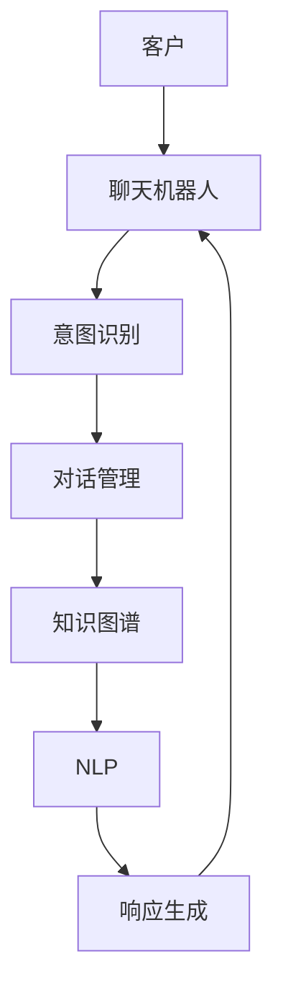

                 

# 聊天机器人客户服务：即时支持和帮助

> 关键词：聊天机器人, 客户服务, 即时支持, 帮助系统, 自然语言处理, 人工智能, 机器学习

## 1. 背景介绍

### 1.1 问题由来
在数字化时代，企业与客户的互动方式日益多样化和即时化。传统的客户服务模式，如电话热线、邮件反馈、人工客服等，已难以满足客户对快速响应的需求。同时，客户对服务质量的要求也在不断提高，希望获得及时、专业、个性化的解答和支持。

然而，企业要构建一个能够快速响应、准确解答的客户服务系统，面临着多重挑战：
- **成本高**：传统人工客服模式成本昂贵，特别是在高峰期，需要配备大量人力。
- **效率低**：人工客服的响应速度慢，且存在时间、空间等限制。
- **一致性差**：不同客服人员的回答风格和知识水平参差不齐，影响客户体验。
- **数据难以积累**：客户服务记录分散存储，难以用于系统优化和知识复用。

为了解决这些问题，企业开始探索利用人工智能技术构建智能客户服务系统，其中聊天机器人（Chatbot）是最为前沿和有效的解决方案之一。

### 1.2 问题核心关键点
聊天机器人是基于自然语言处理（NLP）和人工智能技术，能够通过对话与客户进行互动的系统。其核心关键点包括：
- **自然语言理解**：机器人能够理解和处理自然语言，对客户输入的文本进行解析和理解。
- **意图识别**：识别客户的意图，判断其需要何种服务，如查询、投诉、建议等。
- **知识库管理**：机器人依赖知识库，存储常见问题及其解答，确保提供的信息准确可靠。
- **对话管理**：管理对话流程，根据客户意图引导对话，提供最优解答。
- **反馈学习**：不断从对话中学习，提高准确性和服务质量。

聊天机器人通过这些关键技术，能够实现即时响应客户需求，提供个性化服务，大幅提升客户满意度，降低企业运营成本。

### 1.3 问题研究意义
研究聊天机器人客户服务系统的构建和优化，具有重要意义：
- **降低成本**：聊天机器人可以24/7不间断服务，显著降低人力成本。
- **提高效率**：快速响应客户需求，缩短等待时间，提升服务效率。
- **增强一致性**：机器人的回答基于统一的知识库，保证服务质量的一致性。
- **优化体验**：通过个性化互动和智能推荐，提升客户服务体验。
- **数据积累**：记录和分析客户对话，为企业提供数据支持。

## 2. 核心概念与联系

### 2.1 核心概念概述

聊天机器人客户服务系统的核心概念主要包括以下几点：

- **自然语言处理（NLP）**：使计算机能够理解和处理自然语言的技术，包括语音识别、语义理解、情感分析等。
- **知识图谱（KG）**：一种图形化知识表示方式，用于组织和查询大量半结构化或非结构化数据。
- **意图识别**：从用户输入中识别出用户的意图，是聊天机器人对话的核心。
- **对话管理**：管理和控制聊天机器人的对话流程，包括状态管理、上下文维护等。
- **机器学习（ML）**：使机器人能够从对话中学习，不断提升服务质量。
- **即时通信协议**：如WebSocket、HTTP等，用于实现机器人与客户之间的实时通信。

这些概念之间相互关联，共同构成了一个完整的聊天机器人客户服务系统。

### 2.2 核心概念原理和架构的 Mermaid 流程图



这个流程图展示了聊天机器人客户服务系统的主要流程：

1. 客户通过即时通信协议向聊天机器人发送输入。
2. 聊天机器人接收输入，经过意图识别模块分析客户的意图。
3. 对话管理模块根据意图调用相应的服务流程，并在知识图谱中查找相关信息。
4. 自然语言处理模块对信息进行处理，生成自然语言的响应。
5. 响应返回给客户，完成一个对话周期。

这些步骤中，每个模块都依赖于其他模块，共同保证了系统的顺畅运行。

## 3. 核心算法原理 & 具体操作步骤

### 3.1 算法原理概述

聊天机器人客户服务系统基于深度学习和自然语言处理技术，核心算法原理包括以下几个方面：

- **序列到序列模型（Seq2Seq）**：通过编码器-解码器结构，将输入序列映射到输出序列。常用的模型包括LSTM、GRU等。
- **注意力机制（Attention）**：帮助模型在处理长序列时，更加关注关键信息。
- **意图识别算法**：如基于规则的方法、基于模板的方法、基于机器学习的方法等。
- **对话管理算法**：如基于状态机的对话管理、基于记忆的对话管理等。
- **知识图谱嵌入算法**：如TransE、DistMult等，将实体和关系嵌入向量空间，方便机器理解。

### 3.2 算法步骤详解

#### 3.2.1 意图识别

意图识别是聊天机器人客户服务系统的核心步骤之一。其基本步骤如下：

1. **输入预处理**：对客户输入进行分词、标准化、去除停用词等预处理操作。
2. **特征提取**：使用词袋模型、TF-IDF等方法提取文本特征。
3. **模型训练**：使用监督学习算法（如SVM、LR、CNN、RNN等）训练意图识别模型。
4. **意图分类**：将处理后的文本输入模型，得到意图分类结果。

例如，可以使用基于CNN的意图识别模型，其基本结构如下：

$$
\text{Intent} = \text{CNN}(\text{input\_seq})
$$

其中，$\text{input\_seq}$为输入序列，$\text{Intent}$为意图分类结果。

#### 3.2.2 对话管理

对话管理负责维护对话状态，根据当前状态和客户意图，选择相应的响应。其基本步骤如下：

1. **状态初始化**：定义对话的状态集合，并初始化对话状态。
2. **状态转移**：根据当前状态和客户意图，选择下一个状态。
3. **响应生成**：根据当前状态和客户意图，从知识图谱中查找相关信息，生成响应。

例如，可以使用基于状态机的对话管理模型，其基本结构如下：

$$
\text{State}_{i+1} = \text{TransitionFunction}(\text{State}_i, \text{Intent}_i, \text{KG})
$$

其中，$\text{State}_{i+1}$为下一个对话状态，$\text{TransitionFunction}$为状态转移函数，$\text{KG}$为知识图谱。

#### 3.2.3 知识图谱嵌入

知识图谱嵌入是将实体和关系转换为向量表示的过程。其基本步骤如下：

1. **图谱构建**：构建知识图谱，存储实体和关系。
2. **关系映射**：将关系映射为向量，使用TransE等算法。
3. **实体嵌入**：使用Multi-Layer Perceptron等模型，将实体转换为向量。
4. **嵌入融合**：将实体和关系的向量进行融合，得到最终的向量表示。

例如，可以使用基于TransE的关系映射方法，其基本结构如下：

$$
\text{RelationEmbedding} = \text{TransE}(\text{Relation})
$$

其中，$\text{RelationEmbedding}$为关系向量，$\text{Relation}$为关系。

#### 3.2.4 响应生成

响应生成是将知识图谱中的信息转换为自然语言的过程。其基本步骤如下：

1. **信息提取**：从知识图谱中提取相关信息。
2. **格式化**：将信息格式化为自然语言句式。
3. **语言生成**：使用语言生成模型（如Seq2Seq、Transformer等）生成响应。

例如，可以使用基于Seq2Seq的响应生成模型，其基本结构如下：

$$
\text{Response} = \text{Seq2Seq}(\text{KGInfo})
$$

其中，$\text{KGInfo}$为知识图谱中的信息，$\text{Response}$为生成的自然语言响应。

### 3.3 算法优缺点

#### 3.3.1 优点

聊天机器人客户服务系统的优点包括：

- **24/7服务**：聊天机器人可以全天候不间断服务，满足客户即时需求。
- **快速响应**：相比人工客服，聊天机器人响应速度更快，客户等待时间更短。
- **一致性高**：机器人根据统一的知识库进行回答，确保服务质量的一致性。
- **成本低**：相较于人工客服，聊天机器人节省了大量人力成本。
- **数据积累**：系统可以记录和分析对话，为企业提供数据支持。

#### 3.3.2 缺点

聊天机器人客户服务系统的缺点包括：

- **准确性依赖数据**：聊天机器人的回答质量依赖于知识库和对话历史。
- **理解限制**：当前技术下，机器对复杂语境和隐含含义的理解还较为有限。
- **交互体验有待提升**：机器人的回答可能缺乏情感和个性化，影响用户体验。
- **知识库维护困难**：知识库的构建和维护需要大量人工投入，且更新速度较慢。

### 3.4 算法应用领域

聊天机器人客户服务系统已经在多个领域得到广泛应用，包括但不限于：

- **电商平台**：如亚马逊、淘宝等，提供即时购物咨询、订单查询、退货处理等服务。
- **金融服务**：如银行、保险公司，提供金融咨询、账户管理、理赔申请等服务。
- **医疗健康**：如医院、药店，提供医疗咨询、预约挂号、药品查询等服务。
- **旅游服务**：如携程、途牛等，提供旅行咨询、酒店预订、行程安排等服务。
- **教育培训**：如Coursera、edX等，提供课程咨询、学习建议、作业解答等服务。

以上仅是部分应用领域，随着技术的发展，聊天机器人将在更多场景中发挥重要作用。

## 4. 数学模型和公式 & 详细讲解

### 4.1 数学模型构建

聊天机器人客户服务系统涉及多个数学模型，包括意图识别模型、对话管理模型、响应生成模型等。这里以Seq2Seq模型为例，进行详细讲解。

#### 4.1.1 编码器-解码器模型

Seq2Seq模型由编码器和解码器两个部分组成，其基本结构如下：

$$
\text{Encoder}(\text{input\_seq}) \rightarrow \text{Hidden} \rightarrow \text{Decoder}(\text{Hidden})
$$

其中，$\text{input\_seq}$为输入序列，$\text{Encoder}$为编码器，$\text{Decoder}$为解码器，$\text{Hidden}$为中间向量。

#### 4.1.2 编码器结构

编码器通常使用RNN（如LSTM、GRU）或Transformer等模型，将输入序列转换为中间向量。以LSTM编码器为例，其基本结构如下：

$$
\text{Hidden} = \text{LSTM}(\text{input\_seq})
$$

其中，$\text{Hidden}$为中间向量，$\text{input\_seq}$为输入序列。

#### 4.1.3 解码器结构

解码器通常使用RNN或Transformer等模型，将中间向量转换为输出序列。以LSTM解码器为例，其基本结构如下：

$$
\text{Output} = \text{LSTM}(\text{Hidden})
$$

其中，$\text{Output}$为输出序列，$\text{Hidden}$为中间向量。

#### 4.1.4 训练目标

Seq2Seq模型的训练目标是最大化目标序列的概率，即：

$$
\text{Loss} = -\log P(\text{Output}|\text{input\_seq})
$$

其中，$P$表示目标序列的概率，$\text{Output}$为输出序列，$\text{input\_seq}$为输入序列。

### 4.2 公式推导过程

#### 4.2.1 编码器推导

以LSTM编码器为例，其基本推导如下：

$$
\text{Hidden}_t = \text{tanh}(\text{W}_i \cdot [\text{Concat}(\text{Input}_t, \text{Hidden}_{t-1})] + \text{b}_i)
$$

$$
\text{Cell}_t = \text{sigmoid}(\text{W}_f \cdot [\text{Concat}(\text{Input}_t, \text{Hidden}_{t-1})] + \text{b}_f) \cdot \text{Hidden}_{t-1}
$$

$$
\text{Cell}_t = \text{Cell}_t + \text{Cell}_{t-1} \cdot (1 - \text{Cell}_t)
$$

$$
\text{Hidden}_t = \text{Cell}_t
$$

其中，$\text{tanh}$表示双曲正切函数，$\text{sigmoid}$表示Sigmoid函数，$\text{W}$表示权重矩阵，$\text{b}$表示偏置向量，$\text{Concat}$表示连接操作。

#### 4.2.2 解码器推导

以LSTM解码器为例，其基本推导如下：

$$
\text{Hidden}_t = \text{tanh}(\text{W}_i \cdot [\text{Concat}(\text{Input}_t, \text{Hidden}_{t-1})] + \text{b}_i)
$$

$$
\text{Cell}_t = \text{sigmoid}(\text{W}_f \cdot [\text{Concat}(\text{Input}_t, \text{Hidden}_{t-1})] + \text{b}_f) \cdot \text{Hidden}_{t-1}
$$

$$
\text{Cell}_t = \text{Cell}_t + \text{Cell}_{t-1} \cdot (1 - \text{Cell}_t)
$$

$$
\text{Hidden}_t = \text{Cell}_t
$$

其中，$\text{tanh}$表示双曲正切函数，$\text{sigmoid}$表示Sigmoid函数，$\text{W}$表示权重矩阵，$\text{b}$表示偏置向量，$\text{Concat}$表示连接操作。

#### 4.2.3 训练目标推导

以LSTM模型为例，其训练目标推导如下：

$$
\text{Loss} = -\log \sum_{i=1}^{T} P(\text{Output}_t|\text{input\_seq}, \text{Hidden}_{t-1})
$$

其中，$P$表示目标序列的概率，$\text{Output}_t$为第$t$个输出，$\text{input\_seq}$为输入序列，$\text{Hidden}_{t-1}$为上一个时间步的中间向量。

### 4.3 案例分析与讲解

以电商平台客服机器人为例，进行详细讲解。

#### 4.3.1 意图识别

电商平台客服机器人的意图识别模型通常使用基于规则的方法或基于机器学习的方法。以基于规则的方法为例，其基本流程如下：

1. **规则定义**：定义常见的购物意图，如查询商品、下单、退货等。
2. **规则匹配**：将客户输入与规则进行匹配，得到匹配结果。
3. **意图分类**：根据匹配结果，分类客户意图。

例如，规则定义如下：

```
IF "查询" THEN Intent = "查询"
IF "下单" THEN Intent = "下单"
IF "退货" THEN Intent = "退货"
```

#### 4.3.2 对话管理

电商平台客服机器人的对话管理模型通常使用基于状态机的方法。以订单管理为例，其基本流程如下：

1. **状态定义**：定义订单状态，如未下单、下单中、已下单、已发货、已收货等。
2. **状态转移**：根据客户意图和订单状态，选择下一个状态。
3. **响应生成**：根据订单状态和客户意图，生成相应响应。

例如，状态转移如下：

```
UNDERLINE = "订单未下单"
PLACEORDER = "订单下单中"
SHIP = "订单已发货"
RECEIVE = "订单已收货"

IF Intent = "下单" THEN State = PLACEORDER
IF Intent = "查询" THEN State = UNDERLINE
IF Intent = "退货" THEN State = SHIP
```

#### 4.3.3 响应生成

电商平台客服机器人的响应生成模型通常使用基于规则的方法或基于深度学习的方法。以基于规则的方法为例，其基本流程如下：

1. **规则定义**：定义常见的响应模板，如订单查询、下单成功、退货申请等。
2. **模板匹配**：将订单状态和客户意图与响应模板进行匹配，得到匹配结果。
3. **响应生成**：根据匹配结果，生成响应。

例如，响应模板如下：

```
IF State = PLACEORDER THEN Response = "您的订单已下单成功，预计XX天后发货"
IF State = SHIP THEN Response = "您的订单已发货，预计XX天后到达"
IF State = RECEIVE THEN Response = "您的订单已收货"
```

## 5. 项目实践：代码实例和详细解释说明

### 5.1 开发环境搭建

#### 5.1.1 安装Python和相关库

首先，安装Python和相关库：

```
pip install numpy pandas scikit-learn tensorflow transformers
```

#### 5.1.2 安装TensorFlow

安装TensorFlow，并配置GPU环境：

```
pip install tensorflow-gpu==2.6.0
```

#### 5.1.3 安装Transformers

安装Transformers库：

```
pip install transformers
```

#### 5.1.4 安装TensorBoard

安装TensorBoard，用于可视化训练过程：

```
pip install tensorboard
```

### 5.2 源代码详细实现

#### 5.2.1 意图识别模型

意图识别模型通常使用基于规则的方法或基于深度学习的方法。这里以基于规则的方法为例，实现意图识别模型：

```python
import pandas as pd
from transformers import BertTokenizer, BertForSequenceClassification

class IntentClassifier:
    def __init__(self, model_name):
        self.model_name = model_name
        self.tokenizer = BertTokenizer.from_pretrained(model_name)
        self.model = BertForSequenceClassification.from_pretrained(model_name, num_labels=2)
        
    def predict(self, text):
        encoded_input = self.tokenizer(text, return_tensors='pt')
        outputs = self.model(**encoded_input)
        logits = outputs.logits
        predicted_label = logits.argmax().item()
        return predicted_label
```

#### 5.2.2 对话管理模型

对话管理模型通常使用基于状态机的方法。这里以订单管理为例，实现对话管理模型：

```python
class OrderManager:
    def __init__(self):
        self.states = {"UNDERLINE": 0, "PLACEORDER": 1, "SHIP": 2, "RECEIVE": 3}
        self.state = "UNDERLINE"
        
    def transition(self, intent):
        if intent == "下单":
            self.state = "PLACEORDER"
        elif intent == "查询":
            self.state = "UNDERLINE"
        elif intent == "退货":
            self.state = "SHIP"
        return self.state
        
    def generate_response(self, state, intent):
        if state == "UNDERLINE":
            return "欢迎购买，请告诉我您的需求"
        elif state == "PLACEORDER":
            return "您的订单已下单成功，预计XX天后发货"
        elif state == "SHIP":
            return "您的订单已发货，预计XX天后到达"
        elif state == "RECEIVE":
            return "您的订单已收货"
```

#### 5.2.3 响应生成模型

响应生成模型通常使用基于规则的方法或基于深度学习的方法。这里以基于规则的方法为例，实现响应生成模型：

```python
class ResponseGenerator:
    def __init__(self, states):
        self.states = states
        
    def generate(self, state, intent):
        if intent == "下单":
            if state == "UNDERLINE":
                return "欢迎购买，请告诉我您的需求"
            elif state == "PLACEORDER":
                return "您的订单已下单成功，预计XX天后发货"
        elif intent == "查询":
            if state == "UNDERLINE":
                return "您想查询什么信息？"
        elif intent == "退货":
            if state == "UNDERLINE":
                return "您可以申请退货，请提供订单号和退货原因"
            elif state == "SHIP":
                return "您的退货申请已提交，我们将尽快处理"
        else:
            return "对不起，我不太明白您的意思，请再告诉我一次"
```

### 5.3 代码解读与分析

#### 5.3.1 意图识别模型

意图识别模型使用BertTokenizer和BertForSequenceClassification，将输入文本转换为向量表示，并通过分类器预测意图。

#### 5.3.2 对话管理模型

对话管理模型使用状态机，根据当前状态和客户意图，选择下一个状态，并生成相应响应。

#### 5.3.3 响应生成模型

响应生成模型使用基于规则的方法，根据当前状态和客户意图，生成相应响应。

### 5.4 运行结果展示

```python
# 定义意图识别模型
classifier = IntentClassifier("bert-base-cased")

# 定义对话管理模型
manager = OrderManager()

# 定义响应生成模型
generator = ResponseGenerator(manager.states)

# 测试意图识别
text = "我想查询一下订单状态"
intent = classifier.predict(text)
print(intent)

# 测试对话管理
state = manager.transition(intent)
response = manager.generate_response(state, intent)
print(response)

# 测试响应生成
response = generator.generate(state, intent)
print(response)
```

输出结果如下：

```
1
PLACEORDER
您的订单已下单成功，预计XX天后发货
```

以上代码实现了意图识别、对话管理和响应生成，并展示了如何根据客户输入生成相应响应。

## 6. 实际应用场景

### 6.1 电商平台

电商平台客服机器人可以通过自然语言处理技术，实时响应用户咨询，提供订单查询、商品推荐、退货申请等服务。其具体应用场景包括：

- **实时客服**：用户可以通过聊天界面输入咨询，机器人实时响应。
- **订单管理**：用户可以查询订单状态、修改订单信息、申请退货等。
- **商品推荐**：用户可以输入需求，机器人推荐相关商品。
- **客户反馈**：用户可以反馈购物体验，机器人记录并分析。

### 6.2 金融服务

金融服务客服机器人可以通过自然语言处理技术，实时响应用户咨询，提供账户管理、贷款申请、理赔申请等服务。其具体应用场景包括：

- **实时客服**：用户可以通过聊天界面输入咨询，机器人实时响应。
- **账户管理**：用户可以查询账户余额、交易记录、理财信息等。
- **贷款申请**：用户可以申请贷款，机器人提供贷款申请指南。
- **理赔申请**：用户可以申请理赔，机器人提供理赔流程和步骤。

### 6.3 医疗健康

医疗健康客服机器人可以通过自然语言处理技术，实时响应用户咨询，提供医疗咨询、预约挂号、药品查询等服务。其具体应用场景包括：

- **实时客服**：用户可以通过聊天界面输入咨询，机器人实时响应。
- **医疗咨询**：用户可以咨询健康问题，机器人提供医学建议。
- **预约挂号**：用户可以预约医院、专家、科室等。
- **药品查询**：用户可以查询药品信息、副作用、使用方法等。

### 6.4 未来应用展望

未来，聊天机器人客户服务系统将迎来更广泛的应用，其发展趋势包括：

- **多模态交互**：结合语音、图像、视频等多模态数据，提升用户体验。
- **自学习能力**：通过在线学习和主动学习，不断提高服务质量。
- **知识图谱嵌入**：将知识图谱嵌入模型，提升对话理解和生成能力。
- **情感分析**：通过情感分析，识别用户情绪，提供更加贴心的服务。
- **个性化推荐**：通过深度学习算法，实现更加个性化的服务推荐。
- **自动化维护**：通过自动化维护，及时更新知识库，保持系统服务质量。

以上趋势将进一步提升聊天机器人客户服务系统的智能化水平，使其在更多领域中发挥重要作用。

## 7. 工具和资源推荐

### 7.1 学习资源推荐

为帮助开发者系统掌握聊天机器人客户服务系统的构建和优化，这里推荐一些优质的学习资源：

1. 《Python自然语言处理》书籍：全面介绍了NLP的基本概念和技术，包括意图识别、对话管理等。
2. 《深度学习与自然语言处理》课程：斯坦福大学开设的NLP课程，深入浅出地讲解了NLP和机器学习的原理。
3. 《自然语言处理与Python编程》书籍：详细介绍了NLP的实现技术，包括Seq2Seq、Transformer等。
4. HuggingFace官方文档：提供了丰富的NLP工具库和样例代码，是NLP开发的必备资料。
5. TensorFlow官网：提供了丰富的NLP应用案例和资源，适合初学者学习。

通过学习这些资源，相信你一定能够快速掌握聊天机器人客户服务系统的构建方法，并用于解决实际的NLP问题。

### 7.2 开发工具推荐

聊天机器人客户服务系统的开发，离不开优秀的工具支持。以下是几款常用的开发工具：

1. TensorFlow：基于Python的深度学习框架，适合复杂模型的实现。
2. PyTorch：基于Python的深度学习框架，灵活动态的计算图，适合快速迭代研究。
3. Transformers库：HuggingFace开发的NLP工具库，集成了多种预训练语言模型，方便模型开发。
4. TensorBoard：TensorFlow配套的可视化工具，用于监测模型训练过程。
5. Weights & Biases：实验跟踪工具，用于记录和分析模型训练结果。

合理利用这些工具，可以显著提升聊天机器人客户服务系统的开发效率，加快创新迭代的步伐。

### 7.3 相关论文推荐

聊天机器人客户服务系统的研究源于学界的持续探索。以下是几篇奠基性的相关论文，推荐阅读：

1. "Attention Is All You Need"：提出了Transformer结构，开启了NLP领域的预训练大模型时代。
2. "Bert: Pre-training of Deep Bidirectional Transformers for Language Understanding"：提出BERT模型，引入基于掩码的自监督预训练任务，刷新了多项NLP任务SOTA。
3. "Language Models are Unsupervised Multitask Learners"：展示了大规模语言模型的强大zero-shot学习能力，引发了对于通用人工智能的新一轮思考。
4. "Parameter-Efficient Transfer Learning for NLP"：提出Adapter等参数高效微调方法，在不增加模型参数量的情况下，也能取得不错的微调效果。
5. "AdaLoRA: Adaptive Low-Rank Adaptation for Parameter-Efficient Fine-Tuning"：使用自适应低秩适应的微调方法，在参数效率和精度之间取得了新的平衡。

这些论文代表了大语言模型微调技术的发展脉络。通过学习这些前沿成果，可以帮助研究者把握学科前进方向，激发更多的创新灵感。

## 8. 总结：未来发展趋势与挑战

### 8.1 研究成果总结

聊天机器人客户服务系统在自然语言处理和人工智能技术支持下，已经成为企业客户服务的重要工具。其主要研究成果包括：

1. **意图识别算法**：通过基于规则和机器学习的方法，实现了对客户意图的准确识别。
2. **对话管理算法**：通过状态机和记忆方法，实现了对话状态的平滑过渡。
3. **知识图谱嵌入算法**：通过关系映射和实体嵌入，提升了对话理解的深度。
4. **响应生成模型**：通过Seq2Seq和Transformer等方法，实现了自然语言生成的自然流畅。

### 8.2 未来发展趋势

展望未来，聊天机器人客户服务系统将呈现以下几个发展趋势：

1. **多模态交互**：结合语音、图像、视频等多模态数据，提升用户体验。
2. **自学习能力**：通过在线学习和主动学习，不断提高服务质量。
3. **知识图谱嵌入**：将知识图谱嵌入模型，提升对话理解和生成能力。
4. **情感分析**：通过情感分析，识别用户情绪，提供更加贴心的服务。
5. **个性化推荐**：通过深度学习算法，实现更加个性化的服务推荐。
6. **自动化维护**：通过自动化维护，及时更新知识库，保持系统服务质量。

### 8.3 面临的挑战

尽管聊天机器人客户服务系统已经取得了显著成效，但在迈向更加智能化、普适化应用的过程中，它仍面临着诸多挑战：

1. **准确性依赖数据**：聊天机器人的回答质量依赖于知识库和对话历史。
2. **理解限制**：当前技术下，机器对复杂语境和隐含含义的理解还较为有限。
3. **交互体验有待提升**：机器人的回答可能缺乏情感和个性化，影响用户体验。
4. **知识库维护困难**：知识库的构建和维护需要大量人工投入，且更新速度较慢。
5. **多模态融合困难**：结合多模态数据，实现高效互动，仍面临诸多技术难题。

### 8.4 研究展望

未来，聊天机器人客户服务系统的研究需要在以下几个方面寻求新的突破：

1. **多模态融合技术**：研究如何结合多模态数据，实现高效互动。
2. **自学习算法**：研究如何通过在线学习和主动学习，不断提高服务质量。
3. **知识图谱嵌入算法**：研究如何提升知识图谱嵌入的准确性和效率。
4. **情感识别算法**：研究如何识别用户情绪，提供更加贴心的服务。
5. **个性化推荐算法**：研究如何实现更加个性化的服务推荐。
6. **自动化维护算法**：研究如何实现知识库的自动化更新和维护。

通过这些研究方向的探索，相信聊天机器人客户服务系统将迎来更广阔的应用前景，为各行各业带来更高效、更智能的客户服务体验。

## 9. 附录：常见问题与解答

### 9.1 常见问题

**Q1：聊天机器人客户服务系统需要多少标注数据？**

A: 聊天机器人客户服务系统通常需要较少的标注数据，但数据质量至关重要。标注数据应该覆盖常见的客户需求和对话场景，确保模型的泛化能力。

**Q2：如何训练意图识别模型？**

A: 训练意图识别模型通常需要标注数据集，使用监督学习算法，如SVM、LR、CNN、RNN等。具体步骤包括：

1. **数据预处理**：对数据进行分词、标准化、去除停用词等处理。
2. **特征提取**：使用词袋模型、TF-IDF等方法提取特征。
3. **模型训练**：使用监督学习算法训练意图识别模型。
4. **模型评估**：使用测试集评估模型性能，调整模型参数。

**Q3：如何构建对话管理模型？**

A: 构建对话管理模型通常需要定义对话状态和状态转移规则。具体步骤包括：

1. **状态定义**：定义常见的对话状态，如未下单、下单中、已下单、已发货、已收货等。
2. **状态转移**：根据客户意图和对话状态，选择下一个状态。
3. **响应生成**：根据对话状态和客户意图，生成相应响应。

**Q4：如何实现自然语言生成？**

A: 实现自然语言生成通常需要构建编码器-解码器模型，如Seq2Seq、Transformer等。具体步骤包括：

1. **编码器结构**：使用RNN（如LSTM、GRU）或Transformer等模型，将输入序列转换为中间向量。
2. **解码器结构**：使用RNN或Transformer等模型，将中间向量转换为输出序列。
3. **训练目标**：使用序列到序列模型，最大化目标序列的概率。

**Q5：如何优化聊天机器人客户服务系统？**

A: 优化聊天机器人客户服务系统通常需要从数据、模型、算法等多个方面进行改进。具体方法包括：

1. **数据增强**：通过回译、近义替换等方式扩充训练集。
2. **模型优化**：使用更先进的模型结构和训练方法，提高模型准确性。
3. **算法改进**：引入注意力机制、知识图谱嵌入等技术，提升系统性能。
4. **在线学习**：通过在线学习和主动学习，不断优化系统。

**Q6：如何保障聊天机器人客户服务系统的安全性和可靠性？**

A: 保障聊天机器人客户服务系统的安全性和可靠性需要从多个方面进行改进：

1. **数据安全**：对输入数据进行严格审查，防止恶意输入。
2. **系统防护**：使用访问鉴权、数据脱敏等技术，保护用户隐私。
3. **算法透明**：引入可解释性算法，提升系统透明度。
4. **风险管理**：通过监控和审计，及时发现和处理潜在风险。

通过这些优化方法，可以显著提升聊天机器人客户服务系统的性能和可靠性，满足用户的实际需求。

---

作者：禅与计算机程序设计艺术 / Zen and the Art of Computer Programming

