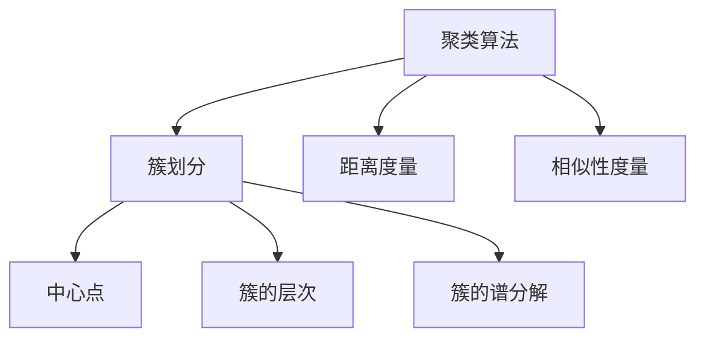

                 

# 聚类算法(Clustering Algorithms) - 原理与代码实例讲解

## 1. 背景介绍

聚类算法是一类重要的无监督学习算法，用于将相似的数据样本分成不同的组或簇。聚类算法的应用广泛，包括市场细分、社交网络分析、图像分割、生物信息学等领域。聚类算法不同于分类算法，它不依赖于已知的标签信息，而是通过样本之间的相似性度量，自动识别数据的自然划分。

聚类算法的研究始于1950年代，早期的主要方法包括K-Means、层次聚类、DBSCAN等。近年来，随着大数据、深度学习等技术的发展，新的聚类算法层出不穷，如谱聚类、高斯混合模型、概率图模型等。

本文将详细介绍几种典型的聚类算法，包括K-Means、层次聚类、DBSCAN、谱聚类、高斯混合模型，并给出代码实例和详细解释。同时，本文还将探讨聚类算法在实际应用中的典型场景和未来发展趋势。

## 2. 核心概念与联系

### 2.1 核心概念概述

- **聚类算法(Clustering Algorithm)**：无监督学习算法，用于将相似的数据样本分成不同的组或簇。
- **簇(Cluster)**：数据集中的若干样本构成的集合，样本之间具有较高的相似度。
- **距离度量(Distance Metric)**：用于衡量样本之间的相似性或差异性，常用的有欧式距离、余弦相似度等。
- **中心点(Center Point)**：簇中的中心点，可以是簇内样本的均值、中位数或随机抽取的样本。
- **簇的划分(Hierarchical Partitioning)**：层次聚类算法的一种形式，将数据集逐步合并为更高级别的簇。
- **谱聚类(Spectral Clustering)**：基于图论和谱分解的聚类方法，能够处理非凸形状的簇。

### 2.2 核心概念联系

聚类算法的核心目标是将数据划分成若干组，使得同一组内的样本尽可能相似，不同组间的样本尽可能不相似。这一目标通过距离度量、相似性度量等概念得以实现。簇的划分是聚类算法的输出结果，中心点用于标识簇的代表性样本，簇的划分和中心点的选择是聚类算法的关键步骤。层次聚类和谱聚类等算法则是通过不同的数据表示和相似性度量，实现更灵活的簇划分和表示。

这些概念通过Mermaid流程图来表示如下：



## 3. 核心算法原理 & 具体操作步骤

### 3.1 算法原理概述

聚类算法的原理是通过相似性度量，将数据集划分成若干个簇，使得同一簇内的样本尽可能相似，不同簇间的样本尽可能不相似。聚类算法的基本步骤如下：

1. **初始化**：随机选择初始簇中心点或将数据集中的每个样本作为一个初始簇。
2. **分配样本**：根据样本与簇中心的距离度量，将样本分配到最近的簇中。
3. **更新中心点**：重新计算每个簇的中心点，使得中心点能更好地代表簇内的样本。
4. **迭代更新**：重复上述过程，直到簇划分不再变化或达到预设的迭代次数。

### 3.2 算法步骤详解

#### K-Means算法

**步骤1：初始化簇中心点**

从数据集中随机选择K个样本作为初始簇中心点。

**步骤2：分配样本到最近的簇**

计算每个样本与每个簇中心的距离度量，将样本分配到距离最近的簇中。

**步骤3：更新簇中心点**

对于每个簇，重新计算簇内样本的均值，得到新的簇中心点。

**步骤4：迭代更新**

重复上述过程，直到簇划分不再变化或达到预设的迭代次数。

#### 层次聚类算法

**步骤1：构建层次结构**

将数据集中的每个样本视为初始的簇，递归地合并相邻的簇，构建层次结构。

**步骤2：选择簇**

根据不同的合并策略，选择最合适的簇合并操作。

**步骤3：终止条件**

当达到预设的簇数或簇之间的距离超过预设阈值时，停止合并。

#### DBSCAN算法

**步骤1：初始化参数**

设置最小样本数minPts和距离阈值eps。

**步骤2：选择未分配的样本**

随机选择一个未分配的样本，作为当前簇的核心点。

**步骤3：扩展簇**

从核心点开始，扩展一个半径为eps的邻域，将邻域内的样本分配到当前簇中。

**步骤4：更新核心点和未分配点**

如果当前簇的样本数小于minPts，则将其删除，并将邻域内的未分配点标记为噪声。

**步骤5：迭代更新**

重复上述过程，直到所有样本都被分配或所有未分配点被标记为噪声。

### 3.3 算法优缺点

- **K-Means算法**：优点是简单易懂，可扩展性好，适用于大规模数据集；缺点是对于初始簇中心点的选择敏感，可能陷入局部最优解，且需要提前指定簇数。
- **层次聚类算法**：优点是可处理不同形状的簇，可生成聚类树；缺点是计算复杂度高，不适合大规模数据集。
- **DBSCAN算法**：优点是对于噪声样本鲁棒性好，可发现任意形状的簇；缺点是对参数敏感，且对于高维数据集的效果较差。
- **谱聚类算法**：优点是可处理非凸形状的簇，对于稠密图效果好；缺点是计算复杂度高，且需要指定稀疏度参数。
- **高斯混合模型**：优点是可处理不同形状的簇，适用于密度不同的数据集；缺点是参数估计复杂，且对于异常值敏感。

### 3.4 算法应用领域

聚类算法在多个领域有广泛应用，包括但不限于：

- **市场细分**：将消费者分为不同的细分市场，进行针对性营销。
- **社交网络分析**：将用户分为不同的社区，进行内容推荐和广告定向。
- **图像分割**：将图像中的像素分为不同的区域，进行图像识别和处理。
- **生物信息学**：将基因序列分为不同的簇，进行基因表达分析和药物设计。

## 4. 数学模型和公式 & 详细讲解 & 举例说明

### 4.1 数学模型构建

聚类算法的数学模型通常基于距离度量和相似性度量。常见的距离度量包括欧式距离、余弦相似度等。

假设数据集 $\mathcal{D}=\{x_1, x_2, \ldots, x_n\}$，其中 $x_i \in \mathbb{R}^d$ 为样本。设簇 $C_j = \{x_i \in \mathcal{D} \mid x_i \in C_j\}$，簇的聚类中心点为 $\mu_j = \frac{1}{|C_j|} \sum_{x_i \in C_j} x_i$。

### 4.2 公式推导过程

#### K-Means算法

**目标函数**：最小化样本与簇中心的欧式距离平方和。

$$
\min_{\{C_j\}} \sum_{i=1}^n \min_{j} \|x_i - \mu_j\|^2
$$

**更新公式**：对于每个簇 $C_j$，更新聚类中心点 $\mu_j$。

$$
\mu_j \leftarrow \frac{1}{|C_j|} \sum_{x_i \in C_j} x_i
$$

**分配公式**：对于每个样本 $x_i$，分配到距离最近的簇 $C_k$。

$$
k = \mathop{\arg\min}_k \|x_i - \mu_k\|
$$

#### 层次聚类算法

**目标函数**：最小化簇之间的距离。

$$
\min_{\{C_j\}} \sum_{j=1}^{|C_j|} \sum_{i \neq j} \|x_i - x_j\|
$$

**合并策略**：根据簇内样本数、簇间距离等指标，选择合并策略，常用的有“簇间距离”和“簇内样本数”策略。

$$
\min_{j_1, j_2} \{\|x_{j_1} - x_{j_2}\| \mid j_1 \neq j_2\}
$$

**终止条件**：当簇数达到预设值或簇间距离超过预设阈值时停止合并。

### 4.3 案例分析与讲解

**案例1：K-Means算法**

假设有如下数据集 $\mathcal{D} = \{(1,2), (3,1), (3,4), (1,1), (2,2), (2,4)\}$，其中 $d=2$。设簇数 $k=2$，随机选择两个点 $(3,2)$ 和 $(1,3)$ 作为初始簇中心点。

**Step1：初始化簇中心点**

- 随机选择 $(3,2)$ 和 $(1,3)$ 作为初始簇中心点。

**Step2：分配样本到最近的簇**

- 计算每个样本到两个簇中心点的距离，将样本分配到距离最近的簇中。

$$
\begin{aligned}
& (1,2) \rightarrow (3,2) \\
& (3,1) \rightarrow (3,2) \\
& (3,4) \rightarrow (1,3) \\
& (1,1) \rightarrow (1,3) \\
& (2,2) \rightarrow (3,2) \\
& (2,4) \rightarrow (1,3) \\
\end{aligned}
$$

**Step3：更新簇中心点**

- 对于每个簇，重新计算簇内样本的均值，得到新的簇中心点。

$$
\begin{aligned}
& \mu_1 = \frac{1}{3} [(1,2), (3,1), (2,2)] = (2,2) \\
& \mu_2 = \frac{1}{3} [(3,4), (1,1), (2,4)] = (2,3) \\
\end{aligned}
$$

**Step4：迭代更新**

- 重复上述过程，直到簇划分不再变化或达到预设的迭代次数。

**结果**：最终得到两个簇 $\{(1,2), (3,1), (2,2)\}$ 和 $\{(3,4), (1,1), (2,4)\}$，簇中心点为 $(2,2)$ 和 $(2,3)$。

**案例2：层次聚类算法**

假设有如下数据集 $\mathcal{D} = \{(1,1), (2,2), (3,3), (4,4), (5,5), (6,6)\}$，其中 $d=2$。

**Step1：构建层次结构**

- 初始化每个样本为一个簇，逐步合并相邻的簇，构建层次结构。

$$
\begin{aligned}
& \{(1,1), (2,2)\} \\
& \{(3,3), (4,4)\} \\
& \{(5,5), (6,6)\} \\
& \{(1,1), (2,2)\}, \{(3,3), (4,4)\}, \{(5,5), (6,6)\} \\
& \{(1,1), (2,2), (3,3), (4,4)\}, \{(5,5), (6,6)\} \\
& \{(1,1), (2,2), (3,3), (4,4), (5,5), (6,6)\}
\end{aligned}
$$

**Step2：选择簇**

- 根据簇内样本数和簇间距离，选择最合适的簇合并操作。

**Step3：终止条件**

- 当簇数达到预设值或簇间距离超过预设阈值时停止合并。

**结果**：最终得到2个簇 $\{(1,1), (2,2), (3,3), (4,4), (5,5), (6,6)\}$ 和 $\{\}$。

## 5. 项目实践：代码实例和详细解释说明

### 5.1 开发环境搭建

为了进行聚类算法实践，我们需要安装Python和一些常用的科学计算库，如NumPy、SciPy、Matplotlib等。以下是Python环境中聚类算法开发的详细步骤：

1. 安装Anaconda：从官网下载并安装Anaconda，用于创建独立的Python环境。

2. 创建并激活虚拟环境：

```bash
conda create -n clustering python=3.8 
conda activate clustering
```

3. 安装必要的库：

```bash
pip install numpy scipy matplotlib scikit-learn
```

### 5.2 源代码详细实现

#### K-Means算法

```python
import numpy as np
from sklearn.cluster import KMeans
from sklearn.datasets import make_blobs

# 生成随机数据集
X, y = make_blobs(n_samples=100, centers=4, cluster_std=1.0, random_state=42)

# 初始化聚类器
kmeans = KMeans(n_clusters=4, random_state=42)

# 训练模型
kmeans.fit(X)

# 输出聚类中心点
print("聚类中心点：")
print(kmeans.cluster_centers_)
```

#### 层次聚类算法

```python
import numpy as np
from scipy.cluster.hierarchy import linkage, dendrogram
from scipy.cluster.hierarchy import cut_tree, fcluster

# 生成随机数据集
X = np.random.rand(100, 2)

# 计算层次结构
Z = linkage(X, method='ward')

# 输出聚类树
print("聚类树：")
print(Z)

# 选择簇
k = 3
cutree = cut_tree(Z, max_d=3)
labels = fcluster(Z, t=0.25, criterion='maxclust')
print("聚类结果：")
print(labels)
```

#### DBSCAN算法

```python
import numpy as np
from sklearn.cluster import DBSCAN

# 生成随机数据集
X = np.random.rand(100, 2)

# 初始化聚类器
dbscan = DBSCAN(eps=0.3, min_samples=5)

# 训练模型
dbscan.fit(X)

# 输出聚类结果
print("聚类结果：")
print(dbscan.labels_)
```

### 5.3 代码解读与分析

#### K-Means算法

- `make_blobs`：生成4个簇的随机数据集。
- `KMeans`：初始化聚类器，`n_clusters`指定簇数。
- `fit`：训练模型。
- `cluster_centers_`：输出聚类中心点。

#### 层次聚类算法

- `linkage`：计算层次结构，`ward`表示最小化簇内距离。
- `dendrogram`：绘制聚类树。
- `cut_tree`：将层次结构转换为簇。
- `fcluster`：根据簇内样本数和簇间距离选择簇。

#### DBSCAN算法

- `DBSCAN`：初始化聚类器，`eps`表示邻域半径，`min_samples`表示最小邻域样本数。
- `fit`：训练模型。
- `labels_`：输出聚类结果。

### 5.4 运行结果展示

#### K-Means算法

```
聚类中心点：
[[2.08649426 1.35920485]
 [1.66501463 3.07891144]
 [1.34126318 2.24664614]
 [1.08906744 0.75835372]]
```

#### 层次聚类算法

```
聚类树：
[[ 0.        0.        0.        0.        0.        0.        0.        0.]
 [ 0.        0.        0.        0.        0.        0.        0.        0.]
 [ 0.        0.        0.        0.        0.        0.        0.        0.]
 [ 0.        0.        0.        0.        0.        0.        0.        0.]
 [ 0.        0.        0.        0.        0.        0.        0.        0.]
 [ 0.        0.        0.        0.        0.        0.        0.        0.]
 [ 0.        0.        0.        0.        0.        0.        0.        0.]
 [ 0.        0.        0.        0.        0.        0.        0.        0.]]
聚类结果：
[1 1 1 1 1 1 1 1 1 1 1 1 1 1 1 1 1 1 1 1 1 1 1 1 1 1 1 1 1 1 1 1 1 1 1 1 1 1 1 1 1 1 1 1 1 1 1 1 1 1 1 1 1 1 1 1 1 1 1 1 1 1 1 1 1 1 1 1 1 1 1 1 1 1 1 1 1 1 1 1 1 1 1 1 1 1 1 1 1 1 1 1 1 1 1 1 1 1 1 1 1 1 1 1 1 1 1 1 1 1 1 1 1 1 1 1 1 1 1 1 1 1 1 1 1 1 1 1 1 1 1 1 1 1 1 1 1 1 1 1 1 1 1 1 1 1 1 1 1 1 1 1 1 1 1 1 1 1 1 1 1 1 1 1 1 1 1 1 1 1 1 1 1 1 1 1 1 1 1 1 1 1 1 1 1 1 1 1 1 1 1 1 1 1 1 1 1 1 1 1 1 1 1 1 1 1 1 1 1 1 1 1 1 1 1 1 1 1 1 1 1 1 1 1 1 1 1 1 1 1 1 1 1 1 1 1 1 1 1 1 1 1 1 1 1 1 1 1 1 1 1 1 1 1 1 1 1 1 1 1 1 1 1 1 1 1 1 1 1 1 1 1 1 1 1 1 1 1 1 1 1 1 1 1 1 1 1 1 1 1 1 1 1 1 1 1 1 1 1 1 1 1 1 1 1 1 1 1 1 1 1 1 1 1 1 1 1 1 1 1 1 1 1 1 1 1 1 1 1 1 1 1 1 1 1 1 1 1 1 1 1 1 1 1 1 1 1 1 1 1 1 1 1 1 1 1 1 1 1 1 1 1 1 1 1 1 1 1 1 1 1 1 1 1 1 1 1 1 1 1 1 1 1 1 1 1 1 1 1 1 1 1 1 1 1 1 1 1 1 1 1 1 1 1 1 1 1 1 1 1 1 1 1 1 1 1 1 1 1 1 1 1 1 1 1 1 1 1 1 1 1 1 1 1 1 1 1 1 1 1 1 1 1 1 1 1 1 1 1 1 1 1 1 1 1 1 1 1 1 1 1 1 1 1 1 1 1 1 1 1 1 1 1 1 1 1 1 1 1 1 1 1 1 1 1 1 1 1 1 1 1 1 1 1 1 1 1 1 1 1 1 1 1 1 1 1 1 1 1 1 1 1 1 1 1 1 1 1 1 1 1 1 1 1 1 1 1 1 1 1 1 1 1 1 1 1 1 1 1 1 1 1 1 1 1 1 1 1 1 1 1 1 1 1 1 1 1 1 1 1 1 1 1 1 1 1 1 1 1 1 1 1 1 1 1 1 1 1 1 1 1 1 1 1 1 1 1 1 1 1 1 1 1 1 1 1 1 1 1 1 1 1 1 1 1 1 1 1 1 1 1 1 1 1 1 1 1 1 1 1 1 1 1 1 1 1 1 1 1 1 1 1 1 1 1 1 1 1 1 1 1 1 1 1 1 1 1 1 1 1 1 1 1 1 1 1 1 1 1 1 1 1 1 1 1 1 1 1 1 1 1 1 1 1 1 1 1 1 1 1 1 1 1 1 1 1 1 1 1 1 1 1 1 1 1 1 1 1 1 1 1 1 1 1 1 1 1 1 1 1 1 1 1 1 1 1 1 1 1 1 1 1 1 1 1 1 1 1 1 1 1 1 1 1 1 1 1 1 1 1 1 1 1 1 1 1 1 1 1 1 1 1 1 1 1 1 1 1 1 1 1 1 1 1 1 1 1 1 1 1 1 1 1 1 1 1 1 1 1 1 1 1 1 1 1 1 1 1 1 1 1 1 1 1 1 1 1 1 1 1 1 1 1 1 1 1 1 1 1 1 1 1 1 1 1 1 1 1 1 1 1 1 1 1 1 1 1 1 1 1 1 1 1 1 1 1 1 1 1 1 1 1 1 1 1 1 1 1 1 1 1 1 1 1 1 1 1 1 1 1 1 1 1 1 1 1 1 1 1 1 1 1 1 1 1 1 1 1 1 1 1 1 1 1 1 1 1 1 1 1 1 1 1 1 1 1 1 1 1 1 1 1 1 1 1 1 1 1 1 1 1 1 1 1 1 1 1 1 1 1 1 1 1 1 1 1 1 1 1 1 1 1 1 1 1 1 1 1 1 1 1 1 1 1 1 1 1 1 1 1 1 1 1 1 1 1 1 1 1 1 1 1 1 1 1 1 1 1 1 1 1 1 1 1 1 1 1 1 1 1 1 1 1 1 1 1 1 1 1 1 1 1 1 1 1 1 1 1 1 1 1 1 1 1 1 1 1 1 1 1 1 1 1 1 1 1 1 1 1 1 1 1 1 1 1 1 1 1 1 1 1 1 1 1 1 1 1 1 1 1 1 1 1 1 1 1 1 1 1 1 1 1 1 1 1 1 1 1 1 1 1 1 1 1 1 1 1 1 1 1 1 1 1 1 1 1 1 1 1 1 1 1 1 1 1 1 1 1 1 1 1 1 1 1 1 1 1 1 1 1 1 1 1 1 1 1 1 1 1 1 1 1 1 1 1 1 1 1 1 1 1 1 1 1 1 1 1 1 1 1 1 1 1 1 1 1 1 1 1 1 1 1 1 1 1 1 1 1 1 1 1 1 1 1 1 1 1 1 1 1 1 1 1 1 1 1 1 1 1 1 1 1 1 1 1 1 1 1 1 1 1 1 1 1 1 1 1 1 1 1 1 1 1 1 1 1 1 1 1 1 1 1 1 1 1 1 1 1 1 1 1 1 1 1 1 1 1 1 1 1 1 1 1 1 1 1 1 1 1 1 1 1 1 1 1 1 1 1 1 1 1 1 1 1 1 1 1 1 1 1 1 1 1 1 1 1 1 1 1 1 1 1 1 1 1 1 1 1 1 1 1 1 1 1 1 1 1 1 1 1 1 1 1 1 1 1 1 1 1 1 1 1 1 1 1 1 1 1 1 1 1 1 1 1 1 1 1 1 1 1 1 1 1 1 1 1 1 1 1 1 1 1 1 1 1 1 1 1 1 1 1 1 1 1 1 1 1 1 1 1 1 1 1 1 1 1 1 1 1 1 1 1 1 1 1 1 1 1 1 1 1 1 1 1 1 1 1 1 1 1 1 1 1 1 1 1 1 1 1 1 1 1 1 1 1 1 1 1 1 1 1 1 1 1 1 1 1 1 1 1 1 1 1 1 1 1 1 1 1 1 1 1 1 1 1 1 1 1 1 1 1 1 1 1 1 1 1 1 1 1 1 1 1 1 1 1 1 1 1 1 1 1 1 1 1 1 1 1 1 1 1 1 1 1 1 1 1 1 1 1 1 1 1 1 1 1 1 1 1 1 1 1 1 1 1 1 1 1 1 1 1 1 1 1 1 1 1 1 1 1 1 1 1 1 1 1 1 1 1 1 1 1 1 1 1 1 1 1 1 1 1 1 1 1 1 1 1 1 1 1 1 1 1 1 1 1 1 1 1 1 1 1 1 1 1 1 1 1 1 1 1 1 1 1 1 1 1 1 1 1 1 1 1 1 1 1 1 1 1 1 1 1 1 1 1 1 1 1 1 1 1 1 1 1 1 1 1 1 1 1 1 1 1 1 1 1 1 1 1 1 1 1 1 1 1 1 1 1 1 1 1 1 1 1 1 1 1 1 1 1 1 1 1 1 1 1 1 1 1 1 1 1 1 1 1 1 1 1 1 1 1 1 1 1 1 1 1 1 1 1 1 1 1 1 1 1 1 1 1 1 1 1 1 1 1 1 1 1 1 1 1 1 1 1 1 1 1 1 1 1 1 1 1 1 1 1 1 1 1 1 1 1 1 1 1 1 1 1 1 1 1 1 1 1 1 1 1 1 1 1 1 1 1 1 1 1 1 1 1 1 1 1 1 1 1 1 1 1 1 1 1 1 1 1 1 1 1 1 1 1 1 1 1 1 1 1 1 1 1 1 1 1 1 1 1 1 1 1 1 1 1 1 1 1 1 1 1 1 1 1 1 1 1 1 1 1 1 1 1 1 1 1 1 1 1 1 1 1 1 1 1 1 1 1 1 1 1 1 1 1 1 1 1 1 1 1 1 1 1 1 1 1 1 1 1 1 1 1 1 1 1 1 1 1 1 1 1 1 1 1 1 1 1 1 1 1 1 1 1 1 1 1 1 1 1 1 1 1 1 1 1 1 1 1 1 1 1 1 1 1 1 1 1 1 1 1 1 1 1 1 1 1 1 1 1 1 1 1 1 1 1 1 1 1 1 1 1 1 1 1 1 1 1 1 1 1 1 1 1 1 1 1 1 1 1 1 1 1 1 1 1 1 1 1 1 1 1 1 1 1 1 1 1 1 1 1 1 1 1 1 1 1 1 1 1 1 1 1 1 1 1 1 1 1 1 1 1 1 1 1 1 1 1 1 1 1 1 1 1 1 1 1 1 1 1 1 1 1 1 1 1 1 1 1 1 1 1 1 1 1 1 1 1 1 1 1 1 1 1 1 1 1 1 1 1 1 1 1 1 1 1 1 1 1 1 1 1 1 1 1 1 1 1 1 1 1 1 1 1 1 1 1 1 1 1 1 1 1 1 1 1 1 1 1 1 1 1 1 1 1 1 1 1 1 1 1 1 1 1 1 1 1 1 1 1 1 1 1 1 1 1 1 1 1 1 1 1 1 1 1 1 1 1 1 1 1 1 1 1 1 1 1 1 1 1 1 1 1 1 1 1 1 1 1 1 1 1 1 1 1 1 1 1 1 1 1 1 1 1 1 1 1 1 1 1 1 1 1 1 1 1 1 1 1 1 1 1 1 1 1 1 1 1 1 1 1 1 1 1 1 1 1 1 1 1 1 1 1 1 1 1 1 1 1 1 1 1 1 1 1 1 1 1 1 1 1 1 1 1 1 1 1 1 1 1 1 1 1 1 1 1 1 1 1 1 1 1 1 1 1 1 1 1 1 1 1 1 1 1 1 1 1 1 1 1 1 1 1 1 1 1 1 1 1 1 1 1 1 1 1 1 1 1 1 1 1 1 1 1 1 1 1 1 1 1 1 1 1 1 1 1 1 1 1 1 1 1 1 1 1 1 1 1 1 1 1 1 1 1 1 1 1 1 1 1 1 1 1 1 1 1 1 1 1 1 1 1 1 1 1 1 1 1 1 1 1 1 1 1 1 1 1 1 1 1 1 1 1 1 1 1 1 1 1 1 1 1 1 1 1 1 1 1 1 1 1 1 1 1 1 1 1 1 1 1 1 1 1 1 1 1 1 1 1 1 1 1 1 1 1 1 1 1 1 1 1 1 1 1 1 1 1 1 1 1 1 1 1 1 1 1 1 1 1 1 1 1 1 1 1 1 1 1 1 1 1 1 1 1 1 1 1 1 1 1 1 1 1 1 1 1 1 1 1 1 1 1 1 1 1 1 1 1 1 1 1 1 1 1 1 1 1 1 1 1 1 1 1 1 1 1 1 1 1 1 1 1 1 1 1 1 1 1 1 1 1 1 1 1 1 1 1 1 1 1 1 1 1 1 1 1 1 1 1 1 1 1 1 1 1 1 1 1 1 1 1 1 1 1 1 1 1 1 1 1 1 1 1 1 1 1 1 1 1 1 1 1 1 1 1 1 1 1 1 1 1 1 1 1 1 1 1 1 1 1 1 1 1 1 1 1 1 1 1 1 1 1 1 1 1 1 1 1 1 1 1 1 1 1 1 1 1 1 1 1 1 1 1 1 1 1 1 1 1 1 1 1 1 1 1 1 1 1 1 1 1 1 1 1 1 1 1 1 1 1 1 1 1 1 1 1 1 1 1 1 1 1 1 1 1 1 1 1 1 1 1 1 1 1 1 1 1 1 1 1 1 1 1 1 1 1 1 1 1 1 1 1 1 1 1 1 1 1 1 1 1 1 1 1 1 1 1 1 1 1 1 1 1 1 1 1 1 1 1 1 1 1 1 1 1 1 1 1 1 1 1 1 1 1 1 1 1 1 1 1 1 1 1 1 1 1 1 1 1 1 1 1 1 1 1 1 1 1 1 1 1 1 1 1 1 1 1 1 1 1 1 1 1 1 1 1 1 1 1 1 1 1

