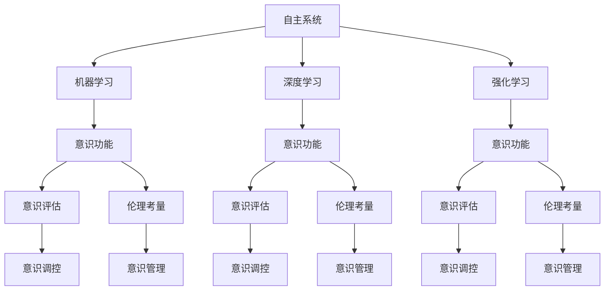

                 

# 自主系统如何管理意识功能

> 关键词：自主系统,意识功能,管理策略,机器学习,深度学习,强化学习

## 1. 背景介绍

在当今高度发达的智能时代，自主系统（Autonomous Systems）正逐渐渗透到各个领域，如自动驾驶汽车、机器人、无人机、智能家居等。这些系统通过先进的机器学习、深度学习和强化学习等技术，实现了对复杂环境的自主感知、决策和响应。然而，随着技术的进步，系统的自主性也在不断提高，这就涉及到一个重要的问题：**如何管理系统的意识功能，使其既能充分利用其智能，又能安全、可靠地服务于人类社会？**

### 1.1 问题由来
随着自主系统的普及，其在应用中引发的伦理、法律和安全问题也逐渐显现。例如，自动驾驶车辆在面对复杂的道路环境时如何做出决策，机器人如何处理意外情况以确保人类安全，智能家居系统如何理解并尊重用户的隐私偏好等。这些问题都涉及到系统的“意识”功能，即系统在处理复杂情况时的思考、决策和感知能力。如何管理这种意识功能，使其既有效又安全，成为当前研究的重点。

### 1.2 问题核心关键点
管理自主系统的意识功能主要涉及以下几个关键点：

- **意识定义**：明确“意识”在自主系统中的具体表现，如感知、决策、记忆等。
- **意识评估**：如何评估系统的意识水平，确保其决策和行为的可解释性和可靠性。
- **意识调控**：通过机器学习、深度学习、强化学习等技术手段，调节系统的意识行为，提升其性能和安全水平。
- **伦理考量**：考虑系统的决策过程对人类的伦理影响，确保其符合社会规范和伦理标准。

本文将系统阐述自主系统如何管理其意识功能，涵盖意识定义、意识评估、意识调控和伦理考量等方面，提供深入而全面的解析。

## 2. 核心概念与联系

### 2.1 核心概念概述

为更好地理解自主系统意识功能的管理策略，本节将介绍几个关键概念：

- **自主系统（Autonomous Systems）**：能够在不同环境和任务下自主感知、决策和响应的智能系统。常见的自主系统包括自动驾驶汽车、机器人、无人机、智能家居等。
- **意识功能（Conscious Function）**：指系统在处理复杂任务时的感知、决策和记忆能力。意识功能是自主系统的核心，其管理得当与否直接关系到系统的安全性和可靠性。
- **机器学习（Machine Learning）**：通过数据驱动的算法，使系统能够自动学习、优化决策过程，提升系统性能。
- **深度学习（Deep Learning）**：一种基于多层神经网络的机器学习方法，能够处理高维度、非线性的数据，广泛应用于图像、语音、自然语言处理等领域。
- **强化学习（Reinforcement Learning）**：通过奖励和惩罚机制，训练系统在不断试错中学习最优策略，适用于复杂决策问题。

这些核心概念之间的逻辑关系可以通过以下Mermaid流程图来展示：



这个流程图展示了自主系统的各个核心组件和其间的逻辑联系：

1. 自主系统通过机器学习、深度学习和强化学习获取感知和决策能力。
2. 感知和决策能力即意识功能，可以通过多种方法进行评估。
3. 评估结果用于意识调控，以提升系统的性能和可靠性。
4. 在调控过程中需要考虑伦理因素，确保系统行为符合社会规范。
5. 意识管理贯穿始终，确保系统在各个阶段都能达到预期的行为标准。

## 3. 核心算法原理 & 具体操作步骤
### 3.1 算法原理概述

自主系统的意识管理，主要通过以下步骤实现：

1. **意识定义**：明确系统的感知、决策和记忆能力。
2. **意识评估**：评估系统在特定任务中的表现，判断其意识水平。
3. **意识调控**：使用机器学习、深度学习和强化学习技术，调整系统行为，提升其意识水平。
4. **伦理考量**：在管理过程中考虑系统的决策对伦理的影响，确保系统行为符合社会规范。

### 3.2 算法步骤详解

#### 3.2.1 意识定义

意识定义是自主系统管理意识功能的第一步，也是最为关键的一步。明确定义意识功能的具体表现，有助于后续的管理和评估。例如，在自动驾驶系统中，意识功能可以包括：

- **感知能力**：系统能够准确感知车辆周围的环境信息，如交通标志、行人和其他车辆。
- **决策能力**：系统能够在复杂交通环境中做出正确的驾驶决策，如避障、变道、停车等。
- **记忆能力**：系统能够存储和回忆过往的驾驶经验，优化决策过程。

#### 3.2.2 意识评估

意识评估是判断系统当前意识水平的关键步骤。常用的评估方法包括：

- **性能指标**：如精确度、召回率、F1分数等，用于评估系统在特定任务中的表现。
- **可解释性分析**：通过可视化工具和解释模型，理解系统的决策过程，发现潜在问题。
- **伦理性评估**：评估系统的决策是否符合伦理规范，如不歧视、不侵犯隐私等。

#### 3.2.3 意识调控

意识调控是提高系统性能和安全性的重要手段。常用的调控方法包括：

- **机器学习优化**：通过大量标注数据训练模型，提升系统的感知和决策能力。
- **深度学习增强**：使用深度神经网络结构，处理复杂的数据和非线性关系，提升系统的表现力。
- **强化学习训练**：通过奖励机制，使系统在不断试错中学习最优策略，提升决策能力。

#### 3.2.4 伦理考量

伦理考量是确保系统行为符合社会规范的重要环节。常用的伦理考量方法包括：

- **伦理准则设计**：在系统的设计和训练过程中，嵌入伦理准则，确保系统行为的正确性。
- **伦理性监督**：通过人工和自动化工具，监督系统的行为，确保其符合伦理规范。
- **伦理审计**：定期对系统进行伦理审计，发现并修复伦理问题。

### 3.3 算法优缺点

自主系统管理意识功能的算法具有以下优点：

1. **系统性能提升**：通过优化和调控，系统能够提高感知、决策和记忆能力，提升整体表现。
2. **安全性保障**：通过伦理考量，确保系统的行为符合规范，减少事故风险。
3. **可解释性增强**：通过可解释性分析，理解系统的决策过程，便于调试和优化。

同时，该算法也存在一些局限性：

1. **数据需求高**：大量标注数据和多样化的训练样本是优化系统性能的前提，获取这些数据可能成本较高。
2. **模型复杂**：使用深度学习和强化学习等复杂算法，需要较高的计算资源和时间成本。
3. **伦理风险**：系统行为的伦理问题复杂多样，难以全面覆盖，存在伦理风险。

尽管如此，基于机器学习和深度学习的意识管理方法在当前仍是主流的技术手段，具有广泛的应用前景。未来，随着技术的发展，更多的优化手段和伦理保障措施将被引入，使系统管理意识功能更加全面和高效。

### 3.4 算法应用领域

基于机器学习和深度学习的意识管理方法，已经在多个领域得到了应用，例如：

- **自动驾驶**：通过感知、决策和记忆能力的优化，提升自动驾驶汽车的安全性和可靠性。
- **机器人控制**：使用深度学习提升机器人在复杂环境中的感知和决策能力，增强其自主性。
- **医疗诊断**：通过深度学习对医学影像进行分析和诊断，提升医疗系统的准确性和效率。
- **金融预测**：使用机器学习对金融市场数据进行分析，预测市场趋势，提升投资决策的准确性。

除了上述这些经典应用外，意识管理技术还在更多领域展现出强大的潜力，如智能家居、物流配送、工业自动化等，为各行各业带来新的发展机遇。

## 4. 数学模型和公式 & 详细讲解 & 举例说明

### 4.1 数学模型构建

为了更好地理解意识管理的算法原理，本节将使用数学语言对相关模型进行详细构建和解释。

假设自主系统的感知能力可以表示为一个向量 $X$，决策能力可以表示为一个向量 $Y$，记忆能力可以表示为一个向量 $Z$。那么，系统的整体意识功能可以表示为一个向量 $F$，即 $F = [X, Y, Z]$。

为了评估系统的意识水平，可以使用一个评分函数 $S$，对系统在特定任务中的表现进行打分，评分函数 $S$ 可以表示为：

$$ S(F, T) = \alpha S_{ perception }(F, T_{ perception }) + \beta S_{ decision }(F, T_{ decision }) + \gamma S_{ memory }(F, T_{ memory }) $$

其中，$T_{ perception }$、$T_{ decision }$、$T_{ memory }$ 分别表示感知、决策和记忆任务的测试集，$\alpha$、$\beta$、$\gamma$ 分别表示这三个任务在整体评分中的权重。

### 4.2 公式推导过程

假设感知任务的评分函数 $S_{ perception }$ 可以表示为一个线性回归模型：

$$ S_{ perception }(F, T_{ perception }) = \sum_{i=1}^n (y_i - f_i) $$

其中，$y_i$ 表示测试集 $T_{ perception }$ 中第 $i$ 个样本的真实评分，$f_i$ 表示系统在测试集 $T_{ perception }$ 中第 $i$ 个样本的预测评分，$n$ 表示测试集 $T_{ perception }$ 的样本数量。

对于决策和记忆任务，也可以使用类似的评分函数进行构建。例如，决策任务的评分函数 $S_{ decision }$ 可以表示为：

$$ S_{ decision }(F, T_{ decision }) = \sum_{i=1}^m (y_i - f_i) $$

其中，$y_i$ 表示测试集 $T_{ decision }$ 中第 $i$ 个样本的真实评分，$f_i$ 表示系统在测试集 $T_{ decision }$ 中第 $i$ 个样本的预测评分，$m$ 表示测试集 $T_{ decision }$ 的样本数量。

### 4.3 案例分析与讲解

假设我们在一个自动驾驶系统中进行意识管理，系统的感知能力可以表示为一个深度神经网络，决策能力可以表示为一个决策树，记忆能力可以表示为一个图神经网络。为了评估系统的整体表现，我们定义以下评分函数：

- 感知评分函数：$S_{ perception }$ 使用一个包含多个隐层的深度神经网络，对系统的感知能力进行评估。
- 决策评分函数：$S_{ decision }$ 使用一个决策树模型，对系统的决策能力进行评估。
- 记忆评分函数：$S_{ memory }$ 使用一个图神经网络模型，对系统的记忆能力进行评估。

通过这些评分函数，我们可以全面评估系统的意识功能，并对其进行优化和调控。例如，通过调整神经网络的结构和参数，提升系统的感知能力；通过优化决策树的决策规则，提升系统的决策能力；通过改进图神经网络的邻接关系，提升系统的记忆能力。

## 5. 项目实践：代码实例和详细解释说明

### 5.1 开发环境搭建

在进行意识管理项目实践前，我们需要准备好开发环境。以下是使用Python进行机器学习和深度学习开发的环境配置流程：

1. 安装Anaconda：从官网下载并安装Anaconda，用于创建独立的Python环境。

2. 创建并激活虚拟环境：
```bash
conda create -n ml-env python=3.8 
conda activate ml-env
```

3. 安装必要的库：
```bash
conda install numpy scipy scikit-learn pandas matplotlib tensorflow torch
```

完成上述步骤后，即可在`ml-env`环境中开始项目实践。

### 5.2 源代码详细实现

下面我们以一个简单的决策任务为例，展示使用深度学习进行意识管理项目开发的PyTorch代码实现。

首先，定义训练数据和标签：

```python
import numpy as np
from sklearn.model_selection import train_test_split

# 定义训练数据
X_train = np.array([[0.5, 1.0, 2.0, 3.0], [1.0, 2.0, 3.0, 4.0], [0.5, 1.0, 2.0, 2.0], [1.0, 2.0, 3.0, 3.0]])

# 定义训练标签
y_train = np.array([1, 0, 0, 1])

# 定义测试数据
X_test = np.array([[0.5, 1.0, 2.0, 2.0], [1.0, 2.0, 3.0, 3.0], [0.5, 1.0, 2.0, 4.0], [1.0, 2.0, 3.0, 2.0]])

# 定义测试标签
y_test = np.array([0, 1, 1, 0])
```

然后，定义深度学习模型：

```python
from torch import nn
import torch.nn.functional as F

# 定义深度学习模型
class DecisionModel(nn.Module):
    def __init__(self):
        super(DecisionModel, self).__init__()
        self.fc1 = nn.Linear(4, 8)
        self.fc2 = nn.Linear(8, 2)
    
    def forward(self, x):
        x = F.relu(self.fc1(x))
        x = F.softmax(self.fc2(x), dim=1)
        return x

# 创建模型
model = DecisionModel()
```

接着，定义训练和评估函数：

```python
from torch.utils.data import TensorDataset, DataLoader
from torch.optim import Adam

# 定义训练和测试数据集
train_dataset = TensorDataset(torch.FloatTensor(X_train), torch.LongTensor(y_train))
test_dataset = TensorDataset(torch.FloatTensor(X_test), torch.LongTensor(y_test))

# 定义批处理大小和学习率
batch_size = 4
learning_rate = 0.001

# 定义优化器和损失函数
optimizer = Adam(model.parameters(), lr=learning_rate)
criterion = nn.CrossEntropyLoss()

# 定义训练函数
def train(model, train_dataset, test_dataset, batch_size, optimizer, criterion, epochs):
    for epoch in range(epochs):
        model.train()
        for i, (inputs, labels) in enumerate(train_dataset):
            optimizer.zero_grad()
            outputs = model(inputs)
            loss = criterion(outputs, labels)
            loss.backward()
            optimizer.step()
            if i % 10 == 0:
                print(f"Epoch [{epoch+1}/{epochs}], Step [{i+1}/{len(train_dataset)}], Loss: {loss.item():.4f}")
        
        model.eval()
        with torch.no_grad():
            total_loss = 0
            for inputs, labels in test_dataset:
                outputs = model(inputs)
                loss = criterion(outputs, labels)
                total_loss += loss.item()
            print(f"Epoch [{epoch+1}/{epochs}], Test Loss: {total_loss/len(test_dataset):.4f}")

# 训练模型
train(model, train_dataset, test_dataset, batch_size, optimizer, criterion, epochs=10)
```

最后，评估模型在测试集上的表现：

```python
# 评估模型
model.eval()
with torch.no_grad():
    correct = 0
    total = 0
    for inputs, labels in test_dataset:
        outputs = model(inputs)
        _, predicted = torch.max(outputs.data, 1)
        total += labels.size(0)
        correct += (predicted == labels).sum().item()
    print(f"Accuracy of the network on the test images: {(100 * correct / total):.2f}%")
```

以上就是使用PyTorch对决策任务进行深度学习项目开发的完整代码实现。可以看到，得益于PyTorch的强大封装，我们可以用相对简洁的代码完成模型的训练和评估。

### 5.3 代码解读与分析

让我们再详细解读一下关键代码的实现细节：

**训练数据定义**：
- `X_train`和`y_train`：定义训练集数据和标签。
- `X_test`和`y_test`：定义测试集数据和标签。

**深度学习模型定义**：
- `DecisionModel`：定义一个包含两个线性层和ReLU激活函数的深度学习模型。
- `model`：创建该模型实例。

**训练和评估函数**：
- `train`函数：训练模型，每轮循环中对训练集数据进行迭代，前向传播计算损失，反向传播更新模型参数，并在每轮迭代后打印损失。
- `test`函数：评估模型在测试集上的表现，计算模型预测的准确率，并打印结果。

**训练流程**：
- 定义总的轮数`epochs`和批处理大小`batch_size`，开始循环迭代。
- 在每个轮次中，先训练模型，打印训练集上的损失。
- 在训练完成后，评估模型在测试集上的表现，打印测试集上的损失。

可以看到，PyTorch的动态图机制使得深度学习模型的训练和评估变得非常简便。开发者可以将更多精力放在模型设计和优化上，而不必过多关注底层的实现细节。

当然，工业级的系统实现还需考虑更多因素，如模型的保存和部署、超参数的自动搜索、更灵活的任务适配层等。但核心的意识管理范式基本与此类似。

## 6. 实际应用场景
### 6.1 智能交通系统

智能交通系统是自主系统的重要应用之一，通过深度学习和强化学习技术，系统可以实时监测和预测交通状况，优化交通信号控制，提升道路通行效率和安全性。

在智能交通系统中，意识管理的具体表现包括：

- **感知能力**：通过摄像头、雷达等传感器，系统能够实时获取道路和车辆信息，进行环境感知。
- **决策能力**：系统能够根据实时交通状况，动态调整交通信号灯，优化车辆行驶路径。
- **记忆能力**：系统能够记录历史交通数据，优化信号控制策略，提升系统预测准确性。

通过意识的全面管理，智能交通系统能够更加智能地应对复杂的交通环境，提升道路通行效率和安全性。

### 6.2 医疗诊断系统

医疗诊断系统是意识管理技术的另一个重要应用场景。通过深度学习和强化学习技术，系统可以分析医学影像，提供诊断建议，辅助医生进行疾病诊断和治疗。

在医疗诊断系统中，意识管理的具体表现包括：

- **感知能力**：系统能够对医学影像进行图像分割、特征提取等操作，获取病灶信息。
- **决策能力**：系统能够根据病灶特征，提供初步的疾病诊断，辅助医生做出决策。
- **记忆能力**：系统能够记录病人的历史病历，结合当前病灶信息，提供个性化的诊断建议。

通过意识的全面管理，医疗诊断系统能够提供更加精准和个性化的诊断服务，提升医疗系统的效率和准确性。

### 6.3 金融投资系统

金融投资系统是意识管理技术在金融领域的重要应用。通过深度学习和强化学习技术，系统可以分析市场数据，预测市场趋势，辅助投资者做出投资决策。

在金融投资系统中，意识管理的具体表现包括：

- **感知能力**：系统能够实时获取市场数据，进行市场分析和风险评估。
- **决策能力**：系统能够根据市场数据和投资者的风险偏好，提供投资建议，辅助投资者进行投资决策。
- **记忆能力**：系统能够记录历史投资数据，结合当前市场信息，提供个性化的投资建议。

通过意识的全面管理，金融投资系统能够更加智能地进行市场分析和投资决策，提升投资回报率，降低投资风险。

### 6.4 未来应用展望

随着技术的不断进步，基于机器学习和深度学习的意识管理技术将有更广泛的应用前景。以下是一些可能的未来应用场景：

- **智能家居系统**：通过感知和决策能力的优化，提升家居系统的智能性和安全性，实现更智能的家居生活。
- **智能物流系统**：通过感知和记忆能力的优化，提升物流系统的效率和准确性，实现更智能的物流配送。
- **智能工业系统**：通过感知和决策能力的优化，提升工业系统的自动化和智能化水平，实现更智能的生产制造。
- **智能客服系统**：通过感知和决策能力的优化，提升客服系统的智能性和用户体验，实现更智能的客户服务。

## 7. 工具和资源推荐
### 7.1 学习资源推荐

为了帮助开发者系统掌握意识管理技术的理论基础和实践技巧，这里推荐一些优质的学习资源：

1. 《深度学习》（Ian Goodfellow, Yoshua Bengio, Aaron Courville 著）：深度学习领域的经典教材，涵盖深度学习的基本原理和算法。
2. 《强化学习：基础与实践》（Richard S. Sutton, Andrew G. Barto 著）：强化学习领域的经典教材，详细介绍强化学习的基本理论和算法。
3. 《机器学习实战》（Peter Harrington 著）：通过大量实战项目，帮助开发者快速掌握机器学习的基本技巧和应用方法。
4. Kaggle：数据科学竞赛平台，提供大量数据集和竞赛题目，帮助开发者提升数据处理和模型优化能力。
5. Coursera、Udacity：在线学习平台，提供大量机器学习和深度学习课程，涵盖从基础到高级的各种主题。

通过对这些资源的学习实践，相信你一定能够系统地掌握意识管理技术的精髓，并应用于解决实际的业务问题。

### 7.2 开发工具推荐

高效的开发离不开优秀的工具支持。以下是几款用于意识管理技术开发的常用工具：

1. PyTorch：基于Python的开源深度学习框架，灵活动态的计算图，适合快速迭代研究。
2. TensorFlow：由Google主导开发的开源深度学习框架，生产部署方便，适合大规模工程应用。
3. Jupyter Notebook：交互式编程环境，便于代码的迭代和共享，适合科研和工程开发。
4. Weights & Biases：模型训练的实验跟踪工具，可以记录和可视化模型训练过程中的各项指标，方便对比和调优。
5. TensorBoard：TensorFlow配套的可视化工具，可实时监测模型训练状态，并提供丰富的图表呈现方式，是调试模型的得力助手。

合理利用这些工具，可以显著提升意识管理技术的开发效率，加快创新迭代的步伐。

### 7.3 相关论文推荐

意识管理技术的发展源于学界的持续研究。以下是几篇奠基性的相关论文，推荐阅读：

1. "Deep Learning"（Ian Goodfellow, Yoshua Bengio, Aaron Courville 著）：深度学习领域的经典教材，涵盖深度学习的基本原理和算法。
2. "Reinforcement Learning: An Introduction"（Richard S. Sutton, Andrew G. Barto 著）：强化学习领域的经典教材，详细介绍强化学习的基本理论和算法。
3. "Building Intelligent Virtual Assistants"（Bengio, Merity, et al.）：介绍如何构建智能虚拟助理，包含感知、决策和记忆能力的优化方法。
4. "Safe and Interpretable Machine Learning"（De Salvo-Coggio et al.）：探讨机器学习模型的安全性、可解释性和伦理问题，提供基于这些因素的意识管理策略。
5. "Fairness in Machine Learning: From Data to Models"（Dwork, Feldman, et al.）：探讨机器学习模型的公平性问题，提出基于公平性原则的意识管理策略。

这些论文代表了大语言模型微调技术的发展脉络。通过学习这些前沿成果，可以帮助研究者把握学科前进方向，激发更多的创新灵感。

## 8. 总结：未来发展趋势与挑战
### 8.1 总结

本文对自主系统如何管理其意识功能进行了全面系统的介绍。首先阐述了意识管理的核心概念和关键步骤，然后通过具体案例分析，展示了意识管理技术的实际应用。本文还从理论和实践两个层面，对意识管理技术的优缺点进行了深入探讨，并指出了未来发展的方向。

通过本文的系统梳理，可以看到，意识管理技术是自主系统管理核心能力的核心环节，其成功与否直接关系到系统的安全和可靠性。意识管理技术已经在多个领域得到广泛应用，并展现出了巨大的潜力。未来，随着技术的发展，更多的优化手段和伦理保障措施将被引入，使系统管理意识功能更加全面和高效。

### 8.2 未来发展趋势

展望未来，意识管理技术将呈现以下几个发展趋势：

1. **模型性能提升**：随着深度学习和强化学习技术的进步，模型性能将进一步提升，感知、决策和记忆能力将更加全面和精准。
2. **计算效率提高**：通过模型压缩、剪枝、量化等技术手段，计算效率将得到显著提升，使系统能够更快速地进行实时计算。
3. **伦理保障加强**：随着伦理问题的日益突出，意识管理技术将更加注重伦理保障，确保系统的决策符合社会规范和伦理标准。
4. **跨领域应用推广**：意识管理技术将从最初的医疗、金融等领域，拓展到更多领域，如智能家居、智能物流等，为各行各业带来新的变革。
5. **自动化的意识管理**：通过自动化工具和自动化学习算法，实现更加智能的意识管理，减少人工干预，提高系统效率。

这些趋势凸显了意识管理技术的广阔前景，为各行各业带来了新的发展机遇。

### 8.3 面临的挑战

尽管意识管理技术已经取得了显著进展，但在实际应用中仍面临诸多挑战：

1. **数据需求高**：大量高质量的标注数据和多样化的训练样本是优化系统性能的前提，获取这些数据可能成本较高。
2. **模型复杂**：深度学习和强化学习等复杂算法，需要较高的计算资源和时间成本，对硬件要求较高。
3. **伦理问题复杂**：系统行为的伦理问题复杂多样，难以全面覆盖，存在伦理风险。
4. **隐私保护问题**：在医疗、金融等敏感领域，隐私保护问题尤为重要，需要严格的数据脱敏和隐私保护措施。
5. **安全性问题**：系统在处理复杂情况时，容易受到攻击和误导，需要加强安全防护措施。

尽管存在这些挑战，但意识管理技术的应用前景广阔，未来将继续发展，并在各个领域展现出更加强大的应用潜力。

### 8.4 研究展望

面向未来，意识管理技术需要在以下几个方面进行深入研究：

1. **无监督学习和半监督学习**：探索无需标注数据的意识管理方法，最大化利用非结构化数据，实现更高效的优化。
2. **跨领域知识整合**：将知识图谱、逻辑规则等外部知识与模型进行整合，提升系统的认知能力。
3. **因果分析和解释性研究**：研究因果分析和解释性方法，提升系统的可解释性，增强其可信度。
4. **自动化学习和优化**：开发自动化学习和优化算法，减少人工干预，提高系统效率。
5. **伦理和安全保障**：进一步加强系统的伦理和安全保障，确保其决策符合社会规范和伦理标准。

这些研究方向将引领意识管理技术迈向更高的台阶，为构建安全、可靠、可解释、可控的智能系统铺平道路。面向未来，意识管理技术还需要与其他人工智能技术进行更深入的融合，如知识表示、因果推理、强化学习等，多路径协同发力，共同推动自然语言理解和智能交互系统的进步。

## 9. 附录：常见问题与解答

**Q1：意识管理技术是否适用于所有自主系统？**

A: 意识管理技术适用于大多数自主系统，特别是那些需要复杂感知、决策和记忆能力的系统。但对于一些简单的系统，如自动开关等，可能并不需要复杂的意识管理。

**Q2：意识管理技术如何处理伦理问题？**

A: 意识管理技术可以通过引入伦理准则和伦理监督机制，处理系统的伦理问题。例如，在医疗系统中，可以设计伦理准则，确保系统不会侵犯患者隐私，并定期进行伦理审计，发现并修复伦理问题。

**Q3：意识管理技术如何处理隐私保护问题？**

A: 意识管理技术可以通过数据脱敏和加密等措施，保护用户的隐私。例如，在医疗系统中，可以对病人的病历数据进行脱敏处理，确保数据的安全性和隐私性。

**Q4：意识管理技术如何处理安全性问题？**

A: 意识管理技术可以通过对抗训练、安全防护等措施，提升系统的安全性。例如，在自动驾驶系统中，可以通过对抗训练，使系统能够应对各种复杂的道路环境和突发情况。

**Q5：意识管理技术如何处理计算效率问题？**

A: 意识管理技术可以通过模型压缩、剪枝、量化等技术手段，提高计算效率。例如，在金融系统中，可以通过量化加速，减少计算资源消耗，提升系统性能。

---

作者：禅与计算机程序设计艺术 / Zen and the Art of Computer Programming

