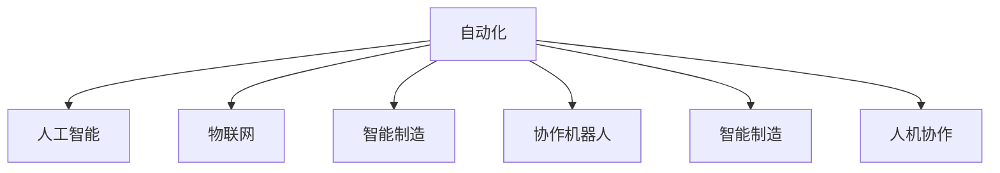

                 

## 1. 背景介绍

### 1.1 问题由来
自动化技术在过去几十年中取得了迅猛发展，从早期的机械臂、流水线到现代的智能系统、机器人，自动化已经深深地渗透到工业生产、医疗健康、农业等多个领域。随着人工智能、大数据等技术的成熟，自动化技术正迎来新的发展高峰。自动化技术的最新应用与发展，不仅提升了各行业的生产效率，还催生了新的业态，引领了新的变革。

### 1.2 问题核心关键点
自动化技术的发展经历了从机械化到自动化再到智能化的过程。当前，自动化技术正朝着智能化、网络化、协同化方向迈进。其核心关键点包括：

- **智能化：** 利用人工智能技术，实现对环境的感知、决策和执行的自动化。
- **网络化：** 通过互联网、物联网等技术，实现设备间的互联互通，形成协同作业网络。
- **协同化：** 在多主体、多任务环境下，实现自动化系统间的无缝对接与协同作业。

这些核心关键点共同构成了自动化技术发展的趋势，推动着各行各业的数字化转型。

### 1.3 问题研究意义
自动化技术的最新应用与发展，对提升生产效率、降低运营成本、改善用户体验等方面具有重要意义：

- **生产效率：** 自动化技术可以全天候、高精度地执行重复性、高危性任务，大幅提升生产效率。
- **运营成本：** 通过优化资源配置、减少人工干预，自动化技术可以降低企业的运营成本。
- **用户体验：** 自动化系统可以提供更快捷、更个性化的服务，提升用户体验。

此外，自动化技术还为各行业带来了新的业务模式，推动了产业结构的优化升级。

## 2. 核心概念与联系

### 2.1 核心概念概述

为更好地理解自动化技术的最新应用与发展，本节将介绍几个密切相关的核心概念：

- **自动化(Automation)**：指通过技术手段，使机器或系统能够自动执行某些任务或过程，无需人工干预。
- **人工智能(AI)**：利用计算机模拟人类智能过程，实现对复杂环境、任务的感知、推理和决策。
- **物联网(IoT)**：通过互联网技术，将各种设备、系统互联互通，形成智能化网络。
- **工业4.0**：以智能制造为核心，结合互联网、大数据、人工智能等技术，实现工业生产的全面自动化和智能化。
- **智能制造**：利用人工智能、大数据等技术，实现对制造过程的全生命周期管理，提升生产效率和质量。
- **协作机器人(Collaborative Robot, Cobot)**：指能够在人类工作环境中与人类协同作业的机器人。
- **人机协作**：通过智能系统，实现人与机器间的无缝对接与协作，提升工作效率和安全性。

这些核心概念之间的逻辑关系可以通过以下Mermaid流程图来展示：



这个流程图展示了几大核心概念之间的关系：

1. 自动化是基础，通过技术手段实现自动化。
2. 人工智能和物联网技术提升了自动化系统的智能化水平。
3. 智能制造、协作机器人等是自动化的具体应用场景。
4. 人机协作是自动化技术的高级形式，实现更高效的协同作业。

## 3. 核心算法原理 & 具体操作步骤
### 3.1 算法原理概述

自动化技术的最新应用与发展，涉及众多的技术原理和操作方法。其中，核心的算法原理包括以下几个方面：

- **感知与环境建模**：通过传感器、摄像头等设备获取环境信息，并建立环境模型。
- **决策与路径规划**：利用人工智能算法，对环境进行感知和分析，制定最优的决策和路径。
- **执行与控制**：通过机器人、自动化设备等执行决策，实现对物理系统的控制。

这些核心算法原理，构成了自动化技术应用的基本框架。

### 3.2 算法步骤详解

自动化技术的最新应用与发展，涉及多个关键步骤。以下是详细的操作步骤：

**Step 1: 环境感知与建模**
- 安装各类传感器、摄像头等设备，获取环境信息。
- 利用计算机视觉、激光雷达等技术，对环境进行三维建模。
- 使用深度学习模型，如卷积神经网络(CNN)、光流法等，进行环境感知。

**Step 2: 决策与路径规划**
- 使用AI算法，如强化学习、深度学习等，对环境进行分析和决策。
- 利用图搜索、A*等算法，进行路径规划和优化。
- 引入多目标优化、约束优化等技术，确保决策的有效性和可行性。

**Step 3: 执行与控制**
- 使用机器人、自动化设备等执行决策。
- 利用控制算法，如PID控制、模型预测控制等，实现对物理系统的精确控制。
- 引入实时监控、反馈调整等技术，确保执行的准确性和稳定性。

**Step 4: 评估与优化**
- 收集执行结果，评估系统性能。
- 使用数据分析、机器学习等技术，对系统进行优化。
- 引入持续改进机制，不断提升系统性能。

### 3.3 算法优缺点

自动化技术的最新应用与发展，具有以下优点：

- **高效性**：通过自动化系统，可以大幅提升生产效率，降低人力成本。
- **可靠性**：自动化系统可以在高危环境下执行任务，减少人为错误。
- **灵活性**：自动化系统可以通过编程和调参，适应不同的任务需求。

同时，该方法也存在一定的局限性：

- **初始成本高**：自动化系统的初始建设和维护成本较高。
- **依赖技术**：系统对技术要求较高，需要具备相应的技术能力和资源。
- **适用性有限**：对于一些复杂多变的环境，自动化系统的适应性可能不足。
- **安全风险**：自动化系统在应对突发事件时，可能存在安全风险。

尽管存在这些局限性，但就目前而言，自动化技术的应用与发展仍然具有重要的现实意义。未来相关研究的重点在于如何进一步降低初始成本，提高系统的适用性和安全性，同时兼顾灵活性和高效性。

### 3.4 算法应用领域

自动化技术的最新应用与发展，在多个领域得到了广泛应用，例如：

- **智能制造**：利用自动化技术，实现生产过程的自动化和智能化。
- **智能农业**：通过自动化系统，实现农业生产的精准管理和智能化。
- **智能交通**：利用自动化技术，实现交通流量的优化和调度。
- **智能医疗**：通过自动化设备，实现医疗诊断和治疗的智能化。
- **智能仓储**：利用自动化系统，实现物流仓储的自动化和智能化。

除了上述这些经典应用领域外，自动化技术还在更多场景中得到创新性的应用，如智能家居、智能安防、智能客服等，为各行各业带来新的变革。随着技术的不断进步，自动化技术的应用范围将不断扩展，为经济社会发展注入新的动力。

## 4. 数学模型和公式 & 详细讲解
### 4.1 数学模型构建

为了更好地理解自动化技术的最新应用与发展，本节将使用数学语言对核心算法进行更加严格的刻画。

假设有一个自动化系统，需要在环境中执行一系列任务。该系统的核心算法包括以下几个步骤：

1. 环境感知：使用传感器获取环境信息，建立环境模型。
2. 决策规划：使用AI算法进行决策和路径规划。
3. 执行控制：使用控制算法实现对物理系统的精确控制。

**环境感知模型**：
- 设环境信息为 $x_t \in \mathcal{X}$，环境模型为 $f: \mathcal{X} \rightarrow \mathcal{Y}$，其中 $\mathcal{X}$ 为输入空间，$\mathcal{Y}$ 为输出空间。
- 设传感器在时间 $t$ 时刻获取的环境信息为 $x_t$，环境模型输出的环境状态为 $y_t$。

**决策与路径规划模型**：
- 设决策结果为 $u_t \in \mathcal{U}$，其中 $\mathcal{U}$ 为决策空间。
- 设路径规划结果为 $w_t \in \mathcal{W}$，其中 $\mathcal{W}$ 为路径空间。
- 设决策函数为 $g: \mathcal{X} \times \mathcal{U} \rightarrow \mathcal{W}$，表示根据环境信息和决策，进行路径规划。

**执行与控制模型**：
- 设物理系统在时间 $t$ 时刻的状态为 $z_t \in \mathcal{Z}$，其中 $\mathcal{Z}$ 为状态空间。
- 设控制算法为 $h: \mathcal{Z} \times \mathcal{W} \rightarrow \mathcal{A}$，表示根据系统状态和路径规划结果，进行控制。
- 设物理系统的状态转移方程为 $\varphi: \mathcal{Z} \times \mathcal{A} \rightarrow \mathcal{Z}$，表示系统根据控制动作进行状态转移。

### 4.2 公式推导过程

以下我们以智能制造中的自动化路径规划为例，推导决策与路径规划模型的数学公式。

假设在智能制造中，自动化系统需要在工厂内运输物料。设环境信息 $x_t$ 为位置坐标 $(x, y)$，决策结果 $u_t$ 为速度 $v$，路径规划结果 $w_t$ 为路径点 $(w_x, w_y)$。

**决策函数**：
- 假设环境模型为简单的线性关系，即 $y_t = f(x_t)$。
- 设决策函数为 $g(x_t, v)$，表示根据当前位置和速度，进行路径规划。

**路径规划函数**：
- 假设路径规划结果为离散状态，即 $w_t$ 为路径上的离散点。
- 设路径规划函数为 $w(x_t, v)$，表示根据当前位置和速度，计算下一个路径点。

**状态转移方程**：
- 假设物理系统的状态转移方程为 $\varphi(z_t, a)$，表示根据系统状态和控制动作，进行状态转移。

将上述模型进行数学表示：

- 环境模型：$y_t = f(x_t)$
- 决策函数：$w_t = g(x_t, v)$
- 路径规划函数：$w_{t+1} = w(x_t, v)$
- 状态转移方程：$z_{t+1} = \varphi(z_t, a)$

利用上述模型，可以构建自动化系统的数学模型，并通过算法实现自动化路径规划。

### 4.3 案例分析与讲解

**案例1: 智能仓库自动化系统**
- 假设仓库内有多台AGV(自动导引车)需要运输物料。
- 使用传感器获取环境信息，包括位置坐标、障碍物位置等。
- 根据环境信息，使用决策函数进行路径规划。
- 使用控制算法，根据路径规划结果进行速度控制，实现AGV的自动化运输。

**案例2: 智能农业自动化系统**
- 假设农田内有多台无人机需要喷洒农药。
- 使用摄像头获取环境信息，包括植物生长状态、病虫害情况等。
- 根据环境信息，使用决策函数进行路径规划。
- 使用控制算法，根据路径规划结果进行飞行高度和速度控制，实现农药的智能化喷洒。

## 5. 项目实践：代码实例和详细解释说明
### 5.1 开发环境搭建

在进行自动化系统开发前，我们需要准备好开发环境。以下是使用Python进行开发的环境配置流程：

1. 安装Anaconda：从官网下载并安装Anaconda，用于创建独立的Python环境。

2. 创建并激活虚拟环境：
```bash
conda create -n automation-env python=3.8 
conda activate automation-env
```

3. 安装必要的Python包：
```bash
pip install numpy pandas scikit-learn matplotlib
```

4. 安装必要的开发工具：
```bash
pip install pyqt pyswip
```

完成上述步骤后，即可在`automation-env`环境中开始自动化系统开发。

### 5.2 源代码详细实现

下面以AGV智能运输系统为例，给出使用Python进行自动化路径规划的代码实现。

首先，定义环境信息和决策函数：

```python
import numpy as np
import matplotlib.pyplot as plt

# 定义环境模型
def environment_model(x):
    # 假设环境模型为线性关系
    return np.array([x[0], x[1]])

# 定义决策函数
def decision_function(x, v):
    # 假设决策函数为简单的线性关系
    return np.array([v[0], v[1]])
```

然后，定义路径规划函数：

```python
# 定义路径规划函数
def path_planning_function(x, v):
    # 假设路径规划为简单的直线
    return np.array([x[0], x[1]])
```

接着，定义状态转移方程：

```python
# 定义状态转移方程
def state_transfer_function(z, a):
    # 假设状态转移为简单的线性关系
    return np.array([z[0] + a[0], z[1] + a[1]])
```

最后，使用这些函数实现AGV的自动化路径规划：

```python
# 初始化AGV的位置和速度
x_initial = np.array([0, 0])
v_initial = np.array([1, 1])

# 初始化路径规划结果
w_initial = np.array([0, 0])

# 定义路径规划步数
num_steps = 10

# 进行路径规划
for step in range(num_steps):
    x = state_transfer_function(x_initial, v_initial)
    w = path_planning_function(x, v_initial)
    v = decision_function(x, w)
    x_initial = x
    w_initial = w

# 绘制路径规划图
plt.plot(x_initial[0], x_initial[1], 'ro')
plt.plot(w_initial[0], w_initial[1], 'bx')
plt.xlabel('X')
plt.ylabel('Y')
plt.show()
```

以上就是使用Python进行AGV智能运输系统的代码实现。可以看到，通过简单的数学模型和算法，我们就能够实现AGV的自动化路径规划。

### 5.3 代码解读与分析

让我们再详细解读一下关键代码的实现细节：

**环境模型**：
- 使用函数`environment_model`表示环境模型，将位置坐标转换为输出。
- 在本例中，假设环境模型为线性关系，即 $y_t = [x, y]$。

**决策函数**：
- 使用函数`decision_function`表示决策函数，根据当前位置和速度进行路径规划。
- 在本例中，假设决策函数为简单的线性关系，即 $w_t = [v_x, v_y]$。

**路径规划函数**：
- 使用函数`path_planning_function`表示路径规划函数，根据当前位置和速度计算下一个路径点。
- 在本例中，假设路径规划为简单的直线，即 $w_t = [x, y]$。

**状态转移方程**：
- 使用函数`state_transfer_function`表示状态转移方程，根据系统状态和控制动作进行状态转移。
- 在本例中，假设状态转移为简单的线性关系，即 $z_{t+1} = [x+v_x, y+v_y]$。

**路径规划实现**：
- 在代码中，我们通过循环迭代，实现AGV的路径规划。
- 每次迭代中，计算新的状态和路径规划结果，更新AGV的位置和速度。
- 最后绘制路径规划图，展示AGV的运动轨迹和路径点。

可以看到，通过简单的数学模型和算法，我们就能够实现AGV的自动化路径规划。

## 6. 实际应用场景
### 6.1 智能制造
智能制造是自动化技术最新应用的重要领域之一。通过自动化技术，可以实现生产过程的全面自动化和智能化，提升生产效率和产品质量。

在智能制造中，自动化系统可以应用于以下几个方面：

- **智能仓储**：通过AGV、自动化货架等设备，实现物料的智能化存储和运输。
- **智能生产线**：通过自动化机械臂、机器人等设备，实现生产线的智能化操作。
- **智能检测**：通过自动化检测设备，实现产品质量的智能化检测和分类。

**案例：智能仓储系统**
- 假设某制造企业需要实现物料的智能化存储和运输。
- 使用AGV、自动化货架等设备，构建智能仓储系统。
- 通过传感器获取环境信息，使用决策函数进行路径规划。
- 使用控制算法，实现AGV的自动化运输。

### 6.2 智能农业
智能农业通过自动化技术，实现农业生产的精准管理和智能化，提升农业生产效率和产量。

在智能农业中，自动化系统可以应用于以下几个方面：

- **智能灌溉**：通过自动化灌溉设备，实现精准灌溉。
- **智能施肥**：通过自动化施肥设备，实现精准施肥。
- **智能植保**：通过自动化植保设备，实现精准植保。

**案例：智能植保系统**
- 假设某农业企业需要实现智能植保。
- 使用无人机、自动喷药设备等，构建智能植保系统。
- 通过摄像头获取环境信息，使用决策函数进行路径规划。
- 使用控制算法，实现无人机的智能化喷洒。

### 6.3 智能交通
智能交通通过自动化技术，实现交通流量的优化和调度，提升交通效率和安全性。

在智能交通中，自动化系统可以应用于以下几个方面：

- **智能红绿灯**：通过自动化红绿灯设备，实现交通流量的优化。
- **智能导航**：通过自动化导航设备，实现车辆的智能化导航。
- **智能监控**：通过自动化监控设备，实现交通秩序的智能化管理。

**案例：智能红绿灯系统**
- 假设某城市需要实现智能红绿灯系统。
- 使用自动化红绿灯设备，构建智能红绿灯系统。
- 通过摄像头获取环境信息，使用决策函数进行路径规划。
- 使用控制算法，实现红绿灯的智能化控制。

### 6.4 智能医疗
智能医疗通过自动化技术，实现医疗诊断和治疗的智能化，提升医疗服务效率和质量。

在智能医疗中，自动化系统可以应用于以下几个方面：

- **智能诊断**：通过自动化诊断设备，实现疾病的智能化诊断。
- **智能治疗**：通过自动化治疗设备，实现治疗过程的智能化管理。
- **智能健康管理**：通过自动化健康监测设备，实现健康的智能化管理。

**案例：智能诊断系统**
- 假设某医院需要实现智能诊断系统。
- 使用自动化诊断设备，构建智能诊断系统。
- 通过传感器获取环境信息，使用决策函数进行路径规划。
- 使用控制算法，实现诊断过程的智能化管理。

## 7. 工具和资源推荐
### 7.1 学习资源推荐

为了帮助开发者系统掌握自动化技术的最新应用与发展，这里推荐一些优质的学习资源：

1. **《机器人学导论》**：经典教材，涵盖了机器人学的基础理论、建模、控制等知识。
2. **《机器人与自动化系统》课程**：由MIT开设的机器人学课程，讲解机器人学的基础理论和实际应用。
3. **《自动化系统设计与实现》书籍**：详细介绍了自动化系统设计、实现的流程和方法。
4. **《智能系统设计》课程**：由斯坦福大学开设的智能系统设计课程，讲解智能系统设计的方法和实践。
5. **《智能制造技术》课程**：由北航开设的智能制造技术课程，讲解智能制造的基础理论和应用。

通过对这些资源的学习实践，相信你一定能够快速掌握自动化技术的最新应用与发展，并用于解决实际的自动化问题。

### 7.2 开发工具推荐

高效的开发离不开优秀的工具支持。以下是几款用于自动化系统开发的常用工具：

1. **MATLAB/Simulink**：Simulink是MATLAB的仿真环境，用于自动化系统的建模和仿真。
2. **Simulink Control Design**：用于自动化系统的控制算法设计。
3. **ROS (Robot Operating System)**：开源的机器人操作系统，用于机器人系统的开发和集成。
4. **Catkin**：ROS的开发框架，用于构建自动化系统的软件包。
5. **Cobalt**：基于ROS的机器人仿真环境，用于机器人系统的仿真和测试。
6. **Arduino**：开源硬件平台，用于嵌入式系统的开发和应用。

合理利用这些工具，可以显著提升自动化系统开发的效率，加快创新迭代的步伐。

### 7.3 相关论文推荐

自动化技术的最新应用与发展，源于学界的持续研究。以下是几篇奠基性的相关论文，推荐阅读：

1. **《机器人操作系统ROS》**：介绍了ROS的设计理念、架构和应用。
2. **《自适应机器人控制》**：探讨了机器人系统中的自适应控制算法。
3. **《智能制造系统》**：介绍了智能制造系统的建模、仿真和优化方法。
4. **《机器人与自动化系统的协同控制》**：探讨了机器人系统中的协同控制算法。
5. **《智能农业自动化技术》**：介绍了智能农业自动化技术的应用和发展。

这些论文代表了大自动化技术的发展脉络。通过学习这些前沿成果，可以帮助研究者把握学科前进方向，激发更多的创新灵感。

## 8. 总结：未来发展趋势与挑战
### 8.1 研究成果总结

自动化技术的最新应用与发展，在自动化系统设计、实现、优化等方面取得了显著的进展。主要成果包括：

- **自动化系统的智能化**：通过引入人工智能技术，实现对环境的感知、决策和执行的智能化。
- **自动化系统的网络化**：通过物联网技术，实现设备间的互联互通，形成协同作业网络。
- **自动化系统的协同化**：在多主体、多任务环境下，实现自动化系统间的无缝对接与协同作业。

这些成果展示了自动化技术发展的广阔前景，推动了各行各业的数字化转型。

### 8.2 未来发展趋势

展望未来，自动化技术的最新应用与发展将呈现以下几个趋势：

1. **智能化水平提升**：自动化系统将更多地利用人工智能技术，实现更高级的感知、决策和执行能力。
2. **网络化程度提高**：通过物联网技术，自动化系统将更加广泛地实现设备互联，形成更高效的网络。
3. **协同化水平增强**：自动化系统将在多主体、多任务环境下，实现更高水平的协同作业。
4. **自适应能力提升**：自动化系统将具备更强的自适应能力，适应复杂多变的环境。
5. **安全性和可靠性提升**：自动化系统将具备更高的安全性和可靠性，减少事故风险。
6. **智能化管理**：自动化系统将实现更高级的智能化管理，提升生产效率和质量。

这些趋势将推动自动化技术不断进步，为各行业带来新的变革。

### 8.3 面临的挑战

尽管自动化技术的最新应用与发展已经取得了显著进展，但在迈向更加智能化、普适化应用的过程中，仍面临诸多挑战：

1. **技术成熟度不足**：当前自动化技术在某些领域仍存在技术瓶颈，难以完全满足应用需求。
2. **成本高昂**：自动化系统的初始建设和维护成本较高，需要大量的资金投入。
3. **安全风险**：自动化系统在应对突发事件时，可能存在安全风险，需要加强安全性设计和测试。
4. **系统复杂性高**：自动化系统的设计和实现较为复杂，需要多学科、多领域的协同合作。
5. **用户接受度低**：部分用户对自动化系统缺乏信任，需要加强用户教育和培训。

尽管存在这些挑战，但通过技术进步和多方合作，自动化技术的发展前景依然广阔。

### 8.4 研究展望

面对自动化技术面临的挑战，未来的研究需要在以下几个方面寻求新的突破：

1. **技术创新**：通过技术创新，解决自动化系统中的技术瓶颈，提升系统性能和可靠性。
2. **成本降低**：通过技术进步和管理优化，降低自动化系统的初始建设和维护成本，推动自动化技术的普及。
3. **安全性设计**：通过安全性设计和测试，确保自动化系统的稳定性和可靠性，减少安全风险。
4. **系统简化**：通过系统简化和优化，降低自动化系统的设计和实现复杂度，提升系统易用性。
5. **用户教育**：通过用户教育和培训，提升用户对自动化系统的接受度和信任度。

这些研究方向的探索，必将引领自动化技术迈向更高的台阶，为各行业带来新的变革。

## 9. 附录：常见问题与解答

**Q1：自动化技术在哪些领域有应用？**

A: 自动化技术在多个领域得到了广泛应用，例如：

- **智能制造**：利用自动化技术，实现生产过程的自动化和智能化。
- **智能农业**：通过自动化技术，实现农业生产的精准管理和智能化。
- **智能交通**：利用自动化技术，实现交通流量的优化和调度。
- **智能医疗**：通过自动化技术，实现医疗诊断和治疗的智能化。
- **智能仓储**：利用自动化技术，实现物料的智能化存储和运输。

除了上述这些经典应用领域外，自动化技术还在更多场景中得到创新性的应用，如智能家居、智能安防、智能客服等，为各行各业带来新的变革。

**Q2：自动化技术在开发过程中需要注意哪些问题？**

A: 在自动化技术的开发过程中，需要注意以下几个问题：

1. **技术成熟度**：自动化技术在某些领域仍存在技术瓶颈，需要谨慎评估技术成熟度，避免技术风险。
2. **成本投入**：自动化系统的初始建设和维护成本较高，需要充分考虑成本投入和回报。
3. **安全性设计**：自动化系统在应对突发事件时，可能存在安全风险，需要加强安全性设计和测试。
4. **系统复杂性**：自动化系统的设计和实现较为复杂，需要多学科、多领域的协同合作。
5. **用户接受度**：部分用户对自动化系统缺乏信任，需要加强用户教育和培训。

合理利用这些工具，可以显著提升自动化系统开发的效率，加快创新迭代的步伐。

**Q3：自动化技术的发展方向是什么？**

A: 自动化技术的发展方向主要包括以下几个方面：

1. **智能化水平提升**：自动化系统将更多地利用人工智能技术，实现更高级的感知、决策和执行能力。
2. **网络化程度提高**：通过物联网技术，自动化系统将更加广泛地实现设备互联，形成更高效的网络。
3. **协同化水平增强**：自动化系统将在多主体、多任务环境下，实现更高水平的协同作业。
4. **自适应能力提升**：自动化系统将具备更强的自适应能力，适应复杂多变的环境。
5. **安全性和可靠性提升**：自动化系统将具备更高的安全性和可靠性，减少事故风险。
6. **智能化管理**：自动化系统将实现更高级的智能化管理，提升生产效率和质量。

这些趋势将推动自动化技术不断进步，为各行业带来新的变革。

**Q4：自动化技术有哪些应用案例？**

A: 自动化技术在多个领域得到了广泛应用，以下是一些典型的应用案例：

1. **智能制造**：利用自动化技术，实现生产过程的自动化和智能化。例如，通过自动化机械臂、机器人等设备，实现生产线的智能化操作。
2. **智能农业**：通过自动化技术，实现农业生产的精准管理和智能化。例如，通过自动化灌溉设备，实现精准灌溉。
3. **智能交通**：利用自动化技术，实现交通流量的优化和调度。例如，通过自动化红绿灯设备，实现交通流量的优化。
4. **智能医疗**：通过自动化技术，实现医疗诊断和治疗的智能化。例如，通过自动化诊断设备，实现疾病的智能化诊断。
5. **智能仓储**：利用自动化技术，实现物料的智能化存储和运输。例如，通过AGV、自动化货架等设备，实现物料的智能化存储和运输。

这些案例展示了自动化技术的广泛应用前景。

---

作者：禅与计算机程序设计艺术 / Zen and the Art of Computer Programming

