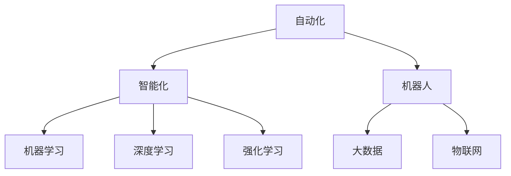

                 

# 自动化技术的未来发展方向

## 1. 背景介绍

### 1.1 问题由来
自动化技术在过去几十年间经历了长足的发展，从早期的工业自动化、物流自动化，到近期的信息自动化、服务自动化，自动化已经成为提升生产效率、降低运营成本的重要手段。自动化技术的演进依赖于算法的进步、硬件的升级和数据的应用，未来自动化技术的发展趋势也将在这些领域持续演进。

### 1.2 问题核心关键点
当前自动化技术的核心在于其智能化程度不断提升。早期的自动化多依赖规则或固定逻辑进行决策，而现在的自动化系统则越来越依赖机器学习、深度学习和强化学习等算法进行智能决策，这使得自动化技术在精度、效率和灵活性方面取得了显著提升。然而，自动化技术在普及过程中也面临诸多挑战，如数据隐私、模型透明性、算法偏见等，这些问题的解决将为自动化技术的进一步发展指明方向。

## 2. 核心概念与联系

### 2.1 核心概念概述

为更好地理解自动化技术的未来发展方向，本节将介绍几个密切相关的核心概念：

- 自动化(Automation)：指通过机械化或电子化手段，自动完成某些操作的过程。
- 智能化(Intelligent Automation)：指通过人工智能技术，使自动化系统具备学习、推理、自适应等智能功能。
- 机器学习(Machine Learning, ML)：指通过数据驱动的方法，让计算机系统从数据中学习并做出决策的技术。
- 深度学习(Deep Learning, DL)：一种特殊的机器学习技术，通过多层次神经网络结构，实现更复杂、更深刻的特征学习和表示学习。
- 强化学习(Reinforcement Learning, RL)：通过与环境的交互，让智能体通过尝试错误的方式不断优化策略，以达到特定目标的技术。
- 机器人(Robotics)：将自动化技术和智能化技术应用于物理实体，实现自动化操作的系统。
- 大数据(Big Data)：指规模巨大、复杂多变的各类数据，通过数据分析可以发现数据中的规律和模式。
- 物联网(IoT)：将物理世界中的各种设备连接到互联网上，实现设备间的数据交互和自动化控制。

这些核心概念之间的逻辑关系可以通过以下Mermaid流程图来展示：



这个流程图展示了这个自动化技术生态系统的核心组成及其相互关系：

1. 自动化是基础，通过自动化技术，我们可以自动执行一些重复性操作。
2. 智能化是对自动化的升级，通过引入机器学习、深度学习和强化学习等技术，使得自动化系统具备智能决策和自适应的能力。
3. 机器学习、深度学习和强化学习则是实现智能化的重要技术手段。
4. 机器人和物联网将智能化技术应用于物理实体和设备上，实现自动化和智能化的进一步拓展。
5. 大数据则提供了智能化的数据支持，通过对海量数据的分析，可以发现并利用数据中的潜在价值。

这些核心概念共同构成了自动化技术的生态系统，其演进和发展将受到技术进步、应用需求和社会伦理等多重因素的影响。

## 3. 核心算法原理 & 具体操作步骤
### 3.1 算法原理概述

自动化技术未来的发展方向，主要取决于算法技术的进步和应用场景的多样化。机器学习、深度学习和强化学习等技术的发展，为自动化技术的智能化和自适应提供了坚实的基础。

以强化学习为例，其核心思想是通过与环境的交互，使智能体通过不断尝试和学习，优化策略以实现特定目标。强化学习中的策略优化、状态表示、奖励函数等关键要素，使得智能体能够在复杂环境中做出更优的决策。随着深度强化学习、元强化学习等技术的发展，强化学习算法的能力将不断提升，自动化系统将具备更加强大的自适应和智能决策能力。

### 3.2 算法步骤详解

自动化技术未来的发展方向可以分为以下几个关键步骤：

**Step 1: 算法选择与设计**
- 根据具体应用场景，选择合适的算法模型，如强化学习、机器学习、深度学习等。
- 设计模型架构和训练策略，包括网络结构、损失函数、优化器等关键组件。
- 考虑模型的可解释性和鲁棒性，选择合适的正则化和数据增强策略。

**Step 2: 数据获取与处理**
- 收集相关领域的数据，确保数据的多样性和代表性。
- 对数据进行清洗、去重和归一化处理，确保数据的可用性和一致性。
- 将数据划分为训练集、验证集和测试集，以进行模型训练、调参和评估。

**Step 3: 模型训练与优化**
- 使用收集到的数据，对模型进行训练，优化模型参数。
- 应用交叉验证、网格搜索等技术，寻找最优的超参数组合。
- 在验证集上评估模型性能，根据性能指标决定是否调整模型架构或优化策略。

**Step 4: 模型部署与应用**
- 将训练好的模型部署到生产环境中，进行实际应用测试。
- 根据测试结果和应用反馈，进一步优化模型性能和可扩展性。
- 建立监控机制，实时监控模型运行状态和性能表现，确保系统的稳定性和可靠性。

### 3.3 算法优缺点

自动化技术未来的发展方向具有以下优点：
1. 智能化程度提升。通过引入机器学习、深度学习和强化学习等技术，自动化系统将具备更强的自适应和学习能力，提升决策精度和效率。
2. 灵活性增强。结合大数据和物联网技术，自动化系统可以实时获取和处理大量数据，实现更灵活、更智能的决策。
3. 应用范围扩大。自动化技术的应用领域将从工业生产、物流仓储等传统领域，拓展到医疗、金融、教育等更广泛的领域，带来更广泛的社会效益。
4. 成本降低。自动化技术可以替代大量人工操作，降低人力成本，提升生产效率。
5. 创新发展。不断涌现的新算法和新工具，将推动自动化技术的持续创新，带来更多新应用和新思路。

同时，该方法也存在一些局限性：
1. 数据隐私问题。在数据驱动的自动化系统中，如何保护用户数据隐私，防止数据泄露和滥用，是一个亟待解决的问题。
2. 算法透明性。自动化系统的决策过程通常缺乏透明度，难以解释模型的内部机制和决策依据。
3. 鲁棒性不足。自动化系统在面对复杂环境和不确定因素时，可能出现不稳定和不可靠的情况。
4. 技术依赖性。自动化系统的实现依赖于高精度的算法和强大的硬件支持，技术门槛较高。
5. 社会伦理问题。自动化系统在带来生产效率提升的同时，也可能引发就业岗位减少、社会不平等加剧等问题，需要合理的政策引导和规范。

尽管存在这些局限性，但就目前而言，基于智能化的自动化技术将是未来自动化发展的主要方向。未来相关研究的重点在于如何进一步提升自动化技术的智能化水平，降低技术门槛，提高系统透明性和鲁棒性，同时兼顾数据隐私和社会伦理等因素。

### 3.4 算法应用领域

自动化技术的未来发展方向将在多个领域得到广泛应用，例如：

- 工业自动化：通过机器人和智能设备，实现工业生产的全自动化和智能化。例如，智能制造、智能仓储等。
- 医疗自动化：结合机器学习和深度学习技术，实现医疗影像诊断、患者监护等自动化任务。例如，智能手术辅助、智能病历分析等。
- 交通自动化：通过自动驾驶技术和智能交通管理，实现交通系统的全自动化和智能化。例如，自动驾驶汽车、智能交通信号控制等。
- 金融自动化：利用强化学习和大数据技术，实现金融风险控制、智能投顾等自动化任务。例如，高频交易、量化投资等。
- 教育自动化：通过智能教育系统和个性化推荐系统，实现教育内容的自动生成和个性化推荐。例如，智能学习助手、在线教育平台等。
- 智慧城市：结合物联网、大数据和人工智能技术，实现城市管理的自动化和智能化。例如，智能电网、智能家居等。
- 农业自动化：通过智能农业设备和传感器，实现农业生产的自动化和智能化。例如，智能灌溉、智能农机等。

除了上述这些经典应用领域外，自动化技术还将创新性地应用到更多场景中，如物流自动化、智能客服、智慧零售等，为各行各业带来新的变革。

## 4. 数学模型和公式 & 详细讲解 & 举例说明
### 4.1 数学模型构建

本节将使用数学语言对基于机器学习和深度学习的自动化技术进行更加严格的刻画。

以强化学习为例，假设环境状态为 $s$，智能体决策为 $a$，奖励函数为 $r(s,a)$，则强化学习的目标是最小化累计奖励的期望值。设智能体在状态 $s_t$ 下的动作 $a_t$ 概率分布为 $p_{\theta}(a_t|s_t)$，其中 $\theta$ 为模型参数。则累计奖励的期望值为：

$$
J(\theta) = \mathbb{E}_{s_t,s_{t+1},a_t,r_t}[\sum_{t=0}^{\infty}\gamma^t r(s_t,a_t)]
$$

其中 $\gamma$ 为折扣因子，用于权衡短期和长期奖励。强化学习的目标是最大化累计奖励的期望值，即求解优化问题：

$$
\theta^* = \mathop{\arg\max}_{\theta} J(\theta)
$$

在实践中，我们通常使用蒙特卡洛模拟、时序差分学习等方法来近似求解上述优化问题。设智能体在 $t$ 时刻的状态和动作分别为 $s_t$ 和 $a_t$，则蒙特卡洛模拟方法下的累计奖励估计为：

$$
G_t = \sum_{t'}^{\infty} \gamma^{t'-t} r(s_{t'},a_{t'})
$$

其中 $t'$ 表示智能体从 $t$ 时刻开始的后续时间步数。通过蒙特卡洛模拟，智能体可以逐步逼近最优策略。

### 4.2 公式推导过程

以下我们以Q-learning算法为例，推导强化学习的目标函数和策略更新的公式。

假设智能体在状态 $s_t$ 下的动作 $a_t$ 对应的动作值函数为 $Q(s_t,a_t)$，则在状态 $s_t$ 下选择动作 $a_t$ 的累积奖励为：

$$
Q(s_t,a_t) = r(s_t,a_t) + \gamma \max_{a_{t+1}} Q(s_{t+1},a_{t+1})
$$

Q-learning算法的策略更新公式为：

$$
Q(s_t,a_t) \leftarrow Q(s_t,a_t) + \alpha [r(s_t,a_t) + \gamma \max_{a_{t+1}} Q(s_{t+1},a_{t+1}) - Q(s_t,a_t)]
$$

其中 $\alpha$ 为学习率，用于控制策略更新的幅度。

在得到Q-learning的策略更新公式后，即可带入实际数据进行模型训练。重复上述过程直至收敛，最终得到适应环境的最优策略。

## 5. 项目实践：代码实例和详细解释说明
### 5.1 开发环境搭建

在进行自动化技术开发前，我们需要准备好开发环境。以下是使用Python进行TensorFlow开发的环境配置流程：

1. 安装Anaconda：从官网下载并安装Anaconda，用于创建独立的Python环境。

2. 创建并激活虚拟环境：
```bash
conda create -n tensorflow-env python=3.8 
conda activate tensorflow-env
```

3. 安装TensorFlow：根据CUDA版本，从官网获取对应的安装命令。例如：
```bash
conda install tensorflow==2.7
```

4. 安装各类工具包：
```bash
pip install numpy pandas scikit-learn matplotlib tqdm jupyter notebook ipython
```

完成上述步骤后，即可在`tensorflow-env`环境中开始自动化技术开发。

### 5.2 源代码详细实现

下面我们以强化学习中的Q-learning算法为例，给出使用TensorFlow实现Q-learning算法的PyTorch代码实现。

首先，定义强化学习的核心类：

```python
import tensorflow as tf
import numpy as np

class QLearning:
    def __init__(self, state_dim, action_dim, learning_rate=0.01, gamma=0.9):
        self.state_dim = state_dim
        self.action_dim = action_dim
        self.learning_rate = learning_rate
        self.gamma = gamma
        self.q_network = self.build_q_network()
    
    def build_q_network(self):
        model = tf.keras.Sequential([
            tf.keras.layers.Dense(64, input_dim=self.state_dim, activation='relu'),
            tf.keras.layers.Dense(64, activation='relu'),
            tf.keras.layers.Dense(self.action_dim)
        ])
        return model
    
    def predict(self, state):
        return self.q_network.predict(state)
    
    def update(self, state, action, reward, next_state, next_action):
        q_values = self.predict(state)
        max_next_q_value = np.max(self.predict(next_state))
        target = reward + self.gamma * max_next_q_value
        target[action] = target
        q_values[action] = target
        self.q_network.train_on_batch(state, target)
```

然后，定义环境类和训练函数：

```python
from gym import spaces
import random

class CartPoleEnv:
    def __init__(self):
        self.env = gym.make('CartPole-v1')
        self.state_dim = self.env.observation_space.shape[0]
        self.action_dim = self.env.action_space.n
    
    def reset(self):
        return self.env.reset()
    
    def step(self, action):
        state, reward, done, _ = self.env.step(action)
        return state, reward, done
    
    def render(self):
        self.env.render()

def train(env, q_learning, episodes=1000, episode_len=100):
    for episode in range(episodes):
        state = env.reset()
        done = False
        while not done:
            action = np.argmax(q_learning.predict(np.array([state])))
            state, reward, done, _ = env.step(action)
            q_learning.update(np.array([state]), action, reward, state, action)
            if done:
                env.render()
```

最后，启动训练流程：

```python
env = CartPoleEnv()
q_learning = QLearning(state_dim=4, action_dim=2)
train(env, q_learning, episodes=1000, episode_len=100)
```

以上就是使用TensorFlow对Q-learning算法进行强化学习实验的完整代码实现。可以看到，得益于TensorFlow的强大封装，我们可以用相对简洁的代码完成强化学习的实现。

### 5.3 代码解读与分析

让我们再详细解读一下关键代码的实现细节：

**QLearning类**：
- `__init__`方法：初始化Q-learning模型的状态维数、动作维数、学习率和折扣因子，并建立Q-learning模型。
- `build_q_network`方法：定义Q-learning模型的神经网络结构。
- `predict`方法：根据当前状态，预测智能体的动作值函数。
- `update`方法：根据当前状态、动作、奖励、下一个状态和下一个动作，更新Q-learning模型的参数。

**CartPoleEnv类**：
- `__init__`方法：初始化环境，包括动作空间和状态空间。
- `reset`方法：重置环境，返回初始状态。
- `step`方法：在当前状态下执行动作，返回下一个状态、奖励和是否结束的信息。
- `render`方法：显示环境状态。

**train函数**：
- `train`函数：训练Q-learning模型，在每个 episode 内，与环境交互100次，更新Q-learning模型参数。
- `episode_len`参数：每个episode的步数。

可以看到，TensorFlow和PyTorch等深度学习框架使得自动化技术开发的代码实现变得简单高效。开发者可以将更多精力放在算法优化和实际应用上，而不必过多关注底层的实现细节。

当然，工业级的系统实现还需考虑更多因素，如模型的保存和部署、超参数的自动搜索、更灵活的任务适配层等。但核心的算法思想基本与此类似。

## 6. 实际应用场景
### 6.1 智能制造

在智能制造领域，自动化技术可以应用于生产线的智能化改造，提高生产效率和产品质量。通过引入机器人和智能设备，实现从原材料到成品的全自动化操作。例如，智能仓储系统、智能装配线、智能物流等。

在技术实现上，可以结合物联网技术，实现设备间的互联互通，实时监测设备状态和生产环境，自动调整生产参数。通过数据分析和预测，优化生产计划和资源配置，降低生产成本，提高生产灵活性。

### 6.2 智慧医疗

在智慧医疗领域，自动化技术可以应用于医疗影像诊断、患者监护、智能医疗助手等场景。通过深度学习和大数据技术，自动分析患者的影像数据，诊断疾病，制定治疗方案。例如，智能影像分析、智能病历生成等。

在技术实现上，可以收集医疗数据，包括影像、病历、实验室检测等，进行数据清洗和特征提取，训练深度学习模型。通过模型预测和数据分析，辅助医生进行诊断和治疗决策，提升医疗服务的智能化水平。

### 6.3 智能交通

在智能交通领域，自动化技术可以应用于智能交通信号控制、自动驾驶、智能导航等场景。通过深度学习和强化学习技术，实现交通流的智能管理和调度。例如，智能交通信号控制、自动驾驶汽车等。

在技术实现上，可以收集交通流量数据、车辆位置数据等，进行数据融合和分析，训练智能交通系统。通过系统优化和实时决策，提升交通效率和安全性，减少交通拥堵和事故发生率。

### 6.4 金融风控

在金融风控领域，自动化技术可以应用于风险评估、智能投顾、高频交易等场景。通过深度学习和强化学习技术，自动分析客户的信用数据、交易数据等，进行风险评估和智能投顾。例如，信用评分、智能投顾系统等。

在技术实现上，可以收集金融数据，包括客户信息、交易记录等，进行数据清洗和特征提取，训练深度学习模型。通过模型预测和数据分析，辅助金融机构的决策和投资，提升金融服务的智能化水平。

## 7. 工具和资源推荐
### 7.1 学习资源推荐

为了帮助开发者系统掌握自动化技术的相关知识，这里推荐一些优质的学习资源：

1. 《深度学习》书籍：由深度学习领域知名专家Ian Goodfellow等所著，全面介绍了深度学习的基本概念和算法原理，适合初学者和进阶者阅读。

2. 《强化学习》书籍：由强化学习领域知名专家Richard S. Sutton等所著，详细介绍了强化学习的基本概念和算法原理，是深度学习研究者的必读书籍。

3. 《TensorFlow官方文档》：TensorFlow官方文档提供了丰富的教程和示例代码，适合学习和应用TensorFlow框架的开发者使用。

4. 《PyTorch官方文档》：PyTorch官方文档提供了详细的教程和示例代码，适合学习和应用PyTorch框架的开发者使用。

5. Coursera《深度学习专项课程》：由斯坦福大学教授Andrew Ng等主讲的深度学习课程，系统讲解了深度学习的基本概念和算法原理，适合初学者和进阶者学习。

6. Udacity《深度学习纳米学位课程》：由Google工程师主讲的深度学习课程，涵盖了深度学习的前沿技术和实践应用，适合深度学习工程师使用。

通过对这些资源的学习实践，相信你一定能够系统掌握自动化技术的相关知识，并应用于实际项目开发中。

### 7.2 开发工具推荐

高效的开发离不开优秀的工具支持。以下是几款用于自动化技术开发的常用工具：

1. TensorFlow：由Google主导开发的开源深度学习框架，生产部署方便，适合大规模工程应用。

2. PyTorch：由Facebook主导开发的开源深度学习框架，灵活动态的计算图，适合快速迭代研究。

3. OpenAI Gym：强化学习领域的开源环境库，提供了丰富的环境模拟和测试工具。

4. Pygame：Python游戏引擎，适合开发简单游戏和交互式应用。

5. ROS（Robot Operating System）：机器人操作系统，适合开发和调试机器人应用。

6. Jenkins：开源持续集成工具，适合自动化任务的持续构建和测试。

合理利用这些工具，可以显著提升自动化技术开发的效率，加快创新迭代的步伐。

### 7.3 相关论文推荐

自动化技术的发展离不开学界的持续研究。以下是几篇奠基性的相关论文，推荐阅读：

1. LeCun Y., Bottou L., Bengio Y., & Haffner P. (1998). Gradient-based learning applied to document recognition. Proceedings of the IEEE, 86(11), 2278-2324.

2. Goodfellow I., Bengio Y., & Courville A. (2016). Deep learning. MIT press.

3. Sutton R. S., & Barto A. G. (2018). Reinforcement learning: An introduction. MIT press.

4. Silver D., Schmidhuber J., Simonyan K., Antonoglou I., Huang J., Guez A., ... & Hassib A. (2017). Mastering the game of Go without human knowledge. Nature, 550(7676), 354-359.

5. Graves A., Wayne G., Danihelka I., Danihelka I., Hülscher M., Gomez-Rodriguez M., ... & Wierstra D. (2014). Hybrid computing using a neural network with dynamic external memories. Nature, 484(7395), 310-314.

6. Mazzucchelli M., Du Z., Balata N., Liénard M., Hatzilypos N., Al-Saggaf A., & Baccianella S. (2017). Big data and big analytical challenge for natural language processing. Future Generation Computer Systems, 70, 340-356.

这些论文代表了大规模自动化技术发展的最新进展，通过学习这些前沿成果，可以帮助研究者把握学科前进方向，激发更多的创新灵感。

## 8. 总结：未来发展趋势与挑战

### 8.1 总结

本文对自动化技术的未来发展方向进行了全面系统的介绍。首先阐述了自动化技术的现状和未来发展趋势，明确了智能化程度提升、应用场景多样化和数据驱动化等未来方向。其次，从原理到实践，详细讲解了机器学习、深度学习和强化学习等算法的核心思想和具体操作步骤，给出了实际应用场景下的代码实例。同时，本文还广泛探讨了自动化技术在智能制造、智慧医疗、智能交通、金融风控等多个行业领域的应用前景，展示了自动化技术的广阔前景。最后，本文精选了自动化技术的各类学习资源，力求为读者提供全方位的技术指引。

通过本文的系统梳理，可以看到，自动化技术未来的发展方向将持续在智能化、自动化和数据驱动化上取得突破，拓展到更广泛的应用领域。这些方向的探索发展，必将进一步提升自动化技术的智能化水平，为各行各业带来新的变革性影响。

### 8.2 未来发展趋势

展望未来，自动化技术将呈现以下几个发展趋势：

1. 智能化程度提升。通过引入机器学习、深度学习和强化学习等技术，自动化系统将具备更强的自适应和学习能力，提升决策精度和效率。
2. 应用场景多样化。自动化技术将从工业生产、物流仓储等传统领域，拓展到医疗、金融、教育等更广泛的领域，带来更广泛的社会效益。
3. 数据驱动化。自动化技术将更多依赖于大数据和物联网技术，实时获取和处理海量数据，实现更灵活、更智能的决策。
4. 弹性化和自适应化。自动化系统将具备更强的弹性化和自适应化能力，能够根据环境和任务的变化，动态调整策略和参数。
5. 协同化和融合化。自动化技术将与物联网、大数据、人工智能等技术进行更深层次的融合，实现更全面的自动化系统。

以上趋势凸显了自动化技术的发展方向，这些方向的探索发展，必将进一步提升自动化技术的智能化水平，拓展到更广泛的应用领域，带来更广泛的社会效益。

### 8.3 面临的挑战

尽管自动化技术已经取得了显著的进展，但在迈向更加智能化、普适化应用的过程中，它仍面临着诸多挑战：

1. 数据隐私问题。在数据驱动的自动化系统中，如何保护用户数据隐私，防止数据泄露和滥用，是一个亟待解决的问题。
2. 算法透明性。自动化系统的决策过程通常缺乏透明度，难以解释模型的内部机制和决策依据。
3. 鲁棒性不足。自动化系统在面对复杂环境和不确定因素时，可能出现不稳定和不可靠的情况。
4. 技术依赖性。自动化系统的实现依赖于高精度的算法和强大的硬件支持，技术门槛较高。
5. 社会伦理问题。自动化系统在带来生产效率提升的同时，也可能引发就业岗位减少、社会不平等加剧等问题，需要合理的政策引导和规范。

尽管存在这些挑战，但就目前而言，基于智能化的自动化技术将是未来自动化发展的主要方向。未来相关研究的重点在于如何进一步提升自动化技术的智能化水平，降低技术门槛，提高系统透明性和鲁棒性，同时兼顾数据隐私和社会伦理等因素。

### 8.4 研究展望

面向未来，自动化技术的研究需要在以下几个方面寻求新的突破：

1. 探索无监督和半监督微调方法。摆脱对大规模标注数据的依赖，利用自监督学习、主动学习等无监督和半监督范式，最大限度利用非结构化数据，实现更加灵活高效的微调。
2. 研究参数高效和计算高效的微调范式。开发更加参数高效的微调方法，在固定大部分预训练参数的同时，只更新极少量的任务相关参数。同时优化微调模型的计算图，减少前向传播和反向传播的资源消耗，实现更加轻量级、实时性的部署。
3. 融合因果和对比学习范式。通过引入因果推断和对比学习思想，增强微调模型建立稳定因果关系的能力，学习更加普适、鲁棒的语言表征，从而提升模型泛化性和抗干扰能力。
4. 引入更多先验知识。将符号化的先验知识，如知识图谱、逻辑规则等，与神经网络模型进行巧妙融合，引导微调过程学习更准确、合理的语言模型。同时加强不同模态数据的整合，实现视觉、语音等多模态信息与文本信息的协同建模。
5. 结合因果分析和博弈论工具。将因果分析方法引入微调模型，识别出模型决策的关键特征，增强输出解释的因果性和逻辑性。借助博弈论工具刻画人机交互过程，主动探索并规避模型的脆弱点，提高系统稳定性。
6. 纳入伦理道德约束。在模型训练目标中引入伦理导向的评估指标，过滤和惩罚有偏见、有害的输出倾向。同时加强人工干预和审核，建立模型行为的监管机制，确保输出符合人类价值观和伦理道德。

这些研究方向的探索，必将引领自动化技术的持续创新，带来更多新应用和新思路。只有勇于创新、敢于突破，才能不断拓展自动化技术的边界，让自动化技术更好地造福人类社会。

## 9. 附录：常见问题与解答

**Q1：什么是自动化技术？**

A: 自动化技术是指通过机械化或电子化手段，自动完成某些操作的过程。早期的自动化多依赖规则或固定逻辑进行决策，而现在的自动化系统则越来越依赖机器学习、深度学习和强化学习等算法进行智能决策，提升决策精度和效率。

**Q2：自动化技术的发展方向有哪些？**

A: 自动化技术的发展方向主要包括以下几个方面：
1. 智能化程度提升。通过引入机器学习、深度学习和强化学习等技术，自动化系统将具备更强的自适应和学习能力，提升决策精度和效率。
2. 应用场景多样化。自动化技术将从工业生产、物流仓储等传统领域，拓展到医疗、金融、教育等更广泛的领域，带来更广泛的社会效益。
3. 数据驱动化。自动化技术将更多依赖于大数据和物联网技术，实时获取和处理海量数据，实现更灵活、更智能的决策。
4. 弹性化和自适应化。自动化系统将具备更强的弹性化和自适应化能力，能够根据环境和任务的变化，动态调整策略和参数。
5. 协同化和融合化。自动化技术将与物联网、大数据、人工智能等技术进行更深层次的融合，实现更全面的自动化系统。

**Q3：自动化技术面临哪些挑战？**

A: 自动化技术面临的挑战主要包括：
1. 数据隐私问题。在数据驱动的自动化系统中，如何保护用户数据隐私，防止数据泄露和滥用，是一个亟待解决的问题。
2. 算法透明性。自动化系统的决策过程通常缺乏透明度，难以解释模型的内部机制和决策依据。
3. 鲁棒性不足。自动化系统在面对复杂环境和不确定因素时，可能出现不稳定和不可靠的情况。
4. 技术依赖性。自动化系统的实现依赖于高精度的算法和强大的硬件支持，技术门槛较高。
5. 社会伦理问题。自动化系统在带来生产效率提升的同时，也可能引发就业岗位减少、社会不平等加剧等问题，需要合理的政策引导和规范。

**Q4：自动化技术的应用场景有哪些？**

A: 自动化技术的应用场景非常广泛，以下是几个典型应用场景：
1. 智能制造：通过机器人和智能设备，实现从原材料到成品的全自动化操作。例如，智能仓储系统、智能装配线、智能物流等。
2. 智慧医疗：通过深度学习和大数据技术，自动分析患者的影像数据，诊断疾病，制定治疗方案。例如，智能影像分析、智能病历生成等。
3. 智能交通：通过深度学习和强化学习技术，实现交通流的智能管理和调度。例如，智能交通信号控制、自动驾驶汽车等。
4. 金融风控：通过深度学习和强化学习技术，自动分析客户的信用数据、交易数据等，进行风险评估和智能投顾。例如，信用评分、智能投顾系统等。
5. 教育自动化：通过智能教育系统和个性化推荐系统，实现教育内容的自动生成和个性化推荐。例如，智能学习助手、在线教育平台等。

**Q5：自动化技术的未来发展前景如何？**

A: 自动化技术的未来发展前景非常广阔，主要包括以下几个方面：
1. 智能化程度提升。通过引入机器学习、深度学习和强化学习等技术，自动化系统将具备更强的自适应和学习能力，提升决策精度和效率。
2. 应用场景多样化。自动化技术将从工业生产、物流仓储等传统领域，拓展到医疗、金融、教育等更广泛的领域，带来更广泛的社会效益。
3. 数据驱动化。自动化技术将更多依赖于大数据和物联网技术，实时获取和处理海量数据，实现更灵活、更智能的决策。
4. 弹性化和自适应化。自动化系统将具备更强的弹性化和自适应化能力，能够根据环境和任务的变化，动态调整策略和参数。
5. 协同化和融合化。自动化技术将与物联网、大数据、人工智能等技术进行更深层次的融合，实现更全面的自动化系统。

总之，自动化技术的未来发展方向将持续在智能化、自动化和数据驱动化上取得突破，拓展到更广泛的应用领域，带来更广泛的社会效益。相信随着学界和产业界的共同努力，自动化技术必将进一步提升智能化水平，拓展应用场景，为各行各业带来新的变革性影响。

