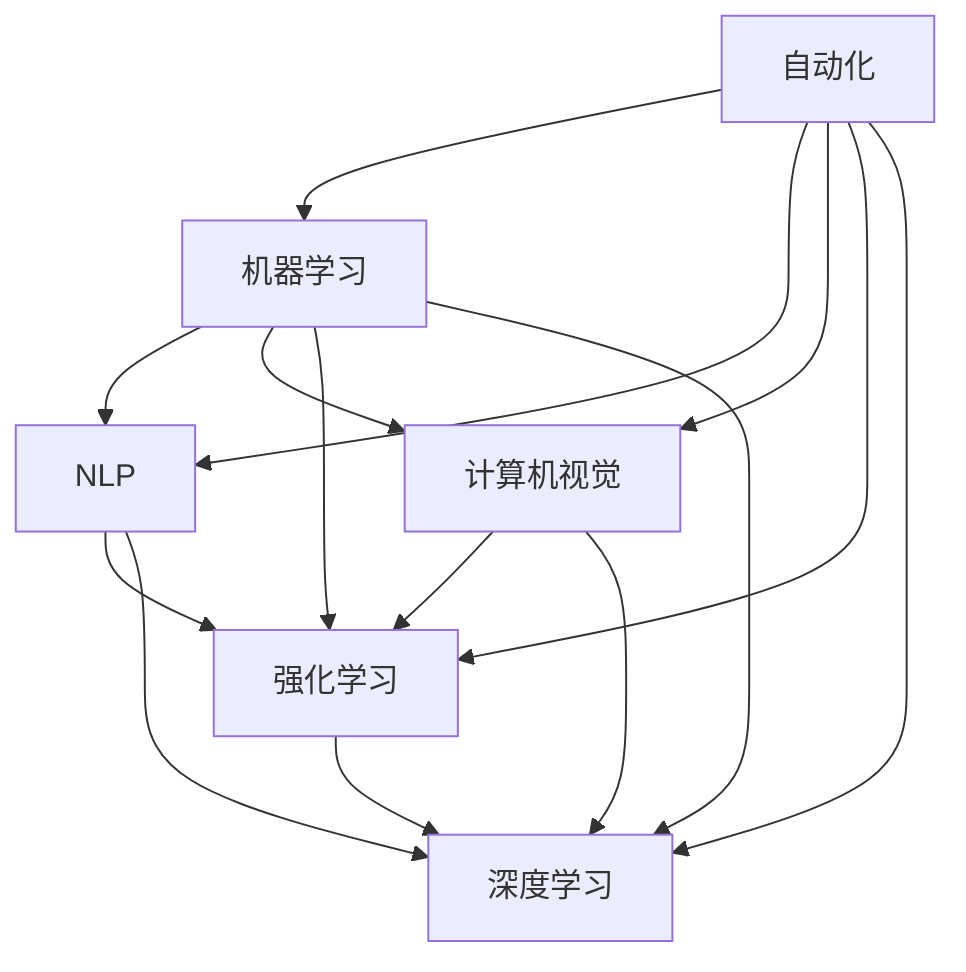

                 

## 1. 背景介绍

随着人工智能技术的飞速发展，自动化在各行各业的应用越来越广泛。自动化技术的核心在于通过技术手段，实现对任务的自动执行、优化和优化。本文将从自动化技术的发展脉络入手，探讨其最新的技术发展方向，包括机器学习、自然语言处理、计算机视觉等领域的最新进展，以及未来可能的趋势。

## 2. 核心概念与联系

### 2.1 核心概念概述

为了更好地理解自动化的最新技术发展方向，本节将介绍几个关键的概念及其相互联系：

- **自动化（Automation）**：指通过技术手段自动执行任务的过程，能够减少人力成本，提高工作效率。
- **机器学习（Machine Learning）**：指通过算法和统计模型，使计算机系统具有学习和改进能力，广泛应用于自动化中的任务执行和优化。
- **自然语言处理（Natural Language Processing, NLP）**：指使用计算机技术处理、理解和生成人类语言的技术，使得机器能够理解和执行自然语言任务，是自动化中的重要组成部分。
- **计算机视觉（Computer Vision）**：指通过图像处理和模式识别技术，使计算机能够“看”懂图像，广泛应用于自动化的目标检测、分类等任务。
- **强化学习（Reinforcement Learning）**：指通过与环境的互动，使智能体学习最优策略的机器学习技术，广泛应用于自动化中的智能决策和控制。
- **深度学习（Deep Learning）**：指使用深层神经网络进行复杂任务学习的一种机器学习技术，广泛应用于自动化中的图像识别、语音识别等。

这些核心概念之间的逻辑关系可以通过以下Mermaid流程图来展示：



这个流程图展示了一系列的自动化技术，包括机器学习、NLP、计算机视觉、强化学习、深度学习等，以及它们之间的联系。自动化技术的发展离不开这些关键技术的进步和融合。

## 3. 核心算法原理 & 具体操作步骤

### 3.1 算法原理概述

自动化的核心在于通过算法和数据，实现对任务的自动化处理。自动化算法可以分为监督学习、无监督学习和强化学习等。

- **监督学习（Supervised Learning）**：指使用已标注的数据，训练模型进行分类、回归等任务。监督学习算法包括决策树、支持向量机、随机森林等。
- **无监督学习（Unsupervised Learning）**：指使用未标注的数据，通过聚类、降维等技术，发现数据中的规律和结构。无监督学习算法包括K-means、主成分分析（PCA）等。
- **强化学习（Reinforcement Learning）**：指通过与环境的互动，智能体通过试错，学习最优策略。强化学习算法包括Q-learning、Deep Q-learning、Actor-Critic等。

这些算法技术在自动化中的应用，可以从以下几个方面进行说明：

1. **任务自动执行**：通过监督学习算法，自动化系统可以自动分类、回归等任务，如自动化的图像分类、文本分类、语音识别等。
2. **数据自动处理**：通过无监督学习算法，自动化系统可以自动发现数据中的规律和结构，如数据聚类、降维、特征提取等。
3. **智能决策**：通过强化学习算法，自动化系统可以学习最优策略，进行智能决策和控制，如自动驾驶、机器人控制等。

### 3.2 算法步骤详解

以监督学习算法为例，其操作步骤如下：

1. **数据准备**：收集、整理已标注的数据，划分为训练集、验证集和测试集。
2. **模型选择**：选择适当的监督学习算法，如决策树、支持向量机等。
3. **模型训练**：使用训练集对模型进行训练，调整模型参数，使得模型能够较好地拟合训练数据。
4. **模型评估**：使用验证集对模型进行评估，调整模型参数，防止过拟合。
5. **模型测试**：使用测试集对模型进行测试，评估模型的泛化能力。

### 3.3 算法优缺点

监督学习算法的优点在于其可解释性和稳定性。模型可以通过简单的逻辑规则进行解释，且在数据分布稳定的情况下，能够提供较为稳定的预测结果。

然而，监督学习算法也存在一定的局限性：

- **依赖标注数据**：需要大量高质量的标注数据，标注成本较高。
- **模型复杂度**：模型复杂度较高，训练和推理效率较低。
- **数据分布假设**：假设训练数据和测试数据的分布相同，但实际应用中数据分布可能存在差异，导致模型泛化性能下降。

### 3.4 算法应用领域

监督学习算法广泛应用于自动化技术中，包括但不限于以下几个领域：

- **自然语言处理（NLP）**：如文本分类、情感分析、机器翻译等。
- **计算机视觉**：如图像分类、目标检测、图像分割等。
- **信号处理**：如语音识别、信号滤波等。
- **推荐系统**：如商品推荐、广告推荐等。

## 4. 数学模型和公式 & 详细讲解

### 4.1 数学模型构建

监督学习算法通常使用线性回归、逻辑回归、决策树等模型。以线性回归为例，其数学模型可以表示为：

$$
y = \theta^T x + b
$$

其中 $y$ 表示输出，$x$ 表示输入特征，$\theta$ 表示模型参数，$b$ 表示偏置项。

### 4.2 公式推导过程

以线性回归为例，其损失函数可以表示为：

$$
L(\theta) = \frac{1}{2N} \sum_{i=1}^N (y_i - \theta^T x_i - b)^2
$$

其中 $N$ 表示样本数，$y_i$ 表示第 $i$ 个样本的真实标签，$x_i$ 表示第 $i$ 个样本的特征。

通过梯度下降等优化算法，最小化损失函数 $L(\theta)$，更新模型参数 $\theta$，具体公式如下：

$$
\theta \leftarrow \theta - \alpha \frac{\partial L(\theta)}{\partial \theta}
$$

其中 $\alpha$ 表示学习率，$\frac{\partial L(\theta)}{\partial \theta}$ 表示损失函数对模型参数 $\theta$ 的梯度。

### 4.3 案例分析与讲解

以图像分类为例，假设我们有 $N$ 个训练样本，每个样本包含 $d$ 个特征 $x_i$ 和一个标签 $y_i$。我们可以使用卷积神经网络（CNN）对图像进行特征提取，然后使用softmax回归进行分类。具体步骤如下：

1. **数据预处理**：将图像数据归一化、归一化等预处理。
2. **特征提取**：使用CNN提取图像特征 $x_i$。
3. **分类**：使用softmax回归对特征进行分类，得到输出 $y_i$。
4. **模型训练**：使用训练集对模型进行训练，调整模型参数。
5. **模型评估**：使用验证集对模型进行评估，调整模型参数。
6. **模型测试**：使用测试集对模型进行测试，评估模型的泛化能力。

## 5. 项目实践：代码实例和详细解释说明

### 5.1 开发环境搭建

在进行项目实践前，我们需要准备好开发环境。以下是使用Python进行TensorFlow开发的环境配置流程：

1. 安装Anaconda：从官网下载并安装Anaconda，用于创建独立的Python环境。

2. 创建并激活虚拟环境：
```bash
conda create -n tf-env python=3.8 
conda activate tf-env
```

3. 安装TensorFlow：根据CUDA版本，从官网获取对应的安装命令。例如：
```bash
conda install tensorflow tensorflow-gpu -c conda-forge -c pypi
```

4. 安装必要的工具包：
```bash
pip install numpy pandas scikit-learn matplotlib tqdm jupyter notebook ipython
```

完成上述步骤后，即可在`tf-env`环境中开始项目实践。

### 5.2 源代码详细实现

以下是使用TensorFlow进行图像分类的代码实现：

```python
import tensorflow as tf
from tensorflow.keras import datasets, layers, models
import matplotlib.pyplot as plt

# 加载数据集
(train_images, train_labels), (test_images, test_labels) = datasets.cifar10.load_data()

# 数据预处理
train_images, test_images = train_images / 255.0, test_images / 255.0

# 定义模型
model = models.Sequential([
    layers.Conv2D(32, (3, 3), activation='relu', input_shape=(32, 32, 3)),
    layers.MaxPooling2D((2, 2)),
    layers.Conv2D(64, (3, 3), activation='relu'),
    layers.MaxPooling2D((2, 2)),
    layers.Conv2D(64, (3, 3), activation='relu'),
    layers.Flatten(),
    layers.Dense(64, activation='relu'),
    layers.Dense(10)
])

# 编译模型
model.compile(optimizer='adam',
              loss=tf.keras.losses.SparseCategoricalCrossentropy(from_logits=True),
              metrics=['accuracy'])

# 训练模型
history = model.fit(train_images, train_labels, epochs=10, 
                    validation_data=(test_images, test_labels))

# 评估模型
test_loss, test_acc = model.evaluate(test_images,  test_labels, verbose=2)
print(test_acc)
```

以上代码实现了使用TensorFlow进行CIFAR-10数据集的图像分类任务。首先，加载并预处理数据集，然后定义卷积神经网络模型，并进行编译和训练。最后，评估模型的性能。

### 5.3 代码解读与分析

让我们再详细解读一下关键代码的实现细节：

**数据加载与预处理**：
- 使用`datasets.cifar10.load_data()`加载CIFAR-10数据集，并将数据归一化到[0,1]范围内。
- 定义模型时，使用`Conv2D`层进行卷积操作，`MaxPooling2D`层进行池化操作，`Flatten`层将特征展平，`Dense`层进行全连接操作。

**模型编译**：
- 使用`model.compile`对模型进行编译，设置优化器、损失函数和评估指标。

**模型训练**：
- 使用`model.fit`对模型进行训练，设置训练轮数和验证集。

**模型评估**：
- 使用`model.evaluate`对模型进行评估，获取测试集的损失和准确率。

## 6. 实际应用场景

### 6.1 自动驾驶

自动驾驶技术是自动化技术的重要应用场景之一。通过深度学习算法，自动驾驶系统可以从摄像头、雷达等传感器获取数据，进行目标检测、路径规划等任务，实现自主驾驶。

自动驾驶系统的核心在于以下几个关键技术：

1. **目标检测**：通过深度学习算法，检测道路上的车辆、行人、障碍物等目标。
2. **路径规划**：通过深度学习算法，规划最优路径，避免碰撞。
3. **决策控制**：通过深度学习算法，决策是否加速、刹车、转向等动作。

这些技术可以结合监督学习、强化学习等算法，实现自动驾驶系统的自主控制。

### 6.2 机器人控制

机器人控制是自动化技术的另一个重要应用场景。通过深度学习算法，机器人可以感知环境、执行任务，实现自主作业。

机器人控制系统的核心在于以下几个关键技术：

1. **环境感知**：通过计算机视觉算法，感知机器人所处的环境。
2. **任务执行**：通过深度学习算法，执行抓取、搬运、装配等任务。
3. **决策控制**：通过深度学习算法，决策机器人的移动和操作。

这些技术可以结合监督学习、强化学习等算法，实现机器人控制系统的自主作业。

### 6.3 金融风控

金融风控是自动化技术在金融领域的重要应用。通过深度学习算法，金融机构可以分析客户的交易行为，预测风险，实现风险控制。

金融风控系统的核心在于以下几个关键技术：

1. **数据预处理**：通过数据清洗、特征提取等技术，处理客户交易数据。
2. **风险预测**：通过深度学习算法，预测客户的信用风险。
3. **风险控制**：通过深度学习算法，控制客户的信用额度。

这些技术可以结合监督学习、无监督学习等算法，实现金融风控系统的自动化。

### 6.4 未来应用展望

随着自动化技术的发展，未来的自动化技术将具备更强的自适应和智能决策能力。以下是几个可能的发展方向：

1. **多模态自动化**：结合计算机视觉、自然语言处理、传感器等多模态信息，实现更全面、更精准的自动化系统。
2. **边缘计算**：将自动化系统部署到边缘设备，如智能手机、物联网设备等，实现更高效、更智能的自动化。
3. **强化学习**：通过强化学习算法，自动化系统可以自主学习最优策略，实现更灵活、更智能的自动化。
4. **人机协作**：结合自动化系统和人类，实现人机协作，提高自动化系统的灵活性和可解释性。

## 7. 工具和资源推荐

### 7.1 学习资源推荐

为了帮助开发者系统掌握自动化技术的发展脉络，这里推荐一些优质的学习资源：

1. **《深度学习》（Ian Goodfellow等著）**：这本书是深度学习的经典教材，涵盖了深度学习的各个方面，包括监督学习、无监督学习、强化学习等。
2. **《Python深度学习》（Francois Chollet著）**：这本书介绍了如何使用TensorFlow和Keras实现深度学习算法，适合初学者入门。
3. **《自然语言处理综论》（Daniel Jurafsky、James H. Martin等著）**：这本书介绍了自然语言处理的基本概念和技术，适合深入学习。
4. **《计算机视觉：算法与应用》（Richard Szeliski著）**：这本书介绍了计算机视觉的基本概念和技术，适合深入学习。
5. **OpenAI的博客和论文**：OpenAI的博客和论文涵盖了最新的深度学习算法和技术，适合跟踪前沿进展。

通过对这些资源的学习实践，相信你一定能够快速掌握自动化技术的精髓，并用于解决实际的自动化问题。

### 7.2 开发工具推荐

高效的开发离不开优秀的工具支持。以下是几款用于自动化技术开发的常用工具：

1. **TensorFlow**：基于Python的开源深度学习框架，适合开发和训练深度学习模型。
2. **Keras**：基于TensorFlow的高级API，适合快速原型设计和模型训练。
3. **PyTorch**：基于Python的开源深度学习框架，适合动态图模型开发。
4. **Jupyter Notebook**：交互式Python编程环境，适合快速迭代研究和实验。
5. **GitHub**：代码托管平台，适合版本控制和协作开发。
6. **Google Colab**：免费的在线Jupyter Notebook环境，适合实验和分享学习笔记。

合理利用这些工具，可以显著提升自动化技术的开发效率，加快创新迭代的步伐。

### 7.3 相关论文推荐

自动化技术的发展源于学界的持续研究。以下是几篇奠基性的相关论文，推荐阅读：

1. **ImageNet Classification with Deep Convolutional Neural Networks**（Alex Krizhevsky等著）：这篇论文介绍了使用卷积神经网络进行图像分类的技术，奠定了计算机视觉基础。
2. **Attention is All You Need**（Ashish Vaswani等著）：这篇论文介绍了Transformer模型，奠定了自然语言处理基础。
3. **Playing Atari with Deep Reinforcement Learning**（Volodymyr Mnih等著）：这篇论文介绍了使用深度强化学习算法进行游戏AI的实现，奠定了强化学习基础。
4. **Generative Adversarial Nets**（Ian Goodfellow等著）：这篇论文介绍了生成对抗网络（GAN）技术，奠定了生成模型基础。
5. **Deep Learning for Natural Language Processing**（Yoshua Bengio等著）：这篇论文介绍了使用深度学习算法进行自然语言处理的技术，奠定了NLP基础。

这些论文代表了大数据、深度学习、强化学习等自动化技术的发展脉络。通过学习这些前沿成果，可以帮助研究者把握学科前进方向，激发更多的创新灵感。

## 8. 总结：未来发展趋势与挑战

### 8.1 总结

本文对自动化技术的发展脉络进行了全面系统的介绍。首先阐述了自动化技术的发展背景和意义，明确了自动化技术在各个领域的应用价值。其次，从原理到实践，详细讲解了自动化技术的核心算法和操作步骤，给出了自动化任务开发的完整代码实例。同时，本文还探讨了自动化技术在自动驾驶、机器人控制、金融风控等多个领域的应用前景，展示了自动化技术的广阔前景。最后，本文精选了自动化技术的各类学习资源，力求为读者提供全方位的技术指引。

通过本文的系统梳理，可以看到，自动化技术在各行各业的应用前景广阔，未来将在人工智能、智能制造、智能城市等领域发挥越来越重要的作用。自动化技术的发展离不开持续的技术创新和应用实践，相信随着学界和产业界的共同努力，自动化技术必将引领人类社会进入一个新的智能化时代。

### 8.2 未来发展趋势

展望未来，自动化技术将呈现以下几个发展趋势：

1. **多模态自动化**：结合计算机视觉、自然语言处理、传感器等多模态信息，实现更全面、更精准的自动化系统。
2. **边缘计算**：将自动化系统部署到边缘设备，如智能手机、物联网设备等，实现更高效、更智能的自动化。
3. **强化学习**：通过强化学习算法，自动化系统可以自主学习最优策略，实现更灵活、更智能的自动化。
4. **人机协作**：结合自动化系统和人类，实现人机协作，提高自动化系统的灵活性和可解释性。
5. **自动化安全**：加强自动化系统的安全性，防止恶意攻击和数据泄露，确保系统的稳定性和可靠性。

这些趋势展示了自动化技术的广阔前景，相信随着技术的发展和应用的推广，自动化技术将在各个领域发挥更大的作用。

### 8.3 面临的挑战

尽管自动化技术已经取得了瞩目成就，但在迈向更加智能化、普适化应用的过程中，它仍面临着诸多挑战：

1. **数据质量问题**：自动化系统需要大量的高质量数据进行训练，但数据质量可能存在问题，如缺失、噪声等。
2. **模型可解释性**：自动化系统的决策过程往往缺乏可解释性，难以对其推理逻辑进行分析和调试。
3. **计算资源限制**：自动化系统的训练和推理可能需要大量的计算资源，但现有硬件设施可能无法满足需求。
4. **隐私和安全问题**：自动化系统需要处理大量的敏感数据，存在隐私泄露和数据安全风险。
5. **模型鲁棒性**：自动化系统面对新的、未知的数据时，可能出现性能下降或错误预测。

### 8.4 研究展望

面对自动化技术面临的挑战，未来的研究需要在以下几个方面寻求新的突破：

1. **数据增强和数据清洗**：通过数据增强和数据清洗技术，提高数据质量，减少噪声。
2. **可解释性增强**：通过可解释性增强技术，提高自动化系统的可解释性，方便用户理解和调试。
3. **计算资源优化**：通过计算资源优化技术，如分布式计算、混合精度训练等，提高自动化系统的训练和推理效率。
4. **隐私和安全保护**：通过隐私和安全保护技术，如数据加密、差分隐私等，确保自动化系统的数据安全。
5. **鲁棒性增强**：通过鲁棒性增强技术，提高自动化系统的鲁棒性，使其能够处理未知和异常数据。

这些研究方向将引领自动化技术走向更加智能化、普适化的未来，为人类社会带来更大的价值。

## 9. 附录：常见问题与解答

**Q1：自动化技术如何应用于智能制造？**

A: 自动化技术可以应用于智能制造的各个环节，如物料管理、设备维护、质量控制等。通过机器人和自动化设备，实现自动化生产线的运作，提高生产效率和质量。

**Q2：自动化技术在金融领域的应用有哪些？**

A: 自动化技术在金融领域可以应用于风险评估、交易执行、客户服务等方面。通过深度学习算法，分析客户交易行为，预测风险，实现风险控制。

**Q3：自动化技术在医疗领域的应用有哪些？**

A: 自动化技术在医疗领域可以应用于病历管理、诊断辅助、药品推荐等方面。通过自然语言处理算法，分析病历文本，提取关键信息，辅助医生诊断。

**Q4：自动化技术在智能交通中的应用有哪些？**

A: 自动化技术在智能交通中可以应用于交通流量预测、路径规划、自动驾驶等方面。通过深度学习算法，预测交通流量，规划最优路径，实现自动驾驶。

**Q5：自动化技术在自动驾驶中的应用有哪些？**

A: 自动化技术在自动驾驶中可以应用于目标检测、路径规划、决策控制等方面。通过深度学习算法，检测道路上的车辆、行人、障碍物等目标，规划最优路径，控制车辆的移动和操作。

---

作者：禅与计算机程序设计艺术 / Zen and the Art of Computer Programming

