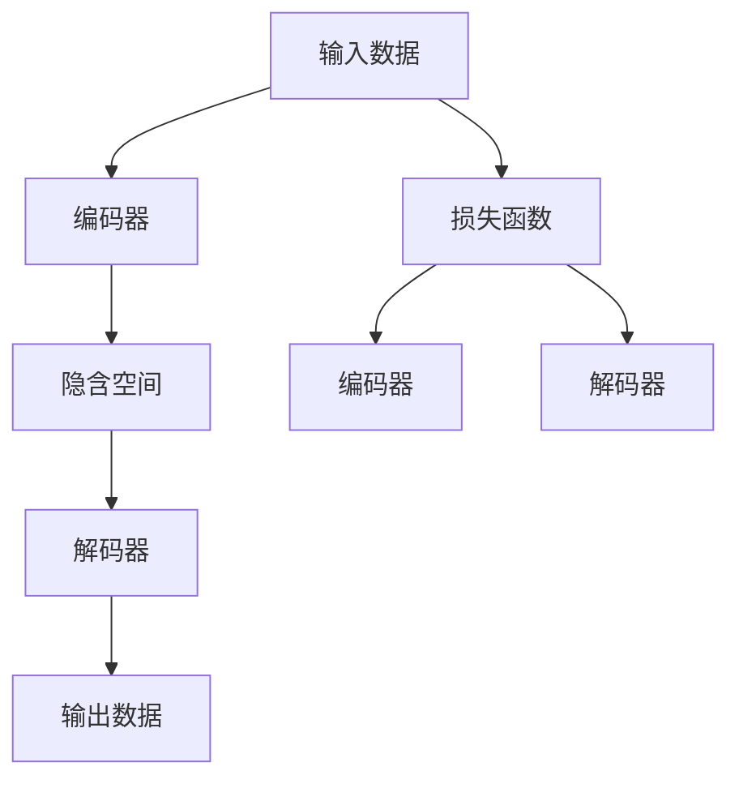

                 

# 自动编码器 (Autoencoder) 原理与代码实例讲解

> 关键词：自动编码器, 压缩与解压缩, 降噪, 降维, 生成对抗网络, 梯度消失, 梯度爆炸

## 1. 背景介绍

### 1.1 问题由来

自动编码器 (Autoencoder) 是一种无监督学习算法，主要用于数据的压缩与解压缩，特别是在数据去噪和降维方面的应用。其核心思想是将输入数据通过编码器 (Encoder) 映射到一个低维的隐含空间，然后再通过解码器 (Decoder) 将其解码还原成原始数据。这一过程能够有效去除数据的噪声，并降低数据的维度和复杂度，因此在图像处理、信号处理、数据压缩等领域有着广泛的应用。

### 1.2 问题核心关键点

自动编码器的核心在于通过编码和解码两个过程，实现对数据的压缩与解压缩。其基本流程为：
- **编码器**：将高维输入数据映射到低维隐含空间。
- **解码器**：将低维隐含空间的数据解码回原始数据。
- **损失函数**：通过比较解码后的数据与原始数据的差异，指导编码器和解码器的训练。

自动编码器的工作原理主要包括：
- **数据编码**：通过编码器将高维数据映射到低维空间。
- **数据解码**：通过解码器将低维数据重构为原始数据。
- **损失计算**：通过比较重构数据与原始数据的差异，计算损失，反向传播更新模型参数。

## 2. 核心概念与联系

### 2.1 核心概念概述

为更好地理解自动编码器的工作原理，本节将介绍几个密切相关的核心概念：

- **自动编码器 (Autoencoder)**：一种无监督学习模型，用于数据压缩与解压缩，实现数据的降噪和降维。
- **编码器 (Encoder)**：自动编码器中的第一个模块，负责将高维数据映射到低维隐含空间。
- **解码器 (Decoder)**：自动编码器中的第二个模块，负责将低维隐含空间的数据解码回原始数据。
- **损失函数**：衡量解码后数据与原始数据之间的差异，用于指导编码器和解码器的训练。
- **重构误差 (Reconstruction Error)**：解码后数据与原始数据之间的差异，用于评估自动编码器性能。

这些核心概念之间的逻辑关系可以通过以下Mermaid流程图来展示：



这个流程图展示自动编码器的核心概念及其之间的关系：

1. 输入数据经过编码器，映射到隐含空间。
2. 隐含空间的数据再经过解码器，解码为输出数据。
3. 损失函数用于衡量重构误差，指导编码器和解码器的训练。

## 3. 核心算法原理 & 具体操作步骤
### 3.1 算法原理概述

自动编码器的核心算法原理是基于神经网络，通过最小化重构误差，实现数据的压缩与解压缩。其目标是将高维输入数据映射到低维隐含空间，并能够通过解码器重构为原始数据。

自动编码器的工作流程为：
1. 输入数据经过编码器，生成低维隐含表示。
2. 隐含表示经过解码器，生成重构数据。
3. 通过重构误差（通常为均方误差），指导编码器和解码器的训练。

数学上，假设输入数据为 $X \in \mathbb{R}^{n_x}$，隐含表示为 $Z \in \mathbb{R}^{n_z}$，解码后的重构数据为 $\hat{X} \in \mathbb{R}^{n_x}$，其中 $n_x$ 为输入数据维度，$n_z$ 为隐含空间维度。自动编码器目标函数为：

$$
\min_{\theta_E, \theta_D} \frac{1}{2} \mathbb{E}_{(x \sim \mathcal{P}_{data})} \| x - D(E(x)) \|^2
$$

其中 $\theta_E$ 为编码器的参数，$\theta_D$ 为解码器的参数，$\mathcal{P}_{data}$ 为数据分布。

### 3.2 算法步骤详解

自动编码器的训练过程主要分为两个步骤：

1. **编码器训练**：将高维输入数据映射到低维隐含空间。
2. **解码器训练**：通过解码器将隐含空间的数据解码回原始数据。

在实际训练过程中，通常采用梯度下降算法，如Adam或SGD，最小化重构误差。训练步骤如下：

1. **前向传播**：将输入数据输入编码器，得到隐含表示。
2. **解码**：将隐含表示输入解码器，得到重构数据。
3. **计算误差**：计算重构数据与原始数据的误差，通常使用均方误差（MSE）。
4. **反向传播**：通过误差反向传播，更新编码器和解码器的参数。
5. **重复训练**：重复以上步骤，直到重构误差收敛。

### 3.3 算法优缺点

自动编码器具有以下优点：
1. **数据压缩**：通过编码器将高维数据映射到低维空间，实现数据压缩。
2. **降噪**：能够去除输入数据的噪声，提高数据质量。
3. **降维**：减少数据的维度和复杂度，便于后续处理。

同时，自动编码器也存在一些缺点：
1. **梯度消失/爆炸**：深度神经网络中，梯度可能消失或爆炸，导致训练困难。
2. **过度拟合**：在隐含空间维度较高时，容易出现过度拟合。
3. **复杂度**：神经网络的复杂度较高，训练和推理速度较慢。
4. **模型解释性差**：自动编码器模型较为复杂，解释性较差。

尽管存在这些缺点，但自动编码器在数据去噪、降维等方面的应用，依然具有重要的理论和实践价值。

### 3.4 算法应用领域

自动编码器在多个领域中得到了广泛应用，包括但不限于：

- **图像处理**：用于图像去噪、图像压缩、图像降维等。
- **信号处理**：用于信号去噪、信号压缩、信号降维等。
- **语音处理**：用于语音去噪、语音压缩、语音降维等。
- **文本处理**：用于文本去噪、文本压缩、文本降维等。
- **数据降维**：用于高维数据的降维，便于后续分析。

自动编码器在处理噪声数据、高维数据等方面表现出色，广泛应用于各个领域。

## 4. 数学模型和公式 & 详细讲解  
### 4.1 数学模型构建

本节将使用数学语言对自动编码器的数学模型进行更加严格的刻画。

假设输入数据 $x \in \mathbb{R}^{n_x}$，隐含表示 $z \in \mathbb{R}^{n_z}$，解码器输出 $y \in \mathbb{R}^{n_x}$。编码器和解码器可以表示为：

$$
z = E(x) = f_{E}(x) \theta_E
$$
$$
y = D(z) = f_{D}(z) \theta_D
$$

其中 $f_{E}$ 和 $f_{D}$ 为编码器和解码器的非线性变换，$\theta_E$ 和 $\theta_D$ 为编码器和解码器的参数。

自动编码器的目标函数为：

$$
L(x, y) = \frac{1}{2} \| x - y \|^2
$$

通过最小化目标函数 $L(x, y)$，可以实现数据压缩和去噪。

### 4.2 公式推导过程

以均方误差损失函数为例，自动编码器的目标函数可以表示为：

$$
L(x, y) = \frac{1}{2} \| x - y \|^2 = \frac{1}{2} \| x - D(E(x)) \|^2
$$

假设编码器 $E$ 和解码器 $D$ 的结构分别为：

$$
E(x) = \sigma(W_E x + b_E)
$$
$$
D(z) = \sigma(W_D z + b_D)
$$

其中 $\sigma$ 为激活函数，$W_E$ 和 $W_D$ 为权重矩阵，$b_E$ 和 $b_D$ 为偏置向量。

自动编码器的总损失函数为：

$$
L(x) = \frac{1}{2} \| x - D(E(x)) \|^2
$$

在训练过程中，需要优化编码器和解码器的参数，使得损失函数 $L(x)$ 最小化。梯度下降算法可以通过以下步骤进行：

1. **前向传播**：将输入数据 $x$ 输入编码器 $E$，得到隐含表示 $z$。
2. **解码**：将隐含表示 $z$ 输入解码器 $D$，得到重构数据 $\hat{x}$。
3. **计算误差**：计算重构数据 $\hat{x}$ 与原始数据 $x$ 的误差 $\Delta$。
4. **反向传播**：通过误差 $\Delta$ 反向传播，更新编码器和解码器的参数。
5. **重复训练**：重复以上步骤，直到误差收敛。

### 4.3 案例分析与讲解

以一个简单的手写数字识别任务为例，分析自动编码器的工作原理。

假设输入数据为 $x \in \mathbb{R}^{784}$，隐含表示为 $z \in \mathbb{R}^{128}$，解码器输出为 $y \in \mathbb{R}^{784}$。编码器 $E$ 和解码器 $D$ 的结构如下：

$$
E(x) = \sigma(W_E x + b_E)
$$
$$
D(z) = \sigma(W_D z + b_D)
$$

其中 $W_E$ 和 $W_D$ 为 784x128 和 128x784 的权重矩阵，$b_E$ 和 $b_D$ 为偏置向量。

通过前向传播计算得到隐含表示 $z$，然后通过解码器得到重构数据 $\hat{x}$。计算误差 $\Delta$：

$$
\Delta = \frac{1}{2} \| x - \hat{x} \|^2
$$

通过误差 $\Delta$ 反向传播更新编码器和解码器的参数，使得自动编码器能够更好地实现数据压缩和去噪。

## 5. 项目实践：代码实例和详细解释说明
### 5.1 开发环境搭建

在进行自动编码器实践前，我们需要准备好开发环境。以下是使用Python进行PyTorch开发的环境配置流程：

1. 安装Anaconda：从官网下载并安装Anaconda，用于创建独立的Python环境。

2. 创建并激活虚拟环境：
```bash
conda create -n autoencoder-env python=3.8 
conda activate autoencoder-env
```

3. 安装PyTorch：根据CUDA版本，从官网获取对应的安装命令。例如：
```bash
conda install pytorch torchvision torchaudio cudatoolkit=11.1 -c pytorch -c conda-forge
```

4. 安装TensorBoard：
```bash
pip install tensorboard
```

5. 安装PyTorch提供的自动编码器模型库：
```bash
pip install torchvision
```

完成上述步骤后，即可在`autoencoder-env`环境中开始自动编码器实践。

### 5.2 源代码详细实现

下面我以手写数字识别任务为例，给出使用PyTorch实现自动编码器的代码实现。

首先，定义模型结构：

```python
import torch
import torch.nn as nn
import torchvision
import torchvision.transforms as transforms

class Autoencoder(nn.Module):
    def __init__(self):
        super(Autoencoder, self).__init__()
        self.encoder = nn.Sequential(
            nn.Linear(784, 128),
            nn.ReLU(),
            nn.Linear(128, 64),
            nn.ReLU(),
            nn.Linear(64, 32),
            nn.ReLU()
        )
        self.decoder = nn.Sequential(
            nn.Linear(32, 64),
            nn.ReLU(),
            nn.Linear(64, 128),
            nn.ReLU(),
            nn.Linear(128, 784),
            nn.Tanh()
        )

    def forward(self, x):
        x = self.encoder(x)
        x = self.decoder(x)
        return x
```

然后，定义损失函数和优化器：

```python
from torch import nn, optim

criterion = nn.MSELoss()
optimizer = optim.Adam(model.parameters(), lr=0.001)
```

接着，定义训练和评估函数：

```python
def train(model, dataloader, optimizer, criterion):
    model.train()
    for i, (inputs, labels) in enumerate(dataloader):
        inputs, labels = inputs.to(device), labels.to(device)
        optimizer.zero_grad()
        outputs = model(inputs)
        loss = criterion(outputs, labels)
        loss.backward()
        optimizer.step()
        if i % 100 == 0:
            print(f'Train Epoch: {epoch + 1}, Loss: {loss.item():.4f}')

def evaluate(model, dataloader, criterion):
    model.eval()
    total_loss = 0
    with torch.no_grad():
        for i, (inputs, labels) in enumerate(dataloader):
            inputs, labels = inputs.to(device), labels.to(device)
            outputs = model(inputs)
            loss = criterion(outputs, labels)
            total_loss += loss.item()
    return total_loss / len(dataloader)
```

最后，启动训练流程并在测试集上评估：

```python
device = torch.device('cuda' if torch.cuda.is_available() else 'cpu')
model = Autoencoder().to(device)

dataloader = torch.utils.data.DataLoader(train_loader, batch_size=64, shuffle=True)
train_loader = torch.utils.data.DataLoader(test_loader, batch_size=64, shuffle=True)

epochs = 10
for epoch in range(epochs):
    train(model, dataloader, optimizer, criterion)
    print(f'Epoch {epoch + 1}, Loss: {evaluate(model, test_loader, criterion):.4f}')
```

以上就是使用PyTorch对手写数字识别任务进行自动编码器微调的完整代码实现。可以看到，得益于PyTorch的强大封装，我们可以用相对简洁的代码完成自动编码器的训练。

### 5.3 代码解读与分析

让我们再详细解读一下关键代码的实现细节：

**Autoencoder类**：
- `__init__`方法：定义编码器和解码器的结构，包括全连接层和激活函数。
- `forward`方法：实现前向传播，将输入数据通过编码器和解码器得到重构数据。

**损失函数和优化器**：
- `criterion`：定义均方误差损失函数。
- `optimizer`：定义Adam优化器，用于参数更新。

**训练和评估函数**：
- `train`函数：在训练集上迭代训练模型，计算并输出损失。
- `evaluate`函数：在测试集上评估模型的重构误差，返回均方误差。

**训练流程**：
- `device`：判断是否使用GPU进行加速。
- `model`：创建并实例化自动编码器模型，并移至指定设备。
- `dataloader`：定义训练和测试数据加载器，包括数据批大小和打乱顺序。
- `epochs`：设置训练轮数。
- 循环迭代训练模型，并在每个epoch结束时评估模型性能。

## 6. 实际应用场景

### 6.1 图像去噪

自动编码器在图像去噪方面有着广泛应用。通过将图像输入自动编码器，解码器输出的重构图像包含了去噪后的信息。具体应用包括医学图像、遥感图像等。

以医学图像去噪为例，原始图像可能包含噪声和细节丢失，影响医生的诊断。通过自动编码器对图像进行降噪，可以提升图像质量，帮助医生更准确地识别病变区域。

### 6.2 数据降维

自动编码器在数据降维方面同样有着重要作用。通过将高维数据映射到低维空间，可以去除冗余信息，便于后续分析和处理。

以数据压缩为例，假设原始数据为2000维，使用自动编码器将其降维到500维，减少了90%的数据量，同时保留最重要的特征。这种降维技术在信号处理、图像处理等领域有着广泛应用。

### 6.3 特征提取

自动编码器可以用于特征提取，将原始数据映射到低维空间，得到具有代表性的特征。这些特征可以用于分类、聚类等后续处理。

以手写数字识别为例，使用自动编码器将手写数字图像映射到低维空间，得到更丰富的特征，从而提升分类准确率。

## 7. 工具和资源推荐
### 7.1 学习资源推荐

为了帮助开发者系统掌握自动编码器的理论基础和实践技巧，这里推荐一些优质的学习资源：

1. 《深度学习》系列书籍：由Ian Goodfellow等作者所著，深入浅出地介绍了深度学习的基本概念和核心算法，包括自动编码器等。

2. CS231n《卷积神经网络》课程：斯坦福大学开设的计算机视觉课程，详细讲解了卷积神经网络和自动编码器在图像处理中的应用。

3. 《动手学深度学习》书籍：由李沐等作者所著，提供了丰富的深度学习代码实现，包括自动编码器的实践样例。

4. PyTorch官方文档：提供了自动编码器的详细介绍和代码实现，是学习自动编码器的必备资料。

5. Kaggle数据集：Kaggle平台提供大量自动编码器的实践数据集，可用于训练和评估自动编码器模型。

通过对这些资源的学习实践，相信你一定能够快速掌握自动编码器的精髓，并用于解决实际的NLP问题。

### 7.2 开发工具推荐

高效的开发离不开优秀的工具支持。以下是几款用于自动编码器开发的常用工具：

1. PyTorch：基于Python的开源深度学习框架，灵活动态的计算图，适合快速迭代研究。支持自动编码器的实现和训练。

2. TensorFlow：由Google主导开发的开源深度学习框架，生产部署方便，适合大规模工程应用。支持自动编码器的实现和训练。

3. Keras：高层次的深度学习框架，提供简单易用的API，支持自动编码器的快速搭建和训练。

4. Weights & Biases：模型训练的实验跟踪工具，可以记录和可视化模型训练过程中的各项指标，方便对比和调优。与主流深度学习框架无缝集成。

5. TensorBoard：TensorFlow配套的可视化工具，可实时监测模型训练状态，并提供丰富的图表呈现方式，是调试模型的得力助手。

6. Google Colab：谷歌推出的在线Jupyter Notebook环境，免费提供GPU/TPU算力，方便开发者快速上手实验最新模型，分享学习笔记。

合理利用这些工具，可以显著提升自动编码器开发的效率，加快创新迭代的步伐。

### 7.3 相关论文推荐

自动编码器在深度学习领域有着广泛的研究，以下是几篇奠基性的相关论文，推荐阅读：

1. Deep Belief Networks（DBN）: A Compositional Approach to Deep Independent Component Analysis：提出深度信念网络，一种无监督学习算法，通过多层神经网络实现数据压缩和去噪。

2. Autoencoder as a General Denoising Framework：提出自动编码器在降噪方面的应用，强调了其在数据去噪和降维中的重要性。

3. Variational Autoencoder（VAE）：提出变分自编码器，一种生成对抗网络，通过学习潜在变量空间实现数据生成和降维。

4. Denoising Autoencoder：提出带有噪声输入的自动编码器，通过加入噪声提升模型的鲁棒性和泛化能力。

5. Convolutional Autoencoder（CAE）：提出卷积自动编码器，用于图像去噪和降维，提升了模型在图像处理方面的性能。

这些论文代表自动编码器技术的发展脉络。通过学习这些前沿成果，可以帮助研究者把握学科前进方向，激发更多的创新灵感。

## 8. 总结：未来发展趋势与挑战

### 8.1 总结

本文对自动编码器的原理和实践进行了全面系统的介绍。首先阐述了自动编码器的背景和重要性，明确了自动编码器在数据去噪、降维等方面的应用价值。其次，从原理到实践，详细讲解了自动编码器的数学模型和关键步骤，给出了自动编码器任务开发的完整代码实例。同时，本文还广泛探讨了自动编码器在图像去噪、数据降维等多个领域的应用前景，展示了自动编码器的广阔应用空间。此外，本文精选了自动编码器的各类学习资源，力求为读者提供全方位的技术指引。

通过本文的系统梳理，可以看到，自动编码器作为一种无监督学习算法，通过将输入数据映射到低维空间，实现了数据的降噪、降维和特征提取。其应用领域广泛，技术实现相对简单，因此在深度学习中有着重要的地位。

### 8.2 未来发展趋势

展望未来，自动编码器技术将呈现以下几个发展趋势：

1. **深度化**：深度自动编码器将成为主流，通过增加层数和节点数，提升模型复杂度，提高去噪和降维的效果。

2. **多样化**：自动编码器将结合更多模型结构，如卷积自动编码器、循环自动编码器等，拓展其在不同领域的应用。

3. **低秩化**：低秩自动编码器（如低秩因子分解自动编码器）将得到广泛应用，降低模型参数量，提升训练效率。

4. **生成对抗化**：生成对抗网络（GAN）与自动编码器结合，通过对抗训练提升模型性能，实现更强的数据生成能力。

5. **网络融合**：自动编码器将与其他深度学习模型进行融合，如与循环神经网络（RNN）结合，提升序列数据的处理能力。

以上趋势凸显了自动编码器技术的广泛应用前景，其在深度学习领域的地位将会更加巩固。这些方向的探索发展，将进一步提升自动编码器的性能和应用范围，为数据去噪、降维等任务提供更加强大的技术支撑。

### 8.3 面临的挑战

尽管自动编码器技术已经取得了显著成就，但在向更高层次的应用拓展过程中，仍面临诸多挑战：

1. **计算资源瓶颈**：深度自动编码器需要大量计算资源，对GPU、TPU等高性能设备的需求较高，难以大规模部署。

2. **模型复杂性**：深度自动编码器的模型结构复杂，参数量巨大，训练和推理过程较为耗时，优化和调试难度较大。

3. **泛化能力不足**：在处理不同数据集时，自动编码器的泛化能力可能不足，需要进一步优化模型结构，提升泛化性能。

4. **过拟合风险**：在训练过程中，自动编码器容易出现过拟合，需要在损失函数中引入正则化项，避免过拟合。

5. **模型解释性差**：自动编码器的模型结构复杂，难以解释其内部工作机制，需要在模型设计中引入可解释性技术，提升模型的透明度。

6. **数据分布变化**：当数据分布发生变化时，自动编码器的性能可能受到影响，需要定期重新训练模型，以适应新的数据分布。

面对这些挑战，自动编码器技术需要进一步优化和创新，提升其在不同应用场景中的性能和鲁棒性。

### 8.4 研究展望

面对自动编码器面临的诸多挑战，未来的研究需要在以下几个方面寻求新的突破：

1. **模型优化**：研究更高效的模型结构，如低秩自动编码器、生成对抗网络（GAN）等，提升模型的泛化能力和鲁棒性。

2. **训练优化**：研究更快速的训练算法，如分布式训练、混合精度训练等，提升训练效率和模型性能。

3. **正则化技术**：研究更有效的正则化方法，如数据增强、随机失活等，避免过拟合，提升模型泛化能力。

4. **可解释性技术**：研究更强的可解释性技术，如模型可视化、局部可解释性等，提升模型的透明度和可靠性。

5. **分布式训练**：研究更高效的分布式训练算法，如异步分布式训练、模型并行等，提升模型训练效率。

6. **多模态融合**：研究自动编码器与其他模态数据的结合方法，如与视觉、音频等多模态数据的融合，提升系统的全面性。

这些研究方向将引领自动编码器技术迈向更高的台阶，为数据处理、特征提取等领域提供更加强大的技术支撑。相信随着技术的不断演进，自动编码器将在更多领域发挥重要作用，推动深度学习技术的持续发展。

## 9. 附录：常见问题与解答

**Q1：自动编码器如何应用于图像去噪？**

A: 自动编码器可以通过将噪声图像输入解码器，得到去噪后的图像。具体实现步骤为：
1. 定义图像数据集，包括噪声图像和干净图像。
2. 搭建自动编码器模型，定义编码器和解码器的结构。
3. 使用均方误差损失函数，最小化噪声图像和去噪图像之间的差异。
4. 训练自动编码器模型，得到去噪图像。

**Q2：自动编码器如何进行数据降维？**

A: 自动编码器可以通过将高维数据映射到低维空间，实现数据降维。具体实现步骤为：
1. 定义高维数据集，包括原始数据和标签。
2. 搭建自动编码器模型，定义编码器和解码器的结构。
3. 使用均方误差损失函数，最小化重构数据与原始数据之间的差异。
4. 训练自动编码器模型，得到低维表示。

**Q3：自动编码器如何提取数据特征？**

A: 自动编码器可以通过将原始数据映射到低维空间，得到具有代表性的特征。具体实现步骤为：
1. 定义原始数据集，包括输入数据和标签。
2. 搭建自动编码器模型，定义编码器和解码器的结构。
3. 使用均方误差损失函数，最小化重构数据与原始数据之间的差异。
4. 训练自动编码器模型，得到低维表示，作为数据特征。

这些自动编码器应用方面的问题及其解答，将有助于开发者更好地理解自动编码器的应用场景和实现方法。

---

作者：禅与计算机程序设计艺术 / Zen and the Art of Computer Programming

