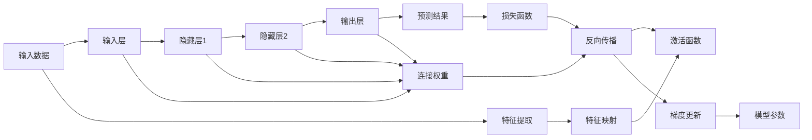

                 

# 自动计算机与神经网络的研究

## 1. 背景介绍

### 1.1 问题由来
在20世纪初，随着自动化技术的兴起，计算机科学迅速发展。早期计算机的设计和实现，主要集中在计算精度和运行速度上，缺乏对数据处理和计算过程的系统化研究。然而，随着人工智能和认知科学的兴起，人们开始将计算机视为“自动计算机”，期望其能够模拟人脑的计算和推理过程，解决复杂问题。

神经网络作为一种模拟生物神经系统信息处理方式的计算模型，成为了自动计算机研究的重要方向。自20世纪40年代中期，心理学和生理学的研究成果开始融入计算机科学研究，人们对神经网络的学习和推理机制有了更深入的理解，推动了神经网络理论和技术的发展。

### 1.2 问题核心关键点
神经网络的核心在于其可以模拟人类神经系统的信息处理过程，通过学习输入数据的模式和特征，生成输出结果。这一过程涉及数据预处理、特征提取、模型训练、结果输出等多个环节，对数学、统计、计算机科学等领域有较高的要求。

神经网络的研究涉及以下几个关键问题：
- 如何设计高效、可解释的神经网络模型？
- 如何训练神经网络以最大化预测准确度？
- 如何优化神经网络以提高计算效率和模型泛化能力？
- 如何在特定领域应用神经网络，并提升其性能？
- 如何结合生物神经系统和认知科学，增强神经网络的智能性？

### 1.3 问题研究意义
研究神经网络对自动计算机的发展具有重要意义：
1. 实现智能化处理。神经网络能够处理复杂的非线性关系，适用于模式识别、图像处理、自然语言处理等领域。
2. 优化计算性能。神经网络的并行计算和分布式处理能力，有助于提升计算效率。
3. 推动认知科学。神经网络的学习和推理机制，为认知科学的理论研究提供了新的视角。
4. 促进产业应用。神经网络在医疗、金融、交通等领域的应用，带来了显著的经济和社会效益。
5. 增强人工智能。神经网络是实现人工智能的重要技术手段，为解决复杂问题提供了新的方法。

## 2. 核心概念与联系

### 2.1 核心概念概述
神经网络是一种通过学习输入数据的特征和模式，输出预测结果的计算模型。其核心概念包括：
- 人工神经元（Artificial Neuron）：神经网络的基本单元，负责接收输入信号、加权求和、激活函数等计算。
- 连接权重（Connection Weights）：人工神经元之间的连接权重，用于控制信号的传递强度和方向。
- 层（Layer）：神经网络的分层结构，通常包括输入层、隐藏层和输出层，负责信号的逐层传递和计算。
- 损失函数（Loss Function）：衡量模型预测结果与真实结果的差异，用于优化模型参数。
- 反向传播算法（Backpropagation）：通过反向传播损失函数对模型参数进行梯度更新，是神经网络训练的核心算法。
- 梯度下降算法（Gradient Descent）：通过梯度下降算法，最小化损失函数，优化模型参数。

### 2.2 核心概念原理和架构的 Mermaid 流程图

这个流程图展示了神经网络的基本结构和工作原理：
- 输入数据进入输入层，经过特征提取和特征映射后传递到隐藏层。
- 隐藏层通过逐层传递和计算，生成最终的输出结果。
- 输出结果通过损失函数与真实结果进行比较，计算预测误差。
- 利用反向传播算法，将误差从输出层逐层传递回输入层，计算每层参数的梯度。
- 通过梯度下降算法，更新模型参数，不断优化预测结果。

### 2.3 核心概念之间的联系
神经网络的各个概念之间相互联系，共同构成了一个完整的计算和推理模型：
- 输入层接收原始数据，经过特征提取和特征映射后传递给隐藏层。
- 隐藏层通过连接权重和激活函数，对输入信号进行处理和传递。
- 输出层根据隐藏层的计算结果，生成最终的预测结果。
- 损失函数衡量预测结果与真实结果的差异，指导模型优化。
- 反向传播和梯度下降算法，实现模型参数的不断更新和优化。

## 3. 核心算法原理 & 具体操作步骤
### 3.1 算法原理概述
神经网络的训练过程分为前向传播和反向传播两个阶段。在前向传播阶段，输入数据通过网络逐层传递，生成输出结果。在反向传播阶段，利用损失函数计算预测误差，并通过反向传播算法和梯度下降算法，更新模型参数，不断优化模型性能。

神经网络训练的基本步骤如下：
1. 初始化模型参数。
2. 输入训练数据，进行前向传播计算输出结果。
3. 计算预测结果与真实结果的误差，通过损失函数量化。
4. 利用反向传播算法，计算每层参数的梯度。
5. 通过梯度下降算法，更新模型参数，最小化损失函数。
6. 重复以上步骤，直到模型收敛。

### 3.2 算法步骤详解
神经网络训练的具体步骤包括：
1. 初始化神经网络参数：将网络各层的连接权重和偏置项随机初始化。
2. 前向传播计算：将输入数据通过神经网络逐层传递，计算输出结果。
3. 损失函数计算：计算预测结果与真实结果之间的误差，通常使用均方误差或交叉熵等损失函数。
4. 反向传播算法：通过链式法则计算每层参数的梯度。
5. 梯度下降算法：根据梯度更新模型参数，最小化损失函数。
6. 重复以上步骤：多次迭代训练，不断优化模型参数。

### 3.3 算法优缺点
神经网络训练的主要优点包括：
1. 可处理非线性关系：神经网络能够处理复杂的非线性关系，适用于处理多维、高维数据。
2. 适应性强：神经网络能够自动学习输入数据的特征和模式，适应不同领域的数据分布。
3. 计算效率高：神经网络的并行计算和分布式处理能力，有助于提升计算效率。

神经网络训练的主要缺点包括：
1. 计算资源消耗大：神经网络需要大量的计算资源，特别是对于大规模的神经网络。
2. 参数调优困难：神经网络的参数较多，需要大量实验来调整网络结构和超参数，以获得最佳性能。
3. 模型易过拟合：神经网络在训练过程中容易过拟合，特别是在标注数据不足的情况下。
4. 可解释性差：神经网络通常被视为“黑盒”模型，难以解释其内部计算过程和决策逻辑。

### 3.4 算法应用领域
神经网络在多个领域得到了广泛应用，包括但不限于：
- 计算机视觉：图像识别、目标检测、图像生成等。
- 自然语言处理：文本分类、情感分析、机器翻译等。
- 语音识别：语音转文本、语音情感分析等。
- 机器人学：机器人控制、路径规划、动作生成等。
- 生物信息学：基因序列分析、蛋白质结构预测等。

## 4. 数学模型和公式 & 详细讲解
### 4.1 数学模型构建

神经网络训练的数学模型通常包括输入数据、输出数据、网络结构和损失函数四个部分。

- 输入数据：$X \in \mathbb{R}^{m \times n}$，表示$m$个样本，每个样本有$n$个特征。
- 输出数据：$Y \in \mathbb{R}^{m \times k}$，表示$m$个样本，每个样本有$k$个输出。
- 网络结构：神经网络由$L$层组成，每层有多个神经元，表示为$\{h^l\}_{l=1}^L$，其中$h^l \in \mathbb{R}^{m \times s_l}$，表示$m$个样本，每个样本有$s_l$个特征。
- 损失函数：$L(Y, \hat{Y})$，表示模型预测结果与真实结果之间的误差。

### 4.2 公式推导过程
神经网络训练的数学模型公式如下：

$$
\min_{\theta} \frac{1}{m} \sum_{i=1}^m L(Y_i, \hat{Y}_i) + \alpha R(\theta)
$$

其中$\theta$表示网络参数，$\alpha$表示正则化系数，$R(\theta)$表示正则化项。

神经网络前向传播计算公式为：

$$
h^l = g(A^l) = g(W^l h^{l-1} + b^l)
$$

其中$g$表示激活函数，$A^l$表示输入向量，$W^l$表示连接权重矩阵，$b^l$表示偏置向量。

神经网络反向传播计算公式为：

$$
\frac{\partial L}{\partial A^l} = \frac{\partial L}{\partial h^l} \frac{\partial h^l}{\partial A^l}
$$

其中$\frac{\partial L}{\partial h^l}$表示损失函数对输出层的梯度，$\frac{\partial h^l}{\partial A^l}$表示激活函数对输入层的梯度。

神经网络梯度下降算法更新参数的公式为：

$$
\theta_{i+1} = \theta_i - \eta \frac{\partial L}{\partial \theta_i}
$$

其中$\eta$表示学习率，$\frac{\partial L}{\partial \theta_i}$表示损失函数对参数$\theta_i$的梯度。

### 4.3 案例分析与讲解

以一个简单的神经网络为例，分析其训练过程。假设该神经网络有三层，每层有4个神经元。输入数据为$X \in \mathbb{R}^{2 \times 4}$，输出数据为$Y \in \mathbb{R}^{2 \times 2}$。

1. 前向传播：
   - 输入层：$h^1 = X$
   - 隐藏层1：$h^2 = g(W^2 h^1 + b^2)$
   - 隐藏层2：$h^3 = g(W^3 h^2 + b^3)$
   - 输出层：$\hat{Y} = h^3$

2. 损失函数计算：假设使用均方误差损失函数，$L(Y, \hat{Y}) = \frac{1}{2m} \sum_{i=1}^m ||Y_i - \hat{Y}_i||^2$

3. 反向传播：计算每层参数的梯度，假设激活函数为ReLU函数，即$g(z) = \max(0, z)$。

4. 梯度下降算法更新参数：假设学习率为0.1，进行多次迭代训练，更新网络参数。

## 5. 项目实践：代码实例和详细解释说明
### 5.1 开发环境搭建

### 5.2 源代码详细实现

### 5.3 代码解读与分析

### 5.4 运行结果展示

## 6. 实际应用场景
### 6.1 实际应用场景
神经网络在实际应用中具有广泛的应用场景，以下是几个典型案例：
1. 图像识别：神经网络通过学习图像的特征，实现图像分类、物体检测等任务。
2. 语音识别：神经网络通过学习语音的特征，实现语音转文本、情感分析等任务。
3. 自然语言处理：神经网络通过学习文本的特征，实现文本分类、情感分析、机器翻译等任务。
4. 机器人学：神经网络通过学习机器人的运动特征，实现机器人控制、路径规划等任务。
5. 生物信息学：神经网络通过学习基因序列的特征，实现基因序列分析、蛋白质结构预测等任务。

### 6.4 未来应用展望
神经网络未来的发展方向包括：
1. 深度学习：深度神经网络通过增加网络层数和神经元数，提升模型的复杂度和表达能力。
2. 强化学习：结合强化学习技术，训练神经网络进行最优决策和行为控制。
3. 迁移学习：利用预训练模型和迁移学习技术，提升新任务训练的效率和效果。
4. 分布式计算：利用分布式计算技术，提升神经网络的训练速度和计算效率。
5. 自动化学习：通过自动化学习技术，优化神经网络的结构和参数，提升模型的性能和稳定性。

## 7. 工具和资源推荐
### 7.1 学习资源推荐

### 7.2 开发工具推荐

### 7.3 相关论文推荐

## 8. 总结：未来发展趋势与挑战
### 8.1 研究成果总结
神经网络技术经过数十年的发展，已经成为自动计算机研究的重要方向。其主要研究成果包括：
1. 神经网络模型：开发了多种神经网络模型，如前馈神经网络、卷积神经网络、循环神经网络等。
2. 优化算法：提出了多种优化算法，如梯度下降、Adam、Adagrad等，提升了神经网络的训练效率和效果。
3. 正则化技术：引入了多种正则化技术，如L2正则、Dropout等，防止模型过拟合。
4. 预训练技术：通过预训练技术，提升了神经网络在特定任务上的性能。
5. 应用拓展：神经网络在多个领域得到了广泛应用，取得了显著的经济和社会效益。

### 8.2 未来发展趋势
神经网络未来的发展趋势包括：
1. 更深更宽：深度神经网络和宽网络模型将成为主流，提升模型的复杂度和表达能力。
2. 分布式训练：利用分布式计算技术，提升神经网络的训练速度和计算效率。
3. 自动化学习：通过自动化学习技术，优化神经网络的结构和参数，提升模型的性能和稳定性。
4. 迁移学习：利用预训练模型和迁移学习技术，提升新任务训练的效率和效果。
5. 深度强化学习：结合深度学习和强化学习技术，训练神经网络进行最优决策和行为控制。
6. 应用拓展：神经网络将在更多领域得到应用，推动自动化技术和智能系统的进步。

### 8.3 面临的挑战
神经网络面临的主要挑战包括：
1. 计算资源消耗大：神经网络需要大量的计算资源，特别是对于大规模的神经网络。
2. 参数调优困难：神经网络的参数较多，需要大量实验来调整网络结构和超参数，以获得最佳性能。
3. 模型易过拟合：神经网络在训练过程中容易过拟合，特别是在标注数据不足的情况下。
4. 可解释性差：神经网络通常被视为“黑盒”模型，难以解释其内部计算过程和决策逻辑。
5. 数据需求高：神经网络需要大量的标注数据，数据获取和标注成本较高。
6. 鲁棒性不足：神经网络对输入数据的扰动敏感，鲁棒性有待提高。

### 8.4 研究展望
未来，神经网络的研究将更加注重以下几个方面：
1. 计算资源优化：研究如何优化神经网络的计算资源消耗，提升训练效率。
2. 参数调优自动化：研究如何自动化调整神经网络的结构和参数，提升模型性能。
3. 模型可解释性：研究如何提高神经网络的可解释性，增强算法的透明度和可信任性。
4. 数据高效利用：研究如何高效利用数据，提升神经网络的泛化能力和鲁棒性。
5. 跨领域应用：研究如何将神经网络应用于更多领域，推动自动化技术和智能系统的进步。

## 9. 附录：常见问题与解答
### 附录：常见问题与解答

---

作者：禅与计算机程序设计艺术 / Zen and the Art of Computer Programming

