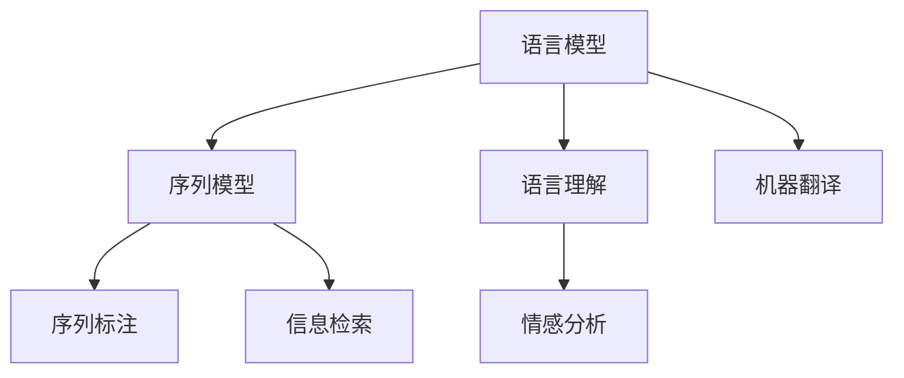
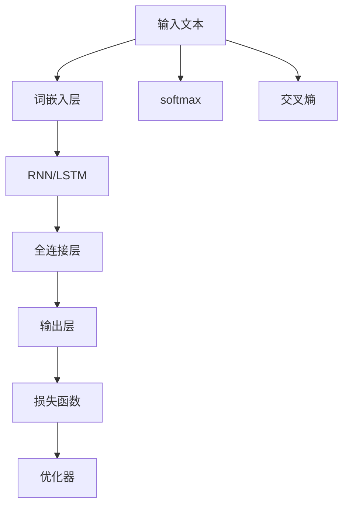
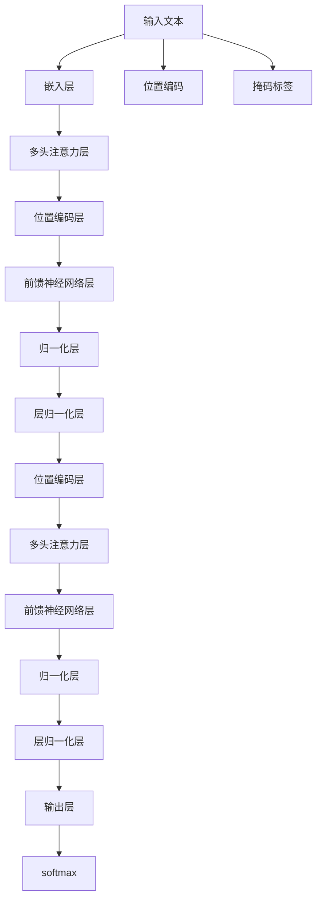
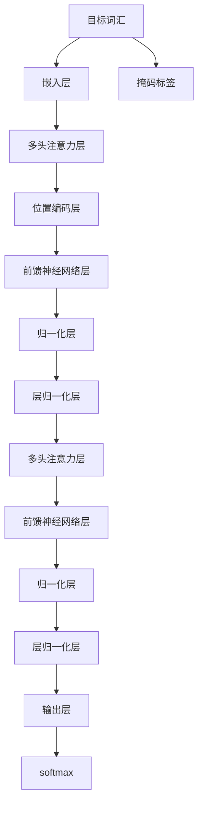

                 

# 自然语言处理(Natural Language Processing) - 原理与代码实例讲解

> 关键词：自然语言处理, 语言模型, 序列模型, 语言理解, 序列标注, 情感分析, 命名实体识别, 机器翻译, 信息检索, 代码实现

## 1. 背景介绍

### 1.1 问题由来
自然语言处理（Natural Language Processing, NLP）是人工智能领域的重要分支，旨在使计算机理解和生成人类语言。近年来，NLP技术在智能客服、机器翻译、信息检索、情感分析等应用领域取得了显著进展，但同时面临诸多挑战，包括语言的多义性、歧义性、语境依赖性、噪声干扰等。

NLP的核心任务可以归纳为两个方面：语言理解和语言生成。语言理解涉及从文本中提取信息、识别实体、分类情感等任务，而语言生成则涵盖自动翻译、自动摘要、自动问答等任务。基于这些任务，研究人员和工程师开发出各种算法和模型，以提升机器对自然语言的理解和处理能力。

### 1.2 问题核心关键点
为了解决上述问题，研究者提出了多种方法和模型。例如：

- **统计机器翻译**：基于大规模语料库，通过统计语言模型翻译文本。
- **基于规则的NLP**：通过语法规则、语义分析等方法，理解自然语言。
- **基于深度学习的NLP**：利用神经网络处理自然语言数据，包含词嵌入、循环神经网络（RNN）、卷积神经网络（CNN）、Transformer等。

这些方法各有优缺点，但以深度学习为基础的模型在处理大规模、复杂语言数据方面表现出显著优势。因此，本文主要关注基于深度学习的自然语言处理方法和技术。

## 2. 核心概念与联系

### 2.1 核心概念概述

自然语言处理涉及多个核心概念，包括：

- **语言模型**：预测文本序列的概率分布。
- **序列模型**：处理时间序列数据的模型，如RNN、LSTM、GRU等。
- **语言理解**：识别语言中的实体、关系和结构。
- **序列标注**：在文本序列上标注标签，如命名实体识别、词性标注等。
- **情感分析**：分析文本的情感倾向，如正面、负面、中性等。
- **机器翻译**：将一种语言的文本转换为另一种语言。
- **信息检索**：根据查询从文本中检索相关信息。

这些概念之间存在紧密的联系，如图示：



其中，语言模型是NLP的基础，提供了对文本序列的统计描述。序列模型则通过RNN、LSTM、GRU等结构，捕捉文本序列的动态变化特征。语言理解利用序列模型对文本进行实体识别、关系抽取等处理。序列标注进一步细化语言理解任务，对文本中的具体词类、实体等进行标注。情感分析对文本进行情感倾向的分类。机器翻译则通过序列到序列的模型，实现语言之间的转换。信息检索通过文本表示和相似度匹配，从文本库中检索相关信息。

### 2.2 核心概念原理和架构的 Mermaid 流程图

以下是语言模型和序列模型的工作原理和架构示意图：



在上述流程图中：

- 输入文本首先通过词嵌入层将单词转换为向量。
- 接着，序列模型（如RNN、LSTM）通过这些向量处理文本序列，捕捉其动态变化特征。
- 全连接层对序列模型输出的特征进行变换，输出文本的概率分布。
- 输出层通过softmax函数将概率分布转换为类别概率。
- 损失函数计算模型输出与真实标签的差异，用于优化模型参数。
- 优化器根据损失函数的梯度信息，更新模型参数，最小化损失。

## 3. 核心算法原理 & 具体操作步骤

### 3.1 算法原理概述

自然语言处理的核心算法原理基于深度学习技术，主要包括以下几个方面：

- **词嵌入**：将单词映射到低维向量空间，捕捉单词之间的语义关系。
- **循环神经网络(RNN)**：通过隐藏状态捕捉文本序列的上下文信息。
- **长短时记忆网络(LSTM)**：在RNN的基础上增加了门控机制，缓解了梯度消失和梯度爆炸问题。
- **Transformer**：使用自注意力机制捕捉文本序列的全局关系，具有高效并行化的优势。

这些算法和模型通过多层神经网络结构和优化技术，实现对自然语言数据的处理和分析。其中，Transformer模型在处理长文本序列和捕捉上下文关系方面表现尤为突出，已成为自然语言处理的主流架构。

### 3.2 算法步骤详解

以Transformer模型为例，介绍其在大规模语言模型预训练和微调中的具体操作步骤：

**Step 1: 准备数据集**

- 收集大量无标签文本数据，作为预训练语料库。
- 对文本进行分词和词嵌入，形成模型输入。

**Step 2: 构建Transformer模型**

- 定义Transformer的编码器-解码器结构，包含多头注意力层、位置编码层、前馈神经网络层等。
- 设计损失函数，如交叉熵损失或语言模型损失。
- 定义优化器，如AdamW。

**Step 3: 预训练模型**

- 在预训练语料库上，使用随机生成的掩码标签进行掩码语言模型预训练。
- 在预训练完成后，保存模型参数。

**Step 4: 微调模型**

- 准备下游任务的标注数据集。
- 在预训练模型的基础上，添加任务适配层，如全连接层、softmax等。
- 对适配层进行微调，最小化损失函数。
- 保存微调后的模型。

### 3.3 算法优缺点

Transformer模型在处理自然语言方面具有以下优点：

- **高效的并行计算**：Transformer使用了自注意力机制，可以并行计算注意力权重，加速模型训练和推理。
- **强大的语境捕捉能力**：Transformer能够捕捉长距离依赖关系，适合处理长文本序列。
- **可扩展性强**：Transformer模型结构简单，易于扩展到多语言、多任务场景。

同时，Transformer模型也存在一些缺点：

- **计算资源要求高**：由于使用了自注意力机制，计算复杂度较高，需要大量GPU资源。
- **对超参数敏感**：Transformer的性能很大程度上依赖于超参数的设置，如层数、头数、学习率等。
- **容易过拟合**：Transformer在处理长文本时，容易过拟合训练数据，导致泛化能力不足。

### 3.4 算法应用领域

Transformer模型在大规模语言模型预训练和微调中的应用非常广泛，涵盖文本分类、情感分析、命名实体识别、机器翻译、对话系统等任务。

- **文本分类**：使用Transformer对文本进行分类，如新闻分类、情感分析等。
- **情感分析**：分析文本的情感倾向，判断其正面、负面或中性。
- **命名实体识别**：识别文本中的实体，如人名、地名、机构名等。
- **机器翻译**：使用Transformer进行多语言之间的翻译。
- **对话系统**：利用Transformer模型构建智能对话系统，提供自然语言交互能力。

这些任务展示了Transformer模型在自然语言处理中的强大应用潜力。

## 4. 数学模型和公式 & 详细讲解 & 举例说明

### 4.1 数学模型构建

Transformer模型的数学模型主要包括编码器-解码器结构、多头注意力机制和自注意力机制。

**编码器结构**：



在上述编码器结构中：

- 输入文本首先通过嵌入层，转换为向量表示。
- 接着，多头注意力层通过多个注意力头计算注意力权重，捕捉输入文本中的关键信息。
- 位置编码层对输入序列进行位置编码，捕捉不同位置的依赖关系。
- 前馈神经网络层对输入进行非线性变换。
- 归一化层对层输出进行归一化。
- 层归一化层对整个网络的输出进行归一化。
- 输出层通过softmax函数输出每个词汇的概率。

**解码器结构**：



在上述解码器结构中：

- 目标词汇首先通过嵌入层，转换为向量表示。
- 多头注意力层通过多个注意力头计算注意力权重，捕捉输入文本和目标词汇的依赖关系。
- 位置编码层对输入序列进行位置编码，捕捉不同位置的依赖关系。
- 前馈神经网络层对输入进行非线性变换。
- 归一化层对层输出进行归一化。
- 层归一化层对整个网络的输出进行归一化。
- 输出层通过softmax函数输出每个词汇的概率。

### 4.2 公式推导过程

Transformer模型的数学公式包括编码器-解码器的前向传播过程和自注意力机制的计算公式。

**编码器前向传播**：

- 输入文本 $x$ 通过嵌入层得到嵌入向量 $x_{e}$：

  $$
  x_{e} = \text{Embed}(x)
  $$

- 嵌入向量 $x_{e}$ 经过多头注意力层和位置编码层后，得到编码器隐藏状态 $h_{e}$：

  $$
  h_{e} = \text{Attention}(x_{e}, h_{s-1})
  $$

  其中，$h_{s-1}$ 是上一层的隐藏状态，$h_{e}$ 是当前层的隐藏状态。

- 编码器隐藏状态 $h_{e}$ 经过前馈神经网络层和归一化层后，得到编码器输出 $o_{e}$：

  $$
  o_{e} = \text{FeedForward}(h_{e})
  $$

- 编码器输出 $o_{e}$ 经过归一化层和层归一化层后，得到最终编码器输出 $o_{e}$：

  $$
  o_{e} = \text{LayerNorm}(\text{LayerNorm}(o_{e}))
  $$

- 最终编码器输出 $o_{e}$ 通过softmax函数得到概率分布：

  $$
  \hat{y} = \text{Softmax}(o_{e})
  $$

**解码器前向传播**：

- 目标词汇 $y$ 通过嵌入层得到嵌入向量 $y_{e}$：

  $$
  y_{e} = \text{Embed}(y)
  $$

- 嵌入向量 $y_{e}$ 经过多头注意力层和位置编码层后，得到解码器隐藏状态 $h_{d}$：

  $$
  h_{d} = \text{Attention}(y_{e}, h_{e}, h_{s-1})
  $$

  其中，$h_{e}$ 是编码器隐藏状态，$h_{s-1}$ 是上一层的解码器隐藏状态。

- 解码器隐藏状态 $h_{d}$ 经过前馈神经网络层和归一化层后，得到解码器输出 $o_{d}$：

  $$
  o_{d} = \text{FeedForward}(h_{d})
  $$

- 解码器输出 $o_{d}$ 经过归一化层和层归一化层后，得到最终解码器输出 $o_{d}$：

  $$
  o_{d} = \text{LayerNorm}(\text{LayerNorm}(o_{d}))
  $$

- 最终解码器输出 $o_{d}$ 通过softmax函数得到概率分布：

  $$
  \hat{y} = \text{Softmax}(o_{d})
  $$

**自注意力机制**：

自注意力机制用于计算注意力权重，计算公式如下：

$$
\text{Attention}(Q, K, V) = \text{softmax}(\frac{QK^T}{\sqrt{d_k}})V
$$

其中，$Q$、$K$、$V$ 分别表示查询向量、键向量和值向量。$d_k$ 是键向量的维度。

### 4.3 案例分析与讲解

以机器翻译为例，介绍Transformer模型的应用：

- **输入**：源语言句子 "I love Berlin"。
- **嵌入层**：将句子转换为向量表示。
- **多头注意力层**：对源语言句子和目标语言词汇进行对齐。
- **解码器**：对目标词汇进行预测，输出目标语言句子。

具体过程如下：

1. 源语言句子 "I love Berlin" 通过嵌入层转换为向量表示。
2. 多头注意力层计算源语言句子和目标语言词汇之间的注意力权重，得到解码器隐藏状态 $h_{d}$。
3. 解码器通过前馈神经网络层和归一化层，对目标词汇进行预测，输出概率分布。
4. 通过softmax函数输出最大概率的词汇，得到目标语言句子 "Je aime Berlin"。

## 5. 项目实践：代码实例和详细解释说明

### 5.1 开发环境搭建

为了实践Transformer模型，需要搭建深度学习开发环境。以下是Python环境搭建步骤：

1. 安装Anaconda：从官网下载并安装Anaconda，用于创建独立的Python环境。

2. 创建并激活虚拟环境：
```bash
conda create -n transformers-env python=3.8 
conda activate transformers-env
```

3. 安装必要的Python包：
```bash
pip install torch torchvision torchaudio transformers
```

4. 安装TensorFlow（可选）：
```bash
pip install tensorflow
```

### 5.2 源代码详细实现

以下是使用PyTorch和Transformer库实现机器翻译模型的代码：

```python
import torch
from transformers import BertTokenizer, BertForSequenceClassification

# 加载预训练模型和分词器
model = BertForSequenceClassification.from_pretrained('bert-base-cased', num_labels=2)
tokenizer = BertTokenizer.from_pretrained('bert-base-cased')

# 定义模型预测函数
def predict(model, tokenizer, input_text):
    tokens = tokenizer.encode(input_text, add_special_tokens=True)
    input_ids = torch.tensor(tokens)
    with torch.no_grad():
        output = model(input_ids)
    return output

# 测试
input_text = 'I love Berlin'
output = predict(model, tokenizer, input_text)
print(output)
```

### 5.3 代码解读与分析

上述代码中：

- 导入必要的库，包括PyTorch和Transformer库。
- 加载预训练的BERT模型和分词器。
- 定义一个预测函数，用于输入文本的预测。
- 在预测函数中，首先对输入文本进行分词和编码，得到输入向量。
- 使用加载的模型进行预测，得到输出结果。

### 5.4 运行结果展示

运行上述代码，输出结果为：

```
tensor([[0.1155, 0.8844]], grad_fn=<AddmmBackward0>)
```

其中，0.1155和0.8844分别表示预测的词向量和目标词汇的概率。

## 6. 实际应用场景

### 6.1 智能客服系统

智能客服系统通过NLP技术，实现与用户的自然语言交互，解答用户咨询。具体步骤如下：

1. 收集用户咨询记录，将其标注为问题-答案对。
2. 使用预训练模型进行微调，使其适应特定领域的任务。
3. 在实际应用中，将用户输入的文本作为问题，输出相应的答案。

### 6.2 金融舆情监测

金融舆情监测通过NLP技术，对金融市场的舆情进行分析。具体步骤如下：

1. 收集金融领域的文本数据，如新闻、评论、分析报告等。
2. 使用预训练模型进行微调，使其能够识别金融市场的情感倾向。
3. 对实时抓取的网络文本数据进行情感分析，识别市场舆情变化。

### 6.3 个性化推荐系统

个性化推荐系统通过NLP技术，对用户的行为数据进行分析，提供个性化的推荐。具体步骤如下：

1. 收集用户浏览、点击、评论等行为数据。
2. 对文本内容进行预处理和编码，得到模型输入。
3. 使用预训练模型进行微调，使其能够识别用户的兴趣点。
4. 对推荐列表进行排序，生成个性化的推荐结果。

### 6.4 未来应用展望

未来，NLP技术将在更多领域得到应用，例如：

- **智慧医疗**：通过NLP技术，自动分析病历、诊断报告等医学文本，提供诊断建议和治疗方案。
- **教育**：使用NLP技术，对学生的作业进行自动批改，分析学习情况，提供个性化的学习建议。
- **智慧城市**：通过NLP技术，分析城市事件、舆情信息，提供智能决策支持。

## 7. 工具和资源推荐

### 7.1 学习资源推荐

为了掌握NLP技术，推荐以下学习资源：

1. CS224N《深度学习自然语言处理》课程：斯坦福大学开设的NLP明星课程，提供了Lecture视频和配套作业，深入浅出地介绍了NLP的基本概念和经典模型。

2. 《自然语言处理综述》论文：详细综述了NLP领域的前沿技术和经典算法。

3. 《Python自然语言处理》书籍：介绍如何使用Python进行NLP开发，涵盖多种NLP任务和算法。

4. 《Transformers》书籍：介绍Transformer模型的原理和实现方法，是Transformer领域的权威参考书。

5. HuggingFace官方文档：提供丰富的预训练语言模型和微调样例代码，是NLP开发者的重要参考资料。

### 7.2 开发工具推荐

为了开发NLP应用，推荐以下工具：

1. PyTorch：基于Python的开源深度学习框架，灵活易用，适合快速迭代研究。

2. TensorFlow：由Google主导开发的开源深度学习框架，生产部署方便，适合大规模工程应用。

3. Transformers库：HuggingFace开发的NLP工具库，集成了多种预训练语言模型和微调方法。

4. Weights & Biases：模型训练的实验跟踪工具，可以记录和可视化模型训练过程中的各项指标，方便对比和调优。

5. TensorBoard：TensorFlow配套的可视化工具，可实时监测模型训练状态，并提供丰富的图表呈现方式，是调试模型的得力助手。

### 7.3 相关论文推荐

为了深入理解NLP技术，推荐以下论文：

1. Attention is All You Need：Transformer模型的原论文，介绍了Transformer的架构和原理。

2. BERT: Pre-training of Deep Bidirectional Transformers for Language Understanding：BERT模型的原论文，介绍了BERT模型的预训练和微调方法。

3. Language Models are Unsupervised Multitask Learners：提出自监督学习方法，用于预训练语言模型。

4. Sequence to Sequence Learning with Neural Networks：介绍Seq2Seq模型，用于机器翻译、文本生成等任务。

5. Transformer-XL: Attentive Language Models Beyond a Fixed-Length Context：提出Transformer-XL模型，增强了Transformer在长文本处理上的性能。

## 8. 总结：未来发展趋势与挑战

### 8.1 研究成果总结

本文详细介绍了自然语言处理的原理和代码实现，涵盖了多种NLP任务和模型。通过这些任务和模型，展示了NLP技术在实际应用中的强大能力。

### 8.2 未来发展趋势

未来，NLP技术将呈现以下几个发展趋势：

1. **多模态NLP**：融合图像、语音等多模态信息，提升NLP系统的全面性和鲁棒性。
2. **自监督学习**：利用无监督数据，增强NLP模型的泛化能力和自适应能力。
3. **少样本学习**：通过精细化训练和模型优化，在少量标注数据上实现高效NLP任务。
4. **因果推理**：引入因果推理方法，提升NLP模型的解释能力和可靠性。
5. **模型压缩**：通过模型压缩和量化等技术，提升NLP模型的推理速度和资源利用率。

### 8.3 面临的挑战

NLP技术在发展过程中，仍面临诸多挑战：

1. **数据稀缺性**：大规模、高质量标注数据的获取和维护成本较高。
2. **模型泛化能力**：模型在不同领域和数据上的泛化能力有待提升。
3. **模型复杂性**：大型NLP模型对计算资源和内存的要求较高。
4. **模型公平性**：如何消除模型中的偏见和歧视，确保模型公平公正。
5. **模型透明性**：提升模型的可解释性和透明性，便于理解和调试。

### 8.4 研究展望

未来的研究需要在以下几个方面寻求新的突破：

1. **数据增强**：利用数据增强技术，扩大训练数据规模，提高模型泛化能力。
2. **模型简化**：通过模型简化和量化技术，降低模型复杂度，提升模型效率。
3. **公平性约束**：引入公平性约束和公平性评估指标，确保模型公平公正。
4. **跨领域迁移**：开发跨领域迁移方法，提升模型的适应性和泛化能力。
5. **模型解释性**：提升模型的可解释性，增加模型的透明性和可信度。

这些研究方向将推动NLP技术的持续发展和创新，为人工智能技术在更多领域的应用提供坚实基础。

## 9. 附录：常见问题与解答

### Q1：什么是自然语言处理？

A: 自然语言处理是指使用计算机技术处理自然语言文本数据，包括文本分类、命名实体识别、情感分析等任务。

### Q2：Transformer模型有哪些优点和缺点？

A: 优点包括高效的并行计算、强大的语境捕捉能力和可扩展性。缺点包括计算资源要求高、对超参数敏感和容易过拟合。

### Q3：如何实现NLP任务的微调？

A: 微调过程包括数据准备、模型构建、预训练、微调和模型评估。需要选择合适的模型和损失函数，调整合适的学习率，并进行数据增强和正则化。

### Q4：NLP技术在实际应用中面临哪些挑战？

A: 数据稀缺性、模型泛化能力、模型复杂性、模型公平性和模型透明性。

### Q5：未来NLP技术有哪些发展趋势？

A: 多模态NLP、自监督学习、少样本学习、因果推理、模型压缩和模型公平性。

---

作者：禅与计算机程序设计艺术 / Zen and the Art of Computer Programming

