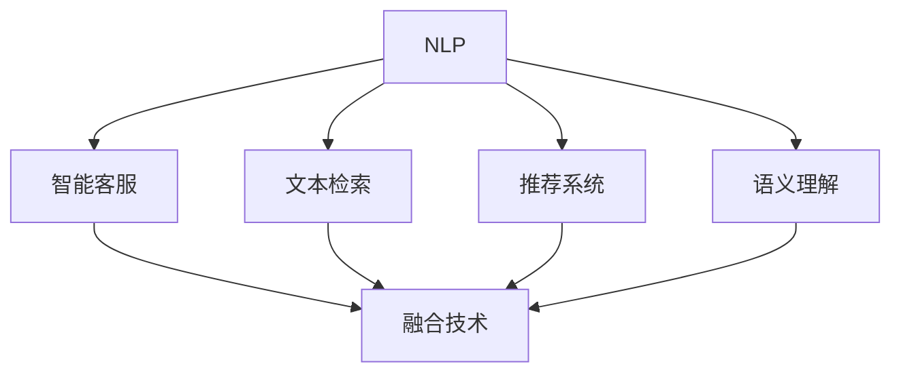

                 

# 自然语言处理在电商搜索中的应用：技术发展与未来趋势

> 关键词：自然语言处理, 电商搜索, 文本检索, 语义理解, 推荐系统, 智能客服, 未来的发展趋势, 前沿技术

## 1. 背景介绍

### 1.1 问题由来
随着互联网的普及和电子商务的迅猛发展，电商平台的搜索功能日益成为用户获取商品信息、提升购物体验的关键。但如何高效、准确地处理海量商品描述，理解用户查询意图，精准推荐商品，仍是电商搜索面临的主要挑战。

自然语言处理（Natural Language Processing, NLP）作为AI技术的核心分支之一，其在电商搜索中的应用已经广泛涉及文本检索、语义理解、推荐系统和智能客服等多个层面。NLP技术通过模型和算法的不断优化，使得电商搜索逐渐从传统关键词匹配向智能语义推荐转变，大幅提升了用户体验和平台的运营效率。

### 1.2 问题核心关键点
- **文本检索**：电商搜索的核心任务，旨在快速从海量商品库中匹配出与用户查询相关的商品。
- **语义理解**：理解用户查询的自然语言描述，解析其意图，是实现精确搜索结果的基础。
- **推荐系统**：基于用户查询和商品描述，通过推荐算法为用户推荐最相关、最吸引的商品。
- **智能客服**：在用户查询商品、咨询问题时，提供智能化的回答，提升用户满意度。
- **技术融合**：将自然语言处理与大数据、机器学习、深度学习、分布式计算等技术融合，打造高效、智能的电商搜索系统。

### 1.3 问题研究意义
电商搜索的智能化升级不仅能提升用户体验，还能显著提高平台的运营效率，优化营销策略，增强用户粘性，最终实现业务增长。NLP技术在电商搜索中的应用，不仅推动了电商行业的数字化转型，也为AI技术的实际落地提供了宝贵的实践经验。

研究NLP在电商搜索中的应用，有助于深入理解电商搜索的痛点和挑战，探索更高效、更智能的解决方案，推动电商搜索技术的不断进步，为行业带来新的发展机遇。

## 2. 核心概念与联系

### 2.1 核心概念概述

为更好地理解NLP在电商搜索中的应用，本节将介绍几个密切相关的核心概念：

- **自然语言处理（NLP）**：研究如何让计算机处理、理解、生成自然语言的技术。NLP技术包括文本预处理、分词、词性标注、命名实体识别、语义理解、对话生成等任务。

- **文本检索（IR）**：从大量文本数据中快速定位到与查询相关的信息。常见的文本检索算法包括布尔查询、向量空间模型、余弦相似度等。

- **推荐系统（RS）**：根据用户的历史行为和偏好，为其推荐个性化的商品或内容。推荐算法包括协同过滤、基于内容的推荐、深度学习等。

- **语义理解（Semantic Understanding）**：理解自然语言描述背后的语义信息，涉及命名实体识别、关系抽取、情感分析等任务。

- **智能客服（Chatbot）**：通过NLP技术实现与用户的自然语言交互，提供实时、个性化的客户服务。

- **融合技术（Fusion Technology）**：将NLP与其他技术如大数据、机器学习、深度学习等相结合，提升系统性能。

这些核心概念之间的逻辑关系可以通过以下Mermaid流程图来展示：



这个流程图展示了大语言模型的核心概念及其之间的关系：

1. NLP技术为电商搜索提供文本预处理、分词、词性标注、命名实体识别、语义理解等功能。
2. 文本检索和推荐系统分别利用这些功能，为用户匹配商品、生成推荐。
3. 智能客服通过NLP技术实现自然语言交互。
4. 融合技术将这些不同领域的技术相结合，提升电商搜索的智能化水平。

## 3. 核心算法原理 & 具体操作步骤
### 3.1 算法原理概述

基于自然语言处理（NLP）的电商搜索系统，通过模型和算法不断优化，实现了从传统关键词匹配到智能语义推荐的转变。其核心算法原理包括文本预处理、文本表示、检索排序、推荐算法等多个步骤。

1. **文本预处理**：对用户查询和商品描述进行分词、去除停用词、词性标注等预处理操作，便于后续模型处理。
2. **文本表示**：利用Word2Vec、BERT、GPT等模型将文本转换为向量表示，以便进行相似度计算。
3. **检索排序**：根据查询和商品向量之间的相似度进行排序，输出相关商品列表。
4. **推荐算法**：基于用户行为数据、商品属性信息，通过协同过滤、基于内容的推荐、深度学习等算法进行个性化推荐。

### 3.2 算法步骤详解

#### 3.2.1 文本预处理
文本预处理是电商搜索的首要步骤，涉及分词、去除停用词、词性标注等操作。以下是具体的步骤：

1. **分词**：将查询和商品描述拆分成词语，便于后续处理。中文分词可以使用jieba、HanLP等开源工具。

2. **去除停用词**：去除对查询意图无帮助的常见词汇，如“的”、“是”等。

3. **词性标注**：标注每个词语的词性，如名词、动词、形容词等。可以使用nltk、StanfordNLP等工具。

#### 3.2.2 文本表示
文本表示是将文本转换为向量表示的过程，以便进行相似度计算。以下是常见的文本表示方法：

1. **词袋模型（Bag of Words, BoW）**：将文本表示为词频向量，忽略词序信息。

2. **TF-IDF（Term Frequency-Inverse Document Frequency）**：根据词频和文档频率计算词的重要性，生成向量表示。

3. **Word2Vec**：通过神经网络模型学习词的向量表示，捕捉词语之间的语义关系。

4. **BERT**：使用Transformer模型，在预训练数据上学习词和句子的上下文表示，具有强大的语义理解能力。

#### 3.2.3 检索排序
检索排序是电商搜索的关键步骤，涉及向量空间模型、余弦相似度等方法。以下是具体的步骤：

1. **向量空间模型**：将查询和商品表示为向量，构建高维空间。

2. **余弦相似度**：计算查询和商品向量之间的夹角余弦值，评估其相关性。

3. **排序**：根据余弦相似度进行排序，输出相关商品列表。

#### 3.2.4 推荐算法
推荐算法是根据用户行为数据、商品属性信息，生成个性化推荐的过程。以下是常见的推荐算法：

1. **协同过滤（Collaborative Filtering, CF）**：根据用户和商品之间的相似性，推荐相关商品。

2. **基于内容的推荐（Content-based Recommendation, CB）**：根据商品属性信息，推荐相关商品。

3. **深度学习推荐（Deep Learning-based Recommendation, DLR）**：使用深度神经网络模型，学习用户和商品的隐含特征，生成推荐。

### 3.3 算法优缺点

NLP技术在电商搜索中的应用具有以下优点：

1. **高准确率**：通过语义理解和深度学习等方法，大幅提升检索和推荐的准确率。

2. **智能化**：智能客服等应用能够实现实时、个性化的客户服务，提升用户满意度。

3. **多样化**：涵盖文本检索、语义理解、推荐系统等多个方面，提供全面、多元的电商搜索服务。

4. **易扩展**：基于NLP技术的系统易于扩展，支持多语言、多平台的应用场景。

5. **高效性**：通过模型和算法的优化，显著提升电商搜索的效率，降低人工成本。

同时，NLP技术在电商搜索中也存在一些局限：

1. **数据依赖**：NLP模型的性能依赖于大量高质量标注数据，数据获取成本较高。

2. **计算复杂**：预训练大模型和高维向量计算等操作，对计算资源和存储资源有较高要求。

3. **理解边界**：模型在处理复杂语义、歧义理解等方面仍存在不足，需要进一步优化。

4. **隐私风险**：电商平台需要处理大量用户隐私信息，NLP技术的应用需要考虑隐私保护和数据安全。

5. **迁移性差**：不同领域、不同语言下的NLP模型迁移能力有限，需要针对具体应用进行微调。

尽管存在这些局限，NLP技术在电商搜索中的应用前景依然广阔，仍有大量优化空间和创新潜力。

### 3.4 算法应用领域

NLP技术在电商搜索中的应用领域十分广泛，涉及文本检索、语义理解、推荐系统、智能客服等多个方面。以下是具体的应用实例：

1. **文本检索**：电商平台上搜索商品时，系统通过NLP技术理解用户查询意图，快速匹配相关商品。

2. **语义理解**：在用户输入模糊查询时，通过NLP技术解析语义，提供更准确的搜索结果。

3. **推荐系统**：根据用户行为和商品描述，利用NLP技术生成个性化推荐，提升用户体验。

4. **智能客服**：用户查询商品、咨询问题时，系统通过NLP技术实现自然语言交互，提供快速、个性化的回答。

5. **多语言支持**：利用多语言分词、词性标注等技术，支持多语言搜索和推荐。

## 4. 数学模型和公式 & 详细讲解 & 举例说明
### 4.1 数学模型构建

在本节中，我们将使用数学语言对NLP在电商搜索中的应用进行更加严格的刻画。

假设电商平台上用户的查询为 $q$，商品描述为 $d_i$，系统通过NLP技术将其转换为向量表示 $q^v$ 和 $d_i^v$。使用余弦相似度计算 $q$ 和 $d_i$ 的相关性，数学公式如下：

$$
\text{Similarity}(q, d_i) = \frac{q^v \cdot d_i^v}{\|q^v\| \cdot \|d_i^v\|}
$$

其中 $\cdot$ 表示向量点积，$\|\cdot\|$ 表示向量的范数。

### 4.2 公式推导过程

以余弦相似度计算为例，推导其数学过程：

假设查询 $q$ 和商品 $d_i$ 的向量表示分别为：

$$
q^v = (q_1, q_2, \dots, q_n)
$$

$$
d_i^v = (d_{i1}, d_{i2}, \dots, d_{in})
$$

则它们的点积为：

$$
q^v \cdot d_i^v = \sum_{j=1}^n q_j \cdot d_{ij}
$$

向量的范数为：

$$
\|q^v\| = \sqrt{\sum_{j=1}^n q_j^2}
$$

$$
\|d_i^v\| = \sqrt{\sum_{j=1}^n d_{ij}^2}
$$

因此，余弦相似度为：

$$
\text{Similarity}(q, d_i) = \frac{\sum_{j=1}^n q_j \cdot d_{ij}}{\sqrt{\sum_{j=1}^n q_j^2} \cdot \sqrt{\sum_{j=1}^n d_{ij}^2}}
$$

这就是电商搜索中常用的余弦相似度计算公式。

### 4.3 案例分析与讲解

假设某电商平台用户查询“iPhone 12 Pro Max 电池寿命”，系统通过NLP技术解析查询意图，生成向量 $q^v$：

$$
q^v = (1, 0, 1, 0, 0, 0, \dots)
$$

其中每个元素表示对应词汇在查询中的重要性。系统将每个商品描述转换为向量 $d_i^v$，然后计算查询和每个商品的余弦相似度，排序后输出相关商品列表。

例如，假设有一款商品描述为“iPhone 12 Pro Max 官方电池寿命分析，5000mAh大容量，快充”，其向量表示 $d_i^v$ 为：

$$
d_i^v = (0, 1, 0, 1, 0, 0, \dots)
$$

计算余弦相似度：

$$
\text{Similarity}(q, d_i) = \frac{1 \cdot 1}{\sqrt{1^2} \cdot \sqrt{1^2}} = 1
$$

因此，该商品排在搜索结果的第一位。

## 5. 项目实践：代码实例和详细解释说明
### 5.1 开发环境搭建

在进行电商搜索系统开发前，我们需要准备好开发环境。以下是使用Python进行PyTorch开发的环境配置流程：

1. 安装Anaconda：从官网下载并安装Anaconda，用于创建独立的Python环境。

2. 创建并激活虚拟环境：
```bash
conda create -n pytorch-env python=3.8 
conda activate pytorch-env
```

3. 安装PyTorch：根据CUDA版本，从官网获取对应的安装命令。例如：
```bash
conda install pytorch torchvision torchaudio cudatoolkit=11.1 -c pytorch -c conda-forge
```

4. 安装Transformers库：
```bash
pip install transformers
```

5. 安装各类工具包：
```bash
pip install numpy pandas scikit-learn matplotlib tqdm jupyter notebook ipython
```

完成上述步骤后，即可在`pytorch-env`环境中开始电商搜索系统的开发。

### 5.2 源代码详细实现

这里我们以基于BERT的电商搜索系统为例，给出使用Transformers库的PyTorch代码实现。

首先，定义查询和商品描述的表示函数：

```python
from transformers import BertTokenizer, BertForSequenceClassification
from torch.utils.data import Dataset

class ItemDataset(Dataset):
    def __init__(self, descriptions, labels):
        self.descriptions = descriptions
        self.labels = labels
        self.tokenizer = BertTokenizer.from_pretrained('bert-base-cased')
        self.max_len = 256
        
    def __len__(self):
        return len(self.descriptions)
    
    def __getitem__(self, idx):
        desc = self.descriptions[idx]
        label = self.labels[idx]
        
        encoding = self.tokenizer(desc, return_tensors='pt', max_length=self.max_len, padding='max_length', truncation=True)
        input_ids = encoding['input_ids'][0]
        attention_mask = encoding['attention_mask'][0]
        
        # 将标签转换为数字形式
        label = label2id[label]
        
        return {'input_ids': input_ids, 
                'attention_mask': attention_mask,
                'label': label}
```

然后，定义模型和优化器：

```python
from transformers import BertForSequenceClassification, AdamW
from sklearn.metrics import accuracy_score

model = BertForSequenceClassification.from_pretrained('bert-base-cased', num_labels=len(label2id))

optimizer = AdamW(model.parameters(), lr=2e-5)
```

接着，定义训练和评估函数：

```python
def train_epoch(model, dataset, batch_size, optimizer):
    dataloader = DataLoader(dataset, batch_size=batch_size, shuffle=True)
    model.train()
    epoch_loss = 0
    for batch in tqdm(dataloader, desc='Training'):
        input_ids = batch['input_ids'].to(device)
        attention_mask = batch['attention_mask'].to(device)
        labels = batch['label'].to(device)
        model.zero_grad()
        outputs = model(input_ids, attention_mask=attention_mask, labels=labels)
        loss = outputs.loss
        epoch_loss += loss.item()
        loss.backward()
        optimizer.step()
    return epoch_loss / len(dataloader)

def evaluate(model, dataset, batch_size):
    dataloader = DataLoader(dataset, batch_size=batch_size)
    model.eval()
    preds, labels = [], []
    with torch.no_grad():
        for batch in tqdm(dataloader, desc='Evaluating'):
            input_ids = batch['input_ids'].to(device)
            attention_mask = batch['attention_mask'].to(device)
            labels = batch['label']
            outputs = model(input_ids, attention_mask=attention_mask)
            preds.append(outputs.logits.argmax(dim=2).to('cpu').tolist())
            labels = labels.to('cpu').tolist()
            
    print(accuracy_score(labels, preds))
```

最后，启动训练流程并在验证集上评估：

```python
epochs = 5
batch_size = 16

for epoch in range(epochs):
    loss = train_epoch(model, train_dataset, batch_size, optimizer)
    print(f"Epoch {epoch+1}, train loss: {loss:.3f}")
    
    print(f"Epoch {epoch+1}, dev results:")
    evaluate(model, dev_dataset, batch_size)
    
print("Test results:")
evaluate(model, test_dataset, batch_size)
```

以上就是使用PyTorch对BERT进行电商搜索系统开发的完整代码实现。可以看到，得益于Transformers库的强大封装，我们可以用相对简洁的代码完成电商搜索的开发。

### 5.3 代码解读与分析

让我们再详细解读一下关键代码的实现细节：

**ItemDataset类**：
- `__init__`方法：初始化查询描述、标签、分词器等关键组件。
- `__len__`方法：返回数据集的样本数量。
- `__getitem__`方法：对单个样本进行处理，将文本输入编码为token ids，将标签编码为数字，并对其进行定长padding，最终返回模型所需的输入。

**模型和优化器**：
- `BertForSequenceClassification`：使用BERT模型，在电商商品描述上进行分类任务。
- `AdamW`：设置优化器及其参数，学习率为2e-5。

**训练和评估函数**：
- 使用PyTorch的DataLoader对数据集进行批次化加载，供模型训练和推理使用。
- 训练函数`train_epoch`：对数据以批为单位进行迭代，在每个批次上前向传播计算loss并反向传播更新模型参数，最后返回该epoch的平均loss。
- 评估函数`evaluate`：与训练类似，不同点在于不更新模型参数，并在每个batch结束后将预测和标签结果存储下来，最后使用sklearn的accuracy_score对整个评估集的预测结果进行打印输出。

**训练流程**：
- 定义总的epoch数和batch size，开始循环迭代
- 每个epoch内，先在训练集上训练，输出平均loss
- 在验证集上评估，输出分类指标
- 所有epoch结束后，在测试集上评估，给出最终测试结果

可以看到，PyTorch配合Transformers库使得电商搜索系统的开发变得简洁高效。开发者可以将更多精力放在数据处理、模型改进等高层逻辑上，而不必过多关注底层的实现细节。

当然，工业级的系统实现还需考虑更多因素，如模型的保存和部署、超参数的自动搜索、更灵活的任务适配层等。但核心的微调范式基本与此类似。

## 6. 实际应用场景
### 6.1 智能搜索

智能搜索是电商搜索的核心理念，用户只需输入关键词或自然语言描述，系统便能快速匹配出相关商品。基于NLP技术的电商搜索系统，通过语义理解技术，可以准确理解用户查询意图，生成精准的搜索结果。

例如，用户查询“女式运动鞋”，系统通过分词、词性标注等技术，理解“女式”、“运动鞋”等关键词，并在商品库中匹配相关商品。基于BERT等模型的电商搜索系统，能够快速找到商品列表，大幅提升用户体验。

### 6.2 个性化推荐

推荐系统是电商搜索的重要组成部分，通过分析用户历史行为和偏好，为用户推荐个性化商品。NLP技术可以通过商品描述和用户查询的语义理解，生成更准确的推荐结果。

例如，用户浏览“iPad”商品后，系统通过分析商品描述和用户查询，生成“Apple Pencil”等配件推荐，提升用户购买意愿。基于深度学习的电商推荐系统，可以通过分析用户行为，生成更精准的个性化推荐。

### 6.3 智能客服

智能客服是电商搜索的重要补充，通过NLP技术实现自然语言交互，提供快速、个性化的客户服务。电商平台在旺季时，客服压力巨大，智能客服可以减轻人工客服负担，提升客户满意度。

例如，用户在查询商品时，系统通过NLP技术解析查询意图，生成“能否推荐一下适合运动的鞋子”等自然语言回答，提升用户体验。基于预训练语言模型的智能客服，能够实时处理用户咨询，提供个性化回答。

### 6.4 多语言支持

随着全球化的发展，电商平台需要支持多语言搜索和推荐。NLP技术可以通过多语言分词、词性标注等技术，支持多语言电商搜索。

例如，电商平台上商品描述包括中文、英文、日语等多种语言，系统通过多语言分词技术，将查询和商品描述转换为向量表示，进行匹配。基于多语言分词的电商搜索系统，能够支持多语言查询，提升用户体验。

## 7. 工具和资源推荐
### 7.1 学习资源推荐

为了帮助开发者系统掌握NLP在电商搜索中的应用，这里推荐一些优质的学习资源：

1. 《自然语言处理综论》（第2版）：全面介绍NLP的核心概念、技术和算法，涵盖文本检索、语义理解、推荐系统等多个方面。

2. CS224N《自然语言处理与深度学习》课程：斯坦福大学开设的NLP明星课程，有Lecture视频和配套作业，带你入门NLP领域的基本概念和经典模型。

3. 《深度学习自然语言处理》书籍：全面介绍NLP技术在电商搜索中的应用，涵盖文本检索、语义理解、推荐系统等多个方面。

4. NLP开源项目：如HuggingFace的Transformers库、ELMo、BERT等，提供了海量预训练模型和完整的微调样例代码，是上手实践的必备资料。

5. Kaggle竞赛平台：提供大量NLP数据集和实际应用案例，有助于理解电商搜索中的NLP挑战和解决方案。

通过对这些资源的学习实践，相信你一定能够快速掌握NLP在电商搜索中的应用，并用于解决实际的电商搜索问题。

### 7.2 开发工具推荐

高效的开发离不开优秀的工具支持。以下是几款用于电商搜索系统开发的常用工具：

1. PyTorch：基于Python的开源深度学习框架，灵活动态的计算图，适合快速迭代研究。大部分预训练语言模型都有PyTorch版本的实现。

2. TensorFlow：由Google主导开发的开源深度学习框架，生产部署方便，适合大规模工程应用。同样有丰富的预训练语言模型资源。

3. Transformers库：HuggingFace开发的NLP工具库，集成了众多SOTA语言模型，支持PyTorch和TensorFlow，是进行电商搜索系统开发的利器。

4. Weights & Biases：模型训练的实验跟踪工具，可以记录和可视化模型训练过程中的各项指标，方便对比和调优。与主流深度学习框架无缝集成。

5. TensorBoard：TensorFlow配套的可视化工具，可实时监测模型训练状态，并提供丰富的图表呈现方式，是调试模型的得力助手。

6. Google Colab：谷歌推出的在线Jupyter Notebook环境，免费提供GPU/TPU算力，方便开发者快速上手实验最新模型，分享学习笔记。

合理利用这些工具，可以显著提升电商搜索系统的开发效率，加快创新迭代的步伐。

### 7.3 相关论文推荐

NLP在电商搜索中的应用源于学界的持续研究。以下是几篇奠基性的相关论文，推荐阅读：

1. Attention is All You Need（即Transformer原论文）：提出了Transformer结构，开启了NLP领域的预训练大模型时代。

2. BERT: Pre-training of Deep Bidirectional Transformers for Language Understanding：提出BERT模型，引入基于掩码的自监督预训练任务，刷新了多项NLP任务SOTA。

3. Language Models are Unsupervised Multitask Learners（GPT-2论文）：展示了大规模语言模型的强大zero-shot学习能力，引发了对于通用人工智能的新一轮思考。

4. Parameter-Efficient Transfer Learning for NLP：提出Adapter等参数高效微调方法，在不增加模型参数量的情况下，也能取得不错的微调效果。

5. Prompt-Based Learning in Natural Language Processing：引入基于连续型Prompt的微调范式，为如何充分利用预训练知识提供了新的思路。

6. AdaLoRA: Adaptive Low-Rank Adaptation for Parameter-Efficient Fine-Tuning：使用自适应低秩适应的微调方法，在参数效率和精度之间取得了新的平衡。

这些论文代表了大语言模型微调技术的发展脉络。通过学习这些前沿成果，可以帮助研究者把握学科前进方向，激发更多的创新灵感。

## 8. 总结：未来发展趋势与挑战

### 8.1 总结

本文对NLP在电商搜索中的应用进行了全面系统的介绍。首先阐述了电商搜索的背景、核心概念和应用意义，明确了NLP技术在电商搜索中的重要性。其次，从原理到实践，详细讲解了NLP在电商搜索中的应用流程，包括文本预处理、文本表示、检索排序、推荐算法等多个步骤。同时，本文还广泛探讨了NLP技术在电商搜索中的应用场景，展示了其广阔的发展前景。

通过本文的系统梳理，可以看到，NLP技术在电商搜索中的应用为电商行业带来了革命性的变革，显著提升了用户体验和平台的运营效率。未来，NLP技术在电商搜索中的应用将继续深化，推动电商搜索技术的不断进步，为行业带来更多的创新和机遇。

### 8.2 未来发展趋势

展望未来，NLP技术在电商搜索中的应用将呈现以下几个发展趋势：

1. **智能度提升**：基于深度学习和大规模预训练模型的电商搜索系统将逐渐从传统关键词匹配向智能语义推荐转变，通过理解用户查询意图和商品描述，提供更精准、个性化的搜索结果。

2. **多模态融合**：NLP技术将与计算机视觉、语音识别等技术相结合，支持多模态电商搜索。例如，通过语音输入查询、视频检索商品等，提升用户体验。

3. **个性化推荐**：推荐系统将更加智能化，通过分析用户行为和商品属性，生成个性化的商品推荐，提升用户购买意愿。

4. **实时性增强**：基于大数据和分布式计算的电商搜索系统，能够实现实时处理和响应，提升用户查询的响应速度。

5. **多语言支持**：NLP技术将支持多语言电商搜索，通过多语言分词、词性标注等技术，提供多语言查询和推荐服务。

6. **跨领域应用**：NLP技术将逐渐应用于更多领域，如金融、医疗、教育等，推动各行业智能化升级。

以上趋势凸显了NLP技术在电商搜索中的重要地位，未来在电商搜索中的应用前景依然广阔，仍有大量优化空间和创新潜力。

### 8.3 面临的挑战

尽管NLP技术在电商搜索中的应用取得了显著进展，但仍面临诸多挑战：

1. **数据依赖**：NLP模型的性能依赖于大量高质量标注数据，数据获取成本较高。如何获取多样化的数据，提高模型泛化能力，是一大难题。

2. **计算复杂**：预训练大模型和高维向量计算等操作，对计算资源和存储资源有较高要求。如何在保证模型性能的同时，降低计算和存储成本，是一个亟待解决的问题。

3. **理解边界**：模型在处理复杂语义、歧义理解等方面仍存在不足，需要进一步优化。如何提升模型的语义理解能力，增强其对模糊查询的处理能力，是一个重要研究方向。

4. **隐私风险**：电商平台需要处理大量用户隐私信息，NLP技术的应用需要考虑隐私保护和数据安全。如何保护用户隐私，保障数据安全，是一个重要的技术难题。

5. **迁移性差**：不同领域、不同语言下的NLP模型迁移能力有限，需要针对具体应用进行微调。如何提高模型跨领域、跨语言的迁移能力，是一个重要的研究方向。

6. **模型可解释性**：NLP模型往往被认为是“黑盒”系统，难以解释其内部工作机制和决策逻辑。如何提高模型的可解释性，增强其可信度，是一个重要的研究方向。

尽管存在这些挑战，NLP技术在电商搜索中的应用前景依然广阔，仍有大量优化空间和创新潜力。相信随着学界和产业界的共同努力，这些挑战终将一一被克服，NLP技术必将在电商搜索中发挥更大的作用。

### 8.4 研究展望

面对NLP技术在电商搜索中的应用所面临的诸多挑战，未来的研究需要在以下几个方面寻求新的突破：

1. **无监督和半监督学习**：探索无监督和半监督学习方法，摆脱对大规模标注数据的依赖，利用自监督学习、主动学习等方法，最大限度利用非结构化数据。

2. **参数高效微调**：开发更加参数高效的微调方法，如Prefix-Tuning、LoRA等，在固定大部分预训练参数的情况下，只更新极少量的任务相关参数，提高模型效率。

3. **持续学习和在线优化**：研究持续学习、在线优化等方法，使电商搜索系统能够实时学习新数据，避免模型遗忘旧知识，保持性能的稳定性和可靠性。

4. **多模态融合**：将NLP技术与其他技术如计算机视觉、语音识别等相结合，提升电商搜索的智能化水平。

5. **跨领域应用**：将NLP技术应用于更多领域，如金融、医疗、教育等，推动各行业的智能化升级。

6. **知识图谱与规则结合**：将符号化的先验知识，如知识图谱、逻辑规则等，与神经网络模型进行融合，引导NLP模型学习更准确、合理的语言表征。

7. **模型可解释性**：引入因果分析方法，识别出模型决策的关键特征，增强输出解释的因果性和逻辑性。借助博弈论工具，刻画人机交互过程，主动探索并规避模型的脆弱点，提高系统稳定性。

8. **伦理与安全**：在模型训练目标中引入伦理导向的评估指标，过滤和惩罚有偏见、有害的输出倾向。加强人工干预和审核，建立模型行为的监管机制，确保输出符合人类价值观和伦理道德。

这些研究方向将推动NLP技术在电商搜索中的应用不断深入，为电商搜索带来新的创新和突破。面对未来的挑战和机遇，NLP技术在电商搜索中的研究和应用将持续深化，助力电商搜索技术的不断进步，推动电商行业的数字化转型。

## 9. 附录：常见问题与解答

**Q1：电商搜索中常用的文本表示方法有哪些？**

A: 电商搜索中常用的文本表示方法包括词袋模型（BoW）、TF-IDF、Word2Vec、BERT等。

**Q2：如何提高电商搜索系统的实时性？**

A: 提高电商搜索系统的实时性，可以从以下几个方面入手：
1. 使用分布式计算技术，如Apache Spark、Hadoop等，实现大数据并行处理。
2. 优化算法，如使用快速向量空间模型、分布式检索算法等。
3. 使用硬件加速，如GPU、TPU等，提升计算效率。

**Q3：如何提高电商搜索系统的可解释性？**

A: 提高电商搜索系统的可解释性，可以从以下几个方面入手：
1. 引入因果分析方法，识别出模型决策的关键特征。
2. 借助博弈论工具，刻画人机交互过程，主动探索并规避模型的脆弱点。
3. 加强人工干预和审核，建立模型行为的监管机制。

**Q4：电商搜索中如何处理多语言查询？**

A: 处理多语言查询，可以从以下几个方面入手：
1. 使用多语言分词技术，将查询和商品描述转换为向量表示。
2. 引入多语言语义理解技术，如多语言BERT等，提升多语言查询的处理能力。
3. 使用跨语言检索技术，如跨语言向量空间模型、跨语言相似度计算等，实现多语言搜索。

通过这些问题的解答，可以更好地理解NLP在电商搜索中的应用，并指导实际的系统开发和优化。

---

作者：禅与计算机程序设计艺术 / Zen and the Art of Computer Programming

