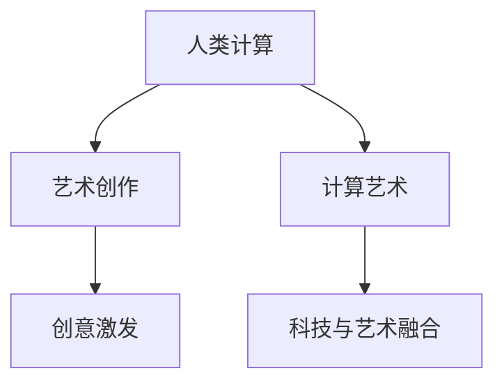

                 

# 艺术与科技的融合：人类计算激发创意

> 关键词：人类计算,艺术创作,创意激发,计算艺术,科技与艺术融合

## 1. 背景介绍

### 1.1 问题由来

人类计算（Human Computation）这一概念源于20世纪50年代，当时的计算机科学家和数学家试图将人类的智能计算能力和机器的计算能力结合起来，以解决一些机器难以处理的问题。而在当代，随着人工智能（AI）技术的发展，这一概念被赋予了新的内涵。AI不再仅仅是解决问题的工具，更成为了激发人类创造力、推动艺术创作的重要媒介。

### 1.2 问题核心关键点

1. **人类计算的定义**：人类计算是指将人类的智慧与计算技术相结合，以解决复杂问题或创造新事物的过程。它不仅包括传统的计算机编程和算法设计，更涉及将人类独有的创造力和直觉融入计算过程。

2. **AI在艺术创作中的应用**：AI技术能够自动生成、分析和优化艺术作品，辅助艺术家进行创意灵感的发掘和作品风格的探索。AI模型通过学习大量艺术作品，掌握不同的艺术风格和创作技巧，从而生成新的艺术作品或协助艺术家完成创作。

3. **计算艺术的发展**：计算艺术是艺术与计算机科学相结合的产物，通过算法和程序实现视觉、声音、文字等艺术表现形式。计算艺术不仅展现了计算机科学的美学价值，也为艺术创作提供了新的可能性。

4. **科技与艺术的融合趋势**：随着人工智能、大数据、区块链等技术的发展，科技与艺术的融合成为可能。艺术家开始使用编程语言、数据可视化工具、虚拟现实（VR）等技术手段，探索新的创作方式和表达形式。

## 2. 核心概念与联系

### 2.1 核心概念概述

为更好地理解人类计算与艺术创作的融合，本节将介绍几个密切相关的核心概念：

- **人类计算**：将人类的智慧与计算技术结合，解决复杂问题或创造新事物的计算过程。
- **艺术创作**：艺术家运用各种形式（如绘画、雕塑、音乐、舞蹈等）表达个人情感、思想和理念的过程。
- **计算艺术**：将计算技术和算法应用于艺术创作中的过程和结果。
- **创意激发**：通过计算技术激发人类创造力，生成新的艺术作品或概念的过程。
- **科技与艺术融合**：将计算机科学、数据科学、机器学习等科技手段应用于艺术创作中，推动艺术形式和内容的创新。

这些核心概念之间的逻辑关系可以通过以下Mermaid流程图来展示：



这个流程图展示了一些核心概念及其之间的关系：

1. 人类计算提供了解决复杂问题和创造新事物的计算能力。
2. 艺术创作是艺术家表达个人情感和思想的过程。
3. 计算艺术通过算法和程序实现艺术形式和内容的创作。
4. 创意激发利用计算技术激发人类创造力。
5. 科技与艺术融合将科技手段应用于艺术创作中，推动创新。

## 3. 核心算法原理 & 具体操作步骤

### 3.1 算法原理概述

基于人类计算的创意激发，其核心思想是利用计算技术辅助人类进行艺术创作和问题解决。通过将人类独有的直觉、创造力与机器的计算能力相结合，生成新的艺术作品或解决复杂问题。

形式化地，假设人类计算过程为 $C(x)$，其中 $x$ 为输入问题或艺术主题。计算艺术创作过程为 $A(C(x))$，即先进行人类计算，再将结果输入艺术创作模型中生成新的艺术作品。创意激发过程为 $E(x)$，即通过计算模型挖掘出新的创意和灵感。

通过梯度下降等优化算法，计算艺术创作和创意激发的过程不断更新模型参数，最大化生成作品的质量和创新性。最终得到适应特定任务和主题的计算艺术作品。

### 3.2 算法步骤详解

基于人类计算的创意激发一般包括以下几个关键步骤：

**Step 1: 问题定义和数据准备**
- 确定要解决的问题或创作的艺术主题，如生成一幅抽象画、设计一个交互式装置等。
- 收集相关数据和素材，如图片、视频、文本等，作为计算艺术创作的输入。

**Step 2: 人类计算过程**
- 利用编程语言、算法和模型进行人类计算，生成计算结果或思路。
- 人类计算过程可能涉及设计、实验、数据分析等活动，需要结合人类的直觉和创造力。

**Step 3: 艺术创作过程**
- 将人类计算结果输入到艺术创作模型中，生成新的艺术作品或设计方案。
- 艺术创作模型可以是基于GAN（生成对抗网络）、变分自编码器（VAE）、风格迁移等技术实现的。

**Step 4: 创意激发过程**
- 利用计算模型挖掘出新的创意和灵感，如通过自然语言处理（NLP）模型生成新的艺术主题、情节等。
- 创意激发过程可能需要反复迭代，结合人类的反馈进行优化。

**Step 5: 评估和优化**
- 对生成的艺术作品进行评估，通过专家评审或用户反馈等方式衡量其质量和创新性。
- 根据评估结果，调整模型参数和创作过程，进一步优化生成作品的质量。

### 3.3 算法优缺点

基于人类计算的创意激发方法具有以下优点：
1. 结合了人类直觉和计算能力，生成作品的创新性和多样性更高。
2. 通过计算模型挖掘创意，减少了艺术家重复性劳动。
3. 计算艺术创作过程灵活，可以根据需求进行调整和优化。
4. 解决了传统艺术创作中某些难以量化的复杂问题，提升了创作效率。

同时，该方法也存在一定的局限性：
1. 依赖于高质量的数据和计算资源，成本较高。
2. 计算模型可能无法完全理解和把握人类艺术的深层意义。
3. 创意激发过程需要人类干预，难以完全自动化。
4. 生成作品的解释性和可理解性不足，可能影响其艺术价值。

尽管存在这些局限性，但就目前而言，基于人类计算的创意激发方法仍是艺术创作和技术创新的一个重要方向。未来相关研究的重点在于如何进一步降低计算资源的依赖，提高生成作品的解释性和可理解性，同时兼顾创意激发过程的自动化和可控性。

### 3.4 算法应用领域

基于人类计算的创意激发方法，在艺术创作、科学研究、工业设计等诸多领域已经得到了广泛的应用，具体如下：

1. **艺术创作**：如生成绘画、音乐、雕塑等艺术作品，辅助艺术家进行创意探索和作品生成。
2. **科学研究**：通过计算模型分析科学数据，辅助科学家发现新规律或提出新假设。
3. **工业设计**：利用计算模型进行产品设计、人体工程学优化等，提升产品创新性和用户体验。
4. **交互式装置**：通过计算艺术实现互动性，如通过体感捕捉技术实现用户与装置的互动。
5. **视觉艺术**：利用计算机视觉技术进行图像处理和风格迁移，生成新的视觉艺术作品。
6. **动画电影**：利用计算技术进行角色动画、场景渲染等，提高动画制作的效率和质量。

## 4. 数学模型和公式 & 详细讲解 & 举例说明（备注：数学公式请使用latex格式，latex嵌入文中独立段落使用 $$，段落内使用 $)
### 4.1 数学模型构建

本节将使用数学语言对基于人类计算的创意激发过程进行更加严格的刻画。

假设问题或艺术主题为 $x$，人类计算过程为 $C(x)$，生成的结果为 $y$。艺术创作过程为 $A(y)$，生成的艺术作品为 $z$。创意激发过程为 $E(x)$，生成的新创意为 $w$。

定义创意激发模型的损失函数为 $\ell(z, w)$，衡量生成的艺术作品与创意的匹配度。在训练过程中，通过优化损失函数，最大化创意激发的效果。

$$
\mathcal{L}(z, w) = \ell(z, w)
$$

在实践中，通常使用交叉熵损失函数：

$$
\ell(z, w) = -\frac{1}{N}\sum_{i=1}^N (z_i \log w_i + (1-z_i) \log(1-w_i))
$$

其中 $z_i$ 为第 $i$ 个艺术作品的输出，$w_i$ 为第 $i$ 个创意的输出。

### 4.2 公式推导过程

以下我们以图像风格迁移为例，推导计算艺术创作过程的损失函数及其梯度的计算公式。

假设输入图像为 $x$，风格图像为 $y$，计算艺术创作模型为 $A(x, y)$，输出的艺术作品为 $z$。风格迁移问题可以表示为：

$$
z = A(x, y)
$$

为了衡量 $z$ 和 $y$ 之间的风格相似性，定义内容损失和风格损失，将两者相加得到总损失：

$$
\ell(z, y) = \alpha \ell_{content}(z, x) + \beta \ell_{style}(z, y)
$$

其中 $\alpha$ 和 $\beta$ 为平衡因子，控制内容损失和风格损失的权重。内容损失 $\ell_{content}$ 衡量 $z$ 和 $x$ 之间的内容一致性，风格损失 $\ell_{style}$ 衡量 $z$ 和 $y$ 之间的风格相似性。

以最经典的VGG网络为例，内容损失可以通过计算输入图像和输出图像在各层的特征值均方误差得到：

$$
\ell_{content}(z, x) = \frac{1}{4N}\sum_{l=1}^L \sum_{i=1}^N ||z_l^i - x_l^i||^2
$$

其中 $L$ 为网络层数，$N$ 为训练样本数，$z_l^i$ 和 $x_l^i$ 分别为第 $l$ 层第 $i$ 个样本的特征值。

风格损失可以通过计算输出图像和风格图像在各层的特征值协方差得到：

$$
\ell_{style}(z, y) = \frac{1}{4N}\sum_{l=1}^L \sum_{i=1}^N \lambda_l ||\sigma(z_l^i) - \sigma(y_l^i)||^2_F
$$

其中 $\lambda_l$ 为第 $l$ 层的权重，$\sigma$ 为非线性激活函数，$||\cdot||_F$ 为Frobenius范数。

通过梯度下降等优化算法，计算艺术创作模型不断更新参数，最小化总损失 $\ell(z, y)$，得到适应特定风格的艺术作品。

### 4.3 案例分析与讲解

以GAN（生成对抗网络）为例，分析基于人类计算的创意激发过程。

GAN由生成器（Generator）和判别器（Discriminator）两个子网络组成。生成器网络 $G$ 将随机噪声 $z$ 映射为艺术作品 $z$，判别器网络 $D$ 判断 $z$ 是否为真实艺术作品。通过对抗训练，使生成器能够生成尽可能逼真的艺术作品。

生成器的损失函数可以表示为：

$$
\ell_G = -\log D(G(z))
$$

判别器的损失函数可以表示为：

$$
\ell_D = -\log D(x) - \log(1 - D(G(z)))
$$

在训练过程中，生成器和判别器交替更新，生成器的目标是生成尽可能逼真的艺术作品，而判别器的目标是尽可能准确地区分真实作品和生成的作品。

## 5. 项目实践：代码实例和详细解释说明
### 5.1 开发环境搭建

在进行计算艺术创作和创意激发实践前，我们需要准备好开发环境。以下是使用Python进行TensorFlow开发的环境配置流程：

1. 安装Anaconda：从官网下载并安装Anaconda，用于创建独立的Python环境。

2. 创建并激活虚拟环境：
```bash
conda create -n tf-env python=3.8 
conda activate tf-env
```

3. 安装TensorFlow：根据CUDA版本，从官网获取对应的安装命令。例如：
```bash
conda install tensorflow -c tensorflow -c conda-forge
```

4. 安装各类工具包：
```bash
pip install numpy pandas scikit-learn matplotlib tqdm jupyter notebook ipython
```

完成上述步骤后，即可在`tf-env`环境中开始计算艺术创作和创意激发实践。

### 5.2 源代码详细实现

这里我们以图像风格迁移为例，给出使用TensorFlow实现GAN的代码实现。

首先，定义生成器和判别器的网络结构：

```python
import tensorflow as tf
from tensorflow.keras import layers, models

def create_generator(input_dim):
    model = models.Sequential()
    model.add(layers.Dense(256, input_dim=input_dim))
    model.add(layers.LeakyReLU())
    model.add(layers.BatchNormalization())
    model.add(layers.Dropout(0.5))
    model.add(layers.Dense(512))
    model.add(layers.LeakyReLU())
    model.add(layers.BatchNormalization())
    model.add(layers.Dropout(0.5))
    model.add(layers.Dense(1024))
    model.add(layers.LeakyReLU())
    model.add(layers.BatchNormalization())
    model.add(layers.Dropout(0.5))
    model.add(layers.Dense(784, activation='tanh'))
    return model

def create_discriminator(input_dim):
    model = models.Sequential()
    model.add(layers.Dense(1024, input_dim=input_dim))
    model.add(layers.LeakyReLU())
    model.add(layers.BatchNormalization())
    model.add(layers.Dropout(0.5))
    model.add(layers.Dense(512))
    model.add(layers.LeakyReLU())
    model.add(layers.BatchNormalization())
    model.add(layers.Dropout(0.5))
    model.add(layers.Dense(1, activation='sigmoid'))
    return model
```

然后，定义损失函数和优化器：

```python
from tensorflow.keras.losses import BinaryCrossentropy
from tensorflow.keras.optimizers import Adam

loss = BinaryCrossentropy()
optimizer = Adam(lr=0.0002)
```

接着，定义训练和评估函数：

```python
def train_gan(generator, discriminator, epochs, batch_size):
    for epoch in range(epochs):
        for batch in tf.data.Dataset.from_tensor_slices((train_x, train_y)).shuffle(64).batch(batch_size):
            real_images, real_labels = batch
            noise = tf.random.normal([batch_size, 100])
            fake_images = generator(noise, training=True)
            discriminator.trainable = False
            combined = tf.concat([real_images, fake_images], axis=0)
            validity = discriminator(combined)
            cross_entropy = loss(validity, train_y)
            cross_entropy = tf.reduce_mean(cross_entropy)
            generator.trainable = True
            discriminator.trainable = True
            real_loss = loss(discriminator(real_images), train_y)
            fake_loss = loss(discriminator(fake_images), train_y)
            total_loss = real_loss + fake_loss + cross_entropy
            total_loss = tf.reduce_mean(total_loss)
            train_loss = total_loss.numpy()
            if epoch % 100 == 0:
                print(f"Epoch {epoch+1}, train loss: {train_loss:.4f}")
```

最后，启动训练流程并在测试集上评估：

```python
import numpy as np
import matplotlib.pyplot as plt

def plot_generated_images(generator, num_images=16):
    noise = np.random.normal(0, 1, (num_images, 100))
    generated_images = generator(noise, training=False)
    generated_images = (generated_images * 127.5 + 127.5).astype('uint8')
    plt.figure(figsize=(4, 4))
    for i in range(num_images):
        plt.subplot(4, 4, i+1)
        plt.imshow(generated_images[i], cmap='gray')
        plt.axis('off')
    plt.show()

train_x = ...  # 训练数据
train_y = ...  # 标签数据

generator = create_generator(input_dim=100)
discriminator = create_discriminator(input_dim=784)
train_gan(generator, discriminator, epochs=100, batch_size=64)
plot_generated_images(generator)
```

以上就是使用TensorFlow实现GAN代码的完整实现。可以看到，通过TensorFlow的高级API，我们可以快速搭建生成器和判别器的神经网络，定义损失函数和优化器，并在数据集上进行训练和评估。

### 5.3 代码解读与分析

让我们再详细解读一下关键代码的实现细节：

**生成器和判别器的定义**：
- 生成器网络由多个全连接层、LeakyReLU激活函数、BatchNormalization层和Dropout层组成，最后一层为Tanh激活函数，将生成的图像映射回[0, 255]区间。
- 判别器网络同样由多个全连接层、LeakyReLU激活函数、BatchNormalization层和Dropout层组成，最后一层为Sigmoid激活函数，输出一个0到1之间的概率值，表示输入图像是否为真实图像。

**损失函数和优化器**：
- 使用二分类交叉熵损失函数，计算生成图像和真实图像被判别器判别的准确性。
- 使用Adam优化器，学习率设置为0.0002，交替优化生成器和判别器的参数。

**训练和评估函数**：
- 在每个epoch内，使用数据集生成真实图像和噪声，通过前向传播计算损失。
- 将真实图像和生成图像合并，计算判别器的输出和交叉熵损失，反向传播更新生成器和判别器的参数。
- 每隔100个epoch打印一次训练损失。
- 训练完成后，使用生成器生成一批图像并可视化。

## 6. 实际应用场景

### 6.1 艺术创作

图像风格迁移技术已经被广泛应用于艺术创作中，帮助艺术家探索新的艺术风格和表达方式。例如，通过迁移著名画作的风格，艺术家可以生成具有新特色的作品，或者在不同风格的艺术作品间进行转换和融合。

在实践应用中，艺术家可以选取自己喜爱的艺术作品作为风格参考，将想要迁移风格的图像输入到风格迁移模型中，生成新的艺术作品。这种技术不仅解放了艺术家的创造力，还拓展了艺术表现形式的边界。

### 6.2 科学研究

计算艺术在科学研究中也有广泛应用。通过计算模型生成模拟数据，科学家可以更快地发现科学规律，提出新的假设。例如，天文学家可以通过计算模型生成模拟星系和宇宙图像，进行天体物理研究。

在具体应用中，科学家可以先构建一个基于物理模型的计算模型，然后通过模拟数据生成器生成大量的模拟数据。这些数据可以作为实验数据，用于验证和优化模型。此外，科学家还可以利用计算艺术技术进行数据的可视化，帮助理解和分析复杂的科学数据。

### 6.3 工业设计

工业设计中，设计师可以使用计算艺术技术生成多种设计方案，快速进行迭代和优化。例如，通过计算模型生成人体工学分析图，设计师可以更好地设计出符合人体舒适度的产品。

在实践应用中，设计师可以通过计算模型进行人体工学分析，生成不同姿势下的舒适度评分。然后，将这些评分作为指标，进行优化和迭代。同时，计算模型还可以生成多种设计方案，供设计师选择和比较。

### 6.4 未来应用展望

随着计算艺术和创意激发技术的发展，未来这些技术将有更广泛的应用前景：

1. **虚拟现实和增强现实**：利用计算艺术技术生成虚拟环境，提升虚拟现实和增强现实体验。例如，在虚拟现实游戏中，通过计算模型生成逼真的自然景观和人物形象，增加游戏沉浸感。

2. **个性化推荐系统**：利用计算艺术技术生成个性化推荐结果，提升用户满意度。例如，在电商平台上，通过计算模型生成符合用户兴趣的个性化商品推荐，提高用户购买转化率。

3. **智能城市设计**：利用计算艺术技术优化城市设计和规划，提升城市品质和居民生活质量。例如，通过计算模型生成多种城市规划方案，进行对比和优化，提升城市宜居性。

4. **人机交互设计**：利用计算艺术技术提升人机交互体验，提高用户使用便捷性。例如，在智能家居系统中，通过计算模型生成友好的交互界面和操作提示，提升用户使用体验。

5. **文化创意产业**：利用计算艺术技术生成多种文化创意产品，推动文化产业创新。例如，在电影制作中，通过计算模型生成逼真的背景和特效，提升电影视觉效果。

## 7. 工具和资源推荐
### 7.1 学习资源推荐

为了帮助开发者系统掌握计算艺术和创意激发的理论基础和实践技巧，这里推荐一些优质的学习资源：

1. **《计算艺术：计算机科学与视觉艺术的融合》**：详细介绍了计算艺术的基本概念、技术和应用，适合初学者入门。
2. **CS231n《视觉几何组》**：斯坦福大学开设的计算机视觉课程，有Lecture视频和配套作业，涵盖计算机视觉和计算艺术的基本原理。
3. **《Python编程：从入门到实践》**：介绍Python编程的基础知识和实践技巧，适合编程初学者使用。
4. **DeepArt.io**：基于GAN技术的图像风格迁移网站，可以快速生成风格迁移结果，适合艺术创作和研究。
5. **Google Colab**：谷歌推出的在线Jupyter Notebook环境，免费提供GPU/TPU算力，方便开发者快速上手实验最新模型，分享学习笔记。

通过对这些资源的学习实践，相信你一定能够快速掌握计算艺术和创意激发的精髓，并用于解决实际的NLP问题。

### 7.2 开发工具推荐

高效的开发离不开优秀的工具支持。以下是几款用于计算艺术和创意激发开发的常用工具：

1. **TensorFlow**：由Google主导开发的开源深度学习框架，生产部署方便，适合大规模工程应用。
2. **PyTorch**：基于Python的开源深度学习框架，灵活动态的计算图，适合快速迭代研究。
3. **Keras**：基于TensorFlow和Theano的高级API，提供了简单易用的神经网络API，适合初学者使用。
4. **Jupyter Notebook**：交互式编程环境，支持Python、R等语言，适合编写和运行计算艺术代码。
5. **Blender**：开源3D创作软件，支持计算艺术创作和可视化。
6. **Adobe Creative Suite**：专业图形设计软件，支持多种艺术创作工具和技术。

合理利用这些工具，可以显著提升计算艺术创作和创意激发的开发效率，加快创新迭代的步伐。

### 7.3 相关论文推荐

计算艺术和创意激发技术的发展源于学界的持续研究。以下是几篇奠基性的相关论文，推荐阅读：

1. **《A Neural Algorithm of Artistic Style》**：提出使用GAN进行图像风格迁移的算法，开创了计算艺术风格迁移的先河。
2. **《Deep Art for Art》**：研究了如何使用GAN生成逼真的艺术作品，探讨了计算艺术在艺术创作中的应用。
3. **《DeepDream: A Dream of Synthetic Training》**：提出使用深度神经网络生成可视化效果，用于提升计算机视觉模型的性能。
4. **《Natural Language Processing with TensorFlow》**：介绍如何使用TensorFlow进行自然语言处理任务，包括计算艺术和创意激发等。
5. **《The Art of Code Generation》**：探讨了代码生成中的艺术创作和技术创新，为计算艺术在编程中的应用提供了新的思路。

这些论文代表了大语言模型微调技术的发展脉络。通过学习这些前沿成果，可以帮助研究者把握学科前进方向，激发更多的创新灵感。

## 8. 总结：未来发展趋势与挑战

### 8.1 总结

本文对基于人类计算的创意激发方法进行了全面系统的介绍。首先阐述了计算艺术和创意激发的基本概念和应用场景，明确了人类计算在艺术创作中的独特价值。其次，从原理到实践，详细讲解了计算艺术创作和创意激发过程的数学模型和具体步骤，给出了完整的代码实现。同时，本文还广泛探讨了计算艺术和创意激发在多个领域的应用前景，展示了这一技术的巨大潜力。此外，本文精选了计算艺术和创意激发技术的各类学习资源，力求为读者提供全方位的技术指引。

通过本文的系统梳理，可以看到，基于人类计算的创意激发方法正在成为艺术创作和技术创新的一个重要方向。它不仅解放了艺术家的创造力，还为计算艺术提供了新的表现形式和技术手段。未来，随着计算技术的发展和算力资源的丰富，计算艺术和创意激发技术将会有更广阔的应用前景，进一步推动科技与艺术的融合发展。

### 8.2 未来发展趋势

展望未来，计算艺术和创意激发技术将呈现以下几个发展趋势：

1. **技术融合加速**：随着AI、VR、AR等技术的进步，计算艺术与更多技术领域的融合将加速，生成更多元、更复杂的艺术作品。
2. **个性化定制普及**：基于用户偏好的个性化计算艺术创作将更加普及，满足不同用户的需求。
3. **跨领域创新涌现**：计算艺术与不同领域的交叉融合将激发更多创新，推动科技创新和艺术创作的发展。
4. **可持续发展支持**：计算艺术创作过程将更多考虑环保和可持续发展的理念，推动绿色科技和环保艺术的发展。
5. **伦理和社会责任**：计算艺术创作将更多关注社会责任和伦理问题，避免有害内容的生成和传播。
6. **人机协作增强**：计算艺术创作将更多地利用人类创造力和计算技术的优势，实现人机协作，提升创作效率和质量。

### 8.3 面临的挑战

尽管计算艺术和创意激发技术已经取得了显著进展，但在迈向更加智能化、普适化应用的过程中，它仍面临着诸多挑战：

1. **技术壁垒高**：计算艺术创作需要掌握计算机科学和艺术设计等多学科知识，门槛较高。
2. **资源消耗大**：计算艺术创作过程需要大量计算资源，对算力、内存、存储等要求较高。
3. **解释性和可理解性不足**：计算艺术创作过程复杂，难以解释其内部工作机制和决策逻辑。
4. **伦理和法律问题**：计算艺术创作过程中可能涉及版权、隐私等法律和伦理问题，需要仔细考虑。
5. **市场需求不确定**：计算艺术创作过程复杂，需求不确定，难以快速市场化。

### 8.4 研究展望

面对计算艺术和创意激发技术所面临的挑战，未来的研究需要在以下几个方面寻求新的突破：

1. **降低技术壁垒**：开发更易于使用的计算艺术创作工具和平台，降低技术门槛，普及计算艺术创作。
2. **优化资源消耗**：开发更高效的计算模型和算法，减少资源消耗，提升计算艺术创作的效率和可持续性。
3. **提升解释性**：引入可解释性算法和工具，提高计算艺术创作过程的透明度和可理解性。
4. **解决伦理和法律问题**：加强对计算艺术创作的法律和伦理研究，确保其合法合规。
5. **探索市场需求**：开展市场调研和用户体验研究，明确计算艺术创作的市场需求和应用场景。

这些研究方向的探索，必将引领计算艺术和创意激发技术迈向更高的台阶，为计算艺术和创意激发技术的发展提供新的动力。

## 9. 附录：常见问题与解答

**Q1：计算艺术创作是否需要高超的编程技能？**

A: 计算艺术创作需要掌握一定的编程技能，但不需要高超的编程水平。初学者可以通过学习Python、TensorFlow等入门工具快速上手，完成基本的计算艺术创作任务。随着技能的提高，可以逐步学习和掌握更复杂的计算模型和算法。

**Q2：计算艺术创作过程如何实现人机协作？**

A: 计算艺术创作过程可以通过用户交互界面实现人机协作。例如，在图像风格迁移中，用户可以上传自己的图片，并通过交互界面选择风格参考，生成新的艺术作品。同时，用户也可以对生成结果进行修改和优化，实现人机协作创作。

**Q3：计算艺术创作是否需要大量计算资源？**

A: 计算艺术创作确实需要一定的计算资源，特别是生成高质量的艺术作品时。但随着云计算和大数据技术的发展，计算资源已经不再是制约因素。云计算平台如Google Colab、AWS等提供了强大的算力支持，方便开发者进行计算艺术创作。

**Q4：计算艺术创作如何平衡创新和实用性？**

A: 计算艺术创作需要平衡创新和实用性。在追求创新的同时，还需要考虑作品的市场接受度和实用性。可以通过市场调研和用户反馈，不断优化计算艺术创作过程，提升作品的创新性和实用性。

**Q5：计算艺术创作如何避免版权问题？**

A: 计算艺术创作过程中需要考虑版权问题。可以通过以下方法避免版权问题：
1. 使用公共领域的素材进行创作。
2. 获得版权所有者的授权。
3. 使用生成对抗网络（GAN）等技术生成原创作品，避免使用已有作品。
4. 明确作品的版权归属，避免版权纠纷。

通过对这些问题的回答，相信你对计算艺术和创意激发技术有了更全面的理解。计算艺术和创意激发技术将继续在艺术创作和技术创新中发挥重要作用，推动人类认知智能的进化。

