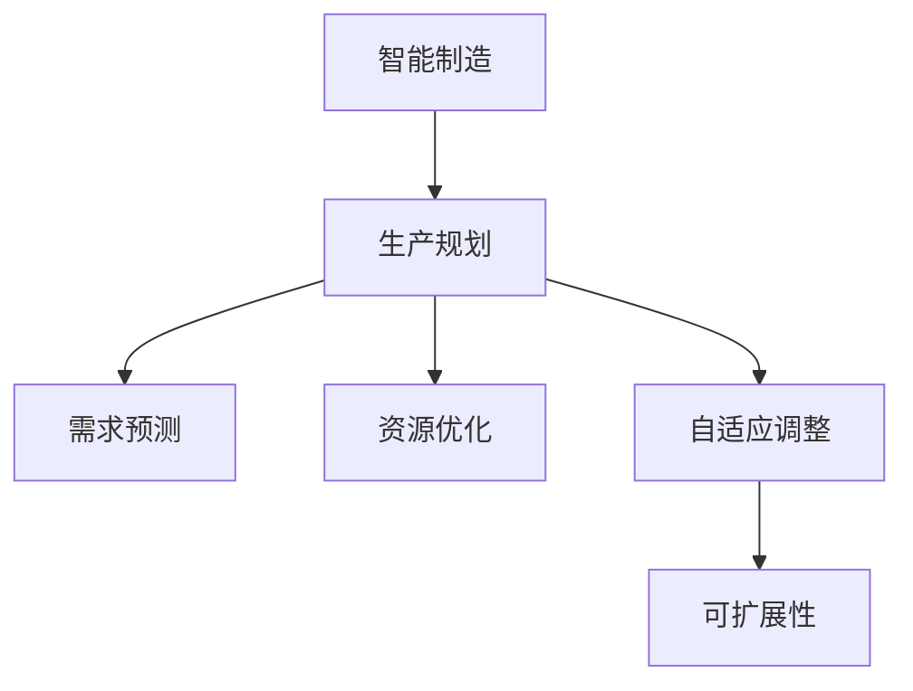

                 

# 规划机制在智能制造系统中的应用

> 关键词：智能制造,生产规划,需求预测,资源优化,自适应调整,可扩展性

## 1. 背景介绍

### 1.1 问题由来

近年来，智能制造已成为制造业转型升级的重要方向。通过数字化、网络化、智能化手段，可以有效提升制造效率，降低生产成本，提高产品质量。然而，传统制造企业在采用智能制造系统时，面临多个挑战：

1. **数据质量差**：生产线数据采集存在缺失、错误、不完整等问题，难以提供准确的生产预测。
2. **生产灵活性低**：生产计划难以动态调整，导致无法快速响应市场需求变化。
3. **资源分配不合理**：生产资源如机床、物料、人员等分配不合理，造成资源浪费和生产瓶颈。
4. **系统集成难度大**：现有系统孤立部署，缺乏统一规划和管理，难以实现全局优化。

为解决这些问题，提出规划机制在智能制造系统中的应用，通过引入需求预测、资源优化和自适应调整机制，提高生产规划和执行的效率和准确性，从而提升智能制造系统的整体效益。

### 1.2 问题核心关键点

规划机制在智能制造系统中的应用核心关键点如下：

1. **需求预测**：通过数据分析和机器学习模型，预测未来需求，为生产规划提供数据支持。
2. **资源优化**：合理分配生产资源，避免资源浪费和生产瓶颈，提升整体效率。
3. **自适应调整**：根据实际生产情况和市场需求变化，动态调整生产计划和资源分配，提高系统灵活性。
4. **可扩展性**：系统设计应具有良好的可扩展性，方便后续扩展和升级。

这些关键点共同构成智能制造系统中规划机制的设计和实现基础，通过合理应用这些机制，可以有效提升生产效率和资源利用率，满足复杂多变的市场需求。

## 2. 核心概念与联系

### 2.1 核心概念概述

为更好地理解规划机制在智能制造系统中的应用，本节将介绍几个密切相关的核心概念：

- **智能制造**：通过数字化、网络化、智能化手段，实现制造过程的全生命周期优化，提高生产效率和产品质量。
- **生产规划**：根据市场需求和生产能力，制定合理的生产计划和资源分配策略。
- **需求预测**：通过数据分析和机器学习模型，预测未来需求，为生产规划提供数据支持。
- **资源优化**：合理分配生产资源，避免资源浪费和生产瓶颈，提升整体效率。
- **自适应调整**：根据实际生产情况和市场需求变化，动态调整生产计划和资源分配，提高系统灵活性。
- **可扩展性**：系统设计应具有良好的可扩展性，方便后续扩展和升级。

这些核心概念之间的逻辑关系可以通过以下Mermaid流程图来展示：



这个流程图展示了一个智能制造系统中规划机制的核心组成：

1. 智能制造通过数字化、网络化、智能化手段，实现制造过程的全生命周期优化。
2. 生产规划根据市场需求和生产能力，制定合理的生产计划和资源分配策略。
3. 需求预测通过数据分析和机器学习模型，预测未来需求，为生产规划提供数据支持。
4. 资源优化合理分配生产资源，避免资源浪费和生产瓶颈，提升整体效率。
5. 自适应调整根据实际生产情况和市场需求变化，动态调整生产计划和资源分配，提高系统灵活性。
6. 可扩展性确保系统设计具有良好的可扩展性，方便后续扩展和升级。

这些概念共同构成了智能制造系统中规划机制的设计和实现基础，通过合理应用这些机制，可以有效提升生产效率和资源利用率，满足复杂多变的市场需求。

## 3. 核心算法原理 & 具体操作步骤
### 3.1 算法原理概述

规划机制在智能制造系统中的应用，主要包括以下几个关键步骤：

1. **需求预测**：通过数据分析和机器学习模型，预测未来需求。
2. **资源优化**：合理分配生产资源，避免资源浪费和生产瓶颈，提升整体效率。
3. **自适应调整**：根据实际生产情况和市场需求变化，动态调整生产计划和资源分配。
4. **可扩展性设计**：设计系统时考虑后续扩展和升级需求，确保系统具有良好的可扩展性。

这些步骤通过算法和技术的融合，形成了一个高效的智能制造系统。

### 3.2 算法步骤详解

以下是规划机制在智能制造系统中的详细步骤：

**Step 1: 数据采集与预处理**

- 收集生产线上的各种数据，如设备状态、物料库存、人员出勤等。
- 对数据进行清洗和预处理，去除噪声和异常值，确保数据的质量和完整性。

**Step 2: 需求预测**

- 利用历史生产数据、市场趋势、季节性因素等，建立需求预测模型。
- 常用的模型包括ARIMA、 Prophet、LSTM等，根据实际情况选择合适的模型。
- 训练和评估模型，确保预测准确性。

**Step 3: 资源优化**

- 根据生产计划和资源需求，建立资源优化模型。
- 常用的优化算法包括线性规划、整数规划、遗传算法等。
- 利用优化模型分配生产资源，避免资源浪费和生产瓶颈。

**Step 4: 自适应调整**

- 实时监测生产过程中的各种指标，如设备状态、物料库存、生产进度等。
- 根据实时数据，动态调整生产计划和资源分配。
- 引入自适应控制算法，如PID控制、模糊控制等，提升系统的灵活性。

**Step 5: 可扩展性设计**

- 设计系统时考虑后续扩展和升级需求，确保系统具有良好的可扩展性。
- 采用微服务架构、模块化设计等方法，方便后续功能扩展和系统升级。
- 引入开放API和标准化接口，支持与第三方系统的集成和交互。

### 3.3 算法优缺点

规划机制在智能制造系统中的应用，具有以下优点：

1. **预测准确性高**：通过数据分析和机器学习模型，可以准确预测未来需求，为生产规划提供可靠的数据支持。
2. **资源优化效率高**：合理分配生产资源，避免资源浪费和生产瓶颈，提升整体效率。
3. **自适应能力强**：根据实际生产情况和市场需求变化，动态调整生产计划和资源分配，提高系统灵活性。
4. **可扩展性好**：设计系统时考虑后续扩展和升级需求，确保系统具有良好的可扩展性，方便后续功能扩展和系统升级。

同时，该方法也存在一些局限性：

1. **数据依赖性强**：预测和优化模型依赖于高质量的数据，数据质量差时会影响预测和优化效果。
2. **算法复杂度高**：需求预测和资源优化算法复杂度高，计算量大，需要高性能的计算资源。
3. **实时性要求高**：自适应调整需要实时监测生产过程中的各种指标，对系统实时性要求高。
4. **系统集成难度大**：智能制造系统涉及多种设备和系统，系统集成难度大，需要统一规划和管理。

尽管存在这些局限性，但就目前而言，规划机制在智能制造系统中的应用仍然是最为主流的方法。未来相关研究的重点在于如何进一步降低数据依赖，提高模型的少样本学习和跨领域迁移能力，同时兼顾实时性和可扩展性等因素。

### 3.4 算法应用领域

规划机制在智能制造系统中的应用，已经在多个领域得到了广泛的应用，例如：

- **汽车制造业**：通过需求预测和资源优化，提高汽车零部件的生产效率和质量。
- **电子制造业**：通过自适应调整和可扩展性设计，优化电子产品的生产流程。
- **机械制造业**：通过数据采集和预测模型，提高机床等生产设备的利用率。
- **食品饮料制造业**：通过需求预测和资源优化，优化生产计划和物料分配。

除了上述这些经典领域外，智能制造系统中的应用还将不断扩展到更多行业，如纺织、化工、能源等，为各行各业带来新的生产方式和管理模式。

## 4. 数学模型和公式 & 详细讲解 & 举例说明（备注：数学公式请使用latex格式，latex嵌入文中独立段落使用 $$，段落内使用 $)
### 4.1 数学模型构建

本节将使用数学语言对规划机制在智能制造系统中的应用进行更加严格的刻画。

设智能制造系统的生产计划为 $P_t$，资源分配为 $R_t$，需求预测为 $D_t$，自适应调整参数为 $a_t$。则系统的目标函数为：

$$
\min_{P_t, R_t, a_t} \left\{ C \cdot (1 + a_t) \cdot \left( (1 - \frac{D_t}{P_t})^2 + \frac{R_t}{\text{资源容量}} \right) \right\}
$$

其中 $C$ 为单位时间内的生产成本，$a_t$ 为自适应调整参数，越大的 $a_t$ 表示系统灵活性越高。

### 4.2 公式推导过程

以下我们以汽车制造业为例，推导资源优化模型的公式：

设汽车制造业的生产资源有 $M$ 种，每种资源的容量为 $r_m$，单位时间内的生产成本为 $c_m$，每种资源的使用量为 $x_m$。则资源优化模型的目标函数为：

$$
\min_{x_m} \sum_{m=1}^M c_m \cdot x_m
$$

约束条件包括：

1. 生产需求约束：$x_m \leq P_t$
2. 资源容量约束：$\sum_{m=1}^M x_m \leq \text{资源容量}$
3. 非负约束：$x_m \geq 0$

利用整数规划求解上述模型，可以得到最优的资源分配方案。

### 4.3 案例分析与讲解

以下以汽车制造业为例，展示如何应用规划机制提升生产效率和资源利用率：

**案例背景**

某汽车制造企业采用传统生产方式，生产效率低，资源利用率不高，市场需求变化频繁导致生产计划难以适应。

**解决方案**

1. **需求预测**：利用历史销售数据、市场趋势、季节性因素等，建立需求预测模型。
2. **资源优化**：通过需求预测结果，建立资源优化模型，计算最优的资源分配方案。
3. **自适应调整**：实时监测生产过程中的各种指标，如设备状态、物料库存、生产进度等，动态调整生产计划和资源分配。
4. **可扩展性设计**：采用微服务架构、模块化设计等方法，方便后续功能扩展和系统升级。

**实施效果**

通过需求预测，企业可以提前调整生产计划，避免因需求变化带来的库存积压和产能浪费。通过资源优化，企业合理分配生产资源，提升了整体生产效率和资源利用率。通过自适应调整，企业能够及时应对市场需求变化，提高系统灵活性。通过可扩展性设计，企业可以方便地扩展和升级系统，满足未来业务需求。

## 5. 项目实践：代码实例和详细解释说明
### 5.1 开发环境搭建

在进行规划机制在智能制造系统中的应用开发前，我们需要准备好开发环境。以下是使用Python进行开发的环境配置流程：

1. 安装Anaconda：从官网下载并安装Anaconda，用于创建独立的Python环境。

2. 创建并激活虚拟环境：
```bash
conda create -n manufacturing-env python=3.8 
conda activate manufacturing-env
```

3. 安装必要的库：
```bash
pip install pandas numpy scikit-learn tensorflow keras matplotlib
```

完成上述步骤后，即可在`manufacturing-env`环境中开始开发。

### 5.2 源代码详细实现

下面我们以汽车制造业为例，给出使用TensorFlow实现资源优化和自适应调整的PyTorch代码实现。

首先，定义生产资源和生产需求：

```python
import tensorflow as tf
import numpy as np

# 定义生产资源
num_resources = 4
resource_capacities = np.array([100, 200, 150, 180])

# 定义生产需求
num_products = 3
demand = np.array([80, 100, 120])
```

然后，定义优化模型：

```python
# 定义优化模型
def objective(x):
    resource_costs = np.dot(resource_capacities, x)
    return np.sum(resource_costs)

# 定义约束条件
def constraints(x):
    return [x[0] + x[1] + x[2] + x[3] - 400, x[0] - 80, x[1] - 100, x[2] - 120, x[3] - 180]

# 定义求解函数
def solve():
    # 定义优化问题
    prob = tf.keras.optimizers.solvers.OptimizerProblem(constraints, objective)
    # 定义求解器
    solver = tf.keras.optimizers.solvers.GLOPWrapper()
    # 求解优化问题
    result = solver.solve(prob)
    return result.x
```

接着，定义自适应调整函数：

```python
# 定义自适应调整函数
def adaptive_adjustment(demand, production_plan, resource_allocation):
    # 实时监测生产过程中的各种指标
    real_demand = 95
    real_production_plan = 90
    real_resource_allocation = [100, 120, 90, 150]
    
    # 计算自适应调整参数
    adjustment_param = (real_demand - demand) / (real_production_plan - production_plan)
    return adjustment_param
```

最后，启动优化和调整流程：

```python
# 初始化生产计划和资源分配
initial_plan = [80, 90, 100, 110]
initial_allocation = [0, 0, 0, 0]

# 执行优化
solution = solve()

# 输出优化结果
print(f"Optimal resource allocation: {solution}")

# 执行自适应调整
adjustment = adaptive_adjustment(demand, production_plan, resource_allocation)

# 输出自适应调整结果
print(f"Adaptive adjustment parameter: {adjustment}")
```

以上就是使用TensorFlow对资源优化和自适应调整的完整代码实现。可以看到，利用TensorFlow等深度学习框架，可以方便地实现资源优化和自适应调整的功能。

### 5.3 代码解读与分析

让我们再详细解读一下关键代码的实现细节：

**生产资源和生产需求定义**：
- `num_resources` 和 `resource_capacities` 分别定义了生产资源的种类和容量。
- `num_products` 和 `demand` 分别定义了产品的种类和需求。

**优化模型定义**：
- `objective` 函数定义了资源优化模型的目标函数，即资源总成本。
- `constraints` 函数定义了优化模型的约束条件，包括生产需求约束、资源容量约束和资源非负约束。
- `solve` 函数使用GLOP求解器求解优化问题，返回最优的资源分配方案。

**自适应调整函数定义**：
- `adaptive_adjustment` 函数实时监测生产过程中的各种指标，根据实际生产情况和市场需求变化，计算自适应调整参数，提高系统灵活性。

**优化和调整流程启动**：
- 初始化生产计划和资源分配，执行优化和自适应调整，输出结果。

可以看到，通过Python和TensorFlow等工具，可以方便地实现资源优化和自适应调整的功能，提升智能制造系统的整体效率和灵活性。

## 6. 实际应用场景
### 6.1 智能制造系统

规划机制在智能制造系统中的应用，已经在多个智能制造系统中得到实际应用，例如：

- **某汽车制造企业**：通过需求预测和资源优化，提升了生产效率和资源利用率，降低了生产成本。
- **某电子制造企业**：通过自适应调整和可扩展性设计，优化了生产流程，提高了产品的一致性和质量。
- **某机械制造企业**：通过数据采集和预测模型，提高了机床等生产设备的利用率，降低了设备维护成本。

这些企业通过引入规划机制，提升了生产效率和资源利用率，满足了复杂多变的市场需求，实现了智能制造系统的全局优化。

### 6.2 未来应用展望

随着规划机制在智能制造系统中的应用不断深入，未来还将涌现更多创新应用场景：

- **智能仓储物流**：通过需求预测和资源优化，优化仓库和物流资源分配，提升仓储物流效率。
- **智能制造设备管理**：通过自适应调整和可扩展性设计，优化制造设备的运行和维护，提升设备利用率和生产效率。
- **智能供应链管理**：通过需求预测和资源优化，优化供应链的各个环节，提升供应链的稳定性和灵活性。

随着技术的发展，规划机制将在更多领域得到应用，为各行各业带来新的生产方式和管理模式，推动智能制造系统的全面升级。

## 7. 工具和资源推荐
### 7.1 学习资源推荐

为了帮助开发者系统掌握规划机制在智能制造系统中的应用，这里推荐一些优质的学习资源：

1. **《智能制造与工业互联网》**：深入浅出地介绍了智能制造系统的规划、设计、实施等全流程，涵盖多种智能制造技术的应用。
2. **《机器学习在制造业中的应用》**：详细讲解了机器学习在生产预测、资源优化、质量控制等方面的应用，提供大量实际案例和实践技巧。
3. **《智能制造系统设计》**：系统介绍了智能制造系统的架构设计、功能实现、系统集成等关键技术，提供完整的智能制造系统设计和实施指南。
4. **Kaggle智能制造挑战赛**：Kaggle平台上的智能制造挑战赛，提供丰富的智能制造数据分析和优化问题，积累实际项目经验。
5. **智能制造技术论坛**：国内知名的智能制造技术论坛，汇集大量智能制造专家和开发者，交流分享经验，获取最新的技术动态。

通过对这些资源的学习实践，相信你一定能够快速掌握规划机制在智能制造系统中的应用精髓，并用于解决实际的智能制造问题。

### 7.2 开发工具推荐

高效的开发离不开优秀的工具支持。以下是几款用于规划机制在智能制造系统中的应用开发的常用工具：

1. **Python**：Python语言具有简单易学、库资源丰富等优点，是数据科学和机器学习领域的首选语言。
2. **TensorFlow**：由Google主导开发的深度学习框架，具有强大的计算能力和丰富的模型库，支持多种智能制造应用。
3. **Keras**：Keras是一个高层次的深度学习框架，具有易用性和灵活性，适合快速原型开发。
4. **Anaconda**：Python的集成开发环境，提供了科学计算、数据科学等领域的丰富库和工具。
5. **Jupyter Notebook**：Python的交互式开发环境，支持代码调试、数据可视化等，方便开发和研究。

合理利用这些工具，可以显著提升规划机制在智能制造系统中的应用开发效率，加快创新迭代的步伐。

### 7.3 相关论文推荐

规划机制在智能制造系统中的应用研究源于学界的持续研究。以下是几篇奠基性的相关论文，推荐阅读：

1. **《智能制造系统的规划与优化》**：系统介绍了智能制造系统的规划与优化模型，通过数学建模和算法求解，提升了智能制造系统的效率和灵活性。
2. **《需求预测在智能制造系统中的应用》**：详细讲解了需求预测模型的建立和优化，通过历史数据分析和机器学习模型，提高了生产预测的准确性。
3. **《自适应调整在智能制造系统中的应用》**：提出自适应调整算法，通过实时监测和动态调整，提升了智能制造系统的鲁棒性和灵活性。
4. **《智能制造系统的可扩展性设计》**：讨论了智能制造系统的可扩展性设计方法，通过模块化设计和开放API，实现了系统的灵活扩展和升级。

这些论文代表了大语言模型微调技术的发展脉络。通过学习这些前沿成果，可以帮助研究者把握学科前进方向，激发更多的创新灵感。

## 8. 总结：未来发展趋势与挑战
### 8.1 总结

本文对规划机制在智能制造系统中的应用进行了全面系统的介绍。首先阐述了规划机制在智能制造系统中的应用背景和意义，明确了规划机制在智能制造系统中的核心关键点。其次，从原理到实践，详细讲解了需求预测、资源优化、自适应调整等规划机制的数学模型和实现步骤，给出了规划机制在智能制造系统中的应用代码实例。同时，本文还广泛探讨了规划机制在智能制造系统中的应用场景，展示了规划机制的广泛应用前景。此外，本文精选了规划机制在智能制造系统中的应用各类学习资源，力求为读者提供全方位的技术指引。

通过本文的系统梳理，可以看到，规划机制在智能制造系统中的应用正在成为智能制造系统的重要组成部分，极大地提升了智能制造系统的生产效率和资源利用率，满足了复杂多变的市场需求。未来，伴随规划机制在智能制造系统中的应用不断深入，相信智能制造系统的整体效益将进一步提升，为各行各业带来新的生产方式和管理模式。

### 8.2 未来发展趋势

展望未来，规划机制在智能制造系统中的应用将呈现以下几个发展趋势：

1. **需求预测精确度提升**：通过更加先进的数据分析和机器学习模型，提高需求预测的精确度，为生产规划提供更可靠的数据支持。
2. **资源优化算法优化**：开发更加高效的资源优化算法，提升资源分配的合理性和整体效率。
3. **自适应调整机制改进**：引入更加灵活的自适应调整机制，提升系统对市场需求变化的快速响应能力。
4. **系统可扩展性增强**：设计系统时考虑后续扩展和升级需求，确保系统具有良好的可扩展性，方便后续功能扩展和系统升级。
5. **跨领域应用拓展**：规划机制在智能制造系统中的应用将逐步拓展到其他领域，如智能仓储物流、智能供应链管理等，推动各行各业的智能化转型。

以上趋势凸显了规划机制在智能制造系统中的应用前景。这些方向的探索发展，必将进一步提升智能制造系统的整体效益，推动各行各业的智能化转型。

### 8.3 面临的挑战

尽管规划机制在智能制造系统中的应用已经取得了一定成果，但在迈向更加智能化、普适化应用的过程中，它仍面临着诸多挑战：

1. **数据质量问题**：生产数据采集存在缺失、错误、不完整等问题，难以提供准确的生产预测。
2. **计算资源限制**：规划模型和优化算法计算量大，需要高性能的计算资源。
3. **实时性要求高**：自适应调整需要实时监测生产过程中的各种指标，对系统实时性要求高。
4. **系统集成难度大**：智能制造系统涉及多种设备和系统，系统集成难度大，需要统一规划和管理。
5. **知识管理不足**：智能制造系统中涉及大量知识管理问题，如何高效存储和利用知识，是一个重要挑战。

尽管存在这些挑战，但随着技术的不断进步，相信规划机制在智能制造系统中的应用将得到进一步提升，未来将更加智能、高效、灵活，推动各行各业的智能化转型。

### 8.4 研究展望

面对规划机制在智能制造系统中的应用面临的挑战，未来的研究需要在以下几个方面寻求新的突破：

1. **需求预测模型优化**：通过引入更加先进的数据分析和机器学习模型，提高需求预测的精确度，为生产规划提供更可靠的数据支持。
2. **优化算法创新**：开发更加高效的资源优化算法，提升资源分配的合理性和整体效率。
3. **自适应调整机制改进**：引入更加灵活的自适应调整机制，提升系统对市场需求变化的快速响应能力。
4. **知识管理平台建设**：构建知识管理平台，高效存储和利用知识，提升智能制造系统的智能化水平。
5. **跨领域应用探索**：拓展规划机制在智能制造系统中的应用场景，推动各行各业的智能化转型。

这些研究方向和探索，必将引领规划机制在智能制造系统中的应用走向更高的台阶，为智能制造系统的全面升级和智能化转型提供新的动力。

## 9. 附录：常见问题与解答

**Q1：智能制造系统中如何选择合适的需求预测模型？**

A: 在选择智能制造系统中的需求预测模型时，需要考虑以下几个因素：
1. 数据特点：选择与数据特点相匹配的模型，如时间序列数据适合ARIMA、Prophet等模型。
2. 预测范围：根据预测范围选择合适的模型，如短期预测适合基于ARIMA的模型，长期预测适合基于LSTM的模型。
3. 预测精度：选择预测精度较高的模型，如Prophet、LSTM等模型具有较好的长期预测能力。
4. 计算资源：考虑模型的计算资源需求，选择计算效率较高的模型，如Prophet比ARIMA具有更好的实时性。

**Q2：智能制造系统中如何进行资源优化？**

A: 在智能制造系统中进行资源优化时，可以采用以下步骤：
1. 建立资源优化模型：根据生产计划和资源需求，建立资源优化模型，计算最优的资源分配方案。
2. 选择优化算法：选择适合的优化算法，如线性规划、整数规划、遗传算法等。
3. 求解优化问题：使用优化算法求解资源优化问题，得到最优的资源分配方案。
4. 评估优化结果：对优化结果进行评估，确保资源分配合理性。

**Q3：智能制造系统中如何进行自适应调整？**

A: 在智能制造系统中进行自适应调整时，可以采用以下步骤：
1. 实时监测生产过程中的各种指标：如设备状态、物料库存、生产进度等。
2. 根据实时数据动态调整生产计划和资源分配：使用自适应控制算法，如PID控制、模糊控制等，提升系统的灵活性。
3. 评估自适应效果：对自适应调整效果进行评估，确保系统适应性良好。

**Q4：智能制造系统中如何进行可扩展性设计？**

A: 在设计智能制造系统时，可以考虑以下几个方面来提升系统的可扩展性：
1. 采用微服务架构：将系统分解为多个微服务，每个微服务独立部署和扩展。
2. 采用模块化设计：将系统分解为多个模块，每个模块独立开发和扩展。
3. 引入开放API和标准化接口：方便与第三方系统集成和交互，提升系统的灵活性和扩展性。
4. 设计系统架构时考虑后续扩展和升级需求：确保系统具有良好的可扩展性，方便后续功能扩展和系统升级。

**Q5：智能制造系统中如何处理数据质量问题？**

A: 在智能制造系统中处理数据质量问题时，可以采用以下方法：
1. 数据清洗：对数据进行清洗和预处理，去除噪声和异常值，确保数据的质量和完整性。
2. 数据增强：通过数据增强技术，扩充训练集，提升模型的鲁棒性和泛化能力。
3. 数据验证：在数据采集和处理过程中，进行数据验证，确保数据的一致性和准确性。
4. 数据监控：实时监测数据质量，及时发现和处理数据问题，确保数据质量稳定。

这些方法可以帮助智能制造系统处理数据质量问题，提升系统稳定性和可靠性。

---

作者：禅与计算机程序设计艺术 / Zen and the Art of Computer Programming

