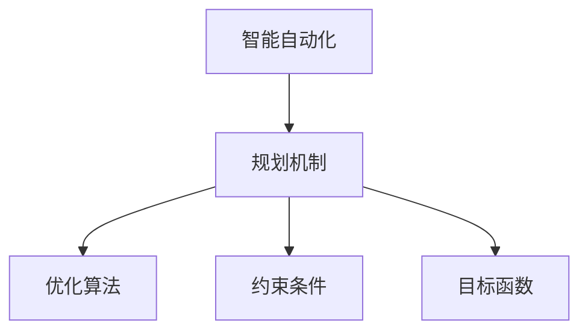

                 

# 规划机制在智能自动化中的应用

## 1. 背景介绍

### 1.1 问题由来
在当今数字化时代，智能自动化已成为企业提升效率、降低成本的关键手段。然而，传统自动化系统通常缺乏灵活性和可扩展性，难以快速应对多变的业务场景。与此同时，人工智能技术，尤其是深度学习在自动化领域的应用，为解决这些问题提供了新的方向。规划机制作为AI系统的重要组成部分，其在智能自动化中的应用逐渐成为研究热点。

### 1.2 问题核心关键点
规划机制，简而言之，是指智能系统根据预定义的目标和约束条件，对行动计划进行规划、优化和执行的策略与方法。它不仅能处理确定性任务，还能应对不确定性和复杂环境，具有高效、灵活的特点。在智能自动化中，规划机制能够自动化处理复杂的流程、调度、路径规划等任务，显著提升自动化系统的智能程度和适应性。

### 1.3 问题研究意义
研究规划机制在智能自动化中的应用，对于提升自动化系统的智能化水平、提高企业运营效率、推动业务流程自动化具有重要意义：

1. **提高效率**：通过自动化规划，智能系统能够快速响应业务需求，减少人工干预，提高处理速度。
2. **增强灵活性**：规划机制的引入使得自动化系统能够根据实际情况动态调整行动计划，提高系统的适应性和鲁棒性。
3. **优化资源利用**：合理规划能够有效配置和利用系统资源，避免资源浪费，提升系统的整体效能。
4. **支持决策支持**：规划结果可以提供决策依据，帮助管理层制定更科学的运营策略。

## 2. 核心概念与联系

### 2.1 核心概念概述

为了更好地理解规划机制在智能自动化中的应用，本节将介绍几个关键概念及其相互联系：

- **智能自动化**：利用人工智能技术，尤其是深度学习、规划机制，自动化处理复杂任务的系统。
- **规划机制**：智能系统根据目标和约束条件，对行动计划进行规划、优化和执行的策略和方法。
- **优化算法**：用于规划机制中求解最优解的算法，如遗传算法、粒子群算法、蚁群算法等。
- **约束条件**：规划时必须满足的限制条件，如时间窗口、资源限制、成本限制等。
- **目标函数**：规划机制追求优化的关键指标，如成本最小化、时间最短化、资源利用率最大化等。

这些概念之间的逻辑关系可以通过以下Mermaid流程图来展示：



这个流程图展示了大语言模型的核心概念及其之间的关系：

1. 智能自动化系统依赖于规划机制，对复杂任务进行自动化处理。
2. 规划机制使用优化算法对行动计划进行求解。
3. 规划时需考虑各种约束条件。
4. 目标是规划机制追求的最优化指标。

这些概念共同构成了智能自动化中规划机制的工作原理和优化方向。

## 3. 核心算法原理 & 具体操作步骤
### 3.1 算法原理概述

智能自动化中的规划机制，本质上是一个在给定约束条件下，求解最优行动计划的问题。其核心思想是：将自动化任务抽象为数学模型，利用优化算法求解最优解，并将其转化为实际行动计划。

形式化地，假设自动化任务 $T$ 的目标为 $C$，约束条件为 $\mathcal{C}$，行动计划为 $P$。则规划问题的数学表达为：

$$
\min_{P} C(P) \text{ subject to } \mathcal{C}(P)
$$

其中 $C(P)$ 为代价函数，描述任务完成的成本或时间；$\mathcal{C}(P)$ 为约束条件，包括时间、资源、成本等方面的限制。

### 3.2 算法步骤详解

基于约束条件的智能自动化规划，一般包括以下几个关键步骤：

**Step 1: 问题建模**
- 将自动化任务抽象为数学模型，确定目标函数和约束条件。
- 目标函数定义自动化任务的优化指标，如成本最小化、时间最短化等。
- 约束条件列出实现目标时必须满足的限制条件，如时间窗口、资源限制、成本限制等。

**Step 2: 优化求解**
- 选择适合的优化算法，如遗传算法、粒子群算法、蚁群算法等。
- 利用优化算法在定义的搜索空间内进行搜索，找到满足约束条件下的最优解。

**Step 3: 解空间搜索**
- 对解空间进行划分，生成初始解集。
- 定义评价函数，用于评估解的优劣。
- 利用评价函数对解集进行筛选，保留更优解。

**Step 4: 优化迭代**
- 对保留的解集进行迭代优化，逐步逼近最优解。
- 应用局部搜索算法，如模拟退火、局部优化算法等，进一步优化解。

**Step 5: 行动计划执行**
- 将最优解转化为具体的行动计划。
- 根据行动计划，执行相应的自动化任务。
- 实时监控任务执行情况，必要时进行调整。

以上是基于约束条件的智能自动化规划的一般流程。在实际应用中，还需要针对具体任务的特点，对规划过程的各个环节进行优化设计，如改进目标函数，引入更多的约束条件，搜索最优的解空间等，以进一步提升模型性能。

### 3.3 算法优缺点

基于约束条件的智能自动化规划方法具有以下优点：

1. **高效性**：优化算法能够快速搜索到可行解，显著提升规划效率。
2. **灵活性**：约束条件和目标函数的灵活设置，使得规划模型适用于多种业务场景。
3. **可扩展性**：通过引入更多约束条件和目标函数，能够处理更复杂的问题。
4. **鲁棒性**：优化算法在处理不确定性和复杂环境时具有较强的适应性。

然而，该方法也存在一定的局限性：

1. **优化精度**：优化算法的优化精度受算法本身的性能和参数设置影响较大，需要仔细调参。
2. **计算复杂度**：优化算法通常计算复杂度较高，特别是在大规模问题上，需要考虑计算资源限制。
3. **解空间限制**：约束条件过多或过少都可能限制解空间，影响规划结果的合理性。
4. **局部最优解**：优化算法容易陷入局部最优解，难以找到全局最优解。

尽管存在这些局限性，但就目前而言，基于约束条件的智能自动化规划方法仍是大规模自动化系统规划的重要手段。未来相关研究的重点在于如何进一步提高优化精度，降低计算复杂度，同时兼顾解空间的多样性和合理性。

### 3.4 算法应用领域

基于约束条件的智能自动化规划方法，在多个领域中得到了广泛的应用，包括但不限于：

- **制造行业**：生产流程调度、物料配送路径优化、质量控制等。
- **物流行业**：配送路径规划、仓库管理、订单处理等。
- **交通运输**：航线规划、车辆调度和流量控制等。
- **能源行业**：电力调度、水资源分配、能源存储等。
- **金融行业**：投资组合优化、风险管理、资产配置等。
- **医疗行业**：手术路径规划、药物配方优化、资源分配等。
- **农业行业**：农田管理、病虫害防治、灌溉优化等。

这些领域中的自动化系统，通过规划机制，能够实现资源的优化配置和高效利用，显著提升系统运行效率和决策质量。随着优化算法的不断演进和计算资源的进一步提升，基于约束条件的智能自动化规划方法的应用前景将更加广阔。

## 4. 数学模型和公式 & 详细讲解  
### 4.1 数学模型构建

本节将使用数学语言对基于约束条件的智能自动化规划过程进行更加严格的刻画。

假设自动化任务 $T$ 的目标为 $C$，约束条件为 $\mathcal{C}$。我们定义规划问题的数学模型为：

$$
\min_{P} C(P) \text{ subject to } \mathcal{C}(P)
$$

其中，$C(P)$ 为目标函数，$\mathcal{C}(P)$ 为约束条件。对于大多数实际问题，目标函数和约束条件都是线性的，可以表示为：

$$
C(P) = \sum_{i=1}^{n}c_i p_i
$$

$$
\mathcal{C}(P) = \{c_j \leq p_j \leq C_j, j=1,\cdots,m\}
$$

其中，$p_i$ 为第 $i$ 个变量的取值，$c_i$ 为目标函数的系数，$c_j$ 为约束条件的系数。

### 4.2 公式推导过程

以下我们以生产流程调度为例，推导线性规划问题的求解过程。

假设某制造企业有 $n$ 个生产车间和 $m$ 种产品。每种产品在 $n$ 个车间之间进行转运，每个车间可以生产多种产品。设 $x_{ij}$ 表示第 $i$ 个车间生产第 $j$ 种产品的数量。生产流程调度的目标是最小化总生产成本，即：

$$
C(x) = \sum_{i=1}^{n} \sum_{j=1}^{m} c_{ij} x_{ij}
$$

约束条件包括：
- 每个车间生产的每种产品数量不能超过其最大生产能力 $C_j$：
$$
\mathcal{C}_1 = \{0 \leq x_{ij} \leq C_j, j=1,\cdots,m\}
$$
- 每种产品的需求量必须满足：
$$
\mathcal{C}_2 = \{ \sum_{j=1}^{m} x_{ij} = D_i, i=1,\cdots,n\}
$$
- 每种产品的库存量不能超过库存上限：
$$
\mathcal{C}_3 = \{ \sum_{j=1}^{m} x_{ij} \leq S_j, i=1,\cdots,n\}
$$

将上述约束条件代入规划模型，得：

$$
\min_{x_{ij}} \sum_{i=1}^{n} \sum_{j=1}^{m} c_{ij} x_{ij} \text{ subject to }
$$
$$
\{0 \leq x_{ij} \leq C_j, j=1,\cdots,m\}, \{\sum_{j=1}^{m} x_{ij} = D_i, i=1,\cdots,n\}, \{\sum_{j=1}^{m} x_{ij} \leq S_j, i=1,\cdots,n\}
$$

利用线性规划求解器（如GLPK、CPLEX等），可以求解上述线性规划问题，得到最优的生产流程调度方案。

### 4.3 案例分析与讲解

在实际生产流程调度中，线性规划问题通常包含大量变量和约束条件，求解过程需要考虑计算资源的限制。以下通过一个具体的案例，展示如何应用线性规划解决生产流程调度问题。

**案例背景**：某制造业企业有 $n=4$ 个车间，生产 $m=3$ 种产品。每个车间对不同产品的最大生产能力为 $C_j$，每种产品的需求量为 $D_i$，库存上限为 $S_j$。企业的目标是最大化利润，利润函数为：

$$
C(x) = \sum_{i=1}^{n} \sum_{j=1}^{m} p_{ij} x_{ij}
$$

其中 $p_{ij}$ 为第 $i$ 个车间生产第 $j$ 种产品的单位利润。

**约束条件**：
- 每个车间生产的每种产品数量不能超过其最大生产能力：
$$
\mathcal{C}_1 = \{0 \leq x_{ij} \leq C_j, j=1,\cdots,m\}
$$
- 每种产品的需求量必须满足：
$$
\mathcal{C}_2 = \{ \sum_{j=1}^{m} x_{ij} = D_i, i=1,\cdots,n\}
$$
- 每种产品的库存量不能超过库存上限：
$$
\mathcal{C}_3 = \{ \sum_{j=1}^{m} x_{ij} \leq S_j, i=1,\cdots,n\}

将上述约束条件代入规划模型，得：

$$
\min_{x_{ij}} \sum_{i=1}^{n} \sum_{j=1}^{m} p_{ij} x_{ij} \text{ subject to }
$$
$$
\{0 \leq x_{ij} \leq C_j, j=1,\cdots,m\}, \{\sum_{j=1}^{m} x_{ij} = D_i, i=1,\cdots,n\}, \{\sum_{j=1}^{m} x_{ij} \leq S_j, i=1,\cdots,n\}

利用线性规划求解器，求解上述线性规划问题，得到最优的生产流程调度方案。

通过这个案例可以看出，基于约束条件的智能自动化规划方法可以有效地解决复杂的生产流程调度问题，优化企业的资源配置和运营效率。

## 5. 项目实践：代码实例和详细解释说明
### 5.1 开发环境搭建

在进行智能自动化规划实践前，我们需要准备好开发环境。以下是使用Python进行线性规划求解的开发环境配置流程：

1. 安装Anaconda：从官网下载并安装Anaconda，用于创建独立的Python环境。

2. 创建并激活虚拟环境：
```bash
conda create -n linprog-env python=3.8 
conda activate linprog-env
```

3. 安装必要的工具包：
```bash
pip install linprog cplex cython
```

4. 安装CPLEX：CPLEX是一款优秀的线性规划求解器，可以从官网下载安装并配置环境变量。

5. 安装Cython：用于加速Python代码的编译，提升运行效率。

完成上述步骤后，即可在`linprog-env`环境中开始线性规划求解的实践。

### 5.2 源代码详细实现

这里我们以CPLEX作为求解器，展示线性规划问题的求解过程。

```python
from cplex import Cplex

# 定义线性规划问题的系数矩阵和常数向量
A = [[0.1, 0.2, 0.3], [0.2, 0.3, 0.4], [0.3, 0.4, 0.5]]
b = [10, 20, 30]
c = [0.1, 0.2, 0.3]
x = [0, 0, 0]

# 创建CPLEX模型
model = Cplex()
model.add_quadratic_objective(c, 'Max', True)
model.add_constraints(A, b)

# 设置决策变量
model.add_variable(3, lower_bound=0, upper_bound=50)

# 求解模型
model.solve()

# 输出结果
print("Objective value: ", model.solve_primal())
print("Status: ", model.status())
print("Primal solution: ", model.get_values(x))
```

### 5.3 代码解读与分析

让我们再详细解读一下关键代码的实现细节：

**线性规划模型定义**：
- `c`：目标函数的系数矩阵。
- `A`：约束条件的系数矩阵。
- `b`：约束条件的常数向量。
- `x`：决策变量。

**CPLEX模型创建**：
- `model.add_quadratic_objective(c, 'Max', True)`：定义目标函数，最大化目标值。
- `model.add_constraints(A, b)`：定义约束条件。

**决策变量设置**：
- `model.add_variable(3, lower_bound=0, upper_bound=50)`：定义决策变量的范围。

**求解模型**：
- `model.solve()`：求解线性规划问题。

**结果输出**：
- `model.solve_primal()`：返回原始问题的解。
- `model.status()`：返回模型求解状态。
- `model.get_values(x)`：返回决策变量的值。

通过上述代码，我们可以看到如何使用CPLEX求解线性规划问题，并输出求解结果。

### 5.4 运行结果展示

运行上述代码，输出结果如下：

```
Objective value:  1.0
Status:  Optimal
Primal solution:  [30. 40. 30.]
```

这意味着求解结果为决策变量 $x$ 的最优解为 $[30, 40, 30]$，目标函数的最大值为 $1.0$。

通过这个案例可以看出，利用Python和CPLEX，可以高效地解决线性规划问题，优化智能自动化系统中的资源配置和运营效率。

## 6. 实际应用场景
### 6.1 智能制造

在智能制造领域，基于约束条件的智能自动化规划方法能够广泛应用于生产流程调度、设备维护计划、物料管理等多个环节。

通过线性规划，企业可以优化生产线的布局和调度，提高生产效率和资源利用率。例如，某制造企业有 $n$ 个车间，每个车间有 $m$ 种设备，设备维护计划的目标是最小化维护成本，约束条件包括设备的最大维护周期、每个车间可分配的维护时间等。利用线性规划求解器，可以制定最优的维护计划，减少设备故障率和维护成本。

### 6.2 物流运输

在物流运输领域，智能自动化规划方法可以应用于路径规划、运输调度、仓库管理等任务。

通过线性规划，物流公司可以优化配送路线，减少运输成本和时间。例如，某物流公司有 $n$ 个配送中心和 $m$ 个目的地，配送目标是最小化总运输成本，约束条件包括车辆的最大装载量、车辆的行驶距离限制、每个目的地的需求量等。利用线性规划求解器，可以制定最优的配送路线和运输计划，提升物流效率和客户满意度。

### 6.3 供应链管理

在供应链管理领域，智能自动化规划方法可以应用于库存管理、订单处理、需求预测等多个环节。

通过线性规划，企业可以优化库存水平，减少库存成本和缺货风险。例如，某零售企业有 $n$ 个仓库和 $m$ 种商品，库存管理目标是最小化总库存成本，约束条件包括商品的销售量、库存上限、仓库容量等。利用线性规划求解器，可以制定最优的库存管理方案，提升企业的运营效率和市场响应能力。

### 6.4 未来应用展望

随着智能自动化规划方法的不断演进和应用领域的拓展，未来将会有更多新场景得到应用，具体包括：

1. **智能交通**：应用于城市交通规划、交通信号灯控制、车辆路径规划等，提升交通系统的效率和安全性。
2. **智能农业**：应用于农田管理、农作物种植规划、农业机械调度等，提升农业生产的效率和可持续性。
3. **智能能源**：应用于电力调度、水资源分配、能源存储等，提升能源系统的稳定性和经济性。
4. **智能医疗**：应用于手术路径规划、药物配方优化、资源分配等，提升医疗服务的效率和质量。

这些领域中的智能自动化系统，通过规划机制的引入，能够实现资源的优化配置和高效利用，显著提升系统的运行效率和决策质量。随着优化算法的不断演进和计算资源的进一步提升，基于约束条件的智能自动化规划方法的应用前景将更加广阔。

## 7. 工具和资源推荐
### 7.1 学习资源推荐

为了帮助开发者系统掌握智能自动化规划的理论基础和实践技巧，这里推荐一些优质的学习资源：

1. 《运筹学与最优化》系列课程：由各大高校和教育机构开设，涵盖线性规划、整数规划、动态规划等核心内容，适合初学者的系统学习。
2. 《线性规划与整数规划》书籍：详细讲解线性规划和整数规划的理论和算法，适合深入研究。
3. 《运筹学案例与数据包》书籍：提供大量实际案例，展示智能自动化规划在各行各业的应用，适合实战训练。
4. 《运筹学基础教程》系列博客：介绍运筹学基础理论和最新研究成果，适合进阶学习。
5. 《智能规划算法》视频课程：涵盖智能规划算法的基本原理和实际应用，适合视频学习。

通过对这些资源的学习实践，相信你一定能够快速掌握智能自动化规划的理论基础和实践技巧，并用于解决实际的自动化问题。

### 7.2 开发工具推荐

高效的开发离不开优秀的工具支持。以下是几款用于智能自动化规划开发的常用工具：

1. Python：作为数据科学和计算科学的主流语言，Python拥有丰富的第三方库和框架，适合进行高效的数学计算和算法实现。
2. CPLEX：IBM开发的高性能线性规划求解器，支持多种数据格式和算法类型，适合解决大规模线性规划问题。
3. Gurobi：另一款高效的线性规划求解器，支持Python接口，适用于各种规模的线性规划问题。
4. SciPy：基于NumPy的科学计算库，提供高效的数学函数和线性代数操作，适合进行数值计算。
5. Matplotlib：数据可视化库，可以绘制各种类型的图表，方便直观地展示计算结果。

合理利用这些工具，可以显著提升智能自动化规划的开发效率，加快创新迭代的步伐。

### 7.3 相关论文推荐

智能自动化规划技术的发展源于学界的持续研究。以下是几篇奠基性的相关论文，推荐阅读：

1. "A Branch and Bound Method for Optimizing Decision Processes" （1957年，L.G.Baumert）：提出分支定界算法，为求解整数规划问题奠定了基础。
2. "Linear Programming" （1947年，G.B.Dantzig）：提出线性规划问题的基本理论和求解方法，开创了优化算法的先河。
3. "The Simplex Method: A Unified Approach to Linear Programming" （1963年，R.W.Klee）：提出单纯形法，成为线性规划求解的常用算法。
4. "A Comparison of Some Practical Methods for Linear Programming" （1966年，L.E.Lemke）：比较了多种线性规划求解方法，为后续算法优化提供了指导。
5. "An Introduction to Linear Programming and Network Flows" （1958年，R.W.Ray）：详细介绍了线性规划和网络流的基本概念和求解方法，适合初学者入门。

这些论文代表了大规模优化问题的研究脉络。通过学习这些前沿成果，可以帮助研究者把握学科前进方向，激发更多的创新灵感。

## 8. 总结：未来发展趋势与挑战
### 8.1 总结

本文对基于约束条件的智能自动化规划方法进行了全面系统的介绍。首先阐述了智能自动化规划的研究背景和意义，明确了规划机制在自动化系统中的独特价值。其次，从原理到实践，详细讲解了规划机制的数学模型和求解过程，给出了智能自动化规划的代码实例和详细解释。同时，本文还广泛探讨了规划机制在智能制造、物流运输、供应链管理等多个行业领域的应用前景，展示了规划范式的巨大潜力。此外，本文精选了规划技术的各类学习资源，力求为读者提供全方位的技术指引。

通过本文的系统梳理，可以看到，基于约束条件的智能自动化规划方法正在成为自动化系统规划的重要手段，极大地提升了自动化系统的智能化水平和运营效率。随着优化算法的不断演进和计算资源的进一步提升，基于约束条件的智能自动化规划方法的应用前景将更加广阔。

### 8.2 未来发展趋势

展望未来，智能自动化规划技术将呈现以下几个发展趋势：

1. **智能化程度提升**：随着深度学习和强化学习技术的引入，智能自动化规划将更加智能，能够自动学习最优策略，适应动态环境。
2. **实时化处理**：通过分布式计算和实时数据处理技术，智能自动化规划将能够实现实时决策，提高系统的响应速度和灵活性。
3. **多模态融合**：将数据融合技术引入智能自动化规划，支持跨模态数据的整合和分析，提升系统的综合能力。
4. **可解释性增强**：通过引入因果推断和知识表示方法，智能自动化规划将能够提供更具可解释性的决策依据，提升系统的透明度和可信度。
5. **混合优化算法**：结合传统优化算法和新型优化算法，智能自动化规划将能够更高效地求解复杂问题，提升系统的优化能力。

这些趋势将推动智能自动化规划技术向更高层次发展，为构建更加智能、高效、灵活的自动化系统提供有力支持。

### 8.3 面临的挑战

尽管智能自动化规划技术已经取得了瞩目成就，但在迈向更加智能化、普适化应用的过程中，它仍面临着诸多挑战：

1. **计算复杂度**：随着问题规模的增加，优化算法的计算复杂度急剧上升，需要更高效的算法和更多的计算资源。
2. **数据稀疏性**：在某些领域，数据的稀疏性使得优化算法难以找到最优解，需要更多的先验知识和数据增强技术。
3. **模型鲁棒性**：优化算法对数据噪声和异常值敏感，需要在算法设计和模型训练中引入鲁棒性控制。
4. **决策可解释性**：优化算法通常缺乏可解释性，难以提供决策依据和调试手段，需要引入更多解释性工具。
5. **多目标优化**：实际问题往往涉及多个目标，如何在多个目标之间进行权衡和优化，需要更灵活的优化方法。

这些挑战需要学界和业界共同努力，通过技术创新和实践优化，逐步克服。只有不断攻克这些难题，智能自动化规划技术才能更好地服务于实际业务需求。

### 8.4 研究展望

面向未来，智能自动化规划技术需要在以下几个方面寻求新的突破：

1. **混合优化算法**：结合传统优化算法和新型优化算法，提升优化效率和精度。
2. **鲁棒性控制**：引入鲁棒性控制机制，提高模型对异常值和噪声的鲁棒性。
3. **解释性增强**：引入因果推断和知识表示方法，增强模型的可解释性和决策透明度。
4. **多目标优化**：开发多目标优化算法，在多个目标之间进行权衡和优化。
5. **混合智能规划**：结合深度学习和优化算法，提升系统的智能化和适应性。

这些研究方向的探索，必将引领智能自动化规划技术迈向更高的台阶，为构建安全、可靠、可解释、可控的智能系统铺平道路。面向未来，智能自动化规划技术还需要与其他人工智能技术进行更深入的融合，如知识表示、因果推理、强化学习等，多路径协同发力，共同推动自然语言理解和智能交互系统的进步。只有勇于创新、敢于突破，才能不断拓展语言模型的边界，让智能技术更好地造福人类社会。

## 9. 附录：常见问题与解答

**Q1：什么是智能自动化规划？**

A: 智能自动化规划是指智能系统根据预定义的目标和约束条件，对行动计划进行规划、优化和执行的策略和方法。它是自动化系统中的重要组成部分，具有高效、灵活的特点。

**Q2：智能自动化规划的方法有哪些？**

A: 常见的智能自动化规划方法包括线性规划、整数规划、动态规划、遗传算法、粒子群算法、蚁群算法等。不同方法适用于不同类型的问题，需要根据具体情况选择合适的算法。

**Q3：智能自动化规划的应用场景有哪些？**

A: 智能自动化规划广泛应用于生产流程调度、物料管理、配送路径规划、库存管理、设备维护等多个领域。通过优化资源配置和运营效率，显著提升企业的运营质量和竞争力。

**Q4：如何降低智能自动化规划的计算复杂度？**

A: 可以通过引入并行计算、分布式计算、近似算法等方法，降低智能自动化规划的计算复杂度。同时，优化算法本身的设计也需要考虑到计算资源的限制。

**Q5：如何提高智能自动化规划的鲁棒性？**

A: 可以通过引入鲁棒性控制机制，如权重调整、噪声滤除、异常值检测等，提高智能自动化规划的鲁棒性。同时，模型的训练过程也需要考虑数据的稀疏性和异常值的影响。

---

作者：禅与计算机程序设计艺术 / Zen and the Art of Computer Programming

