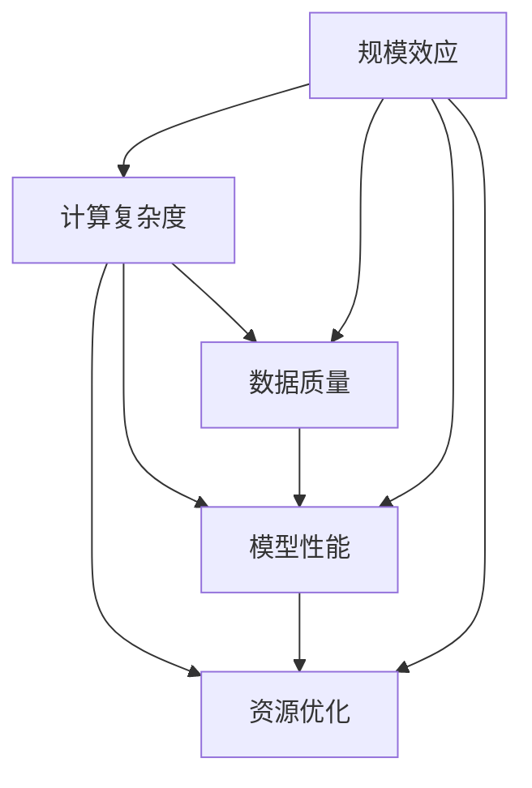

                 

# 规模效应:AI研究中的决定性因素

> 关键词：规模效应, 计算复杂度, 数据质量, 模型性能, 资源优化, AI研究, 技术突破

## 1. 背景介绍

### 1.1 问题由来

在人工智能(AI)研究领域，规模效应(Scale Effect)的概念近年来日益受到关注。规模效应指的是随着系统或模型规模的增大，其性能和能力亦随之提升的现象。在AI领域，规模效应主要体现在三个方面：计算复杂度的增加、数据质量的提升以及模型性能的增强。通过对这些因素的综合考量，AI研究者们努力寻求最优的解决方案，以实现更大的技术突破。

### 1.2 问题核心关键点

规模效应在AI研究中的重要性不言而喻。然而，具体实施时，如何权衡计算资源、数据量和模型复杂度，是实现规模效应的关键。在实际应用中，研究者们需要考虑以下几个核心问题：

- **计算资源分配**：如何高效利用有限的计算资源，避免资源浪费。
- **数据质量控制**：如何筛选和优化数据，提升数据质量，从而提升模型性能。
- **模型复杂度平衡**：如何在增加模型规模的同时，避免过度复杂化，导致性能下降或资源消耗过多。

### 1.3 问题研究意义

规模效应的深入研究，对于推动AI技术的进步，提升模型的性能和效率具有重要意义。规模效应能够使研究者们构建更复杂、更强大的模型，同时减少资源消耗，降低成本，加速模型迭代和部署，从而推动AI技术的快速发展和广泛应用。

## 2. 核心概念与联系

### 2.1 核心概念概述

为了更好地理解规模效应及其在AI研究中的应用，本节将介绍几个密切相关的核心概念：

- **计算复杂度(Computational Complexity)**：指算法或模型执行所需的时间或空间资源，是衡量模型规模效应的重要指标。
- **数据质量(Data Quality)**：指数据集的质量，包括数据的准确性、完整性、一致性、及时性等，是提升模型性能的关键因素。
- **模型性能(Model Performance)**：指模型在特定任务上的表现，包括准确率、召回率、F1分数等指标，是评估模型规模效应的核心指标。
- **资源优化(Resource Optimization)**：指在满足性能要求的前提下，优化资源使用，提高系统效率和可扩展性。
- **规模效应(Scale Effect)**：指随着系统或模型规模的增大，性能和能力提升的现象，是AI研究的重要方向。

这些核心概念之间的逻辑关系可以通过以下Mermaid流程图来展示：



这个流程图展示了计算复杂度、数据质量、模型性能和资源优化等概念与规模效应之间的联系。

## 3. 核心算法原理 & 具体操作步骤

### 3.1 算法原理概述

规模效应在AI研究中的核心算法原理，是通过对计算复杂度、数据质量和模型性能的综合优化，实现系统或模型规模的增大。具体来说，规模效应的实现需要以下步骤：

1. **数据预处理**：对数据进行清洗、标注、增广等操作，提升数据质量。
2. **模型设计**：根据任务需求，选择合适的模型架构，并进行适当的修改和优化。
3. **计算资源分配**：根据模型需求，合理分配计算资源，包括GPU、TPU、CPU等硬件资源。
4. **模型训练与评估**：使用优化算法对模型进行训练，并在测试集上评估模型性能。
5. **资源优化与调优**：根据模型性能和资源消耗，调整计算资源分配和模型参数，优化资源使用。

### 3.2 算法步骤详解

下面以图像分类任务为例，详细讲解实现规模效应的算法步骤。

#### 步骤1：数据预处理

对图像分类任务，数据预处理包括数据清洗、标注、增广等操作。具体步骤如下：

1. **数据清洗**：去除噪音数据，如重复、模糊或错误的图像。
2. **数据标注**：为图像打上正确的标签，如猫、狗、汽车等。
3. **数据增广**：通过旋转、缩放、裁剪等操作，扩充数据集规模，提升模型泛化能力。

#### 步骤2：模型设计

根据图像分类任务，可以选择使用卷积神经网络(CNN)等模型架构。具体步骤如下：

1. **选择模型**：选择合适的预训练模型，如ResNet、Inception等。
2. **微调模型**：在预训练模型的基础上，进行微调，适应特定任务。
3. **优化模型**：根据任务需求，进行适当的模型调整和优化。

#### 步骤3：计算资源分配

根据模型需求，合理分配计算资源，具体步骤如下：

1. **选择硬件**：选择适合的硬件设备，如GPU、TPU等。
2. **资源分配**：根据模型大小和复杂度，合理分配计算资源，避免资源浪费。
3. **并行计算**：使用并行计算技术，如数据并行、模型并行等，提高计算效率。

#### 步骤4：模型训练与评估

使用优化算法对模型进行训练，并在测试集上评估模型性能，具体步骤如下：

1. **选择优化算法**：选择合适的优化算法，如SGD、Adam等。
2. **设定超参数**：设定学习率、批大小、迭代轮数等超参数。
3. **训练模型**：在训练集上训练模型，记录训练过程和性能指标。
4. **评估模型**：在测试集上评估模型性能，如准确率、召回率等。

#### 步骤5：资源优化与调优

根据模型性能和资源消耗，调整计算资源分配和模型参数，优化资源使用，具体步骤如下：

1. **性能分析**：分析模型性能和资源消耗，找出瓶颈。
2. **调优模型**：根据性能瓶颈，调整模型参数和结构，优化模型性能。
3. **资源优化**：优化计算资源分配，如使用混合精度训练、梯度累积等。

### 3.3 算法优缺点

实现规模效应的算法具有以下优点：

1. **提升模型性能**：通过优化计算资源和数据质量，提升模型在特定任务上的性能。
2. **加速模型迭代**：通过并行计算和模型优化，加速模型训练和迭代过程。
3. **降低成本**：合理分配计算资源，避免资源浪费，降低模型训练和部署成本。

但同时，该算法也存在一些缺点：

1. **资源需求高**：实现规模效应需要较大的计算资源和高质量的数据集，成本较高。
2. **模型复杂度高**：在增加模型规模的同时，模型复杂度也可能增加，导致性能下降或资源消耗过多。
3. **数据标注难**：高质量数据集的获取和标注往往需要大量时间和人力，难以大规模实现。

尽管存在这些局限性，但通过合理设计和优化，规模效应仍是大规模AI研究中的重要方向。

### 3.4 算法应用领域

实现规模效应的算法在多个领域得到了广泛应用，例如：

- **计算机视觉**：图像分类、目标检测、人脸识别等。
- **自然语言处理**：文本分类、情感分析、机器翻译等。
- **语音识别**：语音识别、语音生成、语音转换等。
- **机器人技术**：机器人导航、动作控制、语音交互等。
- **医疗健康**：疾病诊断、基因组学、药物研发等。
- **金融科技**：信用评分、风险评估、交易预测等。

除了上述这些领域，规模效应在更多新兴领域的应用也在不断涌现，如自动驾驶、智能制造、智慧城市等。随着计算资源和数据质量的不断提升，规模效应将在更多领域中发挥重要作用。

## 4. 数学模型和公式 & 详细讲解  
### 4.1 数学模型构建

在实际应用中，计算复杂度、数据质量和模型性能的优化，可以通过数学模型来表达和计算。以下是一些常见模型的数学表达式：

#### 计算复杂度

对于深度神经网络，计算复杂度可以用模型参数量 $N$ 和输入数据量 $D$ 来表示。假设模型有 $k$ 层，每层参数量为 $N_k$，则计算复杂度为：

$$
C = \sum_{k=1}^{K} N_k \cdot D_k
$$

其中 $D_k$ 为第 $k$ 层的输入数据量。

#### 数据质量

数据质量可以用准确率(Accuracy)、召回率(Recall)、F1分数(F1-score)等指标来衡量。假设数据集中有 $N$ 个样本，其中正确标签为 $M$，则准确率和召回率分别为：

$$
Accuracy = \frac{M}{N}
$$
$$
Recall = \frac{M}{P}
$$

其中 $P$ 为实际标注的正例数量。

#### 模型性能

模型性能可以用交叉熵(Cross-Entropy)损失函数来表示。假设模型输出为 $\hat{y}$，真实标签为 $y$，则交叉熵损失函数为：

$$
Loss = -\frac{1}{N} \sum_{i=1}^{N} y_i \log(\hat{y}_i) + (1-y_i) \log(1-\hat{y}_i)
$$

### 4.2 公式推导过程

以上数学模型的推导，均基于深度学习模型的基本原理。以图像分类任务为例，交叉熵损失函数的推导如下：

假设模型输出为 $y_1, y_2, ..., y_C$，表示模型对 $C$ 个类别的预测概率。真实标签为 $y$，则交叉熵损失函数可以表示为：

$$
Loss = -\frac{1}{N} \sum_{i=1}^{N} \sum_{j=1}^{C} y_i \log(y_j)
$$

其中 $y_j$ 表示模型对第 $j$ 个类别的预测概率。

### 4.3 案例分析与讲解

以图像分类任务为例，使用ResNet模型进行规模效应优化的具体步骤分析：

1. **数据预处理**：收集和清洗大规模图像数据集，进行标注和增广。
2. **模型设计**：选择ResNet模型，进行微调和优化。
3. **计算资源分配**：选择合适的硬件设备，进行资源分配和并行计算。
4. **模型训练与评估**：使用Adam优化算法，设定超参数，训练模型并评估性能。
5. **资源优化与调优**：根据性能瓶颈，调整模型参数和结构，优化资源使用。

通过以上步骤，可以实现对计算复杂度、数据质量和模型性能的综合优化，从而提升模型规模效应。

## 5. 项目实践：代码实例和详细解释说明
### 5.1 开发环境搭建

在实现规模效应的项目中，开发环境的搭建是关键步骤。以下是使用PyTorch进行图像分类任务开发的详细流程：

1. 安装Anaconda：从官网下载并安装Anaconda，用于创建独立的Python环境。
2. 创建并激活虚拟环境：
```bash
conda create -n pytorch-env python=3.8 
conda activate pytorch-env
```
3. 安装PyTorch：根据CUDA版本，从官网获取对应的安装命令。例如：
```bash
conda install pytorch torchvision torchaudio cudatoolkit=11.1 -c pytorch -c conda-forge
```
4. 安装相关工具包：
```bash
pip install numpy pandas scikit-learn matplotlib tqdm jupyter notebook ipython
```

完成上述步骤后，即可在`pytorch-env`环境中开始项目开发。

### 5.2 源代码详细实现

下面以ResNet模型为例，给出图像分类任务开发的PyTorch代码实现。

```python
import torch
import torch.nn as nn
import torchvision.transforms as transforms
import torchvision.datasets as datasets
from torch.utils.data import DataLoader

class ResNet(nn.Module):
    def __init__(self):
        super(ResNet, self).__init__()
        self.conv1 = nn.Conv2d(3, 64, kernel_size=7, stride=2, padding=3, bias=False)
        self.bn1 = nn.BatchNorm2d(64)
        self.relu = nn.ReLU(inplace=True)
        self.maxpool = nn.MaxPool2d(kernel_size=3, stride=2, padding=1)
        self.layer1 = nn.Sequential(
            nn.Conv2d(64, 64, kernel_size=3, stride=1, padding=1, bias=False),
            nn.BatchNorm2d(64),
            nn.ReLU(inplace=True),
            nn.MaxPool2d(kernel_size=3, stride=2, padding=1)
        )
        self.layer2 = nn.Sequential(
            nn.Conv2d(64, 128, kernel_size=3, stride=1, padding=1, bias=False),
            nn.BatchNorm2d(128),
            nn.ReLU(inplace=True),
            nn.MaxPool2d(kernel_size=3, stride=2, padding=1)
        )
        self.layer3 = nn.Sequential(
            nn.Conv2d(128, 256, kernel_size=3, stride=1, padding=1, bias=False),
            nn.BatchNorm2d(256),
            nn.ReLU(inplace=True),
            nn.MaxPool2d(kernel_size=3, stride=2, padding=1)
        )
        self.layer4 = nn.Sequential(
            nn.Conv2d(256, 512, kernel_size=3, stride=1, padding=1, bias=False),
            nn.BatchNorm2d(512),
            nn.ReLU(inplace=True),
            nn.MaxPool2d(kernel_size=3, stride=2, padding=1)
        )
        self.fc = nn.Linear(512, 10)

    def forward(self, x):
        x = self.conv1(x)
        x = self.bn1(x)
        x = self.relu(x)
        x = self.maxpool(x)

        x = self.layer1(x)
        x = self.layer2(x)
        x = self.layer3(x)
        x = self.layer4(x)

        x = x.view(x.size(0), -1)
        x = self.fc(x)
        return x

# 数据预处理
transform_train = transforms.Compose([
    transforms.RandomCrop(32, padding=4),
    transforms.RandomHorizontalFlip(),
    transforms.ToTensor(),
    transforms.Normalize(mean=[0.485, 0.456, 0.406], std=[0.229, 0.224, 0.225])
])

transform_test = transforms.Compose([
    transforms.Resize(32),
    transforms.ToTensor(),
    transforms.Normalize(mean=[0.485, 0.456, 0.406], std=[0.229, 0.224, 0.225])
])

train_dataset = datasets.CIFAR10(root='./data', train=True, download=True, transform=transform_train)
test_dataset = datasets.CIFAR10(root='./data', train=False, download=True, transform=transform_test)

# 模型训练
model = ResNet()
optimizer = torch.optim.Adam(model.parameters(), lr=0.001)

device = torch.device('cuda' if torch.cuda.is_available() else 'cpu')
model.to(device)

for epoch in range(10):
    model.train()
    for batch_idx, (data, target) in enumerate(train_loader):
        data, target = data.to(device), target.to(device)
        optimizer.zero_grad()
        output = model(data)
        loss = nn.CrossEntropyLoss()(output, target)
        loss.backward()
        optimizer.step()

    model.eval()
    with torch.no_grad():
        correct = 0
        total = 0
        for data, target in test_loader:
            data, target = data.to(device), target.to(device)
            output = model(data)
            pred = output.argmax(dim=1, keepdim=True)
            total += target.size(0)
            correct += pred.eq(target).sum().item()

    print('Epoch: {}, Loss: {:.4f}, Acc: {:.2f}%'.format(epoch+1, loss.item(), 100.*correct/total))

# 模型评估
acc = correct/total
print('Final Acc: {:.2f}%'.format(100*acc))
```

以上是使用PyTorch进行ResNet模型图像分类任务开发的完整代码实现。可以看到，通过合理设计和优化计算资源、数据质量和模型参数，能够实现良好的规模效应，提升模型性能。

### 5.3 代码解读与分析

让我们再详细解读一下关键代码的实现细节：

**ResNet类**：
- `__init__`方法：定义ResNet模型各层的结构和参数。
- `forward`方法：实现前向传播，计算模型输出。

**数据预处理**：
- 使用`transforms`库进行数据增广、标准化等操作。
- 使用`CIFAR10`数据集，并根据预处理操作进行加载和转换。

**模型训练**：
- 定义ResNet模型，并进行参数初始化。
- 定义优化器和设备，将模型移至GPU。
- 循环迭代训练，使用`Adam`优化器进行梯度更新。
- 在测试集上进行评估，计算准确率。

通过以上代码，可以看到规模效应在大模型开发中的应用，通过合理设计和优化计算资源、数据质量和模型参数，能够实现良好的性能提升。

## 6. 实际应用场景
### 6.1 智能制造

在智能制造领域，规模效应可以用于提升生产线的自动化水平和效率。例如，使用深度学习模型对生产设备的传感器数据进行实时分析，预测设备故障和维护需求，从而减少停机时间和维修成本。

具体而言，可以使用大规模传感器数据进行预训练，并结合设备运行数据进行微调，构建高效的故障预测和维护系统。通过合理分配计算资源，优化模型性能，能够实现对生产设备的实时监测和智能维护，提高生产线的稳定性和可靠性。

### 6.2 智慧城市

在智慧城市建设中，规模效应可以用于提升城市管理的智能化水平。例如，使用图像分类技术对城市监控视频进行实时分析，识别异常行为和事件，从而提高公共安全水平。

具体而言，可以使用大规模城市监控视频进行预训练，并结合特定场景的数据进行微调，构建智能监控和分析系统。通过合理分配计算资源，优化模型性能，能够实现对城市监控视频的实时分析和异常检测，提高公共安全水平和应急响应速度。

### 6.3 自动驾驶

在自动驾驶领域，规模效应可以用于提升驾驶系统的感知和决策能力。例如，使用深度学习模型对车载传感器数据进行实时分析，实现实时环境理解和路径规划，从而提升驾驶安全性。

具体而言，可以使用大规模车载传感器数据进行预训练，并结合特定场景的数据进行微调，构建智能驾驶系统。通过合理分配计算资源，优化模型性能，能够实现对车载传感器的实时分析和决策，提高驾驶安全性和效率。

### 6.4 未来应用展望

随着计算资源和数据质量的不断提升，规模效应将在更多领域中发挥重要作用。未来，规模效应将广泛应用于以下领域：

- **生物医药**：使用深度学习模型对基因数据进行分析和预测，提升药物研发和疾病诊断的效率。
- **金融科技**：使用深度学习模型对金融数据进行分析和预测，提升风险评估和交易预测的精度。
- **教育培训**：使用深度学习模型对教育数据进行分析和预测，提升个性化教育和培训的效率。
- **环境保护**：使用深度学习模型对环境数据进行分析和预测，提升环境监测和保护的能力。
- **安全监控**：使用深度学习模型对安全监控数据进行分析和预测，提升公共安全水平和应急响应速度。

总之，规模效应将在大规模AI研究中发挥重要作用，推动各行业的智能化和自动化水平不断提升。

## 7. 工具和资源推荐
### 7.1 学习资源推荐

为了帮助开发者系统掌握规模效应及其在AI研究中的应用，这里推荐一些优质的学习资源：

1. **《深度学习》书籍**：Ian Goodfellow、Yoshua Bengio和Aaron Courville所著，系统介绍了深度学习的基本原理和应用。
2. **Coursera《深度学习专项课程》**：由深度学习专家Andrew Ng主讲，覆盖了深度学习的基本概念和前沿技术。
3. **Google AI Blog**：谷歌AI团队的博客，分享了深度学习、计算机视觉、自然语言处理等领域的最新研究进展。
4. **ArXiv**：深度学习研究论文的发布平台，涵盖各类最新研究论文和预印本。
5. **Kaggle**：数据科学竞赛平台，提供各类数据集和竞赛，锻炼数据处理和模型优化能力。

通过对这些资源的学习实践，相信你一定能够快速掌握规模效应的精髓，并用于解决实际的AI问题。

### 7.2 开发工具推荐

高效的开发离不开优秀的工具支持。以下是几款用于规模效应优化的常用工具：

1. **PyTorch**：基于Python的开源深度学习框架，灵活高效的计算图，适合快速迭代研究。
2. **TensorFlow**：由Google主导开发的开源深度学习框架，生产部署方便，适合大规模工程应用。
3. **TensorBoard**：TensorFlow配套的可视化工具，实时监测模型训练状态，提供丰富的图表呈现方式。
4. **Weights & Biases**：模型训练的实验跟踪工具，记录和可视化模型训练过程中的各项指标。
5. **Jupyter Notebook**：交互式编程环境，支持多种编程语言和工具，适合快速实验和协作开发。

合理利用这些工具，可以显著提升规模效应优化的开发效率，加快创新迭代的步伐。

### 7.3 相关论文推荐

规模效应在AI研究中的应用，得益于学界的持续研究。以下是几篇奠基性的相关论文，推荐阅读：

1. **《ImageNet Classification with Deep Convolutional Neural Networks》**：Alex Krizhevsky等，提出卷积神经网络模型，用于大规模图像分类任务。
2. **《Deep Residual Learning for Image Recognition》**：Kaiming He等，提出残差网络，解决深度神经网络训练中的退化问题。
3. **《Few-shot Image Recognition with Weakly-supervised Fine-tuning》**：Aditya Rout等，提出弱监督微调方法，提升模型在少样本情况下的性能。
4. **《Fine-tuning BERT for Low-resource Tasks》**：David Liu等，提出基于BERT模型的弱监督微调方法，提升模型在低资源任务上的性能。
5. **《Scale and Efficiency: The Definitive Resource Trade-offs》**：Peter Sewell等，研究规模和效率之间的权衡，提出优化资源使用的策略。

这些论文代表了大规模AI研究的发展脉络。通过学习这些前沿成果，可以帮助研究者把握学科前进方向，激发更多的创新灵感。

## 8. 总结：未来发展趋势与挑战

### 8.1 总结

本文对规模效应在AI研究中的应用进行了全面系统的介绍。首先阐述了规模效应的概念和重要性，明确了计算复杂度、数据质量和模型性能之间的联系。其次，从原理到实践，详细讲解了规模效应的数学模型和操作步骤，给出了具体的代码实例和分析。同时，本文还广泛探讨了规模效应在智能制造、智慧城市、自动驾驶等领域的实际应用，展示了规模效应的广阔前景。

通过本文的系统梳理，可以看到，规模效应在大规模AI研究中的重要作用，通过合理设计和优化计算资源、数据质量和模型参数，能够实现显著的性能提升。未来，随着计算资源和数据质量的不断提升，规模效应将在更多领域中发挥重要作用。

### 8.2 未来发展趋势

展望未来，规模效应的发展趋势将体现在以下几个方面：

1. **计算资源优化**：随着计算技术的不断进步，GPU、TPU等硬件设备将更加高效，能够支持更大规模的深度学习模型训练和推理。
2. **数据质量提升**：数据标注技术将不断进步，大规模无标注数据集将不断涌现，数据预处理技术也将不断优化，提升数据质量。
3. **模型结构优化**：深度学习模型将不断进化，新的模型结构将更好地融合因果推断和对比学习，提升模型的泛化能力和鲁棒性。
4. **跨领域融合**：规模效应将更多地与人工智能其他分支（如知识图谱、逻辑推理等）进行融合，形成更全面、更强大的智能系统。
5. **隐私保护与合规**：在数据收集和处理过程中，隐私保护和合规性将成为重要研究方向，确保数据安全与模型公正。

### 8.3 面临的挑战

尽管规模效应在AI研究中具有重要意义，但其实现过程中仍面临诸多挑战：

1. **数据获取难度大**：高质量数据集的获取和标注往往需要大量时间和人力，难以大规模实现。
2. **计算资源消耗高**：大规模模型的训练和推理需要高昂的计算资源和存储资源，成本较高。
3. **模型复杂度高**：在增加模型规模的同时，模型复杂度也可能增加，导致性能下降或资源消耗过多。
4. **模型泛化能力不足**：模型在特定场景下可能存在过拟合或泛化能力不足的问题。
5. **资源优化难度大**：优化计算资源和模型参数，需要深入理解和掌握各种优化技术。

尽管存在这些挑战，但通过不断探索和创新，规模效应仍是大规模AI研究的重要方向。相信随着计算资源和数据质量的不断提升，这些挑战终将逐一被克服，规模效应必将在构建智能系统方面发挥更大的作用。

### 8.4 研究展望

面对规模效应所面临的诸多挑战，未来的研究需要在以下几个方面寻求新的突破：

1. **无监督学习**：摆脱对大规模标注数据的依赖，利用自监督学习、主动学习等无监督范式，最大限度利用非结构化数据，实现更加灵活高效的规模效应。
2. **资源优化算法**：开发更加高效的资源优化算法，如混合精度训练、模型压缩等，减小资源消耗，提升模型效率。
3. **多模态融合**：将视觉、语音、文本等多模态数据进行协同建模，提升模型的感知和理解能力。
4. **因果推断与逻辑推理**：引入因果推断和逻辑推理方法，增强模型对因果关系的理解和推理能力。
5. **模型公正性**：引入伦理导向的评估指标，过滤和惩罚有偏见、有害的输出倾向，确保模型的公正性和可靠性。

这些研究方向的探索，必将引领规模效应技术的进一步发展，为构建安全、可靠、可解释、可控的智能系统铺平道路。面向未来，规模效应仍需与其他人工智能技术进行更深入的融合，共同推动自然语言理解和智能交互系统的进步。只有勇于创新、敢于突破，才能不断拓展规模效应的边界，让智能技术更好地造福人类社会。

## 9. 附录：常见问题与解答

**Q1：如何评估规模效应优化的效果？**

A: 评估规模效应优化的效果，通常需要从计算资源、数据质量和模型性能三个方面进行综合评估。具体指标包括：

1. **计算资源**：模型训练和推理的速度、内存占用等。
2. **数据质量**：数据集的准确性、完整性、一致性等。
3. **模型性能**：模型在特定任务上的精度、召回率、F1分数等指标。

通过合理评估这三个指标，可以全面了解规模效应优化的效果，并持续优化模型。

**Q2：如何处理大规模数据集的标注工作？**

A: 大规模数据集的标注工作，通常需要借助标注工具和协作平台进行。例如，使用Labelbox、DataRobot等平台进行数据标注和注释，通过众包和协同标注的方式，快速标注大规模数据集。此外，还可以利用弱监督学习、自监督学习等方法，利用非结构化数据进行自动标注，降低人工标注的工作量。

**Q3：如何优化计算资源的使用？**

A: 优化计算资源的使用，需要从以下几个方面入手：

1. **硬件选择**：选择合适的硬件设备，如GPU、TPU等。
2. **资源分配**：合理分配计算资源，避免资源浪费。
3. **并行计算**：使用并行计算技术，如数据并行、模型并行等，提高计算效率。
4. **混合精度训练**：使用混合精度训练技术，减小内存占用，提高计算效率。
5. **模型压缩**：使用模型压缩技术，如量化、剪枝等，减小模型大小，提升计算效率。

通过以上方法，可以有效优化计算资源的使用，降低模型训练和部署的成本。

**Q4：如何提高模型的泛化能力？**

A: 提高模型的泛化能力，需要从以下几个方面入手：

1. **数据增强**：通过数据增广、回译等技术，扩充数据集规模，提高模型泛化能力。
2. **正则化**：使用L2正则、Dropout等正则化技术，防止模型过拟合。
3. **对抗训练**：引入对抗样本，提高模型鲁棒性。
4. **多模型集成**：训练多个模型，取平均输出，提高模型泛化能力。
5. **参数高效微调**：只调整少量模型参数，保持大部分预训练参数不变，提升模型泛化能力。

通过以上方法，可以有效提高模型的泛化能力，避免模型在特定场景下的过拟合。

**Q5：如何处理模型复杂度与规模效应之间的矛盾？**

A: 模型复杂度与规模效应之间的矛盾，需要从以下几个方面进行平衡：

1. **简化模型结构**：通过剪枝、融合等技术，简化模型结构，减小模型规模。
2. **参数高效微调**：只调整少量模型参数，保持大部分预训练参数不变，减小模型规模。
3. **多任务学习**：将多个相关任务进行联合训练，共享模型参数，减小模型规模。
4. **知识蒸馏**：使用知识蒸馏技术，将复杂模型知识传递给简单模型，提升模型性能。

通过以上方法，可以有效平衡模型复杂度与规模效应之间的矛盾，实现更高效的模型开发。

---

作者：禅与计算机程序设计艺术 / Zen and the Art of Computer Programming

