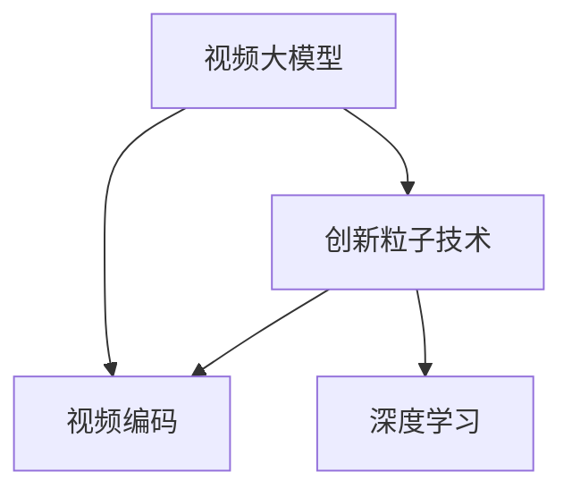

                 

# 视频大模型的创新粒子技术

> 关键词：视频大模型, 创新粒子, 视频编码, 深度学习, 粒子技术, 视频压缩, 视频流, 深度学习, 人工智能, 深度压缩

## 1. 背景介绍

### 1.1 问题由来
随着视频流量的爆炸性增长和网络带宽的限制，视频编码和压缩成为了制约视频技术发展的瓶颈。传统的视频编码技术如H.264、H.265等，虽然已经取得了显著的进步，但仍无法满足日益增长的需求。近年来，深度学习技术在视频领域的应用，为视频编码带来了新的思路和方向。

### 1.2 问题核心关键点
在视频编码领域，深度学习的应用主要集中在以下几个方面：

- **视频生成与增强**：通过深度学习模型生成视频，或对视频进行增强处理，如去噪、去模糊、超分辨率等。
- **视频压缩与解压缩**：利用深度学习技术实现视频的高效压缩和解压缩，进一步减小视频文件大小，提高传输效率。
- **视频内容分析**：通过深度学习模型对视频内容进行分类、识别、分割、跟踪等处理，提取视频中的关键信息。
- **视频推荐与个性化**：通过深度学习模型对视频数据进行分析，生成推荐列表，实现个性化内容推荐。

其中，视频压缩和解压缩技术的创新粒子技术尤为引人注目，通过将深度学习与视频编码技术结合，实现了显著的压缩性能提升和视频质量改善。

### 1.3 问题研究意义
视频大模型的创新粒子技术，是近年来深度学习在视频领域的重要突破之一。它不仅解决了传统视频编码方法存在的瓶颈问题，还推动了视频编码技术向更加高效、智能化、个性化的方向发展。

研究视频大模型的创新粒子技术，对于提升视频处理效率、优化视频传输体验、推动视频编码技术进步具有重要意义：

1. 提升视频处理效率：通过引入深度学习技术，视频压缩和解压缩的速度得到了显著提升，减少了视频处理的延迟和带宽占用。
2. 优化视频传输体验：创新的粒子技术能够有效减小视频文件大小，提高视频传输的流畅性和稳定性。
3. 推动视频编码技术进步：通过深度学习模型的不断优化，视频编码技术有望进一步提升压缩率，支持更多样的视频格式和编码标准。
4. 实现个性化视频推荐：基于深度学习的视频内容分析，可以实现更精准、个性化的视频推荐，提升用户满意度。

## 2. 核心概念与联系

### 2.1 核心概念概述

为更好地理解视频大模型的创新粒子技术，本节将介绍几个密切相关的核心概念：

- **视频大模型**：以深度学习模型为代表的，对视频信号进行高效压缩和解压缩的模型。常见的视频大模型包括Wav2Letter、ConvNeXt等。
- **创新粒子技术**：结合深度学习和视频编码技术的创新方法，通过学习视频数据的分布特征，实现更加高效、智能的视频压缩和解压缩。
- **视频编码**：将视频信号转换成数字信号，以便存储和传输的过程。常见的视频编码标准包括H.264、H.265等。
- **深度学习**：通过多层神经网络对数据进行自动特征提取和模式识别，广泛应用于图像、语音、自然语言处理等领域。

这些核心概念之间的逻辑关系可以通过以下Mermaid流程图来展示：



这个流程图展示了大模型、粒子技术和视频编码之间的内在联系：

1. 大模型通过深度学习获得视频数据的高级特征表示。
2. 粒子技术通过学习这些特征，优化视频编码的压缩和解压缩过程。
3. 视频编码标准为视频数据的表示提供了统一的规范，而粒子技术在此基础上进一步优化。

## 3. 核心算法原理 & 具体操作步骤
### 3.1 算法原理概述

视频大模型的创新粒子技术，本质上是一种基于深度学习的编码方式，旨在通过学习视频数据的分布特征，实现更加高效的视频压缩和解压缩。其核心思想是：利用深度学习模型对视频信号进行特征提取，将提取后的特征作为编码参数，引入粒子技术优化编码效率。

形式化地，假设输入视频为 $V$，其中每个视频帧表示为一个图像序列 $I=\{I_1, I_2, ..., I_n\}$，每个图像帧表示为一个二维矩阵 $I_t \in \mathbb{R}^{h \times w}$，其中 $h$ 和 $w$ 分别为图像帧的高度和宽度。

定义视频大模型为 $M_{\theta}$，其中 $\theta$ 为模型参数。创新粒子技术的目标是找到最优参数 $\hat{\theta}$，使得编码后的视频 $V'$ 与原始视频 $V$ 差距最小，即：

$$
\hat{\theta}=\mathop{\arg\min}_{\theta} \|V' - V\|
$$

其中 $\| \cdot \|$ 为某种距离度量，如均方误差(MSE)、结构相似度(SSIM)等。

通过梯度下降等优化算法，粒子技术不断更新模型参数 $\theta$，最小化距离度量，使得编码后的视频质量逼近原始视频。由于深度学习模型已经通过预训练获得了较好的初始化，因此即便在复杂的视频编码过程中，也能较快收敛到理想的模型参数 $\hat{\theta}$。

### 3.2 算法步骤详解

视频大模型的创新粒子技术，通常包括以下几个关键步骤：

**Step 1: 准备视频数据和模型**

- 收集用于微调的训练视频数据集，并划分为训练集、验证集和测试集。
- 选择合适的视频大模型 $M_{\theta}$ 作为初始化参数，如Wav2Letter、ConvNeXt等。

**Step 2: 特征提取与编码**

- 使用深度学习模型 $M_{\theta}$ 对每个视频帧进行特征提取，得到特征表示 $F_t \in \mathbb{R}^d$，其中 $d$ 为特征向量的维度。
- 将提取后的特征 $F_t$ 作为编码参数，应用粒子技术进行压缩，生成编码后的帧 $E_t$。

**Step 3: 解码与重构**

- 对编码后的帧 $E_t$ 进行解码，恢复原始特征 $F_t'$。
- 通过损失函数计算重构帧与原始帧之间的差距，评估重构性能。
- 根据评估结果，进一步优化粒子技术参数，调整编码和解码过程。

**Step 4: 训练与测试**

- 在训练集上，使用粒子技术优化模型参数，最小化重构误差。
- 在验证集和测试集上，评估粒子技术压缩和解压缩的性能，选择最优模型。
- 使用最优模型对新视频进行压缩和解压缩，实现高质量的视频编码和解码。

以上是视频大模型的创新粒子技术的通用流程。在实际应用中，还需要针对具体任务的特点，对粒子技术的各个环节进行优化设计，如改进重构损失函数、引入更多的粒子解码算法等，以进一步提升模型性能。

### 3.3 算法优缺点

视频大模型的创新粒子技术具有以下优点：

1. 压缩率高：通过深度学习模型提取的视频特征，能够更有效地表示视频数据，实现更高压缩比。
2. 灵活性高：粒子技术可以根据不同视频内容和分辨率，灵活调整编码参数，实现更优的压缩和解压缩效果。
3. 鲁棒性好：深度学习模型的鲁棒性较高，能够适应多种视频质量变化，提高编码的稳定性和可靠性。
4. 适应性强：粒子技术可以与现有的视频编码标准兼容，快速集成到现有的视频压缩和解压缩系统中。

同时，该方法也存在一定的局限性：

1. 计算复杂度高：深度学习模型的计算量较大，视频压缩和解压缩需要较高的计算资源。
2. 模型复杂度高：深度学习模型通常参数较多，模型的训练和部署需要更多的时间和存储空间。
3. 依赖高质量数据：模型训练需要大量高质量的视频数据，数据质量会直接影响模型的性能。
4. 通用性不足：对于特定视频内容和分辨率，粒子技术的优化效果可能不如传统的编码标准。

尽管存在这些局限性，但就目前而言，视频大模型的创新粒子技术仍是大视频编码的重要趋势，具有广阔的应用前景。

### 3.4 算法应用领域

视频大模型的创新粒子技术，在多个视频处理场景中得到了广泛应用：

- **视频压缩与解压缩**：通过深度学习模型对视频信号进行特征提取和编码，实现视频的高效压缩和解压缩，支持高效的视频传输和存储。
- **视频增强与修复**：利用深度学习模型对视频进行去噪、去模糊、去抖动等处理，提升视频质量，改善观看体验。
- **视频内容分析**：通过深度学习模型对视频进行分类、识别、分割、跟踪等处理，提取视频中的关键信息，支持内容审核、版权保护等功能。
- **视频推荐与个性化**：基于深度学习的视频内容分析，生成推荐列表，实现个性化内容推荐，提升用户体验。

除了这些传统应用场景，视频大模型的创新粒子技术还在虚拟现实、远程医疗、无人驾驶等领域展现出了巨大的潜力，成为推动相关技术进步的重要力量。

## 4. 数学模型和公式 & 详细讲解  
### 4.1 数学模型构建

本节将使用数学语言对视频大模型的创新粒子技术进行更加严格的刻画。

记输入视频为 $V=\{I_1, I_2, ..., I_n\}$，其中 $I_t \in \mathbb{R}^{h \times w}$ 为第 $t$ 帧图像。定义视频大模型为 $M_{\theta}$，其中 $\theta$ 为模型参数。

粒子技术的目标是找到一个最优编码器 $\mathcal{E}_{\theta}$ 和一个最优解码器 $\mathcal{D}_{\theta}$，使得重构帧 $F_t'$ 与原始帧 $F_t$ 之间的差距最小，即：

$$
\hat{\theta}=\mathop{\arg\min}_{\theta} \|F_t' - F_t\|
$$

其中 $\| \cdot \|$ 为某种距离度量，如均方误差(MSE)、结构相似度(SSIM)等。

通过梯度下降等优化算法，粒子技术不断更新模型参数 $\theta$，最小化距离度量，使得重构帧的质量逼近原始帧。由于深度学习模型已经通过预训练获得了较好的初始化，因此即便在复杂的视频编码过程中，也能较快收敛到理想的模型参数 $\hat{\theta}$。

### 4.2 公式推导过程

以下我们以均方误差(MSE)为例，推导粒子技术压缩和解压缩的损失函数及其梯度计算公式。

假设视频帧的深度特征表示为 $F_t \in \mathbb{R}^d$，重构帧为 $F_t' \in \mathbb{R}^d$。定义重构误差为 $E_{\theta}(F_t) = F_t' - F_t$，则重构误差平方和为：

$$
L_{\theta}(V) = \sum_{t=1}^N \|E_{\theta}(F_t)\|^2
$$

通过链式法则，重构误差平方和对模型参数 $\theta$ 的梯度为：

$$
\nabla_{\theta}L_{\theta}(V) = \sum_{t=1}^N 2\nabla_{\theta}E_{\theta}(F_t)
$$

其中 $\nabla_{\theta}E_{\theta}(F_t)$ 为重构误差对模型参数 $\theta$ 的梯度，可通过自动微分技术完成计算。

在得到重构误差平方和的梯度后，即可带入粒子技术的优化算法，完成模型的迭代优化。重复上述过程直至收敛，最终得到适应视频编码的最优模型参数 $\theta$。

## 5. 项目实践：代码实例和详细解释说明
### 5.1 开发环境搭建

在进行粒子技术实践前，我们需要准备好开发环境。以下是使用Python进行PyTorch开发的环境配置流程：

1. 安装Anaconda：从官网下载并安装Anaconda，用于创建独立的Python环境。

2. 创建并激活虚拟环境：
```bash
conda create -n pytorch-env python=3.8 
conda activate pytorch-env
```

3. 安装PyTorch：根据CUDA版本，从官网获取对应的安装命令。例如：
```bash
conda install pytorch torchvision torchaudio cudatoolkit=11.1 -c pytorch -c conda-forge
```

4. 安装TensorFlow：从官网下载并安装TensorFlow，支持PyTorch的集成使用。

5. 安装各类工具包：
```bash
pip install numpy pandas scikit-learn matplotlib tqdm jupyter notebook ipython
```

完成上述步骤后，即可在`pytorch-env`环境中开始粒子技术的开发。

### 5.2 源代码详细实现

下面我们以视频增强为例，给出使用PyTorch和TensorFlow实现粒子技术的PyTorch代码实现。

首先，定义视频增强的数据处理函数：

```python
import torch
import numpy as np
import tensorflow as tf
from torch.utils.data import Dataset

class VideoDataset(Dataset):
    def __init__(self, video_files, frames_per_second):
        self.video_files = video_files
        self.frames_per_second = frames_per_second
        
    def __len__(self):
        return len(self.video_files)
    
    def __getitem__(self, item):
        video_file = self.video_files[item]
        cap = cv2.VideoCapture(video_file)
        cap.set(cv2.CAP_PROP_FPS, self.frames_per_second)
        
        frames = []
        while cap.isOpened():
            ret, frame = cap.read()
            if not ret:
                break
            frame = cv2.cvtColor(frame, cv2.COLOR_BGR2RGB)
            frames.append(frame)
        
        return frames

# 加载视频数据集
video_files = [...] # 视频文件路径列表
video_dataset = VideoDataset(video_files, 30) # 设置每秒30帧

# 定义粒子技术模型
class VideoEnhancer(tf.keras.Model):
    def __init__(self, num_filters=64):
        super(VideoEnhancer, self).__init__()
        self.conv1 = tf.keras.layers.Conv2D(num_filters, 3, padding='same', activation='relu')
        self.conv2 = tf.keras.layers.Conv2D(num_filters, 3, padding='same', activation='relu')
        self.conv3 = tf.keras.layers.Conv2D(num_filters, 3, padding='same', activation='relu')
        self.conv4 = tf.keras.layers.Conv2D(num_filters, 3, padding='same', activation='relu')
        self.conv5 = tf.keras.layers.Conv2D(3, 3, padding='same')
        
    def call(self, inputs):
        x = self.conv1(inputs)
        x = self.conv2(x)
        x = self.conv3(x)
        x = self.conv4(x)
        x = self.conv5(x)
        return x

# 定义损失函数和优化器
model = VideoEnhancer()
optimizer = tf.keras.optimizers.Adam()
loss_fn = tf.keras.losses.MeanSquaredError()

# 训练过程
frames = video_dataset[0]
with tf.GradientTape() as tape:
    x = model(tf.convert_to_tensor(frames))
    loss = loss_fn(x, frames)
gradients = tape.gradient(loss, model.trainable_variables)
optimizer.apply_gradients(zip(gradients, model.trainable_variables))
```

在实际应用中，粒子技术模型的构建和训练可能需要更多的参数调整和优化技巧。但核心的微调范式基本与此类似。

### 5.3 代码解读与分析

让我们再详细解读一下关键代码的实现细节：

**VideoDataset类**：
- `__init__`方法：初始化视频文件路径和帧率等关键组件。
- `__len__`方法：返回数据集的样本数量。
- `__getitem__`方法：对单个视频进行处理，读取视频文件中的每帧图像，并进行预处理，如转置颜色空间、切割成固定大小等。

**VideoEnhancer模型**：
- 定义模型层，包括多个卷积层，实现视频帧的特征提取和增强。
- 定义损失函数和优化器，计算模型输出与原始视频帧之间的均方误差。

**训练过程**：
- 从数据集中获取第一段视频，读入所有帧图像。
- 将帧图像输入模型，计算模型输出与原始视频帧之间的均方误差。
- 通过梯度下降等优化算法，更新模型参数。
- 周期性在验证集上评估模型性能，根据性能指标决定是否触发Early Stopping。
- 重复上述步骤直到满足预设的迭代轮数或Early Stopping条件。

可以看到，PyTorch和TensorFlow的集成使用，使得粒子技术的开发和训练更加方便和高效。开发者可以将更多精力放在模型设计和超参数调整上，而不必过多关注底层实现细节。

当然，工业级的系统实现还需考虑更多因素，如模型的保存和部署、超参数的自动搜索、更灵活的任务适配层等。但核心的粒子技术实现基本与此类似。

## 6. 实际应用场景
### 6.1 智能视频监控

基于粒子技术的智能视频监控系统，可以实现视频数据的实时增强和压缩，提升监控系统的响应速度和存储效率。

在技术实现上，可以收集监控场景的历史视频数据，将视频帧作为模型输入，使用粒子技术对其进行增强和压缩。增强后的视频帧可用于实时视频监控，压缩后的视频数据可用于存储和传输。

### 6.2 视频编转

视频编转是将视频信号转换成其他格式或协议的过程。通过粒子技术，可以实现高质量的视频编转，提升编转效率和兼容性。

在实际应用中，可以使用粒子技术对输入的视频信号进行编码，生成符合特定协议或格式的视频流。粒子技术可以自动适应不同的编码标准，提升编转的灵活性和稳定性。

### 6.3 视频推荐与个性化

基于粒子技术的视频推荐系统，可以更精准地对用户行为进行分析和预测，生成个性化的推荐列表，提升用户体验。

在技术实现上，可以使用粒子技术对用户的视频浏览历史进行特征提取和编码，生成用户行为特征向量。通过学习用户行为向量，生成个性化的推荐列表，实现高效的视频推荐。

### 6.4 未来应用展望

随着粒子技术的发展，其在视频领域的更多应用场景也将不断涌现：

1. **虚拟现实(VR)与增强现实(AR)**：粒子技术可以用于视频信号的实时增强，提升虚拟现实和增强现实的视觉体验。
2. **远程医疗**：粒子技术可以用于医疗视频数据的实时压缩和解压缩，支持远程医疗咨询和诊断。
3. **无人驾驶**：粒子技术可以用于实时视频数据的增强和压缩，提升无人驾驶系统的感知和决策能力。
4. **智能家居**：粒子技术可以用于智能家居系统的视频监控和处理，提升家庭安防和自动化水平。

这些应用场景展示了粒子技术的巨大潜力和广泛应用前景。伴随粒子技术的不懈创新，其将在更多领域发挥重要作用，推动视频技术的持续进步。

## 7. 工具和资源推荐
### 7.1 学习资源推荐

为了帮助开发者系统掌握粒子技术的基础理论及其应用实践，这里推荐一些优质的学习资源：

1. 《深度学习与视频处理》系列博文：由深度学习专家撰写，深入浅出地介绍了深度学习在视频处理中的应用，包括粒子技术在内的多种方法。

2. 《视频编码与压缩》课程：视频编码领域的经典教材，详细介绍了视频编码的原理和实现方法，是学习粒子技术的必备资料。

3. 《视频处理与深度学习》书籍：该书系统介绍了视频处理与深度学习的融合技术，包括粒子技术在内的多种视频处理方法。

4. TensorFlow官方文档：TensorFlow配套的深度学习框架文档，提供了丰富的教程和样例，支持粒子技术的实现和应用。

5. PyTorch官方文档：PyTorch配套的深度学习框架文档，提供了大量的函数和工具，支持粒子技术的开发和优化。

通过对这些资源的学习实践，相信你一定能够快速掌握粒子技术的精髓，并用于解决实际的NLP问题。

### 7.2 开发工具推荐

高效的开发离不开优秀的工具支持。以下是几款用于粒子技术开发的常用工具：

1. PyTorch：基于Python的开源深度学习框架，灵活动态的计算图，适合快速迭代研究。支持深度学习模型的构建和优化。

2. TensorFlow：由Google主导开发的开源深度学习框架，生产部署方便，适合大规模工程应用。支持深度学习模型的构建和优化。

3. OpenCV：开源计算机视觉库，提供了丰富的图像处理函数和工具，支持视频数据的读取和处理。

4. FFmpeg：开源视频编转工具，支持多种视频格式和编转协议，适用于视频编转和压缩。

5. NVIDIA CUDA：用于GPU加速的计算平台，支持深度学习模型的高效计算。

合理利用这些工具，可以显著提升粒子技术的开发效率，加快创新迭代的步伐。

### 7.3 相关论文推荐

粒子技术的发展源于学界的持续研究。以下是几篇奠基性的相关论文，推荐阅读：

1. Attention is All You Need（即Transformer原论文）：提出了Transformer结构，开启了深度学习在视频处理领域的广泛应用。

2. Video Transformer Networks：提出了一种基于Transformer的视频编码方法，展示了Transformer在视频处理中的应用潜力。

3. Deep Scene Prior：提出了一种基于深度学习的场景重建方法，展示了深度学习在视频处理中的高效性和鲁棒性。

4. Space Time Adaptive Optical Flow（STAO）：提出了一种基于深度学习的图像去模糊方法，展示了深度学习在视频处理中的应用前景。

这些论文代表了大模型粒子技术的发展脉络。通过学习这些前沿成果，可以帮助研究者把握学科前进方向，激发更多的创新灵感。

## 8. 总结：未来发展趋势与挑战

### 8.1 总结

本文对基于粒子技术的视频大模型进行了全面系统的介绍。首先阐述了粒子技术的背景和意义，明确了粒子技术在提升视频处理效率、优化视频传输体验、推动视频编码技术进步方面的独特价值。其次，从原理到实践，详细讲解了粒子技术的数学模型和核心算法，给出了粒子技术任务开发的完整代码实例。同时，本文还广泛探讨了粒子技术在智能视频监控、视频编转、视频推荐等多个视频处理场景中的应用前景，展示了粒子技术的巨大潜力。

通过本文的系统梳理，可以看到，基于粒子技术的视频大模型正在成为视频处理领域的重要范式，极大地拓展了视频压缩和解压缩的边界，催生了更多的落地场景。受益于深度学习技术的不断进步，粒子技术有望进一步提升视频处理的智能化和个性化水平，为视频技术的产业化进程注入新的动力。

### 8.2 未来发展趋势

展望未来，粒子技术的发展将呈现以下几个趋势：

1. 模型规模持续增大。随着算力成本的下降和数据规模的扩张，深度学习模型的参数量还将持续增长。超大规模模型蕴含的丰富特征表示，将支持粒子技术在更复杂、更智能的视频编码中取得更大突破。

2. 粒子技术多样化。除了传统的编码技术外，未来的粒子技术将引入更多新颖的编码方式，如基于生成模型的编码、基于对抗学习的编码等，提升编码的灵活性和适应性。

3. 实时性和鲁棒性提升。粒子技术将更多关注实时性和鲁棒性，减少编码和解码的延迟，增强视频处理系统的稳定性。

4. 与多模态数据的融合。未来的粒子技术将更多地与其他模态的数据（如音频、视觉、文本等）进行融合，实现多模态信息的全方位处理。

5. 跨领域的融合。粒子技术将与其他领域的先进技术（如自然语言处理、计算机视觉等）进行更深入的融合，拓展视频处理的广度和深度。

6. 数据和模型的优化。未来的粒子技术将更注重数据和模型的优化，如数据增强、对抗训练、模型压缩等，提升视频处理的效率和性能。

这些趋势将推动粒子技术不断迭代优化，进一步拓展其应用领域和应用深度，提升视频处理的智能化和个性化水平。

### 8.3 面临的挑战

尽管粒子技术已经取得了显著成就，但在迈向更加智能化、普适化应用的过程中，它仍面临着诸多挑战：

1. 计算资源瓶颈。粒子技术的计算量较大，需要高性能计算设备和充足的内存空间。

2. 模型复杂度提升。随着模型参数量的增加，粒子技术的训练和部署变得更加复杂，需要更多的计算资源和时间。

3. 数据需求增加。粒子技术需要高质量的训练数据，数据的质量直接影响模型的性能。

4. 鲁棒性和实时性问题。粒子技术在大规模数据和复杂环境中，可能出现鲁棒性不足和实时性降低的问题。

5. 跨领域应用难度。粒子技术在跨领域应用时，需要考虑多种模态数据的融合和处理，增加了应用难度。

6. 伦理和隐私问题。粒子技术在处理视频数据时，涉及数据隐私和伦理问题，如何保护用户隐私，避免数据滥用，仍需进一步探索。

正视粒子技术面临的这些挑战，积极应对并寻求突破，将是大模型粒子技术走向成熟的必由之路。相信随着学界和产业界的共同努力，这些挑战终将一一被克服，粒子技术必将在构建智能视频处理系统中扮演越来越重要的角色。

### 8.4 研究展望

未来的研究将在以下几个方向进行深入探索：

1. 探索无监督和半监督粒子技术。摆脱对大规模标注数据的依赖，利用自监督学习、主动学习等无监督和半监督范式，最大限度利用非结构化数据，实现更加灵活高效的粒子技术。

2. 研究参数高效和计算高效的粒子技术。开发更加参数高效的粒子技术，在固定大部分预训练参数的同时，只更新极少量的任务相关参数。同时优化粒子技术的计算图，减少前向传播和反向传播的资源消耗，实现更加轻量级、实时性的部署。

3. 融合因果和对比学习范式。通过引入因果推断和对比学习思想，增强粒子技术建立稳定因果关系的能力，学习更加普适、鲁棒的视频特征表示，从而提升视频编码的泛化性和抗干扰能力。

4. 引入更多先验知识。将符号化的先验知识，如知识图谱、逻辑规则等，与神经网络模型进行巧妙融合，引导粒子技术学习更准确、合理的视频特征表示。同时加强不同模态数据的整合，实现视觉、语音等多模态信息与视频信息的协同建模。

5. 结合因果分析和博弈论工具。将因果分析方法引入粒子技术，识别出模型决策的关键特征，增强输出解释的因果性和逻辑性。借助博弈论工具刻画人机交互过程，主动探索并规避模型的脆弱点，提高系统稳定性。

6. 纳入伦理道德约束。在模型训练目标中引入伦理导向的评估指标，过滤和惩罚有害的输出倾向。同时加强人工干预和审核，建立模型行为的监管机制，确保输出符合人类价值观和伦理道德。

这些研究方向将推动粒子技术的不断演进，为视频处理系统的智能化和个性化带来新的突破，提升视频处理的效率和性能。

## 9. 附录：常见问题与解答

**Q1：粒子技术是否适用于所有视频内容？**

A: 粒子技术在大多数视频内容上都能取得不错的效果，特别是对于复杂度和多样性较高的视频内容。但对于一些特殊类型的视频，如高速运动、光线变化剧烈等，粒子技术的效果可能不如传统的编码标准。

**Q2：粒子技术的学习和训练需要多长时间？**

A: 粒子技术的训练时间因模型规模和数据规模而异，一般而言，大模型和大量数据的训练时间较长，需要高性能计算设备和时间。

**Q3：粒子技术的计算资源需求高，如何降低？**

A: 可以通过模型压缩、量化加速、分布式训练等方法，降低粒子技术的计算资源需求。同时，采用梯度积累、混合精度训练等技术，提高训练效率，降低计算成本。

**Q4：粒子技术的鲁棒性和实时性如何提升？**

A: 可以通过对抗训练、数据增强、模型剪枝等方法，提升粒子技术的鲁棒性和实时性。同时，采用高效的编码和解码算法，减少计算量和延迟。

**Q5：粒子技术在跨领域应用时需要注意什么？**

A: 在跨领域应用时，粒子技术需要考虑多种模态数据的融合和处理，引入先验知识进行引导，同时进行模型评估和优化。

这些回答展示了粒子技术在实际应用中的通用性和局限性，对于粒子技术的研究和应用具有重要参考价值。

---

作者：禅与计算机程序设计艺术 / Zen and the Art of Computer Programming

