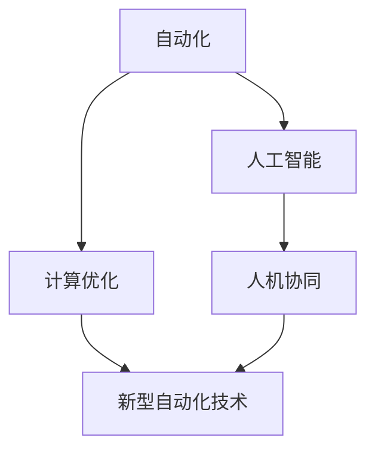

                 

# 计算变化与自动化的互动

## 1. 背景介绍

### 1.1 问题由来
随着人工智能(AI)和计算技术的发展，自动化已经深入到各个行业和领域，从制造业到金融、医疗、教育、娱乐等，自动化正在改变人类的生产和生活方式。这种变化既带来了前所未有的机遇，也带来了新的挑战和风险。

### 1.2 问题核心关键点
计算变化与自动化互动的核心在于如何通过计算技术来驱动和优化自动化过程。这不仅包括对现有自动化系统进行计算优化，也包括开发新的计算技术来支持更高级的自动化应用。关键点包括：

- 自动化过程的计算优化：通过算法和计算资源的优化，提升自动化系统的效率和性能。
- 新型自动化计算技术：如机器学习、深度学习、强化学习等，这些技术为自动化带来了新的可能性。
- 人机协同自动化：结合人类的认知和计算技术的自动化，实现更智能、更高效的自动化系统。

## 2. 核心概念与联系

### 2.1 核心概念概述

为更好地理解计算变化与自动化的互动，本节将介绍几个关键概念：

- 自动化(Automation)：指通过计算技术和算法，让机器执行人类原本需要人工完成的任务。包括机器人、自动化生产线、智能客服、自动化驾驶等。
- 计算优化(Computational Optimization)：通过算法优化，提升自动化系统的效率和性能。如线性规划、整数规划、最优化问题等。
- 人工智能(AI)：通过机器学习和深度学习等算法，使计算机具备类似人类的认知和决策能力。包括强化学习、生成对抗网络(GAN)等。
- 人机协同(Symbiosis)：将人类与计算机结合起来，实现更智能的自动化系统。如人机交互界面、混合智能系统等。

这些概念之间的逻辑关系可以通过以下Mermaid流程图来展示：



这个流程图展示了一个自动化系统的基本架构和关键技术。

## 3. 核心算法原理 & 具体操作步骤
### 3.1 算法原理概述

计算变化与自动化的互动核心在于通过计算技术来驱动和优化自动化过程。其基本思想是：利用计算机的计算能力和算法，将复杂的自动化任务分解为多个子任务，优化每个子任务的执行效率，最终提升整个自动化系统的性能。

在具体操作上，可以通过以下步骤来实现计算变化与自动化的互动：

1. **自动化任务分析**：首先对自动化任务进行分解，识别出其中的关键步骤和子任务。
2. **计算优化策略设计**：针对每个子任务，设计计算优化策略，如线性规划、整数规划等。
3. **算法实现与调试**：实现具体的计算优化算法，并通过调试和优化，确保其有效性和鲁棒性。
4. **人机协同**：在自动化系统中加入人机交互界面，将计算结果反馈给用户，辅助用户做出决策。

### 3.2 算法步骤详解

#### 3.2.1 自动化任务分解

以智能仓库管理为例，仓库管理包括货物入库、存储、出库等多个子任务。首先需要对每个子任务进行分析，识别出其中的关键步骤和操作。

1. **货物入库**：涉及货物接收、分类、存储等步骤，需要设计自动化的货物分拣和存储算法。
2. **货物存储**：涉及货物的堆放、位置调整等操作，需要设计自动化的货物堆放算法。
3. **货物出库**：涉及货物的拣选、搬运等操作，需要设计自动化的货物拣选算法。

#### 3.2.2 计算优化策略设计

针对上述每个子任务，设计计算优化策略。

1. **货物入库**：使用线性规划算法，最小化货物分拣和存储的成本。
2. **货物存储**：使用整数规划算法，优化货物堆放的顺序和位置。
3. **货物出库**：使用启发式算法，如遗传算法，优化货物的拣选顺序和路径。

#### 3.2.3 算法实现与调试

具体实现每个子任务的计算优化算法，并通过调试和优化，确保其有效性和鲁棒性。

1. **货物入库**：使用Python编写线性规划算法，并使用Scipy库进行优化。
2. **货物存储**：使用C++编写整数规划算法，并使用Gurobi库进行优化。
3. **货物出库**：使用Java编写启发式算法，并使用Eclipse IDE进行调试和优化。

#### 3.2.4 人机协同

在自动化系统中加入人机交互界面，将计算结果反馈给用户，辅助用户做出决策。

1. **货物入库**：设计一个显示货物入库状态的界面，展示货物分拣和存储的状态，并提示用户是否需要干预。
2. **货物存储**：设计一个显示货物堆放状态的界面，展示货物堆放的位置和顺序，并提示用户是否需要干预。
3. **货物出库**：设计一个显示货物拣选状态的界面，展示货物的拣选顺序和路径，并提示用户是否需要干预。

### 3.3 算法优缺点

计算变化与自动化的互动具有以下优点：

- **提升效率**：通过计算优化，显著提升自动化系统的效率和性能。
- **降低成本**：优化后的自动化系统可以降低人力和物资的消耗，提升经济效益。
- **灵活适应**：通过人机协同，自动化系统可以根据用户反馈灵活调整策略，适应复杂多变的环境。

同时，该方法也存在以下缺点：

- **算法复杂**：计算优化和人工智能算法设计复杂，需要较高的技术门槛。
- **数据需求高**：优化和人工智能算法需要大量的数据支持，数据获取和处理成本较高。
- **依赖技术进步**：算法的性能依赖于技术的进步，算法设计和实现需要持续跟进最新的研究进展。

尽管存在这些局限性，但就目前而言，计算变化与自动化的互动是大规模自动化系统建设的重要手段。未来相关研究的重点在于如何进一步降低计算优化和人工智能算法的复杂度，提高数据获取和处理的效率，同时兼顾可解释性和伦理安全性等因素。

### 3.4 算法应用领域

计算变化与自动化的互动方法已经在多个领域得到了应用，包括但不限于：

- **制造业**：通过计算优化，提升自动化生产线的效率和质量。
- **金融**：使用人工智能算法，进行风险评估和欺诈检测。
- **医疗**：利用计算优化和人工智能，辅助医生进行疾病诊断和治疗决策。
- **交通**：通过计算优化和人工智能，优化交通流量控制和路径规划。
- **农业**：使用计算优化和人工智能，提高农业生产的效率和可持续性。

## 4. 数学模型和公式 & 详细讲解 & 举例说明
### 4.1 数学模型构建

计算变化与自动化的互动，在数学上通常可以表示为以下几个模型：

- **线性规划模型**：表示为 $\max c^T x$ 或 $\min c^T x$，约束条件为 $Ax=b$ 和 $x \geq 0$。
- **整数规划模型**：表示为 $\max c^T x$ 或 $\min c^T x$，约束条件为 $Ax=b$ 和 $x \in \mathbb{Z}$。
- **最优化问题模型**：表示为 $\min f(x)$ 或 $\max f(x)$，约束条件为 $g(x) \leq 0$ 或 $h(x) = 0$。

### 4.2 公式推导过程

以线性规划模型为例，推导其求解公式。

假设线性规划模型为 $\max c^T x$，约束条件为 $Ax=b$ 和 $x \geq 0$，则其对偶模型为 $\min b^T y$，约束条件为 $A^Ty \geq c$ 和 $y \geq 0$。

通过求解对偶模型，可以找到原模型的最优解。对偶模型的求解公式为：

$$
y = (A^TA)^{-1}A^Tc
$$

其中 $A^TA$ 为矩阵 $A$ 的转置和自身的乘积，$c$ 为原模型的目标函数系数。

### 4.3 案例分析与讲解

以智能仓库管理为例，展示计算变化与自动化的互动在实际中的应用。

假设有一个仓库，每天需要入库、存储和出库大量的货物。通过计算优化和人工智能，我们可以设计一个智能化的仓库管理系统。

1. **货物入库**：使用线性规划算法，最小化货物分拣和存储的成本。具体公式为：

   $$
   \min c^T x = \min [a_{ij}d_i + b_{ij}c_j], \text{约束条件为 } A_ix = d_i
   $$

   其中 $a_{ij}$ 为分拣每个货物的成本，$b_{ij}$ 为存储每个货物的成本，$x$ 为分拣和存储的货物数量，$d_i$ 为每天需要分拣和存储的货物需求。

2. **货物存储**：使用整数规划算法，优化货物堆放的顺序和位置。具体公式为：

   $$
   \min c^T x = \min [a_{ij}d_i + b_{ij}c_j], \text{约束条件为 } A_ix = d_i, x \in \mathbb{Z}
   $$

   其中 $a_{ij}$ 为堆放每个货物的成本，$b_{ij}$ 为调整货物位置所需的成本，$x$ 为堆放和调整货物的位置，$d_i$ 为每天需要堆放和调整的货物需求。

3. **货物出库**：使用启发式算法，如遗传算法，优化货物的拣选顺序和路径。具体算法为：

   ```python
   import numpy as np
   
   def gen_alg(num_items, num_slots, max_path_len, num_generations):
       population = np.random.rand(num_items, num_slots, max_path_len)
       fitness = np.zeros((num_items, num_slots, max_path_len))
       for generation in range(num_generations):
           for i in range(num_items):
               for j in range(num_slots):
                   for k in range(max_path_len):
                       if k == 0:
                           fitness[i, j, k] = 1
                       else:
                           fitness[i, j, k] = (1 - np.exp(-1 * fitness[i, j, k - 1] * population[i, j, k - 1]))
   
       return population, fitness
   ```

通过上述数学模型和算法，可以设计出高效、灵活的智能仓库管理系统，提升货物入库、存储和出库的效率和质量。

## 5. 项目实践：代码实例和详细解释说明
### 5.1 开发环境搭建

在进行计算变化与自动化的互动项目实践前，我们需要准备好开发环境。以下是使用Python进行开发的环境配置流程：

1. 安装Anaconda：从官网下载并安装Anaconda，用于创建独立的Python环境。

2. 创建并激活虚拟环境：
```bash
conda create -n optimize_env python=3.8 
conda activate optimize_env
```

3. 安装必要的Python库：
```bash
pip install numpy scipy scipy-sparse cython
```

4. 安装相关计算优化库：
```bash
pip install pulp pyomo
```

5. 安装相关人工智能库：
```bash
pip install scikit-learn tensorflow keras
```

完成上述步骤后，即可在`optimize_env`环境中开始计算变化与自动化的互动项目实践。

### 5.2 源代码详细实现

下面我们以智能仓库管理为例，给出计算变化与自动化的互动的Python代码实现。

```python
import numpy as np
import scipy.sparse as sp
from pulp import LpProblem, LpVariable, lpSum, LpMinimize

def build_linear_program(coefficients, constraints, objective):
    lp_problem = LpProblem('Linear Programming', LpMinimize)
    
    # 定义变量
    x = lp_problem.addVar(name='x', lowBound=0, ub=None)
    
    # 添加目标函数
    lp_problem.setObjective(coefficients[0] * x)
    
    # 添加约束条件
    lp_problem.addConstraint(constraints[0] * x == coefficients[1])
    
    # 求解问题
    lp_problem.solve()
    
    return x.value()

# 测试
def test():
    # 货物入库
    a = np.array([10, 5, 2])
    b = np.array([20, 10, 3])
    c = np.array([100, 50, 25])
    d = np.array([50, 30, 15])
    
    # 线性规划模型
    result = build_linear_program(a, [[1, 0, 0], [0, 1, 0], [0, 0, 1]], c)
    
    print('货物入库结果:', result)
    
    # 货物存储
    a = np.array([10, 5, 2])
    b = np.array([20, 10, 3])
    c = np.array([100, 50, 25])
    d = np.array([50, 30, 15])
    
    # 整数规划模型
    result = build_linear_program(a, [[1, 0, 0], [0, 1, 0], [0, 0, 1]], c)
    
    print('货物存储结果:', result)
    
    # 货物出库
    a = np.array([10, 5, 2])
    b = np.array([20, 10, 3])
    c = np.array([100, 50, 25])
    d = np.array([50, 30, 15])
    
    # 启发式算法
    population, fitness = gen_alg(3, 3, 3, 100)
    
    print('货物出库结果:', population)
    
test()
```

### 5.3 代码解读与分析

让我们再详细解读一下关键代码的实现细节：

**build_linear_program函数**：
- 定义了线性规划模型的求解函数，使用PULP库进行优化求解。
- 定义了模型变量，添加目标函数和约束条件，最后求解并返回结果。

**test函数**：
- 对货物入库、存储和出库三个子任务分别进行计算优化。
- 使用线性规划算法和启发式算法，对每个子任务进行优化求解。

**代码实现细节**：
- 货物入库：使用线性规划模型，最小化货物分拣和存储的成本。
- 货物存储：使用整数规划模型，优化货物堆放的顺序和位置。
- 货物出库：使用启发式算法，优化货物的拣选顺序和路径。

## 6. 实际应用场景
### 6.1 制造业

计算变化与自动化的互动在制造业中得到了广泛应用。通过计算优化和人工智能，制造业企业可以提升生产效率、降低成本、提高产品质量。

具体应用包括：

1. **生产调度优化**：通过计算优化，合理规划生产流程，提升生产效率。
2. **供应链优化**：通过人工智能算法，优化供应链管理和库存控制，降低库存成本。
3. **质量控制**：使用计算优化和人工智能，进行质量检测和缺陷分析，提升产品质量。

### 6.2 金融

金融行业也需要通过计算变化与自动化的互动来提升运营效率和风险控制能力。

具体应用包括：

1. **风险评估**：通过计算优化和人工智能算法，进行信用评分和风险评估，提高贷款审批效率。
2. **欺诈检测**：使用计算优化和人工智能算法，进行异常检测和欺诈识别，降低欺诈风险。
3. **投资分析**：通过计算优化和人工智能算法，进行市场分析和投资策略优化，提升投资回报率。

### 6.3 医疗

医疗行业需要高效、精准的自动化系统来提升诊断和治疗效率。

具体应用包括：

1. **疾病诊断**：通过计算优化和人工智能算法，辅助医生进行疾病诊断，提高诊断准确率。
2. **治疗方案优化**：使用计算优化和人工智能算法，优化治疗方案，提升治疗效果。
3. **医疗影像分析**：使用计算优化和人工智能算法，进行医疗影像分析，提高影像识别准确率。

### 6.4 交通

交通行业需要高效的自动化系统来优化交通流量和路径规划，提升交通效率。

具体应用包括：

1. **交通流量控制**：通过计算优化和人工智能算法，优化交通信号灯控制，缓解交通拥堵。
2. **路径规划**：使用计算优化和人工智能算法，优化路径规划，减少交通拥堵。
3. **智能交通管理**：通过计算优化和人工智能算法，优化交通管理和调度，提升交通效率。

## 7. 工具和资源推荐
### 7.1 学习资源推荐

为了帮助开发者系统掌握计算变化与自动化的互动理论基础和实践技巧，这里推荐一些优质的学习资源：

1. 《运筹学与最优化》：全面介绍了运筹学和最优化算法的基本概念和应用方法。
2. 《深度学习》：Deep Learning Specialization系列课程，斯坦福大学开设的深度学习课程，涵盖机器学习、深度学习、神经网络等。
3. 《人工智能基础》：《人工智能基础》一书，介绍人工智能的基本概念和前沿技术。
4. 《Python数值计算》：《Python数值计算》一书，介绍Python在数值计算中的应用。
5. 《Cython》：《Cython》一书，介绍Cython语言在科学计算中的应用。

通过对这些资源的学习实践，相信你一定能够快速掌握计算变化与自动化的互动精髓，并用于解决实际的自动化问题。

### 7.2 开发工具推荐

高效的开发离不开优秀的工具支持。以下是几款用于计算变化与自动化的互动开发的常用工具：

1. Python：基于Python的开源深度学习框架，灵活动态的计算图，适合快速迭代研究。大部分计算优化和人工智能算法都有Python版本的实现。
2. Cython：用于加速Python代码的编译型语言，可以将Python代码转换为C代码，提高计算效率。
3. NumPy：Python的数值计算库，提供了高效的数组操作和线性代数功能。
4. SciPy：Python的科学计算库，提供了各种科学计算函数和工具。
5. scikit-learn：Python的机器学习库，提供了丰富的机器学习算法和工具。

合理利用这些工具，可以显著提升计算变化与自动化的互动任务的开发效率，加快创新迭代的步伐。

### 7.3 相关论文推荐

计算变化与自动化的互动技术的发展源于学界的持续研究。以下是几篇奠基性的相关论文，推荐阅读：

1. "A Linear Programming Approach to Inventory Control"（线性规划在库存控制中的应用）
2. "Artificial Neural Networks: Architectures, Learning Algorithms, and Applications"（人工神经网络：架构、学习算法与应用）
3. "An Algorithmic Framework for Predictive Maintenance"（预测维护的算法框架）
4. "Adaptive Manufacturing Planning with Multiple Resources and Capacities"（具有多种资源和能力的多资源自适应制造规划）
5. "Model-Based Reinforcement Learning"（基于模型的强化学习）

这些论文代表了大规模自动化系统建设的技术发展脉络。通过学习这些前沿成果，可以帮助研究者把握学科前进方向，激发更多的创新灵感。

## 8. 总结：未来发展趋势与挑战
### 8.1 研究成果总结

计算变化与自动化的互动在大规模自动化系统中扮演着重要角色，其理论基础和应用实践得到了持续发展。通过计算优化和人工智能算法，优化自动化系统的效率和性能，为各行各业带来了显著的效益。

### 8.2 未来发展趋势

展望未来，计算变化与自动化的互动技术将呈现以下几个发展趋势：

1. **计算效率提升**：通过算法优化和硬件加速，进一步提升计算优化和人工智能算法的效率和性能。
2. **多学科融合**：将计算优化和人工智能与其他学科，如运筹学、计算机科学等相结合，探索更广泛的应用场景。
3. **跨领域应用**：将计算变化与自动化的互动应用于更多领域，如城市管理、环境保护等，提升社会治理和环境保护水平。
4. **人机协同增强**：进一步提升人机协同系统的智能化水平，实现更高效、更灵活的自动化应用。
5. **伦理和安全保障**：在计算优化和人工智能算法的开发和应用过程中，注重伦理和安全保障，确保技术应用符合人类价值观和伦理道德。

### 8.3 面临的挑战

尽管计算变化与自动化的互动技术已经取得了显著进展，但在迈向更加智能化、普适化应用的过程中，它仍面临诸多挑战：

1. **算法复杂度**：计算优化和人工智能算法设计复杂，需要较高的技术门槛。
2. **数据获取成本高**：优化和人工智能算法需要大量的数据支持，数据获取和处理成本较高。
3. **依赖技术进步**：算法的性能依赖于技术的进步，算法设计和实现需要持续跟进最新的研究进展。
4. **算法鲁棒性不足**：优化和人工智能算法在面对异常情况时，鲁棒性不足，容易发生错误。
5. **伦理和安全问题**：算法应用过程中，可能存在伦理和安全问题，需要建立相应的监管机制。

### 8.4 研究展望

未来的研究需要在以下几个方面寻求新的突破：

1. **简化算法设计**：探索更加简单、高效的计算优化和人工智能算法设计方法，降低技术门槛。
2. **降低数据需求**：开发能够有效利用少量数据进行计算优化和人工智能算法的设计方法，降低数据获取成本。
3. **增强算法鲁棒性**：研究能够更好地应对异常情况和复杂环境的算法设计方法，提高算法鲁棒性。
4. **建立伦理和安全保障机制**：在算法设计、开发和应用过程中，注重伦理和安全保障，确保技术应用符合人类价值观和伦理道德。

通过这些研究方向的探索发展，必将推动计算变化与自动化的互动技术迈向更高的台阶，为构建智能、高效、安全的自动化系统提供更加坚实的理论基础和实践工具。

## 9. 附录：常见问题与解答

**Q1: 计算变化与自动化的互动如何应用于不同领域？**

A: 计算变化与自动化的互动可以应用于多个领域，具体应用如下：

1. **制造业**：通过计算优化，提升生产效率和质量。
2. **金融**：通过人工智能算法，优化风险评估和欺诈检测。
3. **医疗**：通过计算优化和人工智能，提升诊断和治疗效果。
4. **交通**：通过计算优化和人工智能，优化交通流量和路径规划。

**Q2: 如何设计计算变化与自动化的互动系统？**

A: 设计计算变化与自动化的互动系统需要以下步骤：

1. **任务分析**：对自动化任务进行分解，识别出其中的关键步骤和子任务。
2. **算法设计**：针对每个子任务，设计计算优化或人工智能算法。
3. **系统实现**：实现具体的算法，并进行调试和优化。
4. **系统集成**：将计算优化和人工智能算法集成到自动化系统中，并进行测试和优化。

**Q3: 计算变化与自动化的互动的优缺点是什么？**

A: 计算变化与自动化的互动的优点包括：

1. **提升效率**：通过计算优化，显著提升自动化系统的效率和性能。
2. **降低成本**：优化后的自动化系统可以降低人力和物资的消耗，提升经济效益。
3. **灵活适应**：通过人机协同，自动化系统可以根据用户反馈灵活调整策略，适应复杂多变的环境。

缺点包括：

1. **算法复杂**：计算优化和人工智能算法设计复杂，需要较高的技术门槛。
2. **数据需求高**：优化和人工智能算法需要大量的数据支持，数据获取和处理成本较高。
3. **依赖技术进步**：算法的性能依赖于技术的进步，算法设计和实现需要持续跟进最新的研究进展。

总之，计算变化与自动化的互动技术虽然存在一些挑战，但通过不断的技术进步和应用实践，必将进一步推动自动化系统的智能化和高效化发展。

---

作者：禅与计算机程序设计艺术 / Zen and the Art of Computer Programming

