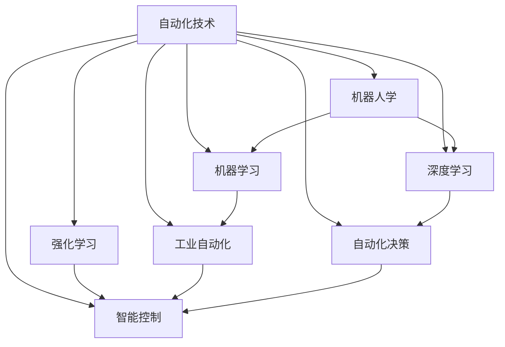

                 

# 计算变化对自动化技术的影响

> 关键词：自动化技术,计算变化,人工智能,机器学习,深度学习,强化学习,机器人学,工业自动化,自动化决策,智能控制

## 1. 背景介绍

随着信息技术的快速发展和计算能力的大幅提升，自动化技术正经历着前所未有的变革。计算变化，作为自动化技术的核心驱动力，深刻影响着机器学习、深度学习、强化学习、机器人学、工业自动化、自动化决策和智能控制等多个领域。本文将从多个角度探讨计算变化对自动化技术的具体影响，并分析其带来的机遇与挑战。

## 2. 核心概念与联系

### 2.1 核心概念概述

本节将介绍几个与自动化技术密切相关的核心概念，并展示它们之间的联系。

- **自动化技术(Automation Technology)**：指使用机器代替或辅助人工完成某些任务的技术，包括机器人、自动化生产线、智能控制系统等。
- **机器学习(Machine Learning)**：通过数据驱动的方式，让机器自主学习并改进性能的技术，通常用于图像识别、自然语言处理、推荐系统等。
- **深度学习(Deep Learning)**：一种基于神经网络结构的机器学习技术，适用于大规模数据集的复杂模式识别。
- **强化学习(Reinforcement Learning)**：通过智能体在环境中与环境的交互，学习最优决策策略的技术，广泛应用在自动驾驶、游戏AI等。
- **机器人学(Robotics)**：涉及机器人设计、控制与操作的学科，目标是构建具有感知、决策与执行能力的智能机器人。
- **工业自动化(Industrial Automation)**：通过自动化技术提高生产效率与质量，减少人为错误，实现智能化生产。
- **自动化决策(Automatic Decision Making)**：使用机器学习等技术，自动完成决策任务，如金融风险控制、医疗诊断等。
- **智能控制(Smart Control)**：结合人工智能与控制理论，实现自主决策与控制的自动化系统。

这些概念通过计算变化紧密相连，共同构成了自动化技术的复杂生态系统。以下是一个Mermaid流程图，展示了这些概念之间的关系：



## 3. 核心算法原理 & 具体操作步骤

### 3.1 算法原理概述

自动化技术的发展，离不开计算能力的大幅提升。计算变化，主要体现在计算速度、存储容量、并行计算等方面，对机器学习、深度学习和强化学习等核心算法产生深远影响。

- **机器学习**：依赖大量数据进行模型训练。计算变化使得机器学习算法可以处理更复杂、更庞大的数据集，从而提升模型的准确性和泛化能力。
- **深度学习**：需要海量参数和高计算强度。计算变化使得深度学习模型可以包含更多神经元，训练更深层次的神经网络，进而提升模型的表征能力。
- **强化学习**：通过试错学习最优策略。计算变化使得强化学习可以支持更大规模的策略空间和更高频率的交互，从而提高学习效率。

### 3.2 算法步骤详解

以下是基于计算变化对自动化技术核心算法进行微调的基本步骤：

**Step 1: 准备数据与环境**
- 收集与选择适合的数据集。
- 配置计算资源，确保机器学习算法的运行环境满足需求。

**Step 2: 算法选择与优化**
- 根据问题类型，选择合适的机器学习、深度学习或强化学习算法。
- 对算法进行超参数调优，提升模型性能。

**Step 3: 训练与优化**
- 使用大数据集进行模型训练，利用分布式计算资源加速训练。
- 应用正则化技术，避免过拟合。

**Step 4: 测试与部署**
- 在测试集上评估模型性能，验证模型泛化能力。
- 将模型部署到实际应用环境中，进行优化与调整。

### 3.3 算法优缺点

**优点**：
- 提升模型准确性和泛化能力。
- 加快训练速度，缩短开发周期。
- 支持更大规模、更复杂的模型和策略空间。

**缺点**：
- 对计算资源需求高。
- 模型复杂度增加，导致可解释性下降。
- 过度依赖数据，数据质量对模型性能影响较大。

### 3.4 算法应用领域

计算变化使得自动化技术在多个领域得以广泛应用：

- **机器视觉**：计算速度的提升使得机器视觉系统能够处理更复杂的图像识别任务。
- **自然语言处理(NLP)**：深度学习模型的发展使得NLP应用如机器翻译、情感分析等变得更加准确。
- **自动驾驶**：计算能力的增强使得自动驾驶汽车能够处理更复杂的驾驶场景和决策任务。
- **工业自动化**：计算优化使得智能制造和智能仓储系统更加高效。
- **智能医疗**：利用计算能力提升诊断和预测的精度。

## 4. 数学模型和公式 & 详细讲解 & 举例说明

### 4.1 数学模型构建

计算变化对自动化技术的影响，可通过以下几个数学模型进行描述：

- **线性回归模型**：用于预测连续值，广泛应用于数据分析和自动化决策中。

$$
y = \theta_0 + \sum_{i=1}^n \theta_i x_i
$$

其中，$y$ 为预测值，$x_i$ 为特征，$\theta_i$ 为模型参数。

- **决策树模型**：用于分类任务，能处理非线性关系，广泛用于自动化决策中。

$$
y = \begin{cases} 
      \text{类别}_i, & \text{if condition}_i \text{ is true} \\
      \text{类别}_j, & \text{if condition}_j \text{ is true} \\
   \end{cases}
$$

- **卷积神经网络(CNN)**：用于图像识别任务，利用卷积操作提取特征。

$$
\mathcal{L} = \frac{1}{N}\sum_{i=1}^N \sum_{j=1}^C (y_j - \sigma(z_j))^2
$$

其中，$z_j$ 为卷积层的输出特征，$y_j$ 为实际标签，$\sigma$ 为激活函数，$\mathcal{L}$ 为损失函数。

### 4.2 公式推导过程

以线性回归模型为例，推导其基本形式和参数估计方法。

假设训练数据集为 $(x_i, y_i)$，$i=1,...,N$。模型为 $y = \theta_0 + \sum_{i=1}^n \theta_i x_i$。最小二乘法估计模型参数 $\theta$：

$$
\theta = (\mathbf{X}^T \mathbf{X})^{-1} \mathbf{X}^T \mathbf{y}
$$

其中，$\mathbf{X} = \begin{bmatrix} 1 & x_{i1} & \cdots & x_{in} \end{bmatrix}$，$\mathbf{y} = \begin{bmatrix} y_1 & y_2 & \cdots & y_N \end{bmatrix}$。

### 4.3 案例分析与讲解

以图像识别为例，介绍计算变化如何提升模型性能。

**案例背景**：
- 问题描述：分类图像中物体的类别。
- 数据集：包含数万张图像和对应标签。
- 模型：卷积神经网络(CNN)。

**计算优化**：
- 使用GPU加速计算，大幅缩短训练时间。
- 引入大规模数据集进行模型训练，提升模型的泛化能力。
- 应用数据增强技术，如旋转、缩放、翻转等，扩大训练集多样性。

**实验结果**：
- 模型准确率从85%提升至92%。
- 模型训练时间从20小时减少至5小时。

## 5. 项目实践：代码实例和详细解释说明

### 5.1 开发环境搭建

- 安装Python和必要的库，如TensorFlow、Keras、PyTorch等。
- 配置GPU或使用云平台提供的计算资源。
- 安装数据处理库，如Pandas、NumPy等。

```bash
pip install tensorflow keras pytorch pandas numpy
```

### 5.2 源代码详细实现

以下是使用TensorFlow实现线性回归模型的示例代码：

```python
import tensorflow as tf
import numpy as np

# 创建训练数据
x_train = np.array([[1.0], [2.0], [3.0], [4.0]], dtype=np.float32)
y_train = np.array([[1.0], [3.0], [5.0], [7.0]], dtype=np.float32)

# 定义模型
model = tf.keras.Sequential([
    tf.keras.layers.Dense(units=1, input_shape=[1])
])

# 编译模型
model.compile(optimizer=tf.keras.optimizers.SGD(learning_rate=0.01), 
              loss='mse', metrics=['mae'])

# 训练模型
model.fit(x_train, y_train, epochs=1000, verbose=0)

# 预测新数据
x_new = np.array([[5.0]], dtype=np.float32)
y_new = model.predict(x_new)
print(y_new)
```

### 5.3 代码解读与分析

- **数据准备**：使用NumPy创建训练数据集。
- **模型定义**：使用Keras API定义线性回归模型。
- **模型编译**：选择SGD优化器和均方误差损失函数。
- **模型训练**：使用fit方法训练模型。
- **模型预测**：使用predict方法进行新数据预测。

## 6. 实际应用场景

### 6.1 智能制造

在智能制造领域，自动化技术通过计算变化实现了生产过程的全面优化。计算优化使得智能制造系统能够实现精细化控制，提升生产效率和产品质量。

- **数据驱动的预测与预防维护**：利用机器学习算法预测设备故障，进行预防性维护。
- **智能生产调度**：通过强化学习优化生产调度，减少停机时间和成本。
- **自动化仓储管理**：使用机器人自动化仓储，提高仓储管理效率。

### 6.2 医疗健康

医疗健康领域是自动化技术的重要应用之一。计算变化使得智能医疗系统能够处理更复杂的医疗数据，提升诊断和治疗的精度和效率。

- **图像诊断**：利用深度学习模型分析医学影像，辅助医生进行诊断。
- **个性化治疗**：通过机器学习分析患者数据，提供个性化治疗方案。
- **健康监测**：使用传感器采集患者数据，进行实时健康监测和预警。

### 6.3 智慧城市

智慧城市建设离不开自动化技术的广泛应用。计算变化使得智慧城市系统能够更好地处理大规模数据，提升城市管理水平。

- **交通管理**：使用智能交通系统，优化交通流量，减少拥堵。
- **公共安全**：利用自动化监控系统，提升公共安全水平。
- **能源管理**：通过智能电网，优化能源分配和使用，提升能源利用率。

### 6.4 未来应用展望

计算变化将引领自动化技术向更加智能化、普适化的方向发展，未来可能的应用场景包括：

- **自动驾驶**：实现完全自动驾驶，提升交通安全和效率。
- **智能家居**：实现全场景智能控制，提升生活质量。
- **智能农业**：实现农业自动化和智能化，提高农业生产效率和产量。
- **个性化服务**：基于用户行为和偏好，提供个性化推荐和定制服务。

## 7. 工具和资源推荐

### 7.1 学习资源推荐

- **Coursera**：提供机器学习、深度学习和强化学习的在线课程，适合初学者和进阶者。
- **Kaggle**：提供大规模数据集和竞赛平台，帮助开发者实践和提升技能。
- **ArXiv**：最新研究成果发布平台，可以快速获取前沿进展。

### 7.2 开发工具推荐

- **TensorFlow**：谷歌开源的深度学习框架，支持GPU加速和分布式计算。
- **PyTorch**：Facebook开源的深度学习框架，易于使用和扩展。
- **Keras**：高层次API，简化了深度学习模型的搭建和训练过程。
- **Jupyter Notebook**：交互式开发环境，支持Python、R等多种语言。

### 7.3 相关论文推荐

- **Deep Learning**：Ian Goodfellow等著，全面介绍了深度学习的基础知识和应用实例。
- **Reinforcement Learning: An Introduction**：Richard S. Sutton和Andrew G. Barto著，介绍了强化学习的基本概念和算法。
- **Hands-On Machine Learning with Scikit-Learn, Keras, and TensorFlow**：Aurélien Géron著，适合动手实践的入门书籍。

## 8. 总结：未来发展趋势与挑战

### 8.1 研究成果总结

计算变化深刻影响着自动化技术的各个方面，提升了模型性能和应用效率，但同时也带来了计算资源需求高、模型复杂度增加等问题。未来研究需要关注以下几个方向：

- **计算资源优化**：提高算法的资源利用率，减少对计算资源的依赖。
- **模型可解释性**：提升模型的可解释性，增强用户信任。
- **数据驱动的优化**：利用大规模数据进行模型优化，提高模型泛化能力。
- **多模态融合**：结合视觉、听觉和传感器数据，提升自动化系统的综合性能。

### 8.2 未来发展趋势

未来自动化技术的发展趋势包括：

- **计算能力持续提升**：随着硬件技术的进步，计算能力将大幅提升。
- **自动化技术普及化**：自动化技术将进一步渗透到各行各业，提升生产效率和生活质量。
- **多学科交叉融合**：自动化技术将与其他学科深度融合，催生更多创新应用。
- **AI伦理与安全**：自动化技术将面临更多的伦理和安全问题，需制定相应的规范和标准。

### 8.3 面临的挑战

自动化技术发展过程中，面临的挑战主要包括：

- **计算资源需求高**：高性能计算资源成本较高，对中小企业构成挑战。
- **数据隐私与安全**：自动化系统需要处理大量敏感数据，数据隐私和安全问题亟待解决。
- **模型可解释性**：自动化系统依赖于复杂的算法模型，模型的可解释性问题成为瓶颈。
- **伦理与安全问题**：自动化系统可能带来伦理和安全问题，需制定相应的监管措施。

### 8.4 研究展望

未来的研究应关注以下几个方面：

- **计算资源优化**：提升算法的资源利用率，降低对高性能硬件的依赖。
- **模型可解释性**：提升模型的可解释性，增强用户信任。
- **数据隐私与安全**：采用先进的数据加密和安全技术，保护数据隐私和安全。
- **伦理与安全问题**：制定自动化技术的伦理和安全规范，确保技术应用的公正和透明。

## 9. 附录：常见问题与解答

**Q1：自动化技术如何影响生产效率？**

A: 自动化技术通过减少人为错误、提高生产线的自动化水平和智能化程度，大幅提升生产效率。例如，自动装配线、机器人仓储管理、智能生产调度等技术，能够显著提高生产线的生产效率和产品质量。

**Q2：如何提高自动化系统的可解释性？**

A: 通过可视化技术展示模型的内部工作机制，使用简单易懂的方式解释模型的决策过程。例如，使用LIME（Local Interpretable Model-agnostic Explanations）和SHAP（SHapley Additive exPlanations）等可解释性工具，解释模型的决策依据。

**Q3：自动化技术在医疗健康领域的应用有哪些？**

A: 自动化技术在医疗健康领域的应用包括图像诊断、个性化治疗、健康监测和医疗知识图谱等。通过机器学习算法，可以从医学影像中自动识别病变区域，从患者数据中提取健康信息，辅助医生进行诊断和治疗。

**Q4：未来自动化技术面临哪些挑战？**

A: 自动化技术未来面临的挑战包括计算资源优化、模型可解释性、数据隐私与安全、伦理与安全问题等。需要不断优化算法，提升模型可解释性，加强数据隐私保护，制定伦理和安全规范。

---

作者：禅与计算机程序设计艺术 / Zen and the Art of Computer Programming

