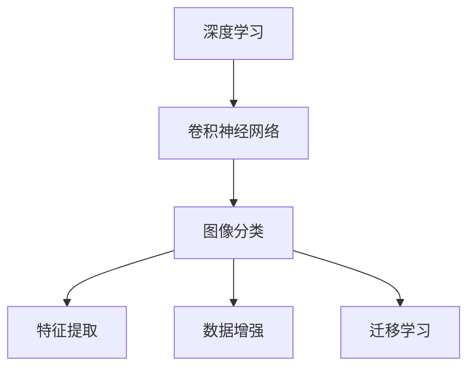

                 

## 1. 背景介绍

计算机视觉（Computer Vision, CV）是人工智能（AI）和机器学习（ML）领域的一个重要分支，旨在使计算机能够理解和解释图像和视频数据。随着深度学习技术的兴起，计算机视觉在自动驾驶、医疗影像分析、安防监控、智能家居等多个领域得到了广泛应用。

### 1.1 问题由来
计算机视觉技术的发展经历了多个阶段：从早期的基于手工特征提取的方法，到基于机器学习的特征学习和表示学习，再到目前以深度学习为核心的端到端学习方法。尽管如此，计算机视觉仍面临诸如图像噪声、光照变化、遮挡等复杂场景的挑战。

基于深度学习的方法能够自动从原始像素中学习出高级的特征表示，但模型规模大、训练成本高、计算资源消耗大等问题，限制了其在实时应用中的推广。近年来，随着硬件算力的提升和模型压缩技术的进步，深度学习方法在计算机视觉中的应用逐渐成熟。

### 1.2 问题核心关键点
本文将从深度学习、卷积神经网络（CNN）和图像分类三个方面深入探讨计算机视觉的原理。通过理解这些核心概念，我们能够更好地把握计算机视觉的工作原理和优化方向。

## 2. 核心概念与联系

### 2.1 核心概念概述

为更好地理解计算机视觉的原理，本节将介绍几个密切相关的核心概念：

- 深度学习（Deep Learning）：基于多层神经网络的学习方法，能够自动提取和抽象出输入数据的高级特征表示。
- 卷积神经网络（Convolutional Neural Network, CNN）：一种特殊的神经网络结构，特别适合处理具有网格结构的数据（如图像）。
- 图像分类（Image Classification）：将输入图像分为预设的若干类别之一的任务。图像分类是计算机视觉中最基本的任务之一。
- 特征提取（Feature Extraction）：从输入图像中提取关键特征的过程，是图像分类的基础。
- 数据增强（Data Augmentation）：通过对原始数据进行变换，生成新的训练数据，提高模型泛化能力。
- 迁移学习（Transfer Learning）：在预训练模型上微调，使其适应特定任务。

这些核心概念之间的逻辑关系可以通过以下Mermaid流程图来展示：



这个流程图展示了大模型微调的各个概念之间的联系：

1. 深度学习是计算机视觉的基础，提供了强大的特征提取和表示学习能力。
2. 卷积神经网络作为深度学习的核心结构，特别适合图像处理任务。
3. 图像分类是计算机视觉的最基本任务，可以进一步抽象为特征提取。
4. 数据增强通过引入更多的数据，提升模型的泛化能力。
5. 迁移学习将预训练模型应用于特定任务，进一步优化模型性能。

## 3. 核心算法原理 & 具体操作步骤
### 3.1 算法原理概述

计算机视觉中的图像分类任务可以形式化地定义为：给定一个输入图像 $x$，通过训练好的模型 $f$ 将其分类为预设的若干类别之一 $y$，即 $y=f(x)$。

基于卷积神经网络（CNN）的图像分类任务，通常采用监督学习的方式，即利用标注数据集 $\mathcal{D} = \{(x_i, y_i)\}_{i=1}^N$，通过反向传播算法，最小化损失函数 $\mathcal{L}$，获得最优模型参数 $\theta$：

$$
\theta^* = \mathop{\arg\min}_{\theta} \mathcal{L}(f_{\theta}, \mathcal{D})
$$

其中 $f_{\theta}$ 表示以 $\theta$ 为参数的 CNN 模型，$\mathcal{L}$ 为交叉熵损失函数。

### 3.2 算法步骤详解

计算机视觉中的图像分类任务通常涉及以下步骤：

**Step 1: 准备数据集**
- 收集和标注大量图像数据，构建训练集和验证集。
- 数据增强技术，如随机裁剪、翻转、旋转、颜色变换等，生成更多的训练样本。

**Step 2: 选择模型结构**
- 选择合适的 CNN 模型结构，如 AlexNet、VGG、ResNet、Inception 等。
- 根据任务需求，调整模型的深度、宽度、激活函数等超参数。

**Step 3: 训练模型**
- 使用随机梯度下降（SGD）或 Adam 优化算法，设定合适的学习率和迭代轮数。
- 在训练集上进行前向传播和反向传播，计算损失函数 $\mathcal{L}$。
- 在验证集上进行模型性能评估，防止过拟合。

**Step 4: 测试和部署**
- 在测试集上评估模型性能，对比训练前后的准确率、召回率等指标。
- 使用训练好的模型进行实际图像分类任务，部署到生产环境中。

### 3.3 算法优缺点

深度学习和卷积神经网络在图像分类任务中具有以下优点：

1. 强大的特征提取能力：能够自动学习到图像中的高级特征，无需手工提取特征。
2. 高效的并行计算：通过GPU加速，能够快速处理大量图像数据。
3. 较好的泛化能力：通过数据增强，模型能够在各种噪声和变化下保持稳定。
4. 鲁棒性：对于不同场景的图像分类任务，模型具有较好的泛化能力。

同时，这些方法也存在以下缺点：

1. 模型规模大：大型卷积神经网络需要大量的参数，计算资源消耗大。
2. 训练时间长：深度学习模型训练时间较长，需要大量的标注数据和计算资源。
3. 可解释性差：深度学习模型通常被视为“黑盒”，难以解释其内部决策过程。

### 3.4 算法应用领域

计算机视觉中的图像分类技术已经在诸多领域得到广泛应用，例如：

- 自动驾驶：通过识别道路标志、行人、车辆等，提高自动驾驶系统的安全性和准确性。
- 医疗影像分析：自动识别影像中的病变区域，辅助医生进行诊断。
- 安防监控：通过识别入侵者、异常行为等，提高安防系统的自动化水平。
- 智能家居：通过识别人脸、物品等，实现家庭设备的自动化控制。
- 零售购物：通过识别商品标签、顾客行为等，提升零售商店的个性化推荐和营销效果。

除了这些典型应用外，计算机视觉技术还在工业检测、农业监测、体育比赛分析等诸多领域得到了创新性的应用，为各行各业带来了数字化、智能化的变革。

## 4. 数学模型和公式 & 详细讲解  
### 4.1 数学模型构建

基于卷积神经网络的图像分类任务，其数学模型通常可以表示为：

$$
\mathcal{L} = -\frac{1}{N}\sum_{i=1}^N \sum_{c=1}^C y_{i,c} \log f_{\theta}(x_i, c)
$$

其中 $N$ 表示训练样本数，$C$ 表示类别数。$y_{i,c}$ 表示样本 $i$ 属于类别 $c$ 的概率，$f_{\theta}(x_i, c)$ 表示模型在输入图像 $x_i$ 上属于类别 $c$ 的输出概率。

### 4.2 公式推导过程

以最简单的全连接神经网络为例，推导其分类损失函数。

假设输入样本 $x$ 有 $m$ 个特征，输出层有 $n$ 个神经元，分类任务有 $k$ 个类别。神经网络的输出可以表示为：

$$
z_j = w_j^T x + b_j
$$

其中 $w_j$ 和 $b_j$ 分别表示第 $j$ 个神经元的权重和偏置。激活函数通常采用 Sigmoid 函数，输出概率为：

$$
p_j = \sigma(z_j)
$$

分类任务通常采用交叉熵损失函数：

$$
\mathcal{L} = -\frac{1}{N}\sum_{i=1}^N \sum_{j=1}^k y_{i,j} \log p_j
$$

其中 $y_{i,j}$ 表示样本 $i$ 属于类别 $j$ 的标签。将输出层的概率 $p_j$ 表示为 $S$ 个隐藏层的概率 $h_s$ 的函数，并通过反向传播算法求解模型参数：

$$
h_s = \sigma(z_s) = \sigma(W_s h_{s-1} + b_s)
$$

$$
p_j = \sigma(z_j) = \sigma(W_j h_s + b_j)
$$

其中 $W_s$ 和 $b_s$ 表示第 $s$ 层的权重和偏置。

### 4.3 案例分析与讲解

以下我们以手写数字识别为例，给出使用TensorFlow实现卷积神经网络的代码实现。

首先，定义数据处理函数：

```python
import tensorflow as tf
from tensorflow.keras.datasets import mnist

def load_data():
    (x_train, y_train), (x_test, y_test) = mnist.load_data()
    x_train = x_train.reshape(-1, 28, 28, 1).astype('float32') / 255.0
    x_test = x_test.reshape(-1, 28, 28, 1).astype('float32') / 255.0
    y_train = tf.keras.utils.to_categorical(y_train, 10)
    y_test = tf.keras.utils.to_categorical(y_test, 10)
    return x_train, y_train, x_test, y_test

train_images, train_labels, test_images, test_labels = load_data()
```

然后，定义卷积神经网络模型：

```python
model = tf.keras.Sequential([
    tf.keras.layers.Conv2D(32, (3, 3), activation='relu', input_shape=(28, 28, 1)),
    tf.keras.layers.MaxPooling2D((2, 2)),
    tf.keras.layers.Conv2D(64, (3, 3), activation='relu'),
    tf.keras.layers.MaxPooling2D((2, 2)),
    tf.keras.layers.Flatten(),
    tf.keras.layers.Dense(64, activation='relu'),
    tf.keras.layers.Dense(10, activation='softmax')
])
```

接着，定义损失函数和优化器：

```python
model.compile(optimizer=tf.keras.optimizers.Adam(learning_rate=0.001),
              loss='categorical_crossentropy',
              metrics=['accuracy'])
```

最后，训练和评估模型：

```python
history = model.fit(train_images, train_labels, epochs=10, validation_data=(test_images, test_labels))

# 测试集上评估模型性能
test_loss, test_acc = model.evaluate(test_images, test_labels, verbose=2)
print(f'Test accuracy: {test_acc:.4f}')
```

以上就是使用TensorFlow实现手写数字识别任务卷积神经网络的完整代码实现。可以看到，通过TensorFlow的高级API，我们可以用相对简洁的代码完成卷积神经网络的构建和训练。

## 5. 项目实践：代码实例和详细解释说明
### 5.1 开发环境搭建

在进行计算机视觉项目开发前，我们需要准备好开发环境。以下是使用Python进行TensorFlow开发的环境配置流程：

1. 安装Anaconda：从官网下载并安装Anaconda，用于创建独立的Python环境。

2. 创建并激活虚拟环境：
```bash
conda create -n cv-env python=3.8 
conda activate cv-env
```

3. 安装TensorFlow：根据CUDA版本，从官网获取对应的安装命令。例如：
```bash
pip install tensorflow==2.8
```

4. 安装其他必要工具包：
```bash
pip install numpy pandas scikit-image matplotlib tqdm jupyter notebook ipython
```

完成上述步骤后，即可在`cv-env`环境中开始计算机视觉项目开发。

### 5.2 源代码详细实现

下面我们以图像分类任务为例，给出使用TensorFlow实现卷积神经网络的代码实现。

首先，定义数据处理函数：

```python
import tensorflow as tf
from tensorflow.keras.datasets import cifar10
from tensorflow.keras.preprocessing.image import ImageDataGenerator

def load_data():
    (x_train, y_train), (x_test, y_test) = cifar10.load_data()
    x_train = x_train / 255.0
    x_test = x_test / 255.0
    return x_train, y_train, x_test, y_test
```

然后，定义卷积神经网络模型：

```python
model = tf.keras.Sequential([
    tf.keras.layers.Conv2D(32, (3, 3), activation='relu', input_shape=(32, 32, 3)),
    tf.keras.layers.MaxPooling2D((2, 2)),
    tf.keras.layers.Conv2D(64, (3, 3), activation='relu'),
    tf.keras.layers.MaxPooling2D((2, 2)),
    tf.keras.layers.Conv2D(128, (3, 3), activation='relu'),
    tf.keras.layers.MaxPooling2D((2, 2)),
    tf.keras.layers.Flatten(),
    tf.keras.layers.Dense(512, activation='relu'),
    tf.keras.layers.Dense(10, activation='softmax')
])
```

接着，定义损失函数和优化器：

```python
model.compile(optimizer=tf.keras.optimizers.Adam(learning_rate=0.001),
              loss='categorical_crossentropy',
              metrics=['accuracy'])
```

最后，训练和评估模型：

```python
history = model.fit(train_images, train_labels, epochs=10, validation_data=(test_images, test_labels))

# 测试集上评估模型性能
test_loss, test_acc = model.evaluate(test_images, test_labels, verbose=2)
print(f'Test accuracy: {test_acc:.4f}')
```

以上就是使用TensorFlow实现图像分类任务卷积神经网络的完整代码实现。可以看到，通过TensorFlow的高级API，我们可以用相对简洁的代码完成卷积神经网络的构建和训练。

### 5.3 代码解读与分析

让我们再详细解读一下关键代码的实现细节：

**load_data函数**：
- 使用CIFAR-10数据集，加载训练集和测试集，并进行预处理，将像素值归一化到 [0, 1] 之间。

**定义模型**：
- 使用 `tf.keras.Sequential` 定义卷积神经网络模型，从输入层到输出层依次包含卷积层、池化层、全连接层等。
- 卷积层使用不同大小和步长的卷积核，提取不同尺度下的特征。
- 池化层使用最大池化操作，减小特征图的空间尺寸，同时保留重要特征。
- 全连接层将特征图展平，通过多个全连接层进行特征融合，最终输出分类结果。

**训练和评估模型**：
- 使用 `model.fit` 进行模型训练，通过数据增强技术生成更多的训练样本，防止过拟合。
- 使用 `model.evaluate` 在测试集上评估模型性能，计算测试集的损失和准确率。

这些代码的实现使得计算机视觉任务变得简单高效，无需过多关注底层的计算细节。开发者可以将更多精力放在数据预处理和模型改进等高层逻辑上。

## 6. 实际应用场景
### 6.1 智能安防系统

基于卷积神经网络的计算机视觉技术，可以广泛应用于智能安防系统的构建。传统的安防系统通常需要大量人力监控，成本高、效率低、容易疲劳。而使用计算机视觉技术，可以实现实时监控、目标检测和行为分析，显著提升安防系统的智能化水平。

在技术实现上，可以收集并标注大量的公共视频数据，构建训练集和验证集，将任务描述和示例图像作为微调数据，在此基础上对预训练卷积神经网络进行微调。微调后的模型可以识别出人群、车辆、异常行为等，实现自动报警和取证。同时，可以通过多摄像头协同，实现人脸识别、物品追踪等高级功能，提高安防系统的智能化和自动化水平。

### 6.2 医疗影像诊断

计算机视觉中的图像分类技术可以应用于医疗影像的自动化诊断。传统的医学影像诊断需要耗费大量医生的时间和精力，且误诊率较高。而使用计算机视觉技术，可以实现快速准确的影像分类和病变识别，辅助医生进行诊断。

在技术实现上，可以收集并标注大量的医学影像数据，构建训练集和验证集，使用微调后的卷积神经网络对影像进行分类和病变识别。系统可以实时接收病人的影像数据，自动进行分类和病变识别，辅助医生快速诊断疾病。同时，可以通过结合知识图谱和逻辑规则，进一步提高诊断的准确性和解释性。

### 6.3 智能零售

计算机视觉中的图像分类技术可以应用于智能零售系统的构建。传统的零售系统通常依赖于人工盘点，效率低、误差率高。而使用计算机视觉技术，可以实现对商品标签、顾客行为等进行自动分类和识别，提升零售商店的智能化水平。

在技术实现上，可以收集并标注大量的零售商品和顾客行为数据，构建训练集和验证集，使用微调后的卷积神经网络对图像进行分类和识别。系统可以实时监测货架商品数量、顾客行为等，自动生成购物清单、个性化推荐等，提升零售商店的运营效率和用户体验。

### 6.4 未来应用展望

随着计算机视觉技术的不断发展，未来的应用场景将更加广泛和深入，例如：

- 工业检测：通过识别和分类工业生产中的缺陷，提升产品质量和生产效率。
- 农业监测：通过识别和分类农业作物、病虫害等，辅助农民进行科学种植和管理。
- 体育比赛分析：通过识别和分类体育比赛中的运动员和动作，生成比赛数据和分析报告。
- 智慧城市：通过识别和分类城市环境中的各种对象，实现智慧交通、智慧安防等功能。
- 军事应用：通过识别和分类战场环境中的各种目标，辅助决策和指挥。

计算机视觉技术的应用前景广阔，未来将继续推动各行各业的数字化、智能化转型升级。相信随着技术的不断进步，计算机视觉将在更广阔的领域展现其强大的价值。

## 7. 工具和资源推荐
### 7.1 学习资源推荐

为了帮助开发者系统掌握计算机视觉的理论基础和实践技巧，这里推荐一些优质的学习资源：

1. 《深度学习》系列书籍：由深度学习领域的权威专家撰写，系统介绍了深度学习的基本原理和应用方法。
2. 《计算机视觉：模型、学习和推理》书籍：涵盖了计算机视觉领域的经典模型和算法，适合深入学习计算机视觉的技术细节。
3. 斯坦福大学 CS231n 课程：斯坦福大学开设的计算机视觉经典课程，有Lecture视频和配套作业，是学习计算机视觉的不二之选。
4. Udacity 深度学习纳米学位：涵盖深度学习、计算机视觉、自然语言处理等领域的综合课程，适合系统学习计算机视觉的理论和实践。
5. OpenCV官方文档：OpenCV 作为计算机视觉领域的开源库，提供了丰富的教程和示例代码，适合动手实践。

通过对这些资源的学习实践，相信你一定能够快速掌握计算机视觉的精髓，并用于解决实际的计算机视觉问题。

### 7.2 开发工具推荐

高效的开发离不开优秀的工具支持。以下是几款用于计算机视觉开发常用的工具：

1. TensorFlow：由Google主导开发的开源深度学习框架，支持卷积神经网络等多种模型结构，适用于各种规模的项目。
2. PyTorch：Facebook开源的深度学习框架，具有灵活的动态图机制，适合研究和实验。
3. Keras：高层次的深度学习API，易于上手，适合快速构建和测试模型。
4. OpenCV：计算机视觉领域的开源库，提供图像处理、特征提取等功能，适合各种图像处理任务。
5. Jupyter Notebook：免费的交互式编程环境，适合编写和执行Python代码，适合快速迭代和调试。

合理利用这些工具，可以显著提升计算机视觉任务的开发效率，加快创新迭代的步伐。

### 7.3 相关论文推荐

计算机视觉技术的发展离不开学界的持续研究。以下是几篇奠基性的相关论文，推荐阅读：

1. ImageNet Classification with Deep Convolutional Neural Networks：提出了卷积神经网络在图像分类任务上的优越性，并开源了ImageNet数据集。
2. AlexNet：提出了AlexNet卷积神经网络，在ImageNet分类任务上取得了突破性成绩。
3. GoogLeNet：提出了Inception卷积神经网络，实现了参数和计算的高效利用。
4. VGGNet：提出了VGG卷积神经网络，通过增加网络深度和宽度，提升了图像分类的准确性。
5. ResNet：提出了残差网络，通过跨层连接解决了深度神经网络退化问题。

这些论文代表了大规模卷积神经网络的演进过程，从简单的全连接网络到复杂的残差网络，展示了卷积神经网络在图像分类任务上的强大能力。

## 8. 总结：未来发展趋势与挑战
### 8.1 总结

本文对基于卷积神经网络的图像分类任务进行了全面系统的介绍。首先阐述了深度学习和卷积神经网络在计算机视觉中的原理，明确了图像分类的工作流程。其次，通过TensorFlow和Python代码实现了卷积神经网络的构建和训练，展示了计算机视觉任务的实践细节。最后，探讨了计算机视觉技术在智能安防、医疗影像、智能零售等多个领域的应用前景，展示了计算机视觉技术的广泛价值。

通过本文的系统梳理，可以看到，卷积神经网络在图像分类任务中具有强大的特征提取能力，能够自动学习出图像中的高级特征，适用于多种图像处理任务。得益于深度学习和计算机视觉技术的不断发展，计算机视觉在各行各业得到了广泛应用，提升了系统的智能化和自动化水平。

### 8.2 未来发展趋势

展望未来，计算机视觉技术将呈现以下几个发展趋势：

1. 端到端学习的深入应用：随着预训练技术的发展，越来越多的端到端学习模型被应用于计算机视觉任务中，提升了系统的整体性能。
2. 多模态学习的拓展：计算机视觉技术将越来越多地与语音、文本等模态信息融合，实现跨模态的智能交互。
3. 3D视觉的突破：基于深度学习的三维视觉技术将得到更广泛的应用，提升系统对复杂场景的理解能力。
4. 动态视觉的进展：基于深度学习的动态视觉技术将使计算机视觉系统具有更好的适应性和实时性，满足更多的实时应用需求。
5. 跨模态视觉推理的突破：计算机视觉系统将具有更好的跨模态推理能力，能够理解复杂的情境和逻辑关系。

以上趋势凸显了计算机视觉技术的广阔前景。这些方向的探索发展，必将进一步提升计算机视觉系统的性能和应用范围，为各行各业带来数字化、智能化的变革。

### 8.3 面临的挑战

尽管计算机视觉技术已经取得了瞩目成就，但在迈向更加智能化、普适化应用的过程中，它仍面临诸多挑战：

1. 数据标注成本高：大规模图像数据的标注成本高，难以获取高质量标注数据，成为制约计算机视觉发展的瓶颈。
2. 模型泛化能力不足：卷积神经网络在面对域外数据时，泛化性能往往不足，难以适应复杂多变的现实场景。
3. 计算资源消耗大：大型卷积神经网络需要大量的计算资源，难以在资源受限的环境中推广应用。
4. 可解释性差：卷积神经网络通常被视为“黑盒”，难以解释其内部决策过程，不利于其在关键领域的应用。
5. 伦理和安全问题：计算机视觉系统可能学习到有偏见、有害的信息，传递到下游任务，造成误导性输出，带来安全隐患。

这些挑战使得计算机视觉技术在实际应用中需要不断优化和改进，以实现更高的性能和更广泛的普及。

### 8.4 研究展望

面对计算机视觉技术面临的挑战，未来的研究需要在以下几个方面寻求新的突破：

1. 无监督和半监督学习：摆脱对大规模标注数据的依赖，利用自监督学习、主动学习等方法，实现更高效、更普适的计算机视觉模型。
2. 小样本学习：通过迁移学习、知识蒸馏等技术，实现计算机视觉模型在少样本情况下的高效学习。
3. 跨模态学习：将计算机视觉技术与其他模态信息（如语音、文本等）融合，实现跨模态的智能交互和理解。
4. 动态视觉推理：基于动态视觉技术，提升计算机视觉系统对复杂场景的理解能力，实现更高效、更准确的视觉推理。
5. 可解释性研究：研究计算机视觉模型的可解释性，提供透明的决策过程，增强系统的可信度和安全性。

这些研究方向的探索，必将引领计算机视觉技术迈向更高的台阶，为构建安全、可靠、可解释、可控的智能系统铺平道路。面向未来，计算机视觉技术还需要与其他人工智能技术进行更深入的融合，如知识表示、因果推理、强化学习等，多路径协同发力，共同推动自然语言理解和智能交互系统的进步。只有勇于创新、敢于突破，才能不断拓展计算机视觉的边界，让智能技术更好地造福人类社会。

## 9. 附录：常见问题与解答

**Q1：卷积神经网络在计算机视觉任务中为什么优于全连接神经网络？**

A: 卷积神经网络在计算机视觉任务中优于全连接神经网络，主要有以下几个原因：
1. 参数共享：卷积神经网络的卷积层参数共享，减少了模型参数量，减少了计算量，提升了模型训练速度。
2. 局部连接：卷积神经网络的卷积层采用局部连接，能够提取局部特征，提升了模型的特征表示能力。
3. 平移不变性：卷积神经网络具有平移不变性，对于输入图像的平移、旋转、缩放等变换，模型输出保持不变。

**Q2：卷积神经网络如何避免过拟合？**

A: 卷积神经网络在训练过程中容易发生过拟合，可以通过以下方法进行缓解：
1. 数据增强：通过随机裁剪、旋转、翻转等操作，生成更多的训练样本，增加模型的泛化能力。
2. 正则化：使用L2正则化、Dropout等技术，防止模型过度拟合训练集。
3. 早期停止：在验证集上评估模型性能，当性能不再提升时停止训练，避免过拟合。
4. 批归一化：使用批归一化技术，减少内部协变量移位，提升模型的泛化能力。

**Q3：卷积神经网络在计算机视觉任务中如何设计合适的卷积层和池化层？**

A: 卷积神经网络的设计需要考虑输入图像的尺寸、通道数、特征图尺寸等因素。以下是一些设计原则：
1. 卷积核大小：卷积核大小通常为3x3或5x5，需要根据输入图像的大小和任务需求进行调整。
2. 卷积核数量：卷积核数量通常为16、32、64等，需要根据网络深度和特征表示能力进行调整。
3. 池化操作：池化操作可以减小特征图的空间尺寸，提升模型的泛化能力。常用的池化操作包括最大池化和平均池化。
4. 池化尺寸：池化尺寸通常为2x2或3x3，需要根据输入图像的大小和任务需求进行调整。
5. 池化步长：池化步长通常为1或2，需要根据池化尺寸和特征图尺寸进行调整。

这些设计原则需要根据具体任务进行灵活调整，以达到最优的特征提取和表示效果。

**Q4：卷积神经网络在计算机视觉任务中如何进行迁移学习？**

A: 卷积神经网络的迁移学习可以分为以下步骤：
1. 选择预训练模型：选择一个在大规模数据集上进行预训练的卷积神经网络模型，如VGG、ResNet等。
2. 微调模型：将预训练模型作为初始化参数，使用目标任务的数据集进行微调，调整顶层分类器或解码器，以适应特定任务。
3. 冻结部分层：为了减少微调过程中的过拟合，通常会冻结预训练模型的一部分层，只更新顶层或部分层的参数。
4. 选择合适的学习率：微调过程需要选择合适的学习率，通常比从头训练小1-2个数量级，以避免破坏预训练权重。
5. 正则化技术：使用L2正则化、Dropout等技术，防止模型过度适应小规模训练集。

通过迁移学习，可以有效利用预训练模型的知识，提高模型在特定任务上的性能。同时，迁移学习可以减少数据标注的负担，降低模型的训练成本。

**Q5：卷积神经网络在计算机视觉任务中如何进行数据增强？**

A: 数据增强是提高模型泛化能力的重要手段，通常包括以下方法：
1. 随机裁剪：从原始图像中随机裁剪出不同大小和形状的子图像，增加模型的泛化能力。
2. 随机翻转：对图像进行水平或垂直翻转，增加模型的鲁棒性。
3. 随机旋转：对图像进行随机旋转，增加模型的适应性。
4. 随机缩放：对图像进行随机缩放，增加模型的泛化能力。
5. 随机扭曲：对图像进行随机扭曲，增加模型的鲁棒性。

数据增强方法需要根据具体任务进行灵活调整，以提高模型的泛化能力和鲁棒性。

这些方法使得计算机视觉任务变得简单高效，无需过多关注底层的计算细节。开发者可以将更多精力放在数据预处理和模型改进等高层逻辑上。

