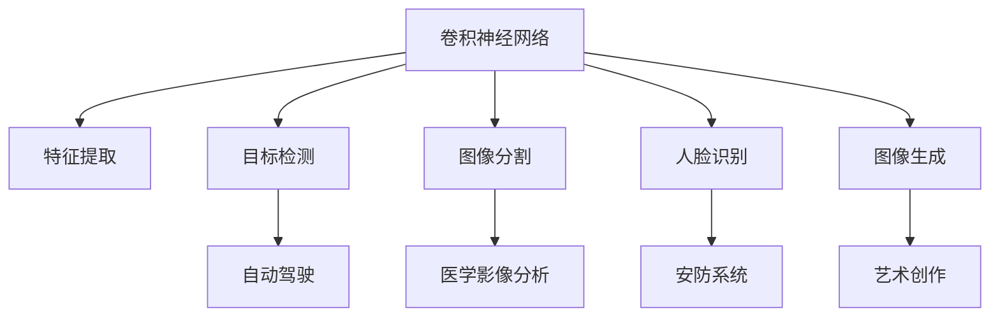

                 

# 计算机视觉CV原理与代码实例讲解

> 关键词：计算机视觉, 卷积神经网络, 深度学习, 图像识别, 目标检测, 图像分割, 代码实例, 深度学习框架, 优化器

## 1. 背景介绍

计算机视觉(Computer Vision, CV)是人工智能(AI)领域的一个分支，旨在使计算机“看”和理解图像及视频内容。CV技术广泛应用于图像识别、目标检测、图像分割、人脸识别、医学影像分析等多个领域，正逐步改变着人们的生活方式。

### 1.1 问题由来

图像识别和处理技术一直是计算机视觉研究的热点方向。早期基于手工特征提取和机器学习的方法，如SIFT、HOG特征提取器，往往需要大量的特征工程设计，难以快速适配新场景。随着深度学习的发展，卷积神经网络(Convolutional Neural Network, CNN)因其强大的特征学习和表示能力，成为了图像处理领域的主流方法。

### 1.2 问题核心关键点

计算机视觉的核心在于如何从原始图像中高效提取有意义的特征，并将这些特征映射到具体任务。常用方法包括：

- **特征提取**：使用卷积层提取图像的局部特征，并通过池化层进行降维和保留重要信息。
- **目标检测**：在图像上标记出物体的位置和类别。
- **图像分割**：将图像划分为多个具有明确语义的区域。
- **人脸识别**：在图像中检测人脸并进行身份识别。
- **图像生成**：通过生成对抗网络(Generative Adversarial Networks, GANs)等方法生成新的图像。

这些任务中的核心技术，如卷积神经网络、目标检测算法、图像分割方法、人脸识别技术等，都是深度学习领域的重点研究方向。

### 1.3 问题研究意义

研究计算机视觉技术，对于推动人工智能在实际应用中的落地，特别是解决图像理解和视觉交互问题，具有重要意义：

1. 提升图像处理效率。深度学习算法能自动学习和提取图像中的高层次特征，减少了对人工特征工程的依赖。
2. 实现自主驾驶、医疗诊断等复杂场景的自动化处理。计算机视觉技术是无人驾驶、医疗影像分析等关键应用的核心支撑。
3. 推动智能监控、智能家居等领域的智能化转型。CV技术不仅能理解图像内容，还能实现与用户的自然交互。
4. 加速计算机视觉产品商业化进程。深度学习模型的高效训练和大规模应用，为商业化落地提供了技术基础。

## 2. 核心概念与联系

### 2.1 核心概念概述

计算机视觉的核心概念包括以下几个方面：

- **卷积神经网络(CNN)**：一种专门用于图像处理的深度神经网络结构，通过卷积层、池化层、全连接层等组件高效提取图像特征。
- **目标检测(如YOLO, Faster R-CNN)**：在图像中标记出物体的位置和类别，用于自动驾驶、工业检测等领域。
- **图像分割(如FCN, U-Net)**：将图像划分为多个具有明确语义的区域，用于医学影像分析、城市规划等领域。
- **人脸识别(如FaceNet)**：通过提取人脸特征，进行身份识别和认证，广泛应用于安防、金融等领域。
- **图像生成(如GANs)**：通过生成对抗网络生成新的图像，用于艺术创作、虚拟现实等领域。

这些概念之间的逻辑关系可以通过以下Mermaid流程图来展示：



这个流程图展示了卷积神经网络在计算机视觉中的核心地位，以及通过特征提取、目标检测、图像分割、人脸识别、图像生成等技术，计算机视觉技术能广泛应用于各个领域。

## 3. 核心算法原理 & 具体操作步骤
### 3.1 算法原理概述

计算机视觉的核心算法原理可以归结为以下几个方面：

- **特征提取**：卷积神经网络通过卷积层和池化层高效提取图像特征。
- **目标检测**：如YOLO、Faster R-CNN等算法通过在图像中检测物体边界框来定位物体。
- **图像分割**：如FCN、U-Net等算法通过像素级别的分类将图像分割为不同区域。
- **人脸识别**：如FaceNet等算法通过学习人脸特征向量来进行身份识别。
- **图像生成**：如GANs等算法通过生成对抗网络生成新的图像。

### 3.2 算法步骤详解

以卷积神经网络特征提取为例，其核心步骤包括：

1. **卷积层(Convolutional Layer)**：使用卷积核对图像进行卷积操作，提取图像的局部特征。

2. **激活函数(Activation Function)**：通过ReLU等激活函数增强非线性表达能力。

3. **池化层(Pooling Layer)**：通过最大池化或平均池化降低特征维度，保留重要信息。

4. **全连接层(Fully Connected Layer)**：将池化后的特征向量输入到全连接层进行分类或回归。

**算法步骤如下**：

1. 收集训练数据集，并进行预处理。
2. 构建卷积神经网络模型，定义卷积层、激活函数、池化层、全连接层等组件。
3. 选择适当的优化器，如Adam、SGD等，设置学习率、批大小等超参数。
4. 使用训练数据集进行前向传播，计算损失函数。
5. 反向传播更新模型参数，重复迭代直到收敛。
6. 在测试集上评估模型性能，对比训练前后的精度提升。

### 3.3 算法优缺点

卷积神经网络在图像处理中的优势包括：

- 自动学习图像特征：卷积层能自动学习到图像中的边缘、纹理、角点等特征。
- 平移不变性：卷积层的卷积核参数可共享，对图像平移、旋转、缩放等变换具备不变性。
- 高效计算：卷积操作可以通过GPU等硬件加速，提升训练和推理效率。

但卷积神经网络也存在以下局限：

- 参数量大：卷积神经网络通常包含大量参数，需要大算力进行训练。
- 过拟合风险：由于网络结构复杂，容易发生过拟合，特别是数据量较少时。
- 难以理解：卷积神经网络的复杂结构使得其决策过程难以解释，难以调试。

### 3.4 算法应用领域

计算机视觉技术广泛应用在多个领域，如：

- **自动驾驶**：通过图像识别技术识别道路、车辆、行人等，实现自动导航。
- **医学影像分析**：使用图像分割技术，将医学影像划分为不同区域，辅助诊断。
- **智能监控**：通过目标检测技术，自动标记出监控画面中的异常行为。
- **智能家居**：使用人脸识别技术，实现人脸解锁、自动灯光控制等智能功能。
- **艺术创作**：通过图像生成技术，生成逼真的艺术作品。

这些应用场景展示了计算机视觉技术的强大能力，为人工智能的广泛应用奠定了坚实基础。

## 4. 数学模型和公式 & 详细讲解 & 举例说明

### 4.1 数学模型构建

卷积神经网络的核心数学模型为卷积运算。设输入为图像$X \in \mathbb{R}^{H \times W \times C}$，输出为特征图$Y \in \mathbb{R}^{H' \times W' \times C'}$。则卷积运算可以表示为：

$$
Y_{h,w,c'} = \sum_{h'=-k}^{k} \sum_{w'=-k}^{k} \sum_{c=1}^{C} X_{h+h',w+w',c} \cdot W_{c',c} + b_{c'}
$$

其中$X_{h,w,c}$表示输入图像的第$(h,w)$位置的$c$通道像素，$W_{c',c}$表示卷积核的第$c'$通道的第$c$通道权重，$b_{c'}$表示偏置项，$k$表示卷积核的半径。

### 4.2 公式推导过程

卷积操作的推导过程如下：

1. 定义卷积核$W$，其形状为$k \times k \times C$。

2. 将输入图像$X$展开成$H \times W \times C$维的向量。

3. 对每个输出位置的$(h,w,c')$，计算与卷积核$W$的卷积结果。

4. 对所有输出位置重复步骤3，得到最终的特征图$Y$。

### 4.3 案例分析与讲解

以图像分类为例，我们可以使用卷积神经网络对CIFAR-10数据集进行分类。构建一个简单的3层卷积神经网络模型，包含卷积层、激活函数、池化层、全连接层等组件。

使用TensorFlow实现代码如下：

```python
import tensorflow as tf

# 构建卷积神经网络模型
model = tf.keras.models.Sequential([
    tf.keras.layers.Conv2D(32, (3, 3), activation='relu', input_shape=(32, 32, 3)),
    tf.keras.layers.MaxPooling2D((2, 2)),
    tf.keras.layers.Conv2D(64, (3, 3), activation='relu'),
    tf.keras.layers.MaxPooling2D((2, 2)),
    tf.keras.layers.Conv2D(64, (3, 3), activation='relu'),
    tf.keras.layers.Flatten(),
    tf.keras.layers.Dense(64, activation='relu'),
    tf.keras.layers.Dense(10, activation='softmax')
])

# 编译模型
model.compile(optimizer='adam', loss='categorical_crossentropy', metrics=['accuracy'])

# 训练模型
model.fit(train_images, train_labels, epochs=10, validation_data=(val_images, val_labels))

# 评估模型
test_loss, test_acc = model.evaluate(test_images, test_labels)
print(f'Test accuracy: {test_acc}')
```

代码解释：

1. 使用Sequential模型定义卷积神经网络，包含3个卷积层、3个池化层、2个全连接层。
2. 使用adam优化器进行优化，交叉熵损失函数。
3. 在训练集上进行模型训练，验证集上进行模型验证。
4. 在测试集上评估模型性能。

## 5. 项目实践：代码实例和详细解释说明
### 5.1 开发环境搭建

在进行计算机视觉项目开发前，我们需要准备好开发环境。以下是使用Python进行TensorFlow开发的环境配置流程：

1. 安装Anaconda：从官网下载并安装Anaconda，用于创建独立的Python环境。

2. 创建并激活虚拟环境：
```bash
conda create -n tf-env python=3.8 
conda activate tf-env
```

3. 安装TensorFlow：根据CUDA版本，从官网获取对应的安装命令。例如：
```bash
pip install tensorflow
```

4. 安装Keras：
```bash
pip install keras
```

5. 安装各类工具包：
```bash
pip install numpy pandas scikit-learn matplotlib tqdm jupyter notebook ipython
```

完成上述步骤后，即可在`tf-env`环境中开始计算机视觉项目开发。

### 5.2 源代码详细实现

这里我们以手写数字识别为例，使用TensorFlow实现手写数字识别任务。手写数字识别是计算机视觉中最经典的图像分类任务之一。

首先，准备MNIST数据集：

```python
from tensorflow.keras.datasets import mnist

# 加载MNIST数据集
(train_images, train_labels), (test_images, test_labels) = mnist.load_data()

# 预处理数据
train_images = train_images.reshape(train_images.shape[0], 28, 28, 1).astype('float32') / 255.0
test_images = test_images.reshape(test_images.shape[0], 28, 28, 1).astype('float32') / 255.0

# 将标签转换为独热编码
train_labels = tf.keras.utils.to_categorical(train_labels, 10)
test_labels = tf.keras.utils.to_categorical(test_labels, 10)
```

然后，定义卷积神经网络模型：

```python
from tensorflow.keras import layers

# 构建卷积神经网络模型
model = tf.keras.models.Sequential([
    layers.Conv2D(32, (3, 3), activation='relu', input_shape=(28, 28, 1)),
    layers.MaxPooling2D((2, 2)),
    layers.Conv2D(64, (3, 3), activation='relu'),
    layers.MaxPooling2D((2, 2)),
    layers.Conv2D(64, (3, 3), activation='relu'),
    layers.Flatten(),
    layers.Dense(64, activation='relu'),
    layers.Dense(10, activation='softmax')
])

# 编译模型
model.compile(optimizer='adam', loss='categorical_crossentropy', metrics=['accuracy'])

# 训练模型
model.fit(train_images, train_labels, epochs=10, validation_data=(test_images, test_labels))

# 评估模型
test_loss, test_acc = model.evaluate(test_images, test_labels)
print(f'Test accuracy: {test_acc}')
```

最后，启动模型训练并在测试集上评估：

```python
epochs = 10

for epoch in range(epochs):
    model.fit(train_images, train_labels, epochs=1, validation_data=(test_images, test_labels))

    test_loss, test_acc = model.evaluate(test_images, test_labels)
    print(f'Epoch {epoch+1}, test accuracy: {test_acc}')
```

以上就是使用TensorFlow实现手写数字识别的完整代码实现。可以看到，使用TensorFlow实现计算机视觉任务开发非常方便，只需几步即可搭建并训练模型。

### 5.3 代码解读与分析

让我们再详细解读一下关键代码的实现细节：

**MNIST数据集加载和预处理**：
- 使用`mnist.load_data()`加载MNIST数据集。
- 将图像数据 reshape 成 (28, 28, 1)，并归一化到[0, 1]之间。
- 将标签进行独热编码，方便模型输出结果。

**卷积神经网络模型定义**：
- 使用Sequential模型定义卷积神经网络，包含3个卷积层、3个池化层、2个全连接层。
- 使用ReLU激活函数。
- 使用adam优化器进行优化，交叉熵损失函数。

**模型训练与评估**：
- 在训练集上进行模型训练，验证集上进行模型验证。
- 在测试集上评估模型性能。

代码实现简单高效，充分展示了TensorFlow在计算机视觉项目开发中的应用价值。

## 6. 实际应用场景
### 6.1 智能监控

基于计算机视觉技术，智能监控系统可以自动检测视频流中的异常行为，及时发出警报。例如，人脸识别技术可以用于人脸门禁、考勤打卡等场景。

在技术实现上，可以部署深度学习模型，实时抓取视频流帧，通过目标检测算法识别出人脸，进行身份验证和权限控制。对于异常行为，如可疑人员闯入、打闹等，系统可根据设定的阈值进行报警，及时通知安保人员处理。

### 6.2 自动驾驶

自动驾驶技术依赖于计算机视觉，通过对路标、车辆、行人等对象的检测和识别，实现车辆的自主导航。

在技术实现上，可以部署深度学习模型，通过摄像头采集路标信息，进行目标检测和语义分割，判断交通信号和路标，生成路径规划。同时，系统还可以使用人脸识别技术，辅助驾驶员进行疲劳监测，保证行车安全。

### 6.3 医学影像分析

医学影像分析是计算机视觉在医疗领域的重要应用。使用图像分割技术，可以将医学影像划分为不同的组织和器官区域，辅助医生进行疾病诊断。

在技术实现上，可以部署深度学习模型，通过医学影像数据集进行预训练和微调，实现病理区域的精准分割。同时，系统还可以使用卷积神经网络进行图像分类，识别出不同类型的病理组织，帮助医生进行疾病诊断和疾病预测。

### 6.4 未来应用展望

随着计算机视觉技术的发展，未来将有更多应用场景得到落地。

- **增强现实(AR)**：使用图像识别和增强现实技术，实现虚拟物品在现实世界中的叠加，提升用户体验。
- **3D建模**：通过图像生成技术，实现3D模型的自动构建，应用于游戏开发、建筑设计等领域。
- **智能家居**：使用图像识别技术，实现家居设备自动化控制，提升生活质量。

此外，计算机视觉技术还将与其他人工智能技术进行更深入的融合，如与自然语言处理、机器人技术等，推动智能系统的智能化转型。未来，计算机视觉技术有望成为AI产业的重要组成部分，推动智能时代的到来。

## 7. 工具和资源推荐
### 7.1 学习资源推荐

为了帮助开发者系统掌握计算机视觉的理论基础和实践技巧，这里推荐一些优质的学习资源：

1. 《深度学习入门：基于Python的理论与实现》系列博文：由深度学习专家撰写，深入浅出地介绍了深度学习基础理论和TensorFlow等主流框架的实践方法。

2. CS231n《卷积神经网络》课程：斯坦福大学开设的计算机视觉课程，包含大量理论和实践内容，适合深度学习从业者学习。

3. 《Deep Learning with Python》书籍：深度学习经典教材，涵盖了深度学习在计算机视觉、自然语言处理等多个领域的应用。

4. PyTorch官方文档：TensorFlow等主流框架的官方文档，提供了丰富的模型和工具支持，是进行计算机视觉项目开发的必备资料。

5. Kaggle数据集：包含大量计算机视觉领域的数据集和竞赛项目，适合数据集构建和模型评估。

通过对这些资源的学习实践，相信你一定能够快速掌握计算机视觉技术的精髓，并用于解决实际的图像处理问题。

### 7.2 开发工具推荐

高效的开发离不开优秀的工具支持。以下是几款用于计算机视觉开发常用的工具：

1. TensorFlow：基于Python的深度学习框架，支持GPU加速，适合大规模工程应用。

2. PyTorch：基于Python的深度学习框架，灵活高效，适合研究和实验。

3. OpenCV：开源计算机视觉库，包含大量图像处理和计算机视觉算法，适合图像处理开发。

4. Weights & Biases：模型训练的实验跟踪工具，可以记录和可视化模型训练过程中的各项指标，方便对比和调优。

5. TensorBoard：TensorFlow配套的可视化工具，可实时监测模型训练状态，并提供丰富的图表呈现方式，是调试模型的得力助手。

6. Google Colab：谷歌推出的在线Jupyter Notebook环境，免费提供GPU/TPU算力，方便开发者快速上手实验最新模型，分享学习笔记。

合理利用这些工具，可以显著提升计算机视觉项目开发效率，加快创新迭代的步伐。

### 7.3 相关论文推荐

计算机视觉技术的发展源于学界的持续研究。以下是几篇奠基性的相关论文，推荐阅读：

1. AlexNet: ImageNet Large Scale Visual Recognition Challenge: Deep Architectures for Large-Scale Image Recognition：提出AlexNet模型，推动了深度学习在图像识别任务上的突破。

2. VGGNet: Very Deep Convolutional Networks for Large-Scale Image Recognition：提出VGGNet模型，实现了更深的卷积神经网络，提升了图像识别的精度。

3. ResNet: Deep Residual Learning for Image Recognition：提出ResNet模型，通过残差连接解决了深度神经网络的退化问题。

4. InceptionNet: GoogLeNet Architectures for Large-Scale Image Recognition：提出InceptionNet模型，通过多尺度卷积增强特征提取能力。

5. U-Net: Convolutional Networks for Biomedical Image Segmentation：提出U-Net模型，用于医学影像的图像分割任务。

这些论文代表了大规模卷积神经网络的演进脉络，奠定了计算机视觉技术的基础。通过学习这些前沿成果，可以帮助研究者把握学科前进方向，激发更多的创新灵感。

## 8. 总结：未来发展趋势与挑战

### 8.1 总结

本文对计算机视觉技术进行了全面系统的介绍。首先阐述了计算机视觉研究的背景和意义，明确了深度学习在图像处理中的核心地位。其次，从原理到实践，详细讲解了卷积神经网络等核心算法，给出了计算机视觉任务开发的完整代码实例。同时，本文还广泛探讨了计算机视觉技术在智能监控、自动驾驶、医学影像分析等多个领域的应用前景，展示了技术的广泛应用。此外，本文精选了计算机视觉技术的各类学习资源，力求为读者提供全方位的技术指引。

通过本文的系统梳理，可以看到，计算机视觉技术正逐步改变着人们的生活方式，具有巨大的市场潜力和应用前景。未来，随着深度学习模型的不断优化和应用场景的拓展，计算机视觉技术必将带来更多的突破和变革。

### 8.2 未来发展趋势

展望未来，计算机视觉技术将呈现以下几个发展趋势：

1. **多模态融合**：未来将融合视觉、语音、触觉等多种模态信息，实现更为全面、准确的感知与理解。

2. **深度学习模型的融合**：未来将更多地使用预训练模型和迁移学习，提升模型的泛化能力和应用效率。

3. **模型压缩与加速**：未来将发展更多的模型压缩与加速方法，提升模型的推理速度与实时性。

4. **模型的自动化设计**：未来将使用自动化工具和系统，帮助开发者快速构建和调试计算机视觉模型。

5. **智能决策系统**：未来将发展更多基于计算机视觉的智能决策系统，实现自动驾驶、智能监控、医疗诊断等应用的智能化。

6. **跨领域的知识整合**：未来将发展跨领域的知识整合方法，如知识图谱、符号化推理等，提升计算机视觉模型的理解能力。

以上趋势凸显了计算机视觉技术的广阔前景。这些方向的探索发展，必将进一步提升计算机视觉系统的性能和应用范围，为人工智能的广泛应用带来新的动力。

### 8.3 面临的挑战

尽管计算机视觉技术已经取得了瞩目成就，但在迈向更加智能化、普适化应用的过程中，它仍面临诸多挑战：

1. **数据采集和标注的困难**：计算机视觉任务往往需要大量高质量的标注数据，但数据采集和标注成本高昂，特别是对于小样本任务。

2. **模型复杂度与训练成本**：深度学习模型通常参数量大、结构复杂，需要大算力进行训练，特别是对于大规模数据集。

3. **模型的可解释性**：深度学习模型的黑盒特性使得其决策过程难以解释，难以进行调试和优化。

4. **模型的鲁棒性与泛化性**：计算机视觉模型在面对域外数据时，泛化性能往往下降，容易受到噪声干扰。

5. **隐私与安全**：计算机视觉系统需要处理大量敏感数据，数据隐私和安全问题需要充分考虑。

6. **法律与伦理问题**：计算机视觉技术在医疗、安防等领域的应用，可能涉及隐私、伦理等问题，需要制定相应的法律法规。

这些挑战需要通过技术创新、算法改进和政策支持等多种手段，共同克服。唯有如此，计算机视觉技术才能真正成为人工智能的重要组成部分，推动智能时代的到来。

### 8.4 研究展望

面对计算机视觉技术所面临的挑战，未来的研究需要在以下几个方面寻求新的突破：

1. **无监督与半监督学习**：探索无监督和半监督学习方法，以减少对大规模标注数据的依赖。

2. **迁移与多任务学习**：发展迁移学习与多任务学习方法，提升模型的泛化能力和应用效率。

3. **模型压缩与加速**：发展更多模型压缩与加速方法，提升模型的推理速度与实时性。

4. **自动化设计工具**：发展自动化工具与系统，帮助开发者快速构建和调试计算机视觉模型。

5. **智能决策系统**：发展更多基于计算机视觉的智能决策系统，实现自动驾驶、智能监控、医疗诊断等应用的智能化。

6. **跨领域知识整合**：发展跨领域的知识整合方法，如知识图谱、符号化推理等，提升计算机视觉模型的理解能力。

这些研究方向的探索，必将引领计算机视觉技术迈向更高的台阶，为人工智能的广泛应用提供更加坚实的技术基础。面向未来，计算机视觉技术还需要与其他人工智能技术进行更深入的融合，如与自然语言处理、机器人技术等，共同推动智能系统的智能化转型。只有勇于创新、敢于突破，才能不断拓展计算机视觉技术的边界，为构建更加智能的未来社会贡献力量。

## 9. 附录：常见问题与解答

**Q1：卷积神经网络是否适用于所有图像处理任务？**

A: 卷积神经网络在图像处理中具有很强的泛化能力，适用于大多数图像处理任务。但对于一些特定领域的任务，如医学影像分析、机器人视觉等，可能需要根据任务特点进行定制设计。

**Q2：卷积神经网络与传统计算机视觉方法有何区别？**

A: 卷积神经网络能够自动学习图像特征，具有较强的泛化能力。而传统计算机视觉方法通常需要手工设计特征提取器，难以适应不同场景。

**Q3：如何选择卷积神经网络的层数和宽度？**

A: 通常，较深的卷积神经网络能够提取更高级别的特征，但同时训练成本更高。较宽的卷积神经网络能够提取更多特征，但同样需要更多的计算资源。在实际应用中，需要根据任务特点和数据量进行平衡选择。

**Q4：计算机视觉项目开发中如何处理数据预处理？**

A: 数据预处理是计算机视觉项目开发中非常重要的环节。通常需要进行图像缩放、归一化、数据增强等处理。使用TensorFlow等框架，可以轻松实现数据预处理流程。

**Q5：卷积神经网络训练过程中如何避免过拟合？**

A: 避免过拟合的方法包括使用正则化技术、数据增强、早停等。在训练过程中，可以使用学习率衰减、模型集成等方法提升泛化能力。

这些问题的解答，展示了计算机视觉技术的实际应用场景和常见问题处理，希望能为读者提供参考。

---

作者：禅与计算机程序设计艺术 / Zen and the Art of Computer Programming

