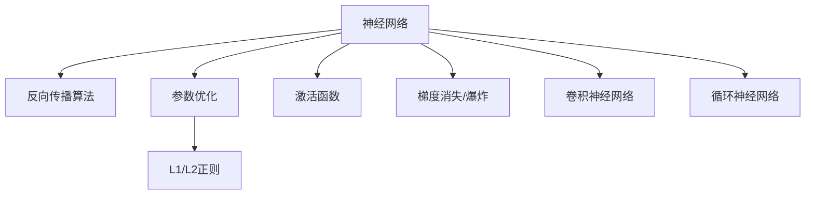

                 

# 计算范式的变革：从图灵机到神经网络

计算范式从图灵机到神经网络，是计算机科学和人工智能发展的重要里程碑，其背后蕴含着深刻的理论基础和应用价值。本文将通过介绍这一变革的必要性、核心概念、算法原理、数学模型、项目实践以及实际应用场景，探讨神经网络带来的计算范式革命，并展望其未来发展趋势和面临的挑战。

## 1. 背景介绍

### 1.1 图灵机的理论基础

图灵机(Turing Machine, TM)由图灵在1936年提出，是一种抽象的计算模型，能够模拟任何计算过程，是现代计算机理论的基础。图灵机的核心是使用一个读写带头的有限状态自动机，对输入字符串进行操作和计算。其基本思路是通过有限状态转换和指令执行，实现任意复杂的计算。

图灵机的思想对计算机科学有着深远影响，从早期电子管、晶体管计算机到现代的微处理器，都是以图灵机为基础构建的。但图灵机也有其局限性：无法表示连续和非线性函数，难以处理大规模数据和高维非结构化数据。

### 1.2 神经网络的诞生

1943年，神经网络（Neural Network, NN）的提出，标志着计算范式的一次重要变革。由麦卡洛克和皮茨提出的人工神经网络，基于生物神经元的启发，通过模拟神经元的连接和激活，实现了对非线性函数和高维数据的有效处理。

然而，早期的神经网络受到当时硬件技术限制，计算能力有限，仅能处理简单的模式识别和控制任务。直到1980年代，随着反向传播算法的提出和计算机技术的飞速发展，神经网络得以快速发展，成为解决复杂计算问题的重要工具。

## 2. 核心概念与联系

### 2.1 核心概念概述

为更好地理解神经网络带来的计算范式变革，本节将介绍几个密切相关的核心概念：

- 神经网络：由神经元（或称为节点）通过权重连接构成的计算图，通过前向传播和反向传播算法进行训练和预测。
- 反向传播算法：通过链式法则，计算模型损失函数对各层参数的梯度，用于更新权重和偏置。
- 参数优化：通过调整模型参数，最小化损失函数，优化模型性能。
- 正则化：通过L1、L2正则等技术，防止模型过拟合。
- 激活函数：如ReLU、Sigmoid等，用于引入非线性变换，增强模型的表达能力。
- 梯度消失/爆炸：在深度网络中，反向传播时梯度可能无限放大或消失，导致参数更新不平衡，影响训练效果。
- 卷积神经网络（CNN）：用于处理图像、视频等高维数据，通过卷积操作提取特征。
- 循环神经网络（RNN）：用于处理序列数据，如文本、音频等，通过循环结构保持上下文信息。

这些核心概念之间的逻辑关系可以通过以下Mermaid流程图来展示：



这个流程图展示了大语言模型的核心概念及其之间的关系：

1. 神经网络通过反向传播算法进行训练，最小化损失函数。
2. 参数优化和正则化技术用于调整网络参数，防止过拟合。
3. 激活函数和非线性变换增强模型的表达能力。
4. 梯度消失和爆炸问题需要通过技术手段解决。
5. CNN和RNN分别处理高维数据和序列数据，提升模型的处理能力。

## 3. 核心算法原理 & 具体操作步骤

### 3.1 算法原理概述

神经网络通过反向传播算法进行训练，其核心思路是：将输出层的误差通过链式法则逐步传递到隐藏层，计算每个参数的梯度，进而更新模型参数。

形式化地，设神经网络模型 $M$ 的参数为 $\theta$，训练数据集 $D=\{(x_i,y_i)\}_{i=1}^N$，其中 $x_i$ 为输入，$y_i$ 为标签。损失函数为 $\mathcal{L}(\theta)$，定义为：

$$
\mathcal{L}(\theta) = \frac{1}{N} \sum_{i=1}^N \ell(y_i, M(x_i))
$$

其中 $\ell$ 为损失函数的具体形式，如均方误差、交叉熵等。

通过反向传播算法，计算损失函数对模型参数 $\theta$ 的梯度，并使用梯度下降等优化算法更新参数，直到满足预设的收敛条件：

$$
\theta \leftarrow \theta - \eta \nabla_{\theta}\mathcal{L}(\theta)
$$

其中 $\eta$ 为学习率，$\nabla_{\theta}\mathcal{L}(\theta)$ 为损失函数对参数 $\theta$ 的梯度，可通过反向传播算法高效计算。

### 3.2 算法步骤详解

神经网络训练的核心步骤如下：

**Step 1: 准备数据集和模型**

- 准备训练数据集 $D$，包括输入 $x_i$ 和标签 $y_i$。
- 定义神经网络模型 $M$，包括输入层、隐藏层和输出层。

**Step 2: 初始化参数**

- 随机初始化模型参数 $\theta$，如权重 $w$ 和偏置 $b$。

**Step 3: 前向传播计算预测**

- 将训练数据 $x_i$ 输入模型，计算中间层的隐藏状态 $h$ 和输出层的预测值 $\hat{y}$。

**Step 4: 计算损失函数**

- 将预测值 $\hat{y}$ 和真实标签 $y_i$ 代入损失函数 $\ell$，计算损失 $\mathcal{L}(\theta)$。

**Step 5: 反向传播计算梯度**

- 使用反向传播算法计算损失函数对各层参数的梯度，更新权重和偏置。

**Step 6: 参数更新**

- 根据梯度下降等优化算法，更新模型参数。

**Step 7: 迭代训练**

- 重复执行前向传播、损失计算、反向传播、参数更新等步骤，直至模型收敛或达到预设轮数。

### 3.3 算法优缺点

神经网络带来计算范式的变革，具有以下优点：

- 强大的非线性拟合能力：通过多层非线性变换，能够表示复杂的高维数据和函数。
- 高容错性：对部分数据和参数的扰动，模型仍然能够保持稳定输出。
- 自动特征提取：网络自动从数据中学习特征，无需手动提取。

但神经网络也存在一些缺点：

- 训练复杂度高：需要大量标注数据和计算资源进行训练，参数量巨大。
- 过拟合风险：复杂模型容易出现过拟合，泛化性能不足。
- 解释性差：神经网络的决策过程通常缺乏可解释性，难以调试和优化。

### 3.4 算法应用领域

神经网络在多个领域得到了广泛应用，包括但不限于：

- 图像处理：如物体检测、图像分割、风格转换等。
- 语音识别：如语音转文字、语音合成、声音分类等。
- 自然语言处理：如机器翻译、文本分类、情感分析等。
- 医疗诊断：如影像识别、病理学分析等。
- 金融预测：如股票预测、信用评分等。
- 自动驾驶：如视觉感知、路径规划等。
- 游戏AI：如自动游戏、智能推荐等。

## 4. 数学模型和公式 & 详细讲解 & 举例说明

### 4.1 数学模型构建

本节将使用数学语言对神经网络进行更严格的刻画。

设神经网络模型 $M$ 由 $L$ 层组成，每层 $i$ 的输入为 $x_i^{(i)}$，输出为 $x_i^{(i+1)}$，参数为 $\theta_i$。隐藏层 $i$ 的激活函数为 $f_i$，输出层 $L$ 的激活函数为 $f_L$，损失函数为 $\mathcal{L}(\theta)$。

前向传播计算输入 $x$ 经过每层神经元的输出：

$$
x^{(1)} = M^{(1)}(x) = W_1^{(1)}x + b_1^{(1)}
$$
$$
x^{(i+1)} = M^{(i+1)}(x^{(i)}) = W_i^{(i+1)}f_i(x^{(i)}) + b_i^{(i+1)}, i=1,...,L-1
$$
$$
\hat{y} = M^{(L)}(x) = W_L^{(L)}f_L(x^{(L)})
$$

其中 $W_i^{(i+1)}$ 和 $b_i^{(i+1)}$ 分别为第 $i$ 层到第 $i+1$ 层的权重和偏置。

### 4.2 公式推导过程

以下我们以二分类任务为例，推导交叉熵损失函数及其梯度的计算公式。

假设模型 $M$ 在输入 $x$ 上的输出为 $\hat{y}=M(x) \in [0,1]$，表示样本属于正类的概率。真实标签 $y \in \{0,1\}$。则二分类交叉熵损失函数定义为：

$$
\ell(M(x),y) = -[y\log \hat{y} + (1-y)\log (1-\hat{y})]
$$

将其代入损失函数公式，得：

$$
\mathcal{L}(\theta) = -\frac{1}{N}\sum_{i=1}^N [y_i\log M_{\theta}(x_i)+(1-y_i)\log(1-M_{\theta}(x_i))]
$$

根据链式法则，损失函数对参数 $\theta_k$ 的梯度为：

$$
\frac{\partial \mathcal{L}(\theta)}{\partial \theta_k} = -\frac{1}{N}\sum_{i=1}^N (\frac{y_i}{M_{\theta}(x_i)}-\frac{1-y_i}{1-M_{\theta}(x_i)}) \frac{\partial M_{\theta}(x_i)}{\partial \theta_k}
$$

其中 $\frac{\partial M_{\theta}(x_i)}{\partial \theta_k}$ 可进一步递归展开，利用自动微分技术完成计算。

### 4.3 案例分析与讲解

以LeNet为例，介绍神经网络在手写数字识别中的应用。LeNet是一个经典的卷积神经网络，用于图像识别任务。

LeNet由两层卷积层、两层池化层和两层全连接层组成。其输入为28x28的灰度图像，输出为10个类别的概率。

具体训练过程如下：

- 将训练集数据输入LeNet，计算中间层的卷积特征和池化特征。
- 将卷积和池化特征输入全连接层，计算输出层概率。
- 计算交叉熵损失，反向传播计算梯度。
- 更新权重和偏置，重复执行前向传播和反向传播，直至模型收敛。

## 5. 项目实践：代码实例和详细解释说明

### 5.1 开发环境搭建

在进行神经网络项目实践前，我们需要准备好开发环境。以下是使用Python进行TensorFlow开发的环境配置流程：

1. 安装Anaconda：从官网下载并安装Anaconda，用于创建独立的Python环境。

2. 创建并激活虚拟环境：
```bash
conda create -n tf-env python=3.8 
conda activate tf-env
```

3. 安装TensorFlow：根据CUDA版本，从官网获取对应的安装命令。例如：
```bash
pip install tensorflow-gpu -i https://tfhub.dev/conda/sgpu
```

4. 安装Keras：
```bash
pip install keras
```

5. 安装各类工具包：
```bash
pip install numpy pandas scikit-learn matplotlib tqdm jupyter notebook ipython
```

完成上述步骤后，即可在`tf-env`环境中开始神经网络实践。

### 5.2 源代码详细实现

下面我们以手写数字识别（MNIST）为例，给出使用Keras对LeNet模型进行训练的PyTorch代码实现。

首先，准备训练集和测试集：

```python
from tensorflow.keras.datasets import mnist

(x_train, y_train), (x_test, y_test) = mnist.load_data()

# 数据预处理
x_train = x_train.reshape(-1, 28, 28, 1).astype('float32') / 255.0
x_test = x_test.reshape(-1, 28, 28, 1).astype('float32') / 255.0
y_train = keras.utils.to_categorical(y_train, 10)
y_test = keras.utils.to_categorical(y_test, 10)
```

然后，定义LeNet模型：

```python
from tensorflow.keras import layers

model = keras.Sequential([
    layers.Conv2D(32, kernel_size=(3, 3), activation='relu', input_shape=(28, 28, 1)),
    layers.MaxPooling2D(pool_size=(2, 2)),
    layers.Flatten(),
    layers.Dense(128, activation='relu'),
    layers.Dense(10, activation='softmax')
])
```

接着，定义优化器和损失函数：

```python
from tensorflow.keras import optimizers

model.compile(optimizer=optimizers.SGD(lr=0.01), loss='categorical_crossentropy', metrics=['accuracy'])
```

最后，启动训练流程并在测试集上评估：

```python
epochs = 10
batch_size = 128

model.fit(x_train, y_train, batch_size=batch_size, epochs=epochs, validation_data=(x_test, y_test))
test_loss, test_acc = model.evaluate(x_test, y_test)
print('Test accuracy:', test_acc)
```

以上就是使用Keras对LeNet模型进行手写数字识别的完整代码实现。可以看到，借助Keras库，神经网络的构建和训练变得十分简洁高效。

### 5.3 代码解读与分析

让我们再详细解读一下关键代码的实现细节：

**LeNet模型定义**：
- `Sequential` 模型：通过堆叠`layers` 中的层来定义神经网络。
- `Conv2D` 层：用于卷积操作，提取输入图像的特征。
- `MaxPooling2D` 层：用于池化操作，减少特征图尺寸。
- `Flatten` 层：将多维特征图展平为向量。
- `Dense` 层：用于全连接操作，进行分类。

**训练过程**：
- 使用`compile`方法定义优化器和损失函数。
- 调用`fit`方法进行模型训练，指定训练数据、批次大小、轮数等参数。
- 在测试集上使用`evaluate`方法评估模型性能，并打印输出测试精度。

## 6. 实际应用场景

### 6.1 图像识别

神经网络在图像识别领域有着广泛应用，例如图像分类、物体检测、图像分割等。Google的Inception、Microsoft的ResNet等模型在这些任务上表现优异。

在具体实践中，可以收集大量标注数据，使用神经网络进行训练，然后在新的图像数据上进行分类或检测。例如，在医疗影像中，神经网络可以帮助诊断疾病，提高诊断的准确性和效率。

### 6.2 自然语言处理

神经网络在自然语言处理领域也有着广泛应用，如机器翻译、文本分类、情感分析等。通过训练语言模型，可以自动学习语言规则，实现高精度的自然语言处理任务。

例如，在机器翻译中，可以使用神经网络将源语言文本转换为目标语言，提升翻译质量。在情感分析中，可以使用神经网络对文本进行情感分类，分析用户情绪。

### 6.3 自动驾驶

神经网络在自动驾驶领域也有着重要应用。通过训练神经网络，可以实现对交通信号、道路标志的识别，进行路径规划和避障决策。

例如，在自动驾驶中，神经网络可以通过摄像头和激光雷达数据，实现对周边环境的感知和分析，生成车辆控制指令，确保行车安全。

## 7. 工具和资源推荐

### 7.1 学习资源推荐

为了帮助开发者系统掌握神经网络的理论基础和实践技巧，这里推荐一些优质的学习资源：

1. 《深度学习》系列书籍：由深度学习领域的权威专家撰写，深入浅出地介绍了深度学习的基本概念和经典模型。

2. CS231n《卷积神经网络》课程：斯坦福大学开设的计算机视觉课程，有Lecture视频和配套作业，带你入门深度学习与计算机视觉。

3. 《动手学深度学习》书籍：动手实践为主的深度学习教材，由北大团队编写，涵盖神经网络、深度学习、计算机视觉等多个领域。

4. TensorFlow官方文档：TensorFlow的官方文档，提供了海量API和示例代码，是神经网络开发的必备资料。

5. Keras官方文档：Keras的官方文档，提供了简洁易用的高级API，适合快速搭建神经网络。

通过对这些资源的学习实践，相信你一定能够快速掌握神经网络的核心知识，并用于解决实际的计算问题。

### 7.2 开发工具推荐

高效的开发离不开优秀的工具支持。以下是几款用于神经网络开发的常用工具：

1. TensorFlow：由Google主导开发的深度学习框架，支持分布式计算和GPU加速，适合大规模工程应用。

2. PyTorch：由Facebook主导开发的深度学习框架，动态计算图，适合快速迭代研究。

3. Keras：基于TensorFlow和Theano，提供高层次API，适合初学者和快速原型开发。

4. MXNet：由亚马逊开发的深度学习框架，支持多种编程语言，适合分布式计算。

5. Caffe：由Berkeley团队开发的深度学习框架，速度较快，适合图像处理任务。

6. MXBoard：TensorFlow和MXNet的可视化工具，可以实时监测模型训练状态，提供丰富的图表呈现方式，是调试模型的得力助手。

合理利用这些工具，可以显著提升神经网络开发的效率，加快创新迭代的步伐。

### 7.3 相关论文推荐

神经网络技术的发展源于学界的持续研究。以下是几篇奠基性的相关论文，推荐阅读：

1. 《深度学习》书籍：Yann LeCun等撰写，全面介绍了深度学习的基本原理和经典模型。

2. 《ImageNet大规模视觉识别挑战赛》论文：AlexNet模型，开创了深度学习在图像识别领域的先河。

3. 《手写数字识别》论文：LeNet模型，奠定了卷积神经网络的基础。

4. 《语义分割的神经网络》论文：FCN模型，开创了深度学习在图像分割领域的应用。

5. 《机器翻译》论文：Seq2Seq模型，将神经网络应用于自然语言处理任务。

6. 《情感分析》论文：RNN模型，实现了对文本情感的自动分类。

这些论文代表了大语言模型微调技术的发展脉络。通过学习这些前沿成果，可以帮助研究者把握学科前进方向，激发更多的创新灵感。

## 8. 总结：未来发展趋势与挑战

### 8.1 总结

本文对神经网络带来的计算范式变革进行了全面系统的介绍。首先阐述了神经网络的必要性和核心概念，明确了神经网络在图像、语音、自然语言处理等多个领域的应用前景。其次，从原理到实践，详细讲解了神经网络的数学模型和算法实现，给出了神经网络训练的完整代码实例。同时，本文还探讨了神经网络在落地应用中面临的挑战和未来趋势，为开发者的实际应用提供了全面的技术指引。

通过本文的系统梳理，可以看到，神经网络在计算范式上的变革，极大地提升了计算能力、模型性能和应用范围，成为人工智能发展的重要驱动力。未来，伴随神经网络技术的持续演进，其应用将更加广泛，推动更多领域的技术突破。

### 8.2 未来发展趋势

展望未来，神经网络技术将呈现以下几个发展趋势：

1. 模型规模持续增大。随着算力成本的下降和数据规模的扩张，神经网络模型的参数量还将持续增长。超大规模神经网络蕴含的丰富知识，有望支撑更加复杂多变的应用场景。

2. 自动化设计将普及。神经网络的设计将进一步自动化，更多强大的模型结构和优化技术将通过神经架构搜索(NAS)等方法得到应用，提升模型设计和训练的效率。

3. 多模态融合将增强。神经网络将更多地融合视觉、语音、文本等多模态数据，增强对现实世界的理解能力。

4. 模型解释性将提高。神经网络的决策过程将更具有可解释性，通过因果分析和博弈论等方法，提升系统的透明度和可靠性。

5. 应用领域将更广。神经网络将在更多领域得到应用，如金融、医疗、自动驾驶、智能制造等，推动产业数字化升级。

6. 计算效率将提升。随着硬件技术的发展，神经网络推理速度将进一步提升，资源消耗也将降低，更广泛的应用成为可能。

7. 伦理和安全将重视。神经网络将更多地关注伦理和安全问题，避免有害输出，确保技术的公正性和安全性。

以上趋势凸显了神经网络技术的广阔前景。这些方向的探索发展，必将进一步提升神经网络的性能和应用范围，为构建智能系统提供更多技术支持。

### 8.3 面临的挑战

尽管神经网络技术已经取得了瞩目成就，但在迈向更加智能化、普适化应用的过程中，它仍面临着诸多挑战：

1. 训练成本高。尽管训练效率已经大幅提升，但训练神经网络仍需大量的计算资源和标注数据。

2. 泛化性能不足。神经网络面对数据分布变化时，泛化性能往往不足，模型容易过拟合。

3. 解释性差。神经网络的决策过程通常缺乏可解释性，难以调试和优化。

4. 资源消耗大。神经网络推理速度较慢，资源消耗较大，限制了其在某些场景中的应用。

5. 数据隐私问题。神经网络需要大量数据进行训练，数据隐私问题需引起重视。

6. 伦理和安全问题。神经网络可能存在偏见，需引入伦理导向的评估指标，避免有害用途。

7. 计算资源依赖。神经网络推理需高性能硬件支持，如GPU、TPU等，计算资源需求较高。

这些挑战凸显了神经网络技术的复杂性，未来的研究需要在算法、硬件、数据等多个维度进行协同优化，以克服现有问题，提升技术水平。

### 8.4 研究展望

面对神经网络面临的挑战，未来的研究需要在以下几个方面寻求新的突破：

1. 探索无监督和半监督学习。摆脱对大规模标注数据的依赖，利用自监督学习、主动学习等技术，最大化数据利用效率。

2. 研究更高效的优化算法。开发更高效的优化算法，如AdamW、Adafactor等，提升训练速度和模型性能。

3. 引入更多先验知识。将符号化的先验知识与神经网络进行融合，增强模型的泛化能力和解释性。

4. 结合因果分析和博弈论工具。通过引入因果分析方法，增强模型决策的逻辑性和可解释性，提升系统稳定性。

5. 加强数据隐私保护。采用数据匿名化、差分隐私等技术，确保数据隐私和安全。

6. 引入伦理道德约束。在模型训练目标中引入伦理导向的评估指标，过滤和惩罚有害输出，确保模型的公正性和安全性。

这些研究方向的探索，必将引领神经网络技术迈向更高的台阶，为构建安全、可靠、可解释、可控的智能系统铺平道路。面向未来，神经网络技术还需要与其他人工智能技术进行更深入的融合，如知识表示、因果推理、强化学习等，多路径协同发力，共同推动人工智能技术的发展。只有勇于创新、敢于突破，才能不断拓展神经网络的应用边界，让智能技术更好地造福人类社会。

## 9. 附录：常见问题与解答

**Q1：神经网络如何提高数据利用率？**

A: 神经网络通过引入更多的非线性变换和层级结构，能够学习更丰富的特征表示，从而提高数据利用率。此外，神经网络可以通过迁移学习、半监督学习等技术，利用未标注数据进行训练，进一步提升数据利用效率。

**Q2：神经网络的训练过程如何防止过拟合？**

A: 防止过拟合的关键在于正则化和数据增强。常用的正则化方法包括L1/L2正则、Dropout、数据增强等。数据增强可以通过旋转、翻转、加噪声等方式，丰富训练数据的多样性，防止模型对训练集过度拟合。

**Q3：神经网络如何提升推理速度？**

A: 提升推理速度的关键在于模型压缩和硬件优化。模型压缩技术包括剪枝、量化、低秩分解等，可以在保持模型精度的同时，减少参数量，加速推理。硬件优化方面，可以采用GPU/TPU等高性能硬件，提升模型推理效率。

**Q4：神经网络的解释性如何提升？**

A: 提升神经网络解释性的关键在于引入因果分析和博弈论等方法。通过分析模型的决策路径和因果关系，可以更深入地理解模型的内部工作机制，提高模型的可解释性。

**Q5：神经网络在实际应用中如何保证数据隐私？**

A: 数据隐私保护的关键在于数据匿名化、差分隐私等技术。数据匿名化通过去除或模糊化敏感信息，防止数据泄露。差分隐私通过对数据添加噪音，确保单个数据点的隐私不会被泄露。

---

作者：禅与计算机程序设计艺术 / Zen and the Art of Computer Programming

