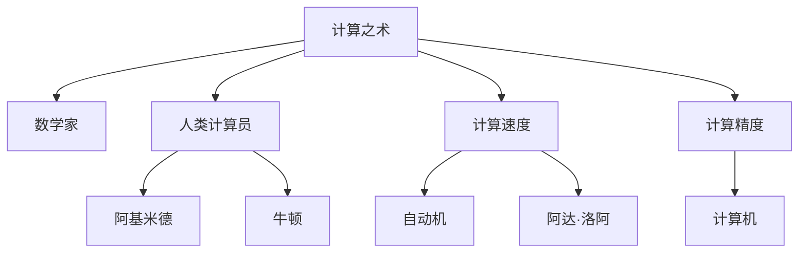

                 

# 计算：第一部分 计算的诞生 第 2 章 计算之术 人类计算员

> 关键词：计算之术, 数学家, 人类计算员, 阿基米德, 牛顿, 人类计算, 计算速度, 计算精度, 计算机, 自动机, 阿达洛瓦

## 1. 背景介绍

### 1.1 问题由来
在人类文明发展的早期，计算对于社会生活至关重要。无论是农作物的统计、市场交易的结算，还是天文观测的天文计算，都依赖于手工进行。然而，手工计算既耗时又容易出错，严重制约了人类社会的发展。

在古代，数学家们尝试通过各种方式提高计算效率。古埃及的帕普斯计算表、中国的九章算术，都是对计算方法的系统总结。但这些方法大多依赖于手工运算，无法大规模推广。直到文艺复兴时期，数学家们开始尝试设计机械计算装置，计算效率才有了质的飞跃。

## 2. 核心概念与联系

### 2.1 核心概念概述

为更好地理解人类计算历史，本节将介绍几个密切相关的核心概念：

- **计算之术**：指的是古往今来人们所采用的各种计算方法和工具。包括算盘、计算尺、机械计算器、计算机等。

- **数学家**：从事数学研究与探索的专业人员，推动了计算技术的发展。如阿基米德、牛顿等。

- **人类计算员**：指利用手工或机械工具进行计算的专业人员。他们通过复杂运算解决各种实际问题，对人类文明进步起到了重要推动作用。

- **阿基米德**：古希腊的数学家、物理学家，提出了杠杆原理，通过计算解决了许多实际问题。

- **牛顿**：近代物理学家、数学家，提出了微积分学说，为计算机器设计提供了数学基础。

- **计算速度**：指单位时间内完成计算任务的能力，是衡量计算能力的重要指标。

- **计算精度**：指计算结果与真实值的接近程度，也是衡量计算能力的重要指标。

- **计算机**：现代电子设备，通过程序控制完成各种计算任务。

- **自动机**：一种数学模型，用于描述计算过程和计算设备。

- **阿达·洛阿**：计算机科学的奠基人之一，提出了存储程序计算机的概念，奠定了现代计算机的基础。

这些核心概念之间的逻辑关系可以通过以下Mermaid流程图来展示：



这个流程图展示出计算之术的发展脉络：

1. 计算之术起源于数学家的研究。
2. 人类计算员通过各种工具进行计算。
3. 阿基米德、牛顿等数学家通过计算解决实际问题。
4. 计算机和自动机的发明，推动了计算效率的大幅提升。
5. 阿达·洛阿提出了存储程序计算机的概念。

这些概念共同构成了计算技术的发展框架，展示了计算是如何从手工劳动逐渐发展为自动化、智能化的过程。

## 3. 核心算法原理 & 具体操作步骤
### 3.1 算法原理概述

人类计算的原理可以追溯到古希腊的阿基米德，他通过计算发现了杠杆原理，奠定了机械计算的基础。随后，牛顿提出微积分学说，为计算机器设计提供了数学理论支持。

具体而言，人类计算的原理包括以下几个步骤：

1. **问题建模**：将实际问题转化为数学问题，建立数学模型。如力学问题可以通过运动方程来描述。

2. **数学计算**：利用数学方法求解模型中的未知数。如通过微积分求导或积分计算。

3. **计算工具使用**：选择合适的计算工具进行运算。如手工运算、机械计算器、电子计算机等。

4. **结果分析**：分析计算结果，得出实际问题的解答。如通过计算确定力学系统的运动轨迹。

### 3.2 算法步骤详解

人类计算的具体操作步骤可以分为以下几个步骤：

**Step 1: 问题建模**
- 将实际问题转化为数学表达式。如力学的牛顿第二定律：力 = 质量 × 加速度。

**Step 2: 数学计算**
- 选择合适的数学方法求解模型。如对牛顿第二定律进行积分，求出运动轨迹。

**Step 3: 计算工具使用**
- 使用手工、机械、电子等计算工具进行运算。如用算盘计算加减乘除，用计算器计算复杂方程，用计算机进行数值模拟。

**Step 4: 结果分析**
- 分析计算结果，得出解答。如计算出运动轨迹，模拟力学系统的运动过程。

### 3.3 算法优缺点

人类计算的优势在于：

- **灵活性**：可以根据具体问题选择合适的计算方法。
- **适应性**：手工和机械计算可以在任何环境中进行。
- **可解释性**：计算步骤清晰，容易理解。

但人类计算也存在一些缺点：

- **效率低下**：手工计算和机械计算器速度较慢，难以应对大规模计算任务。
- **精度受限**：手工和机械计算的精度受限于工具的精度。
- **依赖人力**：计算过程需要大量人力，成本较高。

### 3.4 算法应用领域

人类计算广泛应用于各种领域，如工程、物理、天文学、经济等。例如：

- **工程计算**：如力学系统的分析设计、电路的设计优化等。
- **天文学计算**：如天体运动的轨迹计算、恒星的温度分析等。
- **经济统计**：如市场供需关系的计算、金融风险的评估等。

## 4. 数学模型和公式 & 详细讲解 & 举例说明

### 4.1 数学模型构建

人类计算的数学模型通常涉及力学、数学、统计等多个领域。以下以力学系统为例，展示如何构建计算模型：

**力学系统模型**
- **系统描述**：一个质量为 $m$ 的物体，受力 $F$ 作用，在水平面上运动。
- **运动方程**：$F = m \cdot a$。

### 4.2 公式推导过程

**牛顿第二定律**
- 设物体的速度为 $v$，加速度为 $a$，则根据速度和加速度的关系，有 $v = a \cdot t$。
- 对上式两边积分，得到 $s = \frac{1}{2}a \cdot t^2$。
- 代入运动方程 $F = m \cdot a$，得到 $s = \frac{1}{2}F \cdot t^2 / m$。

### 4.3 案例分析与讲解

**案例分析**
- **问题描述**：已知一个质量为 $m$ 的物体，受到水平力 $F = 10 N$ 的作用，在水平面上以 $t = 2 s$ 的初速度运动，求在 $t = 5 s$ 时的位移 $s$。
- **求解过程**：
  - 建模：根据力学系统，建立运动方程 $F = m \cdot a$。
  - 计算：根据 $v = a \cdot t$，求得加速度 $a = F / m = 10 N / 1 kg = 10 m/s^2$。
  - 使用 $s = \frac{1}{2}a \cdot t^2 / m$，代入已知数据 $a = 10 m/s^2, t = 2 s, m = 1 kg$，得到 $s = \frac{1}{2} \cdot 10 \cdot 2^2 / 1 = 20 m$。

## 5. 项目实践：代码实例和详细解释说明
### 5.1 开发环境搭建

在进行计算实践前，我们需要准备好开发环境。以下是使用Python进行计算实践的环境配置流程：

1. 安装Anaconda：从官网下载并安装Anaconda，用于创建独立的Python环境。

2. 创建并激活虚拟环境：
```bash
conda create -n calc-env python=3.8 
conda activate calc-env
```

3. 安装必要的工具包：
```bash
pip install numpy scipy sympy sympy
```

完成上述步骤后，即可在`calc-env`环境中开始计算实践。

### 5.2 源代码详细实现

以下是使用Python实现上述力学系统案例的代码：

```python
from sympy import symbols, integrate, Rational

# 定义符号
t, m, F, a = symbols('t m F a')
v = a * t  # 速度与加速度的关系
s = integrate(v, (t, 0, 5))  # 积分计算位移

# 代入数据计算
F_val = 10  # 力
m_val = 1   # 质量
s_val = s.subs({a: F_val / m_val, m: m_val, t: 5})  # 代入已知数据计算位移
print(s_val)  # 输出计算结果
```

### 5.3 代码解读与分析

让我们再详细解读一下关键代码的实现细节：

**symbols函数**
- 定义了变量，便于后续计算使用。

**integrate函数**
- 进行积分计算，得到位移表达式。

**代入数据**
- 将已知数据代入计算公式中，求解位移。

**打印输出**
- 输出计算结果，展示最终解答。

## 6. 实际应用场景
### 6.1 工程设计

工程计算是人类计算的重要应用领域。在建筑设计、机械设计中，计算力学的应用尤为广泛。例如，工程师需要通过计算分析结构稳定性、应力分布等，确保设计方案的安全性。

在实际应用中，可以收集工程数据，建立力学模型，利用人类计算或计算机模拟进行结构分析和优化。这样不仅能够提高计算效率，还能提升设计精度和设计自动化水平。

### 6.2 天文学观测

天文学观测也需要大量的计算。例如，通过计算预测天体运动轨迹，分析恒星谱线，研究宇宙结构等。

利用计算机模拟，可以在短时间内完成复杂的计算任务，为天文学家提供强大的支持。同时，通过手动计算，可以对复杂问题进行深入分析和探索，推动天文学的发展。

### 6.3 经济统计

经济统计是另一大应用场景。通过对大量经济数据进行计算，可以获得市场供需关系、经济增长趋势等重要信息。

在计算实践中，可以采用数学模型和统计方法，对数据进行处理和分析，为政策制定和经济预测提供参考。同时，手工计算可以验证计算结果的准确性，确保经济统计的可靠性。

## 7. 工具和资源推荐
### 7.1 学习资源推荐

为了帮助开发者系统掌握计算原理和实践技巧，这里推荐一些优质的学习资源：

1. **《数学之美》系列博文**：由数学家撰写，深入浅出地介绍了数学与计算的基础知识，适合初学者入门。

2. **CS231n《计算机视觉》课程**：斯坦福大学开设的计算机视觉明星课程，有Lecture视频和配套作业，涵盖多种计算技术。

3. **《离散数学》书籍**：详细讲解了离散数学理论，包括图论、组合数学、算法分析等内容，适合对计算原理感兴趣的读者。

4. **《NumPy 科学计算》书籍**：介绍了NumPy库在科学计算中的应用，包括矩阵运算、线性代数、随机数生成等内容。

5. **SciPy官方文档**：介绍了SciPy库在科学计算中的应用，包括信号处理、优化、统计等领域的计算功能。

通过对这些资源的学习实践，相信你一定能够快速掌握计算技术的精髓，并用于解决实际的计算问题。

### 7.2 开发工具推荐

高效的计算离不开优秀的工具支持。以下是几款用于计算开发的常用工具：

1. Python：一种高级编程语言，拥有丰富的科学计算库和工具，适合进行各种计算任务。

2. R：一种专门用于统计分析和科学计算的语言，适合进行数据处理和可视化。

3. MATLAB：一种数值计算和图形界面化的工具，适合进行复杂数学计算和仿真模拟。

4. Scilab：一种基于MATLAB的开源科学计算软件，支持矩阵运算、符号计算、可视化等功能。

5. Gnuplot：一种图形化数据可视化工具，支持多种数据格式和图形类型，适合进行数据可视化分析。

合理利用这些工具，可以显著提升计算任务的开发效率，加快创新迭代的步伐。

### 7.3 相关论文推荐

计算技术的发展源于学界的持续研究。以下是几篇奠基性的相关论文，推荐阅读：

1. **《微积分》（Calculus）**：牛顿的著作，奠定了微积分学的基础，为计算技术提供了数学理论支持。

2. **《自然哲学的数学原理》（Philosophiæ Naturalis Principia Mathematica）**：牛顿的著作，详细描述了力学系统的计算方法和物理定律。

3. **《机械论原理》（Principia Mathematica）**：莱布尼茨的著作，引入了微积分概念，为计算技术提供了数学工具。

4. **《数值计算方法》（Numerical Methods）**：介绍了各种数值计算方法，如插值、积分、微分方程等，适合进行工程计算。

5. **《线性代数与微积分》（Linear Algebra and Differential Equations）**：介绍了线性代数和微分方程的理论基础和应用，适合进行科学计算。

这些论文代表了大计算技术的发展脉络。通过学习这些前沿成果，可以帮助研究者把握学科前进方向，激发更多的创新灵感。

## 8. 总结：未来发展趋势与挑战
### 8.1 总结

本文对人类计算技术的发展历程进行了全面系统的介绍。首先阐述了人类计算的历史背景和重要意义，明确了计算在科学、工程、经济等领域中的核心地位。其次，从原理到实践，详细讲解了计算的数学模型和操作步骤，给出了计算任务开发的完整代码实例。同时，本文还探讨了计算技术在多个实际领域的应用前景，展示了计算技术的广泛应用。此外，本文精选了计算技术的各类学习资源，力求为读者提供全方位的技术指引。

通过本文的系统梳理，可以看到，人类计算技术历经千年发展，从手工运算到机械计算再到计算机模拟，不断推动着人类社会的进步。未来，伴随计算机科学和数学理论的不断进步，计算技术必将在更多领域大放异彩，为人类社会带来更深远的影响。

### 8.2 未来发展趋势

展望未来，人类计算技术将呈现以下几个发展趋势：

1. **计算速度不断提升**：随着计算机硬件的发展，计算速度将不断提升，处理大规模数据和复杂计算成为可能。

2. **计算精度逐步提高**：随着算法和计算方法的不断优化，计算精度将逐步提高，计算结果更加精确可信。

3. **计算工具多样化**：各种计算工具将不断涌现，满足不同场景下的计算需求，如高精度计算、符号计算、数值模拟等。

4. **计算模型复杂化**：复杂系统的计算模型将成为研究热点，如深度学习、神经网络、优化算法等。

5. **计算应用广泛化**：计算技术将在更多领域得到应用，如生物学、金融学、天文学等，推动相关领域的发展。

6. **计算伦理规范**：伴随计算技术的发展，计算伦理和规范将成为重要课题，保障数据安全和计算公正。

以上趋势凸显了人类计算技术的广阔前景。这些方向的探索发展，必将进一步提升计算技术在各领域的计算效率和计算精度，推动人类社会迈向更加智能化、高效化的未来。

### 8.3 面临的挑战

尽管人类计算技术已经取得了瞩目成就，但在迈向更加智能化、普适化应用的过程中，它仍面临着诸多挑战：

1. **计算成本高昂**：大型计算任务需要高性能计算机，成本较高，难以大规模普及。

2. **计算资源瓶颈**：计算任务对内存、存储、带宽等资源需求较高，需要高效的资源管理和优化。

3. **计算精度控制**：计算过程中可能会出现误差积累，需要采取有效措施控制计算精度。

4. **计算复杂性**：复杂系统的计算模型难以建立，需要更多的研究和技术支持。

5. **计算结果解释**：计算结果的解释和理解存在困难，需要更好的计算结果可视化方法。

6. **计算伦理问题**：计算结果可能存在偏见和误导，需要重视计算伦理和公平性问题。

这些挑战需要不断探索和突破，才能使人类计算技术真正落地应用，造福人类社会。

### 8.4 未来突破

面对人类计算技术所面临的种种挑战，未来的研究需要在以下几个方面寻求新的突破：

1. **计算硬件升级**：推动高性能计算机的发展，提升计算速度和计算精度。

2. **计算算法优化**：优化计算算法，降低计算复杂度，提高计算效率。

3. **计算资源管理**：研究高效资源管理方法，优化计算资源分配和使用。

4. **计算结果解释**：开发更好的计算结果可视化方法，提高计算结果的可理解性。

5. **计算伦理规范**：制定计算伦理规范，确保计算结果的公平性和公正性。

这些研究方向的探索，必将引领人类计算技术迈向更高的台阶，为构建智能化的未来社会提供强大支持。面向未来，人类计算技术还需要与其他人工智能技术进行更深入的融合，如知识表示、因果推理、强化学习等，多路径协同发力，共同推动计算技术的发展。只有勇于创新、敢于突破，才能不断拓展计算技术的边界，让人类社会迈向更加智能、高效的未来。

## 9. 附录：常见问题与解答

**Q1：人类计算与计算机计算有何不同？**

A: 人类计算依赖于手工或机械工具，计算速度和精度有限，难以应对大规模和复杂计算任务。计算机计算则依托于电子设备，计算速度和精度大大提升，适用于各种复杂计算任务。

**Q2：如何选择合适的计算方法？**

A: 应根据具体问题的性质和数据特点，选择适合的计算方法。如力学问题通常使用牛顿第二定律进行计算，经济学问题则可能使用统计方法。

**Q3：计算过程中如何保证计算精度？**

A: 可以通过选择合适的计算方法和工具，优化计算算法，设置合理的计算精度要求等方法，控制计算误差。

**Q4：人类计算和计算机计算的适用范围有哪些不同？**

A: 人类计算适用于手工或机械难以处理的简单计算任务，适合进行手工记录和手动分析。计算机计算适用于各种复杂的计算任务，适合进行高精度和大规模计算。

**Q5：如何理解计算技术在各领域的应用？**

A: 计算技术在科学、工程、经济等领域的应用，反映了计算技术的广泛性和重要性。通过计算技术，可以解决实际问题，推动各领域的发展。

---

作者：禅与计算机程序设计艺术 / Zen and the Art of Computer Programming

