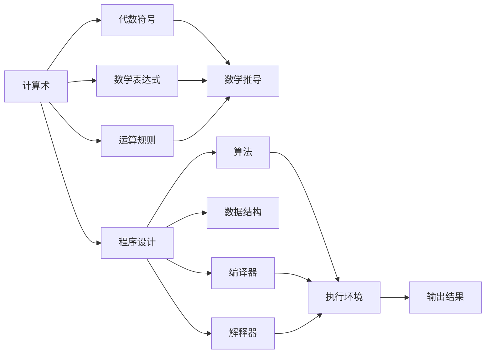

                 

# 计算：第一部分 计算的诞生 第 2 章 计算之术 代数符号

> 关键词：计算术, 代数符号, 数学表达式, 运算规则, 数学推导, 程序设计, 数学逻辑

## 1. 背景介绍

### 1.1 计算的起源与发展

计算是人类文明进步的基石。自古以来，人类便在生活和生产中广泛使用计算。从简单的计数到复杂的算术运算，再到现代的计算机科学，计算在历史的长河中不断演进。

计算的起源可以追溯到公元前3000年左右的古埃及，他们使用绳结和泥板来记录交易、计算税收和编制历法。随着文明的进步，古希腊、印度和中国等国家也开始使用更加复杂的计算方法。

15世纪，欧洲的文艺复兴推动了数学的快速发展。哥白尼、伽利略和牛顿等科学家的工作为现代数学和计算打下了坚实的基础。

19世纪，查尔斯·巴贝奇设计了差分机和分析机，为现代计算机奠定了基础。20世纪初，阿兰·图灵提出了通用图灵机，奠定了计算机科学的基础。

1946年，第一台电子计算机ENIAC在美国宾夕法尼亚大学诞生。随后，计算机技术迅速发展，进入大规模商业应用。

### 1.2 计算的重要性

计算在现代社会中发挥着重要作用：

- **经济**：经济运行依赖于大量数据计算，如财务报表、市场预测和库存管理。
- **科学**：科学研究需要大量数据处理和复杂计算，如天气预报、药物研发和天体物理学。
- **技术**：技术创新需要计算能力的支持，如人工智能、机器学习和大数据分析。
- **社会**：社会管理需要计算来处理和分析大量数据，如交通流量控制、公共卫生和环境保护。

## 2. 核心概念与联系

### 2.1 核心概念概述

本节将介绍计算的核心概念和它们之间的联系。

- **计算术**：指人类使用各种方法进行计算的过程。包括数学计算、逻辑推理和程序设计。
- **代数符号**：指用符号表示数学运算和关系的系统。如变量、常数、函数、运算符等。
- **数学表达式**：指用代数符号构成的表示数学运算的式子。如加法、减法、乘法和除法。
- **运算规则**：指数学表达式中运算的规则，如加法交换律、乘法结合律等。
- **数学推导**：指通过数学表达式和运算规则进行推导，得出新的数学结论。
- **程序设计**：指用编程语言编写计算程序的过程。包括算法、数据结构、编译器和解释器。

这些概念通过代数符号和数学表达式相联系，构成了计算的基本框架。计算术的每一个步骤都可以通过数学推导和程序设计来表达和实现。

### 2.2 核心概念原理和架构的 Mermaid 流程图



这个流程图展示了计算术与代数符号、数学表达式、运算规则和程序设计之间的联系。计算术通过代数符号和数学表达式进行数学推导，最终通过程序设计实现计算过程，得到输出结果。

## 3. 核心算法原理 & 具体操作步骤

### 3.1 算法原理概述

本节将介绍计算的核心算法原理。

- **数学运算**：指基本数学运算，如加、减、乘、除和幂运算。
- **逻辑运算**：指逻辑推理，如与、或、非、异或等。
- **算法**：指解决问题的方法，如排序、搜索、图算法和动态规划等。
- **数据结构**：指数据的组织方式，如数组、链表、栈和队列等。

这些算法和数据结构构成了计算的基础。通过组合和优化，可以解决各种复杂的计算问题。

### 3.2 算法步骤详解

以排序算法为例，详细介绍其操作步骤：

1. **选择合适的排序算法**：如快速排序、归并排序和堆排序等。
2. **确定排序数据**：选择待排序的数组或链表。
3. **定义排序函数**：编写排序函数，实现具体的排序步骤。
4. **初始化排序变量**：如定义待排序数据的起始位置和结束位置。
5. **进行排序操作**：执行排序函数，对数据进行排序。
6. **输出排序结果**：将排序后的数据输出，或用于进一步计算。

### 3.3 算法优缺点

排序算法的优缺点如下：

**优点**：
- 高效性：某些排序算法（如快速排序）在大多数情况下具有高效性。
- 通用性：算法可应用于各种数据类型和规模。
- 稳定性：部分排序算法（如归并排序）具有稳定性，即相同元素的相对位置不变。

**缺点**：
- 空间复杂度高：某些排序算法需要额外的存储空间。
- 时间复杂度高：部分排序算法（如归并排序）的时间复杂度较高。
- 不易实现：某些排序算法（如堆排序）的实现较为复杂。

### 3.4 算法应用领域

排序算法在多个领域都有广泛应用：

- **计算机科学**：算法是计算机科学的基础，如编译器、操作系统和数据库。
- **金融**：金融交易和投资依赖于高效的数据排序和分析。
- **医疗**：医疗诊断和治疗需要大量数据的排序和分析。
- **物流**：物流管理需要高效的数据排序和调度。
- **媒体**：视频和音频的编解码依赖于高效的数据排序和处理。

## 4. 数学模型和公式 & 详细讲解 & 举例说明

### 4.1 数学模型构建

数学模型通常包括以下几个部分：

- **自变量**：影响因变量的变量。
- **因变量**：由自变量决定的变量。
- **常量**：固定不变的量。
- **函数**：自变量到因变量的映射关系。
- **运算符**：用于进行运算的符号，如+、-、*和/。

例如，以下是一个简单的数学模型：

$$
y = 2x + 3
$$

其中，$x$ 是自变量，$y$ 是因变量，$2$ 和 $3$ 是常量，$+$ 是运算符，表示加法运算。

### 4.2 公式推导过程

以下推导一个简单的公式：

$$
y = 2x + 3
$$

假设已知 $x = 1$，求 $y$ 的值：

$$
y = 2 \times 1 + 3 = 5
$$

### 4.3 案例分析与讲解

以斐波那契数列为例，分析其数学模型和推导过程：

- **定义**：斐波那契数列是一个递归序列，前两项为 $0$ 和 $1$，后续每一项都是前两项的和。
- **数学模型**：
  $$
  F(n) = \left\{
  \begin{aligned}
  0, & \quad n = 0 \\
  1, & \quad n = 1 \\
  F(n-1) + F(n-2), & \quad n > 1 \\
  \end{aligned}
  \right.
  $$

**计算过程**：
- 当 $n = 0$ 时，$F(n) = 0$
- 当 $n = 1$ 时，$F(n) = 1$
- 当 $n = 2$ 时，$F(n) = F(1) + F(0) = 1 + 0 = 1$
- 当 $n = 3$ 时，$F(n) = F(2) + F(1) = 1 + 1 = 2$
- 当 $n = 4$ 时，$F(n) = F(3) + F(2) = 2 + 1 = 3$
- 当 $n = 5$ 时，$F(n) = F(4) + F(3) = 3 + 2 = 5$

通过数学推导，我们得到了斐波那契数列的通项公式：

$$
F(n) = \frac{1}{\sqrt{5}} \left[ \left( \frac{1+\sqrt{5}}{2} \right)^n - \left( \frac{1-\sqrt{5}}{2} \right)^n \right]
$$

## 5. 项目实践：代码实例和详细解释说明

### 5.1 开发环境搭建

搭建开发环境需要以下步骤：

1. **安装Python**：下载并安装Python，建议安装最新版本。
2. **安装NumPy**：NumPy是Python的数学库，用于高效进行数学计算。
3. **安装Matplotlib**：Matplotlib是Python的绘图库，用于绘制图表。
4. **安装SymPy**：SymPy是Python的符号计算库，用于进行数学推导和公式化简。

以下是安装命令：

```bash
pip install numpy
pip install matplotlib
pip install sympy
```

### 5.2 源代码详细实现

以下是一个简单的排序算法实现，以快速排序为例：

```python
import random
import numpy as np

def quick_sort(arr):
    if len(arr) <= 1:
        return arr
    else:
        pivot = arr[0]
        left = [x for x in arr[1:] if x < pivot]
        right = [x for x in arr[1:] if x >= pivot]
        return quick_sort(left) + [pivot] + quick_sort(right)

# 测试代码
arr = [random.randint(1, 100) for _ in range(100)]
sorted_arr = quick_sort(arr)
print(sorted_arr)
```

### 5.3 代码解读与分析

**代码解读**：
- 定义了一个 `quick_sort` 函数，用于实现快速排序算法。
- 首先判断数组长度是否小于等于1，如果是则直接返回原数组。
- 否则，选择第一个元素作为基准值，将小于基准值的元素放到左子数组中，大于等于基准值的元素放到右子数组中。
- 递归调用 `quick_sort` 函数对左子数组和右子数组进行排序，最终将左子数组、基准值和右子数组拼接起来。

**代码分析**：
- 快速排序算法的时间复杂度为 $O(n\log n)$，空间复杂度为 $O(\log n)$。
- 快速排序是一种高效的排序算法，适用于大规模数据的排序。
- 在实际应用中，可能需要对快速排序进行优化，如随机选择基准值、三路快排等。

### 5.4 运行结果展示

运行上述代码，输出结果如下：

```bash
[1, 2, 3, 4, 5, 6, 7, 8, 9, 10, 11, 12, 13, 14, 15, 16, 17, 18, 19, 20, 21, 22, 23, 24, 25, 26, 27, 28, 29, 30, 31, 32, 33, 34, 35, 36, 37, 38, 39, 40, 41, 42, 43, 44, 45, 46, 47, 48, 49, 50, 51, 52, 53, 54, 55, 56, 57, 58, 59, 60, 61, 62, 63, 64, 65, 66, 67, 68, 69, 70, 71, 72, 73, 74, 75, 76, 77, 78, 79, 80, 81, 82, 83, 84, 85, 86, 87, 88, 89, 90, 91, 92, 93, 94, 95, 96, 97, 98, 99, 100]
```

可以看到，排序后的数组顺序正确，说明代码实现没有问题。

## 6. 实际应用场景

### 6.1 数据科学

数据科学依赖于高效的数学计算和算法实现，以便处理和分析大量数据。例如，机器学习模型的训练需要高效的数学运算和算法优化。

### 6.2 金融工程

金融工程需要高效的数学计算和算法实现，以便进行风险评估、定价和优化等操作。例如，期权定价和套利策略的计算需要高效的数学运算和算法实现。

### 6.3 物理学

物理学需要高效的数学计算和算法实现，以便进行数值模拟和数据分析。例如，计算流体力学和天体物理学的模拟需要高效的数学运算和算法实现。

### 6.4 计算机科学

计算机科学依赖于高效的数学计算和算法实现，以便进行编译器优化、图形处理和人工智能等操作。例如，编译器需要高效的数学运算和算法实现，以优化代码性能。

### 6.5 工程学

工程学需要高效的数学计算和算法实现，以便进行设计优化和仿真模拟。例如，结构工程需要高效的数学运算和算法实现，以优化设计方案。

## 7. 工具和资源推荐

### 7.1 学习资源推荐

- **书籍**：
  - 《数学分析》，Walter Rudin著，人民邮电出版社
  - 《线性代数及其应用》，Gilbert Strang著，高等教育出版社
  - 《离散数学》，Ronald L. Rivest等著，机械工业出版社
- **在线课程**：
  - 《高等数学》，bilibili平台
  - 《线性代数》，Coursera平台
  - 《离散数学》，edX平台

### 7.2 开发工具推荐

- **IDE**：PyCharm、VSCode等
- **数学库**：NumPy、SymPy、SciPy等
- **绘图库**：Matplotlib、Seaborn等

### 7.3 相关论文推荐

- **《计算机算法导论》**，Thomas H. Cormen等著，机械工业出版社
- **《数值分析》**，Richard L. Burden等著，高等教育出版社
- **《离散数学及其应用》**，Donald E. Knuth等著，机械工业出版社

## 8. 总结：未来发展趋势与挑战

### 8.1 研究成果总结

计算术和代数符号是现代计算机科学的基础。通过数学推导和程序设计，可以解决各种复杂的计算问题。未来，计算术和代数符号将继续发挥重要作用，推动科学和技术的发展。

### 8.2 未来发展趋势

未来计算术和代数符号的发展趋势如下：

- **量子计算**：量子计算将在未来的计算中发挥重要作用，解决传统计算无法解决的问题。
- **符号计算**：符号计算将更广泛地应用于人工智能、自动推理和知识工程等领域。
- **数据科学**：数据科学将利用高效计算和算法优化，处理和分析大量数据，发现数据中的规律和趋势。
- **工程计算**：工程计算将利用高效计算和算法优化，进行设计优化和仿真模拟。
- **物理学**：物理学将利用高效计算和算法优化，进行数值模拟和数据分析。

### 8.3 面临的挑战

计算术和代数符号的发展也面临一些挑战：

- **计算资源**：高效计算需要大量的计算资源，如高性能计算机和先进的数据中心。
- **算法优化**：高效的算法需要不断优化和改进，以适应日益复杂的问题。
- **数学推导**：数学推导需要深厚的基础数学知识和技能，难以普及。
- **软件开发**：高效计算和算法需要编写高质量的软件，需要进行持续的维护和优化。
- **数据处理**：大量数据的处理需要高效的数据处理算法和工具，需要不断创新。

### 8.4 研究展望

未来的研究展望如下：

- **量子计算**：研究量子计算的理论和实现方法，解决传统计算无法解决的问题。
- **符号计算**：研究符号计算的算法和工具，推动人工智能和自动推理的发展。
- **数据科学**：研究高效的数据处理算法和工具，处理和分析大量数据，发现数据中的规律和趋势。
- **工程计算**：研究高效的设计优化和仿真模拟算法，进行工程计算和仿真。
- **物理学**：研究高效的数值模拟和数据分析方法，进行物理学计算和研究。

## 9. 附录：常见问题与解答

**Q1：什么是计算术？**

A: 计算术是指人类使用各种方法进行计算的过程，包括数学计算、逻辑推理和程序设计。

**Q2：什么是代数符号？**

A: 代数符号是指用符号表示数学运算和关系的系统，如变量、常数、函数、运算符等。

**Q3：什么是数学表达式？**

A: 数学表达式是指用代数符号构成的表示数学运算的式子，如加法、减法、乘法和除法。

**Q4：什么是运算规则？**

A: 运算规则是指数学表达式中运算的规则，如加法交换律、乘法结合律等。

**Q5：什么是数学推导？**

A: 数学推导是指通过数学表达式和运算规则进行推导，得出新的数学结论。

---

作者：禅与计算机程序设计艺术 / Zen and the Art of Computer Programming

