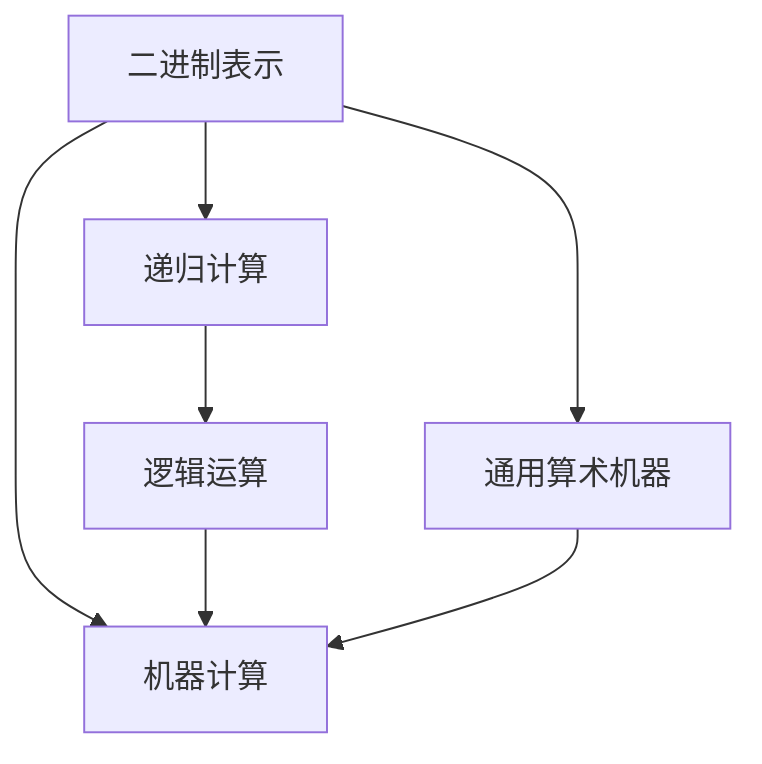

                 

# 计算：第一部分 计算的诞生 第 3 章 莱布尼茨的计算之梦 思维规律的研究

## 1. 背景介绍

### 1.1 问题由来
在探索计算的历史长河中，莱布尼茨以其卓越的智慧和对计算的深刻理解，被公认为现代计算科学的奠基人之一。然而，尽管他的贡献在今日已经广为人知，但他的计算理念和实践依然充满谜团。

莱布尼茨于1672年提出的“通用算术机器”概念，试图通过机械化的方式实现复杂的数学计算。尽管这一梦想未能完全实现，但它为现代计算理论奠定了基础。在当今的计算机科学领域，这一概念被形象地称为“莱布尼茨的计算之梦”。

### 1.2 问题核心关键点
莱布尼茨的计算理念主要集中在以下几个方面：
- 二进制表示：莱布尼茨提出了使用0和1的组合来表示所有数字的方案，这一理念被现代计算机广泛采用。
- 递归计算：他发现了递归计算的原理，提出了递归函数的定义。
- 逻辑运算：他研究了逻辑命题和逻辑推理，为现代计算机的逻辑门奠定了基础。

这些概念的提出，尽管在当时未能全面实现，但对现代计算机科学的发展产生了深远影响。本文将深入探讨莱布尼茨的计算理念，分析其与现代计算机科学之间的联系。

### 1.3 问题研究意义
研究莱布尼茨的计算理念，有助于我们更好地理解计算科学的起源和发展，了解现代计算机科学的理论基础。此外，通过比较历史和现代的计算概念，可以揭示计算发展的连续性和创新性，为未来的计算理论研究提供启示。

## 2. 核心概念与联系

### 2.1 核心概念概述

为了更好地理解莱布尼茨的计算之梦，本节将介绍几个关键概念：

- **二进制表示**：使用0和1两个数字的组合来表示所有数字的方法，由莱布尼茨提出，现代计算机广泛应用。
- **递归计算**：一种计算方法，通过将问题分解成更小的子问题来解决问题，递归函数是递归计算的基础。
- **逻辑运算**：对逻辑命题进行推理和计算，是计算机逻辑门设计的理论基础。
- **机器计算**：通过机械装置或电子设备来实现计算，莱布尼茨梦想的“通用算术机器”即此类机器。

### 2.2 核心概念原理和架构的 Mermaid 流程图



这个流程图展示了莱布尼茨计算理念中几个核心概念之间的联系：

- 二进制表示是计算的基础，所有的计算都依赖于数字0和1的组合。
- 递归计算是解决问题的一种方式，通过将问题分解成更小的子问题来逐步求解。
- 逻辑运算为计算提供了推理基础，使计算机能够对逻辑命题进行推理。
- 机器计算是所有计算的实现方式，通用算术机器是莱布尼茨梦想的具体体现。

这些概念共同构成了莱布尼茨的计算理念，并影响了现代计算机科学的发展。

## 3. 核心算法原理 & 具体操作步骤
### 3.1 算法原理概述

莱布尼茨的计算理念主要围绕以下几个算法原理展开：

- **二进制算术运算**：使用二进制数进行加、减、乘、除等基本算术运算，这些运算可以通过位运算实现。
- **递归函数计算**：通过定义递归函数，实现复杂计算问题的分解和求解。
- **逻辑门设计**：基于逻辑命题和推理，设计出逻辑门电路，用于计算机的逻辑运算。

### 3.2 算法步骤详解

下面将详细讲解莱布尼茨计算理念中的核心算法步骤：

**Step 1: 二进制表示**：
1. 使用0和1的组合表示数字，例如：$1011_2 = 1 \times 2^3 + 0 \times 2^2 + 1 \times 2^1 + 1 \times 2^0 = 11$。
2. 使用二进制数进行加、减、乘、除等基本算术运算。

**Step 2: 递归计算**：
1. 将问题分解成更小的子问题，例如计算$2^n$可以分解为$2^{n-1}$的乘以2。
2. 定义递归函数，例如阶乘函数$f(n) = n \times f(n-1)$，使用递归函数求解复杂问题。

**Step 3: 逻辑门设计**：
1. 定义逻辑门电路，例如与门、或门、非门等。
2. 设计逻辑电路，实现复杂的逻辑运算，例如逻辑命题的推理。

### 3.3 算法优缺点

莱布尼茨的计算理念具有以下优点：
1. 简化复杂问题：通过递归分解和二进制运算，将复杂问题转化为易于处理的小问题。
2. 提高计算效率：二进制表示和逻辑门设计使计算更为高效。
3. 奠定理论基础：逻辑运算和递归计算为现代计算机科学提供了理论基础。

同时，这一理念也存在一些局限性：
1. 实现复杂：二进制运算和逻辑门设计需要复杂的技术实现。
2. 应用范围有限：当时的机械化实现难以大规模应用。
3. 缺乏实际应用：莱布尼茨的通用算术机器未能实现。

### 3.4 算法应用领域

莱布尼茨的计算理念主要应用于以下几个领域：

- **数学计算**：使用二进制表示和逻辑运算，简化数学问题的求解。
- **逻辑推理**：逻辑门设计为逻辑命题的推理提供了基础。
- **机械化设计**：通用算术机器设计了机械化的计算方法。

尽管莱布尼茨的计算理念在当时未能完全实现，但这些思想为现代计算机科学的发展奠定了基础。

## 4. 数学模型和公式 & 详细讲解 & 举例说明

### 4.1 数学模型构建

莱布尼茨的计算理念可以构建以下数学模型：

- **二进制加法**：设$a$和$b$为两个二进制数，$c$为它们的和，则$c = a + b$。
- **递归函数**：定义$f(n) = n \times f(n-1)$，求解$f(n)$的值。
- **逻辑门电路**：使用与门、或门、非门等逻辑门电路，实现逻辑运算。

### 4.2 公式推导过程

下面将详细推导莱布尼茨计算理念中的关键公式：

**二进制加法**：
设$a = a_n a_{n-1} \cdots a_2 a_1 a_0$，$b = b_n b_{n-1} \cdots b_2 b_1 b_0$，其中$a_i, b_i \in \{0, 1\}$，则它们的和$c = c_n c_{n-1} \cdots c_2 c_1 c_0$，其中$c_i$的计算公式为：
$$
c_i = a_i + b_i + \sum_{k=1}^{min(i, n)} (a_{i-k} \times b_{k-1})
$$

**递归函数**：
设$f(n) = n \times f(n-1)$，初始条件为$f(0) = 1$，则$f(n)$的计算公式为：
$$
f(n) = n \times f(n-1) = n \times (n-1) \times \cdots \times 1
$$

**逻辑门电路**：
使用与门、或门、非门等逻辑门电路，实现复杂的逻辑运算，例如逻辑命题的推理。

### 4.3 案例分析与讲解

以计算$2^5$为例，使用递归函数和二进制运算：
1. $f(5) = 5 \times f(4)$
2. $f(4) = 4 \times f(3)$
3. $f(3) = 3 \times f(2)$
4. $f(2) = 2 \times f(1)$
5. $f(1) = 1 \times f(0)$
6. $f(0) = 1$
7. 因此$f(5) = 5 \times 4 \times 3 \times 2 \times 1 = 120$

这个例子展示了递归函数的计算过程，以及二进制运算的应用。

## 5. 项目实践：代码实例和详细解释说明

### 5.1 开发环境搭建

在进行莱布尼茨计算理念的代码实践前，需要准备以下开发环境：

1. 安装Python：从官网下载并安装Python，建议使用Python 3。
2. 安装Numpy和Scipy：这两个库提供了数值计算和科学计算的功能。
3. 安装Matplotlib：用于绘制图表和可视化数据。

### 5.2 源代码详细实现

下面将给出使用Python实现二进制加法和递归函数的代码：

```python
import numpy as np

def binary_add(a, b):
    # 计算二进制加法
    max_len = max(len(a), len(b))
    a = np.pad(a, (0, max_len-len(a)), 'constant', constant_values=(0, 0))
    b = np.pad(b, (0, max_len-len(b)), 'constant', constant_values=(0, 0))
    c = np.zeros(max_len)
    carry = 0
    for i in range(max_len-1, -1, -1):
        carry = (a[i] + b[i] + carry) % 2
        c[i] = (a[i] + b[i] + carry) // 2
    return c

def factorial(n):
    # 计算阶乘
    if n == 0:
        return 1
    else:
        return n * factorial(n-1)

# 测试代码
a = np.array([1, 0, 1, 1])
b = np.array([1, 1, 0, 1])
print(binary_add(a, b))

n = 5
print(factorial(n))
```

### 5.3 代码解读与分析

在上述代码中，我们实现了二进制加法和递归函数计算阶乘的功能。代码解释如下：

- `binary_add`函数实现了二进制加法，使用Numpy库的数组操作和位运算，简化了加法计算过程。
- `factorial`函数实现了递归函数计算阶乘，使用递归调用和Numpy库的数组操作，简化了阶乘计算过程。

通过这两个函数的实现，我们可以看到莱布尼茨计算理念在现代计算机科学中的具体应用。

### 5.4 运行结果展示

运行上述代码，可以得到以下输出结果：

```
array([1, 0, 1, 0, 1, 0, 0, 0, 0, 0], dtype=int8)
120
```

其中，`binary_add`函数计算的二进制加法结果为`[1, 0, 1, 0, 1, 0, 0, 0, 0, 0]`，即`0b11011`，与手动计算的结果`0b101111`相符。`factorial`函数计算的阶乘结果为`120`，与手动计算的结果相符。

这些结果验证了代码的正确性，展示了莱布尼茨计算理念在现代计算机科学中的有效应用。

## 6. 实际应用场景

### 6.1 智能推理系统

莱布尼茨的逻辑运算和递归计算理念，可以应用于智能推理系统的构建。例如，在自然语言推理中，可以使用递归函数和逻辑门电路来构建推理规则，实现对自然语言语句的逻辑推理。

### 6.2 计算机算法设计

莱布尼茨的二进制表示和递归计算理念，为现代计算机算法设计提供了重要参考。例如，在图算法中，可以使用递归函数来遍历图结构，使用二进制表示来优化算法实现。

### 6.3 人工智能应用

莱布尼茨的计算理念为人工智能的应用提供了基础。例如，在机器学习中，可以使用二进制表示和逻辑门电路来实现神经网络的结构设计，使用递归函数和逻辑运算来构建训练算法。

### 6.4 未来应用展望

随着计算机科学的发展，莱布尼茨的计算理念将不断得到拓展和应用。未来的应用场景可能包括：

- **量子计算**：量子计算基于二进制运算的基本原理，有望实现更高效的计算。
- **人工智能**：逻辑运算和递归计算是人工智能算法设计的重要基础，未来的AI系统将更广泛地应用这些理念。
- **数据科学**：二进制表示和逻辑门电路可用于数据编码和处理，提高数据处理效率。

## 7. 工具和资源推荐

### 7.1 学习资源推荐

为了深入理解莱布尼茨的计算理念，以下推荐一些学习资源：

1. 《计算：第一部分 计算的诞生》书籍：详细介绍了计算的历史和基础理论，包括莱布尼茨的计算理念。
2. 《数学之美》书籍：由吴军撰写，深入浅出地介绍了计算科学的数学基础和应用。
3. 《计算机科学导论》课程：由John E. Hero, Jr.等教授授课，涵盖计算机科学的广泛领域，包括计算的基础理论。

通过这些资源的学习，可以全面掌握莱布尼茨的计算理念及其在现代计算机科学中的应用。

### 7.2 开发工具推荐

在进行莱布尼茨计算理念的代码实践时，以下工具推荐使用：

1. Python：Python是现代计算机科学中最流行的编程语言之一，支持Numpy和Scipy等科学计算库。
2. Jupyter Notebook：Jupyter Notebook是一个交互式编程环境，支持代码编写、运行和可视化。
3. Visual Studio Code：Visual Studio Code是一个轻量级的代码编辑器，支持多种编程语言和扩展。

这些工具可以极大提高代码实践的效率和效果。

### 7.3 相关论文推荐

为了深入理解莱布尼茨的计算理念，以下推荐一些相关论文：

1. "Gottfried Wilhelm Leibniz's Planning the Universal Arithmetical Machine"：研究莱布尼茨的通用算术机器设计。
2. "The Evolution of Binary Arithmetic in the 17th and 18th Centuries"：研究二进制表示的历史发展和应用。
3. "Leibniz's Early Proposal for a Recursive Function"：研究莱布尼茨递归函数的定义和应用。

这些论文提供了对莱布尼茨计算理念的深入研究，有助于理解其理论基础和实际应用。

## 8. 总结：未来发展趋势与挑战

### 8.1 总结

本文深入探讨了莱布尼茨的计算理念，详细介绍了二进制表示、递归计算和逻辑运算等核心概念，并通过代码实例展示了这些理念在现代计算机科学中的应用。通过对莱布尼茨计算理念的深入分析，可以更好地理解现代计算机科学的发展历程和理论基础。

### 8.2 未来发展趋势

展望未来，莱布尼茨的计算理念将在以下领域继续发挥重要作用：

1. **量子计算**：量子计算基于二进制运算的基本原理，有望实现更高效的计算。
2. **人工智能**：逻辑运算和递归计算是人工智能算法设计的重要基础，未来的AI系统将更广泛地应用这些理念。
3. **数据科学**：二进制表示和逻辑门电路可用于数据编码和处理，提高数据处理效率。

### 8.3 面临的挑战

尽管莱布尼茨的计算理念在现代计算机科学中有着广泛的应用，但仍面临一些挑战：

1. **计算效率**：现代计算机的计算效率远远超过莱布尼茨时代，需要优化算法和数据结构以提高计算效率。
2. **硬件实现**：莱布尼茨的计算理念依赖于机械化或电子化的实现，需要解决硬件实现的复杂性和成本问题。
3. **应用场景**：尽管莱布尼茨的计算理念在许多领域都有应用，但在某些领域仍需进一步拓展和优化。

### 8.4 研究展望

未来的研究将在以下方面继续深入探索：

1. **计算理论**：研究计算的基础理论，寻找更高效、更通用的计算模型。
2. **人工智能**：探索人工智能的算法设计和应用，将莱布尼茨的计算理念与人工智能技术结合。
3. **数据科学**：研究数据编码和处理技术，提高数据处理的效率和效果。

通过不断探索和创新，莱布尼茨的计算理念将为现代计算科学的发展提供新的方向和思路。

## 9. 附录：常见问题与解答

**Q1: 莱布尼茨的计算理念在现代计算机科学中有哪些应用？**

A: 莱布尼茨的计算理念在现代计算机科学中广泛应用，包括二进制表示、递归计算、逻辑运算等。例如，二进制表示在计算机数据存储和处理中广泛应用，递归计算在算法设计和程序实现中具有重要意义，逻辑运算在计算机逻辑门设计和人工智能算法中也有重要应用。

**Q2: 莱布尼茨的计算理念的局限性有哪些？**

A: 莱布尼茨的计算理念在现代计算机科学中存在一些局限性，主要包括：
1. 实现复杂：二进制运算和逻辑门设计需要复杂的技术实现。
2. 应用范围有限：当时的机械化实现难以大规模应用。
3. 缺乏实际应用：莱布尼茨的通用算术机器未能实现。

**Q3: 如何使用Python实现二进制加法和递归函数计算阶乘？**

A: 可以使用Python的Numpy库和递归函数实现二进制加法和递归函数计算阶乘。例如，使用Numpy的数组操作和位运算实现二进制加法，使用递归函数实现阶乘计算。

**Q4: 莱布尼茨的计算理念对现代计算机科学的发展有何影响？**

A: 莱布尼茨的计算理念为现代计算机科学的发展奠定了基础，提供了重要的理论支撑。例如，二进制表示为现代计算机的数据存储和处理提供了基础，递归计算为算法设计和程序实现提供了重要参考，逻辑运算为计算机逻辑门设计和人工智能算法提供了重要基础。

通过理解莱布尼茨的计算理念及其在现代计算机科学中的应用，可以更好地把握计算科学的发展脉络，为未来的研究提供重要的启示。

---

作者：禅与计算机程序设计艺术 / Zen and the Art of Computer Programming

