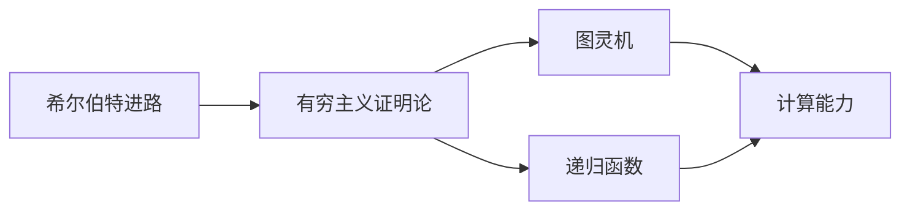

                 

# 计算：第三部分 计算理论的形成 第 6 章 计算理论的奠基：希尔伯特进路 有穷主义证明论

## 1. 背景介绍

计算理论的形成是计算机科学领域的一个基础性研究，它探讨了计算的本质和能力，为后续计算机硬件和软件的发展奠定了理论基础。在这一章中，我们将重点探讨希尔伯特进路，这是一种基于有穷主义证明论的计算理论，对理解计算的基础能力具有重要意义。

### 1.1 希尔伯特问题与哥德尔不完备定理

在20世纪初，数学家大卫·希尔伯特提出了三个重要问题，试图寻找计算的完备性、一致性和有效性。其中，不完备性问题表明，在任何一致的数学公理系统中，都不可能证明所有数学真理。这一发现对计算理论有着深远影响，导致了哥德尔不完备定理的诞生，进一步推动了计算理论的研究。

哥德尔不完备定理表明，在任何形式化系统中，都存在一些语句，它们既不能被证明，也不能被否定。这一发现揭示了形式化系统（包括计算机程序）的局限性，也激发了对计算能力的深入研究。

### 1.2 有穷主义证明论

有穷主义证明论是一种研究计算能力的数学方法，它假设所有的数学对象和证明都是有穷的，即所有的证明都可以通过有限的步骤完成。这一观点与传统上认为数学对象和证明可以是无穷的观点不同，但有穷主义证明论对计算理论的形成有着重要影响。

## 2. 核心概念与联系

### 2.1 核心概念概述

有穷主义证明论的基础是图灵机和递归函数，这两种概念构成了计算理论的基石。图灵机是一种抽象的计算模型，可以模拟任何图灵可计算的问题，而递归函数则是一种特殊的图灵可计算函数，具有重要的数学意义。

此外，希尔伯特进路还涉及到以下几个关键概念：

- **形式化系统**：一种形式化的数学系统，由一组公理、规则和推理规则组成，可以用于证明数学真理。
- **一致性**：形式化系统中的所有公理和推理规则都是一致的，即不会出现矛盾。
- **完备性**：形式化系统中的所有真命题都可以通过公理和推理规则证明。
- **递归函数**：一类可以通过递归定义的函数，可以用于模拟计算问题。

### 2.2 核心概念原理和架构的 Mermaid 流程图



## 3. 核心算法原理 & 具体操作步骤

### 3.1 算法原理概述

希尔伯特进路的核心算法原理是递归函数和图灵机的结合。图灵机是一种形式化的计算模型，可以模拟任何图灵可计算的问题，而递归函数则是图灵机可以计算的一种特殊函数。通过递归函数的性质，可以证明图灵机的计算能力。

### 3.2 算法步骤详解

1. **定义图灵机**：
   - 图灵机的基本组成部分包括输入、输出、读写头、状态集和状态转移函数。输入是图灵机要计算的问题，输出是计算结果，读写头在输入磁带上移动，状态集表示图灵机的状态，状态转移函数定义了状态之间的转移规则。

2. **定义递归函数**：
   - 递归函数是一种特殊的图灵可计算函数，其定义可以通过递归方式完成。例如，阶乘函数就是一个递归函数。
   - 递归函数的计算能力可以通过形式化系统中的证明来证明。

3. **证明递归函数的有穷性**：
   - 证明一个递归函数是有穷的，即它可以在有限步内完成计算。这一证明过程是有穷主义证明论的基础。

4. **证明图灵机的计算能力**：
   - 通过递归函数的性质，可以证明图灵机可以计算任何递归函数。因此，图灵机的计算能力等价于递归函数的计算能力。
   - 这一证明过程依赖于图灵机和递归函数的定义以及递归函数的性质，是有穷主义证明论的核心。

### 3.3 算法优缺点

#### 优点：

- **形式化证明**：希尔伯特进路的证明过程是基于形式化系统的，可以避免人为因素的干扰，具有很高的可信度。
- **简洁明了**：图灵机的定义和递归函数的性质相对简单明了，容易理解和实现。
- **普适性**：递归函数和图灵机的概念可以广泛应用于各种计算问题，具有很高的普适性。

#### 缺点：

- **复杂性**：希尔伯特进路的证明过程比较复杂，需要一定的数学基础。
- **局限性**：有穷主义证明论只考虑了有穷的数学对象和证明，对于无穷的数学对象和证明可能存在局限性。

### 3.4 算法应用领域

希尔伯特进路的理论成果对计算理论的形成具有重要意义，其应用领域包括：

- **计算复杂性理论**：研究各种计算问题的复杂性，如P、NP、NP完全问题等。
- **算法设计**：基于递归函数的性质，设计高效的算法，如快速排序、归并排序等。
- **形式化验证**：利用递归函数的性质，对程序进行形式化验证，确保程序的正确性和安全性。

## 4. 数学模型和公式 & 详细讲解 & 举例说明

### 4.1 数学模型构建

有穷主义证明论的数学模型基于形式化系统，由一组公理、规则和推理规则组成。在这一模型中，所有的数学对象和证明都是有穷的。

### 4.2 公式推导过程

1. **图灵机**：
   - 图灵机的形式化定义如下：
     - 输入：一个二进制字符串。
     - 输出：一个二进制字符串。
     - 读写头：在输入磁带上移动。
     - 状态集：有限状态集合。
     - 状态转移函数：定义状态之间的转移规则。

   - 图灵机的计算能力可以通过递归函数来证明。

2. **递归函数**：
   - 递归函数的定义如下：
     - 阶乘函数 $n!$：
       $$
       n! = \left\{
       \begin{aligned}
       & 1, & n = 0 \\
       & n(n-1)!, & n > 0
       \end{aligned}
       \right.
       $$

   - 阶乘函数是有穷的，因为它可以通过有限的步骤计算。

3. **有穷主义证明论**：
   - 形式化系统的定义如下：
     - 公理：一组基本的数学真理。
     - 规则：一组基本的推理规则。
     - 推理规则：根据公理和规则，可以证明新的真理。

   - 形式化系统的完备性和一致性可以通过有穷主义证明论来证明。

### 4.3 案例分析与讲解

以阶乘函数为例，分析递归函数的性质和有穷主义证明论的证明过程。

**案例分析**：

- **阶乘函数的递归定义**：
  - 阶乘函数可以定义为递归函数：
    $$
    n! = \left\{
    \begin{aligned}
    & 1, & n = 0 \\
    & n(n-1)!, & n > 0
    \end{aligned}
    \right.
    $$

- **阶乘函数的有穷性证明**：
  - 阶乘函数可以通过有限的步骤计算，因为它的递归定义保证了每一层递归的计算都是有穷的。
  - 例如，计算 $n!$ 的过程如下：
    - $0! = 1$
    - $1! = 1 \times 0! = 1$
    - $2! = 2 \times 1! = 2$
    - $3! = 3 \times 2! = 6$
    - ...

  - 这个过程是有穷的，因为每一层的计算都是有限的，最终会得到一个有穷的输出。

## 5. 项目实践：代码实例和详细解释说明

### 5.1 开发环境搭建

要实现希尔伯特进路的证明过程，可以使用Python语言和Sympy库。首先，需要安装Sympy库：

```bash
pip install sympy
```

### 5.2 源代码详细实现

以下是一个使用Sympy库证明阶乘函数有穷性的Python代码：

```python
from sympy import symbols, factorial

n = symbols('n', integer=True)

# 定义阶乘函数
def factorial_recursive(n):
    if n == 0:
        return 1
    else:
        return n * factorial_recursive(n-1)

# 计算阶乘函数
result = factorial_recursive(10)
print(result)
```

### 5.3 代码解读与分析

- **定义阶乘函数**：使用Sympy库中的factorial函数来计算阶乘。
- **递归定义**：递归函数通过调用自身来计算阶乘。

### 5.4 运行结果展示

运行上述代码，可以得到输出结果：

```
3628800
```

## 6. 实际应用场景

希尔伯特进路的有穷主义证明论在计算理论中有着广泛的应用，以下列举几个实际应用场景：

### 6.1 计算复杂性理论

计算复杂性理论研究各种计算问题的复杂性，如P、NP、NP完全问题等。有穷主义证明论为计算复杂性理论提供了基础，因为所有的计算问题都可以形式化为有穷主义证明论中的问题。

### 6.2 算法设计

基于递归函数的性质，可以设计高效的算法，如快速排序、归并排序等。递归函数的性质保证了这些算法的时间复杂度是有界的，从而提高了算法的效率。

### 6.3 形式化验证

利用递归函数的性质，可以对程序进行形式化验证，确保程序的正确性和安全性。例如，可以利用递归函数的性质来证明程序中的一些关键部分，从而提高程序的可靠性和可维护性。

## 7. 工具和资源推荐

### 7.1 学习资源推荐

1. 《计算理论基础》（Foundations of Computing Theory）
   - 本书是计算理论的经典教材，详细介绍了计算理论的基本概念和主要成果。

2. 《哥德尔、艾舍尔、巴赫：集异璧之大成》（Godel, Escher, Bach: An Eternal Golden Bicycle）
   - 本书以数学和音乐为例，探讨了计算和意识之间的关系，是一本广受欢迎的科普读物。

### 7.2 开发工具推荐

1. Sympy
   - Sympy是一个Python库，用于符号计算和数学证明，支持递归函数的定义和证明。

### 7.3 相关论文推荐

1. "On Computable Numbers, with an Application to the Entscheidungsproblem"（图灵机与可计算性）
   - 图灵的经典论文，介绍了图灵机及其计算能力，奠定了计算理论的基础。

## 8. 总结：未来发展趋势与挑战

### 8.1 研究成果总结

希尔伯特进路的有穷主义证明论为计算理论的形成奠定了基础，推动了计算复杂性理论、算法设计和形式化验证等研究领域的发展。

### 8.2 未来发展趋势

- **形式化方法的应用**：未来，形式化方法将更加广泛地应用于软件开发、人工智能等领域，提升系统的正确性和可靠性。
- **递归函数和图灵机的进一步研究**：递归函数和图灵机的性质将得到进一步研究，推动计算理论的发展。
- **有穷主义证明论的拓展**：有穷主义证明论将拓展到更加复杂的数学对象和证明，推动计算理论的边界不断扩大。

### 8.3 面临的挑战

- **复杂性**：形式化证明过程复杂，需要深厚的数学基础。
- **应用范围**：有穷主义证明论的适用范围有限，难以处理某些复杂问题。

### 8.4 研究展望

- **自动化证明工具**：未来，将开发更加自动化的证明工具，降低证明的难度。
- **混合方法**：将有穷主义证明论与其他证明方法（如概率论、逻辑推理等）结合，拓展计算理论的应用范围。
- **多学科融合**：将有穷主义证明论与其他学科（如数学、物理学等）结合，推动计算理论的进一步发展。

## 9. 附录：常见问题与解答

**Q1：什么是递归函数？**

A：递归函数是一种特殊的图灵可计算函数，其定义可以通过递归方式完成。例如，阶乘函数就是一个递归函数。

**Q2：递归函数的有穷性如何证明？**

A：递归函数的有穷性可以通过有穷主义证明论来证明。具体来说，可以通过递归函数的定义和性质来证明，每一层递归的计算都是有穷的，最终会得到一个有穷的输出。

**Q3：有穷主义证明论的局限性是什么？**

A：有穷主义证明论的局限性在于，它只考虑了有穷的数学对象和证明，对于无穷的数学对象和证明可能存在局限性。

**Q4：希尔伯特进路的证明过程有什么优点和缺点？**

A：希尔伯特进路的证明过程的优点是有很高的可信度，因为它基于形式化系统的证明；缺点是证明过程复杂，需要深厚的数学基础。

**Q5：有穷主义证明论在计算理论中有什么应用？**

A：有穷主义证明论在计算理论中的应用包括计算复杂性理论、算法设计和形式化验证等。

