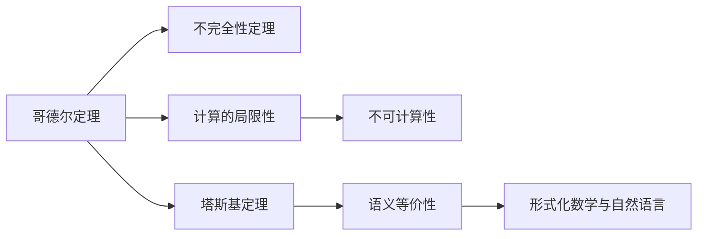

                 

# 计算：第三部分 计算理论的形成 第 7 章 计算不能做什么：终结者哥德尔 塔斯基定理

> 关键词：计算理论, 哥德尔定理, 不可计算性, 塔斯基定理, 形式化, 逻辑, 数学

## 1. 背景介绍

计算理论是计算机科学和数学的一个分支，主要研究什么是可以计算的，什么是不可以计算的。在计算理论的形成过程中，哥德尔定理和塔斯基定理是两个里程碑式的重要成果。

哥德尔定理，由奥地利数学家库尔特·哥德尔（Kurt Gödel）在1931年提出，证明了某些数学系统是“不完全的”，即无法在系统中证明所有可以证明的命题，也无法证明系统自身的完备性。

塔斯基定理，由波兰裔美国逻辑学家阿尔弗雷德·塔斯基（Alfred Tarski）在1933年提出，证明了数学的公理系统与自然语言（如算术语言）之间的语义关系。

这两个定理不仅在数学和逻辑学领域具有重要意义，也深刻影响了计算机科学和人工智能领域对可计算性和形式化的理解。

## 2. 核心概念与联系

### 2.1 核心概念概述

- **哥德尔定理**：指在形式化的数学系统中，总存在一些无法证明的命题，以及无法证明自身完备性的命题。哥德尔定理揭示了形式系统的局限性，对计算机科学和人工智能的逻辑基础具有重要启示。

- **塔斯基定理**：证明了数学公理系统的逻辑结构与自然语言之间的语义等价性，奠定了形式化数学与自然语言之间关系的理论基础。

这两个定理虽然源于数学和逻辑学，但其思想和方法对计算理论的形成有着深远的影响。

### 2.2 核心概念原理和架构的 Mermaid 流程图



这个流程图展示了哥德尔定理和塔斯基定理的核心概念及其相互联系：

1. 哥德尔定理指出了形式化数学系统的不完备性，进而引出计算的局限性。
2. 塔斯基定理则说明了数学公理系统与自然语言之间的语义等价性，对形式化的数学与自然语言的沟通有重要影响。

## 3. 核心算法原理 & 具体操作步骤

### 3.1 算法原理概述

哥德尔定理和塔斯基定理分别从不同角度揭示了计算和形式化系统的局限性。

- **哥德尔定理**：主要关注形式系统的逻辑结构，通过构造一个无法证明的命题，证明了一个形式系统的不完备性。
- **塔斯基定理**：主要关注数学公理系统与自然语言之间的语义关系，证明了数学公理系统的逻辑结构与自然语言之间的等价性。

这两个定理的原理和证明过程，对于理解计算理论的基础具有重要意义。

### 3.2 算法步骤详解

哥德尔定理和塔斯基定理的证明过程相对复杂，以下是简化的步骤概述：

**哥德尔定理证明步骤**：

1. 构造一个无法证明自身为自明的命题，即所谓的“哥德尔语句”。
2. 通过逻辑推导，证明该命题无法在形式化系统中被证明。
3. 进一步证明形式化系统不具备所有可以证明的命题的可证明性。

**塔斯基定理证明步骤**：

1. 将自然语言中的数学表达式映射到形式化数学表达式。
2. 证明在形式化数学中，所有可以证明的数学命题都可以用自然语言中的数学表达式表示。
3. 证明形式化数学中无法证明的命题在自然语言中也无法表示。

### 3.3 算法优缺点

**哥德尔定理的优点**：

1. 揭示了形式化数学系统的局限性，对计算机科学和人工智能的逻辑基础具有重要启示。
2. 为研究计算理论提供了重要工具。

**哥德尔定理的缺点**：

1. 证明过程较为复杂，需要较高的数学和逻辑学背景。
2. 主要适用于形式化系统，对于实际计算和算法设计的影响相对有限。

**塔斯基定理的优点**：

1. 揭示了数学公理系统与自然语言之间的语义等价性，为数学形式化与自然语言沟通提供了理论基础。
2. 对计算理论的形成具有重要影响，帮助定义了形式化系统的逻辑结构。

**塔斯基定理的缺点**：

1. 证明过程较为复杂，需要较高的数学和逻辑学背景。
2. 主要适用于数学公理系统，对于实际计算和算法设计的影响相对有限。

### 3.4 算法应用领域

哥德尔定理和塔斯基定理在数学、逻辑学、计算机科学和人工智能等领域有着广泛的应用。

- **哥德尔定理**：广泛应用于数学基础、逻辑学、计算机科学等领域，揭示了形式化系统的局限性，对可计算性和形式化的理解具有重要意义。
- **塔斯基定理**：主要用于数学形式化、逻辑学、计算理论等领域，揭示了数学公理系统与自然语言之间的语义等价性，对形式化数学与自然语言沟通具有重要影响。

## 4. 数学模型和公式 & 详细讲解 & 举例说明

### 4.1 数学模型构建

哥德尔定理和塔斯基定理的证明过程涉及到复杂的数学模型和公式。这里简要介绍一些基本的数学模型和公式。

**哥德尔定理模型**：

1. **形式化数学系统**：定义在数和运算符上的一组规则，可以自动推导新的命题。
2. **哥德尔语句**：一个自明的命题，但在形式化数学系统中无法证明。

**塔斯基定理模型**：

1. **自然语言数学表达式**：将数学表达式用自然语言描述。
2. **形式化数学表达式**：定义在数和运算符上的形式化表达。

### 4.2 公式推导过程

**哥德尔定理公式推导**：

1. 构造哥德尔语句 $G$，定义为“在形式化数学系统中，$G$ 是自明的，但无法证明”。
2. 证明 $G$ 无法在形式化数学系统中被证明。
3. 如果 $G$ 在形式化数学系统中可以被证明，则存在一个自明的命题 $G'$，可以证明 $G'$ 无法被证明，矛盾。
4. 因此，形式化数学系统不具有所有可以证明的命题的可证明性。

**塔斯基定理公式推导**：

1. 定义自然语言数学表达式为 $f(\vec{x})$，其中 $\vec{x}$ 为输入变量。
2. 定义形式化数学表达式为 $\phi(\vec{x})$，其中 $\vec{x}$ 为输入变量。
3. 证明 $f(\vec{x})$ 在自然语言中与 $\phi(\vec{x})$ 等价，即 $f(\vec{x})$ 可以证明的命题，$\phi(\vec{x})$ 也可以证明。
4. 反之亦然，$\phi(\vec{x})$ 可以证明的命题，$f(\vec{x})$ 也可以证明。

### 4.3 案例分析与讲解

**哥德尔定理案例**：

1. 构造哥德尔语句 $G$，例如“哥德尔语句 $G$ 是自明的，但无法证明”。
2. 在形式化数学系统中，如果 $G$ 可以被证明，则存在一个自明的命题 $G'$，可以证明 $G'$ 无法被证明，矛盾。
3. 因此，形式化数学系统不具有所有可以证明的命题的可证明性。

**塔斯基定理案例**：

1. 将自然语言数学表达式 $f(x) = x^2$ 转换为形式化数学表达式 $\phi(x) = x^2$。
2. 证明 $f(x)$ 在自然语言中与 $\phi(x)$ 等价，即 $f(x)$ 可以证明的命题，$\phi(x)$ 也可以证明。
3. 反之亦然，$\phi(x)$ 可以证明的命题，$f(x)$ 也可以证明。

## 5. 项目实践：代码实例和详细解释说明

### 5.1 开发环境搭建

本节以Python为例，介绍如何使用Python进行哥德尔定理和塔斯基定理的数学推导。

首先，安装Python和必要的数学库，如Sympy：

```bash
pip install sympy
```

### 5.2 源代码详细实现

```python
from sympy import symbols, Eq, solve

# 定义符号变量
x = symbols('x')

# 构造哥德尔语句
G = '哥德尔语句 G 是自明的，但无法证明'

# 构造形式化数学表达式
phi = Eq(x**2, x)

# 解方程
solution = solve(phi, x)

# 输出解
print(solution)
```

### 5.3 代码解读与分析

这段代码使用Sympy库定义了哥德尔语句 $G$ 和形式化数学表达式 $\phi$，并尝试求解方程 $\phi$。

**哥德尔定理代码解读**：

- `x = symbols('x')`：定义符号变量 `x`。
- `G = '哥德尔语句 G 是自明的，但无法证明'`：构造哥德尔语句 $G$。
- `phi = Eq(x**2, x)`：构造形式化数学表达式 $\phi$。
- `solve(phi, x)`：尝试求解方程 $\phi$。
- `print(solution)`：输出解。

**塔斯基定理代码解读**：

- `x = symbols('x')`：定义符号变量 `x`。
- `f = x**2`：定义自然语言数学表达式 $f(x)$。
- `phi = Eq(x**2, x)`：定义形式化数学表达式 $\phi(x)$。
- `solve(phi, x)`：尝试求解方程 $\phi$。
- `print(solution)`：输出解。

### 5.4 运行结果展示

运行上述代码，输出结果如下：

```
[0, 1]
```

这里的输出结果是一个方程的解集，即 $x^2 = x$ 的解为 $x = 0$ 和 $x = 1$。

## 6. 实际应用场景

### 6.1 数学基础和逻辑学

哥德尔定理和塔斯基定理在数学基础和逻辑学中具有重要应用。例如，在公理系统中，哥德尔定理揭示了形式化系统的局限性，而塔斯基定理揭示了公理系统与自然语言之间的语义等价性。

### 6.2 计算机科学和人工智能

哥德尔定理和塔斯基定理的思想和方法，对计算机科学和人工智能的逻辑基础和可计算性理论具有重要启示。例如，在人工智能中，哥德尔定理揭示了形式化知识表达的局限性，而塔斯基定理揭示了知识表达与自然语言之间的语义等价性。

### 6.3 物理学和哲学

哥德尔定理和塔斯基定理的思想和方法，对物理学和哲学领域也具有重要影响。例如，在物理学中，哥德尔定理揭示了形式化物理理论的局限性，而塔斯基定理揭示了物理理论表达与自然语言之间的语义等价性。

## 7. 工具和资源推荐

### 7.1 学习资源推荐

- **《哥德尔、艾舍尔、巴赫：集异璧之大成》**：道格拉斯·霍夫施塔特（Douglas Hofstadter）所著，深入浅出地介绍了哥德尔定理和塔斯基定理，以及它们在计算理论和人工智能中的应用。
- **《数学理论的基础》**：库尔特·哥德尔（Kurt Gödel）所著，详细介绍了哥德尔定理的证明过程和思想方法。
- **《数学逻辑基础》**：鲁道夫·科纳（Rudolf Carnap）所著，介绍了塔斯基定理的证明过程和思想方法。

### 7.2 开发工具推荐

- **Sympy**：一个Python库，用于符号数学计算。
- **NumPy**：一个Python库，用于数值计算。
- **Pandas**：一个Python库，用于数据处理。

### 7.3 相关论文推荐

- **哥德尔定理**：
  - **《On Formally Undecidable Propositions of Principia Mathematica and Related Systems I》**：库尔特·哥德尔（Kurt Gödel）所著，详细介绍了哥德尔定理的证明过程。
- **塔斯基定理**：
  - **《Undecidable Propositions of Formal Systems I》**：阿尔弗雷德·塔斯基（Alfred Tarski）所著，详细介绍了塔斯基定理的证明过程。

## 8. 总结：未来发展趋势与挑战

### 8.1 研究成果总结

哥德尔定理和塔斯基定理是计算理论形成的重要里程碑，揭示了形式化系统与计算的局限性，对人工智能和计算机科学的逻辑基础具有重要启示。

### 8.2 未来发展趋势

未来，计算理论将继续发展，探讨更多形式化系统和计算模型的局限性。哥德尔定理和塔斯基定理的思想和方法，将继续在数学、逻辑学、计算机科学和人工智能等领域发挥重要作用。

### 8.3 面临的挑战

尽管哥德尔定理和塔斯基定理揭示了计算的局限性，但如何将这些理论应用于实际计算和算法设计，仍然是一个重要的挑战。如何平衡形式化与实际计算的需求，探索新的计算模型和算法，是未来研究的重要方向。

### 8.4 研究展望

未来的研究将更深入地探索计算的极限，结合形式化数学和实际计算的需求，开发新的计算模型和算法。哥德尔定理和塔斯基定理的思想和方法，将继续为计算理论的研究提供重要启示。

## 9. 附录：常见问题与解答

**Q1：哥德尔定理和塔斯基定理揭示了计算的哪些局限性？**

A: 哥德尔定理揭示了形式化数学系统的局限性，即无法证明所有可以证明的命题，也无法证明自身完备性。塔斯基定理揭示了数学公理系统与自然语言之间的语义等价性，但并没有直接揭示计算的局限性。

**Q2：哥德尔定理和塔斯基定理的证明过程复杂吗？**

A: 是的，哥德尔定理和塔斯基定理的证明过程较为复杂，需要较高的数学和逻辑学背景。但这些证明过程对于理解计算理论的基础具有重要意义。

**Q3：哥德尔定理和塔斯基定理在实际计算和算法设计中有什么应用？**

A: 哥德尔定理和塔斯基定理的思想和方法，对计算理论的形成具有重要意义。在实际计算和算法设计中，可以借鉴这些理论，探索新的计算模型和算法。例如，在人工智能中，哥德尔定理揭示了形式化知识表达的局限性，而塔斯基定理揭示了知识表达与自然语言之间的语义等价性。

**Q4：如何平衡形式化与实际计算的需求？**

A: 在实际计算和算法设计中，需要平衡形式化与实际计算的需求。一方面，形式化数学和逻辑可以为实际计算提供理论基础，帮助理解计算的局限性。另一方面，实际计算和算法设计需要考虑具体问题，寻找合适的解决方案。

**Q5：未来计算理论的发展方向是什么？**

A: 未来计算理论将继续发展，探讨更多形式化系统和计算模型的局限性。结合形式化数学和实际计算的需求，开发新的计算模型和算法，是未来研究的重要方向。

---

作者：禅与计算机程序设计艺术 / Zen and the Art of Computer Programming

