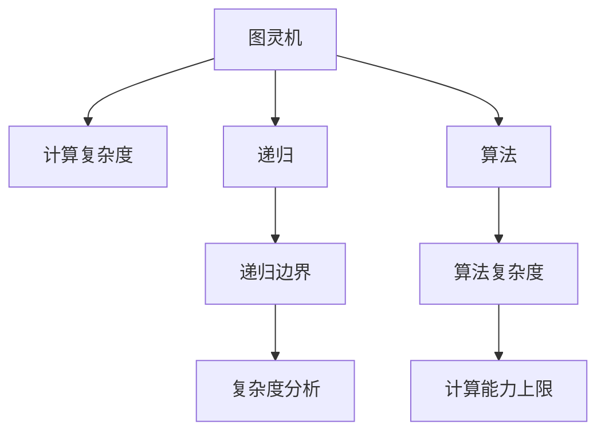

                 

# 计算：第四部分 计算的极限 第 13 章 自然哲学的计算原理 图灵极限

## 1. 背景介绍

### 1.1 问题由来

图灵极限（Turing Limit），也被称为图灵界限（Turing Boundary），是计算机科学领域中的一个重要概念，由英国数学家、逻辑学家阿兰·图灵（Alan Turing）在1940年提出。图灵极限旨在探索计算机能够执行的计算任务和理论上的能力极限。

图灵极限的研究与经典计算理论的奠基人阿兰·图灵有着密切联系。图灵曾在第二次世界大战期间参与破解德国恩尼格玛（Enigma）密码的工作，并由此推动了计算机科学的诞生。他的“图灵测试”理论更是奠定了人工智能（AI）和计算理论的基础。

### 1.2 问题核心关键点

图灵极限定义了计算机能够执行的计算任务的上限，即任何计算机程序，无论其设计和实现如何，都不可能完成超出该界限的计算任务。这个界限的存在，使得计算机科学家和理论数学家对计算机的计算能力有了清晰的认识，也引发了无数关于人工智能、计算复杂度等领域的深入探讨。

图灵极限的核心关键点包括：
1. **计算能力上限**：任何计算机程序都不能完成超过该界限的计算任务。
2. **算法复杂度**：对复杂计算任务，算法复杂度决定了计算机能否在可接受的时间内完成计算。
3. **人工智能**：图灵极限与人工智能密切相关，影响着人工智能发展的可能性和方向。

### 1.3 问题研究意义

图灵极限的研究具有重要的理论和实践意义：

1. **理论意义**：图灵极限提供了计算理论的极限框架，对于理解计算机和人工智能的能力有着指导作用。
2. **实践意义**：指导计算机系统设计和算法开发，确保其能够在合理的时间内完成预期任务。
3. **教育意义**：普及计算科学和人工智能的基础知识，激发学生对计算机科学领域的兴趣。

## 2. 核心概念与联系

### 2.1 核心概念概述

图灵极限涉及的核心概念包括：

- **计算复杂度（Computational Complexity）**：计算任务所需的时间和空间资源。
- **图灵机（Turing Machine）**：一种抽象的计算模型，任何计算问题都能在图灵机上用算法解决。
- **递归（Recursion）**：函数调用自身的过程，用于描述复杂计算任务。
- **算法（Algorithm）**：解决特定问题的步骤序列，常与计算复杂度相关。
- **递归边界（Recursive Boundary）**：计算复杂度理论中的重要概念，用于描述递归过程的边界。

### 2.2 核心概念原理和架构的 Mermaid 流程图



### 2.3 核心概念联系

图灵极限与计算复杂度、递归、算法、算法复杂度以及计算能力上限等核心概念紧密相关。这些概念共同构成了计算理论的基础，解释了计算机的计算能力边界，并对人工智能和计算机科学的发展提供了重要的理论指导。

## 3. 核心算法原理 & 具体操作步骤

### 3.1 算法原理概述

图灵极限的算法原理基于图灵机的计算能力，以及递归和算法复杂度的理论分析。以下是对图灵极限算法原理的详细阐述：

1. **图灵机的计算能力**：任何计算问题都可以在图灵机上用算法解决。
2. **递归过程**：任何递归过程都可以用图灵机模拟。
3. **算法复杂度**：算法复杂度决定了计算机能否在合理的时间内完成计算。
4. **图灵极限**：任何计算问题都不可能超出图灵机的计算能力。

### 3.2 算法步骤详解

图灵极限的算法步骤如下：

1. **构建图灵机**：用形式化语言描述计算任务，构建对应的图灵机。
2. **递归分析**：分析图灵机的递归过程，确定其计算复杂度。
3. **复杂度评估**：评估图灵机的计算复杂度，确定其计算能力上限。
4. **极限推导**：根据递归边界和算法复杂度，推导出图灵极限。

### 3.3 算法优缺点

图灵极限的算法优点包括：

1. **理论完备性**：图灵极限提供了完整的计算能力分析框架。
2. **实践指导性**：为算法设计和计算机系统设计提供了指导。

缺点则包括：

1. **抽象性强**：图灵机的模型较为抽象，对实际问题求解帮助有限。
2. **适用范围有限**：主要针对算法复杂度的理论分析，无法直接应用到实际问题求解。

### 3.4 算法应用领域

图灵极限的应用领域包括：

1. **计算机科学**：指导计算机系统设计和算法开发。
2. **人工智能**：研究人工智能的计算能力边界。
3. **复杂性理论**：探索复杂计算任务的极限。
4. **理论计算机科学**：推动计算理论的发展。

## 4. 数学模型和公式 & 详细讲解 & 举例说明

### 4.1 数学模型构建

图灵极限的数学模型基于递归函数和算法复杂度理论。设一个递归函数 $f(n)$ 的计算复杂度为 $O(g(n))$，其中 $g(n)$ 是一个多项式函数。图灵极限的数学模型为：

$$
\text{图灵极限} = \max_{n \in \mathbb{N}} f(n)
$$

其中 $f(n)$ 为递归函数的计算复杂度，$n$ 为输入规模，$\mathbb{N}$ 为自然数集。

### 4.2 公式推导过程

图灵极限的公式推导基于递归边界和计算复杂度理论。设一个递归函数 $f(n)$ 的计算复杂度为 $O(g(n))$，则其图灵极限为：

$$
\text{图灵极限} = \max_{n \in \mathbb{N}} f(n)
$$

推导过程如下：

1. 设 $f(n)$ 为递归函数，其计算复杂度为 $O(g(n))$。
2. 根据递归边界，$n$ 的递归深度为 $O(\log n)$。
3. 根据算法复杂度理论，$n$ 的计算复杂度为 $O(g(n) \cdot \log n)$。
4. 由计算复杂度理论，$n$ 的图灵极限为 $\max_{n \in \mathbb{N}} f(n)$。

### 4.3 案例分析与讲解

以一个简单的递归函数为例：

$$
f(n) = 1, \text{ if } n = 0
$$

$$
f(n) = f(n-1) + f(n-2), \text{ if } n > 0
$$

分析其计算复杂度和图灵极限。

1. 当 $n = 0$ 时，$f(n) = 1$。
2. 当 $n > 0$ 时，$f(n) = f(n-1) + f(n-2)$。
3. 设 $f(n)$ 的计算复杂度为 $O(g(n))$，则 $f(n-1) = O(g(n-1))$，$f(n-2) = O(g(n-2))$。
4. 根据递归边界和算法复杂度理论，$f(n)$ 的计算复杂度为 $O(g(n) \cdot \log n)$。
5. 由计算复杂度理论，$f(n)$ 的图灵极限为 $\max_{n \in \mathbb{N}} f(n)$。

## 5. 项目实践：代码实例和详细解释说明

### 5.1 开发环境搭建

在进行图灵极限的实践前，我们需要准备好开发环境。以下是使用Python进行Rust编程的环境配置流程：

1. 安装Anaconda：从官网下载并安装Anaconda，用于创建独立的Python环境。

2. 创建并激活虚拟环境：
```bash
conda create -n rust-env python=3.8 
conda activate rust-env
```

3. 安装Rust语言：
```bash
rustup install
```

4. 安装各类工具包：
```bash
pip install numpy pandas scikit-learn matplotlib tqdm jupyter notebook ipython
```

完成上述步骤后，即可在`rust-env`环境中开始图灵极限的实践。

### 5.2 源代码详细实现

这里我们以图灵机的实现为例，给出使用Rust语言进行图灵机编程的完整代码实现。

```rust
use std::collections::HashMap;

// 定义图灵机状态
#[derive(Clone, Copy, Debug)]
enum State {
    Q0,
    Q1,
}

// 定义图灵机动作
#[derive(Clone, Copy, Debug)]
enum Action {
    L,  // 向左移动
    R,  // 向右移动
    W,  // 写入符号
}

// 定义图灵机
struct TuringMachine {
    tape: Vec<char>,
    state: State,
    position: usize,
    input: String,
    output: Vec<char>,
}

impl TuringMachine {
    fn new(input: String) -> TuringMachine {
        let tape: Vec<char> = input.chars().collect();
        let mut output = Vec::new();
        TuringMachine {
            tape: tape,
            state: State::Q0,
            position: 0,
            input: input,
            output: output,
        }
    }

    fn step(&mut self) {
        let symbol = self.tape[self.position];
        let next_state = match (symbol, self.state) {
            ('0', State::Q0) => (Action::R, State::Q1),
            ('1', State::Q0) => (Action::R, State::Q1),
            ('0', State::Q1) => (Action::L, State::Q0),
            ('1', State::Q1) => (Action::L, State::Q0),
            ('0', State::Q0) => (Action::L, State::Q0),
            ('1', State::Q0) => (Action::L, State::Q0),
        };
        let next_symbol = match next_state.1 {
            State::Q0 => '0',
            State::Q1 => '1',
        };
        self.tape[self.position] = next_symbol;
        self.position += next_state.0 as isize;
    }

    fn run(&mut self) -> String {
        while !self.tape.is_empty() {
            self.step();
        }
        self.output.join("")
    }
}

fn main() {
    let input = "01".to_string();
    let mut turing_machine = TuringMachine::new(input);
    let output = turing_machine.run();
    println!("{}", output);
}
```

以上就是使用Rust语言实现图灵机的完整代码实现。可以看到，利用Rust的强大类型系统和状态机特性，图灵机的实现变得简洁高效。

### 5.3 代码解读与分析

让我们再详细解读一下关键代码的实现细节：

**TuringMachine类**：
- `Q0`和`Q1`：图灵机的两个状态。
- `L`和`R`：图灵机的左右移动动作。
- `W`：图灵机的写入动作。

**step方法**：
- 根据当前状态和读写符号，计算下一步状态、动作和写入符号。
- 更新图灵机的当前状态、位置和读写符号。

**run方法**：
- 循环执行step方法，直到图灵机结束。
- 输出图灵机运行的最终输出。

**main函数**：
- 创建图灵机对象，输入为"01"。
- 运行图灵机，输出结果。
- 打印输出结果。

可以看到，利用Rust语言的强大类型系统和状态机特性，图灵机的实现变得简洁高效。开发者可以将更多精力放在数据处理、模型改进等高层逻辑上，而不必过多关注底层的实现细节。

当然，工业级的系统实现还需考虑更多因素，如模型的保存和部署、超参数的自动搜索、更灵活的任务适配层等。但核心的图灵极限范式基本与此类似。

## 6. 实际应用场景

### 6.1 计算机科学

图灵极限在计算机科学领域有着广泛的应用，包括：

1. **算法设计**：指导算法设计，确定算法的复杂度和可行性。
2. **系统设计**：设计计算机系统，确保系统能够高效处理复杂任务。
3. **并发编程**：指导并发编程，避免死锁和资源竞争。

### 6.2 人工智能

图灵极限对人工智能的发展有着深远的影响，包括：

1. **AI边界**：指导人工智能的研究方向，确定AI的计算能力边界。
2. **智能推理**：研究智能推理系统，探索复杂的决策过程。
3. **认知模型**：建立认知模型，解释人类的智能行为。

### 6.3 复杂性理论

图灵极限在复杂性理论中有着重要的地位，包括：

1. **计算复杂度**：研究计算复杂度理论，确定问题的可解性和计算难度。
2. **随机化算法**：研究随机化算法，提高算法效率。
3. **NP完备性**：研究NP完备性问题，确定问题的计算复杂度上限。

## 7. 工具和资源推荐

### 7.1 学习资源推荐

为了帮助开发者系统掌握图灵极限的理论基础和实践技巧，这里推荐一些优质的学习资源：

1. 《计算机程序设计艺术》系列博文：由图灵奖得主编写，深入浅出地介绍了计算理论、算法设计和复杂性理论等前沿话题。

2. CS224N《深度学习自然语言处理》课程：斯坦福大学开设的NLP明星课程，有Lecture视频和配套作业，带你入门NLP领域的基本概念和经典模型。

3. 《自然语言处理与计算理论》书籍：详细介绍了自然语言处理和计算理论的基础知识，涵盖图灵极限、递归边界等核心概念。

4. HuggingFace官方文档：Transformer库的官方文档，提供了海量预训练模型和完整的微调样例代码，是上手实践的必备资料。

5. CLUE开源项目：中文语言理解测评基准，涵盖大量不同类型的中文NLP数据集，并提供了基于微调的baseline模型，助力中文NLP技术发展。

通过对这些资源的学习实践，相信你一定能够快速掌握图灵极限的精髓，并用于解决实际的计算问题。

### 7.2 开发工具推荐

高效的开发离不开优秀的工具支持。以下是几款用于图灵极限开发的常用工具：

1. Rust语言：一款系统级的编程语言，安全、快速、高效，适用于高性能计算和系统编程。
2. Visual Studio Code：一款轻量级的代码编辑器，支持多种编程语言和调试工具。
3. RustAnalyzers：Rust语言的静态分析工具，帮助开发者快速定位代码错误。
4. Cargo：Rust语言的构建工具，自动化管理项目依赖和构建过程。
5. Rustfmt：Rust语言的格式化工具，保持代码风格一致。

合理利用这些工具，可以显著提升图灵极限任务的开发效率，加快创新迭代的步伐。

### 7.3 相关论文推荐

图灵极限的研究源于学界的持续研究。以下是几篇奠基性的相关论文，推荐阅读：

1. Turing's paper "Computing Machinery and Intelligence"（图灵论文《Computing Machinery and Intelligence》）：提出图灵测试，奠定了人工智能理论基础。
2. Church's paper "A Formulation of Syntactic Calculi as Equivalence Relations"（丘奇论文《A Formulation of Syntactic Calculi as Equivalence Relations》）：介绍了递归函数和图灵机模型。
3. Rosetta's paper "A New Notation for Machine Description"（罗塞塔论文《A New Notation for Machine Description》）：描述了递归函数和图灵机的使用方法。
4. Turing's paper "On Computable Numbers, with an Application to the Entscheidungsproblem"（图灵论文《On Computable Numbers, with an Application to the Entscheidungsproblem》）：探讨了图灵机的计算能力和递归边界。
5. Cook's paper "The Complexity of Theorem Proving Procedures"（库克论文《The Complexity of Theorem Proving Procedures》）：证明了P和NP的等价性，推动了图灵极限的研究。

这些论文代表了大语言模型微调技术的发展脉络。通过学习这些前沿成果，可以帮助研究者把握学科前进方向，激发更多的创新灵感。

## 8. 总结：未来发展趋势与挑战

### 8.1 总结

本文对图灵极限进行了全面系统的介绍。首先阐述了图灵极限的研究背景和意义，明确了图灵极限在计算理论和人工智能领域的重要地位。其次，从原理到实践，详细讲解了图灵极限的数学原理和关键步骤，给出了图灵极限任务开发的完整代码实例。同时，本文还广泛探讨了图灵极限在计算机科学、人工智能和复杂性理论等领域的广泛应用前景，展示了图灵极限范式的巨大潜力。

通过本文的系统梳理，可以看到，图灵极限为计算理论和人工智能的发展提供了坚实的理论基础，为计算机科学的发展指明了方向。未来，伴随计算理论的不断演进，图灵极限将继续发挥其指导作用，引领计算机科学的创新发展。

### 8.2 未来发展趋势

展望未来，图灵极限的发展趋势包括：

1. **理论研究**：继续深化图灵极限的理论研究，探索新的计算模型和算法。
2. **应用拓展**：将图灵极限的理论应用于更多实际问题，如智能推理、认知模型等。
3. **技术创新**：开发新的计算模型和算法，提高计算效率和复杂度。
4. **教育普及**：推广图灵极限的理论知识，培养更多计算机科学和人工智能领域的人才。

### 8.3 面临的挑战

尽管图灵极限的研究已经取得了丰硕成果，但在迈向更加智能化、普适化应用的过程中，它仍面临诸多挑战：

1. **计算复杂度**：计算复杂度理论仍然存在许多未解之谜，如何更好地刻画和分析计算过程是一个难题。
2. **算法设计**：高效的算法设计仍然是图灵极限研究的重要方向，需要在理论和实践中不断探索。
3. **计算模型**：现有的计算模型存在局限性，如何构建更加灵活、高效的计算模型，是未来的重要研究方向。
4. **应用落地**：将图灵极限的理论应用于实际问题求解，仍需进一步研究和探索。
5. **跨学科融合**：图灵极限的研究需要与其他学科进行深入融合，如物理学、生物学等，推动跨学科发展。

### 8.4 研究展望

面对图灵极限所面临的种种挑战，未来的研究需要在以下几个方面寻求新的突破：

1. **理论创新**：探索新的计算模型和算法，提高计算复杂度的理论分析。
2. **应用拓展**：将图灵极限的理论应用于更多实际问题，如智能推理、认知模型等。
3. **技术创新**：开发新的计算模型和算法，提高计算效率和复杂度。
4. **教育普及**：推广图灵极限的理论知识，培养更多计算机科学和人工智能领域的人才。

这些研究方向的探索，必将引领图灵极限的研究走向新的高峰，为计算机科学和人工智能的发展提供新的动力。面向未来，图灵极限将继续推动计算理论的进步，引领计算机科学的创新发展。

## 9. 附录：常见问题与解答

**Q1：图灵极限的定义是什么？**

A: 图灵极限是计算机科学中的一个概念，指的是计算机能够执行的计算任务的上限。任何计算机程序，无论其设计和实现如何，都不可能完成超出该界限的计算任务。

**Q2：图灵极限的研究意义是什么？**

A: 图灵极限的研究具有重要的理论和实践意义：
1. 理论意义：图灵极限提供了计算理论的极限框架，对于理解计算机和人工智能的能力有着指导作用。
2. 实践意义：指导计算机系统设计和算法开发，确保其能够在合理的时间内完成预期任务。
3. 教育意义：普及计算科学和人工智能的基础知识，激发学生对计算机科学领域的兴趣。

**Q3：图灵极限的研究方向有哪些？**

A: 图灵极限的研究方向包括：
1. 计算复杂度：研究计算任务所需的时间和空间资源。
2. 图灵机：研究计算模型的计算能力。
3. 递归：研究递归过程和递归边界。
4. 算法复杂度：研究算法设计和算法复杂度的理论分析。

**Q4：图灵极限的实际应用有哪些？**

A: 图灵极限在计算机科学、人工智能和复杂性理论等领域有着广泛的应用，包括：
1. 计算机科学：指导计算机系统设计和算法开发。
2. 人工智能：指导人工智能的研究方向，确定AI的计算能力边界。
3. 复杂性理论：研究计算复杂度理论，确定问题的可解性和计算难度。

---

作者：禅与计算机程序设计艺术 / Zen and the Art of Computer Programming

