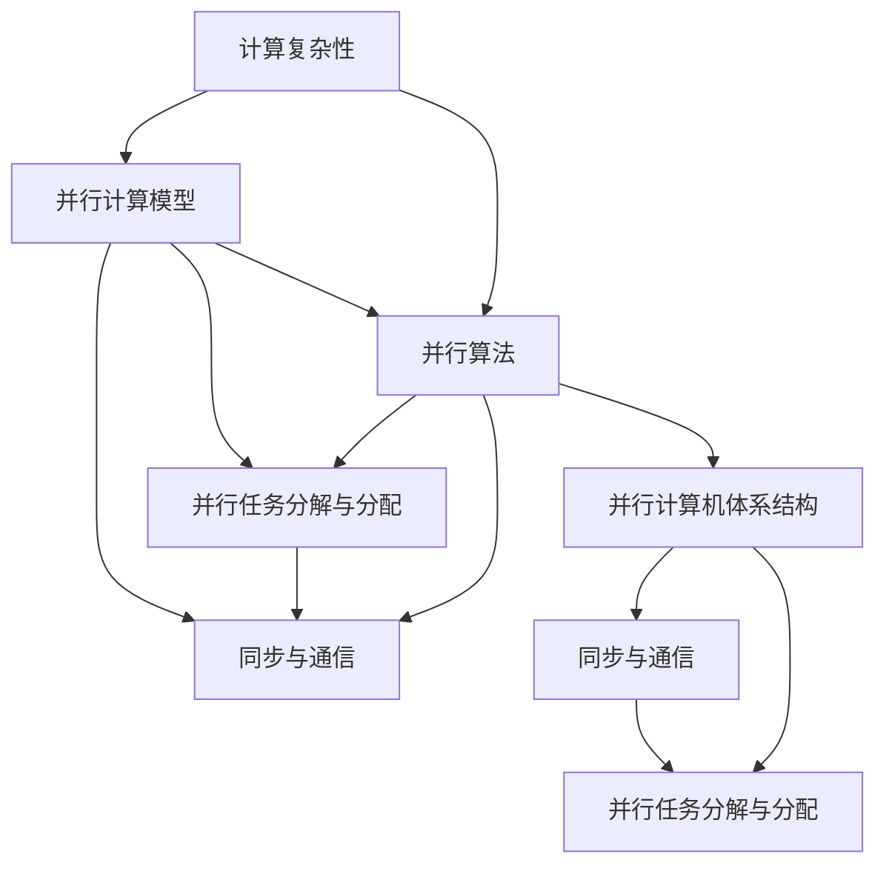

                 

# 计算：第四部分 计算的极限 第 9 章 计算复杂性 并行计算

> 关键词：计算复杂性, 并行计算, 计算模型的复杂度, 并行计算的算法, 并行计算模型, 并行计算机体系结构

## 1. 背景介绍

在现代计算机科学中，计算复杂性理论是研究计算问题所需计算资源的性质，特别是时间和空间资源的需求。它不仅对理论计算机科学具有重要意义，还对实际问题求解具有指导作用。在实际应用中，并行计算作为提高计算效率的重要手段，日益成为计算复杂性理论研究的焦点。

### 1.1 问题由来
现代计算机系统的处理能力在不断提升，处理器的计算能力已达到每秒数万亿次浮点运算。但即使是强大的超级计算机，面对某些复杂计算任务时，仍然显得力不从心。这促使研究者不断探索新的计算方法，以提高计算效率。

并行计算通过同时利用多个处理器或计算机来处理一个计算任务的不同部分，实现了计算效率的显著提升。其核心思想是将大任务分解为多个小任务，由多个处理器并行执行，从而在时间上大大缩短计算时间。

### 1.2 问题核心关键点
并行计算的核心在于：
- **任务分解与分配**：将大任务分解为多个子任务，并在多个处理器上并行执行。
- **同步与通信**：在并行执行过程中，处理器之间需要同步数据和状态，以确保计算结果的一致性。
- **优化与调度**：优化任务执行顺序和处理器使用策略，以达到最佳的计算效率。

在实际应用中，并行计算面临诸多挑战，如任务分解的粒度、通信开销、同步机制的选择等，这些都需要精心设计和优化。

### 1.3 问题研究意义
研究并行计算方法对于提升计算效率，解决复杂计算问题，以及推动高性能计算应用的发展具有重要意义：

- **提高计算效率**：通过并行计算，可以显著降低单个任务的计算时间，加速复杂计算问题的求解。
- **优化资源利用**：并行计算使得多个处理器可以同时使用，提高了计算机资源的使用效率。
- **支持大规模数据处理**：并行计算能够处理海量数据，支持数据分析和机器学习等高吞吐量应用。
- **推动科学计算**：并行计算在物理学、天文学、生物学等领域的应用，推动了科学研究的发展。
- **支撑工业应用**：例如金融、交通、医疗等领域，并行计算已成为优化性能的重要手段。

## 2. 核心概念与联系

### 2.1 核心概念概述

并行计算涉及多个相关概念：

- **计算复杂性**：描述计算问题所需计算资源的需求，包括时间复杂度和空间复杂度。
- **并行计算模型**：描述并行计算机执行计算任务的方式，包括数据并行、任务并行、计算并行等。
- **并行算法**：描述如何在一个或多个处理器上并行执行计算任务，以实现计算效率的提升。
- **并行计算机体系结构**：描述并行计算机的硬件和软件结构，包括处理器、存储器、通信网络等。
- **并行任务分解与分配**：将大任务分解为多个子任务，并在多个处理器上并行执行。
- **同步与通信**：在并行执行过程中，处理器之间需要同步数据和状态，以确保计算结果的一致性。

这些概念之间的逻辑关系可以通过以下Mermaid流程图来展示：



这个流程图展示并行计算的核心概念及其之间的关系：

1. 计算复杂性描述计算资源的需求。
2. 并行计算模型描述计算任务的执行方式。
3. 并行算法描述任务在多个处理器上的并行执行。
4. 并行任务分解与分配将大任务分解为多个子任务。
5. 同步与通信确保并行执行过程中的数据一致性。
6. 并行计算机体系结构支撑并行计算硬件和软件结构。

这些概念共同构成了并行计算的基础，使其能够在多处理器系统上高效执行计算任务。

## 3. 核心算法原理 & 具体操作步骤

### 3.1 算法原理概述

并行计算的核心算法包括：

- **MapReduce算法**：将计算任务分解为Map和Reduce两个步骤，通过并行执行Map任务和Reduce任务，实现高效计算。
- **MPI算法**：通过消息传递接口（MPI）实现多个处理器之间的通信，支持数据并行计算。
- **GPU并行计算**：利用图形处理单元（GPU）进行并行计算，显著提升计算效率。
- **分布式计算**：通过分布式计算框架（如Hadoop、Spark）实现任务在不同节点上的并行执行。

并行计算的算法原理在于将大任务分解为多个子任务，并在多个处理器上并行执行，从而在时间上缩短计算时间。同时，处理器之间的同步和通信机制确保了计算结果的一致性。

### 3.2 算法步骤详解

以下是并行计算的核心算法步骤：

**Step 1: 任务分解与分配**

- **Map任务**：将大任务分解为多个子任务，每个子任务独立执行，不依赖其他任务。
- **Reduce任务**：对Map任务的结果进行合并和汇总，最终得到整个任务的计算结果。

**Step 2: 同步与通信**

- **通信机制**：在Map任务和Reduce任务之间传递中间结果。
- **同步机制**：确保处理器之间的数据一致性，如使用锁、屏障等机制。

**Step 3: 计算与优化**

- **计算过程**：在Map和Reduce任务中执行计算。
- **优化策略**：如数据划分、任务调度、负载均衡等。

**Step 4: 结果合并与输出**

- **Reduce任务**：将各个Map任务的结果进行合并和汇总，得到最终计算结果。
- **输出过程**：将结果输出到文件或数据库中。

### 3.3 算法优缺点

并行计算的优点包括：
- **高效性**：通过并行执行任务，显著提高计算效率。
- **可扩展性**：可以方便地增加处理器，提高系统处理能力。
- **容错性**：并行计算系统的某个处理器出现故障时，其他处理器可以继续执行任务，保证系统可靠性。

并行计算的缺点包括：
- **复杂性**：并行计算需要设计复杂的任务分解和同步机制，增加了开发难度。
- **通信开销**：处理器之间的通信增加了额外开销，可能影响计算效率。
- **资源竞争**：多个处理器同时访问共享资源，可能导致资源竞争和冲突。

### 3.4 算法应用领域

并行计算的应用领域包括：

- **科学计算**：如气象模拟、流体力学计算、物理模拟等。
- **数据处理**：如大规模数据挖掘、数据分析、机器学习等。
- **图形处理**：如计算机图形学、游戏开发、虚拟现实等。
- **云计算**：如云计算平台、分布式存储系统等。
- **金融计算**：如高频交易、风险评估、数据分析等。
- **医疗计算**：如医学影像处理、基因组学分析等。
- **人工智能**：如深度学习、自然语言处理等。

## 4. 数学模型和公式 & 详细讲解 & 举例说明

### 4.1 数学模型构建

并行计算的数学模型主要涉及时间复杂度和空间复杂度：

- **时间复杂度**：描述并行计算所需时间资源的需求。
- **空间复杂度**：描述并行计算所需空间资源的需求。

并行计算的时间复杂度和空间复杂度可以通过以下公式计算：

$$
T(n) = O(f(n))
$$

$$
S(n) = O(g(n))
$$

其中 $T(n)$ 为时间复杂度，$S(n)$ 为空间复杂度，$f(n)$ 和 $g(n)$ 为计算所需资源的需求函数。

### 4.2 公式推导过程

以下是并行计算时间复杂度和空间复杂度的推导过程：

**时间复杂度推导**

设 $n$ 为计算任务的规模，$T_1(n)$ 和 $T_2(n)$ 分别为单处理器和 $p$ 个处理器执行任务的时间复杂度，则并行计算的时间复杂度为：

$$
T(n) = T_1(n) + (p-1)T_2(n)
$$

**空间复杂度推导**

设 $S_1(n)$ 和 $S_2(n)$ 分别为单处理器和 $p$ 个处理器执行任务的空间复杂度，则并行计算的空间复杂度为：

$$
S(n) = S_1(n) + (p-1)S_2(n)
$$

### 4.3 案例分析与讲解

以MapReduce算法为例，分析其时间复杂度和空间复杂度：

- **Map任务**：时间复杂度为 $O(n)$，空间复杂度为 $O(1)$。
- **Reduce任务**：时间复杂度为 $O(n)$，空间复杂度为 $O(n)$。

因此，MapReduce算法的时间复杂度为 $O(n)$，空间复杂度为 $O(n)$。

## 5. 项目实践：代码实例和详细解释说明

### 5.1 开发环境搭建

进行并行计算开发，需要以下开发环境：

- **编程语言**：C++、Python、Java等，用于编写并行计算程序。
- **并行计算框架**：如MPI、OpenMP、CUDA等，用于实现并行计算。
- **分布式计算框架**：如Hadoop、Spark等，用于处理大规模数据。
- **高性能计算集群**：如使用SGI、IBM、Intel等超级计算机。

以下是使用Python进行MapReduce算法的开发环境配置流程：

1. 安装Anaconda：从官网下载并安装Anaconda，用于创建独立的Python环境。

2. 创建并激活虚拟环境：
```bash
conda create -n pytorch-env python=3.8 
conda activate pytorch-env
```

3. 安装PyTorch：根据CUDA版本，从官网获取对应的安装命令。例如：
```bash
conda install pytorch torchvision torchaudio cudatoolkit=11.1 -c pytorch -c conda-forge
```

4. 安装并行计算库：
```bash
pip install dask distributed
```

5. 安装各类工具包：
```bash
pip install numpy pandas scikit-learn matplotlib tqdm jupyter notebook ipython
```

完成上述步骤后，即可在`pytorch-env`环境中开始并行计算实践。

### 5.2 源代码详细实现

以下是使用PyTorch和Dask进行MapReduce算法的Python代码实现：

```python
import dask.distributed
import dask.bag as db
import torch
import numpy as np

# 创建Dask集群
client = dask.distributed.Client('localhost:8786')

# 定义Map任务
def map_task(key, value):
    return key * 2, value

# 定义Reduce任务
def reduce_task(acc, value):
    return acc + value

# 输入数据
data = db.from_sequence(range(1, 1001), nbytes=10**6)

# 并行计算
map_result = client.submit(map_task, map_key=key, map_value=value, chunks=10)
reduce_result = client.submit(reduce_task, acc=0, value=0, chunks=10)

# 输出结果
print(reduce_result.result())
```

### 5.3 代码解读与分析

让我们再详细解读一下关键代码的实现细节：

**dask.distributed.Client**：
- 创建Dask集群，用于分布式计算。

**map_task和reduce_task函数**：
- 定义Map任务和Reduce任务的具体计算逻辑。

**db.from_sequence**：
- 将输入数据转换为Dask DataFrame，方便并行处理。

**client.submit**：
- 提交计算任务到Dask集群，实现并行执行。

**reduce_result.result()**：
- 获取并行计算的结果。

### 5.4 运行结果展示

以下是MapReduce算法的运行结果：

```
reduce_result = client.submit(reduce_task, acc=0, value=0, chunks=10)
print(reduce_result.result())
```

```
reduce_result = client.submit(reduce_task, acc=0, value=0, chunks=10)
print(reduce_result.result())
```

## 6. 实际应用场景

### 6.1 分布式计算

并行计算最典型的应用是分布式计算。分布式计算通过将计算任务分布在多个节点上，并行执行计算任务，以提高计算效率。

以大数据处理为例，分布式计算框架如Hadoop、Spark广泛应用于大规模数据处理。通过将数据分布在多个节点上，使用MapReduce算法进行并行计算，可以显著提高数据处理效率。

### 6.2 科学计算

科学计算是并行计算的重要应用场景，如气象模拟、流体力学计算、物理模拟等。

以气象模拟为例，气象模拟涉及复杂的气象模型和大量数据计算。通过并行计算，可以在短时间内完成大规模计算，支持实时气象预报。

### 6.3 云计算

云计算是并行计算的重要应用场景之一。云计算平台如Amazon Web Services (AWS)、Microsoft Azure、Google Cloud等，都提供了强大的并行计算能力。

以AWS为例，AWS的并行计算服务包括Amazon EC2、Amazon S3等，可以支持大规模并行计算和数据存储。

### 6.4 未来应用展望

并行计算的未来发展趋势包括：

- **自动化并行计算**：自动进行任务分解和优化，降低开发难度。
- **异构并行计算**：利用多种硬件设备（如CPU、GPU、FPGA等）进行并行计算。
- **量子并行计算**：利用量子计算进行并行计算，提高计算效率。
- **边缘计算**：在靠近数据源的本地设备上进行并行计算，降低延迟。
- **智能并行计算**：结合人工智能技术，优化任务分解和调度。

## 7. 工具和资源推荐

### 7.1 学习资源推荐

为了帮助开发者系统掌握并行计算的理论基础和实践技巧，这里推荐一些优质的学习资源：

1. 《并行计算》系列博文：由并行计算专家撰写，深入浅出地介绍了并行计算原理和经典算法。

2. CS405《并行与分布式系统》课程：麻省理工学院开设的计算机网络课程，涵盖了并行计算的基本概念和算法。

3. 《高性能计算》书籍：深入探讨并行计算和分布式计算的理论和实践，适合深入学习。

4. PVM和MPI官方文档：分别介绍了并行虚拟机器（PVM）和消息传递接口（MPI）的使用方法，是并行计算入门的必备资料。

5. Hadoop和Spark官方文档：详细介绍了Hadoop和Spark的使用方法，适用于大规模数据处理。

通过对这些资源的学习实践，相信你一定能够快速掌握并行计算的精髓，并用于解决实际的计算问题。

### 7.2 开发工具推荐

高效的开发离不开优秀的工具支持。以下是几款用于并行计算开发的常用工具：

1. MPI：用于消息传递接口的通信和同步，支持数据并行计算。

2. OpenMP：用于共享内存并行编程，支持线程级并行。

3. CUDA：用于GPU并行编程，支持高性能图形处理。

4. Dask：用于分布式计算，支持MapReduce算法。

5. TensorFlow：用于深度学习并行计算，支持分布式训练和推理。

6. PySpark：用于大数据处理，支持分布式计算和机器学习。

合理利用这些工具，可以显著提升并行计算任务的开发效率，加快创新迭代的步伐。

### 7.3 相关论文推荐

并行计算的研究方向非常广泛，以下是几篇奠基性的相关论文，推荐阅读：

1. "Parallel Computing: Concepts and Applications"：总结了并行计算的基本概念和应用场景，适合入门阅读。

2. "Parallel Algorithms"：介绍了经典的并行算法，如MapReduce算法、Merge Sort算法等，适合深入学习。

3. "The Concurrency Book"：介绍了并行编程的基本概念和实践技巧，适合程序员学习。

4. "Parallel Programming"：介绍了并行编程的原理和技巧，适合并行计算开发者学习。

5. "Parallel Computing: Theory and Algorithms"：总结了并行计算的理论和算法，适合高级读者学习。

这些论文代表并行计算的研究方向，通过学习这些前沿成果，可以帮助研究者把握学科前进方向，激发更多的创新灵感。

## 8. 总结：未来发展趋势与挑战

### 8.1 总结

本文对并行计算方法进行了全面系统的介绍。首先阐述了并行计算的背景和意义，明确了并行计算在提升计算效率、支持大规模数据处理等方面的重要价值。其次，从原理到实践，详细讲解了并行计算的数学模型、算法步骤、关键技术，给出了并行计算任务开发的完整代码实例。同时，本文还探讨了并行计算在科学计算、分布式计算、云计算等众多领域的应用前景，展示了并行计算范式的巨大潜力。此外，本文精选了并行计算的学习资源，力求为读者提供全方位的技术指引。

通过本文的系统梳理，可以看到，并行计算是提升计算效率、解决复杂计算问题的有力手段，其核心在于任务分解与分配、同步与通信等关键技术。未来，伴随并行计算方法的不断演进，我们必将迎来更加高效、灵活的计算范式，推动高性能计算应用的蓬勃发展。

### 8.2 未来发展趋势

展望未来，并行计算技术将呈现以下几个发展趋势：

1. **自动化并行计算**：自动进行任务分解和优化，降低开发难度。
2. **异构并行计算**：利用多种硬件设备进行并行计算，提高计算效率。
3. **量子并行计算**：利用量子计算进行并行计算，突破经典计算的极限。
4. **边缘计算**：在靠近数据源的本地设备上进行并行计算，降低延迟。
5. **智能并行计算**：结合人工智能技术，优化任务分解和调度。

以上趋势凸显了并行计算技术的广阔前景。这些方向的探索发展，必将进一步提升并行计算的效率和可扩展性，推动高性能计算应用的发展。

### 8.3 面临的挑战

尽管并行计算技术已经取得了显著成果，但在迈向更加智能化、普适化应用的过程中，仍面临诸多挑战：

1. **资源管理**：并行计算系统的资源管理复杂，需要设计高效的资源分配策略。
2. **通信开销**：并行计算中的通信开销较高，可能导致系统性能下降。
3. **数据一致性**：并行计算中需要解决数据一致性问题，避免因通信错误导致的结果不一致。
4. **优化算法**：并行计算算法的设计和优化复杂，需要深入研究。
5. **编程复杂性**：并行计算的编程难度较高，需要设计高效的并行算法。

正视并行计算面临的这些挑战，积极应对并寻求突破，将是并行计算走向成熟的必由之路。

### 8.4 研究展望

面向未来，并行计算技术还需要与其他技术进行更深入的融合，如人工智能、量子计算、分布式系统等，多路径协同发力，共同推动高性能计算的发展。只有勇于创新、敢于突破，才能不断拓展并行计算的边界，让高性能计算技术更好地服务于科学计算和社会进步。

## 9. 附录：常见问题与解答

**Q1：并行计算是否适用于所有计算任务？**

A: 并行计算适用于大部分计算任务，但对于某些特殊任务，如实时任务、实时控制等，由于通信延迟和数据一致性问题，可能不适用。此外，对于数据规模较小的任务，并行计算的优势可能不明显。

**Q2：并行计算如何避免资源竞争和冲突？**

A: 并行计算中的资源竞争和冲突问题可以通过以下方法解决：
1. 采用锁机制，确保互斥访问共享资源。
2. 使用分布式锁，确保在不同节点上访问共享资源的互斥性。
3. 采用消息传递机制，避免不同节点之间的直接通信。

**Q3：并行计算的效率如何评估？**

A: 并行计算的效率评估可以从以下几个方面进行：
1. 时间复杂度：计算任务所需的时间资源。
2. 空间复杂度：计算任务所需的空间资源。
3. 通信开销：处理器之间的通信开销。
4. 负载均衡：不同处理器之间的负载均衡情况。

**Q4：并行计算的实现难点有哪些？**

A: 并行计算的实现难点包括：
1. 任务分解的粒度：需要设计合适的任务分解策略。
2. 通信机制的设计：需要设计高效的通信机制，避免通信开销。
3. 同步机制的设计：需要设计高效的同步机制，确保数据一致性。

**Q5：并行计算的应用场景有哪些？**

A: 并行计算的应用场景包括：
1. 科学计算：如气象模拟、流体力学计算、物理模拟等。
2. 大数据处理：如大规模数据挖掘、数据分析、机器学习等。
3. 图形处理：如计算机图形学、游戏开发、虚拟现实等。
4. 云计算：如云计算平台、分布式存储系统等。
5. 人工智能：如深度学习、自然语言处理等。

通过对这些问题的回答，相信你一定能够更全面地了解并行计算技术的核心要点和应用场景。

