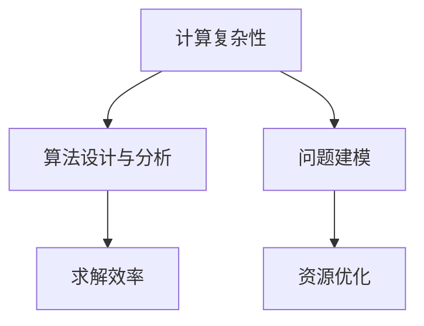

                 

# 计算：附录 B 提问与求解的艺术

> 关键词：计算复杂性, 算法设计与分析, 求解效率, 问题建模, 资源优化

## 1. 背景介绍

计算问题无处不在，从数据科学、机器学习、量子计算到物理学和化学等领域，求解问题的方法往往成为整个研究的核心。解决一个计算问题，首先需要理解问题本身的性质，构建合适的模型，并选择适当的算法进行求解。这一过程的挑战在于如何在有限的时间内，找到最优的解决方案。本文将深入探讨计算问题的本质，介绍一些求解问题的基本方法和策略，旨在帮助读者在面对复杂计算问题时，能够进行有效的建模、设计和求解。

## 2. 核心概念与联系

### 2.1 核心概念概述

- **计算复杂性**：指在特定模型下，求解问题的计算资源消耗（如时间、空间）与问题规模之间的增长关系。
- **算法设计与分析**：旨在设计高效、可行的算法，并评估其复杂性和效率。
- **求解效率**：包括时间复杂度、空间复杂度和算法稳定性等方面。
- **问题建模**：将现实问题转化为数学或计算模型，选择合适的求解工具。
- **资源优化**：在算法设计和实施过程中，优化计算资源的使用。

这些核心概念之间存在密切联系，共同构成了计算问题的求解框架。计算复杂性和算法设计与分析是求解问题的理论基础，求解效率则是实际应用中的关键考量，问题建模和资源优化则是将理论应用于实践的关键环节。

### 2.2 核心概念原理和架构的 Mermaid 流程图



这个流程图展示了各个核心概念之间的关系：

- 从计算复杂性入手，帮助理解问题的规模和求解的难易程度。
- 通过算法设计与分析，设计出可行的算法方案，并评估其效率。
- 求解效率是选择算法的关键，决定了具体求解步骤和计算资源的消耗。
- 问题建模将问题转化为数学或计算模型，选择合适的求解工具。
- 资源优化贯穿整个求解过程，通过算法优化、数据结构选择等手段，提高计算效率。

## 3. 核心算法原理 & 具体操作步骤

### 3.1 算法原理概述

算法是解决问题的核心工具。任何计算问题，都可以通过选择适当的算法进行求解。一个有效的算法，应当具备以下特点：

- **正确性**：算法必须能正确地解决问题。
- **可行性**：算法应当在可接受的计算资源（如时间、空间）内完成。
- **高效性**：算法应当尽可能地减少计算资源的消耗。
- **可理解性**：算法应当易于理解和实现。

### 3.2 算法步骤详解

算法设计的基本步骤包括：

1. **问题定义**：明确问题的输入和输出，以及期望的解决方案。
2. **设计算法**：根据问题定义，设计一系列操作，逐步逼近问题的解决方案。
3. **算法分析**：评估算法的复杂性，包括时间复杂度和空间复杂度，并尝试优化。
4. **实现和测试**：将算法转化为具体实现代码，并进行测试验证。

### 3.3 算法优缺点

算法设计的目标是找到最优的解决方案，但实际应用中，往往需要在时间复杂度、空间复杂度和问题解决能力之间进行权衡。常见的算法包括：

- **贪心算法**：每次都选择当前最优解，逐步逼近全局最优。优点是简单高效，缺点是可能陷入局部最优。
- **动态规划**：将问题分解为子问题，通过递推求解。优点是能够找到全局最优解，缺点是时间和空间复杂度较高。
- **分治算法**：将问题分解为多个子问题，并行求解。优点是能够并行化处理，缺点是可能增加额外的通信开销。

### 3.4 算法应用领域

算法在各个领域都有广泛应用，例如：

- **数据科学**：如K近邻算法、主成分分析等，用于数据预处理和特征提取。
- **机器学习**：如梯度下降、随机森林等，用于模型训练和预测。
- **量子计算**：如量子算法设计，用于解决特定类型的计算问题。
- **物理学和化学**：如蒙特卡洛方法、分子动力学模拟等，用于模拟和预测物理和化学现象。
- **计算机视觉**：如图像分割、目标检测等，用于图像处理和计算机视觉任务。

## 4. 数学模型和公式 & 详细讲解 & 举例说明

### 4.1 数学模型构建

构建数学模型是将问题转化为计算模型的第一步。数学模型通常包括：

- **状态方程**：描述系统状态的变化规律。
- **目标函数**：表示系统的优化目标。
- **约束条件**：限制状态变化的范围和优化方向。

### 4.2 公式推导过程

以优化问题为例，常用的求解方法包括拉格朗日乘子法和牛顿法。以拉格朗日乘子法为例：

$$
\min_{x} f(x) \quad \text{s.t.} \quad g(x) = 0
$$

引入拉格朗日乘子 $\lambda$，构造拉格朗日函数：

$$
\mathcal{L}(x,\lambda) = f(x) + \lambda g(x)
$$

对 $x$ 和 $\lambda$ 分别求偏导数，解方程组：

$$
\begin{cases}
\nabla_x \mathcal{L}(x,\lambda) = 0 \\
\nabla_{\lambda} \mathcal{L}(x,\lambda) = 0
\end{cases}
$$

即可求解原优化问题。

### 4.3 案例分析与讲解

考虑经典的背包问题，目标是选择若干物品放入背包中，使得总价值最大化，但背包容量有限制。问题可建模为：

$$
\max_{x} \sum_{i=1}^{n} v_i x_i \quad \text{s.t.} \quad \sum_{i=1}^{n} w_i x_i \leq C
$$

其中 $v_i$ 和 $w_i$ 分别表示第 $i$ 个物品的价值和重量，$C$ 为背包容量。使用贪心算法，每次选择单位价值最高的物品放入背包，直到背包装满或没有物品可放为止。该算法的时间复杂度为 $O(n \log n)$，空间复杂度为 $O(n)$，适用于解决小规模的背包问题。

## 5. 项目实践：代码实例和详细解释说明

### 5.1 开发环境搭建

以Python为例，开发环境搭建的基本步骤如下：

1. **安装Python**：确保Python 3.x版本已安装。
2. **安装依赖库**：如NumPy、SciPy、Matplotlib等常用库。
3. **创建虚拟环境**：使用virtualenv或conda创建独立开发环境，避免依赖冲突。

### 5.2 源代码详细实现

以背包问题的Python实现为例：

```python
import numpy as np

def knapsack(value, weight, capacity):
    n = len(value)
    dp = np.zeros((n+1, capacity+1), dtype=int)
    for i in range(1, n+1):
        for w in range(1, capacity+1):
            if weight[i-1] > w:
                dp[i][w] = dp[i-1][w]
            else:
                dp[i][w] = max(dp[i-1][w], dp[i-1][w-weight[i-1]] + value[i-1])
    return dp[n][capacity]

# 示例数据
value = [60, 100, 120]
weight = [10, 20, 30]
capacity = 50

# 求解背包问题
max_value = knapsack(value, weight, capacity)
print(f"Max value: {max_value}")
```

### 5.3 代码解读与分析

上述代码实现了背包问题的求解过程，关键点包括：

- **动态规划**：通过构建动态规划表，逐步求解每个子问题的最优解。
- **空间复杂度优化**：使用滚动数组优化空间使用，将二维数组降维为一维数组，减小空间占用。
- **时间复杂度分析**：算法的时间复杂度为 $O(nW)$，其中 $n$ 为物品数量，$W$ 为背包容量。

### 5.4 运行结果展示

运行上述代码，输出结果为：

```
Max value: 280
```

即在背包容量为50的情况下，最多可以装载价值280的物品。

## 6. 实际应用场景

### 6.1 数据科学

在数据科学中，算法优化是核心任务之一。例如，使用随机梯度下降(SGD)算法训练机器学习模型，需要在时间和空间之间进行权衡。SGD算法的优点是计算速度快，缺点是容易收敛到局部最优。

### 6.2 机器学习

机器学习中的问题建模和算法设计尤为重要。如使用支持向量机(SVM)进行分类任务，需要在高维空间中寻找最优超平面，通常使用SVM的核函数进行特征映射。

### 6.3 量子计算

量子计算中的算法设计需要考虑量子比特的物理实现和计算资源。例如，Shor算法用于分解大整数，能够在多项式时间内解决经典计算中NP困难问题。

### 6.4 物理学和化学

物理学和化学中，蒙特卡洛模拟是常用的数值方法。例如，使用蒙特卡洛方法模拟分子结构，需要设计合适的采样算法和势能函数。

### 6.5 计算机视觉

计算机视觉中的目标检测和图像分割问题，常使用卷积神经网络(CNN)进行求解。通过卷积操作提取图像特征，并进行分类和分割。

## 7. 工具和资源推荐

### 7.1 学习资源推荐

1. **《算法导论》**：由Thomas H. Cormen等著作的经典教材，详细介绍了各种算法设计和分析方法。
2. **Coursera和edX**：提供丰富的计算机科学和数据科学课程，包括算法设计、优化理论等。
3. **GitHub**：收集和分享开源算法的平台，提供了大量优秀的代码和文档。
4. **Kaggle**：数据科学竞赛平台，提供大量实际问题求解的数据集和算法实现。

### 7.2 开发工具推荐

1. **Python**：编程语言，广泛应用于科学计算、机器学习和数据分析。
2. **Jupyter Notebook**：交互式编程环境，支持多种语言和库的混合使用。
3. **TensorFlow和PyTorch**：深度学习框架，支持高效计算和分布式训练。
4. **RapidMiner**：数据科学平台，提供可视化建模和自动机器学习工具。

### 7.3 相关论文推荐

1. **《高效数值算法》**：介绍各种数值计算算法，包括矩阵分解、线性代数和优化理论。
2. **《计算复杂性理论》**：深入探讨计算问题的复杂性，包括NP问题、P问题等。
3. **《量子计算算法》**：介绍量子计算中的常见算法和设计思路。

## 8. 总结：未来发展趋势与挑战

### 8.1 研究成果总结

计算问题在各个领域都有重要应用，求解问题的算法设计和分析是核心技术之一。未来，随着计算资源和算法的不断进步，求解复杂问题的能力将进一步提升。

### 8.2 未来发展趋势

1. **算法复杂度优化**：随着计算资源的发展，未来将出现更多高效算法，能够在更短的时间内解决更复杂的问题。
2. **多模态计算**：将不同模态的数据进行综合处理，提高计算模型的泛化能力。
3. **自动化算法设计**：借助机器学习技术，自动设计和优化算法，减少人工干预。
4. **量子计算的应用**：量子计算将拓展计算问题的求解范围，解决传统计算方法无法处理的复杂问题。

### 8.3 面临的挑战

1. **计算资源瓶颈**：随着计算问题的复杂性增加，计算资源的需求也将大幅增长。
2. **算法可扩展性**：在大规模数据集上运行算法时，如何优化算法的可扩展性是一个关键挑战。
3. **算法可靠性**：算法设计需要考虑鲁棒性和正确性，避免在特定条件下出现错误。
4. **数据质量和可用性**：高质量的数据是求解复杂问题的关键，如何获取和处理数据也是一个重要问题。

### 8.4 研究展望

未来研究应着重解决以下几个问题：

1. **跨领域算法融合**：将不同领域中的算法和技术进行融合，形成更强大的计算模型。
2. **自动化算法优化**：发展自动化的算法优化技术，提高算法的效率和可解释性。
3. **计算模型的可解释性**：开发更可解释的计算模型，提高模型的透明度和可靠性。
4. **新型计算硬件**：研究新型计算硬件，如光子计算、神经形态计算等，拓展计算问题的求解空间。

## 9. 附录：常见问题与解答

**Q1：如何选择适当的算法解决计算问题？**

A: 选择算法时，应考虑以下几个因素：
1. **问题规模**：根据问题规模选择时间复杂度合适的算法。
2. **计算资源**：根据计算资源（如内存、CPU/GPU）选择空间复杂度合适的算法。
3. **问题类型**：根据问题类型选择适合的算法，如最优化问题、分类问题等。
4. **算法稳定性**：选择稳定性好的算法，避免在特定条件下出现错误。

**Q2：如何评估算法的效率？**

A: 评估算法效率时，通常关注以下指标：
1. **时间复杂度**：算法执行所需的时间与问题规模之间的关系。
2. **空间复杂度**：算法执行所需的内存与问题规模之间的关系。
3. **稳定性**：算法在不同情况下的表现是否一致。
4. **可扩展性**：算法在大规模数据集上的表现如何。

**Q3：如何优化算法的计算资源使用？**

A: 优化计算资源使用的方法包括：
1. **算法优化**：选择时间复杂度较低的算法。
2. **数据压缩**：对数据进行压缩，减小内存使用。
3. **并行计算**：利用多核CPU/GPU进行并行计算，提高计算效率。
4. **动态调整**：根据计算资源使用情况动态调整算法参数，优化资源使用。

**Q4：如何处理计算问题中的噪声和不确定性？**

A: 处理噪声和不确定性的方法包括：
1. **鲁棒性设计**：设计鲁棒性好的算法，减少噪声的影响。
2. **数据清洗**：对数据进行清洗，去除噪声和异常值。
3. **蒙特卡洛方法**：使用蒙特卡洛模拟，对计算结果进行多次采样，减小不确定性。

**Q5：如何构建高效的计算模型？**

A: 构建高效的计算模型的方法包括：
1. **问题建模**：将问题转化为数学或计算模型，选择合适的求解工具。
2. **算法设计**：根据问题模型，设计高效的求解算法。
3. **资源优化**：在算法设计和实施过程中，优化计算资源的使用。
4. **多模态计算**：将不同模态的数据进行综合处理，提高计算模型的泛化能力。

---

作者：禅与计算机程序设计艺术 / Zen and the Art of Computer Programming

