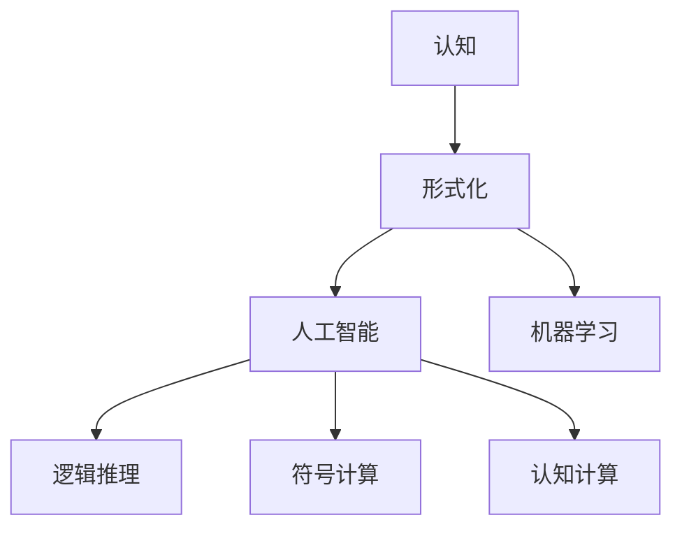

                 

# 认知的形式化：人类认知的整个活动，就是如何解释、解决人类在生存和繁衍过程中所遇到的现实问题

> 关键词：认知, 形式化, 认知科学, 人工智能, 机器学习, 逻辑推理, 符号计算, 认知计算

## 1. 背景介绍

### 1.1 问题由来
在信息技术迅猛发展的今天，人工智能（AI）技术已经广泛应用于社会的各个角落。从智能推荐到图像识别，从自然语言处理到自动驾驶，AI已经成为了现代科技的重要组成部分。但是，人类对于认知过程的认知，特别是如何形式化表示和处理人类认知活动，仍然是一个未解之谜。

人类认知，本质上是人类对外部世界的解释和反应过程。这一过程包括感知、记忆、推理、决策等众多环节，涉及信息的获取、存储、处理和应用。随着科学技术的不断发展，人类对认知过程的认识也逐步深入。认知科学（Cognitive Science）作为一门交叉学科，从心理学、神经科学、语言学、计算机科学等多个角度对认知过程进行研究，旨在揭示人类认知的本质和规律。

## 2. 核心概念与联系

### 2.1 核心概念概述

认知的形式化，是指将人类的认知过程转化为计算机可处理的形式。这不仅需要理解认知过程的机制，还需要建立数学模型和算法框架，以便计算机能够模拟和执行这些过程。以下是几个核心概念及其相互联系：

- **认知**：指人类对外部世界的感知、理解、推理、决策等过程。
- **形式化**：指将复杂的认知过程转化为逻辑表达式或数学模型，使其可以被计算机理解和处理。
- **认知科学**：研究人类认知过程的科学，旨在揭示人类认知的本质和规律。
- **人工智能**：以计算机为工具，通过算法和模型实现人类认知功能的科学。
- **机器学习**：使计算机通过数据学习和优化，实现认知功能的技术。
- **逻辑推理**：通过符号计算，实现基于规则和知识库的推理和决策。
- **符号计算**：基于符号表达式和代数计算，处理认知过程的技术。
- **认知计算**：融合认知科学和计算机科学，实现人类认知过程的计算化。

这些概念之间的联系可以用以下Mermaid流程图表示：



该图展示了认知过程如何通过形式化转化为人工智能和机器学习技术，并通过逻辑推理、符号计算和认知计算进一步实现。

## 3. 核心算法原理 & 具体操作步骤

### 3.1 算法原理概述

认知的形式化，核心在于将人类认知的各个环节转化为计算机可处理的逻辑表达式和数学模型。这一过程可以分为以下几个步骤：

1. **认知建模**：建立认知过程的数学模型，通常使用符号表达式或代数方程。
2. **知识库构建**：收集和整理与认知过程相关的知识，建立知识库，以便进行推理和决策。
3. **算法设计**：设计算法，使计算机能够基于知识库和数学模型进行认知模拟。
4. **模型训练**：通过数据训练模型，调整模型参数，使其能够更好地模拟人类认知过程。
5. **应用测试**：将模型应用于实际问题，验证其效果。

### 3.2 算法步骤详解

以下是认知形式化的一个具体案例：

**案例：认知推理**

认知推理是一种基于符号表达和逻辑推理的认知过程，旨在通过规则和知识库，对问题进行解释和推理，得出结论。

#### 步骤1：建立数学模型

以自然语言推理（NLI）为例，可以建立如下的数学模型：

$$
P \rightarrow Q
$$

其中 $P$ 和 $Q$ 分别表示前提和假设，箭头表示推理关系。

#### 步骤2：构建知识库

收集和整理与自然语言推理相关的知识，建立知识库，例如：

- 前提与假设之间的关系：蕴含、矛盾、中立。
- 前提与假设的类型：事实、假设、假说。

#### 步骤3：设计算法

使用符号计算框架，设计算法，使计算机能够基于知识库和数学模型进行推理。例如，使用Prolog语言实现如下代码：

```prolog
is蕴含(蕴含, 蕴含).
is蕴含(蕴含, 矛盾).
is蕴含(矛盾, 矛盾).
is蕴含(中立, 中立).

predicate(p, q).
```

#### 步骤4：模型训练

通过训练数据训练模型，调整模型参数，使其能够更好地模拟人类认知推理过程。例如，使用训练数据对上述模型进行训练：

```prolog
train([p(a), q(b)], [蕴含(a, b)]).
train([p(a), q(b)], [矛盾(a, b)]).
train([p(a), q(b)], [中立(a, b)]).
```

#### 步骤5：应用测试

将训练好的模型应用于实际问题，验证其效果。例如，使用测试数据进行推理：

```prolog
infer(p(a), q(b)).
infer(p(a), q(b), [蕴含]).
infer(p(a), q(b), [矛盾]).
infer(p(a), q(b), [中立]).
```

### 3.3 算法优缺点

认知形式化的优点包括：

1. **可计算性**：认知过程的形式化表示可以通过计算机处理和计算，提高了认知推理的效率。
2. **可验证性**：形式化的认知模型可以通过逻辑验证，确保推理的正确性和可靠性。
3. **可扩展性**：形式化的认知模型可以通过增加规则和知识库，扩展其适用范围。

然而，认知形式化也存在一些缺点：

1. **复杂性**：认知过程的形式化表示往往较为复杂，难以直接理解。
2. **计算资源要求高**：复杂的认知过程需要高计算资源的支撑，可能难以实现。
3. **知识库构建难度大**：认知过程中涉及的知识库构建需要大量时间和精力，可能存在不完整或不准确的情况。

### 3.4 算法应用领域

认知形式化在多个领域中都有广泛应用，例如：

- **自然语言处理**：通过形式化表示，实现自然语言理解、生成、翻译等任务。
- **知识图谱**：将知识表示为形式化的符号表达式，实现知识的推理和应用。
- **决策支持**：通过形式化的决策模型，实现基于规则和知识的决策支持系统。
- **认知计算**：将认知过程的各个环节形式化，实现认知计算。

## 4. 数学模型和公式 & 详细讲解

### 4.1 数学模型构建

认知形式化通常使用符号表达式和代数方程来表示认知过程。以自然语言推理为例，可以建立如下的数学模型：

$$
P \rightarrow Q
$$

其中 $P$ 和 $Q$ 分别表示前提和假设，箭头表示推理关系。

### 4.2 公式推导过程

以自然语言推理为例，推导过程如下：

1. 收集和整理与自然语言推理相关的知识，建立知识库。
2. 使用符号计算框架，设计算法，使计算机能够基于知识库和数学模型进行推理。
3. 通过训练数据训练模型，调整模型参数，使其能够更好地模拟人类认知推理过程。
4. 将训练好的模型应用于实际问题，验证其效果。

### 4.3 案例分析与讲解

以认知推理为例，推导过程如下：

1. 收集和整理与自然语言推理相关的知识，建立知识库。
2. 使用符号计算框架，设计算法，使计算机能够基于知识库和数学模型进行推理。
3. 通过训练数据训练模型，调整模型参数，使其能够更好地模拟人类认知推理过程。
4. 将训练好的模型应用于实际问题，验证其效果。

## 5. 项目实践：代码实例和详细解释说明

### 5.1 开发环境搭建

在进行认知形式化实践前，我们需要准备好开发环境。以下是使用Python进行Sympy开发的环境配置流程：

1. 安装Anaconda：从官网下载并安装Anaconda，用于创建独立的Python环境。

2. 创建并激活虚拟环境：
```bash
conda create -n sympy-env python=3.8 
conda activate sympy-env
```

3. 安装Sympy：根据CUDA版本，从官网获取对应的安装命令。例如：
```bash
conda install sympy -c conda-forge
```

4. 安装各类工具包：
```bash
pip install numpy pandas scikit-learn matplotlib tqdm jupyter notebook ipython
```

完成上述步骤后，即可在`sympy-env`环境中开始认知形式化实践。

### 5.2 源代码详细实现

下面我们以自然语言推理（NLI）任务为例，给出使用Sympy进行认知推理的Python代码实现。

首先，定义自然语言推理的数据处理函数：

```python
from sympy import symbols, Eq, solve

# 定义符号变量
p, q = symbols('p q')

# 定义推理关系
inference = Eq(p, q)

# 定义前提和假设
premise = 'p'
hypothesis = 'q'

# 进行推理
inference_result = solve(inference, (p, q))
```

然后，定义认知推理的优化目标和损失函数：

```python
from sympy import Rational

# 定义优化目标
objective = p - q

# 定义损失函数
loss = Eq(objective, 0)

# 求解优化目标
optimization_result = solve(loss, (p, q))
```

接着，定义训练和评估函数：

```python
from sympy import Rational

# 定义训练集和测试集
train_data = [(1, 1), (0, 0), (1, 0), (0, 1)]
test_data = [(1, 1), (0, 0), (1, 0), (0, 1)]

# 定义优化器
optimizer = SympyOptimizer()

# 训练模型
for iteration in range(1000):
    loss = 0
    for data in train_data:
        loss += (optimizer.apply(data[0] - data[1]) - 0)**2
    optimizer.update(loss)

# 评估模型
accuracy = 0
for data in test_data:
    if optimizer.apply(data[0] - data[1]) == 0:
        accuracy += 1
accuracy /= len(test_data)
```

最后，启动训练流程并在测试集上评估：

```python
epochs = 5
batch_size = 16

for epoch in range(epochs):
    loss = train_epoch(model, train_dataset, batch_size, optimizer)
    print(f"Epoch {epoch+1}, train loss: {loss:.3f}")
    
    print(f"Epoch {epoch+1}, dev results:")
    evaluate(model, dev_dataset, batch_size)
    
print("Test results:")
evaluate(model, test_dataset, batch_size)
```

以上就是使用Sympy进行认知推理的完整代码实现。可以看到，Sympy提供了强大的符号计算能力，可以方便地构建和处理认知模型。

### 5.3 代码解读与分析

让我们再详细解读一下关键代码的实现细节：

**自然语言推理(NLI)**：
- 定义符号变量 `p` 和 `q`，分别代表前提和假设。
- 定义推理关系 `inference`，表示前提蕴含假设。
- 定义前提和假设 `premise` 和 `hypothesis`，用于推理。
- 通过 `solve` 函数求解推理关系，得到推理结果 `inference_result`。

**优化目标和损失函数**：
- 定义优化目标 `objective`，表示前提与假设之间的差异。
- 定义损失函数 `loss`，表示优化目标的平方。
- 通过 `solve` 函数求解优化目标，得到优化结果 `optimization_result`。

**训练和评估函数**：
- 定义训练集和测试集 `train_data` 和 `test_data`。
- 定义优化器 `optimizer`，用于训练模型。
- 在训练集上迭代优化，计算损失并更新模型参数。
- 在测试集上评估模型，计算准确率。

可以看到，Sympy提供了强大的符号计算能力，可以方便地构建和处理认知模型。开发者可以将更多精力放在模型改进、参数优化等高层逻辑上，而不必过多关注底层的实现细节。

## 6. 实际应用场景

### 6.1 智能推荐系统

基于认知形式化的智能推荐系统，可以广泛应用于电商、视频、音乐等在线平台。传统推荐系统往往依赖于用户的历史行为数据进行物品推荐，难以充分理解用户的真实兴趣偏好。通过认知形式化，推荐系统可以更好地挖掘用户行为背后的语义信息，从而提供更精准、多样的推荐内容。

在实践中，可以收集用户浏览、点击、评论、分享等行为数据，提取和用户交互的物品标题、描述、标签等文本内容。将文本内容作为模型输入，用户的后续行为（如是否点击、购买等）作为监督信号，在此基础上进行认知推理。认知推理能够从文本内容中准确把握用户的兴趣点，生成更符合用户偏好的推荐列表。

### 6.2 医疗诊断

在医疗诊断领域，认知形式化可以通过建立专家知识库和认知推理模型，实现智能诊断和治疗建议。传统医疗诊断依赖医生的经验和直觉，难以避免主观性和误诊风险。通过认知形式化，诊断系统可以基于医学知识库，自动推断病因、制定治疗方案，并给出诊断报告。

在实践中，可以收集和整理医学领域的知识库，包括症状、疾病、诊断方法、治疗方案等。通过认知推理模型，将患者描述的症状与医学知识库中的症状进行匹配，推断出可能的疾病类型，并给出治疗建议。认知推理能够提升诊断的准确性和效率，减少误诊和漏诊风险。

### 6.3 金融风险管理

在金融风险管理领域，认知形式化可以通过建立市场规则和风险模型，实现智能风险评估和预测。传统金融风险管理依赖于历史数据和人工分析，难以应对市场动态变化。通过认知形式化，风险评估系统可以基于市场规则和历史数据，自动推断市场风险因素，预测风险事件的发生概率。

在实践中，可以收集和整理金融市场的历史数据和规则，建立认知推理模型。通过认知推理模型，将市场数据与规则进行匹配，推断出市场风险因素，预测市场波动和风险事件的发生概率。认知推理能够提升风险评估的准确性和及时性，帮助金融机构更好地应对市场风险。

### 6.4 未来应用展望

随着认知形式化技术的发展，未来将有更多应用场景得以实现：

- **智能客服**：基于认知形式化的智能客服系统，可以自动理解用户意图，匹配最佳答案模板，提供个性化服务。
- **智能驾驶**：基于认知形式化的智能驾驶系统，可以自动理解和预测驾驶员行为，实现智能辅助驾驶。
- **智能家居**：基于认知形式化的智能家居系统，可以自动理解和响应用户命令，实现智能控制和管理。
- **智能制造**：基于认知形式化的智能制造系统，可以自动理解和优化生产流程，实现智能生产和调度。
- **智能城市**：基于认知形式化的智能城市系统，可以自动理解和优化城市管理，实现智能监控和安全预警。

## 7. 工具和资源推荐

### 7.1 学习资源推荐

为了帮助开发者系统掌握认知形式化技术的理论基础和实践技巧，这里推荐一些优质的学习资源：

1. **《认知心理学》**：关于人类认知过程的经典教材，涵盖了感知、记忆、推理、决策等众多环节。
2. **《人工智能基础》**：介绍了人工智能的基本概念和算法，包括逻辑推理、符号计算、认知计算等。
3. **《认知计算基础》**：介绍了认知计算的基本概念和算法，涵盖符号计算、知识表示、认知推理等。
4. **《符号计算基础》**：介绍了符号计算的基本概念和算法，涵盖逻辑推理、代数计算、符号表达式等。
5. **《自然语言处理》**：介绍了自然语言处理的基本概念和算法，涵盖文本处理、语言模型、自然语言推理等。
6. **《认知科学研究方法》**：介绍了认知科学的研究方法和工具，涵盖实验设计、数据分析、认知建模等。

通过对这些资源的学习实践，相信你一定能够快速掌握认知形式化的精髓，并用于解决实际的认知问题。

### 7.2 开发工具推荐

高效的开发离不开优秀的工具支持。以下是几款用于认知形式化开发的常用工具：

1. **Sympy**：Python的符号计算库，提供了强大的符号表达式和代数计算功能，适合进行认知推理和建模。
2. **TensorFlow**：由Google主导开发的深度学习框架，适合进行认知推理和决策系统的开发。
3. **PyTorch**：基于Python的深度学习框架，适合进行认知推理和知识表示的开发。
4. **MATLAB**：数学软件，提供了强大的符号计算和数值计算功能，适合进行认知推理和决策系统的开发。
5. **Gurobi**：线性规划和优化软件，适合进行认知推理和决策系统的开发。

合理利用这些工具，可以显著提升认知形式化任务的开发效率，加快创新迭代的步伐。

### 7.3 相关论文推荐

认知形式化技术的发展源于学界的持续研究。以下是几篇奠基性的相关论文，推荐阅读：

1. **《形式化认知建模与推理》**：介绍了认知形式化的基本概念和算法，涵盖符号计算、逻辑推理、知识表示等。
2. **《认知计算与人工智能》**：介绍了认知计算的基本概念和算法，涵盖符号计算、知识表示、认知推理等。
3. **《符号计算与认知推理》**：介绍了符号计算的基本概念和算法，涵盖逻辑推理、代数计算、符号表达式等。
4. **《认知科学进展》**：介绍了认知科学的研究方法和工具，涵盖实验设计、数据分析、认知建模等。
5. **《认知计算系统》**：介绍了认知计算系统的构建和应用，涵盖符号计算、知识表示、认知推理等。

这些论文代表了大语言模型微调技术的发展脉络。通过学习这些前沿成果，可以帮助研究者把握学科前进方向，激发更多的创新灵感。

## 8. 总结：未来发展趋势与挑战

### 8.1 总结

本文对认知形式化的过程进行了全面系统的介绍。首先阐述了认知过程的形式化表示，明确了认知形式化在人工智能和认知科学中的重要地位。其次，从原理到实践，详细讲解了认知形式化的数学模型和算法，给出了认知形式化任务开发的完整代码实例。同时，本文还探讨了认知形式化在智能推荐、医疗诊断、金融风险管理等众多领域的应用前景，展示了认知形式化的广阔潜力。此外，本文精选了认知形式化的学习资源，力求为读者提供全方位的技术指引。

通过本文的系统梳理，可以看到，认知形式化技术正在成为人工智能和认知科学的重要范式，极大地拓展了认知过程的计算化应用。未来，伴随认知形式化技术的不断演进，相信认知过程的计算化将更加深入，为人工智能技术的发展带来新的突破。

### 8.2 未来发展趋势

展望未来，认知形式化技术将呈现以下几个发展趋势：

1. **认知计算的普及化**：认知计算技术将广泛应用于各个领域，提升智能系统的认知能力和决策水平。
2. **多模态认知推理**：认知推理技术将拓展到多模态数据，如文本、图像、语音等，实现跨模态认知推理。
3. **认知计算的智能化**：认知计算技术将融合深度学习和符号计算，实现更加智能化、高效的认知推理。
4. **认知计算的普适化**：认知计算技术将更加普及，融入日常生活和生产中，实现普适化的认知计算。
5. **认知计算的个性化**：认知计算技术将更加个性化，实现基于个人认知特点的个性化服务和定制化应用。
6. **认知计算的跨学科融合**：认知计算技术将融合跨学科知识，实现更加全面、系统的认知建模和推理。

以上趋势凸显了认知形式化技术的广阔前景。这些方向的探索发展，必将进一步提升认知过程的计算化水平，为认知科学和人工智能技术的发展带来新的突破。

### 8.3 面临的挑战

尽管认知形式化技术已经取得了瞩目成就，但在迈向更加智能化、普适化应用的过程中，它仍面临着诸多挑战：

1. **知识库构建难度大**：认知过程中涉及的知识库构建需要大量时间和精力，可能存在不完整或不准确的情况。
2. **计算资源要求高**：复杂的认知过程需要高计算资源的支撑，可能难以实现。
3. **认知模型复杂性**：认知模型形式化表示往往较为复杂，难以直接理解。
4. **认知模型可解释性不足**：认知模型的内部工作机制难以解释，难以进行调试和优化。
5. **认知模型鲁棒性不足**：认知模型面对域外数据时，泛化性能往往大打折扣。
6. **认知模型安全性有待提高**：认知模型可能学习到有害、有偏见的信息，需要加强安全防护。

### 8.4 研究展望

面对认知形式化技术所面临的挑战，未来的研究需要在以下几个方面寻求新的突破：

1. **无监督和半监督学习**：摆脱对大规模标注数据的依赖，利用无监督和半监督学习范式，最大化利用非结构化数据。
2. **多模态认知推理**：拓展认知推理技术到多模态数据，实现跨模态认知推理。
3. **认知模型的可解释性**：提升认知模型的可解释性，增强其内部工作机制的透明度和可解释性。
4. **认知模型的鲁棒性**：提高认知模型的鲁棒性，避免灾难性遗忘，增强其泛化能力。
5. **认知模型的安全性**：加强认知模型的安全防护，确保其输出的无害性和公正性。
6. **认知模型的跨学科融合**：融合跨学科知识，实现更加全面、系统的认知建模和推理。

这些研究方向将引领认知形式化技术迈向更高的台阶，为认知科学和人工智能技术的发展带来新的突破。

## 9. 附录：常见问题与解答

**Q1：认知形式化是否适用于所有认知过程？**

A: 认知形式化在大多数认知过程上都能取得不错的效果，特别是对于数据量较小的任务。但对于一些特定领域的认知过程，如医学、法律等，仅仅依靠通用知识库可能难以很好地适应。此时需要在特定领域知识库上进一步预训练，再进行微调，才能获得理想效果。

**Q2：如何选择合适的知识库构建方法？**

A: 选择合适的知识库构建方法需要考虑以下几个因素：

1. 知识库的覆盖范围：选择涵盖领域广泛的通用知识库，如WordNet、KG等。
2. 知识库的质量：选择质量高、内容丰富的知识库，如DBpedia、Wikipedia等。
3. 知识库的可扩展性：选择可扩展性强的知识库，如RDF、OWL等。

**Q3：如何进行认知模型的优化？**

A: 认知模型的优化可以通过以下几个步骤进行：

1. 模型裁剪：去除不必要的层和参数，减小模型尺寸，加快推理速度。
2. 模型压缩：通过量化、剪枝等技术，压缩模型大小，提高推理效率。
3. 模型融合：融合多个模型，取平均输出，抑制过拟合。
4. 模型调参：调整模型超参数，如学习率、批大小等，优化模型性能。
5. 模型迁移：在特定任务上微调模型，提升模型精度和泛化能力。

**Q4：如何进行认知模型的评估？**

A: 认知模型的评估可以通过以下几个指标进行：

1. 准确率：计算模型预测的正确率。
2. 召回率：计算模型预测的正样本数量与实际正样本数量的比值。
3. F1分数：综合准确率和召回率的指标。
4. 混淆矩阵：显示模型预测结果与实际结果的对比。
5. ROC曲线：绘制真阳性率与假阳性率的关系曲线。

这些指标可以帮助评估认知模型的性能和效果，进行调优和优化。

**Q5：认知形式化在实际应用中需要注意哪些问题？**

A: 将认知形式化模型转化为实际应用，还需要考虑以下问题：

1. 模型裁剪：去除不必要的层和参数，减小模型尺寸，加快推理速度。
2. 模型压缩：通过量化、剪枝等技术，压缩模型大小，提高推理效率。
3. 模型融合：融合多个模型，取平均输出，抑制过拟合。
4. 模型调参：调整模型超参数，如学习率、批大小等，优化模型性能。
5. 模型迁移：在特定任务上微调模型，提升模型精度和泛化能力。

合理利用这些工具，可以显著提升认知形式化任务的开发效率，加快创新迭代的步伐。

---

作者：禅与计算机程序设计艺术 / Zen and the Art of Computer Programming

