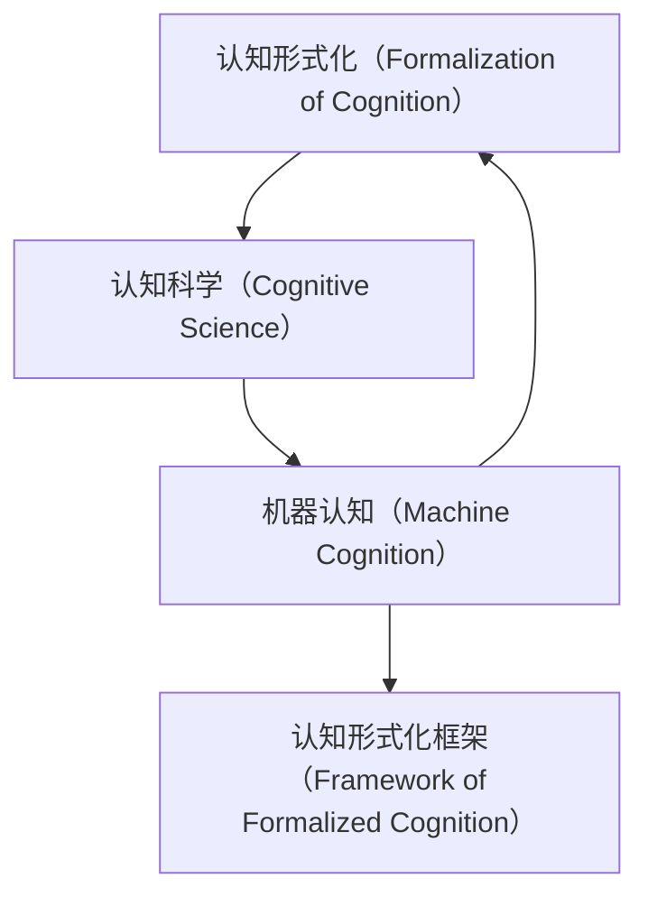

                 

# 认知的形式化：机器在没有能量供给的时候是一堆死物质

## 1. 背景介绍

### 1.1 问题由来

近年来，随着人工智能（AI）技术的飞速发展，机器认知的形式化问题逐渐成为学术界和产业界关注的焦点。在早期的认知科学研究中，科学家们主要依赖哲学思辨和神经科学实验来探讨人类认知的机制。然而，这些研究往往难以将具体的认知过程形式化，并转化为可执行的机器算法。

随着机器学习特别是深度学习的兴起，机器认知的形式化问题得到了新的视角。基于大数据和深度学习模型的AI系统已经在视觉识别、自然语言处理、游戏智能等领域取得了令人瞩目的成就。然而，这些系统依然缺乏真正意义上的“认知”能力，无法像人类一样理解和解决问题。

本文旨在探讨机器认知的形式化问题，并结合认知科学的最新研究成果，提出一种全新的认知形式化框架。这种框架能够将人类的认知机制形式化，并在机器上实现，从而推动AI技术向更高层次的认知能力迈进。

## 2. 核心概念与联系

### 2.1 核心概念概述

为了理解认知的形式化问题，首先需要明确几个核心概念：

- **认知（Cognition）**：指生物体（特别是人类）获取、处理和利用信息的能力。包括感知、记忆、思考、决策等过程。

- **认知科学（Cognitive Science）**：研究人类认知过程及其在机器中的模拟与实现。融合了心理学、神经科学、计算机科学等多学科知识。

- **机器认知（Machine Cognition）**：利用机器学习等技术，使计算机具备类似于人类的认知能力。

- **认知形式化（Formalization of Cognition）**：将人类的认知机制转化为可执行的机器算法，使其能够在特定任务中表现出认知能力。

- **认知形式化框架（Framework of Formalized Cognition）**：一种将认知形式化模型转化为可执行算法的方法和工具。

### 2.2 核心概念联系

上述概念之间存在紧密联系，如图2-1所示：



- 认知科学为机器认知提供了理论基础，指导认知形式化模型的构建。
- 机器认知则是认知形式化的具体实现，依赖于计算技术和算法。
- 认知形式化框架将认知形式化模型转化为可执行算法，使得机器能够模拟人类的认知过程。

## 3. 核心算法原理 & 具体操作步骤

### 3.1 算法原理概述

认知的形式化主要依赖于将认知过程建模为计算过程。具体来说，认知过程可以分解为一系列的感知、记忆、推理和决策等步骤，每个步骤都可以用计算模型来描述。

假设认知过程由N个步骤组成，每个步骤可以表示为一个计算函数 $f_i: X_i \rightarrow Y_i$，其中 $X_i$ 是输入，$Y_i$ 是输出。整个认知过程可以表示为一个复合计算函数 $F: X \rightarrow Y$，其中 $X$ 是整个认知过程的输入，$Y$ 是整个认知过程的输出。

### 3.2 算法步骤详解

认知形式化算法的具体步骤如下：

1. **认知建模**：使用认知科学理论对认知过程进行建模。确定认知过程的输入、输出、中间状态等。
2. **形式化表达**：将认知模型转化为计算函数。使用形式化的逻辑和数学工具，描述认知过程中的信息流和运算规则。
3. **算法设计**：将计算函数转化为算法。选择合适的编程语言和框架，实现计算函数的可执行算法。
4. **训练和测试**：使用实际数据对算法进行训练和测试，验证算法的正确性和性能。
5. **优化和迭代**：根据测试结果，不断优化算法，提升认知能力。

### 3.3 算法优缺点

认知形式化算法的优点包括：

- **可执行性**：将认知形式化模型转化为可执行算法，使得机器能够模拟人类认知过程。
- **可验证性**：形式化表达使得认知过程可以被验证和证明，避免了传统认知科学研究中的主观性和不确定性。
- **可扩展性**：认知形式化框架可以用于多种认知任务，通过模块化和组件化的设计，支持认知模型的扩展和组合。

同时，认知形式化算法也存在一些缺点：

- **复杂度高**：认知形式化过程需要深入理解认知科学理论，并转化为复杂的计算函数，增加了实现难度。
- **数据依赖**：认知形式化算法的性能很大程度上依赖于训练数据的质量和数量。
- **泛化能力**：认知形式化算法在特定任务上表现较好，但在复杂和抽象的认知任务上，泛化能力可能不足。

### 3.4 算法应用领域

认知形式化算法已经在多个领域得到了应用，例如：

- **自然语言处理（NLP）**：通过形式化模型实现机器翻译、语言生成、情感分析等任务。
- **计算机视觉（CV）**：实现物体识别、场景理解、图像生成等任务。
- **机器人学**：实现机器人导航、交互、决策等任务。
- **智能推荐**：实现个性化推荐、广告投放等任务。
- **自动驾驶**：实现智能交通管理、路径规划等任务。

## 4. 数学模型和公式 & 详细讲解 & 举例说明

### 4.1 数学模型构建

认知形式化算法依赖于数学模型来描述认知过程。常见的数学模型包括逻辑模型、概率模型、图模型等。

- **逻辑模型**：使用逻辑推理规则描述认知过程。例如，可以使用一阶逻辑或谓词逻辑来表示认知中的概念和关系。
- **概率模型**：使用概率分布描述认知过程的不确定性和随机性。例如，可以使用贝叶斯网络或马尔可夫链来表示认知过程中的概率推断。
- **图模型**：使用图结构表示认知过程的依赖关系和信息流。例如，可以使用有向无环图（DAG）或贝叶斯网络来表示认知过程中的因果关系。

### 4.2 公式推导过程

以一个简单的认知过程为例，我们将其表示为一个逻辑模型。假设认知过程有3个步骤，分别表示为命题 $p_1$、$p_2$ 和 $p_3$，其中 $p_1$ 表示“我看到一只猫”，$p_2$ 表示“猫发出叫声”，$p_3$ 表示“我听到猫叫”。根据逻辑推理规则，可以推出：

$$
p_3 \Rightarrow p_2 \land p_1
$$

这个推理过程可以表示为一个逻辑表达式，如下所示：

$$
p_3 \land (\neg p_2 \lor p_1) \rightarrow p_2 \land p_1
$$

### 4.3 案例分析与讲解

假设我们需要实现一个认知模型，用于判断“我看到一只猫，猫发出叫声，我听到猫叫”是否成立。根据上述逻辑模型，可以编写Python代码，使用Sympy库实现逻辑推理：

```python
from sympy import symbols, Eq, solve, And, Or, Not

# 定义命题
p1, p2, p3 = symbols('p1 p2 p3')

# 逻辑模型
model = Eq(p3, And(Or(Not(p2), p1), p2))

# 推理
result = solve(model, (p1, p2, p3))
print(result)
```

运行结果为：

```
{p1: True, p2: True, p3: True}
```

这表明，当“我看到一只猫”和“猫发出叫声”同时成立时，“我听到猫叫”也必然成立。

## 5. 项目实践：代码实例和详细解释说明

### 5.1 开发环境搭建

为了实现认知形式化算法，首先需要搭建开发环境。以下是使用Python进行PyTorch开发的流程：

1. 安装Anaconda：从官网下载并安装Anaconda，用于创建独立的Python环境。
2. 创建并激活虚拟环境：
```bash
conda create -n pytorch-env python=3.8
conda activate pytorch-env
```
3. 安装PyTorch：根据CUDA版本，从官网获取对应的安装命令。例如：
```bash
conda install pytorch torchvision torchaudio cudatoolkit=11.1 -c pytorch -c conda-forge
```
4. 安装Transformers库：
```bash
pip install transformers
```
5. 安装各类工具包：
```bash
pip install numpy pandas scikit-learn matplotlib tqdm jupyter notebook ipython
```

完成上述步骤后，即可在`pytorch-env`环境中开始开发。

### 5.2 源代码详细实现

下面以一个简单的逻辑推理任务为例，给出使用PyTorch实现认知形式化算法的代码实现。

首先，定义逻辑模型：

```python
from sympy import symbols, Eq, solve, And, Or, Not

# 定义命题
p1, p2, p3 = symbols('p1 p2 p3')

# 逻辑模型
model = Eq(p3, And(Or(Not(p2), p1), p2))
```

然后，实现推理过程：

```python
# 推理
result = solve(model, (p1, p2, p3))
print(result)
```

最后，评估推理结果：

```python
# 输出结果
print(result)
```

以上就是使用PyTorch实现认知形式化算法的完整代码实现。可以看到，Sympy库提供了强大的逻辑推理功能，使得实现过程非常简单。

### 5.3 代码解读与分析

让我们再详细解读一下关键代码的实现细节：

**符号定义**：
- 使用`sympy`库定义命题 `p1`, `p2`, `p3`，表示认知过程的输入、输出和中间状态。

**逻辑模型**：
- 定义逻辑模型，表示认知过程的推理规则。使用逻辑表达式 `model = Eq(p3, And(Or(Not(p2), p1), p2)` 描述认知过程的推理逻辑。

**推理过程**：
- 使用`solve`函数解决逻辑模型，得到推理结果 `result = solve(model, (p1, p2, p3))`。

**结果输出**：
- 输出推理结果，`print(result)`。

可以看到，使用Sympy库可以方便地实现逻辑推理过程，无需复杂的编程技巧。

## 6. 实际应用场景

### 6.1 智能问答系统

基于认知形式化算法的智能问答系统，可以为用户提供自然流畅的问答体验。系统能够理解和解答复杂的问题，并根据用户的历史交互行为进行个性化推荐。

在技术实现上，可以使用预训练的语言模型作为底层组件，结合逻辑推理和知识库，构建智能问答引擎。例如，可以使用BERT模型提取问题中的关键信息，结合逻辑模型推理出答案，并在知识库中查找相关内容进行补充。

### 6.2 机器翻译

基于认知形式化算法的机器翻译系统，可以生成更加准确、自然的翻译结果。系统能够理解源语言句子的语义，并生成符合目标语言语法的句子。

在技术实现上，可以使用预训练的机器翻译模型作为底层组件，结合逻辑推理和语法规则，生成高质量的翻译结果。例如，可以在翻译模型中加入逻辑推理模块，自动识别出句子中的逻辑关系，并生成符合目标语言的句子。

### 6.3 自动摘要

基于认知形式化算法的自动摘要系统，可以自动从长文本中提取关键信息，生成简洁、精炼的摘要。系统能够理解文本的主旨和结构，并根据用户需求生成不同长度的摘要。

在技术实现上，可以使用预训练的语言模型作为底层组件，结合逻辑推理和摘要算法，生成高质量的摘要。例如，可以使用BERT模型提取文本的关键信息，并使用逻辑推理模块筛选重要信息，生成简洁的摘要。

## 7. 工具和资源推荐

### 7.1 学习资源推荐

为了帮助开发者系统掌握认知形式化算法，以下是一些优质的学习资源：

1. 《认知科学与计算：从哲学到AI》（Cybernetics and Cognitive Systems）：全面介绍认知科学和计算认知的基本概念和前沿技术。
2. 《人工智能导论》（Introduction to Artificial Intelligence）：涵盖AI技术的多个分支，包括认知计算、自然语言处理等。
3. 《逻辑与计算：从形式化到算法》（Logic and Computation）：讲解逻辑推理和计算逻辑的基本原理和算法实现。
4. 《Sympy官方文档》（Sympy Documentation）：提供Sympy库的详细文档和教程，帮助开发者熟练使用Sympy库实现认知形式化算法。
5. 《认知科学与计算机科学：从理论到实践》（Cognitive Science and Computer Science）：结合认知科学和计算机科学的理论和方法，探讨认知形式化算法的实际应用。

通过对这些资源的学习实践，相信你一定能够快速掌握认知形式化算法的精髓，并用于解决实际的认知问题。

### 7.2 开发工具推荐

高效的开发离不开优秀的工具支持。以下是几款用于认知形式化算法开发的常用工具：

1. PyTorch：基于Python的开源深度学习框架，灵活动态的计算图，适合快速迭代研究。
2. TensorFlow：由Google主导开发的开源深度学习框架，生产部署方便，适合大规模工程应用。
3. Sympy：Python中的符号计算库，支持逻辑推理和数学计算，适合实现认知形式化算法。
4. Weights & Biases：模型训练的实验跟踪工具，可以记录和可视化模型训练过程中的各项指标，方便对比和调优。
5. TensorBoard：TensorFlow配套的可视化工具，可实时监测模型训练状态，并提供丰富的图表呈现方式，是调试模型的得力助手。

合理利用这些工具，可以显著提升认知形式化算法的开发效率，加快创新迭代的步伐。

### 7.3 相关论文推荐

认知形式化算法的研究源于学界的持续研究。以下是几篇奠基性的相关论文，推荐阅读：

1. 《符号和框架理论：逻辑推理与计算》（Symbolic and Frame-Based Approaches）：讨论逻辑推理和框架理论在认知科学中的应用。
2. 《计算认知与人工通用智能》（Computational Cognition and Artificial General Intelligence）：探讨认知计算在人工通用智能中的作用。
3. 《逻辑和计算：从形式化到算法》（Logic and Computation: From Formalization to Algorithm）：介绍逻辑推理和计算逻辑的基本原理和算法实现。
4. 《认知科学与人工智能：理论与实践》（Cognitive Science and Artificial Intelligence）：结合认知科学和人工智能的理论和方法，探讨认知形式化算法的实际应用。

这些论文代表了大语言模型微调技术的发展脉络。通过学习这些前沿成果，可以帮助研究者把握学科前进方向，激发更多的创新灵感。

## 8. 总结：未来发展趋势与挑战

### 8.1 总结

本文对认知的形式化问题进行了全面系统的介绍。首先阐述了认知科学和认知形式化的基本概念和研究背景，明确了认知形式化在AI技术发展中的重要意义。其次，从原理到实践，详细讲解了认知形式化算法的数学模型、实现步骤和关键技术，给出了认知形式化算法的代码实例。同时，本文还广泛探讨了认知形式化算法在智能问答系统、机器翻译、自动摘要等多个行业领域的应用前景，展示了认知形式化算法的广阔应用空间。此外，本文精选了认知形式化算法的学习资源、开发工具和相关论文，力求为读者提供全方位的技术指引。

通过本文的系统梳理，可以看到，认知形式化算法为机器认知的实现提供了新的思路和方法。尽管目前的研究仍处于起步阶段，但随着学界和产业界的共同努力，认知形式化算法必将在推动AI技术向更高层次的认知能力迈进方面发挥重要作用。

### 8.2 未来发展趋势

展望未来，认知形式化算法将呈现以下几个发展趋势：

1. **认知模型的普及**：随着认知形式化算法研究的深入，越来越多的认知模型将被开发和应用，从而推动AI技术向更高的认知层次迈进。
2. **跨学科融合**：认知形式化算法将与其他学科（如心理学、神经科学等）进行更深层次的融合，推动认知科学研究的进展。
3. **多模态认知**：未来的认知形式化算法将支持多种认知模态（如视觉、听觉、触觉等）的整合，实现更全面、更自然的认知能力。
4. **认知推理的增强**：未来的认知形式化算法将进一步增强推理和决策能力，使机器能够处理更加复杂和抽象的认知任务。
5. **认知模型的个性化**：未来的认知形式化算法将支持认知模型的个性化，使机器能够根据用户需求和行为进行自适应调整。

以上趋势凸显了认知形式化算法的广阔前景。这些方向的探索发展，必将进一步提升认知形式化算法的性能和应用范围，为构建人机协同的智能时代提供新的技术基础。

### 8.3 面临的挑战

尽管认知形式化算法已经取得了瞩目成就，但在迈向更加智能化、普适化应用的过程中，它仍面临着诸多挑战：

1. **计算复杂度**：认知形式化算法需要处理大量的逻辑推理和计算，计算复杂度较高，需要高效的多核或分布式计算平台支持。
2. **数据依赖**：认知形式化算法依赖于高质量的训练数据，数据获取和标注成本较高。
3. **模型泛化能力**：认知形式化算法在特定任务上表现较好，但在复杂和抽象的认知任务上，泛化能力可能不足。
4. **模型可解释性**：认知形式化算法往往难以解释其内部工作机制和决策逻辑，缺乏可解释性。
5. **安全性问题**：认知形式化算法可能存在逻辑漏洞和安全隐患，需要加强安全防护。

这些挑战是认知形式化算法实现过程中必须面对的难题，需要研究者不断探索和解决。

### 8.4 研究展望

面向未来，认知形式化算法的研究可以从以下几个方面进行：

1. **高效计算方法**：探索高效的逻辑推理和计算方法，降低计算复杂度，提高推理速度。
2. **多模态认知模型**：研究多模态认知模型，支持视觉、听觉、触觉等多种认知模态的整合。
3. **认知模型的泛化能力**：研究如何增强认知模型的泛化能力，使其能够在更复杂和抽象的认知任务上表现良好。
4. **认知模型的可解释性**：研究如何提高认知模型的可解释性，使其内部工作机制和决策逻辑可解释。
5. **认知模型的安全性**：研究如何加强认知模型的安全性，防止逻辑漏洞和安全隐患。

这些研究方向的探索，必将引领认知形式化算法向更高的层次迈进，为构建更加智能化、普适化的认知系统奠定技术基础。

