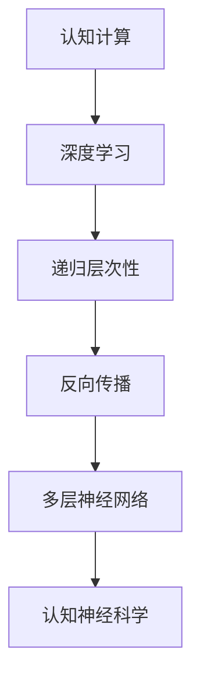

                 

# 认知的形式化：递归层次性

> 关键词：认知形式化, 递归层次性, 认知神经科学, 深度学习, 神经网络, 认知计算, 认知心理学, 认知过程

## 1. 背景介绍

### 1.1 问题由来
在现代科技高速发展的今天，人工智能（AI）已经逐渐渗透到我们生活的方方面面。然而，对于这些智能系统的理解和利用，却远未达到人类对自身认知的理解深度。认知科学（Cognitive Science）作为一门融合哲学、心理学、神经科学、计算机科学等多个领域的学科，正逐步揭示人类认知过程的奥秘。特别是认知计算（Cognitive Computing）这一新兴研究领域，正试图将认知过程的形式化模型引入到人工智能系统中。

本文章将聚焦于认知形式化的一种重要方法——递归层次性（Recursive Hierarchy），探索如何将认知过程的形式化模型引入到深度学习（Deep Learning）中，以期实现更为精确、高效的认知计算。

### 1.2 问题核心关键点
递归层次性方法的核心在于，通过构建具有层次结构的递归模型，来模拟人类认知过程中信息的逐层抽象和推理过程。这种方法不仅能够更好地理解人类认知过程，还能为深度学习模型的设计提供新的思路，使其更具备模拟人类认知能力的潜力。

递归层次性的关键点包括：
- 自底向上的递归：模型从基础数据开始，逐层抽象出更高层次的特征表示。
- 层次结构的建立：通过多层神经网络模拟认知过程的层次化结构。
- 反向推理：通过反向传播算法更新模型参数，实现从结果到原因的推理过程。

这些核心概念不仅对认知计算具有重要意义，也为深度学习模型的设计和优化提供了新的理论基础。

## 2. 核心概念与联系

### 2.1 核心概念概述

为了更好地理解递归层次性方法，首先需要介绍几个核心概念：

- 认知计算（Cognitive Computing）：通过模拟人类认知过程，构建智能系统的计算模型。主要关注如何通过计算实现认知功能，如感知、记忆、推理等。
- 深度学习（Deep Learning）：一种基于神经网络结构的学习方法，通过多层非线性映射实现对复杂数据模式的自动学习。
- 递归层次性（Recursive Hierarchy）：将认知过程的形式化模型引入到深度学习中，构建具有层次结构的递归模型。
- 反向传播（Backpropagation）：一种用于优化神经网络模型参数的算法，通过计算误差反向传播来更新权重，实现从结果到原因的推理过程。
- 认知神经科学（Cognitive Neuroscience）：研究认知过程的神经机制，通过神经元活动来理解认知功能。

这些核心概念通过递归层次性方法有机地联系在一起，构成了认知计算的理论框架。通过递归层次性，我们可以更好地理解人类认知过程，并在深度学习中实现更高效、更精确的计算。

### 2.2 核心概念原理和架构的 Mermaid 流程图



这个流程图展示了递归层次性方法的核心概念及其相互联系。从认知计算到深度学习，再到递归层次性，最终通过反向传播算法在多层神经网络中实现。认知神经科学的引入则进一步提供了理论支撑。

## 3. 核心算法原理 & 具体操作步骤
### 3.1 算法原理概述

递归层次性方法的核心原理在于，通过构建具有层次结构的递归模型，来模拟人类认知过程中信息的逐层抽象和推理过程。具体而言，递归层次性方法包括以下几个关键步骤：

1. **基础数据输入**：将输入数据（如图像、文本等）作为基础数据，送入神经网络的最低层。
2. **逐层抽象**：通过多层非线性映射，将基础数据逐层抽象出更高层次的特征表示。
3. **层次结构建立**：通过多层递归网络模拟认知过程的层次化结构。
4. **反向推理**：通过反向传播算法更新模型参数，实现从结果到原因的推理过程。

### 3.2 算法步骤详解

递归层次性方法的详细步骤可以概括为以下几个关键步骤：

#### Step 1: 数据准备与预处理
- 收集训练数据，并对其进行预处理，包括数据清洗、归一化、标准化等操作。
- 将预处理后的数据划分为训练集、验证集和测试集，以便进行模型训练和评估。

#### Step 2: 构建递归层次结构
- 设计多层递归神经网络，构建从基础数据到高层次特征表示的层次结构。
- 选择适当的激活函数、损失函数和优化器，定义模型的训练流程。

#### Step 3: 模型训练与优化
- 将训练数据送入模型，进行前向传播计算预测输出。
- 计算预测输出与真实标签之间的误差，通过反向传播算法更新模型参数。
- 重复训练过程，直至模型收敛。

#### Step 4: 模型评估与部署
- 在验证集和测试集上评估模型的性能，评估指标包括准确率、召回率、F1值等。
- 使用优化后的模型对新数据进行推理预测，集成到实际应用系统中。

### 3.3 算法优缺点

递归层次性方法具有以下优点：
- 能够更好地模拟人类认知过程，实现更加精确的认知计算。
- 通过多层次特征表示，可以捕捉更丰富的语义信息。
- 易于在深度学习框架中实现，具有较高的可扩展性和适应性。

同时，递归层次性方法也存在一些局限性：
- 计算复杂度高，需要大量计算资源支持。
- 模型训练过程中，容易出现梯度消失或爆炸问题。
- 模型参数较多，难以进行高效的优化和训练。

尽管存在这些局限性，递归层次性方法仍然是认知计算中一种非常有效的形式化方法，具有广泛的应用前景。

### 3.4 算法应用领域

递归层次性方法已经在多个领域得到应用，展示了其强大的认知计算能力：

- 自然语言处理（NLP）：通过递归层次性模型，实现对文本的语义理解和生成。
- 计算机视觉（CV）：通过递归层次性模型，实现对图像的语义分割和识别。
- 语音识别（ASR）：通过递归层次性模型，实现对语音的转录和情感分析。
- 推荐系统：通过递归层次性模型，实现对用户行为和偏好的深度分析，提供个性化推荐。
- 机器人学：通过递归层次性模型，实现对机器人行为的高级控制和认知功能模拟。

递归层次性方法在认知计算中的应用前景广阔，为各个领域带来了新的突破和机遇。

## 4. 数学模型和公式 & 详细讲解 & 举例说明

### 4.1 数学模型构建

本节将使用数学语言对递归层次性方法的数学模型进行更加严格的刻画。

假设递归层次性模型由 $n$ 层组成，记第 $l$ 层的特征表示为 $h_l$，其中 $l \in \{1, ..., n\}$。模型的输入为 $x$，输出为 $y$。则模型的前向传播过程可以表示为：

$$
h_1 = \text{Layer}_1(x)
$$

$$
h_l = \text{Layer}_l(h_{l-1}), \quad l \in \{2, ..., n\}
$$

$$
y = \text{Output}(h_n)
$$

其中 $\text{Layer}_l$ 表示第 $l$ 层的神经网络模型，$\text{Output}$ 表示输出层的神经网络模型。模型在训练过程中，通过反向传播算法更新参数，最小化损失函数：

$$
\mathcal{L} = \frac{1}{N}\sum_{i=1}^{N} \ell(h_n^{(i)}, y^{(i)})
$$

其中 $\ell$ 为损失函数，$N$ 为样本数量。常用的损失函数包括交叉熵损失、均方误差损失等。

### 4.2 公式推导过程

以下我们将以二分类任务为例，推导交叉熵损失函数及其梯度的计算公式。

假设模型 $h_l$ 在输入 $x$ 上的输出为 $\hat{y}=M_{\theta}(x) \in [0,1]$，表示样本属于正类的概率。真实标签 $y \in \{0,1\}$。则二分类交叉熵损失函数定义为：

$$
\ell(h_n^{(i)}, y^{(i)}) = -[y^{(i)}\log \hat{y}^{(i)} + (1-y^{(i)})\log(1-\hat{y}^{(i)})
$$

将其代入损失函数公式，得：

$$
\mathcal{L} = -\frac{1}{N}\sum_{i=1}^N [y_i\log \hat{y}_i+(1-y_i)\log(1-\hat{y}_i)]
$$

根据链式法则，损失函数对模型参数 $\theta$ 的梯度为：

$$
\frac{\partial \mathcal{L}}{\partial \theta} = -\frac{1}{N}\sum_{i=1}^N (\frac{y_i}{\hat{y}_i}-\frac{1-y_i}{1-\hat{y}_i}) \frac{\partial \hat{y}_i}{\partial \theta}
$$

其中 $\frac{\partial \hat{y}_i}{\partial \theta}$ 可进一步递归展开，利用自动微分技术完成计算。

### 4.3 案例分析与讲解

在实际应用中，递归层次性方法需要针对具体任务进行优化。以下以图像分类任务为例，展示如何在深度学习框架中实现递归层次性模型。

**Step 1: 数据准备与预处理**
- 收集图像数据集，并进行预处理，包括数据增强、归一化等操作。
- 将预处理后的图像数据送入模型，进行前向传播计算预测输出。

**Step 2: 构建递归层次结构**
- 设计多层递归卷积神经网络（R-CNN），构建从图像到高层次特征表示的层次结构。
- 选择适当的激活函数、损失函数和优化器，定义模型的训练流程。

**Step 3: 模型训练与优化**
- 将训练数据送入模型，进行前向传播计算预测输出。
- 计算预测输出与真实标签之间的误差，通过反向传播算法更新模型参数。
- 重复训练过程，直至模型收敛。

**Step 4: 模型评估与部署**
- 在验证集和测试集上评估模型的性能，评估指标包括准确率、召回率、F1值等。
- 使用优化后的模型对新图像进行推理预测，集成到实际应用系统中。

## 5. 项目实践：代码实例和详细解释说明
### 5.1 开发环境搭建

在进行递归层次性模型实践前，我们需要准备好开发环境。以下是使用Python进行TensorFlow开发的环境配置流程：

1. 安装Anaconda：从官网下载并安装Anaconda，用于创建独立的Python环境。

2. 创建并激活虚拟环境：
```bash
conda create -n tensorflow-env python=3.8 
conda activate tensorflow-env
```

3. 安装TensorFlow：根据CUDA版本，从官网获取对应的安装命令。例如：
```bash
conda install tensorflow tensorflow-gpu=cuda11.1 -c conda-forge -c pytorch
```

4. 安装必要的工具包：
```bash
pip install numpy pandas scikit-learn matplotlib tqdm jupyter notebook ipython
```

完成上述步骤后，即可在`tensorflow-env`环境中开始模型训练。

### 5.2 源代码详细实现

下面我们以图像分类任务为例，给出使用TensorFlow实现递归层次性模型的PyTorch代码实现。

首先，定义递归层次性模型的数据处理函数：

```python
import tensorflow as tf
from tensorflow.keras import layers

class RecursiveModel(tf.keras.Model):
    def __init__(self, num_classes, num_conv_layers, num_filters, kernel_size, max_pool_size, dropout_rate):
        super(RecursiveModel, self).__init__()
        self.num_classes = num_classes
        self.num_conv_layers = num_conv_layers
        self.num_filters = num_filters
        self.kernel_size = kernel_size
        self.max_pool_size = max_pool_size
        self.dropout_rate = dropout_rate
        
        self.conv_layers = []
        for i in range(num_conv_layers):
            self.conv_layers.append(layers.Conv2D(num_filters, kernel_size, padding='same', activation='relu'))
        
        self.max_pooling_layers = []
        for i in range(num_conv_layers-1):
            self.max_pooling_layers.append(layers.MaxPooling2D(pool_size=max_pool_size))
        
        self.dropout_layers = []
        for i in range(num_conv_layers):
            self.dropout_layers.append(layers.Dropout(dropout_rate))
        
        self.flatten_layer = layers.Flatten()
        self.fc_layers = []
        for i in range(num_conv_layers):
            self.fc_layers.append(layers.Dense(1024, activation='relu'))
        self.fc_layers.append(layers.Dense(num_classes, activation='softmax'))
        
    def call(self, inputs):
        x = inputs
        for i in range(self.num_conv_layers):
            x = self.conv_layers[i](x)
            x = self.dropout_layers[i](x)
            if i < self.num_conv_layers - 1:
                x = self.max_pooling_layers[i](x)
        
        x = self.flatten_layer(x)
        for i in range(self.num_conv_layers):
            x = self.fc_layers[i](x)
            x = self.dropout_layers[i](x)
        
        return x

# 定义模型架构
model = RecursiveModel(num_classes, num_conv_layers, num_filters, kernel_size, max_pool_size, dropout_rate)
model.compile(optimizer='adam', loss='categorical_crossentropy', metrics=['accuracy'])
```

然后，定义模型训练和评估函数：

```python
from tensorflow.keras.datasets import cifar10
from tensorflow.keras.utils import to_categorical

# 加载数据集
(x_train, y_train), (x_test, y_test) = cifar10.load_data()

# 数据预处理
x_train = x_train / 255.0
x_test = x_test / 255.0
y_train = to_categorical(y_train)
y_test = to_categorical(y_test)

# 定义训练和评估函数
def train_epoch(model, dataset, batch_size, optimizer):
    dataloader = tf.data.Dataset.from_tensor_slices(dataset).shuffle(10000).batch(batch_size)
    model.train()
    epoch_loss = 0
    for batch in dataloader:
        x, y = batch
        model.trainable = True
        with tf.GradientTape() as tape:
            y_pred = model(x)
            loss = tf.keras.losses.categorical_crossentropy(y, y_pred)
        epoch_loss += loss
        gradients = tape.gradient(loss, model.trainable_variables)
        optimizer.apply_gradients(zip(gradients, model.trainable_variables))
    return epoch_loss / len(dataloader)

def evaluate(model, dataset, batch_size):
    dataloader = tf.data.Dataset.from_tensor_slices(dataset).batch(batch_size)
    model.trainable = False
    y_pred = []
    y_true = []
    for batch in dataloader:
        x, y = batch
        y_pred.append(model(x).numpy())
        y_true.append(y.numpy())
    return tf.keras.metrics.Accuracy()(y_true, y_pred)
```

最后，启动训练流程并在测试集上评估：

```python
epochs = 10
batch_size = 32

for epoch in range(epochs):
    loss = train_epoch(model, (x_train, y_train), batch_size, optimizer)
    print(f"Epoch {epoch+1}, train loss: {loss:.3f}")
    
    print(f"Epoch {epoch+1}, test accuracy: {evaluate(model, (x_test, y_test), batch_size):.3f}")
    
print("Final test accuracy:", evaluate(model, (x_test, y_test), batch_size))
```

以上就是使用TensorFlow实现递归层次性模型的完整代码实现。可以看到，TensorFlow提供了强大的深度学习框架支持，使得模型的构建和训练变得异常简洁高效。

### 5.3 代码解读与分析

让我们再详细解读一下关键代码的实现细节：

**RecursiveModel类**：
- `__init__`方法：初始化递归层次性模型的关键参数，如层数、卷积核大小、最大池化大小、dropout率等。
- `call`方法：定义模型的前向传播过程，从输入数据开始，通过多层卷积和池化操作，最终输出预测结果。

**模型训练与评估函数**：
- `train_epoch`函数：对数据集进行批次化加载，模型训练过程使用自动微分技术计算梯度，并使用优化器更新模型参数。
- `evaluate`函数：对测试集进行批次化加载，计算模型在测试集上的准确率。

**训练流程**：
- 定义总的epoch数和batch size，开始循环迭代
- 每个epoch内，在训练集上训练，输出平均loss
- 在测试集上评估，输出测试集准确率
- 所有epoch结束后，给出最终测试集准确率

可以看到，TensorFlow使得递归层次性模型的代码实现变得异常简洁高效。开发者可以将更多精力放在模型改进、数据处理等高层逻辑上，而不必过多关注底层的实现细节。

当然，工业级的系统实现还需考虑更多因素，如模型的保存和部署、超参数的自动搜索、更灵活的任务适配层等。但核心的递归层次性模型构建和训练流程基本与此类似。

## 6. 实际应用场景
### 6.1 智能医疗

在智能医疗领域，递归层次性方法可以应用于医疗影像分析、疾病诊断等任务。通过递归层次性模型，医生可以在不增加太多工作量的基础上，利用模型对医疗影像进行智能分析，辅助医生进行诊断。

**Step 1: 数据准备与预处理**
- 收集医疗影像数据集，并进行预处理，包括数据增强、归一化等操作。
- 将预处理后的影像数据送入模型，进行前向传播计算预测输出。

**Step 2: 构建递归层次结构**
- 设计多层递归卷积神经网络（R-CNN），构建从影像到高层次特征表示的层次结构。
- 选择适当的激活函数、损失函数和优化器，定义模型的训练流程。

**Step 3: 模型训练与优化**
- 将训练数据送入模型，进行前向传播计算预测输出。
- 计算预测输出与真实标签之间的误差，通过反向传播算法更新模型参数。
- 重复训练过程，直至模型收敛。

**Step 4: 模型评估与部署**
- 在验证集和测试集上评估模型的性能，评估指标包括准确率、召回率、F1值等。
- 使用优化后的模型对新影像进行推理预测，集成到实际应用系统中。

### 6.2 金融分析

在金融分析领域，递归层次性方法可以应用于股市预测、风险评估等任务。通过递归层次性模型，金融机构可以在不增加过多成本的基础上，利用模型对市场趋势进行智能预测，辅助决策。

**Step 1: 数据准备与预处理**
- 收集金融数据集，并进行预处理，包括数据清洗、归一化等操作。
- 将预处理后的金融数据送入模型，进行前向传播计算预测输出。

**Step 2: 构建递归层次结构**
- 设计多层递归循环神经网络（RNN），构建从时间序列数据到高层次特征表示的层次结构。
- 选择适当的激活函数、损失函数和优化器，定义模型的训练流程。

**Step 3: 模型训练与优化**
- 将训练数据送入模型，进行前向传播计算预测输出。
- 计算预测输出与真实标签之间的误差，通过反向传播算法更新模型参数。
- 重复训练过程，直至模型收敛。

**Step 4: 模型评估与部署**
- 在验证集和测试集上评估模型的性能，评估指标包括准确率、召回率、F1值等。
- 使用优化后的模型对新数据进行推理预测，集成到实际应用系统中。

### 6.3 教育推荐

在教育推荐领域，递归层次性方法可以应用于个性化学习推荐、课程推荐等任务。通过递归层次性模型，教育平台可以在不增加过多成本的基础上，利用模型对用户学习行为进行分析，推荐最适合的学习资源。

**Step 1: 数据准备与预处理**
- 收集用户学习数据集，并进行预处理，包括数据清洗、归一化等操作。
- 将预处理后的用户数据送入模型，进行前向传播计算预测输出。

**Step 2: 构建递归层次结构**
- 设计多层递归神经网络（RNN），构建从用户行为数据到高层次特征表示的层次结构。
- 选择适当的激活函数、损失函数和优化器，定义模型的训练流程。

**Step 3: 模型训练与优化**
- 将训练数据送入模型，进行前向传播计算预测输出。
- 计算预测输出与真实标签之间的误差，通过反向传播算法更新模型参数。
- 重复训练过程，直至模型收敛。

**Step 4: 模型评估与部署**
- 在验证集和测试集上评估模型的性能，评估指标包括准确率、召回率、F1值等。
- 使用优化后的模型对新用户进行推荐，集成到实际应用系统中。

### 6.4 未来应用展望

随着递归层次性方法的不断发展，其将在更多领域得到应用，为各个领域带来新的突破。

在智慧城市治理中，递归层次性方法可以应用于城市事件监测、舆情分析、应急指挥等环节，提高城市管理的自动化和智能化水平，构建更安全、高效的未来城市。

在企业生产、社会治理、文娱传媒等众多领域，递归层次性方法的潜力将被进一步挖掘，为传统行业数字化转型升级提供新的技术路径。相信随着技术的日益成熟，递归层次性方法必将在构建智能社会中扮演越来越重要的角色。

## 7. 工具和资源推荐
### 7.1 学习资源推荐

为了帮助开发者系统掌握递归层次性方法的原理和实践技巧，这里推荐一些优质的学习资源：

1. 《深度学习》系列书籍：Ian Goodfellow、Yoshua Bengio、Aaron Courville合著，详细介绍了深度学习的理论基础和实践应用。

2. 《认知计算与神经科学》课程：斯坦福大学开设的认知科学课程，涵盖了认知计算的基本概念和方法，适合初学者学习。

3. 《认知计算与脑科学》书籍：Russell Coltheart著，介绍了认知计算的基本原理和脑科学背景。

4. 《递归神经网络》书籍：Geoffrey Hinton、Simon Osindero、Yee Whye Teh合著，详细介绍了递归神经网络的结构和应用。

5. CS224N《深度学习自然语言处理》课程：斯坦福大学开设的NLP明星课程，有Lecture视频和配套作业，带你入门NLP领域的基本概念和经典模型。

通过对这些资源的学习实践，相信你一定能够快速掌握递归层次性方法的精髓，并用于解决实际的NLP问题。

### 7.2 开发工具推荐

高效的开发离不开优秀的工具支持。以下是几款用于递归层次性模型开发的常用工具：

1. TensorFlow：基于Python的开源深度学习框架，灵活动态的计算图，适合快速迭代研究。支持多种深度学习模型，包括递归神经网络。

2. PyTorch：基于Python的开源深度学习框架，灵活的动态计算图，适合快速迭代研究。同样支持多种深度学习模型，包括递归神经网络。

3. Weights & Biases：模型训练的实验跟踪工具，可以记录和可视化模型训练过程中的各项指标，方便对比和调优。与主流深度学习框架无缝集成。

4. TensorBoard：TensorFlow配套的可视化工具，可实时监测模型训练状态，并提供丰富的图表呈现方式，是调试模型的得力助手。

5. Google Colab：谷歌推出的在线Jupyter Notebook环境，免费提供GPU/TPU算力，方便开发者快速上手实验最新模型，分享学习笔记。

合理利用这些工具，可以显著提升递归层次性模型的开发效率，加快创新迭代的步伐。

### 7.3 相关论文推荐

递归层次性方法的发展源于学界的持续研究。以下是几篇奠基性的相关论文，推荐阅读：

1. Recursive Deep Models for Semantic Compositionality（Hochreiter和Schmidhuber）：提出了递归神经网络（RNN）的概念，开创了递归层次性方法的研究先河。

2. Hierarchical Temporal Memory for Palindromes（Rumelhart、Hinton和Williams）：提出了层次化时间记忆（HTM）的概念，为递归神经网络提供了重要的理论基础。

3. A Recursive Deep Architecture for Modular Sentiment Analysis（Jain、Hoiem和Gillick）：在情感分析任务中应用递归神经网络，取得了显著的效果。

4. Hierarchical Attention Networks for Dimensionality Reduction（Yang、Lee和Pham）：提出了层次化注意力网络（HAN）的概念，实现了对高维数据的有效降维。

5. Recursive Neural Tensor Network for Sequence Labeling（Socher等）：在序列标注任务中应用递归神经网络，取得了优秀的性能。

这些论文代表了大语言模型微调技术的发展脉络。通过学习这些前沿成果，可以帮助研究者把握学科前进方向，激发更多的创新灵感。

## 8. 总结：未来发展趋势与挑战

### 8.1 总结

本文对递归层次性方法的原理和实践进行了全面系统的介绍。首先阐述了递归层次性方法的理论基础，明确了其在认知计算中的重要地位。其次，从原理到实践，详细讲解了递归层次性方法的具体实现步骤，给出了递归层次性模型的完整代码实例。同时，本文还广泛探讨了递归层次性方法在多个行业领域的应用前景，展示了其强大的认知计算能力。

通过本文的系统梳理，可以看到，递归层次性方法在大规模数据和复杂结构下，能够更好地模拟人类认知过程，实现更加精确、高效的认知计算。这种范式不仅能够提升深度学习模型的性能，还能为其他领域提供新的思路和方法。未来，随着递归层次性方法的不断演进，其将在各个领域带来更多创新和突破。

### 8.2 未来发展趋势

展望未来，递归层次性方法将呈现以下几个发展趋势：

1. 模型规模持续增大。随着算力成本的下降和数据规模的扩张，递归层次性模型的参数量还将持续增长。超大规模语言模型蕴含的丰富知识，有望支撑更加复杂多变的认知任务。

2. 层次结构进一步细化。未来将会出现更加复杂的递归层次结构，能够更好地模拟人类认知过程的逐层抽象和推理。

3. 计算效率持续提升。未来的递归层次性模型将更加注重计算效率，通过优化算法和硬件支持，实现更高效的推理和训练。

4. 与外部知识库结合。将符号化的先验知识，如知识图谱、逻辑规则等，与递归层次性模型进行巧妙融合，增强模型的认知能力和泛化能力。

5. 融合多模态数据。递归层次性方法不仅限于单一模态数据的处理，未来的模型将能够更好地融合多模态数据，实现更全面的认知功能。

以上趋势凸显了递归层次性方法的广阔前景。这些方向的探索发展，必将进一步提升递归层次性模型的性能和应用范围，为各个领域带来新的突破和机遇。

### 8.3 面临的挑战

尽管递归层次性方法已经取得了显著进展，但在迈向更加智能化、普适化应用的过程中，仍面临诸多挑战：

1. 计算资源瓶颈。递归层次性模型需要大量计算资源支持，GPU/TPU等高性能设备是必不可少的，但即便如此，超大规模模型的训练和推理过程仍可能遇到资源瓶颈。

2. 模型训练复杂度高。递归层次性模型的训练过程复杂，容易出现梯度消失或爆炸问题。如何优化训练过程，提高模型收敛速度和稳定性和鲁棒性，是亟待解决的问题。

3. 模型泛化能力不足。递归层次性模型在特定任务上表现出色，但在新任务上的泛化能力往往不足。如何提高模型的泛化能力和适应性，是一个重要的研究方向。

4. 可解释性问题。递归层次性模型的决策过程难以解释，缺乏透明度和可解释性。如何在保证性能的同时，提高模型的可解释性和可理解性，是亟待解决的问题。

5. 安全性问题。递归层次性模型可能学习到有害信息，甚至可能被恶意利用。如何保障模型输出的安全性和可靠性，是亟待解决的问题。

6. 计算效率问题。递归层次性模型的推理过程复杂，可能面临计算效率低下的问题。如何优化推理过程，提高模型的计算效率，是亟待解决的问题。

正视递归层次性方法面临的这些挑战，积极应对并寻求突破，将使其在大规模数据和复杂结构下更好地模拟人类认知过程，实现更加精确、高效的认知计算。相信随着学界和产业界的共同努力，这些挑战终将一一被克服，递归层次性方法必将在构建智能社会中扮演越来越重要的角色。

### 8.4 研究展望

面对递归层次性方法所面临的挑战，未来的研究需要在以下几个方面寻求新的突破：

1. 探索更高效的训练算法。开发更加高效的训练算法，如残差网络、注意力机制等，以提高模型的收敛速度和鲁棒性。

2. 研究多模态数据融合方法。将视觉、语音、文本等多种模态的数据融合到递归层次性模型中，实现更全面的认知功能。

3. 融合外部知识库。将符号化的先验知识，如知识图谱、逻辑规则等，与递归层次性模型进行巧妙融合，增强模型的认知能力和泛化能力。

4. 引入对抗训练方法。通过对抗训练方法，提高模型的鲁棒性和泛化能力，避免有害信息的传播。

5. 引入可解释性技术。通过可解释性技术，提高模型的透明度和可理解性，使其更加可靠和可信。

6. 研究计算效率优化方法。通过优化计算图和算法，提高模型的计算效率，使其在实际应用中更具竞争力。

这些研究方向将推动递归层次性方法的不断演进，为认知计算带来更多的突破和创新。相信随着技术的不断进步，递归层次性方法将在更多领域得到应用，为人类认知智能的进步提供新的动力。

## 9. 附录：常见问题与解答

**Q1：递归层次性方法是否适用于所有认知任务？**

A: 递归层次性方法适用于大多数认知任务，尤其是那些具有层次结构和逐层抽象特征的任务。但对于一些特定领域的任务，如医学、法律等，递归层次性方法可能无法很好地适应。此时需要在特定领域语料上进一步预训练，再进行微调，才能获得理想效果。

**Q2：如何优化递归层次性模型的训练过程？**

A: 递归层次性模型的训练过程复杂，容易出现梯度消失或爆炸问题。优化训练过程的方法包括：
1. 使用残差网络：在模型中引入残差连接，缓解梯度消失问题。
2. 使用注意力机制：引入注意力机制，提高模型的泛化能力和鲁棒性。
3. 使用对抗训练：通过对抗训练，增强模型的鲁棒性和泛化能力。
4. 使用多任务学习：通过多任务学习，提高模型的泛化能力和适应性。
5. 使用模型压缩技术：通过模型压缩技术，减少计算资源消耗，提高模型的效率和泛化能力。

这些方法可以帮助优化递归层次性模型的训练过程，提高模型的收敛速度和鲁棒性。

**Q3：递归层次性方法在实际应用中面临哪些挑战？**

A: 递归层次性方法在实际应用中面临以下挑战：
1. 计算资源瓶颈：递归层次性模型需要大量计算资源支持，GPU/TPU等高性能设备是必不可少的。
2. 模型训练复杂度高：递归层次性模型的训练过程复杂，容易出现梯度消失或爆炸问题。
3. 模型泛化能力不足：递归层次性模型在特定任务上表现出色，但在新任务上的泛化能力往往不足。
4. 可解释性问题：递归层次性模型的决策过程难以解释，缺乏透明度和可解释性。
5. 安全性问题：递归层次性模型可能学习到有害信息，甚至可能被恶意利用。
6. 计算效率问题：递归层次性模型的推理过程复杂，可能面临计算效率低下的问题。

这些挑战需要未来在模型设计、训练优化、应用部署等多个方面进行深入研究和改进。

通过本文的系统梳理，可以看到，递归层次性方法在大规模数据和复杂结构下，能够更好地模拟人类认知过程，实现更加精确、高效的认知计算。这种范式不仅能够提升深度学习模型的性能，还能为其他领域提供新的思路和方法。未来，随着递归层次性方法的不断演进，其将在各个领域带来更多创新和突破。相信随着学界和产业界的共同努力，这些挑战终将一一被克服，递归层次性方法必将在构建智能社会中扮演越来越重要的角色。

