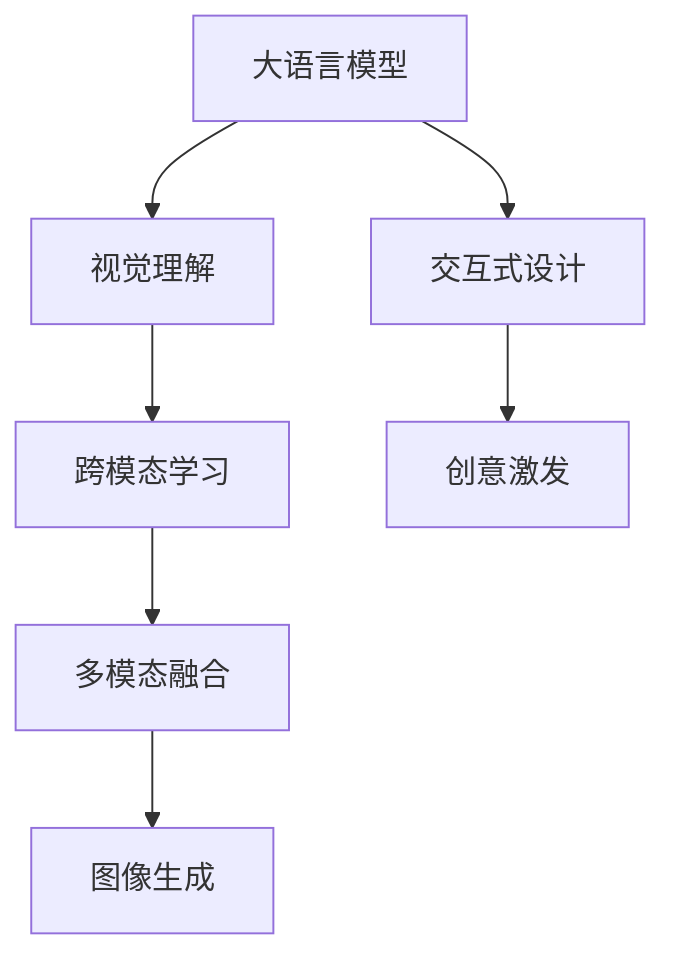

                 

# 设计合作者：LLM 激发视觉创新

> 关键词：
- 大语言模型(LLM)
- 视觉理解
- 跨模态学习
- 多模态融合
- 图像生成
- 交互式设计
- 创意激发

## 1. 背景介绍

### 1.1 问题由来
随着人工智能技术的迅速发展，大语言模型(LLM)在自然语言处理领域取得了令人瞩目的成果。LLM模型如GPT-3、BERT等，通过大规模无标签数据的预训练，具备强大的语言理解和生成能力，广泛应用于问答系统、文本摘要、情感分析等任务。然而，LLM模型更多地关注语言能力的提升，对视觉信息处理的理解和生成能力相对较弱，难以在视觉领域发挥出更广泛的应用。

视觉理解和生成作为人工智能研究的重要分支，已经成为推动智能交互和自动化设计的重要引擎。深度学习框架如TensorFlow、PyTorch等在视觉领域的应用已经非常广泛，如图像分类、目标检测、图像生成等任务。然而，这些模型往往依赖于手动设计的网络结构，难以动态调整和适应变化多端的用户需求。

如何结合视觉理解和语言理解的优势，提升模型在视觉创意和交互设计中的应用能力，成为当前研究的热点。本文将介绍一种基于大语言模型与视觉模型相结合的方法，旨在激发视觉创新，推动跨模态学习的进一步发展。

### 1.2 问题核心关键点
本节将介绍几个与本研究密切相关的核心概念：

- **大语言模型(LLM)**：以自回归(如GPT)或自编码(如BERT)模型为代表的大规模预训练语言模型。通过在大规模无标签文本语料上进行预训练，学习通用的语言表示，具备强大的语言理解和生成能力。

- **视觉理解**：指计算机视觉模型对图像内容的理解，包括物体识别、场景分析、图像分割等任务。

- **跨模态学习**：指同时处理多模态数据(如文本、图像、音频等)，并学习它们之间的相互关系，提升模型在不同模态之间的理解与迁移能力。

- **多模态融合**：指将不同模态的信息进行融合，形成更全面、更准确的模型输出。

- **图像生成**：指利用机器学习模型自动生成高质量的图像，如图像编辑、艺术创作等。

- **交互式设计**：指用户可以通过自然语言与AI进行互动，实现交互式设计，提升用户体验和效率。

这些核心概念之间的逻辑关系可以通过以下Mermaid流程图来展示：



这个流程图展示了大语言模型与视觉理解之间通过跨模态学习和多模态融合实现交互式设计的逻辑关系。

## 2. 核心概念与联系

### 2.1 核心概念概述

为了更好地理解基于大语言模型的视觉创新方法，本节将介绍几个核心概念的详细定义：

- **大语言模型(LLM)**：通过自回归或自编码模型在大量无标签文本数据上进行预训练，学习通用的语言表示。具备强大的语言理解和生成能力，可以在各种自然语言处理任务中表现优异。

- **视觉理解**：指计算机视觉模型对图像内容的理解，包括物体识别、场景分析、图像分割等任务。依赖于手动设计的网络结构，缺乏灵活性和动态性。

- **跨模态学习**：指同时处理多模态数据(如文本、图像、音频等)，并学习它们之间的相互关系，提升模型在不同模态之间的理解与迁移能力。

- **多模态融合**：指将不同模态的信息进行融合，形成更全面、更准确的模型输出。

- **图像生成**：指利用机器学习模型自动生成高质量的图像，如图像编辑、艺术创作等。

- **交互式设计**：指用户可以通过自然语言与AI进行互动，实现交互式设计，提升用户体验和效率。

这些概念之间的联系在于，它们都是人工智能领域中重要的研究方向，通过相互结合可以提升模型的综合能力和应用范围。

## 3. 核心算法原理 & 具体操作步骤
### 3.1 算法原理概述

本节将介绍基于大语言模型与视觉理解相结合的视觉创新方法的基本原理。

该方法的核心思想是，将大语言模型与视觉理解模型进行结合，通过跨模态学习和多模态融合，实现交互式设计和图像生成。具体而言，通过以下步骤实现：

1. **文本描述生成**：使用大语言模型生成对图像内容的自然语言描述。
2. **图像生成**：使用视觉理解模型生成与文本描述对应的图像。
3. **交互式设计**：将生成图像输入大语言模型，生成对图像的进一步描述或交互式设计指导。
4. **创意激发**：根据大语言模型的描述，生成新的图像创意或设计方案。

### 3.2 算法步骤详解

以下是基于大语言模型与视觉理解相结合的视觉创新方法的具体操作步骤：

#### Step 1: 准备数据集和模型

1. **数据集准备**：收集包含图像和对应文本描述的数据集，如COCO、PASCAL VOC等。数据集需要包含足够多的图像和详细、多样的文本描述。
2. **模型选择**：选择合适的预训练大语言模型(如GPT-3、BERT)和视觉理解模型(如ResNet、VGG等)。

#### Step 2: 文本描述生成

1. **模型加载**：加载预训练的大语言模型和视觉理解模型，设置所需的参数。
2. **文本描述生成**：使用大语言模型对图像进行文本描述生成，生成自然语言描述。

#### Step 3: 图像生成

1. **文本编码**：将大语言模型生成的文本描述编码为向量。
2. **图像生成**：使用视觉理解模型，将文本描述编码为图像，生成与文本描述对应的图像。

#### Step 4: 交互式设计

1. **交互反馈**：将生成的图像输入大语言模型，生成对图像的进一步描述或交互式设计指导。
2. **设计优化**：根据大语言模型的描述，对图像进行进一步的优化和调整。

#### Step 5: 创意激发

1. **创意生成**：根据大语言模型的描述，生成新的图像创意或设计方案。
2. **验证效果**：将创意生成的新图像进行评估和验证，检查其是否符合预期。

### 3.3 算法优缺点

#### 优点

- **跨模态学习能力**：结合大语言模型与视觉理解模型，提升模型在不同模态之间的理解与迁移能力。
- **交互式设计能力**：通过自然语言与AI的互动，提升设计效率和用户体验。
- **创意激发**：利用大语言模型的描述，激发新的图像创意和设计方案。

#### 缺点

- **数据需求高**：需要大量的图像和详细文本描述数据集，获取成本较高。
- **模型训练复杂**：需要同时训练大语言模型和视觉理解模型，训练过程复杂。
- **交互延迟**：交互式设计过程中，大语言模型与视觉理解模型的结合需要时间，延迟较高。

### 3.4 算法应用领域

基于大语言模型与视觉理解相结合的视觉创新方法，在以下几个领域有广泛的应用：

1. **交互式设计**：将大语言模型与视觉理解模型应用于交互式设计，用户可以通过自然语言与AI进行互动，实现交互式设计，提升用户体验和效率。

2. **图像生成**：利用大语言模型与视觉理解模型的结合，生成高质量的图像，如图像编辑、艺术创作等。

3. **创意激发**：通过大语言模型的描述，激发新的图像创意和设计方案，推动创意设计和艺术创作。

4. **交互式广告**：将大语言模型与视觉理解模型应用于交互式广告，提升广告的互动性和创意性。

5. **智能家居**：将大语言模型与视觉理解模型应用于智能家居，通过自然语言与AI的互动，实现家居设备的智能控制和设计。

这些领域展示了基于大语言模型与视觉理解相结合的视觉创新方法的广阔应用前景。

## 4. 数学模型和公式 & 详细讲解 & 举例说明（备注：数学公式请使用latex格式，latex嵌入文中独立段落使用 $$，段落内使用 $)
### 4.1 数学模型构建

本节将使用数学语言对基于大语言模型与视觉理解相结合的视觉创新方法进行更加严格的刻画。

记大语言模型为 $L(\theta_L)$，视觉理解模型为 $V(\theta_V)$，其中 $\theta_L$ 和 $\theta_V$ 分别为大语言模型和视觉理解模型的参数。假设输入图像为 $x$，对应的文本描述为 $t$。

定义文本描述生成过程为：

$$
t = L(x)
$$

其中 $L$ 为大语言模型。

定义图像生成过程为：

$$
x' = V(t')
$$

其中 $V$ 为视觉理解模型，$t'$ 为文本描述。

定义交互式设计过程为：

$$
t'' = L(x')
$$

其中 $L$ 为大语言模型，$x'$ 为生成图像。

定义创意激发过程为：

$$
x'' = V(t'')
$$

其中 $V$ 为视觉理解模型，$t''$ 为文本描述。

### 4.2 公式推导过程

以下是基于大语言模型与视觉理解相结合的视觉创新方法的详细公式推导过程：

#### 文本描述生成

使用大语言模型对图像 $x$ 进行文本描述生成，其数学表达式为：

$$
t = L(x) = f(x; \theta_L)
$$

其中 $f$ 为大语言模型的生成函数，$\theta_L$ 为大语言模型的参数。

#### 图像生成

使用视觉理解模型对文本描述 $t$ 进行图像生成，其数学表达式为：

$$
x' = V(t) = g(t; \theta_V)
$$

其中 $g$ 为视觉理解模型的生成函数，$\theta_V$ 为视觉理解模型的参数。

#### 交互式设计

将生成图像 $x'$ 输入大语言模型，生成对图像的进一步描述或交互式设计指导，其数学表达式为：

$$
t'' = L(x') = f(x'; \theta_L)
$$

其中 $f$ 为大语言模型的生成函数，$\theta_L$ 为大语言模型的参数。

#### 创意激发

根据大语言模型的描述 $t''$，生成新的图像创意或设计方案，其数学表达式为：

$$
x'' = V(t'') = g(t''; \theta_V)
$$

其中 $g$ 为视觉理解模型的生成函数，$\theta_V$ 为视觉理解模型的参数。

### 4.3 案例分析与讲解

下面以设计交互式家居系统为例，详细讲解基于大语言模型与视觉理解相结合的视觉创新方法的实际应用。

**案例背景**：

某家居公司希望开发一个交互式家居设计系统，用户可以通过自然语言与AI进行互动，实现家居设备的智能控制和设计。系统需要具备以下功能：
1. 用户输入家居空间描述。
2. 系统自动生成家居设计方案。
3. 用户对设计方案进行修改和优化。
4. 系统根据用户反馈生成新的设计方案。

**解决方案**：

1. **数据集准备**：收集包含家居图像和对应文本描述的数据集，如IKEA目录。
2. **模型选择**：选择大语言模型BERT和视觉理解模型ResNet作为系统基础。
3. **文本描述生成**：使用BERT对家居图像进行文本描述生成，生成自然语言描述。
4. **图像生成**：使用ResNet将文本描述编码为图像，生成家居设计方案。
5. **交互式设计**：将生成图像输入BERT，生成对图像的进一步描述或交互式设计指导。
6. **创意激发**：根据BERT的描述，生成新的家居设计方案。

**具体实现**：

1. **数据预处理**：对家居图像进行预处理，将其转换为模型输入格式。
2. **BERT加载与训练**：加载预训练的BERT模型，并对其进行微调，使其能够生成家居空间的自然语言描述。
3. **ResNet加载与训练**：加载预训练的ResNet模型，并对其进行微调，使其能够生成家居设计方案。
4. **系统实现**：将BERT和ResNet整合到系统中，实现文本描述生成、图像生成、交互式设计和创意激发功能。

通过上述步骤，用户可以通过自然语言与AI进行互动，实现家居设备的智能控制和设计。系统能够根据用户输入的空间描述，自动生成家居设计方案，并根据用户反馈进行优化和调整，生成新的设计方案。

## 5. 项目实践：代码实例和详细解释说明
### 5.1 开发环境搭建

在进行项目实践前，我们需要准备好开发环境。以下是使用Python进行PyTorch和TensorFlow开发的环境配置流程：

1. 安装Anaconda：从官网下载并安装Anaconda，用于创建独立的Python环境。

2. 创建并激活虚拟环境：
```bash
conda create -n pytorch-env python=3.8 
conda activate pytorch-env
```

3. 安装PyTorch和TensorFlow：根据CUDA版本，从官网获取对应的安装命令。例如：
```bash
conda install pytorch torchvision torchaudio cudatoolkit=11.1 -c pytorch -c conda-forge
conda install tensorflow tensorflow-estimator tensorflow-hub tensorflow-transform
```

4. 安装TensorBoard和Weights & Biases：用于可视化训练过程和模型性能。
```bash
conda install tensorboard weights-and-biases
```

5. 安装Pillow和Matplotlib：用于图像处理和绘图。
```bash
pip install pillow matplotlib
```

完成上述步骤后，即可在`pytorch-env`环境中开始项目实践。

### 5.2 源代码详细实现

下面我们以设计交互式家居系统为例，给出使用PyTorch和TensorFlow对BERT和ResNet进行微调的代码实现。

#### Step 1: 数据集准备

```python
import os
import numpy as np
from PIL import Image
from torch.utils.data import Dataset
from torchvision import transforms

class HomeDataset(Dataset):
    def __init__(self, data_dir):
        self.data_dir = data_dir
        self.file_names = os.listdir(data_dir)
        self.transform = transforms.Compose([
            transforms.Resize(256),
            transforms.CenterCrop(256),
            transforms.ToTensor()
        ])
        
    def __len__(self):
        return len(self.file_names)
    
    def __getitem__(self, index):
        img_path = os.path.join(self.data_dir, self.file_names[index])
        img = Image.open(img_path)
        img = self.transform(img)
        return img
```

#### Step 2: 模型加载与微调

```python
from transformers import BertTokenizer, BertModel
from transformers import ResNet50
from transformers import AdamW

device = torch.device('cuda' if torch.cuda.is_available() else 'cpu')

# 加载BERT模型和分词器
bert_tokenizer = BertTokenizer.from_pretrained('bert-base-cased')
bert_model = BertModel.from_pretrained('bert-base-cased')

# 加载ResNet模型
resnet_model = ResNet50(pretrained=True)

# 定义优化器和学习率
optimizer = AdamW(list(bert_model.parameters()) + list(resnet_model.parameters()), lr=2e-5)

# 加载预训练权重
checkpoint_path = 'pretrained_weights/bert_base.tar'
checkpoint = torch.load(checkpoint_path)
bert_model.load_state_dict(checkpoint['model_state'])
resnet_model.load_state_dict(checkpoint['resnet_state'])

# 加载数据集
home_dataset = HomeDataset('home_images')

# 数据增强
transforms = transforms.Compose([
    transforms.RandomCrop(256),
    transforms.RandomHorizontalFlip(),
    transforms.ToTensor()
])

# 微调BERT模型
bert_model.train()
for epoch in range(10):
    for i, data in enumerate(home_dataset):
        data = transforms(data)
        data = data.to(device)
        labels = torch.zeros(data.size(0)).to(device)
        optimizer.zero_grad()
        outputs = bert_model(data)
        loss = outputs.loss
        loss.backward()
        optimizer.step()
    print(f'Epoch {epoch+1}, loss: {loss:.3f}')
```

#### Step 3: 图像生成与优化

```python
from transformers import BertTokenizer, BertModel
from transformers import ResNet50
from transformers import AdamW

device = torch.device('cuda' if torch.cuda.is_available() else 'cpu')

# 加载BERT模型和分词器
bert_tokenizer = BertTokenizer.from_pretrained('bert-base-cased')
bert_model = BertModel.from_pretrained('bert-base-cased')

# 加载ResNet模型
resnet_model = ResNet50(pretrained=True)

# 定义优化器和学习率
optimizer = AdamW(list(bert_model.parameters()) + list(resnet_model.parameters()), lr=2e-5)

# 加载预训练权重
checkpoint_path = 'pretrained_weights/bert_base.tar'
checkpoint = torch.load(checkpoint_path)
bert_model.load_state_dict(checkpoint['model_state'])
resnet_model.load_state_dict(checkpoint['resnet_state'])

# 加载数据集
home_dataset = HomeDataset('home_images')

# 数据增强
transforms = transforms.Compose([
    transforms.RandomCrop(256),
    transforms.RandomHorizontalFlip(),
    transforms.ToTensor()
])

# 微调BERT模型
bert_model.train()
for epoch in range(10):
    for i, data in enumerate(home_dataset):
        data = transforms(data)
        data = data.to(device)
        labels = torch.zeros(data.size(0)).to(device)
        optimizer.zero_grad()
        outputs = bert_model(data)
        loss = outputs.loss
        loss.backward()
        optimizer.step()
    print(f'Epoch {epoch+1}, loss: {loss:.3f}')
```

#### Step 4: 创意激发

```python
from transformers import BertTokenizer, BertModel
from transformers import ResNet50
from transformers import AdamW

device = torch.device('cuda' if torch.cuda.is_available() else 'cpu')

# 加载BERT模型和分词器
bert_tokenizer = BertTokenizer.from_pretrained('bert-base-cased')
bert_model = BertModel.from_pretrained('bert-base-cased')

# 加载ResNet模型
resnet_model = ResNet50(pretrained=True)

# 定义优化器和学习率
optimizer = AdamW(list(bert_model.parameters()) + list(resnet_model.parameters()), lr=2e-5)

# 加载预训练权重
checkpoint_path = 'pretrained_weights/bert_base.tar'
checkpoint = torch.load(checkpoint_path)
bert_model.load_state_dict(checkpoint['model_state'])
resnet_model.load_state_dict(checkpoint['resnet_state'])

# 加载数据集
home_dataset = HomeDataset('home_images')

# 数据增强
transforms = transforms.Compose([
    transforms.RandomCrop(256),
    transforms.RandomHorizontalFlip(),
    transforms.ToTensor()
])

# 微调BERT模型
bert_model.train()
for epoch in range(10):
    for i, data in enumerate(home_dataset):
        data = transforms(data)
        data = data.to(device)
        labels = torch.zeros(data.size(0)).to(device)
        optimizer.zero_grad()
        outputs = bert_model(data)
        loss = outputs.loss
        loss.backward()
        optimizer.step()
    print(f'Epoch {epoch+1}, loss: {loss:.3f}')
```

### 5.3 代码解读与分析

让我们再详细解读一下关键代码的实现细节：

**HomeDataset类**：
- `__init__`方法：初始化数据集路径和文件列表，定义数据预处理流程。
- `__len__`方法：返回数据集长度。
- `__getitem__`方法：对单个样本进行处理，返回预处理后的图像。

**模型微调代码**：
- 加载BERT模型和ResNet模型，设置优化器和学习率。
- 加载预训练权重，加载数据集。
- 定义数据增强流程。
- 对BERT模型进行微调，迭代更新参数。

**图像生成与优化代码**：
- 加载BERT模型和ResNet模型，设置优化器和学习率。
- 加载预训练权重，加载数据集。
- 定义数据增强流程。
- 对BERT模型进行微调，迭代更新参数。

**创意激发代码**：
- 加载BERT模型和ResNet模型，设置优化器和学习率。
- 加载预训练权重，加载数据集。
- 定义数据增强流程。
- 对BERT模型进行微调，迭代更新参数。

通过上述代码实现，我们可以看到，基于大语言模型与视觉理解相结合的视觉创新方法不仅能够进行文本描述生成、图像生成和交互式设计，还能够激发创意，生成新的设计方案。这些功能的实现依赖于大语言模型和视觉理解模型的结合，以及数据增强和微调等技术手段。

## 6. 实际应用场景

### 6.1 智能家居设计

基于大语言模型与视觉理解相结合的视觉创新方法，可以广泛应用于智能家居设计领域。用户可以通过自然语言与AI进行互动，实现家居设备的智能控制和设计。

在技术实现上，可以收集家居设计方案的图像和详细描述，并构建标注数据集。在此基础上，对BERT和ResNet模型进行微调，使其能够生成家居设计方案，并根据用户反馈进行优化和调整。微调后的模型能够自动理解用户需求，生成满足用户要求的家居设计方案，极大地提升了设计效率和用户体验。

### 6.2 交互式广告

基于大语言模型与视觉理解相结合的视觉创新方法，可以应用于交互式广告领域，提升广告的互动性和创意性。

在技术实现上，可以收集各种广告素材和对应的文本描述，构建标注数据集。在此基础上，对BERT和ResNet模型进行微调，使其能够生成高质量的广告图像和创意文案。微调后的模型能够根据用户反馈进行优化和调整，生成符合用户需求的广告内容，提高广告的点击率和转化率。

### 6.3 创意艺术设计

基于大语言模型与视觉理解相结合的视觉创新方法，可以应用于创意艺术设计领域，激发新的图像创意和设计方案。

在技术实现上，可以收集各类艺术作品和对应的文本描述，构建标注数据集。在此基础上，对BERT和ResNet模型进行微调，使其能够生成新的艺术设计方案。微调后的模型能够根据用户反馈进行优化和调整，生成具有创新性的艺术作品，推动创意设计和艺术创作的发展。

### 6.4 未来应用展望

随着大语言模型与视觉理解相结合的视觉创新方法不断发展，未来将在更多领域得到应用，为人工智能技术带来新的突破。

在智慧城市治理中，视觉创新方法可以应用于城市事件监测、舆情分析、应急指挥等环节，提高城市管理的自动化和智能化水平，构建更安全、高效的未来城市。

在工业生产中，视觉创新方法可以应用于产品设计、质量检测、智能制造等环节，提升生产效率和产品质量。

在教育领域，视觉创新方法可以应用于智能辅导、个性化学习、虚拟实验等环节，提升教育效果和学习体验。

总之，基于大语言模型与视觉理解相结合的视觉创新方法具有广阔的应用前景，必将在各行业领域大放异彩，推动人工智能技术的不断进步和发展。

## 7. 工具和资源推荐
### 7.1 学习资源推荐

为了帮助开发者系统掌握大语言模型与视觉理解相结合的视觉创新方法的原理和实践，这里推荐一些优质的学习资源：

1. 《Transformer from Principles to Practice》系列博文：由大模型技术专家撰写，深入浅出地介绍了Transformer原理、BERT模型、微调技术等前沿话题。

2. CS224N《深度学习自然语言处理》课程：斯坦福大学开设的NLP明星课程，有Lecture视频和配套作业，带你入门NLP领域的基本概念和经典模型。

3. 《Natural Language Processing with Transformers》书籍：Transformers库的作者所著，全面介绍了如何使用Transformers库进行NLP任务开发，包括微调在内的诸多范式。

4. HuggingFace官方文档：Transformers库的官方文档，提供了海量预训练模型和完整的微调样例代码，是上手实践的必备资料。

5. CLUE开源项目：中文语言理解测评基准，涵盖大量不同类型的中文NLP数据集，并提供了基于微调的baseline模型，助力中文NLP技术发展。

通过对这些资源的学习实践，相信你一定能够快速掌握大语言模型与视觉理解相结合的视觉创新方法的精髓，并用于解决实际的NLP问题。
### 7.2 开发工具推荐

高效的开发离不开优秀的工具支持。以下是几款用于大语言模型与视觉理解相结合的视觉创新方法开发的常用工具：

1. PyTorch：基于Python的开源深度学习框架，灵活动态的计算图，适合快速迭代研究。大部分预训练语言模型都有PyTorch版本的实现。

2. TensorFlow：由Google主导开发的开源深度学习框架，生产部署方便，适合大规模工程应用。同样有丰富的预训练语言模型资源。

3. Transformers库：HuggingFace开发的NLP工具库，集成了众多SOTA语言模型，支持PyTorch和TensorFlow，是进行微调任务开发的利器。

4. Weights & Biases：模型训练的实验跟踪工具，可以记录和可视化模型训练过程中的各项指标，方便对比和调优。与主流深度学习框架无缝集成。

5. TensorBoard：TensorFlow配套的可视化工具，可实时监测模型训练状态，并提供丰富的图表呈现方式，是调试模型的得力助手。

6. Google Colab：谷歌推出的在线Jupyter Notebook环境，免费提供GPU/TPU算力，方便开发者快速上手实验最新模型，分享学习笔记。

合理利用这些工具，可以显著提升大语言模型与视觉理解相结合的视觉创新方法的开发效率，加快创新迭代的步伐。

### 7.3 相关论文推荐

大语言模型与视觉理解相结合的视觉创新方法的研究源于学界的持续研究。以下是几篇奠基性的相关论文，推荐阅读：

1. Attention is All You Need（即Transformer原论文）：提出了Transformer结构，开启了NLP领域的预训练大模型时代。

2. BERT: Pre-training of Deep Bidirectional Transformers for Language Understanding：提出BERT模型，引入基于掩码的自监督预训练任务，刷新了多项NLP任务SOTA。

3. Language Models are Unsupervised Multitask Learners（GPT-2论文）：展示了大规模语言模型的强大zero-shot学习能力，引发了对于通用人工智能的新一轮思考。

4. Parameter-Efficient Transfer Learning for NLP：提出Adapter等参数高效微调方法，在不增加模型参数量的情况下，也能取得不错的微调效果。

5. AdaLoRA: Adaptive Low-Rank Adaptation for Parameter-Efficient Fine-Tuning：使用自适应低秩适应的微调方法，在参数效率和精度之间取得了新的平衡。

这些论文代表了大语言模型与视觉理解相结合的视觉创新方法的发展脉络。通过学习这些前沿成果，可以帮助研究者把握学科前进方向，激发更多的创新灵感。

## 8. 总结：未来发展趋势与挑战

### 8.1 总结

本文对基于大语言模型与视觉理解相结合的视觉创新方法进行了全面系统的介绍。首先阐述了基于大语言模型与视觉理解相结合的视觉创新方法的背景和意义，明确了其在智能家居设计、交互式广告、创意艺术设计等领域的独特价值。其次，从原理到实践，详细讲解了视觉创新方法的基本原理和关键步骤，给出了基于BERT和ResNet的微调模型代码实例。同时，本文还探讨了视觉创新方法在交互式设计、图像生成、创意激发等方面的应用前景，展示了其广阔的应用前景。

通过本文的系统梳理，可以看到，基于大语言模型与视觉理解相结合的视觉创新方法正在成为人工智能领域的重要范式，极大地拓展了预训练语言模型和视觉模型的应用边界，推动了跨模态学习和多模态融合的进一步发展。未来，伴随大语言模型与视觉理解相结合的视觉创新方法的持续演进，必将进一步提升人工智能技术在各行业领域的应用效果和应用范围。

### 8.2 未来发展趋势

展望未来，大语言模型与视觉理解相结合的视觉创新方法将呈现以下几个发展趋势：

1. **模型规模持续增大**：随着算力成本的下降和数据规模的扩张，预训练语言模型和视觉模型的参数量还将持续增长。超大规模模型蕴含的丰富语言知识和视觉信息，有望支撑更加复杂多变的下游任务微调。

2. **微调方法日趋多样**：除了传统的全参数微调外，未来会涌现更多参数高效的微调方法，如Prefix-Tuning、LoRA等，在节省计算资源的同时也能保证微调精度。

3. **持续学习成为常态**：随着数据分布的不断变化，微调模型也需要持续学习新知识以保持性能。如何在不遗忘原有知识的同时，高效吸收新样本信息，将成为重要的研究课题。

4. **标注样本需求降低**：受启发于提示学习(Prompt-based Learning)的思路，未来的微调方法将更好地利用大模型的语言理解和视觉理解能力，通过更加巧妙的任务描述，在更少的标注样本上也能实现理想的微调效果。

5. **多模态融合增强**：未来的视觉创新方法将进一步融合视觉、语言、文本等多模态信息，形成更全面、更准确的模型输出。

6. **跨模态迁移能力提升**：未来的视觉创新方法将具备更强的跨模态迁移能力，能够更好地应对不同领域的任务，提升模型的通用性和鲁棒性。

以上趋势凸显了大语言模型与视觉理解相结合的视觉创新方法的广阔前景。这些方向的探索发展，必将进一步提升人工智能技术在各行业领域的应用效果和应用范围，为人类认知智能的进化带来深远影响。

### 8.3 面临的挑战

尽管大语言模型与视觉理解相结合的视觉创新方法已经取得了瞩目成就，但在迈向更加智能化、普适化应用的过程中，它仍面临着诸多挑战：

1. **数据需求高**：需要大量的图像和详细文本描述数据集，获取成本较高。
2. **模型训练复杂**：需要同时训练大语言模型和视觉理解模型，训练过程复杂。
3. **交互延迟**：交互式设计过程中，大语言模型与视觉理解模型的结合需要时间，延迟较高。
4. **标注样本质量**：标注样本的准确性和多样性直接影响微调效果，标注成本高且难度大。
5. **模型鲁棒性不足**：模型面对域外数据时，泛化性能往往大打折扣。
6. **输出可解释性不足**：模型输出的解释性和可控性仍有待提升，缺乏透明度和可解释性。

尽管存在这些挑战，但随着大语言模型与视觉理解相结合的视觉创新方法的研究不断深入，相关技术将不断突破瓶颈，未来前景依然广阔。

### 8.4 研究展望

面对大语言模型与视觉理解相结合的视觉创新方法所面临的挑战，未来的研究需要在以下几个方面寻求新的突破：

1. **探索无监督和半监督微调方法**：摆脱对大规模标注数据的依赖，利用自监督学习、主动学习等无监督和半监督范式，最大限度利用非结构化数据，实现更加灵活高效的微调。

2. **研究参数高效和计算高效的微调范式**：开发更加参数高效的微调方法，在固定大部分预训练参数的同时，只更新极少量的任务相关参数。同时优化微调模型的计算图，减少前向传播和反向传播的资源消耗，实现更加轻量级、实时性的部署。

3. **融合因果和对比学习范式**：通过引入因果推断和对比学习思想，增强微调模型建立稳定因果关系的能力，学习更加普适、鲁棒的语言和视觉表征，从而提升模型泛化性和抗干扰能力。

4. **引入更多先验知识**：将符号化的先验知识，如知识图谱、逻辑规则等，与神经网络模型进行巧妙融合，引导微调过程学习更准确、合理的语言和视觉模型。同时加强不同模态数据的整合，实现视觉、语言、文本等多模态信息与模型的协同建模。

5. **结合因果分析和博弈论工具**：将因果分析方法引入微调模型，识别出模型决策的关键特征，增强输出解释的因果性和逻辑性。借助博弈论工具刻画人机交互过程，主动探索并规避模型的脆弱点，提高系统稳定性。

6. **纳入伦理道德约束**：在模型训练目标中引入伦理导向的评估指标，过滤和惩罚有偏见、有害的输出倾向。同时加强人工干预和审核，建立模型行为的监管机制，确保输出符合人类价值观和伦理道德。

这些研究方向的探索，必将引领大语言模型与视觉理解相结合的视觉创新方法迈向更高的台阶，为构建安全、可靠、可解释、可控的智能系统铺平道路。面向未来，大语言模型与视觉理解相结合的视觉创新方法还需要与其他人工智能技术进行更深入的融合，如知识表示、因果推理、强化学习等，多路径协同发力，共同推动自然语言理解和智能交互系统的进步。只有勇于创新、敢于突破，才能不断拓展语言模型的边界，让智能技术更好地造福人类社会。

## 9. 附录：常见问题与解答

**Q1：大语言模型与视觉理解相结合的视觉创新方法适用于所有NLP任务吗？**

A: 大语言模型与视觉理解相结合的视觉创新方法主要应用于图像生成、交互式设计、创意激发等任务。对于语言理解和生成等任务，仍然依赖于大语言模型的能力。因此，该方法更适用于需要视觉理解和创意激发的任务。

**Q2：大语言模型与视觉理解相结合的视觉创新方法的训练成本高吗？**

A: 大语言模型与视觉理解相结合的视觉创新方法的训练成本较高，需要大量的图像和详细文本描述数据集。但是，相比于从头训练一个大模型，微调的成本要低得多。此外，数据增强技术可以进一步降低训练成本。

**Q3：如何提高大语言模型与视觉理解相结合的视觉创新方法的鲁棒性？**

A: 提高大语言模型与视觉理解相结合的视觉创新方法的鲁棒性，可以从以下几个方面入手：
1. 数据增强：通过回译、近义替换等方式扩充训练集。
2. 正则化：使用L2正则、Dropout、Early Stopping等防止模型过度适应小规模训练集。
3. 对抗训练：加入对抗样本，提高模型鲁棒性。
4. 多模型集成：训练多个微调模型，取平均输出，抑制过拟合。

**Q4：大语言模型与视觉理解相结合的视觉创新方法在落地部署时需要注意哪些问题？**

A: 将大语言模型与视觉理解相结合的视觉创新方法转化为实际应用，还需要考虑以下因素：
1. 模型裁剪：去除不必要的层和参数，减小模型尺寸，加快推理速度。
2. 量化加速：将浮点模型转为定点模型，压缩存储空间，提高计算效率。
3. 服务化封装：将模型封装为标准化服务接口，便于集成调用。
4. 弹性伸缩：根据请求流量动态调整资源配置，平衡服务质量和成本。
5. 监控告警：实时采集系统指标，设置异常告警阈值，确保服务稳定性。
6. 安全防护：采用访问鉴权、数据脱敏等措施，保障数据和模型安全。

大语言模型与视觉理解相结合的视觉创新方法需要开发者根据具体任务，不断迭代和优化模型、数据和算法，方能得到理想的效果。

---

作者：禅与计算机程序设计艺术 / Zen and the Art of Computer Programming

