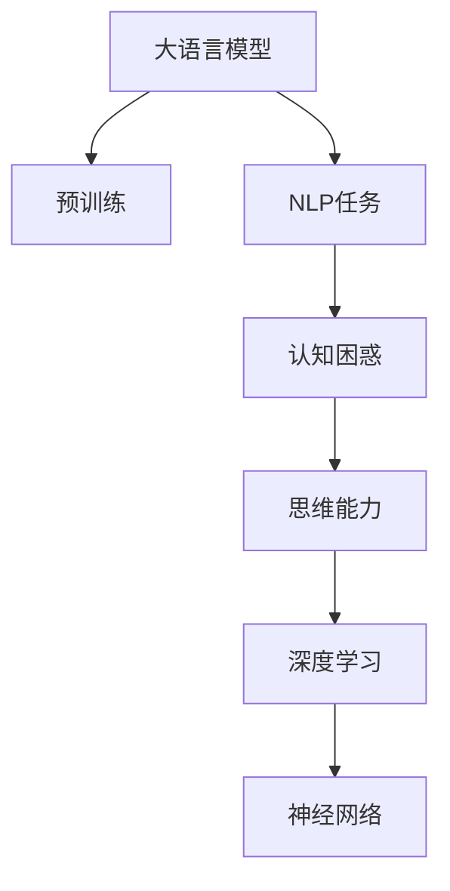

                 

# 语言与思维：大模型的认知困惑

> 关键词：大语言模型,认知困惑,语言理解,思维能力,深度学习,神经网络

## 1. 背景介绍

### 1.1 问题由来
随着深度学习技术的飞速发展，大语言模型（Large Language Models, LLMs）在自然语言处理（NLP）领域取得了突破性进展。这些模型通过在大规模无标签文本数据上进行预训练，学习到了丰富的语言知识和常识。但与此同时，大语言模型在模拟人类思维和语言理解方面，依然面临诸多认知上的困惑和挑战。

例如，如何处理语言的歧义性、如何理解上下文中的隐含意义、如何推断逻辑和因果关系等，都是大语言模型需要解决的核心问题。这些问题不仅影响模型的性能，也反映了现有技术在理解人类认知模式方面的不足。

### 1.2 问题核心关键点
认知困惑主要体现在大语言模型在理解自然语言的深层次语义和上下文关系时，常出现一些不符合人类常识或逻辑的现象。这些问题可能源于模型对语言的机械处理方式，或是模型本身知识库的不完整。

例如，模型可能会给出与人类常识不符的回答、逻辑错误、或是在不同上下文中给出矛盾的推理结果。这些问题暴露了现有模型在理解语言和思维方面存在的局限性。

### 1.3 问题研究意义
研究大语言模型的认知困惑，有助于揭示现有模型的工作原理和思维机制，从而为改进模型提供理论基础和技术方向。同时，理解这些困惑也能帮助开发更加人性化的智能系统，提升用户体验和系统可靠性。

认知困惑的解决，不仅有助于提升模型的实际应用效果，还能促进对人工智能理解的深入，推动认知智能领域的发展。

## 2. 核心概念与联系

### 2.1 核心概念概述

为了更好地理解大语言模型的认知困惑，本节将介绍几个核心概念：

- 大语言模型（Large Language Models, LLMs）：指通过在大规模文本数据上进行自监督预训练获得的自然语言处理模型，如GPT-3、BERT等。
- 自然语言处理（NLP）：指计算机处理和理解自然语言的技术，包括文本分类、情感分析、机器翻译等任务。
- 认知困惑（Cognitive Confusion）：指大语言模型在处理语言和逻辑推理时出现与人类常识或逻辑不符的现象。
- 思维能力（Thought Capability）：指大语言模型在推理、判断、创造性思维等方面的表现，是人类智能的关键特征之一。
- 深度学习（Deep Learning）：指利用多层次神经网络进行数据建模和训练的技术，大语言模型是其重要应用之一。
- 神经网络（Neural Network）：指模拟人脑神经元结构的计算模型，是深度学习的基础。

这些概念之间的逻辑关系可以通过以下Mermaid流程图来展示：



这个流程图展示了大语言模型的核心概念及其之间的关系：

1. 大语言模型通过预训练获得基础能力。
2. 预训练模型应用于各种NLP任务，但可能出现认知困惑。
3. 认知困惑反映了模型的思维能力不足。
4. 思维能力是深度学习模型的关键特征。
5. 深度学习基于神经网络，用于模拟人类的认知过程。

## 3. 核心算法原理 & 具体操作步骤

### 3.1 算法原理概述

大语言模型的认知困惑主要源于其在处理语言和逻辑推理时的局限性。这与深度学习模型对语言的机械处理方式有关。

深度学习模型通常基于经验风险最小化的目标，通过反向传播算法更新权重，以优化模型在特定任务上的性能。然而，这种基于局部梯度优化的方式，难以捕捉语言和思维的复杂性和多样性。

具体而言，大语言模型在处理语言时，可能无法理解语言的歧义性、上下文相关性、语境中的隐含意义等。这些因素可能导致模型在不同上下文中给出矛盾的推理结果，或是回答与常识不符的错误答案。

### 3.2 算法步骤详解

基于深度学习的大语言模型认知困惑的解决，通常包括以下几个关键步骤：

**Step 1: 数据准备与标注**
- 收集包含认知困惑场景的文本数据，如具有歧义性、矛盾性、逻辑错误的文本。
- 对数据进行标注，标记出模型推理结果中的错误或异常。

**Step 2: 模型微调和改进**
- 使用标注数据对预训练模型进行微调，优化模型的推理能力和知识库。
- 引入正则化技术（如L2正则、Dropout），防止模型过拟合。
- 应用对抗训练，提升模型的鲁棒性和泛化能力。

**Step 3: 模型评估与迭代**
- 在测试集上评估模型推理结果的正确性和一致性。
- 根据评估结果，进一步微调模型，直到推理结果与人类常识和逻辑相符。

**Step 4: 应用与反馈**
- 将微调后的模型应用于实际场景中，收集用户反馈。
- 持续收集反馈数据，迭代改进模型，提升认知能力。

### 3.3 算法优缺点

基于深度学习的大语言模型在处理认知困惑方面，具有以下优点：

1. 数据驱动：通过大规模标注数据，可以高效提升模型推理能力。
2. 模型改进：微调机制使模型能够不断学习和适应新的认知场景。
3. 技术成熟：深度学习模型在图像、语音等领域已取得了显著进展，可借鉴相关经验。

但同时，也存在以下局限：

1. 数据依赖：需要大量高质量标注数据，获取和标注成本较高。
2. 泛化能力：模型可能难以适应数据分布变化较大的新场景。
3. 复杂性：认知困惑问题复杂多样，难以一蹴而就。
4. 伦理考量：模型推理结果可能涉及敏感信息，需重视隐私保护。

尽管存在这些局限，但通过不断改进模型和数据，相信未来大语言模型在处理认知困惑方面的表现将有所提升。

### 3.4 算法应用领域

大语言模型认知困惑的研究与应用，已经在多个领域取得了进展：

1. **医疗诊断**：在医疗数据处理中，大语言模型可能出现对疾病症状描述的理解错误，导致误诊。研究其认知困惑，有助于提高诊断系统的准确性。
2. **金融分析**：在金融交易中，模型可能对市场趋势和风险评估产生错误判断。通过分析其认知困惑，可以优化金融预测模型，降低投资风险。
3. **法律文书处理**：在法律文书分析中，模型可能对法律条款和案例的理解产生偏差。通过改进模型认知，可以提高法律文书处理效率和准确性。
4. **智能客服**：在智能客服系统中，模型可能对用户意图理解不准确，导致回答错误。研究其认知困惑，可以优化客服系统，提高用户体验。

这些应用展示了大语言模型认知困惑研究的广泛前景，推动了各领域技术的进步。

## 4. 数学模型和公式 & 详细讲解 & 举例说明

### 4.1 数学模型构建

本节将使用数学语言对大语言模型处理认知困惑的机制进行更加严格的刻画。

记大语言模型为 $M_{\theta}$，其中 $\theta$ 为模型参数。假设输入文本为 $x$，目标输出为 $y$。模型的推理过程可以用概率分布 $p(y|x)$ 表示，其中 $y$ 为输出序列，$x$ 为输入序列。

大语言模型通常基于自回归模型（如GPT）或自编码模型（如BERT）进行预训练。预训练目标为最小化自回归条件概率 $p(x|y)$，即：

$$
\mathcal{L}(x) = -\log p(x|y)
$$

其中 $y$ 为序列掩码，标记了训练数据的自回归顺序。

在微调过程中，模型目标为最小化输入 $x$ 和目标输出 $y$ 之间的条件概率，即：

$$
\mathcal{L}(x,y) = -\log p(y|x)
$$

模型的推理结果 $y$ 与目标输出 $y^*$ 之间的差异可以表示为损失函数 $\ell(M_{\theta}(x), y^*)$，具体形式可能因任务不同而有所差异，如交叉熵损失、均方误差损失等。

### 4.2 公式推导过程

以下我们以分类任务为例，推导交叉熵损失函数及其梯度的计算公式。

假设模型 $M_{\theta}$ 在输入 $x$ 上的输出为 $\hat{y}=M_{\theta}(x) \in [0,1]$，表示样本属于正类的概率。真实标签 $y \in \{0,1\}$。则二分类交叉熵损失函数定义为：

$$
\ell(M_{\theta}(x),y) = -[y\log \hat{y} + (1-y)\log (1-\hat{y})]
$$

将其代入条件概率公式，得：

$$
\mathcal{L}(x,y) = -\log p(y|x) = -[y\log M_{\theta}(x) + (1-y)\log (1-M_{\theta}(x))]
$$

根据链式法则，损失函数对参数 $\theta_k$ 的梯度为：

$$
\frac{\partial \mathcal{L}(x,y)}{\partial \theta_k} = -\frac{\partial}{\partial \theta_k} [y\log M_{\theta}(x) + (1-y)\log (1-M_{\theta}(x))]
$$

在得到损失函数的梯度后，即可带入参数更新公式，完成模型的迭代优化。重复上述过程直至收敛，最终得到适应认知困惑场景的最优模型参数 $\theta^*$。

### 4.3 案例分析与讲解

以BERT模型在情感分析任务中的认知困惑为例，分析其推理错误和改进措施。

假设模型在输入文本 "今天天气真好" 和 "今天天气真差" 中，分别输出概率 $p_{good}$ 和 $p_{bad}$，表示正面和负面情绪的概率。理想情况下，模型应正确预测出第一个文本为正面情绪，第二个为负面情绪。但由于认知困惑，模型可能错误地预测出两个文本都为正面情绪。

为了解决这个问题，可以引入对抗样本训练，即在训练数据中引入一些与原数据相近但有明显情感偏差的样本。例如，将 "今天天气真好" 修改为 "今天天气真好，但突然下起了雨"，或将 "今天天气真差" 修改为 "今天天气真差，但太阳出来了"。通过这种方式，模型能够在训练过程中学习到如何处理情感变化的上下文信息，减少认知困惑。

## 5. 项目实践：代码实例和详细解释说明

### 5.1 开发环境搭建

在进行认知困惑研究时，我们需要准备好开发环境。以下是使用Python进行PyTorch开发的环境配置流程：

1. 安装Anaconda：从官网下载并安装Anaconda，用于创建独立的Python环境。

2. 创建并激活虚拟环境：
```bash
conda create -n pytorch-env python=3.8 
conda activate pytorch-env
```

3. 安装PyTorch：根据CUDA版本，从官网获取对应的安装命令。例如：
```bash
conda install pytorch torchvision torchaudio cudatoolkit=11.1 -c pytorch -c conda-forge
```

4. 安装Transformers库：
```bash
pip install transformers
```

5. 安装各类工具包：
```bash
pip install numpy pandas scikit-learn matplotlib tqdm jupyter notebook ipython
```

完成上述步骤后，即可在`pytorch-env`环境中开始认知困惑研究。

### 5.2 源代码详细实现

下面我们以BERT模型在情感分析任务中的认知困惑研究为例，给出使用Transformers库的PyTorch代码实现。

首先，定义情感分析任务的数据处理函数：

```python
from transformers import BertTokenizer
from torch.utils.data import Dataset
import torch

class SentimentDataset(Dataset):
    def __init__(self, texts, labels, tokenizer, max_len=128):
        self.texts = texts
        self.labels = labels
        self.tokenizer = tokenizer
        self.max_len = max_len
        
    def __len__(self):
        return len(self.texts)
    
    def __getitem__(self, item):
        text = self.texts[item]
        label = self.labels[item]
        
        encoding = self.tokenizer(text, return_tensors='pt', max_length=self.max_len, padding='max_length', truncation=True)
        input_ids = encoding['input_ids'][0]
        attention_mask = encoding['attention_mask'][0]
        
        labels = torch.tensor([label], dtype=torch.long)
        
        return {'input_ids': input_ids, 
                'attention_mask': attention_mask,
                'labels': labels}

# 标签与id的映射
label2id = {'positive': 1, 'negative': 0}
id2label = {v: k for k, v in label2id.items()}

# 创建dataset
tokenizer = BertTokenizer.from_pretrained('bert-base-cased')

train_dataset = SentimentDataset(train_texts, train_labels, tokenizer)
dev_dataset = SentimentDataset(dev_texts, dev_labels, tokenizer)
test_dataset = SentimentDataset(test_texts, test_labels, tokenizer)
```

然后，定义模型和优化器：

```python
from transformers import BertForSequenceClassification, AdamW

model = BertForSequenceClassification.from_pretrained('bert-base-cased', num_labels=2)

optimizer = AdamW(model.parameters(), lr=2e-5)
```

接着，定义训练和评估函数：

```python
from torch.utils.data import DataLoader
from tqdm import tqdm
from sklearn.metrics import accuracy_score

device = torch.device('cuda') if torch.cuda.is_available() else torch.device('cpu')
model.to(device)

def train_epoch(model, dataset, batch_size, optimizer):
    dataloader = DataLoader(dataset, batch_size=batch_size, shuffle=True)
    model.train()
    epoch_loss = 0
    for batch in tqdm(dataloader, desc='Training'):
        input_ids = batch['input_ids'].to(device)
        attention_mask = batch['attention_mask'].to(device)
        labels = batch['labels'].to(device)
        model.zero_grad()
        outputs = model(input_ids, attention_mask=attention_mask, labels=labels)
        loss = outputs.loss
        epoch_loss += loss.item()
        loss.backward()
        optimizer.step()
    return epoch_loss / len(dataloader)

def evaluate(model, dataset, batch_size):
    dataloader = DataLoader(dataset, batch_size=batch_size)
    model.eval()
    preds, labels = [], []
    with torch.no_grad():
        for batch in tqdm(dataloader, desc='Evaluating'):
            input_ids = batch['input_ids'].to(device)
            attention_mask = batch['attention_mask'].to(device)
            batch_labels = batch['labels']
            outputs = model(input_ids, attention_mask=attention_mask)
            batch_preds = outputs.logits.argmax(dim=1).to('cpu').tolist()
            batch_labels = batch_labels.to('cpu').tolist()
            for pred, label in zip(batch_preds, batch_labels):
                preds.append(pred)
                labels.append(label)
                
    print(f"Accuracy: {accuracy_score(labels, preds):.3f}")
```

最后，启动训练流程并在测试集上评估：

```python
epochs = 5
batch_size = 16

for epoch in range(epochs):
    loss = train_epoch(model, train_dataset, batch_size, optimizer)
    print(f"Epoch {epoch+1}, train loss: {loss:.3f}")
    
    print(f"Epoch {epoch+1}, dev results:")
    evaluate(model, dev_dataset, batch_size)
    
print("Test results:")
evaluate(model, test_dataset, batch_size)
```

以上就是使用PyTorch对BERT进行情感分析任务认知困惑研究的完整代码实现。可以看到，Transformers库的强大封装使得BERT模型的加载和微调过程变得简洁高效。

### 5.3 代码解读与分析

让我们再详细解读一下关键代码的实现细节：

**SentimentDataset类**：
- `__init__`方法：初始化文本、标签、分词器等关键组件。
- `__len__`方法：返回数据集的样本数量。
- `__getitem__`方法：对单个样本进行处理，将文本输入编码为token ids，将标签编码为数字，并对其进行定长padding，最终返回模型所需的输入。

**label2id和id2label字典**：
- 定义了标签与数字id之间的映射关系，用于将模型输出解码回真实的标签。

**训练和评估函数**：
- 使用PyTorch的DataLoader对数据集进行批次化加载，供模型训练和推理使用。
- 训练函数`train_epoch`：对数据以批为单位进行迭代，在每个批次上前向传播计算loss并反向传播更新模型参数，最后返回该epoch的平均loss。
- 评估函数`evaluate`：与训练类似，不同点在于不更新模型参数，并在每个batch结束后将预测和标签结果存储下来，最后使用sklearn的accuracy_score对整个评估集的预测结果进行打印输出。

**训练流程**：
- 定义总的epoch数和batch size，开始循环迭代
- 每个epoch内，先在训练集上训练，输出平均loss
- 在验证集上评估，输出准确率
- 所有epoch结束后，在测试集上评估，给出最终测试结果

可以看到，PyTorch配合Transformers库使得BERT微调的代码实现变得简洁高效。开发者可以将更多精力放在数据处理、模型改进等高层逻辑上，而不必过多关注底层的实现细节。

当然，工业级的系统实现还需考虑更多因素，如模型的保存和部署、超参数的自动搜索、更灵活的任务适配层等。但核心的微调范式基本与此类似。

## 6. 实际应用场景

### 6.1 智能客服系统

基于大语言模型的认知困惑研究，可以应用于智能客服系统的构建。传统客服往往需要配备大量人力，高峰期响应缓慢，且一致性和专业性难以保证。而使用认知困惑研究的对话模型，可以7x24小时不间断服务，快速响应客户咨询，用自然流畅的语言解答各类常见问题。

在技术实现上，可以收集企业内部的历史客服对话记录，将问题和最佳答复构建成监督数据，在此基础上对预训练对话模型进行微调。微调后的对话模型能够自动理解用户意图，匹配最合适的答案模板进行回复。对于客户提出的新问题，还可以接入检索系统实时搜索相关内容，动态组织生成回答。如此构建的智能客服系统，能大幅提升客户咨询体验和问题解决效率。

### 6.2 金融舆情监测

金融机构需要实时监测市场舆论动向，以便及时应对负面信息传播，规避金融风险。传统的人工监测方式成本高、效率低，难以应对网络时代海量信息爆发的挑战。基于大语言模型认知困惑研究的文本分类和情感分析技术，为金融舆情监测提供了新的解决方案。

具体而言，可以收集金融领域相关的新闻、报道、评论等文本数据，并对其进行主题标注和情感标注。在此基础上对预训练语言模型进行微调，使其能够自动判断文本属于何种主题，情感倾向是正面、中性还是负面。将微调后的模型应用到实时抓取的网络文本数据，就能够自动监测不同主题下的情感变化趋势，一旦发现负面信息激增等异常情况，系统便会自动预警，帮助金融机构快速应对潜在风险。

### 6.3 个性化推荐系统

当前的推荐系统往往只依赖用户的历史行为数据进行物品推荐，无法深入理解用户的真实兴趣偏好。基于大语言模型认知困惑研究的技术，个性化推荐系统可以更好地挖掘用户行为背后的语义信息，从而提供更精准、多样的推荐内容。

在实践中，可以收集用户浏览、点击、评论、分享等行为数据，提取和用户交互的物品标题、描述、标签等文本内容。将文本内容作为模型输入，用户的后续行为（如是否点击、购买等）作为监督信号，在此基础上微调预训练语言模型。微调后的模型能够从文本内容中准确把握用户的兴趣点。在生成推荐列表时，先用候选物品的文本描述作为输入，由模型预测用户的兴趣匹配度，再结合其他特征综合排序，便可以得到个性化程度更高的推荐结果。

### 6.4 未来应用展望

随着大语言模型认知困惑研究的不断深入，基于认知困惑范式将在更多领域得到应用，为NLP技术带来新的突破。

在智慧医疗领域，基于认知困惑研究的医疗问答、病历分析、药物研发等应用将提升医疗服务的智能化水平，辅助医生诊疗，加速新药开发进程。

在智能教育领域，认知困惑研究的提示学习、少样本学习等技术，可应用于作业批改、学情分析、知识推荐等方面，因材施教，促进教育公平，提高教学质量。

在智慧城市治理中，认知困惑研究的文本分类、情感分析、意图识别等技术，可应用于城市事件监测、舆情分析、应急指挥等环节，提高城市管理的自动化和智能化水平，构建更安全、高效的未来城市。

此外，在企业生产、社会治理、文娱传媒等众多领域，基于大模型认知困惑的研究与应用也将不断涌现，为经济社会发展注入新的动力。相信随着技术的日益成熟，认知困惑方法将成为人工智能落地应用的重要范式，推动人工智能技术向更广阔的领域加速渗透。

## 7. 工具和资源推荐
### 7.1 学习资源推荐

为了帮助开发者系统掌握大语言模型认知困惑的理论基础和实践技巧，这里推荐一些优质的学习资源：

1. 《Transformer from Scratch》系列博文：由大模型技术专家撰写，深入浅出地介绍了Transformer原理、BERT模型、认知困惑等前沿话题。

2. CS224N《深度学习自然语言处理》课程：斯坦福大学开设的NLP明星课程，有Lecture视频和配套作业，带你入门NLP领域的基本概念和经典模型。

3. 《Natural Language Processing with Transformers》书籍：Transformers库的作者所著，全面介绍了如何使用Transformers库进行NLP任务开发，包括认知困惑在内的诸多范式。

4. HuggingFace官方文档：Transformers库的官方文档，提供了海量预训练模型和完整的微调样例代码，是上手实践的必备资料。

5. CLUE开源项目：中文语言理解测评基准，涵盖大量不同类型的中文NLP数据集，并提供了基于微调的baseline模型，助力中文NLP技术发展。

通过对这些资源的学习实践，相信你一定能够快速掌握大语言模型认知困惑的精髓，并用于解决实际的NLP问题。
###  7.2 开发工具推荐

高效的开发离不开优秀的工具支持。以下是几款用于大语言模型认知困惑研究的常用工具：

1. PyTorch：基于Python的开源深度学习框架，灵活动态的计算图，适合快速迭代研究。大部分预训练语言模型都有PyTorch版本的实现。

2. TensorFlow：由Google主导开发的开源深度学习框架，生产部署方便，适合大规模工程应用。同样有丰富的预训练语言模型资源。

3. Transformers库：HuggingFace开发的NLP工具库，集成了众多SOTA语言模型，支持PyTorch和TensorFlow，是进行认知困惑研究的利器。

4. Weights & Biases：模型训练的实验跟踪工具，可以记录和可视化模型训练过程中的各项指标，方便对比和调优。与主流深度学习框架无缝集成。

5. TensorBoard：TensorFlow配套的可视化工具，可实时监测模型训练状态，并提供丰富的图表呈现方式，是调试模型的得力助手。

6. Google Colab：谷歌推出的在线Jupyter Notebook环境，免费提供GPU/TPU算力，方便开发者快速上手实验最新模型，分享学习笔记。

合理利用这些工具，可以显著提升大语言模型认知困惑研究的开发效率，加快创新迭代的步伐。

### 7.3 相关论文推荐

大语言模型认知困惑的研究源于学界的持续研究。以下是几篇奠基性的相关论文，推荐阅读：

1. Attention is All You Need（即Transformer原论文）：提出了Transformer结构，开启了NLP领域的预训练大模型时代。

2. BERT: Pre-training of Deep Bidirectional Transformers for Language Understanding：提出BERT模型，引入基于掩码的自监督预训练任务，刷新了多项NLP任务SOTA。

3. Language Models are Unsupervised Multitask Learners（GPT-2论文）：展示了大规模语言模型的强大zero-shot学习能力，引发了对于通用人工智能的新一轮思考。

4. Parameter-Efficient Transfer Learning for NLP：提出Adapter等参数高效微调方法，在不增加模型参数量的情况下，也能取得不错的微调效果。

5. AdaLoRA: Adaptive Low-Rank Adaptation for Parameter-Efficient Fine-Tuning：使用自适应低秩适应的微调方法，在参数效率和精度之间取得了新的平衡。

6. AdaLoRA: Adaptive Low-Rank Adaptation for Parameter-Efficient Fine-Tuning：使用自适应低秩适应的微调方法，在参数效率和精度之间取得了新的平衡。

这些论文代表了大语言模型认知困惑的研究方向。通过学习这些前沿成果，可以帮助研究者把握学科前进方向，激发更多的创新灵感。

## 8. 总结：未来发展趋势与挑战

### 8.1 总结

本文对基于深度学习的大语言模型认知困惑进行了全面系统的介绍。首先阐述了认知困惑的概念及其产生背景，明确了认知困惑在处理自然语言时对模型推理和决策的不良影响。其次，从原理到实践，详细讲解了认知困惑的产生机制和改进措施，给出了认知困惑任务开发的完整代码实例。同时，本文还广泛探讨了认知困惑在智能客服、金融舆情、个性化推荐等多个行业领域的应用前景，展示了认知困惑研究的广泛前景。

通过本文的系统梳理，可以看到，认知困惑研究在揭示现有大语言模型工作原理和思维机制方面具有重要价值，推动了NLP技术的进一步发展。认知困惑的解决，不仅有助于提升模型的实际应用效果，还能促进对人工智能理解的深入，推动认知智能领域的发展。

### 8.2 未来发展趋势

展望未来，大语言模型认知困惑研究将呈现以下几个发展趋势：

1. 模型复杂度提升：随着硬件性能的提升和训练数据的增加，未来大语言模型的参数量将继续增大，结构也将更加复杂。

2. 认知困惑检测机制：开发更为精准的认知困惑检测技术，通过评估模型的推理过程和输出结果，实时监测和识别认知困惑。

3. 认知困惑纠正方法：引入更多基于知识的推理技术，如因果推理、逻辑推理等，提升模型的认知能力，减少认知困惑。

4. 多模态融合：将语言与图像、语音等多模态信息结合，提升模型的综合理解能力和泛化能力。

5. 跨领域迁移：通过认知困惑研究的跨领域迁移学习，使模型能够更好地适应新的应用场景。

6. 模型鲁棒性增强：在模型的训练过程中引入对抗样本，提升模型的鲁棒性和泛化能力。

以上趋势凸显了大语言模型认知困惑研究的广阔前景。这些方向的探索发展，必将进一步提升大语言模型的认知能力，为构建更加智能化的应用系统奠定基础。

### 8.3 面临的挑战

尽管大语言模型认知困惑研究已经取得了一定进展，但在迈向更加智能化、普适化应用的过程中，它仍面临诸多挑战：

1. 数据依赖问题：需要大量高质量标注数据，获取和标注成本较高。

2. 泛化能力不足：模型可能难以适应数据分布变化较大的新场景。

3. 推理错误多样：认知困惑问题复杂多样，难以一蹴而就。

4. 伦理考量问题：模型推理结果可能涉及敏感信息，需重视隐私保护。

5. 模型解释性差：认知困惑研究缺乏足够的理论基础，模型推理过程难以解释。

尽管存在这些挑战，但通过不断改进模型和数据，相信未来大语言模型在处理认知困惑方面的表现将有所提升。

### 8.4 研究展望

面对大语言模型认知困惑所面临的挑战，未来的研究需要在以下几个方面寻求新的突破：

1. 探索更高效的训练方法：如自监督学习、主动学习等，减少对标注数据的依赖。

2. 引入更多先验知识：将符号化的先验知识，如知识图谱、逻辑规则等，与神经网络模型进行巧妙融合，引导认知困惑研究。

3. 结合因果分析和博弈论工具：将因果分析方法引入认知困惑研究，识别出模型决策的关键特征，增强输出解释的因果性和逻辑性。

4. 纳入伦理道德约束：在模型训练目标中引入伦理导向的评估指标，过滤和惩罚有偏见、有害的输出倾向。

这些研究方向的探索，必将引领大语言模型认知困惑研究走向更高的台阶，为构建安全、可靠、可解释、可控的智能系统铺平道路。面向未来，大语言模型认知困惑研究还需要与其他人工智能技术进行更深入的融合，如知识表示、因果推理、强化学习等，多路径协同发力，共同推动自然语言理解和智能交互系统的进步。只有勇于创新、敢于突破，才能不断拓展语言模型的边界，让智能技术更好地造福人类社会。

## 9. 附录：常见问题与解答

**Q1：大语言模型认知困惑是否适用于所有NLP任务？**

A: 大语言模型认知困惑在大多数NLP任务上都能产生一定的影响，尤其是涉及复杂语义理解和逻辑推理的任务，如问答、对话、推理等。但对于一些特定领域的任务，如医学、法律等，仅仅依靠通用语料预训练的模型可能难以很好地适应。此时需要在特定领域语料上进一步预训练，再进行认知困惑研究，才能获得理想效果。

**Q2：如何缓解大语言模型认知困惑问题？**

A: 缓解认知困惑问题，需要从数据、模型、训练、推理等多个环节进行全面优化：

1. 数据准备：收集包含认知困惑场景的文本数据，如具有歧义性、矛盾性、逻辑错误的文本。
2. 模型微调：使用标注数据对预训练模型进行微调，优化模型的推理能力和知识库。
3. 正则化技术：引入L2正则、Dropout、Early Stopping等正则化技术，防止模型过拟合。
4. 对抗训练：引入对抗样本训练，提升模型的鲁棒性和泛化能力。
5. 认知困惑纠正：引入基于知识的推理技术，如因果推理、逻辑推理等，提升模型的认知能力。

这些策略往往需要根据具体任务和数据特点进行灵活组合，以最大限度地减少认知困惑，提升模型的推理性能。

**Q3：大语言模型认知困惑研究需要注意哪些问题？**

A: 在认知困惑研究中，需要注意以下问题：

1. 数据依赖问题：需要大量高质量标注数据，获取和标注成本较高。
2. 泛化能力不足：模型可能难以适应数据分布变化较大的新场景。
3. 推理错误多样：认知困惑问题复杂多样，难以一蹴而就。
4. 伦理考量问题：模型推理结果可能涉及敏感信息，需重视隐私保护。
5. 模型解释性差：认知困惑研究缺乏足够的理论基础，模型推理过程难以解释。

只有不断改进模型和数据，并结合多领域知识，才能有效缓解认知困惑问题，提升模型的推理能力和应用效果。

**Q4：大语言模型认知困惑研究的应用前景如何？**

A: 大语言模型认知困惑研究在多个领域具有广泛的应用前景：

1. 智能客服系统：用于理解用户意图，匹配最合适的答案模板进行回复。
2. 金融舆情监测：用于判断文本情感倾向，监测市场舆论动向。
3. 个性化推荐系统：用于理解用户兴趣点，生成个性化推荐内容。
4. 医疗诊断：用于理解疾病症状描述，辅助医生诊断和治疗。
5. 法律文书处理：用于理解法律条款和案例，提高文书处理效率和准确性。

这些应用展示了认知困惑研究的广泛前景，推动了各领域技术的进步。

---

作者：禅与计算机程序设计艺术 / Zen and the Art of Computer Programming

