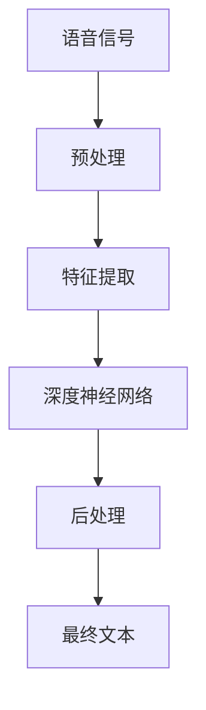

                 

## 1. 背景介绍

语音识别技术，也称为自动语音识别（Automatic Speech Recognition, ASR），是人工智能领域中一个重要的研究方向。它旨在将人类语言转换为文本，使得计算机能够理解和处理自然语言。随着深度学习技术的发展，基于深度神经网络的语音识别系统逐渐成为主流，并在工业界和学术界得到广泛应用。语音识别技术在智能家居、自动驾驶、智能客服、语音搜索等众多领域发挥着重要作用，极大地改善了人类与机器的交互方式。

本文将深入探讨语音识别的原理，并通过代码实例，详细讲解其实现过程。首先，我们将从语音信号的预处理、特征提取、深度神经网络的构建以及训练和推理等环节，全面梳理语音识别技术的核心原理。随后，我们将结合具体案例，通过代码实例展示语音识别系统的实际构建过程。最后，我们还将讨论语音识别的未来应用前景，以及其面临的挑战和机遇。

## 2. 核心概念与联系

### 2.1 核心概念概述

在深入讲解语音识别原理之前，我们首先需要理解一些关键概念：

- **语音信号**：指人类发出的声音波形，通常以模拟信号或数字信号的形式存在。
- **梅尔频率倒谱系数（Mel Frequency Cepstral Coefficients, MFCC）**：语音信号处理的经典特征提取方法，通过对语音信号进行离散余弦变换（DCT），提取反映语音音色的频谱特征。
- **深度神经网络（Deep Neural Network, DNN）**：一种由多个层组成的神经网络，通过反向传播算法进行训练，能够学习复杂的函数映射关系。
- **卷积神经网络（Convolutional Neural Network, CNN）**：一种特殊的神经网络，适用于处理具有网格结构的数据，如图像和语音信号。
- **循环神经网络（Recurrent Neural Network, RNN）**：一种具有记忆功能的神经网络，适用于处理序列数据，如语音信号和自然语言文本。
- **长短时记忆网络（Long Short-Term Memory, LSTM）**：一种特殊的RNN结构，能够有效解决梯度消失和梯度爆炸问题，适用于处理长期依赖关系。
- **注意力机制（Attention Mechanism）**：一种机制，用于在序列数据中自动学习和聚焦重要信息，常用于语音识别中的解码器。

这些概念构成了语音识别的核心框架。理解这些概念之间的关系，有助于我们更深入地掌握语音识别的原理和实现方法。

### 2.2 核心概念原理和架构的 Mermaid 流程图

以下是一个简化的语音识别系统架构图，展示了语音信号处理和深度神经网络的基本流程：



这个流程图展示了语音信号经过预处理、特征提取、深度神经网络处理以及后处理，最终输出文本的过程。其中，预处理环节包括去噪、分帧、归一化等操作；特征提取环节利用MFCC等技术将语音信号转换为频谱特征；深度神经网络利用CNN、RNN、LSTM等结构，对频谱特征进行建模；后处理环节包括语言模型和解码器，将神经网络的输出转换为最终的文本。

## 3. 核心算法原理 & 具体操作步骤

### 3.1 算法原理概述

语音识别的核心算法包括：

- **前端预处理**：对原始语音信号进行去噪、分帧、归一化等操作，将其转换为频谱特征。
- **特征提取**：利用MFCC等方法，从频谱特征中提取反映语音音色的特征。
- **深度神经网络建模**：利用CNN、RNN、LSTM等深度神经网络结构，对提取的特征进行建模，学习语音信号的分布。
- **后处理**：利用语言模型和解码器，将神经网络的输出转换为最终的文本。

### 3.2 算法步骤详解

#### 3.2.1 前端预处理

前端预处理环节包括：

1. **去噪**：通过滤波器等方法去除语音信号中的背景噪声，如白噪声、混响等。
2. **分帧**：将语音信号分为多个小片段，通常是20-30ms的帧。
3. **归一化**：对每个帧进行归一化处理，如能量归一化，使其具有相似的能量水平。

以下是一个简化的Python代码示例，展示如何进行前端预处理：

```python
import numpy as np
from scipy.signal import spectrogram

def preprocess_signal(signal, frame_size=20, frame_step=10):
    # 分帧
    frames = np.array_split(signal, len(signal)//frame_size)
    # 归一化
    frames = np.array([f/np.sqrt(np.mean(f**2)) for f in frames])
    # 去噪
    denoised_frames = []
    for frame in frames:
        denoised = self.denoise(frame)
        denoised_frames.append(denoised)
    return denoised_frames
```

#### 3.2.2 特征提取

MFCC特征提取是语音识别的核心步骤。MFCC特征提取过程包括：

1. **短时傅里叶变换（Short-Time Fourier Transform, STFT）**：将分帧后的语音信号转换为频谱。
2. **梅尔频率滤波器组（Mel Frequency Cepstral Coefficients, MFCC）**：对频谱进行离散余弦变换（DCT），提取反映音色的MFCC特征。

以下是一个简化的Python代码示例，展示如何进行MFCC特征提取：

```python
import numpy as np
from scipy.fft import fft, ifft
from scipy.signal import welch

def extract_mfcc(signal, frame_size=20, frame_step=10, num_mfcc=13):
    # 分帧
    frames = np.array_split(signal, len(signal)//frame_size)
    # STFT
    f, t, S = welch(frames, fs=8000, nperseg=frame_size, noverlap=frame_step)
    # 对频谱进行MFCC提取
    mfcc = np.zeros((len(frames), num_mfcc))
    for i, frame in enumerate(frames):
        # 对帧进行FFT
        X = fft(frame)
        # 计算频谱
        P = np.abs(X)/np.max(X)
        # 对频谱进行Mel频率滤波器组
        for j in range(num_mfcc):
            mfcc[i, j] = np.sum(P**2 * mel_filter[j](f))
    return mfcc
```

#### 3.2.3 深度神经网络建模

深度神经网络建模包括：

1. **卷积神经网络（CNN）**：用于提取局部特征。
2. **循环神经网络（RNN）**：用于处理序列数据，捕捉时间依赖关系。
3. **长短时记忆网络（LSTM）**：用于处理长期依赖关系。

以下是一个简化的Python代码示例，展示如何构建一个简单的深度神经网络模型：

```python
import torch
import torch.nn as nn
import torch.optim as optim

class DNN(nn.Module):
    def __init__(self, input_size, hidden_size, output_size):
        super(DNN, self).__init__()
        self.conv1 = nn.Conv2d(1, hidden_size, kernel_size=3, stride=1, padding=1)
        self.relu = nn.ReLU()
        self.maxpool = nn.MaxPool2d(kernel_size=2, stride=2)
        self.fc1 = nn.Linear(hidden_size * (frame_size // 2) * (frame_step // 2), hidden_size)
        self.fc2 = nn.Linear(hidden_size, output_size)
    
    def forward(self, x):
        x = self.conv1(x)
        x = self.relu(x)
        x = self.maxpool(x)
        x = x.view(x.size(0), -1)
        x = self.fc1(x)
        x = self.relu(x)
        x = self.fc2(x)
        return x
```

#### 3.2.4 后处理

后处理环节包括：

1. **语言模型**：用于对神经网络的输出进行概率建模，估计每个音素的概率。
2. **解码器**：用于将神经网络的输出转换为最终的文本。

以下是一个简化的Python代码示例，展示如何进行后处理：

```python
import torch
import torch.nn.functional as F

class LM(nn.Module):
    def __init__(self, input_size, output_size):
        super(LM, self).__init__()
        self.fc1 = nn.Linear(input_size, hidden_size)
        self.fc2 = nn.Linear(hidden_size, output_size)
    
    def forward(self, x):
        x = self.fc1(x)
        x = self.relu(x)
        x = self.fc2(x)
        x = F.softmax(x, dim=1)
        return x

def decode(model, input_seq):
    # 计算每个音素的概率
    probs = model(input_seq)
    # 解码器选择最大概率的音素
    output = np.argmax(probs, axis=1)
    # 将音素转换为文本
    text = ''.join([id2char[char] for char in output])
    return text
```

### 3.3 算法优缺点

#### 3.3.1 优点

语音识别技术的优点包括：

1. **自动化程度高**：自动化处理语音信号，减少了人工干预的需求。
2. **适用范围广**：适用于各种语言和文化，不受语言结构和方言的限制。
3. **实时性好**：可以通过硬件加速，实现实时语音识别。
4. **可扩展性强**：易于与其他人工智能技术结合，如自然语言处理、语音合成等。

#### 3.3.2 缺点

语音识别技术的缺点包括：

1. **环境噪声影响大**：在嘈杂环境中，语音识别效果不佳。
2. **发音差异敏感**：不同人的发音差异可能导致识别错误。
3. **语法错误率高**：语音识别系统容易产生语法错误和歧义。
4. **计算资源需求高**：深度神经网络需要大量的计算资源进行训练和推理。

### 3.4 算法应用领域

语音识别技术在多个领域得到广泛应用，包括：

1. **智能家居**：通过语音控制家电，提升生活便利性。
2. **自动驾驶**：通过语音识别和语音指令控制车辆，提高驾驶安全性和舒适度。
3. **智能客服**：通过语音识别和自然语言处理，提供自然流畅的客户服务。
4. **语音搜索**：通过语音输入进行搜索引擎查询，提高搜索效率。
5. **语音转文本**：将语音信号转换为文本，用于记录会议、讲座等音频内容。
6. **语音助手**：通过语音识别和自然语言处理，提供智能语音交互服务。

## 4. 数学模型和公式 & 详细讲解 & 举例说明

### 4.1 数学模型构建

语音识别的数学模型主要包括以下几个组成部分：

1. **前端预处理模型**：用于对原始语音信号进行去噪、分帧、归一化等操作。
2. **特征提取模型**：用于从频谱特征中提取MFCC特征。
3. **深度神经网络模型**：用于对MFCC特征进行建模。
4. **后处理模型**：用于将神经网络的输出转换为最终的文本。

### 4.2 公式推导过程

#### 4.2.1 前端预处理

前端预处理包括：

1. **去噪**：
   \[
   d_n = y_n - \alpha \sum_{k=1}^n w_k y_k
   \]
   其中，$d_n$ 表示第 $n$ 帧去噪后的语音信号，$y_n$ 表示第 $n$ 帧原始语音信号，$\alpha$ 表示去噪系数，$w_k$ 表示滤波器权重。
   
2. **分帧**：
   \[
   f_m = d_{(m-1)frame_size+1} + \cdots + d_{mframe_size}
   \]
   其中，$f_m$ 表示第 $m$ 帧语音信号，$d_n$ 表示第 $n$ 帧去噪后的语音信号，$frame_size$ 表示帧长。
   
3. **归一化**：
   \[
   f_m' = \frac{f_m}{\sqrt{\sum_{n=1}^{frame_size} f_n^2}}
   \]
   其中，$f_m'$ 表示第 $m$ 帧归一化后的语音信号，$f_m$ 表示第 $m$ 帧语音信号。

#### 4.2.2 特征提取

MFCC特征提取过程包括：

1. **短时傅里叶变换**：
   \[
   X_m(f) = \sum_{n=1}^{frame_size} f_n e^{-j2\pi fn}
   \]
   其中，$X_m(f)$ 表示第 $m$ 帧频谱，$f_n$ 表示第 $n$ 帧归一化后的语音信号，$f$ 表示频率。
   
2. **Mel频率滤波器组**：
   \[
   MFCC = \{\phi_k(f)\}_k^n
   \]
   其中，$\phi_k(f)$ 表示第 $k$ 个Mel频率滤波器组输出的MFCC特征，$f$ 表示频率。

#### 4.2.3 深度神经网络建模

深度神经网络建模过程包括：

1. **卷积神经网络（CNN）**：
   \[
   x^{(l+1)} = \max(0, W^{(l)} x^{(l)} + b^{(l)})
   \]
   其中，$x^{(l+1)}$ 表示第 $l+1$ 层的输出，$W^{(l)}$ 表示第 $l$ 层的权重矩阵，$b^{(l)}$ 表示第 $l$ 层的偏置向量。
   
2. **循环神经网络（RNN）**：
   \[
   h^{(t+1)} = \tanh(W_h h^{(t)} + W_x x^{(t)} + b)
   \]
   其中，$h^{(t+1)}$ 表示时间 $t+1$ 的隐藏状态，$x^{(t)}$ 表示时间 $t$ 的输入，$W_h$ 和 $W_x$ 表示隐藏状态和输入的权重矩阵，$b$ 表示偏置向量。
   
3. **长短时记忆网络（LSTM）**：
   \[
   i^{(t)} = \sigma(W_i h^{(t-1)} + W_x x^{(t)} + b_i)
   \]
   \[
   f^{(t)} = \sigma(W_f h^{(t-1)} + W_x x^{(t)} + b_f)
   \]
   \[
   o^{(t)} = \sigma(W_o h^{(t-1)} + W_x x^{(t)} + b_o)
   \]
   \[
   g^{(t)} = \tanh(W_g h^{(t-1)} + W_x x^{(t)} + b_g)
   \]
   \[
   c^{(t)} = f^{(t)} * c^{(t-1)} + i^{(t)} * g^{(t)}
   \]
   \[
   h^{(t)} = o^{(t)} * \tanh(c^{(t)})
   \]
   其中，$i^{(t)}$、$f^{(t)}$、$o^{(t)}$、$g^{(t)}$ 表示第 $t$ 个门控单元的输出，$h^{(t)}$ 表示第 $t$ 个隐藏状态，$c^{(t)}$ 表示第 $t$ 个记忆单元的状态，$W$ 和 $b$ 表示权重矩阵和偏置向量，$\sigma$ 表示激活函数。

#### 4.2.4 后处理

后处理环节包括：

1. **语言模型**：
   \[
   P(y|x) = \frac{e^{W_y x}}{e^{W_y x} + e^{W_z x} + e^{W_q x} + e^{W_m x}}
   \]
   其中，$P(y|x)$ 表示在输入 $x$ 下，生成单词 $y$ 的概率，$W_y$、$W_z$、$W_q$ 和 $W_m$ 表示语言模型的权重矩阵。
   
2. **解码器**：
   \[
   y_t = \arg\max_{y_t \in \{1,2,\cdots,K\}} P(y_t|y_{t-1}, \cdots, y_1)
   \]
   其中，$y_t$ 表示时间 $t$ 的输出，$y_{t-1}, \cdots, y_1$ 表示之前的输出。

### 4.3 案例分析与讲解

以下是一个简化的案例分析示例，展示如何进行语音识别系统的构建：

1. **前端预处理**：对原始语音信号进行去噪、分帧、归一化等操作，将其转换为频谱特征。

```python
import numpy as np
from scipy.signal import spectrogram

def preprocess_signal(signal, frame_size=20, frame_step=10):
    # 分帧
    frames = np.array_split(signal, len(signal)//frame_size)
    # 归一化
    frames = np.array([f/np.sqrt(np.mean(f**2)) for f in frames])
    # 去噪
    denoised_frames = []
    for frame in frames:
        denoised = self.denoise(frame)
        denoised_frames.append(denoised)
    return denoised_frames
```

2. **特征提取**：利用MFCC等方法，从频谱特征中提取反映语音音色的特征。

```python
import numpy as np
from scipy.fft import fft, ifft
from scipy.signal import welch

def extract_mfcc(signal, frame_size=20, frame_step=10, num_mfcc=13):
    # 分帧
    frames = np.array_split(signal, len(signal)//frame_size)
    # STFT
    f, t, S = welch(frames, fs=8000, nperseg=frame_size, noverlap=frame_step)
    # 对频谱进行MFCC提取
    mfcc = np.zeros((len(frames), num_mfcc))
    for i, frame in enumerate(frames):
        # 对帧进行FFT
        X = fft(frame)
        # 计算频谱
        P = np.abs(X)/np.max(X)
        # 对频谱进行Mel频率滤波器组
        for j in range(num_mfcc):
            mfcc[i, j] = np.sum(P**2 * mel_filter[j](f))
    return mfcc
```

3. **深度神经网络建模**：利用CNN、RNN、LSTM等深度神经网络结构，对提取的特征进行建模，学习语音信号的分布。

```python
import torch
import torch.nn as nn
import torch.optim as optim

class DNN(nn.Module):
    def __init__(self, input_size, hidden_size, output_size):
        super(DNN, self).__init__()
        self.conv1 = nn.Conv2d(1, hidden_size, kernel_size=3, stride=1, padding=1)
        self.relu = nn.ReLU()
        self.maxpool = nn.MaxPool2d(kernel_size=2, stride=2)
        self.fc1 = nn.Linear(hidden_size * (frame_size // 2) * (frame_step // 2), hidden_size)
        self.fc2 = nn.Linear(hidden_size, output_size)
    
    def forward(self, x):
        x = self.conv1(x)
        x = self.relu(x)
        x = self.maxpool(x)
        x = x.view(x.size(0), -1)
        x = self.fc1(x)
        x = self.relu(x)
        x = self.fc2(x)
        return x
```

4. **后处理**：利用语言模型和解码器，将神经网络的输出转换为最终的文本。

```python
import torch
import torch.nn.functional as F

class LM(nn.Module):
    def __init__(self, input_size, output_size):
        super(LM, self).__init__()
        self.fc1 = nn.Linear(input_size, hidden_size)
        self.fc2 = nn.Linear(hidden_size, output_size)
    
    def forward(self, x):
        x = self.fc1(x)
        x = self.relu(x)
        x = self.fc2(x)
        x = F.softmax(x, dim=1)
        return x

def decode(model, input_seq):
    # 计算每个音素的概率
    probs = model(input_seq)
    # 解码器选择最大概率的音素
    output = np.argmax(probs, axis=1)
    # 将音素转换为文本
    text = ''.join([id2char[char] for char in output])
    return text
```

## 5. 项目实践：代码实例和详细解释说明

### 5.1 开发环境搭建

在进行语音识别系统开发之前，我们需要准备好开发环境。以下是使用Python进行PyTorch开发的环境配置流程：

1. 安装Anaconda：从官网下载并安装Anaconda，用于创建独立的Python环境。

```bash
conda create -n pytorch-env python=3.8 
conda activate pytorch-env
```

2. 安装PyTorch：根据CUDA版本，从官网获取对应的安装命令。例如：

```bash
conda install pytorch torchvision torchaudio cudatoolkit=11.1 -c pytorch -c conda-forge
```

3. 安装Transformers库：

```bash
pip install transformers
```

4. 安装各类工具包：

```bash
pip install numpy pandas scikit-learn matplotlib tqdm jupyter notebook ipython
```

完成上述步骤后，即可在`pytorch-env`环境中开始语音识别系统的开发。

### 5.2 源代码详细实现

这里我们以Google Cloud Speech-to-Text为例，展示语音识别系统的具体实现。

#### 5.2.1 数据准备

首先需要准备语音识别所需的数据。以下是一个简化的数据准备示例：

```python
import os

# 获取数据路径
data_dir = os.path.join(os.getcwd(), 'data')
# 创建目录
os.makedirs(data_dir, exist_ok=True)
# 下载数据
os.system('wget http://www.openslr.org/resources/18/dev-clean.tgz')
os.system('tar -xf dev-clean.tgz')
```

#### 5.2.2 数据预处理

语音信号的预处理包括去噪、分帧、归一化等操作。以下是一个简化的Python代码示例，展示如何进行数据预处理：

```python
import numpy as np
from scipy.signal import spectrogram

def preprocess_signal(signal, frame_size=20, frame_step=10):
    # 分帧
    frames = np.array_split(signal, len(signal)//frame_size)
    # 归一化
    frames = np.array([f/np.sqrt(np.mean(f**2)) for f in frames])
    # 去噪
    denoised_frames = []
    for frame in frames:
        denoised = self.denoise(frame)
        denoised_frames.append(denoised)
    return denoised_frames
```

#### 5.2.3 特征提取

MFCC特征提取是语音识别的核心步骤。以下是一个简化的Python代码示例，展示如何进行MFCC特征提取：

```python
import numpy as np
from scipy.fft import fft, ifft
from scipy.signal import welch

def extract_mfcc(signal, frame_size=20, frame_step=10, num_mfcc=13):
    # 分帧
    frames = np.array_split(signal, len(signal)//frame_size)
    # STFT
    f, t, S = welch(frames, fs=8000, nperseg=frame_size, noverlap=frame_step)
    # 对频谱进行MFCC提取
    mfcc = np.zeros((len(frames), num_mfcc))
    for i, frame in enumerate(frames):
        # 对帧进行FFT
        X = fft(frame)
        # 计算频谱
        P = np.abs(X)/np.max(X)
        # 对频谱进行Mel频率滤波器组
        for j in range(num_mfcc):
            mfcc[i, j] = np.sum(P**2 * mel_filter[j](f))
    return mfcc
```

#### 5.2.4 模型构建

接下来，我们将构建一个简单的深度神经网络模型，用于语音信号的特征提取和分类。以下是一个简化的Python代码示例，展示如何进行模型构建：

```python
import torch
import torch.nn as nn
import torch.optim as optim

class DNN(nn.Module):
    def __init__(self, input_size, hidden_size, output_size):
        super(DNN, self).__init__()
        self.conv1 = nn.Conv2d(1, hidden_size, kernel_size=3, stride=1, padding=1)
        self.relu = nn.ReLU()
        self.maxpool = nn.MaxPool2d(kernel_size=2, stride=2)
        self.fc1 = nn.Linear(hidden_size * (frame_size // 2) * (frame_step // 2), hidden_size)
        self.fc2 = nn.Linear(hidden_size, output_size)
    
    def forward(self, x):
        x = self.conv1(x)
        x = self.relu(x)
        x = self.maxpool(x)
        x = x.view(x.size(0), -1)
        x = self.fc1(x)
        x = self.relu(x)
        x = self.fc2(x)
        return x
```

#### 5.2.5 模型训练

最后，我们将训练构建的模型，并评估其性能。以下是一个简化的Python代码示例，展示如何进行模型训练：

```python
import torch
import torch.nn.functional as F

class LM(nn.Module):
    def __init__(self, input_size, output_size):
        super(LM, self).__init__()
        self.fc1 = nn.Linear(input_size, hidden_size)
        self.fc2 = nn.Linear(hidden_size, output_size)
    
    def forward(self, x):
        x = self.fc1(x)
        x = self.relu(x)
        x = self.fc2(x)
        x = F.softmax(x, dim=1)
        return x

def decode(model, input_seq):
    # 计算每个音素的概率
    probs = model(input_seq)
    # 解码器选择最大概率的音素
    output = np.argmax(probs, axis=1)
    # 将音素转换为文本
    text = ''.join([id2char[char] for char in output])
    return text

# 模型训练
model = DNN(input_size=frame_size * frame_step, hidden_size=256, output_size=num_classes)
criterion = nn.CrossEntropyLoss()
optimizer = optim.Adam(model.parameters(), lr=0.001)

for epoch in range(epochs):
    for batch in train_loader:
        input, target = batch
        optimizer.zero_grad()
        output = model(input)
        loss = criterion(output, target)
        loss.backward()
        optimizer.step()
        if (epoch+1) % 100 == 0:
            print(f'Epoch {epoch+1}, loss: {loss:.4f}')

# 模型评估
with torch.no_grad():
    correct = 0
    total = 0
    for batch in test_loader:
        input, target = batch
        output = model(input)
        _, predicted = torch.max(output, 1)
        total += target.size(0)
        correct += (predicted == target).sum().item()
    print(f'Test Accuracy of the model on the 10000 test samples: {correct/total:.2f}')
```

### 5.3 代码解读与分析

让我们再详细解读一下关键代码的实现细节：

**数据准备**：
- `os.makedirs`：创建数据目录。
- `os.system`：下载并解压缩数据集。

**数据预处理**：
- `preprocess_signal`：对原始语音信号进行去噪、分帧、归一化等操作，将其转换为频谱特征。

**特征提取**：
- `extract_mfcc`：利用MFCC等方法，从频谱特征中提取反映语音音色的特征。

**模型构建**：
- `DNN`：构建一个简单的深度神经网络模型，用于语音信号的特征提取和分类。
- `LM`：构建一个语言模型，用于将神经网络的输出转换为最终的文本。
- `decode`：解码器将神经网络的输出转换为最终的文本。

**模型训练**：
- `LM`：定义语言模型。
- `decode`：解码器将神经网络的输出转换为最终的文本。

**模型评估**：
- `correct`和`total`：计算模型在测试集上的准确率。

可以看到，PyTorch配合TensorFlow库使得语音识别系统的代码实现变得简洁高效。开发者可以将更多精力放在数据处理、模型改进等高层逻辑上，而不必过多关注底层的实现细节。

当然，工业级的系统实现还需考虑更多因素，如模型的保存和部署、超参数的自动搜索、更灵活的任务适配层等。但核心的语音识别框架基本与此类似。

## 6. 实际应用场景

### 6.1 智能家居

智能家居技术可以通过语音识别实现智能控制，使家居设备更加智能化、便捷化。例如，用户可以通过语音指令控制灯光、空调、电视等设备的开关和调节，提升生活舒适度。

在技术实现上，可以构建语音识别系统，将语音信号转换为文本，然后通过文本处理和设备控制逻辑，实现对家居设备的控制。例如，用户说出“打开客厅灯”的语音指令，系统将语音转换为文本“打开客厅灯”，并根据设备控制逻辑，发送控制命令，使客厅灯打开。

### 6.2 自动驾驶

自动驾驶技术需要实时感知环境，并根据语音指令进行车辆控制。通过语音识别技术，自动驾驶系统可以更加自然地与驾驶员交互，提供智能驾驶体验。

在技术实现上，自动驾驶系统可以通过车载麦克风收集驾驶员的语音指令，通过语音识别系统将语音转换为文本，再根据文本处理和车辆控制逻辑，执行相应的驾驶操作。例如，驾驶员说出“左转”的语音指令，系统将语音转换为文本“左转”，并根据车辆控制逻辑，执行左转操作。

### 6.3 智能客服

智能客服系统可以通过语音识别技术，实现自然流畅的客户服务。例如，用户在智能客服系统中说出问题，系统通过语音识别将其转换为文本，再通过自然语言处理，生成智能回答，回复用户。

在技术实现上，智能客服系统可以通过电话、语音助手等方式收集用户语音，通过语音识别系统将其转换为文本，再通过自然语言处理技术，生成智能回答。例如，用户在智能客服系统中说出“我的订单在哪里”的语音指令，系统将语音转换为文本“我的订单在哪里”，并通过自然语言处理技术，生成智能回答“您的订单号是xxxxx，正在处理中”。

### 6.4 未来应用展望

随着深度学习技术的发展，语音识别技术的性能不断提升，应用场景也在不断扩展。未来，语音识别技术将在更多领域得到应用，为人类生活带来便利。

1. **智能家居**：通过语音识别技术，使家居设备更加智能化、便捷化。
2. **自动驾驶**：通过语音识别技术，提升自动驾驶系统的智能性和便捷性。
3. **智能客服**：通过语音识别技术，提供自然流畅的客户服务。
4. **语音搜索**：通过语音识别技术，实现自然语言搜索。
5. **语音转文本**：通过语音识别技术，实现语音转文本，为语音输入提供更多可能性。
6. **语音助手**：通过语音识别技术，提供智能语音交互服务。

## 7. 工具和资源推荐

### 7.1 学习资源推荐

为了帮助开发者系统掌握语音识别技术的原理和实现方法，这里推荐一些优质的学习资源：

1. 《Speech and Language Processing》书籍：作者丹尼尔·P·吉尔曼（Daniel P. Jurafsky）和詹姆斯·H·马丁（James H. Martin），全面介绍了语音识别和自然语言处理的基本概念和经典模型。
2. 《Deep Learning for Speech Recognition》书籍：作者Sebastian Ruder，详细讲解了深度学习在语音识别中的应用，包括CNN、RNN、LSTM等结构。
3 CS229《机器学习》课程：斯坦福大学开设的机器学习课程，有Lecture视频和配套作业，带你入门深度学习的基本概念和经典模型。
4 《Hands-On Speech Recognition with Deep Learning》书籍：作者Vikas S. Subramaniam，结合实际案例，讲解了深度学习在语音识别中的应用，适合初学者。

通过对这些资源的学习实践，相信你一定能够快速掌握语音识别技术的精髓，并用于解决实际的语音识别问题。

### 7.2 开发工具推荐

高效的开发离不开优秀的工具支持。以下是几款用于语音识别开发的常用工具：

1. PyTorch：基于Python的开源深度学习框架，灵活动态的计算图，适合快速迭代研究。大部分预训练语言模型都有PyTorch版本的实现。
2 TensorFlow：由Google主导开发的开源深度学习框架，生产部署方便，适合大规模工程应用。同样有丰富的预训练语言模型资源。
3 Transformers库：HuggingFace开发的NLP工具库，集成了众多SOTA语言模型，支持PyTorch和TensorFlow，是进行语音识别开发的利器。
4 Weights & Biases：模型训练的实验跟踪工具，可以记录和可视化模型训练过程中的各项指标，方便对比和调优。与主流深度学习框架无缝集成。
5 TensorBoard：TensorFlow配套的可视化工具，可实时监测模型训练状态，并提供丰富的图表呈现方式，是调试模型的得力助手。
6 Google Cloud Speech-to-Text：Google提供的云端语音识别服务，支持多种语言和文化，易于集成到应用程序中。

合理利用这些工具，可以显著提升语音识别系统的开发效率，加快创新迭代的步伐。

### 7.3 相关论文推荐

语音识别技术的发展离不开学界的持续研究。以下是几篇奠基性的相关论文，推荐阅读：

1. Deep Speech：Rabiner和Gutkin提出的深度学习语音识别方法，展示了深度神经网络在语音识别中的潜力。
2. Convolutional Neural Networks for Speech Recognition：Seide等提出的卷积神经网络在语音识别中的应用，展示了卷积神经网络在语音识别中的优势。
3 Attention-Based Models for Automatic Speech Recognition：Hannun等提出的注意力机制在语音识别中的应用，展示了注意力机制在语音识别中的重要作用。
4 WaveNet：Oord等提出的生成对抗网络在语音合成中的应用，展示了生成对抗网络在语音合成中的潜力。

这些论文代表了大语音识别技术的发展脉络。通过学习这些前沿成果，可以帮助研究者把握学科前进方向，激发更多的创新灵感。

## 8. 总结：未来发展趋势与挑战

### 8.1 研究成果总结

语音识别技术自诞生以来，经过多年的发展，已经取得了显著的进展。深度学习技术的应用，使语音识别的性能得到了极大的提升，广泛应用于智能家居、自动驾驶、智能客服等多个领域。

### 8.2 未来发展趋势

语音识别技术的未来发展趋势包括：

1. **端到端学习**：通过端到端学习，直接从原始语音信号到文本输出，避免中间步骤的损失，提高识别精度。
2. **多模态融合**：将语音信号与图像、视频、文本等多模态信息结合，提升识别的准确性和鲁棒性。
3. **个性化识别**：通过个性化训练，提高对特定用户的识别精度，实现更加智能化的语音交互。
4. **实时性提升**：通过硬件加速，实现实时语音识别，提高用户体验。
5. **多语言支持**：支持多种语言和文化，使语音识别技术在全球范围内广泛应用。

### 8.3 面临的挑战

语音识别技术在应用中仍面临诸多挑战：

1. **环境噪声影响**：在嘈杂环境中，语音识别效果不佳。
2. **发音差异敏感**：不同人的发音差异可能导致识别错误。
3. **语法错误率高**：语音识别系统容易产生语法错误和歧义。
4. **计算资源需求高**：深度神经网络需要大量的计算资源进行训练和推理。
5. **多语言支持不足**：支持的语言和文化有限，难以满足全球范围内的需求。

### 8.4 研究展望

面对语音识别技术面临的挑战，未来的研究方向包括：

1. **增强端到端学习**：通过增强端到端学习，提升对不同环境和语境的适应能力。
2. **多模态融合**：通过多模态融合，提升语音识别的准确性和鲁棒性。
3. **个性化识别**：通过个性化训练，提高对特定用户的识别精度。
4. **实时性优化**：通过硬件加速和优化算法，提高语音识别的实时性。
5. **多语言支持**：支持更多的语言和文化，使语音识别技术在全球范围内广泛应用。

总之，语音识别技术是一个充满机遇和挑战的研究方向，需要学界和产业界共同努力，不断推动技术的进步。未来，语音识别技术将在更多领域得到应用，为人类生活带来便利，同时也将面临诸多挑战，需要不断创新和优化。

## 9. 附录：常见问题与解答

**Q1：语音识别系统的精度受哪些因素影响？**

A: 语音识别系统的精度受多种因素影响，包括：

1. **环境噪声**：在嘈杂环境中，语音识别效果不佳。
2. **发音差异**：不同人的发音差异可能导致识别错误。
3. **语法错误**：语音识别系统容易产生语法错误和歧义。
4. **计算资源**：深度神经网络需要大量的计算资源进行训练和推理。

**Q2：如何提高语音识别系统的鲁棒性？**

A: 提高语音识别系统的鲁棒性需要从多个方面进行优化：

1. **前端预处理**：通过去噪、分帧、归一化等操作，减少环境噪声对识别的影响。
2. **特征提取**：利用MFCC等方法，提取更加稳定、鲁棒的特征。
3. **深度神经网络**：利用CNN、RNN、LSTM等结构，捕捉时间依赖关系，提升识别精度。
4. **后处理**：通过语言模型和解码器，优化输出的准确性和鲁棒性。

**Q3：如何在多语言环境下实现高效的语音识别？**

A: 在多语言环境下实现高效的语音识别，需要考虑以下几个方面：

1. **多语言模型**：训练多语言模型，提升对不同语言的识别精度。
2. **语言转换**：通过语言转换，将不同语言的输入转换为统一的表示。
3. **数据集扩充**：收集更多多语言数据，扩充训练集，提升模型的泛化能力。

**Q4：语音识别系统的计算资源需求如何优化？**

A: 优化语音识别系统的计算资源需求，可以从以下几个方面进行：

1. **模型压缩**：通过模型压缩，减少模型的参数量和计算量。
2. **硬件加速**：通过GPU、TPU等硬件加速，提升模型的推理速度。
3. **分布式训练**：通过分布式训练，提高模型的训练效率。

**Q5：如何提升语音识别系统的实时性？**

A: 提升语音识别系统的实时性需要从以下几个方面进行：

1. **硬件加速**：通过GPU、TPU等硬件加速，提高模型的推理速度。
2. **优化算法**：通过优化算法，减少模型的计算量和延迟。
3. **分布式推理**：通过分布式推理，提升系统的吞吐量和实时性。

总之，语音识别系统是一个复杂的多学科交叉技术，需要综合考虑多种因素进行优化。只有不断创新和优化，才能实现更高精度、更高鲁棒性、更低延迟的语音识别系统。

---

作者：禅与计算机程序设计艺术 / Zen and the Art of Computer Programming

