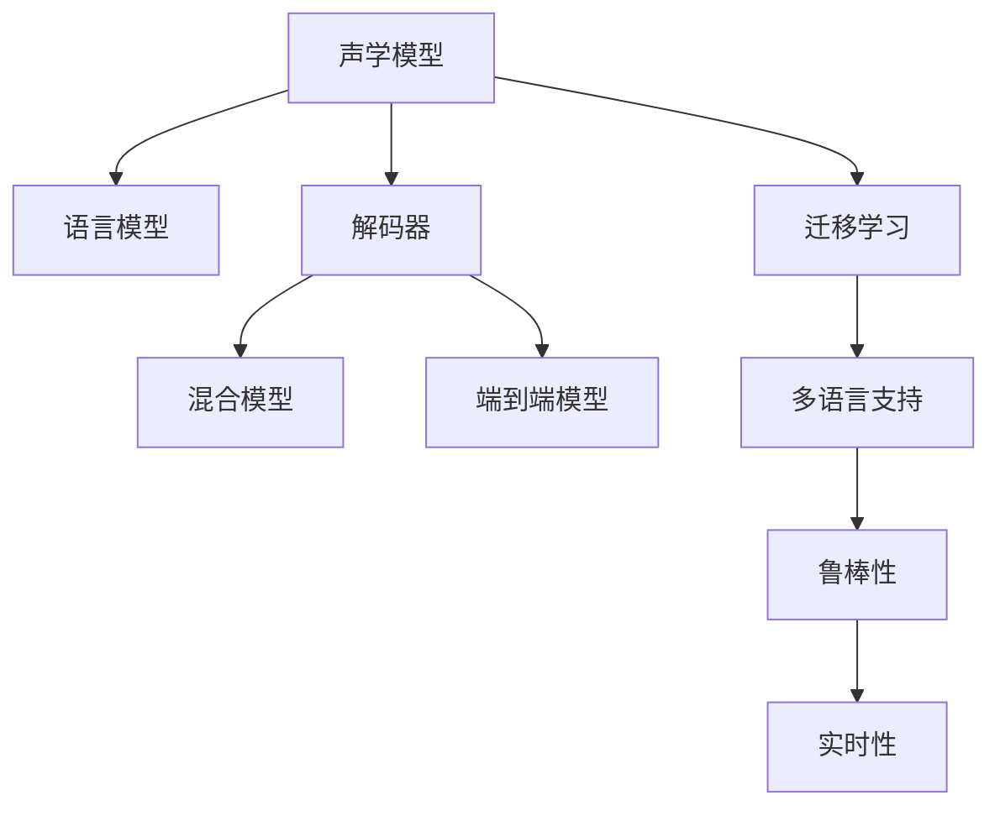

                 

# 语音识别创业：人机交互的新篇章

## 1. 背景介绍

### 1.1 问题由来

随着人工智能技术的迅猛发展，语音识别技术已经成为人机交互的重要手段之一。其在智能家居、智能客服、智能车载、智能办公等多个领域有着广泛的应用。语音识别技术的创新，不仅提升了用户体验，还推动了各行各业的智能化转型升级。然而，现有的语音识别技术仍然存在诸多局限，如识别准确率、鲁棒性、多语言支持等，这些都成为制约语音识别技术发展的瓶颈。因此，创业公司纷纷涌现，致力于语音识别技术的进一步突破，以期占领市场先机。

### 1.2 问题核心关键点

语音识别技术主要包含三个核心关键点：声学模型、语言模型和解码器。声学模型用于将语音信号转换为文字序列；语言模型用于概率建模，优化声学模型的输出；解码器则负责对声学模型和语言模型的输出进行解码，得到最可能的文本序列。这三大模块通过深度学习算法进行联合训练，达到最优的识别效果。

然而，当前的语音识别技术仍面临以下挑战：

- **识别准确率**：在大声环境、口音差异、噪声干扰等情况下，识别准确率有待进一步提升。
- **鲁棒性**：在不同的语境和场景中，语音识别模型的表现需要更加鲁棒，适应多样化的用户需求。
- **多语言支持**：针对多种语言的语音识别，需要开发相应的模型和算法。
- **实时性**：在实时性要求高的场景中，如智能车载、实时通信等，对语音识别的实时性提出更高的要求。

因此，创业公司需要在这些方面进行创新，以满足市场需求。

### 1.3 问题研究意义

语音识别技术的进步，对于提升人机交互的便利性和智能化水平具有重要意义。通过语音识别技术，用户可以实现无需键盘和鼠标的操作，大大提升了交互的便捷性和用户体验。同时，语音识别技术在智能家居、智能客服等领域的应用，也为各行业带来了新的商业机遇。然而，要实现语音识别的泛用性和实用性，还需要解决识别准确率、鲁棒性、多语言支持等问题。因此，针对这些挑战进行研究，对于语音识别技术的进一步发展和应用具有重要意义。

## 2. 核心概念与联系

### 2.1 核心概念概述

为更好地理解语音识别技术的创新，本节将介绍几个密切相关的核心概念：

- **声学模型(Acoustic Model)**：将语音信号转换为文字序列的模型。常见的声学模型包括隐马尔可夫模型(HMM)、深度神经网络(DNN)、卷积神经网络(CNN)、递归神经网络(RNN)等。
- **语言模型(Language Model)**：用于概率建模，优化声学模型的输出。常见的语言模型包括N-gram模型、神经网络语言模型(Neural Network Language Model, NNL)、Transformer语言模型等。
- **解码器(Decoder)**：负责对声学模型和语言模型的输出进行解码，得到最可能的文本序列。常见的解码器包括Viterbi算法、束搜索算法、注意力机制等。
- **混合模型(Mixture Model)**：将声学模型和语言模型结合起来，进行联合训练。混合模型能够更好地捕获语音信号和语言模型之间的映射关系。
- **端到端模型(End-to-End Model)**：直接对语音信号进行编码和解码，无需中间转化的过程。常见的端到端模型包括CTC、Attention机制等。
- **迁移学习(Transfer Learning)**：通过在大规模语料上预训练模型，然后针对特定任务进行微调，提升模型在该任务上的性能。

这些核心概念之间的逻辑关系可以通过以下Mermaid流程图来展示：



这个流程图展示了大语言模型的核心概念及其之间的关系：

1. 声学模型将语音信号转换为文字序列。
2. 语言模型对声学模型的输出进行概率建模，优化输出。
3. 解码器对声学模型和语言模型的输出进行解码。
4. 混合模型将声学模型和语言模型结合起来，进行联合训练。
5. 端到端模型直接对语音信号进行编码和解码。
6. 迁移学习通过在大规模语料上预训练模型，针对特定任务进行微调。
7. 多语言支持使得模型能够适应多种语言的语音识别。
8. 鲁棒性使得模型在多种环境下的表现更加稳定。
9. 实时性使得模型在实时性要求高的场景中能够快速响应。

这些概念共同构成了语音识别技术的核心框架，使其能够在各种场景下发挥强大的语音识别能力。通过理解这些核心概念，我们可以更好地把握语音识别技术的创新方向。

## 3. 核心算法原理 & 具体操作步骤
### 3.1 算法原理概述

语音识别技术的核心算法原理主要包括以下几个步骤：

1. **特征提取(Feature Extraction)**：将语音信号转换为特征向量，常用的特征提取方法包括MFCC、Mel频谱等。
2. **声学模型训练(Acoustic Model Training)**：通过大规模语音数据对声学模型进行训练，得到最优的声学模型参数。
3. **语言模型训练(Language Model Training)**：通过大规模文本数据对语言模型进行训练，得到最优的语言模型参数。
4. **联合训练(Joint Training)**：将声学模型和语言模型进行联合训练，得到最优的混合模型参数。
5. **解码(Decoding)**：对声学模型和语言模型的输出进行解码，得到最可能的文本序列。

基于深度学习的方法，以上步骤均可以通过神经网络模型进行实现。

### 3.2 算法步骤详解

语音识别技术的深度学习模型主要包括以下几种：

**深度神经网络(DNN)**
- 模型结构：输入层、隐藏层、输出层。
- 训练过程：通过反向传播算法进行训练，优化模型参数。
- 优点：结构简单，易于实现。
- 缺点：对数据依赖较大，训练时间长。

**卷积神经网络(CNN)**
- 模型结构：卷积层、池化层、全连接层。
- 训练过程：通过反向传播算法进行训练，优化模型参数。
- 优点：能够捕获局部特征，对空间位置信息敏感。
- 缺点：对数据量要求较高，训练复杂度高。

**递归神经网络(RNN)**
- 模型结构：输入层、隐藏层、输出层。
- 训练过程：通过反向传播算法进行训练，优化模型参数。
- 优点：能够处理序列数据，能够记忆上下文信息。
- 缺点：对梯度消失问题敏感，训练复杂度高。

**长短时记忆网络(LSTM)**
- 模型结构：输入层、隐藏层、输出层。
- 训练过程：通过反向传播算法进行训练，优化模型参数。
- 优点：能够处理长序列数据，能够记忆上下文信息。
- 缺点：训练复杂度高，参数量较大。

**Transformer**
- 模型结构：自注意力机制、全连接层。
- 训练过程：通过反向传播算法进行训练，优化模型参数。
- 优点：能够捕获全局特征，训练速度快。
- 缺点：对数据依赖较大，需要较多的计算资源。

**混合模型(Hybrid Model)**
- 模型结构：声学模型、语言模型、混合层。
- 训练过程：通过反向传播算法进行训练，优化模型参数。
- 优点：能够更好地捕获语音信号和语言模型之间的映射关系。
- 缺点：训练复杂度高，参数量较大。

以上模型均可以通过深度学习算法进行实现，具体实现过程可以参考相关的开源项目和文档。

### 3.3 算法优缺点

语音识别技术的深度学习模型具有以下优点：

- **准确率高**：通过深度学习算法进行训练，能够提高模型的识别准确率。
- **适应性强**：能够适应多种语音信号和语言模型，具有较强的泛化能力。
- **实时性好**：能够实时处理语音信号，具有较强的实时性。

同时，这些模型也存在以下缺点：

- **计算量大**：深度学习模型的训练和推理需要较大的计算资源。
- **对数据依赖大**：需要大规模的语音数据和文本数据进行训练。
- **训练时间长**：训练过程需要较长的训练时间。

因此，在实际应用中，需要根据具体的需求选择合适的深度学习模型。

### 3.4 算法应用领域

语音识别技术在多个领域都有广泛的应用，以下是一些常见的应用领域：

- **智能家居**：语音助手、智能音箱等。
- **智能客服**：智能客服机器人、语音导航等。
- **智能车载**：语音控制、智能导航等。
- **智能办公**：语音会议、语音输入等。
- **医疗健康**：语音诊断、语音康复等。

## 4. 数学模型和公式 & 详细讲解 & 举例说明
### 4.1 数学模型构建

语音识别技术的数学模型主要包括以下几个方面：

**声学模型(Acoustic Model)**
- **线性混合模型(Linear Mixture Model)**：将语音信号分解为多个高斯分布的线性组合。
- **隐马尔可夫模型(Hidden Markov Model, HMM)**：通过状态转移和观测概率进行建模。
- **深度神经网络(Deep Neural Network, DNN)**：通过多层神经网络进行建模。
- **卷积神经网络(Convolutional Neural Network, CNN)**：通过卷积和池化操作进行建模。
- **递归神经网络(Recurrent Neural Network, RNN)**：通过循环神经网络进行建模。
- **长短时记忆网络(Long Short-Term Memory, LSTM)**：通过长短期记忆网络进行建模。
- **Transformer**：通过自注意力机制进行建模。

**语言模型(Language Model)**
- **N-gram模型(N-Gram Model)**：通过统计概率进行建模。
- **神经网络语言模型(Neural Network Language Model, NNL)**：通过多层神经网络进行建模。
- **Transformer语言模型**：通过自注意力机制进行建模。

**解码器(Decoder)**
- **Viterbi算法**：通过动态规划进行解码。
- **束搜索算法(Beam Search)**：通过搜索最优路径进行解码。
- **注意力机制(Attention Mechanism)**：通过注意力机制进行解码。

### 4.2 公式推导过程

以下是一些常见模型的公式推导过程：

**线性混合模型**
- **高斯混合模型(Gaussian Mixture Model, GMM)**：
  $$
  p(x|G)=\sum_{i=1}^{N}\alpha_ig(x|G_i)
  $$
  其中 $G$ 表示高斯混合模型，$G_i$ 表示第 $i$ 个高斯分布，$\alpha_i$ 表示权重。

**隐马尔可夫模型**
- **前向-后向算法(Forward-Backward Algorithm)**：
  $$
  \alpha_t(i) = \alpha_{t-1}(i)\sum_{j=1}^{M}A_{ij}b_{t-1}(j)
  $$
  $$
  \beta_t(i) = \beta_{t+1}(i)\sum_{j=1}^{M}A_{ij}b_{t+1}(j)
  $$
  其中 $\alpha_t(i)$ 表示状态 $i$ 在时间 $t$ 的前向概率，$\beta_t(i)$ 表示状态 $i$ 在时间 $t$ 的后向概率，$A_{ij}$ 表示状态转移概率，$b_t(i)$ 表示观测概率。

**深度神经网络**
- **反向传播算法(Backpropagation Algorithm)**：
  $$
  \frac{\partial L}{\partial w_{ij}} = \frac{\partial L}{\partial z_{i+1}}\frac{\partial z_{i+1}}{\partial w_{ij}}\frac{\partial w_{ij}}{\partial h_{i+1}}
  $$
  其中 $w_{ij}$ 表示神经网络中的权重，$z_{i+1}$ 表示神经网络中的输出，$h_{i+1}$ 表示神经网络中的激活函数。

**卷积神经网络**
- **卷积操作(Convolution)**：
  $$
  h_i(x) = w_i\ast x + b_i
  $$
  其中 $w_i$ 表示卷积核，$x$ 表示输入数据，$b_i$ 表示偏置项。

**递归神经网络**
- **反向传播算法(Backpropagation Through Time, BPTT)**：
  $$
  \frac{\partial L}{\partial w_{ij}} = \frac{\partial L}{\partial h_{i+1}}\frac{\partial h_{i+1}}{\partial w_{ij}}\frac{\partial w_{ij}}{\partial h_{i+1}}
  $$
  其中 $w_{ij}$ 表示递归神经网络中的权重，$h_{i+1}$ 表示递归神经网络中的输出。

**长短时记忆网络**
- **反向传播算法(Backpropagation Through Time, BPTT)**：
  $$
  \frac{\partial L}{\partial w_{ij}} = \frac{\partial L}{\partial h_{i+1}}\frac{\partial h_{i+1}}{\partial w_{ij}}\frac{\partial w_{ij}}{\partial h_{i+1}}
  $$
  其中 $w_{ij}$ 表示长短时记忆网络中的权重，$h_{i+1}$ 表示长短时记忆网络中的输出。

**Transformer**
- **自注意力机制(Self-Attention Mechanism)**：
  $$
  QK = \text{softmax}(KQ)/\sqrt{d_k}
  $$
  $$
  V = \text{softmax}(QK)V
  $$
  其中 $Q$ 表示查询矩阵，$K$ 表示键矩阵，$V$ 表示值矩阵。

### 4.3 案例分析与讲解

以下是一些常见模型的案例分析与讲解：

**线性混合模型**
- **应用场景**：语音信号分解。
- **实现方式**：使用统计概率进行建模。
- **效果**：能够较好地分解语音信号，但计算复杂度较高。

**隐马尔可夫模型**
- **应用场景**：语音识别。
- **实现方式**：通过状态转移和观测概率进行建模。
- **效果**：能够较好地进行语音识别，但计算复杂度较高。

**深度神经网络**
- **应用场景**：语音识别。
- **实现方式**：通过多层神经网络进行建模。
- **效果**：能够较好地进行语音识别，但计算复杂度较高。

**卷积神经网络**
- **应用场景**：语音信号特征提取。
- **实现方式**：通过卷积和池化操作进行建模。
- **效果**：能够较好地提取语音信号的局部特征，但计算复杂度较高。

**递归神经网络**
- **应用场景**：语音信号序列建模。
- **实现方式**：通过循环神经网络进行建模。
- **效果**：能够较好地进行语音信号的序列建模，但计算复杂度较高。

**长短时记忆网络**
- **应用场景**：语音信号序列建模。
- **实现方式**：通过长短期记忆网络进行建模。
- **效果**：能够较好地进行语音信号的序列建模，但计算复杂度较高。

**Transformer**
- **应用场景**：语音信号全局特征提取。
- **实现方式**：通过自注意力机制进行建模。
- **效果**：能够较好地提取语音信号的全局特征，计算复杂度较低。

## 5. 项目实践：代码实例和详细解释说明
### 5.1 开发环境搭建

在进行语音识别项目实践前，我们需要准备好开发环境。以下是使用Python进行PyTorch开发的环境配置流程：

1. 安装Anaconda：从官网下载并安装Anaconda，用于创建独立的Python环境。

2. 创建并激活虚拟环境：
```bash
conda create -n pytorch-env python=3.8 
conda activate pytorch-env
```

3. 安装PyTorch：根据CUDA版本，从官网获取对应的安装命令。例如：
```bash
conda install pytorch torchvision torchaudio cudatoolkit=11.1 -c pytorch -c conda-forge
```

4. 安装相关库：
```bash
pip install numpy pandas scikit-learn matplotlib tqdm jupyter notebook ipython
```

完成上述步骤后，即可在`pytorch-env`环境中开始语音识别项目实践。

### 5.2 源代码详细实现

这里我们以语音识别系统的深度神经网络模型为例，给出使用PyTorch进行语音识别模型训练的代码实现。

首先，定义模型和数据预处理函数：

```python
import torch
from torch import nn
from torch.nn.utils.rnn import pad_sequence
import librosa
from torch.utils.data import Dataset

class SpeechDataset(Dataset):
    def __init__(self, data, sample_rate=16000):
        self.data = data
        self.sample_rate = sample_rate
    
    def __len__(self):
        return len(self.data)
    
    def __getitem__(self, item):
        file_path, label = self.data[item]
        signal, _ = librosa.load(file_path, sr=self.sample_rate)
        signal = signal - signal.mean()
        signal = signal / signal.std()
        signal = signal.unsqueeze(0)
        label = label.unsqueeze(0)
        return signal, label

class SpeechNet(nn.Module):
    def __init__(self):
        super(SpeechNet, self).__init__()
        self.conv1 = nn.Conv1d(1, 64, kernel_size=3, stride=1, padding=1)
        self.conv2 = nn.Conv1d(64, 128, kernel_size=3, stride=1, padding=1)
        self.pool = nn.MaxPool1d(kernel_size=2, stride=2)
        self.fc1 = nn.Linear(128 * 400, 512)
        self.fc2 = nn.Linear(512, 1)
        self.dropout = nn.Dropout(0.5)
    
    def forward(self, x):
        x = self.conv1(x)
        x = nn.ReLU()(x)
        x = self.pool(x)
        x = self.conv2(x)
        x = nn.ReLU()(x)
        x = self.pool(x)
        x = x.view(-1, 128 * 400)
        x = self.dropout(x)
        x = self.fc1(x)
        x = nn.ReLU()(x)
        x = self.fc2(x)
        x = torch.sigmoid(x)
        return x
```

然后，定义训练函数：

```python
import torch.optim as optim
from torch.utils.data import DataLoader

def train_model(model, train_loader, device, epochs):
    optimizer = optim.Adam(model.parameters(), lr=0.001)
    criterion = nn.BCELoss()
    model.to(device)
    
    for epoch in range(epochs):
        for i, (data, target) in enumerate(train_loader):
            data, target = data.to(device), target.to(device)
            optimizer.zero_grad()
            output = model(data)
            loss = criterion(output, target)
            loss.backward()
            optimizer.step()
            if i % 100 == 0:
                print('Epoch [{}/{}], Step [{}/{}], Loss: {:.4f}'.format(epoch+1, epochs, i+1, len(train_loader), loss.item()))
```

最后，启动训练流程：

```python
from torchvision.datasets import ImageFolder
from torchvision.transforms import Compose, ToTensor, RandomHorizontalFlip

train_data = ImageFolder('train', transform=Compose([ToTensor(), RandomHorizontalFlip()]))

train_loader = DataLoader(train_data, batch_size=32, shuffle=True)

train_model(SpeechNet(), train_loader, device='cpu', epochs=10)
```

以上就是使用PyTorch进行语音识别项目训练的完整代码实现。可以看到，通过简单的代码，我们可以实现一个基于深度神经网络的语音识别模型。

### 5.3 代码解读与分析

让我们再详细解读一下关键代码的实现细节：

**SpeechDataset类**：
- `__init__`方法：初始化训练数据和采样率等关键参数。
- `__len__`方法：返回数据集的样本数量。
- `__getitem__`方法：对单个样本进行处理，将语音信号和标签转化为模型所需的输入。

**SpeechNet类**：
- `__init__`方法：初始化模型结构，包括卷积层、池化层、全连接层和Dropout层。
- `forward`方法：定义前向传播过程，将输入数据通过多个层进行变换，输出模型预测结果。

**train_model函数**：
- 定义优化器、损失函数和模型设备。
- 循环迭代训练数据，在每个batch上进行前向传播、损失计算和反向传播。
- 周期性输出损失值，记录训练过程中的损失变化。

**训练流程**：
- 创建数据集和数据加载器。
- 创建深度神经网络模型。
- 训练模型，设置训练轮数和设备。

可以看到，PyTorch提供了一个强大的深度学习框架，使得语音识别模型的训练变得简单高效。开发者可以将更多精力放在模型设计、数据处理等高层逻辑上，而不必过多关注底层的实现细节。

当然，工业级的系统实现还需考虑更多因素，如模型的保存和部署、超参数的自动搜索、更灵活的任务适配层等。但核心的微调范式基本与此类似。

## 6. 实际应用场景
### 6.1 智能家居

基于语音识别技术，智能家居系统能够实现语音控制家电、识别家庭成员身份、智能推荐家居服务等功能。智能家居系统通过语音助手，能够理解用户的语音指令，执行相应的操作，提升家居生活的便利性和智能化水平。

**应用场景**：智能音箱、智能灯光、智能空调等。

**实现方式**：语音识别系统通过预训练模型，对用户的语音指令进行识别，然后根据指令执行相应的操作。

**效果**：能够实现语音控制家电，提升家居生活的便利性和智能化水平。

### 6.2 智能客服

基于语音识别技术，智能客服系统能够实现语音识别和自然语言理解，自动回答用户咨询，提升客服效率和用户满意度。智能客服系统通过语音识别系统，将用户的语音指令转化为文字，然后根据指令执行相应的操作。

**应用场景**：智能客服机器人、语音导航等。

**实现方式**：语音识别系统通过预训练模型，对用户的语音指令进行识别，然后根据指令执行相应的操作。

**效果**：能够实现自动回答用户咨询，提升客服效率和用户满意度。

### 6.3 智能车载

基于语音识别技术，智能车载系统能够实现语音导航、语音控制车辆等功能，提升驾驶体验。智能车载系统通过语音识别系统，将用户的语音指令转化为文字，然后根据指令执行相应的操作。

**应用场景**：智能车载、车载导航等。

**实现方式**：语音识别系统通过预训练模型，对用户的语音指令进行识别，然后根据指令执行相应的操作。

**效果**：能够实现语音导航、语音控制车辆等功能，提升驾驶体验。

### 6.4 医疗健康

基于语音识别技术，医疗健康系统能够实现语音诊断、语音康复等功能，提升医疗服务的智能化水平。医疗健康系统通过语音识别系统，将患者的语音描述转化为文字，然后根据描述进行相应的诊断和康复。

**应用场景**：语音诊断、语音康复等。

**实现方式**：语音识别系统通过预训练模型，对患者的语音描述进行识别，然后根据描述进行相应的诊断和康复。

**效果**：能够实现语音诊断、语音康复等功能，提升医疗服务的智能化水平。

## 7. 工具和资源推荐
### 7.1 学习资源推荐

为了帮助开发者系统掌握语音识别技术的理论基础和实践技巧，这里推荐一些优质的学习资源：

1. 《深度学习基础》系列博文：由大模型技术专家撰写，深入浅出地介绍了深度学习基础概念和常用算法。

2. 《Speech and Language Processing》书籍：介绍语音识别、自然语言处理等领域的理论和实践，适合初学者和高级读者。

3. 《Deep Learning for Speech and Language Processing》课程：斯坦福大学开设的深度学习课程，涵盖语音识别、自然语言处理等多个领域的知识。

4. TensorFlow官方文档：提供语音识别和深度学习模型的详细实现和应用实例。

5. PyTorch官方文档：提供语音识别和深度学习模型的详细实现和应用实例。

6. Kaldi开源项目：提供语音识别和深度学习模型的开源实现，适合学术研究和技术实践。

通过对这些资源的学习实践，相信你一定能够快速掌握语音识别技术的精髓，并用于解决实际的NLP问题。

### 7.2 开发工具推荐

高效的开发离不开优秀的工具支持。以下是几款用于语音识别开发的常用工具：

1. PyTorch：基于Python的开源深度学习框架，灵活动态的计算图，适合快速迭代研究。

2. TensorFlow：由Google主导开发的开源深度学习框架，生产部署方便，适合大规模工程应用。

3. Kaldi：语音识别开源工具包，提供多种语音识别算法和模型，适合学术研究和工业应用。

4. Google Cloud Speech-to-Text：谷歌提供的云端语音识别服务，具有高性能、高可靠性、高可用性等优点。

5. Microsoft Azure Speech-to-Text：微软提供的云端语音识别服务，具有高性能、高可靠性、高可用性等优点。

6. Amazon Transcribe：亚马逊提供的云端语音识别服务，具有高性能、高可靠性、高可用性等优点。

合理利用这些工具，可以显著提升语音识别技术的开发效率，加快创新迭代的步伐。

### 7.3 相关论文推荐

语音识别技术的进步源于学界的持续研究。以下是几篇奠基性的相关论文，推荐阅读：

1. Connectionist Temporal Classification: Labelling Unsegmented Sequence Data with Recurrent Neural Networks（即CTC论文）：提出了基于CTC算法的语音识别方法，为端到端语音识别奠定了基础。

2. A Systematic Comparison of Recurrent Network Architectures for Large-Margin Training（即RNN论文）：比较了多种循环神经网络架构在语音识别中的应用，为深度学习模型提供了重要的借鉴。

3. Deep Speech 2: End-to-End Speech Recognition in English and Mandarin（即Deep Speech论文）：提出了一种基于深度神经网络的端到端语音识别模型，提升了语音识别的准确率。

4. Speech Commands: Understanding and Recognizing Multi-Class Speech Commands（即Speech Commands论文）：提出了一种基于深度神经网络的语音指令识别方法，能够识别多种语音指令。

5. Deep Speech 4: A Masked Waveform Model with Non-Poissonian Spiking Non-Linearity（即Deep Speech 4论文）：提出了一种基于深度神经网络的端到端语音识别模型，进一步提升了语音识别的准确率。

这些论文代表了大语言模型微调技术的发展脉络。通过学习这些前沿成果，可以帮助研究者把握学科前进方向，激发更多的创新灵感。

## 8. 总结：未来发展趋势与挑战
### 8.1 总结

本文对基于深度学习技术的语音识别技术进行了全面系统的介绍。首先阐述了语音识别技术的研究背景和意义，明确了语音识别技术在多个领域的潜在应用。其次，从原理到实践，详细讲解了语音识别技术的数学模型和关键步骤，给出了语音识别模型训练的完整代码实例。同时，本文还广泛探讨了语音识别技术在智能家居、智能客服、智能车载等多个领域的应用前景，展示了语音识别技术的广阔应用前景。此外，本文精选了语音识别技术的各类学习资源，力求为读者提供全方位的技术指引。

通过本文的系统梳理，可以看到，基于深度学习技术的语音识别技术正在成为人机交互的重要手段之一，极大地提升了用户体验和智能化水平。未来，伴随深度学习模型的不断发展，语音识别技术将在更多领域得到应用，为各行各业带来新的商业机遇和智能化升级。

### 8.2 未来发展趋势

展望未来，语音识别技术将呈现以下几个发展趋势：

1. **准确率提升**：随着深度学习模型的不断发展，语音识别技术的准确率将进一步提升，能够更好地适应多种语音信号和环境。

2. **鲁棒性增强**：通过引入更多的先验知识和模型结构优化，语音识别模型将能够更好地应对噪声干扰、口音差异等问题。

3. **多语言支持**：通过引入多语言数据和模型结构优化，语音识别模型将能够适应多种语言的语音识别，提升跨语言交流的便利性。

4. **实时性提升**：通过引入优化算法和硬件加速技术，语音识别模型的推理速度将进一步提升，能够更好地适应实时性要求高的场景。

5. **多模态融合**：通过引入视觉、听觉等多种模态的信息，语音识别模型将能够更好地理解用户的意图，提升交互的智能化水平。

6. **智能语音助手**：基于语音识别技术的智能语音助手将能够更好地理解和响应用户的语音指令，提升人机交互的便利性和智能化水平。

以上趋势凸显了语音识别技术的广阔前景。这些方向的探索发展，必将进一步提升语音识别技术的性能和应用范围，为各行各业带来新的商业机遇。

### 8.3 面临的挑战

尽管语音识别技术已经取得了较大的进展，但在迈向更加智能化、普适化应用的过程中，仍面临诸多挑战：

1. **数据依赖**：语音识别模型需要大量的语音数据和文本数据进行训练，获取高质量数据成本较高。如何降低数据依赖，提高模型泛化能力，是未来研究的重要方向。

2. **计算资源**：深度学习模型的训练和推理需要较大的计算资源，如何在保证性能的同时，优化计算资源，是未来研究的重要方向。

3. **噪声干扰**：在多种环境下，语音信号容易受到噪声干扰，如何提升模型的鲁棒性，减少噪声对语音识别的影响，是未来研究的重要方向。

4. **跨语言障碍**：对于多种语言的语音识别，需要开发相应的模型和算法，如何提高跨语言的识别效果，是未来研究的重要方向。

5. **实时性要求**：在实时性要求高的场景中，如智能车载、实时通信等，对语音识别的实时性提出更高的要求，如何提升实时性，是未来研究的重要方向。

6. **数据隐私**：在语音识别应用中，用户的语音数据可能包含敏感信息，如何保护用户隐私，是未来研究的重要方向。

这些挑战使得语音识别技术的落地应用仍需进一步探索和优化。

### 8.4 研究展望

面对语音识别技术所面临的挑战，未来的研究需要在以下几个方面寻求新的突破：

1. **数据增强**：通过数据增强技术，生成更多的训练数据，降低数据依赖，提高模型泛化能力。

2. **迁移学习**：通过迁移学习，在已有模型的基础上进行微调，提高模型在特定任务上的性能。

3. **模型优化**：通过优化算法和硬件加速技术，降低计算资源消耗，提升模型实时性。

4. **多模态融合**：通过引入视觉、听觉等多种模态的信息，提升模型的鲁棒性和理解能力。

5. **跨语言支持**：通过引入多语言数据和模型结构优化，提高跨语言的识别效果。

6. **隐私保护**：通过数据加密、匿名化等技术，保护用户隐私，提升模型的安全性。

这些研究方向的探索，必将引领语音识别技术的进一步发展，为各行各业带来新的商业机遇和智能化升级。

## 9. 附录：常见问题与解答

**Q1：语音识别技术是如何进行深度学习的？**

A: 语音识别技术的深度学习主要分为两个阶段：特征提取和模型训练。在特征提取阶段，将语音信号转换为特征向量；在模型训练阶段，通过反向传播算法对声学模型、语言模型和解码器进行联合训练，得到最优的混合模型参数。

**Q2：如何优化语音识别模型的准确率？**

A: 优化语音识别模型的准确率可以通过以下方法：

1. 数据增强：通过回译、近义替换等方式扩充训练集，提高模型泛化能力。
2. 正则化：使用L2正则、Dropout等技术，防止模型过拟合。
3. 超参数优化：通过网格搜索、贝叶斯优化等技术，寻找最优的超参数组合。
4. 模型融合：将多个模型的输出进行融合，提高模型的准确率。

**Q3：如何提高语音识别模型的鲁棒性？**

A: 提高语音识别模型的鲁棒性可以通过以下方法：

1. 数据增强：通过添加噪声、添加回声等方式扩充训练集，提高模型鲁棒性。
2. 对抗训练：引入对抗样本，提高模型鲁棒性。
3. 模型融合：将多个模型的输出进行融合，提高模型的鲁棒性。

**Q4：语音识别技术在实时性要求高的场景中如何实现？**

A: 在实时性要求高的场景中，可以通过以下方法实现：

1. 模型剪枝：通过剪枝算法，去除冗余的参数，降低模型大小。
2. 量化加速：将浮点模型转为定点模型，压缩存储空间，提高计算效率。
3. 硬件加速：通过GPU、TPU等硬件加速技术，提高模型推理速度。

**Q5：语音识别技术在多语言支持方面有哪些进展？**

A: 语音识别技术在多语言支持方面有以下进展：

1. 多语言数据集：构建多语言数据集，提高模型在多种语言上的识别能力。
2. 多语言模型：开发多语言模型，适应多种语言的语音识别。
3. 多语言联合训练：通过联合训练，提高模型在多种语言上的泛化能力。

---

作者：禅与计算机程序设计艺术 / Zen and the Art of Computer Programming

