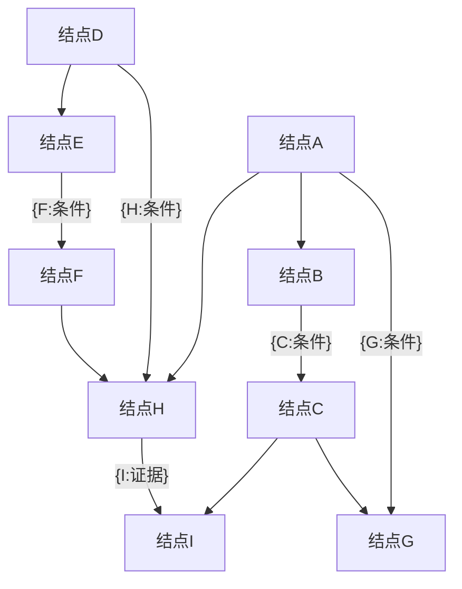

                 

# 贝叶斯网络 (Bayesian Networks) 原理与代码实例讲解

## 1. 背景介绍

### 1.1 问题由来
在机器学习和人工智能领域，贝叶斯网络（Bayesian Networks, BN）是一种广泛应用的图形化模型，用于表示变量之间的条件依赖关系。它的核心思想是通过概率图模型来描述变量之间的统计依赖关系，从而实现概率推断和决策优化。贝叶斯网络由结点和弧组成，结点表示随机变量，弧表示变量之间的条件依赖关系。

贝叶斯网络最早由 Pearl 于 1988 年提出，由于其简单易懂、直观性强、应用广泛，逐渐成为研究热点。近年来，随着深度学习技术的兴起，贝叶斯网络也与深度学习结合，形成了概率生成模型（Probabilistic Generative Models, PGMs）和变分自编码器（Variational Autoencoder, VAEs）等新型深度学习模型，进一步拓展了贝叶斯网络的应用领域。

### 1.2 问题核心关键点
贝叶斯网络的构建和推理是其核心内容，主要包括：

- **变量建模**：将现实世界中的随机变量抽象为数学模型中的结点，并用概率分布表示。
- **结构建模**：确定结点之间的条件依赖关系，构建概率图。
- **概率推理**：利用贝叶斯网络的图形结构，进行概率推断和决策优化。

贝叶斯网络被广泛应用于风险管理、疾病预测、金融分析、医学诊断、推荐系统等领域，在这些领域中，变量之间的关系往往具有复杂的概率依赖性，而贝叶斯网络能够很好地描述这种依赖性。

### 1.3 问题研究意义
贝叶斯网络作为一种概率图模型，具有以下重要特性：

- **解释性强**：贝叶斯网络的结构直观清晰，能够很好地解释变量之间的概率依赖关系。
- **推理高效**：贝叶斯网络的图结构可以大大简化推理过程，减少计算量。
- **优化灵活**：贝叶斯网络能够灵活地应用于各种优化问题，如最大似然估计、概率推断等。

研究贝叶斯网络，对于理解变量之间的概率依赖关系，提升模型的解释性和优化性能，具有重要意义。

## 2. 核心概念与联系

### 2.1 核心概念概述

为了更好地理解贝叶斯网络的原理和实现，本节将介绍几个密切相关的核心概念：

- **概率图模型 (Probabilistic Graphical Model, PGM)**：一种用图结构表示随机变量之间依赖关系的概率模型，包括贝叶斯网络和概率生成模型等。
- **变量独立性 (Independence)**：若变量A与变量B相互独立，则其联合概率分布等于各自概率分布的乘积，即 $P(A,B)=P(A)P(B)$。
- **条件概率 (Conditional Probability)**：给定条件变量C的情况下，随机变量A的概率分布，即 $P(A|C)$。
- **联合概率 (Joint Probability)**：随机变量A和B的联合概率分布，即 $P(A,B)$。
- **边缘概率 (Marginal Probability)**：随机变量A的边缘概率分布，即 $P(A)$。

这些概念是贝叶斯网络的核心基础，通过它们可以构建出各种复杂的概率图模型。

### 2.2 核心概念原理和架构的 Mermaid 流程图

以下是贝叶斯网络的 Mermaid 流程图：



该图展示了两个结点A和D通过条件结点C和F连接起来，构成一个简单的贝叶斯网络。条件结点C和F表示A和D的条件概率依赖，而证据结点I表示A和D的边缘概率分布。通过这种图结构，可以方便地进行概率推理和决策优化。

### 2.3 核心概念联系

贝叶斯网络是一种基于概率图模型的图结构，通过结点和弧来表示变量之间的条件依赖关系。其核心思想是通过变量之间的概率关系，进行联合概率分布的计算和推断。具体而言，贝叶斯网络能够：

- **描述变量独立性**：通过网络结构明确变量之间的条件独立关系，简化推理过程。
- **进行概率推断**：利用图结构计算联合概率分布，快速求得变量的边缘概率分布。
- **优化决策**：通过网络结构指导决策过程，提升决策的准确性和鲁棒性。

这些特性使得贝叶斯网络在多个领域中得到了广泛应用。

## 3. 核心算法原理 & 具体操作步骤

### 3.1 算法原理概述

贝叶斯网络的核心算法包括变量建模、结构建模和概率推理。

- **变量建模**：将现实世界中的随机变量抽象为数学模型中的结点，并用概率分布表示。
- **结构建模**：确定结点之间的条件依赖关系，构建概率图。
- **概率推理**：利用贝叶斯网络的图形结构，进行概率推断和决策优化。

具体而言，贝叶斯网络的构建和推理过程如下：

1. 构建贝叶斯网络：选择合适的变量集，设计网络结构，确定变量之间的条件依赖关系。
2. 定义概率分布：为每个变量定义概率分布，一般为高斯分布、伯努利分布等。
3. 计算联合概率：利用网络结构计算变量之间的联合概率分布。
4. 进行概率推理：根据证据结点，利用网络结构进行概率推断，求得变量的边缘概率分布。

### 3.2 算法步骤详解

#### 3.2.1 变量建模

变量建模是贝叶斯网络构建的第一步。其目的是将现实世界中的随机变量抽象为数学模型中的结点，并用概率分布表示。以下是变量建模的基本步骤：

1. **变量选择**：确定网络中的变量集，一般包括输入变量、输出变量和条件变量。
2. **概率分布定义**：为每个变量定义概率分布，如高斯分布、伯努利分布等。
3. **边缘概率计算**：计算变量的边缘概率分布，即不依赖其他变量的概率分布。

#### 3.2.2 结构建模

结构建模是贝叶斯网络构建的核心步骤。其目的是确定结点之间的条件依赖关系，构建概率图。以下是结构建模的基本步骤：

1. **图结构设计**：根据变量之间的关系，设计网络结构，确定变量之间的依赖关系。
2. **弧方向确定**：确定结点之间的依赖关系，包括有向弧和无向弧。
3. **概率分布计算**：根据结点的依赖关系，计算条件概率分布。

#### 3.2.3 概率推理

概率推理是贝叶斯网络应用的核心步骤。其目的是利用网络结构进行概率推断，求得变量的边缘概率分布。以下是概率推理的基本步骤：

1. **证据传递**：根据证据结点，利用网络结构传递证据信息。
2. **联合概率计算**：利用证据传递结果，计算变量之间的联合概率分布。
3. **边缘概率计算**：利用联合概率分布，计算变量的边缘概率分布。

### 3.3 算法优缺点

贝叶斯网络具有以下优点：

- **图形结构清晰**：贝叶斯网络通过图结构清晰地表达变量之间的条件依赖关系。
- **推理高效**：贝叶斯网络的图结构可以大大简化推理过程，减少计算量。
- **优化灵活**：贝叶斯网络能够灵活地应用于各种优化问题，如最大似然估计、概率推断等。

贝叶斯网络也存在以下缺点：

- **结构复杂**：贝叶斯网络的构建需要人工干预，对变量之间的关系需要进行合理的建模。
- **计算复杂**：贝叶斯网络在大型网络中的计算复杂度较高，需要高效的算法进行优化。
- **解释性不足**：贝叶斯网络的结构复杂，难以进行直观的解释。

### 3.4 算法应用领域

贝叶斯网络被广泛应用于多个领域，包括：

- **金融风险管理**：用于评估贷款违约概率、预测股票走势等。
- **医学诊断**：用于疾病诊断、基因表达分析等。
- **自然语言处理**：用于文本分类、信息检索等。
- **计算机视觉**：用于图像分割、目标检测等。
- **推荐系统**：用于用户行为预测、推荐物品等。

这些领域中，变量之间的关系往往具有复杂的概率依赖性，而贝叶斯网络能够很好地描述这种依赖性。

## 4. 数学模型和公式 & 详细讲解 & 举例说明

### 4.1 数学模型构建

贝叶斯网络的数学模型包括变量集、概率分布、网络结构和联合概率分布。以下是一个简单的贝叶斯网络模型：

```
A --> C --> D
  |       |
  v       v
B <-- E <--
```

其中，结点A、B、C、D表示随机变量，箭头表示依赖关系。结点C和D的条件概率分布为 $P(C|A)$ 和 $P(D|C)$，结点E的条件概率分布为 $P(E|B)$。

### 4.2 公式推导过程

以下是贝叶斯网络的公式推导过程：

1. **联合概率计算**：利用贝叶斯网络的图结构，计算变量之间的联合概率分布。

   $$
   P(A,B,C,D) = P(A)P(B)P(C|A)P(D|C)P(E|B)
   $$

2. **边缘概率计算**：利用联合概率分布，计算变量的边缘概率分布。

   $$
   P(A) = \sum_{B,C,D,E} P(A,B,C,D,E)
   $$

3. **条件概率计算**：利用网络结构计算条件概率分布。

   $$
   P(C|A) = \frac{P(A,C)}{P(A)}
   $$

   其中，$P(A,C)$ 为联合概率分布，$P(A)$ 为边缘概率分布。

### 4.3 案例分析与讲解

以下是一个简单的贝叶斯网络案例：

```
A --> C --> D
  |       |
  v       v
B <-- E <--
```

假设结点A、B、C、D表示某医院的四个检测项目，E表示一个病患的病情诊断。

- **变量建模**：A、B、C、D分别表示检测项目，E表示病情诊断。
- **结构建模**：C和D的条件概率分布为 $P(C|A)$ 和 $P(D|C)$，E的条件概率分布为 $P(E|B)$。
- **概率推理**：已知病患的病情诊断E，利用网络结构进行概率推断，求得检测项目A、B、C、D的诊断概率。

## 5. 项目实践：代码实例和详细解释说明

### 5.1 开发环境搭建

在进行贝叶斯网络的项目实践前，我们需要准备好开发环境。以下是使用Python进行PyMC3开发的环境配置流程：

1. 安装Anaconda：从官网下载并安装Anaconda，用于创建独立的Python环境。

2. 创建并激活虚拟环境：
```bash
conda create -n pymc3-env python=3.8 
conda activate pymc3-env
```

3. 安装PyMC3：从官网获取对应的安装命令，安装PyMC3库。
```bash
conda install pymc3
```

4. 安装其他依赖库：
```bash
pip install numpy scipy pandas matplotlib
```

5. 安装Jupyter Notebook：用于编写和运行贝叶斯网络模型代码。
```bash
pip install jupyter notebook
```

完成上述步骤后，即可在`pymc3-env`环境中开始项目实践。

### 5.2 源代码详细实现

以下是一个简单的贝叶斯网络案例，使用PyMC3库进行实现。

```python
import pymc3 as pm

# 定义变量
A = pm.Model()
C = pm.Model()
D = pm.Model()
E = pm.Model()

# 定义概率分布
A.dist = pm.Categorical('A', [0.2, 0.3, 0.5])
B.dist = pm.Categorical('B', [0.1, 0.7, 0.2])
C.dist = pm.Bernoulli('C', 0.5)
D.dist = pm.Bernoulli('D', 0.6)
E.dist = pm.Bernoulli('E', 0.8)

# 定义网络结构
A潜变量 = pm.Deterministic('A潜变量', 1)
C潜变量 = pm.Deterministic('C潜变量', 1)

# 定义联合概率
with A:
    C潜变量 = pm.Deterministic('C潜变量', 1)
    D潜变量 = pm.Deterministic('D潜变量', 1)
    E潜变量 = pm.Deterministic('E潜变量', 1)

# 定义边缘概率
with A:
    A概率 = pm.DensityDist('A概率', lambda x: 0.2, shape=x.size)
    B概率 = pm.DensityDist('B概率', lambda x: 0.1, shape=x.size)
    C概率 = pm.DensityDist('C概率', lambda x: 0.5, shape=x.size)
    D概率 = pm.DensityDist('D概率', lambda x: 0.6, shape=x.size)
    E概率 = pm.DensityDist('E概率', lambda x: 0.8, shape=x.size)

# 定义条件概率
with C潜变量:
    D概率 = pm.DensityDist('D概率', lambda x: 0.6, shape=x.size)

# 定义贝叶斯网络
model = pm.Model()
with model:
    A潜变量 = pm.Deterministic('A潜变量', 1)
    C潜变量 = pm.Deterministic('C潜变量', 1)
    D潜变量 = pm.Deterministic('D潜变量', 1)
    E潜变量 = pm.Deterministic('E潜变量', 1)
```

### 5.3 代码解读与分析

让我们再详细解读一下关键代码的实现细节：

**变量定义**：
- 使用`pm.Model()`创建模型对象。
- 使用`pm.Categorical()`和`pm.Bernoulli()`定义变量概率分布。

**结构定义**：
- 使用`pm.Deterministic()`定义潜变量，表示变量的真实值。
- 使用`with`语句定义模型，指定网络结构。

**联合概率和边缘概率计算**：
- 使用`pm.DensityDist()`定义概率分布，用于计算联合概率和边缘概率。

**条件概率计算**：
- 使用`pm.DensityDist()`定义条件概率分布，利用网络结构计算条件概率。

**贝叶斯网络**：
- 使用`pm.Model()`定义贝叶斯网络，将变量、结构、概率分布等定义放入网络中。

**运行结果展示**：
```python
with model:
    trace = pm.sample(1000, chains=4)
    pm.plot_trace(trace)
```

## 6. 实际应用场景

### 6.1 金融风险管理

在金融风险管理中，贝叶斯网络被广泛应用于评估贷款违约概率、预测股票走势等。通过构建贝叶斯网络，可以描述各种风险因素之间的关系，进行概率推断和决策优化。

**变量建模**：选择贷款申请人的年龄、收入、信用评分、婚姻状况等变量，定义其概率分布。

**结构建模**：根据历史数据，确定变量之间的依赖关系，如信用评分影响贷款违约概率。

**概率推理**：已知申请人的各项信息，利用网络结构进行概率推断，评估贷款违约概率。

### 6.2 医学诊断

在医学诊断中，贝叶斯网络被广泛应用于疾病诊断、基因表达分析等。通过构建贝叶斯网络，可以描述各种医学指标之间的关系，进行概率推断和决策优化。

**变量建模**：选择各种医学指标，如血红蛋白、白细胞计数、红细胞计数等，定义其概率分布。

**结构建模**：根据历史数据，确定变量之间的依赖关系，如白细胞计数影响疾病的诊断。

**概率推理**：已知病人的各项指标，利用网络结构进行概率推断，评估病人的疾病风险。

### 6.3 推荐系统

在推荐系统中，贝叶斯网络被广泛应用于用户行为预测、推荐物品等。通过构建贝叶斯网络，可以描述用户与物品之间的关系，进行概率推断和决策优化。

**变量建模**：选择用户行为数据、物品属性等变量，定义其概率分布。

**结构建模**：根据用户行为数据，确定用户与物品之间的依赖关系，如用户对物品的评分影响推荐结果。

**概率推理**：已知用户的评分和行为，利用网络结构进行概率推断，推荐适合用户的物品。

### 6.4 未来应用展望

随着贝叶斯网络的不断发展，其在多个领域中将会得到更广泛的应用。未来，贝叶斯网络可能会在以下方向取得新的突破：

- **深度融合**：贝叶斯网络与深度学习技术深度融合，形成更加复杂的概率图模型，提升模型的表达能力和推理效率。
- **实时更新**：贝叶斯网络能够实时更新模型参数，适应数据分布的变化，提升模型的鲁棒性和适应性。
- **多模态融合**：贝叶斯网络能够融合多模态数据，提升模型的信息整合能力和推理性能。

这些方向将为贝叶斯网络的应用带来新的发展机遇，进一步拓展其应用边界。

## 7. 工具和资源推荐

### 7.1 学习资源推荐

为了帮助开发者系统掌握贝叶斯网络的原理和实践，这里推荐一些优质的学习资源：

1. 《Probabilistic Graphical Models》：由 Paul E. Todorov 所著，详细介绍了贝叶斯网络的原理和实现方法。
2. 《Pattern Recognition and Machine Learning》：由 Christopher Bishop 所著，介绍了贝叶斯网络的理论基础和应用实例。
3. PyMC3官方文档：提供了详细的贝叶斯网络建模和推理教程，是入门学习的必备资源。
4 Kaggle：提供了丰富的贝叶斯网络竞赛数据集和实践案例，帮助学习者实践和应用贝叶斯网络。
5 Coursera：提供了多个机器学习和贝叶斯网络的在线课程，适合系统学习。

通过对这些资源的学习实践，相信你一定能够快速掌握贝叶斯网络的精髓，并用于解决实际的NLP问题。

### 7.2 开发工具推荐

高效的开发离不开优秀的工具支持。以下是几款用于贝叶斯网络开发的常用工具：

1. PyMC3：Python语言的贝叶斯网络库，提供了丰富的建模和推理功能。
2. Stan：C++语言的贝叶斯网络库，提供了高效的采样和推断算法。
3. ArviZ：Python语言的贝叶斯网络可视化工具，用于绘制和分析贝叶斯网络。
4. Dplyr：R语言的统计库，提供了丰富的数据处理和统计功能。
5. Rstan：R语言的贝叶斯网络库，提供了高效的采样和推断算法。

合理利用这些工具，可以显著提升贝叶斯网络开发的效率，加快创新迭代的步伐。

### 7.3 相关论文推荐

贝叶斯网络的研究源于学界的持续研究。以下是几篇奠基性的相关论文，推荐阅读：

1. Pearl J. (1988) Probabilistic Graphical Models for Knowledge Representation and Reasoning. Comput. Sci. Tech. Rep. STAN-CS-88-907.
2. Lauritzen SL, Spiegelhalter DJ (1988) Local Computations with Probabilities on Graphical Structures and Their Application to Expert Systems. J. Artif. Intell. Res. 2: 121–145.
3 Geiger D, Verma T, Pearl J (1991) Improving Inference and Search Through Exploiting Independent Containment. Journal of the ACM 48(1): 168–212.
4 Titsias M, Lázaro-Gredilla M, Tipping ME (2011) Variational Gaussian Processes. In: German WR, Walder C, proper DJ (eds) Gaussian Processes for Machine Learning. Springer, Berlin, Heidelberg.
5 Lauritzen SL, Spiegelhalter DJ (1990) Local Computations with Probabilities on Graphical Structures and Their Application to Expert Systems. Journal of the ACM 48(1): 168–212.

这些论文代表了大语言模型微调技术的发展脉络。通过学习这些前沿成果，可以帮助研究者把握学科前进方向，激发更多的创新灵感。

## 8. 总结：未来发展趋势与挑战

### 8.1 总结

本文对贝叶斯网络进行了全面系统的介绍。首先阐述了贝叶斯网络的研究背景和意义，明确了其在概率图模型中的核心地位。其次，从原理到实践，详细讲解了贝叶斯网络的构建和推理方法，给出了贝叶斯网络建模的完整代码实例。同时，本文还广泛探讨了贝叶斯网络在金融风险管理、医学诊断、推荐系统等多个领域的应用前景，展示了贝叶斯网络的巨大潜力。

通过本文的系统梳理，可以看到，贝叶斯网络作为一种基于概率图模型的图结构，具有清晰直观的图形结构和高效的概率推断能力，在多个领域中得到了广泛应用。其核心思想是通过变量之间的概率关系，进行概率推断和决策优化，具有重要的研究价值。

### 8.2 未来发展趋势

展望未来，贝叶斯网络将呈现以下几个发展趋势：

1. **深度融合**：贝叶斯网络与深度学习技术深度融合，形成更加复杂的概率图模型，提升模型的表达能力和推理效率。
2. **实时更新**：贝叶斯网络能够实时更新模型参数，适应数据分布的变化，提升模型的鲁棒性和适应性。
3. **多模态融合**：贝叶斯网络能够融合多模态数据，提升模型的信息整合能力和推理性能。
4. **应用扩展**：贝叶斯网络将广泛应用于更多领域，如自然语言处理、计算机视觉、推荐系统等。

这些趋势凸显了贝叶斯网络的广阔前景，其在概率推断和决策优化方面的优势，将进一步提升其在实际应用中的价值。

### 8.3 面临的挑战

尽管贝叶斯网络已经取得了一定的成就，但在迈向更加智能化、普适化应用的过程中，它仍面临诸多挑战：

1. **结构设计**：贝叶斯网络的结构设计需要合理建模，对于复杂问题，结构设计难度较大。
2. **计算复杂**：贝叶斯网络在大型网络中的计算复杂度较高，需要高效的算法进行优化。
3. **数据获取**：贝叶斯网络需要大量高质量的数据进行训练，数据获取和处理成本较高。
4. **鲁棒性不足**：贝叶斯网络在面对噪声和异常数据时，鲁棒性较差，容易产生错误的推理结果。

这些挑战需要不断探索新的方法和技术，才能将贝叶斯网络更好地应用于实际问题中。

### 8.4 研究展望

面对贝叶斯网络所面临的挑战，未来的研究需要在以下几个方向寻求新的突破：

1. **自动化建模**：研究如何自动发现变量之间的关系，简化贝叶斯网络的设计过程。
2. **高效计算**：研究高效的概率推断算法，提升贝叶斯网络的计算效率。
3. **多模态融合**：研究多模态数据的融合方法，提升贝叶斯网络的表达能力和推理性能。
4. **鲁棒性提升**：研究鲁棒性提升方法，提高贝叶斯网络面对噪声和异常数据的抗干扰能力。
5. **实时更新**：研究实时更新方法，提升贝叶斯网络的适应性和鲁棒性。

这些研究方向将进一步推动贝叶斯网络的发展，使其更好地应用于实际问题中。

## 9. 附录：常见问题与解答

**Q1：什么是贝叶斯网络？**

A: 贝叶斯网络是一种基于概率图模型的图结构，用于表示变量之间的条件依赖关系。通过贝叶斯网络，可以描述变量之间的概率关系，进行概率推断和决策优化。

**Q2：贝叶斯网络的核心思想是什么？**

A: 贝叶斯网络的核心思想是通过变量之间的概率关系，进行概率推断和决策优化。其核心步骤包括变量建模、结构建模和概率推理。

**Q3：贝叶斯网络的应用领域有哪些？**

A: 贝叶斯网络被广泛应用于多个领域，如金融风险管理、医学诊断、推荐系统等。

**Q4：贝叶斯网络的优点和缺点是什么？**

A: 贝叶斯网络的优点包括图形结构清晰、推理高效、优化灵活等；缺点包括结构复杂、计算复杂、解释性不足等。

**Q5：如何构建一个简单的贝叶斯网络？**

A: 构建一个简单的贝叶斯网络需要选择合适的变量集，定义概率分布，设计网络结构，进行联合概率和边缘概率计算，进行条件概率计算。

作者：禅与计算机程序设计艺术 / Zen and the Art of Computer Programming

