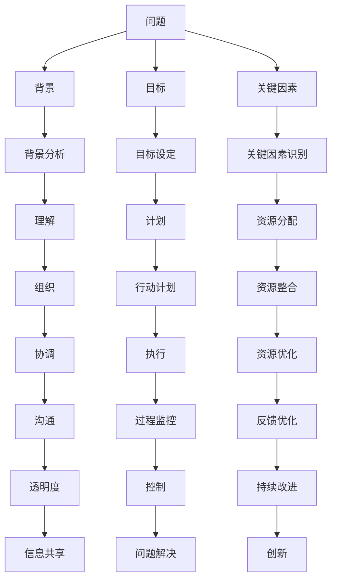

                 

## 1. 背景介绍

### 1.1 问题由来

在快速变化的商业环境中，管理层面临的问题日趋复杂和多样。从战略决策到日常运营，从人力资源到客户关系，各种问题都亟需快速有效的解决。然而，问题的诊断和解决往往需要大量的数据和专业知识，而传统的管理工具和方法往往难以适应这些新挑战。

费曼学习法（Feynman Technique）作为一种高效的自我学习工具，最初由诺贝尔物理学家理查德·费曼提出，通过简洁精炼的提问方式，帮助人们深入理解和掌握复杂概念。近年来，这种学习方法在教育、软件开发、项目管理等领域得到了广泛应用。本文旨在探讨将费曼学习法应用于管理问题诊断的潜力，通过提出一系列精炼的问题，帮助管理层快速理解和解决复杂的管理问题。

### 1.2 问题核心关键点

费曼学习法在管理问题诊断中的核心关键点包括：

- 问题的清晰界定：通过明确的问题界定，避免诊断过程中的信息过载和模糊不清。
- 分解问题的结构：将复杂问题分解为更小、更可管理的部分，逐个击破。
- 直接性提问：以简洁、直接的方式提出问题，引导思考和探索。
- 深度理解：通过持续提问，深入理解问题的本质和根本原因。
- 知识巩固：将理解到的知识内化并固化，形成可供随时参考的知识体系。

本文将深入探讨费曼学习法的核心原理，结合具体案例，演示其在管理问题诊断中的应用方法和效果。

## 2. 核心概念与联系

### 2.1 核心概念概述

费曼学习法是一种以教授为目的的学习方法，通过简洁明了的问题，促进深度理解和知识内化。在管理问题诊断中，我们可以将费曼学习法的核心概念与管理的五大职能（计划、组织、领导、控制、创新）联系起来，通过精炼的提问，帮助管理层系统化地解决问题。

1. **计划 (Planning)**：明确问题的背景、目标和关键因素。
2. **组织 (Organizing)**：分解问题结构，识别关键步骤和相关资源。
3. **领导 (Leading)**：直接提问，引导思考和讨论，促进团队合作。
4. **控制 (Controlling)**：持续监测和反馈，确保问题解决的有效性。
5. **创新 (Innovating)**：提出假设和解决方案，验证和改进。

### 2.2 核心概念原理和架构的 Mermaid 流程图



这个Mermaid流程图展示了费曼学习法在管理问题诊断中的应用流程：从问题的界定、背景分析、目标设定、资源分配、行动计划到执行和控制，每个环节都通过精炼的提问进行推进和优化。

## 3. 核心算法原理 & 具体操作步骤

### 3.1 算法原理概述

费曼学习法的核心原理是通过简洁、直接的提问，促进深度理解和知识内化。在管理问题诊断中，这一原理同样适用。通过提出一系列精炼的问题，帮助管理层系统化地思考和解决问题。

### 3.2 算法步骤详解

1. **问题界定**：首先明确问题的具体内容、背景和影响范围。例如，“我们的销售增长为什么停滞不前？”

2. **背景分析**：深入了解问题的背景和相关因素。例如，“过去一年我们的销售渠道有哪些变化？”

3. **目标设定**：明确解决问题的具体目标和期望结果。例如，“我们希望在接下来的六个月内实现15%的销售增长”。

4. **关键因素识别**：识别影响问题的关键因素。例如，“哪些渠道的销售下降最明显？”

5. **行动计划**：制定解决问题的具体行动计划和步骤。例如，“我们将重点优化A和B两个渠道的销售策略”。

6. **执行和控制**：执行计划并持续监测和反馈，确保问题解决的有效性。例如，“我们将每周检查一次销售数据，并根据反馈调整策略”。

7. **持续改进**：总结经验教训，提出改进措施，形成知识体系。例如，“根据这次经验，我们将优化市场调研的方法”。

### 3.3 算法优缺点

**优点**：

- **简洁直接**：通过精炼的提问，引导思考和讨论，避免信息过载和模糊不清。
- **系统化**：将问题分解为更小、更可管理的部分，逐个击破。
- **促进合作**：通过直接提问，促进团队成员的合作和参与。
- **持续改进**：通过持续提问和反馈，确保问题解决的有效性。

**缺点**：

- **需要时间和精力**：费曼学习法需要耗费大量时间和精力进行提问和分析。
- **依赖提问者的能力**：提问者的提问水平直接影响诊断效果，需要不断提升。

### 3.4 算法应用领域

费曼学习法在管理问题诊断中具有广泛的应用前景，适用于各种复杂的管理问题。例如：

- **销售增长停滞**：通过提问，帮助识别影响因素、优化策略和监测效果。
- **客户满意度下降**：通过提问，理解客户需求、改进服务并持续监控。
- **人力资源问题**：通过提问，识别员工流失原因、优化招聘和培训策略。
- **供应链管理**：通过提问，优化采购和物流流程、减少成本和提高效率。
- **产品开发**：通过提问，识别市场需求、优化设计并快速迭代。

## 4. 数学模型和公式 & 详细讲解 & 举例说明

### 4.1 数学模型构建

在管理问题诊断中，我们通常使用简化模型和直接性提问来促进理解和分析。以下是一个简化的数学模型：

- **问题界定**：$P = (Q, B, R)$
- **背景分析**：$B = (C_1, C_2, ..., C_n)$
- **目标设定**：$T = \{P, R\}$
- **关键因素识别**：$K = (F_1, F_2, ..., F_m)$
- **行动计划**：$A = (S_1, S_2, ..., S_n)$
- **执行和控制**：$C = (M, F, I)$
- **持续改进**：$C = (E, L, S)$

### 4.2 公式推导过程

以销售增长停滞问题为例，推导费曼学习法的应用流程：

1. **问题界定**：$P = (Q, B, R)$
   - $Q$：问题具体内容
   - $B$：问题背景
   - $R$：问题影响范围

2. **背景分析**：$B = (C_1, C_2, ..., C_n)$
   - $C_i$：背景中的关键因素

3. **目标设定**：$T = \{P, R\}$
   - $P$：期望的改进目标
   - $R$：实现目标的时间框架

4. **关键因素识别**：$K = (F_1, F_2, ..., F_m)$
   - $F_i$：影响问题的关键因素

5. **行动计划**：$A = (S_1, S_2, ..., S_n)$
   - $S_i$：具体的改进措施

6. **执行和控制**：$C = (M, F, I)$
   - $M$：监测和反馈机制
   - $F$：反馈周期
   - $I$：持续改进机制

7. **持续改进**：$C = (E, L, S)$
   - $E$：经验总结
   - $L$：教训提取
   - $S$：知识体系

### 4.3 案例分析与讲解

**案例**：某科技公司销售增长停滞

**问题界定**：$P = (Q, B, R)$
- $Q$：销售增长停滞
- $B$：市场变化、竞争对手策略、内部资源
- $R$：未来六个月内实现15%的销售增长

**背景分析**：$B = (C_1, C_2, ..., C_n)$
- $C_1$：市场竞争加剧
- $C_2$：竞争对手的定价策略
- $C_3$：内部销售团队的激励机制

**目标设定**：$T = \{P, R\}$
- $P$：提升市场份额
- $R$：六个月内实现15%的销售增长

**关键因素识别**：$K = (F_1, F_2, ..., F_m)$
- $F_1$：市场定位
- $F_2$：产品差异化
- $F_3$：销售团队激励

**行动计划**：$A = (S_1, S_2, ..., S_n)$
- $S_1$：重新定义市场定位
- $S_2$：提升产品独特性
- $S_3$：优化销售激励机制

**执行和控制**：$C = (M, F, I)$
- $M$：每周监测销售数据
- $F$：每月反馈会议
- $I$：根据反馈调整策略

**持续改进**：$C = (E, L, S)$
- $E$：总结市场定位调整的经验
- $L$：提取竞争对手策略的教训
- $S$：建立市场调研的知识体系

通过这一系列提问，管理层能够系统化地理解问题，制定有效的改进措施，并在实施过程中不断优化和改进。

## 5. 项目实践：代码实例和详细解释说明

### 5.1 开发环境搭建

在管理问题诊断中，通常不需要复杂的代码实现，而是依赖于有效的提问和讨论。因此，开发环境搭建相对简单，主要需要以下工具：

1. **电子表格软件**：如Excel、Google Sheets，用于记录问题和分析数据。
2. **项目管理工具**：如Jira、Trello，用于跟踪行动计划和执行状态。
3. **协作工具**：如Slack、Microsoft Teams，用于团队成员的实时沟通和协作。
4. **会议工具**：如Zoom、Teams，用于定期召开问题讨论和反馈会议。

### 5.2 源代码详细实现

在具体的代码实现上，我们可以使用Python编写简单的脚本，帮助记录和分析问题。例如，以下是一个简单的示例代码：

```python
import pandas as pd

# 记录问题和背景分析
problem = '销售增长停滞'
background = '市场变化、竞争对手策略、内部资源'

# 目标设定
target = '提升市场份额'

# 关键因素识别
key_factors = ['市场定位', '产品差异化', '销售团队激励']

# 行动计划
actions = ['重新定义市场定位', '提升产品独特性', '优化销售激励机制']

# 执行和控制
monitoring = '每周监测销售数据'
feedback = '每月反馈会议'
improvement = '根据反馈调整策略'

# 持续改进
experience = '总结市场定位调整的经验'
lessons = '提取竞争对手策略的教训'
knowledge = '建立市场调研的知识体系'

# 记录为数据表
data = {
    'Problem': [problem],
    'Background': [background],
    'Target': [target],
    'Key_Factors': [key_factors],
    'Actions': [actions],
    'Monitoring': [monitoring],
    'Feedback': [feedback],
    'Improvement': [improvement],
    'Experience': [experience],
    'Lessons': [lessons],
    'Knowledge': [knowledge]
}

df = pd.DataFrame(data)
df.to_csv('management_issues.csv', index=False)
```

### 5.3 代码解读与分析

这段代码使用Python的Pandas库，将问题、背景、目标、关键因素、行动计划、执行和控制、持续改进等信息记录到一个数据表中，并保存为CSV文件。这种记录方式有助于系统的跟踪和分析，方便后续的评估和改进。

### 5.4 运行结果展示

通过上述代码，我们得到了一个包含所有信息的CSV文件。例如，打开该文件，可以看到以下内容：

```
   Problem,Breakdown,Target,Key_Factors,Actions,Monitoring,Feedback,Improvement,Experience,Lessons,Knowledge
0  Sales Growth Stagnation  Market Changes,Competitor Strategies,Internal Resources  Boost Market Share  [Market Positioning, Product Differentiation, Sales Team Incentives]  Weekly Sales Data Monitoring  Monthly Feedback Meeting  Adjust Strategy Based on Feedback  Summarize Market Position Adjustment Experience  Extract Lessons from Competitor Strategy  Build Market Research Knowledge Base
```

这种记录方式清晰地展示了问题的各个环节和步骤，方便团队成员理解和协作。

## 6. 实际应用场景

### 6.1 智能客服系统

在智能客服系统中，费曼学习法可以用于快速诊断和解决客户反馈问题。通过提出精炼的问题，了解客户的投诉内容、背景和期望结果，系统可以迅速定位问题、制定改进措施，并通过持续监测和反馈，不断优化服务质量。

### 6.2 产品开发

在产品开发过程中，费曼学习法可以帮助团队快速识别需求问题、优化产品设计和功能。通过提问，了解用户需求、市场趋势和技术挑战，形成系统的改进方案，并通过持续测试和反馈，不断优化产品。

### 6.3 人力资源管理

在人力资源管理中，费曼学习法可以用于识别员工流失原因、优化招聘和培训策略。通过提问，了解员工需求、工作环境和激励机制，形成系统的改进措施，并通过持续监控和反馈，不断提升员工满意度和工作效率。

## 7. 工具和资源推荐

### 7.1 学习资源推荐

1. **《费曼学习法》**：理查德·费曼的《费曼学习法》一书，详细介绍了一种高效的学习方法，值得深入阅读。
2. **《管理者的自我诊断》**：彼得·圣吉的《管理者的自我诊断》一书，探讨了管理者的自我反思和改进方法。
3. **《敏捷管理》**：《敏捷管理》系列课程，介绍敏捷管理方法和工具，帮助管理层快速应对变化。

### 7.2 开发工具推荐

1. **Jira**：强大的项目管理工具，适用于复杂的管理问题诊断和跟踪。
2. **Trello**：简单易用的项目管理工具，适合团队协作和任务管理。
3. **Slack**：实时沟通工具，便于团队成员的交流和协作。
4. **Zoom**：视频会议工具，便于定期召开问题讨论和反馈会议。

### 7.3 相关论文推荐

1. **《管理问题的系统化方法》**：探讨了系统化方法在管理问题诊断中的应用，有助于理解费曼学习法的应用框架。
2. **《敏捷项目管理》**：介绍了敏捷项目管理方法，强调了快速反馈和持续改进的重要性。

## 8. 总结：未来发展趋势与挑战

### 8.1 总结

费曼学习法在管理问题诊断中的应用，通过简洁、直接的提问，帮助管理层系统化地思考和解决问题。本文系统阐述了费曼学习法的核心原理和操作步骤，并通过实际案例演示了其在管理问题诊断中的具体应用。费曼学习法的简洁、直接和系统化特性，使其在管理问题诊断中具有广泛的应用前景。

### 8.2 未来发展趋势

1. **自动化和智能化**：未来，随着AI和数据技术的进步，自动化和智能化的方法将逐渐普及，帮助管理层更快速地诊断和解决问题。
2. **跨部门协作**：跨部门协作将更加紧密，通过系统化的管理和协作，提高问题解决的效率和效果。
3. **实时数据驱动**：实时数据驱动的方法将取代传统定期报告的方式，通过持续监测和反馈，确保问题解决的及时性和有效性。

### 8.3 面临的挑战

1. **复杂问题处理**：管理问题往往复杂多样，如何通过精炼的提问快速理解和解决问题，仍是一大挑战。
2. **知识传递和固化**：如何有效传递和固化管理经验，形成系统的知识体系，仍需要不断探索和实践。
3. **跨部门协同**：跨部门协同管理的复杂性，如何打破部门壁垒，形成统一的视角和策略，仍需进一步优化。

### 8.4 研究展望

1. **系统化模型研究**：研究更系统化的管理问题诊断模型，通过数据驱动的方法，提高问题诊断的准确性和效率。
2. **智能工具开发**：开发更智能的管理工具，结合AI和数据技术，辅助管理层快速诊断和解决问题。
3. **跨学科融合**：融合心理学、社会学等跨学科知识，提升管理问题诊断的深度和广度。

## 9. 附录：常见问题与解答

**Q1：如何应用费曼学习法进行问题诊断？**

A: 应用费曼学习法进行问题诊断，首先要明确问题的具体内容、背景和影响范围，然后通过精炼的提问，深入了解问题的各个环节和步骤，形成系统的改进方案，并持续监测和反馈，不断优化和改进。

**Q2：费曼学习法的核心在于什么？**

A: 费曼学习法的核心在于通过简洁、直接的提问，促进深度理解和知识内化。通过提问，帮助管理层系统化地思考和解决问题。

**Q3：费曼学习法适用于哪些管理问题？**

A: 费曼学习法适用于各种复杂的管理问题，如销售增长停滞、客户满意度下降、人力资源问题等。

**Q4：如何选择合适的提问方式？**

A: 选择合适的提问方式，需要根据问题的复杂度和信息量，避免过于宽泛和模糊不清，同时确保问题的直接性和可操作性。

**Q5：费曼学习法的优势和劣势是什么？**

A: 费曼学习法的优势在于简洁、直接和系统化，能够帮助管理层快速理解和解决问题。劣势在于需要耗费大量时间和精力进行提问和分析。

---

作者：禅与计算机程序设计艺术 / Zen and the Art of Computer Programming

