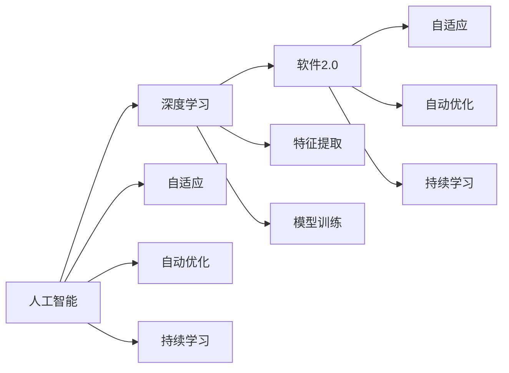

                 

# 软件 2.0 的哲学思考：人工智能的本质

## 1. 背景介绍

### 1.1 问题由来
随着人工智能（AI）技术的不断进步，软件正在从传统的1.0时代（即软件工程）向2.0时代（即AI驱动的软件）迈进。这一转变不仅仅是技术上的革新，更是对软件本质的深刻哲学思考。AI的兴起，使得软件不仅仅是代码的堆砌，更是知识、智能的载体。本文旨在探讨这一转变背后的哲学思考，尤其是人工智能在软件中的应用本质。

### 1.2 问题核心关键点
软件2.0的核心在于其智能化的本质。通过AI技术，软件能够自适应环境变化，实现自动化的优化和升级，从而具备更强的适应性和智能性。这一变化不仅改变了软件开发的方式，也重新定义了软件的价值和作用。

## 2. 核心概念与联系

### 2.1 核心概念概述

为了更好地理解软件2.0，本节将介绍几个关键概念：

- **人工智能（Artificial Intelligence, AI）**：通过算法和数据，使机器具备类似于人类的智能，包括学习、推理、感知等能力。
- **深度学习（Deep Learning, DL）**：一种特殊的机器学习技术，通过多层次神经网络结构，能够自动提取特征，处理复杂的数据结构。
- **软件工程（Software Engineering, SE）**：一种系统化、规范化的方法，旨在提高软件的质量和效率。
- **软件2.0**：指基于AI技术的软件，能够自动优化、自适应和持续学习，实现更高效、智能化的软件开发和运行。

这些概念之间的联系主要体现在：
- **AI**为**软件2.0**提供了技术基础，使其具备智能化的能力。
- **深度学习**作为**AI**的关键技术，进一步推动了**软件2.0**的发展。
- **软件工程**与**软件2.0**相结合，形成了更加系统化和智能化的软件开发方法。

### 2.2 核心概念原理和架构的 Mermaid 流程图



这个流程图展示了人工智能、深度学习和软件2.0之间的联系与关系：
- **人工智能**通过**深度学习**实现特征提取和模型训练，形成智能化的决策能力。
- **软件2.0**在此基础上，通过**自适应**、**自动优化**和**持续学习**，实现更加高效和智能的软件开发与运行。

## 3. 核心算法原理 & 具体操作步骤

### 3.1 算法原理概述

软件2.0的核心算法原理在于将人工智能技术融入软件开发过程中，实现软件智能化。主要算法包括深度学习、强化学习、迁移学习等，其中以深度学习为主。

深度学习通过多层神经网络结构，自动学习数据的复杂特征，从而实现智能化的决策和推理。其主要原理包括前向传播、反向传播、损失函数优化等。

### 3.2 算法步骤详解

以深度学习为例，软件2.0的算法步骤主要包括：

1. **数据准备**：收集和处理数据，确保数据质量和多样性。
2. **模型设计**：选择合适的深度学习模型架构，如卷积神经网络（CNN）、循环神经网络（RNN）、变换器（Transformer）等。
3. **模型训练**：使用收集到的数据，对模型进行训练，优化模型参数，使其能够准确预测。
4. **模型评估**：使用测试集对模型进行评估，验证模型性能。
5. **模型应用**：将训练好的模型应用到实际场景中，进行预测或决策。
6. **模型优化**：根据实际应用反馈，对模型进行优化，提升模型性能。

### 3.3 算法优缺点

**深度学习的优点**：
- **自动特征提取**：能够自动从数据中学习到复杂特征，无需手动设计。
- **高效并行计算**：深度学习模型适合大规模并行计算，能够在GPU、TPU等硬件上高效运行。
- **泛化能力强**：深度学习模型具有较强的泛化能力，能够处理复杂的数据结构。

**深度学习的缺点**：
- **数据需求大**：深度学习模型需要大量的标注数据进行训练，数据获取成本高。
- **计算资源消耗大**：深度学习模型参数量大，训练和推理需要大量的计算资源。
- **模型解释性差**：深度学习模型往往被视为"黑盒"，其决策过程难以解释。

### 3.4 算法应用领域

深度学习在软件2.0中的应用领域非常广泛，主要包括以下几个方面：

- **自然语言处理（Natural Language Processing, NLP）**：如文本分类、情感分析、机器翻译等。
- **计算机视觉（Computer Vision, CV）**：如图像识别、目标检测、图像生成等。
- **推荐系统**：如个性化推荐、广告推荐等。
- **强化学习**：如游戏AI、机器人控制等。
- **自动驾驶**：如无人驾驶、智能交通等。

## 4. 数学模型和公式 & 详细讲解 & 举例说明

### 4.1 数学模型构建

以一个简单的图像分类任务为例，构建一个深度学习模型。设输入为$x$，输出为$y$，模型参数为$\theta$。

模型构建过程主要包括：
1. 数据准备：收集图像数据，将其分为训练集和测试集。
2. 模型设计：选择卷积神经网络（CNN）作为模型架构，设计多个卷积层、池化层和全连接层。
3. 损失函数选择：选择交叉熵损失函数作为模型训练的损失函数。

数学公式如下：
$$
L(\theta) = -\frac{1}{N}\sum_{i=1}^N \sum_{j=1}^C y_{ij}\log p_{ij} + (1-y_{ij})\log(1-p_{ij})
$$

其中，$N$为样本数量，$C$为类别数量，$y_{ij}$为样本$i$属于类别$j$的标签，$p_{ij}$为模型对样本$i$属于类别$j$的预测概率。

### 4.2 公式推导过程

深度学习模型的训练过程主要通过反向传播算法进行。假设模型输出的预测概率为$\hat{y} = \sigma(Wx+b)$，其中$\sigma$为激活函数，$W$和$b$为模型参数。

模型的损失函数为：
$$
L(\theta) = -\frac{1}{N}\sum_{i=1}^N \sum_{j=1}^C y_{ij}\log p_{ij} + (1-y_{ij})\log(1-p_{ij})
$$

通过链式法则，对模型参数求导：
$$
\frac{\partial L}{\partial \theta} = \frac{\partial L}{\partial \hat{y}} \frac{\partial \hat{y}}{\partial x} \frac{\partial x}{\partial \theta}
$$

其中：
- $\frac{\partial L}{\partial \hat{y}}$为损失函数对预测概率的导数。
- $\frac{\partial \hat{y}}{\partial x}$为预测概率对输入的导数。
- $\frac{\partial x}{\partial \theta}$为输入对模型参数的导数。

通过反向传播算法，可以计算出每个参数的梯度，并根据梯度下降等优化算法更新参数。

### 4.3 案例分析与讲解

以Google的BERT为例，分析其在自然语言处理任务中的应用。

BERT是一种基于Transformer的预训练语言模型，通过在大规模无标签文本数据上进行预训练，学习到丰富的语言表示。其预训练任务包括掩码语言模型（Masked Language Model, MLM）和下一句预测（Next Sentence Prediction, NSP）。

在预训练完成后，对BERT进行微调，使其适应特定任务，如文本分类、情感分析等。微调过程包括：
1. 数据准备：将标注数据集分为训练集和验证集。
2. 模型设计：将BERT模型作为初始模型，添加全连接层和激活函数，作为任务特定的分类器。
3. 损失函数选择：选择交叉熵损失函数作为模型训练的损失函数。
4. 训练模型：使用微调数据集，对模型进行训练，优化分类器的参数。
5. 模型评估：使用测试集对模型进行评估，验证模型性能。

## 5. 项目实践：代码实例和详细解释说明

### 5.1 开发环境搭建

在进行深度学习项目实践前，我们需要准备好开发环境。以下是使用Python进行TensorFlow开发的环境配置流程：

1. 安装Anaconda：从官网下载并安装Anaconda，用于创建独立的Python环境。

2. 创建并激活虚拟环境：
```bash
conda create -n tf-env python=3.7 
conda activate tf-env
```

3. 安装TensorFlow：根据CUDA版本，从官网获取对应的安装命令。例如：
```bash
conda install tensorflow tensorflow-gpu=cuda11.0 -c conda-forge -c pytorch
```

4. 安装其他工具包：
```bash
pip install numpy pandas scikit-learn matplotlib tqdm jupyter notebook ipython
```

完成上述步骤后，即可在`tf-env`环境中开始深度学习项目开发。

### 5.2 源代码详细实现

以下是使用TensorFlow对CNN模型进行图像分类的完整代码实现。

```python
import tensorflow as tf
from tensorflow.keras import layers, models

# 构建CNN模型
model = models.Sequential([
    layers.Conv2D(32, (3, 3), activation='relu', input_shape=(32, 32, 3)),
    layers.MaxPooling2D((2, 2)),
    layers.Conv2D(64, (3, 3), activation='relu'),
    layers.MaxPooling2D((2, 2)),
    layers.Flatten(),
    layers.Dense(64, activation='relu'),
    layers.Dense(10)
])

# 编译模型
model.compile(optimizer='adam',
              loss=tf.keras.losses.SparseCategoricalCrossentropy(from_logits=True),
              metrics=['accuracy'])

# 训练模型
model.fit(train_images, train_labels, epochs=10, validation_data=(test_images, test_labels))

# 评估模型
test_loss, test_acc = model.evaluate(test_images, test_labels)
print('Test accuracy:', test_acc)
```

以上就是使用TensorFlow对CNN模型进行图像分类的完整代码实现。可以看到，TensorFlow的封装使得模型构建和训练过程变得简洁高效。

### 5.3 代码解读与分析

让我们再详细解读一下关键代码的实现细节：

**Sequential模型**：
- `Sequential`是TensorFlow中的一种模型序列，用于按顺序排列各层，方便构建简单的模型结构。

**卷积层和池化层**：
- `Conv2D`表示二维卷积层，`MaxPooling2D`表示最大池化层。这些层能够自动提取图像的特征。

**全连接层和输出层**：
- `Flatten`表示将高维张量扁平化，`Dense`表示全连接层。输出层使用`Dense`层，输出10个类别的概率分布。

**损失函数和优化器**：
- `SparseCategoricalCrossentropy`表示稀疏分类交叉熵损失函数，适用于多分类任务。`adam`是常用的优化器，能够快速收敛。

**训练和评估**：
- `fit`表示训练模型，`evaluate`表示评估模型。通过`validation_data`参数，可以在测试集上进行验证。

**输出结果**：
- 通过`print`输出测试集的准确率。

## 6. 实际应用场景

### 6.1 智能医疗

在智能医疗领域，深度学习可以用于疾病诊断、影像分析、基因组学研究等。通过对医学影像和病例数据进行深度学习训练，医生能够更准确地诊断疾病，预测疾病发展趋势。例如，Google Health的DeepMind项目，通过深度学习技术，提高了对眼科疾病的诊断准确率。

### 6.2 金融风控

在金融领域，深度学习可以用于信用评估、风险预警、股票预测等。通过对历史交易数据和市场信息进行深度学习训练，金融机构能够更准确地评估客户的信用风险，预测市场趋势，制定更科学的投资策略。例如，摩根大通的J.P. Morgan AI Research团队，利用深度学习技术，提高了对贷款申请的信用评估准确率。

### 6.3 智能制造

在智能制造领域，深度学习可以用于设备故障预测、质量控制、生产优化等。通过对设备运行数据和生产过程数据进行深度学习训练，制造企业能够更准确地预测设备故障，优化生产过程，提升生产效率和质量。例如，西门子（Siemens）利用深度学习技术，提高了设备的预测性维护能力。

### 6.4 未来应用展望

未来，深度学习将在更多领域得到应用，为各行各业带来变革性影响。

- **医疗健康**：通过深度学习，医疗影像诊断、疾病预测、基因组学研究等将得到进一步提升，为人类健康提供更多保障。
- **金融服务**：通过深度学习，信用评估、风险预警、股票预测等将更加精准，为金融市场提供更多稳定性。
- **智能制造**：通过深度学习，设备故障预测、质量控制、生产优化等将更高效，为制造业带来更多创新。
- **智慧城市**：通过深度学习，城市事件监测、智能交通、应急指挥等将更智能，为城市管理提供更多便捷。

## 7. 工具和资源推荐

### 7.1 学习资源推荐

为了帮助开发者系统掌握深度学习的理论基础和实践技巧，这里推荐一些优质的学习资源：

1. 《深度学习》课程（Andrew Ng）：斯坦福大学的经典课程，讲解深度学习的基本原理和常用模型。
2. 《Python深度学习》书籍：弗朗索瓦·肖尔奇（François Chollet）著，详细介绍了TensorFlow的深度学习框架。
3. 《TensorFlow官方文档》：谷歌的官方文档，提供了丰富的深度学习模型和工具。
4. DeepLearning.AI：吴恩达（Andrew Ng）创办的在线课程平台，提供多种深度学习相关课程。
5. Arxiv：全球最大的预印本服务器，提供最新的深度学习研究论文。

通过对这些资源的学习实践，相信你一定能够快速掌握深度学习的精髓，并用于解决实际的AI问题。

### 7.2 开发工具推荐

高效的开发离不开优秀的工具支持。以下是几款用于深度学习项目开发的常用工具：

1. TensorFlow：谷歌主导的开源深度学习框架，功能强大，社区活跃。
2. PyTorch：Facebook开发的深度学习框架，灵活易用，深受开发者喜爱。
3. Keras：谷歌开发的高级深度学习框架，简化了深度学习模型的构建和训练过程。
4. Jupyter Notebook：交互式编程环境，方便实验记录和代码共享。
5. GitHub：代码托管平台，提供版本控制和协作功能。

合理利用这些工具，可以显著提升深度学习项目的开发效率，加快创新迭代的步伐。

### 7.3 相关论文推荐

深度学习在AI领域的发展，得益于学界的持续研究。以下是几篇奠基性的相关论文，推荐阅读：

1. 《ImageNet Classification with Deep Convolutional Neural Networks》：AlexNet论文，提出了卷积神经网络，开创了深度学习在图像分类领域的先河。
2. 《Neural Network Representations for Sentence Classification》：BERT论文，提出了预训练语言模型，推动了自然语言处理技术的发展。
3. 《Playing Atari with Deep Reinforcement Learning》：AlphaGo论文，展示了深度强化学习的威力，为AI领域带来了新的突破。
4. 《Learning to Transfer》：李飞飞（Fei-Fei Li）等人提出的迁移学习范式，推动了深度学习在更广泛领域的应用。
5. 《Generative Adversarial Nets》：GAN论文，提出了生成对抗网络，开启了生成模型的新时代。

这些论文代表了大深度学习的发展脉络。通过学习这些前沿成果，可以帮助研究者把握学科前进方向，激发更多的创新灵感。

## 8. 总结：未来发展趋势与挑战

### 8.1 总结

本文对深度学习在大语言模型中的应用进行了全面系统的介绍。首先阐述了深度学习与软件2.0的关系，明确了软件2.0的智能本质。其次，从原理到实践，详细讲解了深度学习的数学模型和关键步骤，给出了深度学习项目开发的完整代码实例。同时，本文还广泛探讨了深度学习在医疗、金融、制造等领域的实际应用前景，展示了深度学习技术的广泛潜力。

通过本文的系统梳理，可以看到，深度学习在大语言模型中的应用，不仅提升了软件的智能化水平，也为各行业带来了新的发展机遇。未来，伴随深度学习技术的不断进步，人工智能必将在更多领域得到应用，为人类社会带来更深刻的变革。

### 8.2 未来发展趋势

展望未来，深度学习技术将呈现以下几个发展趋势：

1. **模型规模持续增大**：随着算力成本的下降和数据规模的扩张，深度学习模型的参数量还将持续增长。超大规模深度学习模型蕴含的丰富知识，有望支撑更加复杂多变的任务。
2. **深度学习范式多样**：除了传统的深度学习范式，未来将涌现更多新范式，如生成对抗网络（GAN）、自监督学习、元学习等，进一步扩展深度学习的边界。
3. **联邦学习兴起**：通过分布式协同训练，联邦学习能够在不泄露数据隐私的情况下，提升深度学习模型的性能。
4. **深度学习与边缘计算结合**：深度学习在边缘设备上的部署，能够实现更高效的实时计算，提升系统的响应速度和可靠性。
5. **深度学习与强化学习结合**：通过结合强化学习，深度学习能够更智能地优化决策过程，提升系统的稳定性和鲁棒性。

以上趋势凸显了深度学习技术的广阔前景。这些方向的探索发展，必将进一步提升深度学习模型的性能和应用范围，为人类认知智能的进化带来深远影响。

### 8.3 面临的挑战

尽管深度学习技术已经取得了瞩目成就，但在迈向更加智能化、普适化应用的过程中，它仍面临着诸多挑战：

1. **数据质量与获取成本**：深度学习模型需要大量的高质量标注数据进行训练，数据获取成本高，且数据质量直接影响模型性能。
2. **计算资源消耗大**：深度学习模型参数量大，训练和推理需要大量的计算资源，设备成本高。
3. **模型解释性差**：深度学习模型往往被视为"黑盒"，其决策过程难以解释，不利于应用到高风险领域。
4. **模型鲁棒性不足**：深度学习模型面对异常数据时，泛化性能往往大打折扣，容易出现过拟合现象。
5. **模型训练时间长**：深度学习模型训练时间较长，可能影响系统的实时性。

### 8.4 研究展望

面对深度学习面临的这些挑战，未来的研究需要在以下几个方面寻求新的突破：

1. **无监督学习和自监督学习**：探索无监督学习和自监督学习范式，降低对标注数据的需求，提升模型性能。
2. **深度学习与传统方法结合**：将符号化的先验知识，如知识图谱、逻辑规则等，与深度学习模型结合，提升模型的解释性和可靠性。
3. **深度学习与跨领域知识结合**：通过引入跨领域的知识，提升深度学习模型的泛化能力和鲁棒性。
4. **深度学习与因果推理结合**：通过因果推理方法，提升深度学习模型的解释性和可控性。
5. **深度学习与强化学习结合**：通过结合强化学习，深度学习能够更智能地优化决策过程，提升系统的稳定性和鲁棒性。

这些研究方向将推动深度学习技术的进一步发展，为人类认知智能的进化带来深远影响。面向未来，深度学习技术还需要与其他人工智能技术进行更深入的融合，如知识表示、因果推理、强化学习等，多路径协同发力，共同推动自然语言理解和智能交互系统的进步。

## 9. 附录：常见问题与解答

**Q1：深度学习与传统软件开发的区别是什么？**

A: 深度学习与传统软件开发的最大区别在于其智能化的本质。传统软件开发依赖人工编程和设计，需要大量人力和时间。而深度学习能够自动学习数据特征，实现智能化决策，极大地提升了开发效率和准确性。

**Q2：深度学习模型训练需要哪些步骤？**

A: 深度学习模型训练主要包括以下步骤：
1. 数据准备：收集和处理数据，确保数据质量和多样性。
2. 模型设计：选择合适的深度学习模型架构，如卷积神经网络（CNN）、循环神经网络（RNN）、Transformer等。
3. 模型训练：使用收集到的数据，对模型进行训练，优化模型参数。
4. 模型评估：使用测试集对模型进行评估，验证模型性能。
5. 模型优化：根据实际应用反馈，对模型进行优化，提升模型性能。

**Q3：深度学习模型如何解释其决策过程？**

A: 深度学习模型往往被视为"黑盒"，其决策过程难以解释。为了提高模型的可解释性，可以使用以下方法：
1. 可视化技术：通过可视化模型输出，理解模型内部决策过程。
2. 注意力机制：引入注意力机制，使模型输出更具解释性。
3. 可解释性模型：使用可解释性模型，如LIME、SHAP等，解释模型的决策过程。

**Q4：深度学习在实际应用中面临哪些挑战？**

A: 深度学习在实际应用中面临以下挑战：
1. 数据质量与获取成本：深度学习模型需要大量的高质量标注数据进行训练，数据获取成本高，且数据质量直接影响模型性能。
2. 计算资源消耗大：深度学习模型参数量大，训练和推理需要大量的计算资源，设备成本高。
3. 模型解释性差：深度学习模型往往被视为"黑盒"，其决策过程难以解释，不利于应用到高风险领域。
4. 模型鲁棒性不足：深度学习模型面对异常数据时，泛化性能往往大打折扣，容易出现过拟合现象。
5. 模型训练时间长：深度学习模型训练时间较长，可能影响系统的实时性。

**Q5：如何提高深度学习模型的泛化能力？**

A: 提高深度学习模型的泛化能力，可以从以下几个方面进行：
1. 数据增强：通过数据增强，增加数据多样性，提升模型泛化能力。
2. 正则化技术：使用L2正则、Dropout等正则化技术，防止模型过拟合。
3. 模型集成：通过模型集成，提升模型泛化能力和鲁棒性。
4. 迁移学习：通过迁移学习，利用已有知识，提升模型泛化能力。

---

作者：禅与计算机程序设计艺术 / Zen and the Art of Computer Programming

