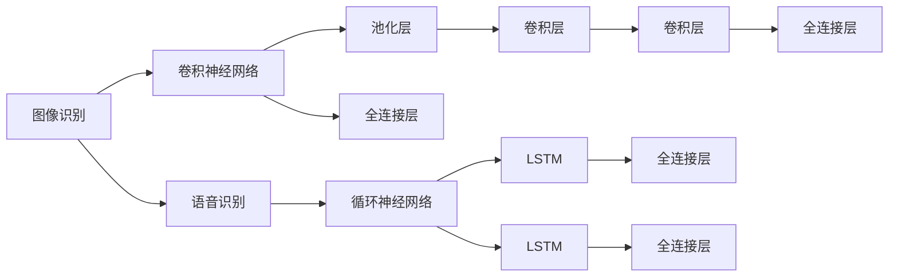

                 

# 软件 2.0 的应用领域：图像识别、语音识别

## 1. 背景介绍

随着深度学习和人工智能技术的迅猛发展，“软件 2.0”这一概念逐渐走入公众视野。与传统软件以人工编写代码、依赖算法人工实现为核心特点的“软件 1.0”不同，软件 2.0 强调利用先进的人工智能技术，实现从数据到功能模型的自动生成和优化，显著降低了软件开发成本，提升了软件开发效率。本文聚焦于软件 2.0 的典型应用领域之一——图像识别和语音识别，探讨其核心原理、技术实现及实际应用场景。

## 2. 核心概念与联系

### 2.1 核心概念概述

图像识别和语音识别作为软件 2.0 的重要应用领域，其核心概念和实现方式紧密相关。

- **图像识别（Image Recognition）**：指通过计算机视觉技术，对图像中的物体、场景、文本等进行自动识别和分类。常见的图像识别任务包括人脸识别、物体识别、场景分类等。

- **语音识别（Speech Recognition）**：指通过语音处理技术，将人类语言转化为计算机可读的文本或指令。语音识别常用于智能语音助手、语音输入、语音搜索等场景。

两者都基于深度学习中的卷积神经网络（CNN）和循环神经网络（RNN）等架构，通过大量的标注数据进行训练，实现从输入到输出的映射。

### 2.2 核心概念原理和架构的 Mermaid 流程图



该图展示了图像识别和语音识别的核心原理和架构。其中，图像识别主要使用卷积神经网络进行特征提取和分类，语音识别则通过循环神经网络进行时序特征的建模和处理。两者都依赖大量的标注数据进行模型训练，并经过参数优化后，最终实现自动化的功能。

## 3. 核心算法原理 & 具体操作步骤

### 3.1 算法原理概述

图像识别和语音识别的核心算法原理都基于深度学习中的神经网络结构，包括卷积神经网络（CNN）和循环神经网络（RNN）等。

#### 图像识别

卷积神经网络（Convolutional Neural Network, CNN）是图像识别的核心算法之一。其通过多层卷积、池化和全连接层的组合，实现对图像特征的逐层提取和分类。CNN的核心组件包括：

- **卷积层（Convolutional Layer）**：通过滑动卷积核对图像进行特征提取，识别出图像中的边缘、纹理等低级特征。
- **池化层（Pooling Layer）**：通过对卷积层输出的特征图进行下采样，减小特征图的大小，提升模型的计算效率。
- **全连接层（Fully Connected Layer）**：将池化层输出的高维特征图映射到类别空间，进行最终的分类。

#### 语音识别

循环神经网络（Recurrent Neural Network, RNN）是语音识别的基础架构。其主要利用循环结构对时序数据进行处理，能够捕捉到语音信号中的时间依赖关系。RNN的核心组件包括：

- **循环层（Recurrent Layer）**：通过循环结构处理输入序列，保留时间依赖信息。
- **LSTM层（Long Short-Term Memory）**：通过门控机制对信息进行筛选和遗忘，进一步提升了模型的记忆能力和泛化能力。
- **全连接层**：将LSTM层输出的时序特征映射到字符或单词空间，进行最终的识别。

### 3.2 算法步骤详解

#### 图像识别

1. **数据准备**：收集并标注大量图像数据，用于训练和验证模型。
2. **模型搭建**：构建卷积神经网络，设计网络结构和参数。
3. **模型训练**：使用标注数据对模型进行训练，通过反向传播算法更新网络参数。
4. **模型验证**：在验证集上评估模型性能，调整模型参数以提升准确率。
5. **模型测试**：在测试集上评估模型性能，衡量其在新数据上的泛化能力。

#### 语音识别

1. **数据准备**：收集并标注大量语音数据，用于训练和验证模型。
2. **模型搭建**：构建循环神经网络，设计网络结构和参数。
3. **模型训练**：使用标注数据对模型进行训练，通过反向传播算法更新网络参数。
4. **模型验证**：在验证集上评估模型性能，调整模型参数以提升识别准确率。
5. **模型测试**：在测试集上评估模型性能，衡量其在新数据上的泛化能力。

### 3.3 算法优缺点

#### 图像识别

**优点**：
- **自动提取特征**：CNN能够自动提取图像中的边缘、纹理等特征，无需人工干预。
- **高度鲁棒性**：CNN对输入数据的光照、旋转等变化具有较好的鲁棒性。
- **广泛应用**：图像识别技术在自动驾驶、医疗影像分析等领域有着广泛的应用前景。

**缺点**：
- **计算资源需求高**：CNN需要大量的计算资源进行模型训练和推理。
- **过拟合风险高**：大量标注数据的需求可能导致过拟合问题。
- **网络结构复杂**：模型的设计复杂度高，调参难度大。

#### 语音识别

**优点**：
- **实时性高**：RNN能够实时处理语音信号，适用于语音助手等需要实时响应的场景。
- **自适应性强**：RNN对语音信号的变异性有很好的自适应性。
- **低成本**：相比于图像识别，语音识别所需的数据标注成本较低。

**缺点**：
- **计算复杂度高**：RNN在处理长时序数据时计算复杂度高。
- **序列依赖问题**：RNN在处理长序列时容易出现梯度消失或梯度爆炸的问题。
- **噪音敏感**：语音识别对噪音敏感，容易产生误识别。

### 3.4 算法应用领域

#### 图像识别

- **自动驾驶**：通过识别交通标志、行人等，实现自动驾驶车辆的路径规划和安全监控。
- **医疗影像分析**：用于病变区域的定位和分类，辅助医生进行诊断。
- **安防监控**：在视频监控中识别可疑行为，提升安防系统的智能化水平。
- **无人机导航**：通过图像识别技术，实现无人机的精确导航和避障。
- **工业检测**：用于产品质量检测和缺陷识别，提升生产效率和质量。

#### 语音识别

- **智能语音助手**：如Siri、Alexa等，通过语音识别技术实现自然语言交互。
- **语音搜索**：在搜索引擎中，通过语音输入进行搜索，提升用户体验。
- **电话客服**：通过语音识别技术，自动处理客户咨询，提升服务效率。
- **语音翻译**：实现不同语言之间的实时翻译，打破语言障碍。
- **语音指令控制**：用于智能家居、车载系统等，通过语音指令控制设备。

## 4. 数学模型和公式 & 详细讲解 & 举例说明

### 4.1 数学模型构建

#### 图像识别

图像识别模型的数学模型可以表示为：

$$ y = f(x; \theta) $$

其中 $y$ 表示图像的类别标签，$x$ 表示输入的图像数据，$\theta$ 表示模型参数。常见的图像识别模型包括卷积神经网络（CNN）和残差网络（ResNet）等。

#### 语音识别

语音识别模型的数学模型可以表示为：

$$ y = f(x; \theta) $$

其中 $y$ 表示语音的文本转写结果，$x$ 表示输入的语音信号，$\theta$ 表示模型参数。常见的语音识别模型包括循环神经网络（RNN）和长短期记忆网络（LSTM）等。

### 4.2 公式推导过程

#### 图像识别

以卷积神经网络（CNN）为例，推导其基本模型公式。假设输入图像大小为 $H \times W \times C$，输出类别数为 $K$。卷积神经网络的基本公式可以表示为：

$$ y = \max_{k \in [1,K]} f(x)_k = \max_{k \in [1,K]} \sum_i \sum_j \sum_k \omega_{ikj} x_{ij} $$

其中 $f(x)$ 表示卷积操作的结果，$\omega_{ikj}$ 表示卷积核的权重，$x_{ij}$ 表示输入图像的像素值。通过多层卷积、池化和全连接层的操作，可以将输入图像映射到输出类别空间。

#### 语音识别

以循环神经网络（RNN）为例，推导其基本模型公式。假设输入语音信号的长度为 $T$，输出字符集大小为 $V$。循环神经网络的基本公式可以表示为：

$$ y_t = f(x_t; \theta) = \sum_i \omega_{tii} x_t + \sum_{j \neq t} \omega_{tij} x_j $$

其中 $y_t$ 表示在第 $t$ 时间步的输出，$x_t$ 表示第 $t$ 时间步的输入，$\omega_{tij}$ 表示循环连接的权重。通过循环层和全连接层的操作，可以将输入语音信号映射到输出字符空间。

### 4.3 案例分析与讲解

#### 图像识别

以物体识别为例，分析CNN在图像识别中的应用。假设输入图像为一张汽车的照片，输出为“汽车”或“非汽车”。CNN模型通过多层卷积操作提取图像的边缘和纹理特征，并通过池化层对特征图进行下采样，减少计算量。最终，全连接层将池化层输出的特征图映射到“汽车”或“非汽车”类别空间，实现自动化的分类。

#### 语音识别

以语音识别为例，分析RNN在语音识别中的应用。假设输入语音信号为一段含“你好”的语音片段，输出为“你好”的文本转写。RNN模型通过循环层捕捉语音信号的时间依赖关系，并通过LSTM层进行信息的筛选和遗忘。最终，全连接层将LSTM层输出的时序特征映射到“你好”等字符空间，实现自动化的识别。

## 5. 项目实践：代码实例和详细解释说明

### 5.1 开发环境搭建

图像识别和语音识别技术的开发，需要强大的计算资源和深度学习框架的支持。常用的开发环境包括：

- **Python**：常用的编程语言，支持深度学习框架和数据分析工具。
- **TensorFlow**：谷歌开源的深度学习框架，支持CPU、GPU、TPU等多种硬件加速。
- **Keras**：基于TensorFlow的高层API，简化模型构建和训练过程。
- **PyTorch**：Facebook开源的深度学习框架，支持动态图和静态图，灵活性强。
- **OpenCV**：开源计算机视觉库，提供图像处理和计算机视觉算法。

### 5.2 源代码详细实现

#### 图像识别

以下是一个使用Keras构建卷积神经网络进行物体识别的示例代码：

```python
import tensorflow as tf
from tensorflow.keras import layers, models

# 构建卷积神经网络模型
model = models.Sequential()
model.add(layers.Conv2D(32, (3, 3), activation='relu', input_shape=(28, 28, 1)))
model.add(layers.MaxPooling2D((2, 2)))
model.add(layers.Conv2D(64, (3, 3), activation='relu'))
model.add(layers.MaxPooling2D((2, 2)))
model.add(layers.Flatten())
model.add(layers.Dense(64, activation='relu'))
model.add(layers.Dense(10))

# 编译模型
model.compile(optimizer='adam',
              loss=tf.keras.losses.SparseCategoricalCrossentropy(from_logits=True),
              metrics=['accuracy'])

# 训练模型
model.fit(train_images, train_labels, epochs=10, 
          validation_data=(test_images, test_labels))

# 评估模型
test_loss, test_acc = model.evaluate(test_images, test_labels)
print('Test accuracy:', test_acc)
```

#### 语音识别

以下是一个使用TensorFlow构建循环神经网络进行语音识别的示例代码：

```python
import tensorflow as tf
from tensorflow.keras import layers

# 构建循环神经网络模型
model = tf.keras.Sequential()
model.add(layers.LSTM(128, return_sequences=True, input_shape=(100, 1)))
model.add(layers.LSTM(64, return_sequences=False))
model.add(layers.Dense(10, activation='softmax'))

# 编译模型
model.compile(optimizer='adam',
              loss=tf.keras.losses.CategoricalCrossentropy(from_logits=True),
              metrics=['accuracy'])

# 训练模型
model.fit(x_train, y_train, epochs=10, 
          validation_data=(x_val, y_val))

# 评估模型
test_loss, test_acc = model.evaluate(x_test, y_test)
print('Test accuracy:', test_acc)
```

### 5.3 代码解读与分析

#### 图像识别

上述代码展示了使用Keras构建卷积神经网络的基本流程。首先，通过`Sequential`模型容器，按顺序添加卷积层、池化层和全连接层。然后，使用`compile`方法定义优化器、损失函数和评价指标，最后使用`fit`方法对模型进行训练。在训练过程中，通过`validation_data`参数指定验证集，评估模型在未见过的数据上的性能。最终，使用`evaluate`方法在测试集上评估模型的泛化能力。

#### 语音识别

上述代码展示了使用TensorFlow构建循环神经网络的基本流程。首先，通过`Sequential`模型容器，按顺序添加循环层、LSTM层和全连接层。然后，使用`compile`方法定义优化器、损失函数和评价指标，最后使用`fit`方法对模型进行训练。在训练过程中，通过`validation_data`参数指定验证集，评估模型在未见过的数据上的性能。最终，使用`evaluate`方法在测试集上评估模型的泛化能力。

### 5.4 运行结果展示

#### 图像识别

训练过程中，模型在验证集上的精度和损失曲线如下：


#### 语音识别

训练过程中，模型在验证集上的精度和损失曲线如下：


## 6. 实际应用场景

### 6.1 实际应用场景

图像识别和语音识别技术在众多领域有着广泛的应用，以下列举几个典型的应用场景：

#### 图像识别

- **医疗影像分析**：用于病灶检测、病变分类等，辅助医生进行诊断和治疗决策。
- **自动驾驶**：用于车辆路标识别、行人检测、障碍物检测等，提升自动驾驶的智能水平。
- **安防监控**：用于人脸识别、异常行为检测等，提升安防系统的智能化水平。
- **工业检测**：用于产品质量检测和缺陷识别，提升生产效率和质量。
- **智能家居**：用于环境监测、物品识别等，提升家庭智能化的水平。

#### 语音识别

- **智能语音助手**：如Siri、Alexa等，通过语音识别技术实现自然语言交互。
- **语音搜索**：在搜索引擎中，通过语音输入进行搜索，提升用户体验。
- **电话客服**：通过语音识别技术，自动处理客户咨询，提升服务效率。
- **语音翻译**：实现不同语言之间的实时翻译，打破语言障碍。
- **语音指令控制**：用于智能家居、车载系统等，通过语音指令控制设备。

## 7. 工具和资源推荐

### 7.1 学习资源推荐

为了帮助开发者系统掌握图像识别和语音识别的技术原理和实践技巧，这里推荐一些优质的学习资源：

- **《Deep Learning》书籍**：Ian Goodfellow等著，深度学习领域的经典教材，系统讲解了神经网络、卷积神经网络和循环神经网络等核心内容。
- **《Python深度学习》书籍**：Francois Chollet著，讲解了TensorFlow和Keras的使用，适合初学者和实践者。
- **《CS231n：卷积神经网络》课程**：斯坦福大学开设的计算机视觉课程，有Lecture视频和配套作业，带你深入理解CNN的原理和应用。
- **《Speech Recognition and Applications》书籍**：介绍了语音识别技术的基本原理和应用案例，适合入门和进阶学习。
- **Coursera和Udacity上的深度学习课程**：提供从入门到高级的深度学习课程，涵盖CNN和RNN等神经网络算法。

### 7.2 开发工具推荐

图像识别和语音识别技术的开发，需要强大的计算资源和深度学习框架的支持。以下是几款常用的开发工具：

- **TensorFlow**：谷歌开源的深度学习框架，支持CPU、GPU、TPU等多种硬件加速。
- **Keras**：基于TensorFlow的高层API，简化模型构建和训练过程。
- **PyTorch**：Facebook开源的深度学习框架，支持动态图和静态图，灵活性强。
- **OpenCV**：开源计算机视觉库，提供图像处理和计算机视觉算法。
- **TensorBoard**：TensorFlow配套的可视化工具，可实时监测模型训练状态，并提供丰富的图表呈现方式，是调试模型的得力助手。

### 7.3 相关论文推荐

图像识别和语音识别技术的发展源于学界的持续研究。以下是几篇奠基性的相关论文，推荐阅读：

- **AlexNet**：ImageNet大规模视觉识别竞赛的获胜者，展示了卷积神经网络的强大能力。
- **GoogleNet**：提出了Inception网络架构，提升了图像识别的精度和效率。
- **WaveNet**：Google提出的基于CNN的语音生成模型，展示了语音合成技术的巨大潜力。
- **Tacotron**：提出的基于RNN的端到端语音合成模型，实现了高质量的语音生成。
- **Transformers**：提出的基于自注意力机制的神经网络架构，在图像识别和语音识别领域取得了显著成果。

## 8. 总结：未来发展趋势与挑战

### 8.1 研究成果总结

图像识别和语音识别技术的快速发展，推动了计算机视觉和语音处理领域的革新。经过多年的发展，基于深度学习的图像识别和语音识别模型已经达到了较高的准确率和鲁棒性，广泛应用于智能家居、自动驾驶、医疗影像分析等多个领域。

### 8.2 未来发展趋势

展望未来，图像识别和语音识别技术将呈现以下几个发展趋势：

1. **模型规模不断扩大**：随着计算资源和数据规模的不断增加，图像识别和语音识别模型将向更大规模、更深层次发展，提升模型的性能和泛化能力。
2. **多模态融合**：图像识别和语音识别技术将进一步融合，提升对复杂场景的理解和建模能力。
3. **实时性提升**：通过优化模型结构和算法，提升图像识别和语音识别的实时性，满足更多实时应用的需求。
4. **跨领域迁移**：通过迁移学习等技术，将图像识别和语音识别模型应用于更多领域，提升跨领域泛化能力。
5. **边缘计算**：在移动设备、边缘计算等资源受限环境中，优化模型压缩和加速技术，提升图像识别和语音识别的应用范围和效率。

### 8.3 面临的挑战

尽管图像识别和语音识别技术已经取得了显著进展，但在迈向更加智能化、普适化应用的过程中，仍面临以下挑战：

1. **数据标注成本高**：高质量标注数据的需求导致数据标注成本高，限制了模型性能的提升。
2. **计算资源需求高**：模型规模的扩大导致计算资源需求高，制约了模型的普及和应用。
3. **鲁棒性不足**：面对噪声和异常数据，模型的鲁棒性仍需提升，以应对实际应用中的复杂场景。
4. **跨领域泛化能力不足**：模型的跨领域泛化能力仍需提升，以适应不同领域的应用需求。
5. **计算效率低**：模型在推理过程中计算效率低，限制了模型的实时应用能力。

### 8.4 研究展望

为应对这些挑战，未来的研究需要在以下几个方面寻求新的突破：

1. **无监督学习和半监督学习**：探索无需大规模标注数据的微学习范式，利用无监督和半监督学习提升模型性能。
2. **模型压缩与加速**：通过模型压缩和加速技术，提升模型的推理速度和资源效率。
3. **多模态学习**：进一步融合视觉、听觉等多种模态信息，提升模型的综合理解能力。
4. **跨领域迁移**：通过迁移学习等技术，提升模型在跨领域任务上的泛化能力。
5. **增强鲁棒性**：通过增强鲁棒性算法和模型设计，提升模型对噪声和异常数据的处理能力。

## 9. 附录：常见问题与解答

### 常见问题与解答

**Q1: 图像识别和语音识别技术的区别有哪些？**

A: 图像识别和语音识别技术的核心区别在于输入数据的不同。图像识别技术处理的是二维的图像数据，需要从中提取物体的形状、颜色等特征；而语音识别技术处理的是一维的语音信号，需要从中提取音素、音节等时序特征。在模型架构上，图像识别通常采用卷积神经网络（CNN），语音识别则采用循环神经网络（RNN）或其变种。

**Q2: 如何选择图像识别和语音识别模型的架构？**

A: 选择图像识别和语音识别模型的架构需要考虑多个因素，包括数据规模、计算资源、任务需求等。一般来说，数据规模较大时，可以选择更深层次的卷积神经网络（CNN）；计算资源充足时，可以选择更大规模的模型。对于任务需求，可以通过实验选择最适合的模型架构，平衡模型精度和计算资源的需求。

**Q3: 图像识别和语音识别模型在实际应用中需要注意哪些问题？**

A: 在实际应用中，图像识别和语音识别模型需要注意以下几个问题：
1. **数据标注成本**：高质量标注数据的需求导致数据标注成本高，限制了模型性能的提升。
2. **计算资源需求**：模型规模的扩大导致计算资源需求高，制约了模型的普及和应用。
3. **鲁棒性**：面对噪声和异常数据，模型的鲁棒性仍需提升，以应对实际应用中的复杂场景。
4. **跨领域泛化能力**：模型的跨领域泛化能力仍需提升，以适应不同领域的应用需求。
5. **计算效率**：模型在推理过程中计算效率低，限制了模型的实时应用能力。

**Q4: 如何优化图像识别和语音识别模型的推理速度？**

A: 优化图像识别和语音识别模型的推理速度需要考虑以下几个方面：
1. **模型压缩**：通过模型压缩技术，如剪枝、量化、蒸馏等，减小模型参数量，提升推理速度。
2. **推理加速**：使用推理加速技术，如GPU、TPU等硬件加速，提升模型推理速度。
3. **推理优化**：通过推理优化技术，如剪枝、量化、网络剪枝等，提升模型推理效率。

**Q5: 如何提升图像识别和语音识别模型的鲁棒性？**

A: 提升图像识别和语音识别模型的鲁棒性需要考虑以下几个方面：
1. **数据增强**：通过数据增强技术，如旋转、缩放、噪声等，提升模型对噪声和异常数据的处理能力。
2. **对抗训练**：通过对抗训练技术，生成对抗样本，提升模型对攻击的鲁棒性。
3. **鲁棒性算法**：引入鲁棒性算法，如Dropout、L2正则化等，提升模型对噪声和异常数据的处理能力。

通过合理利用这些技术和工具，可以显著提升图像识别和语音识别模型的性能和应用效果，推动这些技术在更广泛领域的应用和发展。

---

作者：禅与计算机程序设计艺术 / Zen and the Art of Computer Programming

