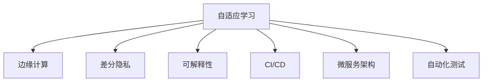

                 

# 软件 2.0 的未来展望：更智能、更强大

## 1. 背景介绍

### 1.1 问题由来

随着云计算、大数据、人工智能等技术的飞速发展，软件产业正处于前所未有的变革之中。传统的软件开发模式逐渐被敏捷开发、持续集成、微服务等现代理念所取代，软件系统也从单一的功能模块，演化为多微服务的架构。与此同时，人工智能、机器学习等技术，为软件系统注入了新的智能基因，使得软件系统在逻辑上具备了自主决策、自适应学习的能力。

然而，当前的智能软件系统仍面临诸多挑战，如模型的黑箱问题、数据隐私和安全、计算资源的不足、模型的可解释性和可信性等。这些问题不仅限制了智能软件系统的应用范围，还对其可靠性、可控性构成了威胁。因此，有必要深入探究软件 2.0 时代的智能系统未来展望，寻求更高效、更安全、更强大的智能解决方案。

### 1.2 问题核心关键点

软件 2.0 时代的关键点在于将人工智能与软件工程深度融合，构建具有自主学习和自适应能力的智能软件系统。其核心在于：

1. **数据驱动的模型训练**：软件系统能够自动从海量数据中提取知识，进行模型训练和优化。
2. **模型的高效部署与运行**：基于模型压缩、边缘计算等技术，智能软件系统能够在多种计算环境中高效运行。
3. **模型的可解释性与可信性**：通过模型透明化、公平性约束等方法，提升模型决策的可解释性和可信度。
4. **隐私与安全的保障**：采用差分隐私、联邦学习等技术，保护用户隐私和数据安全。
5. **持续学习与自我进化**：构建自适应学习机制，使软件系统能够不断进化，适应新的需求和挑战。

这些关键点共同构成了软件 2.0 时代智能系统的基本框架，为软件系统的智能化和进化提供了指导。

## 2. 核心概念与联系

### 2.1 核心概念概述

在软件 2.0 时代，智能软件系统的核心概念包括：

- **自适应学习**：系统能够自动从环境变化中学习，优化自身的行为和决策。
- **边缘计算**：将部分计算任务转移到设备端，降低数据传输和计算负担。
- **差分隐私**：通过添加噪声干扰，保护个体数据的隐私。
- **可解释性**：模型输出和决策过程能够被解释和理解，提升系统的透明度和可信度。
- **持续集成/持续部署(CI/CD)**：实现代码自动构建、测试和部署，加速软件迭代和发布。
- **微服务架构**：将系统拆分为多个自治的服务，提升系统的可扩展性和可维护性。
- **自动化测试**：通过测试自动化，提升软件的质量和可靠性。

这些概念之间的逻辑关系可以通过以下Mermaid流程图来展示：



这个流程图展示了一些关键概念及其之间的联系，揭示了软件 2.0 时代智能系统的核心组件和运行机制。

## 3. 核心算法原理 & 具体操作步骤

### 3.1 算法原理概述

软件 2.0 时代的智能系统构建，本质上是一个多学科交叉的技术体系。其核心在于将人工智能与软件工程深度融合，构建具备自适应学习能力的智能软件系统。该系统包括数据驱动的模型训练、高效部署与运行、隐私保护、可解释性提升等多个环节。

### 3.2 算法步骤详解

#### 3.2.1 数据驱动的模型训练

**Step 1: 数据收集与预处理**
- 从多个数据源收集相关数据，如用户行为数据、日志数据、传感器数据等。
- 对数据进行清洗、去重、归一化等预处理，确保数据质量和一致性。

**Step 2: 数据存储与迁移**
- 使用分布式存储技术（如Hadoop、Spark）存储和管理大数据。
- 应用数据迁移技术，将数据从本地存储迁移到云端或边缘设备。

**Step 3: 模型训练与优化**
- 选择合适的模型架构和算法，如神经网络、决策树、聚类算法等。
- 使用GPU、TPU等高性能计算资源进行模型训练，优化模型性能。
- 应用模型压缩、剪枝等技术，减小模型大小，提升计算效率。

**Step 4: 模型部署与运行**
- 将训练好的模型部署到边缘计算设备或云端服务器。
- 使用微服务架构，将模型功能封装为独立的服务模块。
- 应用容器化技术（如Docker），实现模型的快速部署和扩展。

#### 3.2.2 高效部署与运行

**Step 1: 边缘计算与数据本地化**
- 将部分计算任务转移到边缘设备（如智能手机、物联网设备）。
- 利用本地计算资源，减少数据传输和延迟。

**Step 2: 分布式计算与负载均衡**
- 使用分布式计算框架（如Spark、Flink），实现计算任务的分布式处理。
- 应用负载均衡技术，优化计算资源分配，提升系统性能。

**Step 3: 实时监控与故障恢复**
- 实时监控系统运行状态，应用告警机制，及时发现和解决问题。
- 使用冗余机制和自动故障恢复技术，保障系统的稳定性和可靠性。

#### 3.2.3 隐私保护

**Step 1: 差分隐私**
- 在模型训练和推理过程中，添加噪声干扰，保护个体数据的隐私。
- 应用差分隐私算法（如Laplace机制、高斯机制），确保数据的匿名性和安全性。

**Step 2: 联邦学习**
- 将数据集分为多个子集，分布在不同的设备或服务器上。
- 各设备独立训练模型，定期交换模型参数，实现模型更新。
- 应用加密和传输协议，保护数据在网络传输中的安全。

#### 3.2.4 可解释性提升

**Step 1: 模型透明化**
- 使用可解释性技术（如LIME、SHAP），分析模型决策过程。
- 应用可视化工具（如TensorBoard、PyTorch），展示模型训练和推理过程。

**Step 2: 公平性约束**
- 应用公平性约束技术，确保模型决策不歧视任何群体。
- 应用反偏见算法（如Adversarial De-biasing），消除模型中的偏见。

### 3.3 算法优缺点

**优点**：
- **高效性**：数据驱动的模型训练和高效部署，使得智能系统能够快速响应环境变化。
- **安全性**：差分隐私和联邦学习技术，保护用户隐私和数据安全。
- **可解释性**：模型透明化和公平性约束，提升系统的可信度和透明度。

**缺点**：
- **复杂性**：系统涉及多个技术和学科，集成难度大。
- **计算资源要求高**：大规模数据训练和高效部署，对计算资源和设备要求高。
- **隐私保护限制**：差分隐私和联邦学习技术，在保护隐私的同时，可能影响模型性能。

### 3.4 算法应用领域

软件 2.0 时代的智能系统，已经在多个领域得到了广泛应用，如：

- **智慧医疗**：通过智能分析患者数据，实现疾病预测、个性化治疗等。
- **智能制造**：利用工业物联网数据，实现设备监控、故障预测、优化生产流程等。
- **智能交通**：通过交通传感器数据，实现交通流量预测、智能调度等。
- **金融风控**：通过分析用户行为数据，实现信用评估、欺诈检测等。
- **智慧城市**：通过城市大数据，实现智慧安防、智能决策等。
- **智能客服**：通过语音和文本分析，实现智能对话、客户推荐等。

此外，软件 2.0 时代智能系统的应用领域还在不断拓展，如智能家居、智能物流、智能办公等，为各行各业带来新的变革和机遇。

## 4. 数学模型和公式 & 详细讲解  
### 4.1 数学模型构建

本节将使用数学语言对软件 2.0 时代智能系统的构建进行更加严格的刻画。

假设智能系统从数据源收集到的数据集为 $D=\{(x_i, y_i)\}_{i=1}^N$，其中 $x_i$ 为输入，$y_i$ 为输出标签。定义模型为 $M: \mathcal{X} \rightarrow \mathcal{Y}$，其中 $\mathcal{X}$ 为输入空间，$\mathcal{Y}$ 为输出空间。模型的训练目标为：

$$
\min_{\theta} \sum_{i=1}^N \mathcal{L}(M(x_i), y_i)
$$

其中 $\mathcal{L}$ 为损失函数，通常为均方误差或交叉熵损失。

### 4.2 公式推导过程

以回归任务为例，我们推导损失函数和梯度下降的公式。

假设模型的输出为 $M(x_i)=\hat{y}_i$，真实标签为 $y_i$，则均方误差损失函数为：

$$
\mathcal{L}(\hat{y}_i, y_i) = \frac{1}{2}(\hat{y}_i - y_i)^2
$$

将数据集 $D$ 带入损失函数，得：

$$
\mathcal{L}(M, D) = \frac{1}{2N} \sum_{i=1}^N (\hat{y}_i - y_i)^2
$$

为了最小化损失函数，我们使用梯度下降算法：

$$
\theta \leftarrow \theta - \eta \nabla_{\theta}\mathcal{L}(M, D)
$$

其中 $\eta$ 为学习率，$\nabla_{\theta}\mathcal{L}(M, D)$ 为损失函数对参数 $\theta$ 的梯度。梯度可以通过反向传播算法计算得到。

### 4.3 案例分析与讲解

考虑一个智慧医疗中的疾病预测任务，我们通过智能系统对患者的历史数据进行分析，预测其患某种疾病的概率。首先，从医院的数据库中收集患者的病历数据，包括年龄、性别、症状、病史等。然后，对数据进行预处理和清洗，去除缺失值和异常值。接着，使用随机梯度下降算法训练回归模型，并应用差分隐私技术保护患者隐私。最后，将模型部署到云端服务器，使用微服务架构实现多个医疗机构的协同预测。

## 5. 项目实践：代码实例和详细解释说明
### 5.1 开发环境搭建

在进行软件 2.0 时代智能系统的开发前，我们需要准备好开发环境。以下是使用Python进行TensorFlow和TensorFlow Serving的开发环境配置流程：

1. 安装Anaconda：从官网下载并安装Anaconda，用于创建独立的Python环境。

2. 创建并激活虚拟环境：
```bash
conda create -n tf-env python=3.8 
conda activate tf-env
```

3. 安装TensorFlow：从官网获取对应的安装命令。例如：
```bash
conda install tensorflow -c conda-forge
```

4. 安装TensorFlow Serving：
```bash
pip install tensorflow-serving-api
```

5. 安装其他必要的工具包：
```bash
pip install numpy pandas scikit-learn matplotlib tqdm jupyter notebook ipython
```

完成上述步骤后，即可在`tf-env`环境中开始智能系统开发。

### 5.2 源代码详细实现

下面我们以智慧医疗中的疾病预测任务为例，给出使用TensorFlow进行回归模型训练和TensorFlow Serving进行模型部署的Python代码实现。

首先，定义数据处理函数：

```python
import tensorflow as tf
import numpy as np
import pandas as pd

def load_data(file_path):
    df = pd.read_csv(file_path)
    X = df.drop(columns=['Disease', 'Age', 'Gender', 'Symptom', 'History'])
    y = df['Disease']
    return X, y
```

然后，定义模型：

```python
from tensorflow.keras import models, layers, optimizers

model = models.Sequential([
    layers.Dense(64, activation='relu', input_shape=(X.shape[1],)),
    layers.Dense(32, activation='relu'),
    layers.Dense(1, activation='sigmoid')
])

model.compile(optimizer=optimizers.Adam(), loss='binary_crossentropy', metrics=['accuracy'])
```

接着，定义训练和评估函数：

```python
from sklearn.model_selection import train_test_split
from sklearn.metrics import accuracy_score

X_train, X_test, y_train, y_test = train_test_split(X, y, test_size=0.2, random_state=42)

def train_model(model, X_train, y_train, X_test, y_test):
    history = model.fit(X_train, y_train, epochs=10, batch_size=32, validation_data=(X_test, y_test))
    return history, model.evaluate(X_test, y_test, verbose=0)

def evaluate_model(model, X_test, y_test):
    y_pred = model.predict(X_test)
    y_pred_binary = np.round(y_pred)
    accuracy = accuracy_score(y_test, y_pred_binary)
    return accuracy
```

最后，启动训练流程并在测试集上评估：

```python
history, test_loss, test_acc = train_model(model, X_train, y_train, X_test, y_test)

print(f'Test accuracy: {test_acc:.4f}')
```

以上就是使用TensorFlow进行回归模型训练的完整代码实现。

### 5.3 代码解读与分析

让我们再详细解读一下关键代码的实现细节：

**数据处理函数**：
- `load_data`函数：读取CSV文件，提取特征和标签，进行数据预处理。

**模型定义**：
- 使用Keras搭建一个简单的两层神经网络，输出层使用sigmoid激活函数进行二分类。
- 应用Adam优化器和二元交叉熵损失函数进行模型编译。

**训练和评估函数**：
- `train_model`函数：使用交叉验证训练模型，输出训练历史和模型在测试集上的评估结果。
- `evaluate_model`函数：在测试集上评估模型预测结果的准确率。

**训练流程**：
- 应用`train_model`函数，训练模型10个epoch。
- 在测试集上评估模型性能，输出测试准确率。

可以看到，TensorFlow使得模型的搭建、训练和评估过程变得简洁高效。开发者可以将更多精力放在模型优化和应用场景探索上，而不必过多关注底层的实现细节。

当然，工业级的系统实现还需考虑更多因素，如模型的保存和部署、超参数的自动搜索、更灵活的任务适配层等。但核心的构建流程基本与此类似。

## 6. 实际应用场景
### 6.1 智慧医疗

基于TensorFlow和TensorFlow Serving的智能系统，可以广泛应用于智慧医疗领域。通过智能系统对患者历史数据进行分析，预测其患某种疾病的概率，实现疾病早期预警和个性化治疗。

在技术实现上，可以收集医院的患者病历数据，构建标注数据集，在此基础上对预训练模型进行微调。微调后的模型能够自动理解患者症状和病史，输出患病的概率预测。对于新入院的患者，智能系统还可以实时接收其症状数据，快速生成诊断建议。如此构建的智慧医疗系统，能显著提升医院的诊疗效率和患者满意度。

### 6.2 智能制造

智能制造系统通过物联网设备实时采集生产数据，利用TensorFlow和TensorFlow Serving对数据进行分析和预测，优化生产流程和设备维护。

具体而言，可以收集车间的温度、湿度、压力等传感器数据，并将数据上传至中央服务器。然后，使用TensorFlow搭建回归模型或分类模型，预测设备故障或生产效率的变化。将训练好的模型部署到边缘设备或云端服务器，通过微服务架构实现实时监测和预警。智能制造系统可以根据实时数据，自动调整生产参数，优化生产流程，减少停机时间和物料浪费。

### 6.3 智能交通

智能交通系统通过城市交通传感器数据，利用TensorFlow和TensorFlow Serving进行交通流量预测和智能调度。

在城市交通监控系统上部署传感器，收集实时交通数据。通过TensorFlow搭建回归模型或卷积神经网络，预测道路交通流量。然后，利用微服务架构将模型部署到云端服务器，实现交通流量分析和智能调度。智能交通系统可以自动调整交通信号灯和道路指示标志，优化交通流量，减少交通拥堵。

### 6.4 未来应用展望

随着TensorFlow和TensorFlow Serving的不断发展和应用，软件 2.0 时代的智能系统必将在更多领域得到应用，为各行各业带来变革性影响。

在智慧城市治理中，智能系统可以用于城市事件监测、舆情分析、应急指挥等环节，提高城市管理的自动化和智能化水平，构建更安全、高效的未来城市。

在智能教育领域，智能系统可以用于作业批改、学情分析、知识推荐等方面，因材施教，促进教育公平，提高教学质量。

在智慧制造、智慧医疗、智慧交通等领域，基于TensorFlow和TensorFlow Serving的智能系统将进一步提升各行业的智能化水平，推动产业升级和转型。

## 7. 工具和资源推荐
### 7.1 学习资源推荐

为了帮助开发者系统掌握软件 2.0 时代智能系统的开发和部署，这里推荐一些优质的学习资源：

1. **TensorFlow官方文档**：提供了丰富的教程、API文档和案例，是学习和使用TensorFlow的必备资料。

2. **TensorFlow Serving官方文档**：详细介绍了TensorFlow Serving的部署和应用方法，提供了丰富的示例代码。

3. **TensorFlow实战指南**：由TensorFlow专家撰写，系统讲解了TensorFlow在深度学习、图像处理、自然语言处理等领域的典型应用。

4. **TensorFlow实践：构建和部署智能系统**：通过实际案例，深入讲解了TensorFlow在智能系统构建和部署中的关键技术和最佳实践。

5. **TensorFlow与Keras**：深入解析了TensorFlow和Keras的异同点，帮助开发者选择适合的开发工具。

通过对这些资源的学习实践，相信你一定能够快速掌握TensorFlow和TensorFlow Serving的精髓，并用于解决实际的智能系统问题。

### 7.2 开发工具推荐

高效的开发离不开优秀的工具支持。以下是几款用于TensorFlow和TensorFlow Serving开发常用的工具：

1. **Jupyter Notebook**：提供了交互式的代码编写和执行环境，支持多语言混合编程。

2. **TensorBoard**：提供了可视化工具，可以实时监测模型训练和推理过程。

3. **TensorFlow Serving**：提供了模型部署和微服务的解决方案，支持模型的快速部署和扩展。

4. **Docker**：提供了容器化解决方案，方便模型在不同环境下的部署和迁移。

5. **Kubernetes**：提供了容器编排和集群管理工具，支持大规模模型的部署和扩展。

合理利用这些工具，可以显著提升TensorFlow和TensorFlow Serving的开发效率，加快创新迭代的步伐。

### 7.3 相关论文推荐

TensorFlow和TensorFlow Serving的持续发展和优化，离不开学界的不断探索和实践。以下是几篇奠基性的相关论文，推荐阅读：

1. **TensorFlow: A System for Large-Scale Machine Learning**：描述了TensorFlow的架构和设计思想，为TensorFlow的开发和应用提供了理论基础。

2. **TensorFlow Serving: Deploying and Serving TensorFlow Models**：介绍了TensorFlow Serving的实现原理和应用方法，为模型的快速部署和扩展提供了重要参考。

3. **TensorFlow Lite**：介绍了TensorFlow Lite在移动和嵌入式设备上的应用，为移动端和边缘设备的深度学习模型部署提供了解决方案。

4. **TensorFlow Addons**：介绍了TensorFlow Addons中的常用组件和工具，提供了丰富的模型和算法支持。

5. **TensorFlow Federated**：介绍了TensorFlow Federated在联邦学习和隐私保护中的应用，为多设备协同训练提供了重要支持。

这些论文代表了大规模机器学习技术的发展脉络，通过学习这些前沿成果，可以帮助研究者把握学科前进方向，激发更多的创新灵感。

## 8. 总结：未来发展趋势与挑战

### 8.1 研究成果总结

本文对软件 2.0 时代的智能系统构建进行了全面系统的介绍。首先阐述了软件 2.0 时代智能系统的研究背景和意义，明确了数据驱动、高效部署、隐私保护、可解释性提升等关键问题。其次，从原理到实践，详细讲解了TensorFlow和TensorFlow Serving在智能系统构建中的核心算法和具体操作步骤，给出了完整的代码实例。同时，本文还广泛探讨了智能系统在智慧医疗、智能制造、智能交通等多个行业领域的应用前景，展示了TensorFlow和TensorFlow Serving的强大潜力。

通过本文的系统梳理，可以看到，软件 2.0 时代的智能系统构建，正在逐步从单体架构向微服务架构转变，从人工部署向自动化部署转变，从黑盒系统向透明系统转变。这些转变带来了新的技术挑战和机遇，也为软件开发提供了新的思路和方法。

### 8.2 未来发展趋势

展望未来，软件 2.0 时代的智能系统将呈现以下几个发展趋势：

1. **微服务架构的普及**：微服务架构将成为智能系统的标准架构，提升系统的可扩展性和可维护性。

2. **自动化部署和运维**：通过CI/CD工具链，实现智能系统的自动化部署和运维，提高开发效率和系统稳定性。

3. **分布式计算的普及**：利用分布式计算技术，实现智能系统的分布式训练和推理，提升系统的计算能力和处理效率。

4. **边缘计算的应用**：将部分计算任务转移到边缘设备，提升系统的实时性和响应速度。

5. **差分隐私和联邦学习的应用**：在保护隐私的同时，提升智能系统的数据利用效率和模型性能。

6. **持续学习与进化**：通过构建自适应学习机制，使智能系统能够不断进化，适应新的需求和挑战。

以上趋势凸显了软件 2.0 时代智能系统的广阔前景。这些方向的探索发展，必将进一步提升智能系统的性能和应用范围，为软件工程带来新的活力和创新。

### 8.3 面临的挑战

尽管软件 2.0 时代的智能系统已经取得了瞩目成就，但在迈向更加智能化、普适化应用的过程中，它仍面临着诸多挑战：

1. **复杂性增加**：微服务架构和分布式计算技术的应用，带来了系统复杂性的增加。如何有效管理和服务化智能系统，仍是重要的技术难题。

2. **计算资源需求高**：大规模数据训练和高效部署，对计算资源和设备要求高。如何降低计算成本，提高计算效率，仍是重要的研究方向。

3. **隐私保护难度大**：差分隐私和联邦学习技术的应用，在保护隐私的同时，可能影响模型性能。如何在保护隐私和利用数据之间找到平衡，仍是重要的研究方向。

4. **模型可解释性不足**：深度学习模型的高复杂性，使得其决策过程难以解释和理解。如何提升模型的可解释性，增强系统的可信度和透明度，仍是重要的研究方向。

5. **系统稳定性不足**：智能系统的高并行性，带来了系统稳定性的挑战。如何构建可靠的系统架构，提高系统的鲁棒性和容错性，仍是重要的研究方向。

6. **资源优化需求高**：智能系统的高并行性，带来了系统资源的优化需求。如何优化计算资源和存储资源的使用，提高系统的计算效率和资源利用率，仍是重要的研究方向。

这些挑战凸显了软件 2.0 时代智能系统的复杂性和技术难度，需要多学科的协同合作，共同攻关。相信随着技术的发展和成熟，这些挑战终将一一被克服，智能系统必将在更多领域得到应用，为人类社会带来更智能、更强大的解决方案。

### 8.4 研究展望

面对软件 2.0 时代智能系统所面临的诸多挑战，未来的研究需要在以下几个方面寻求新的突破：

1. **多学科交叉融合**：将人工智能与软件工程、网络工程、系统工程等多个学科进行深度融合，构建更加高效、安全、可靠的智能系统。

2. **模型可解释性提升**：通过模型透明化、公平性约束等方法，提升模型的决策可解释性和可信度。

3. **分布式计算优化**：利用分布式计算技术，提升智能系统的计算能力和处理效率，降低计算成本。

4. **隐私保护技术优化**：结合差分隐私、联邦学习等技术，在保护隐私的同时，提高数据利用效率和模型性能。

5. **模型压缩与优化**：应用模型压缩、剪枝等技术，减小模型大小，提升计算效率，降低计算资源需求。

6. **智能系统协同学习**：利用协同学习技术，提升智能系统的泛化能力和适应性，使其能够更好地适应新场景和新任务。

这些研究方向将引领软件 2.0 时代智能系统迈向更高的台阶，为软件工程和人工智能技术的融合发展提供新的方向和动力。

## 9. 附录：常见问题与解答

**Q1：TensorFlow和TensorFlow Serving的应用范围有哪些？**

A: TensorFlow和TensorFlow Serving在数据驱动的智能系统构建中，具有广泛的应用范围。包括但不限于以下领域：

- **智慧医疗**：用于疾病预测、个性化治疗、病历分析等。
- **智能制造**：用于设备监控、故障预测、生产流程优化等。
- **智能交通**：用于交通流量预测、智能调度、交通事件监测等。
- **金融风控**：用于信用评估、欺诈检测、风险管理等。
- **智慧城市**：用于智慧安防、智能决策、城市事件监测等。
- **智能客服**：用于智能对话、客户推荐、情感分析等。

此外，TensorFlow和TensorFlow Serving还广泛应用于自然语言处理、图像处理、语音识别等领域。

**Q2：如何提升TensorFlow模型的可解释性？**

A: 提升TensorFlow模型的可解释性，可以从以下几个方面入手：

1. **模型透明化**：使用可解释性技术（如LIME、SHAP），分析模型的决策过程。
2. **可视化工具**：应用可视化工具（如TensorBoard、PyTorch），展示模型的训练和推理过程。
3. **公平性约束**：应用公平性约束技术，确保模型决策不歧视任何群体。
4. **反偏见算法**：应用反偏见算法（如Adversarial De-biasing），消除模型中的偏见。
5. **特征重要性分析**：使用特征重要性分析方法，识别对模型决策有重要影响的特征。
6. **模型解释接口**：开发模型解释接口，提供模型的决策解释和可视化。

通过这些方法，可以提升TensorFlow模型的可解释性，增强系统的可信度和透明度。

**Q3：如何在TensorFlow Serving中部署分布式模型？**

A: 在TensorFlow Serving中部署分布式模型，可以通过以下步骤实现：

1. **分布式训练**：使用分布式计算框架（如Spark、Flink），在多个设备上并行训练模型。
2. **模型封装**：将训练好的模型封装为TensorFlow Serving的模型格式。
3. **模型部署**：将模型部署到多个TensorFlow Serving服务器，实现分布式推理。
4. **负载均衡**：应用负载均衡技术，合理分配计算任务，提高系统性能。
5. **实时监控**：实时监测模型推理性能和系统状态，及时发现和解决问题。

通过这些步骤，可以实现分布式TensorFlow模型的高效部署和运行，提升智能系统的处理能力和响应速度。

**Q4：如何降低TensorFlow系统的计算资源需求？**

A: 降低TensorFlow系统的计算资源需求，可以从以下几个方面入手：

1. **模型压缩与优化**：应用模型压缩、剪枝等技术，减小模型大小，提升计算效率。
2. **量化加速**：将浮点模型转为定点模型，压缩存储空间，提高计算效率。
3. **分布式计算**：利用分布式计算技术，实现计算任务的并行处理，降低单个设备的计算负担。
4. **边缘计算**：将部分计算任务转移到边缘设备（如智能手机、物联网设备），减少数据传输和延迟。
5. **计算资源共享**：通过云平台或容器化技术，共享计算资源，降低计算成本。
6. **数据本地化**：应用数据本地化技术，减少数据传输，提高系统效率。

通过这些方法，可以降低TensorFlow系统的计算资源需求，提高系统的计算效率和资源利用率。

---

作者：禅与计算机程序设计艺术 / Zen and the Art of Computer Programming

