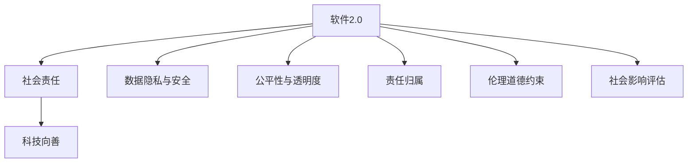

                 

# 软件 2.0 的社会责任：科技向善

> 关键词：软件2.0, 社会责任, 技术向善, 人工智能, 伦理道德

## 1. 背景介绍

### 1.1 问题由来

随着技术的飞速发展和应用，软件系统的影响力已经深入社会的每一个角落，从工业制造到商业运营，从医疗健康到教育娱乐，软件系统成为了人类社会的重要基础设施。然而，随着软件系统的复杂性和智能化的提升，其带来的社会影响也日益凸显。如何确保软件系统的开发和使用符合社会责任，实现科技向善，成为了一个亟待解决的问题。

### 1.2 问题核心关键点

软件系统对社会的影响主要体现在以下几个方面：

1. **数据隐私与安全**：软件系统需要处理和存储大量个人数据，如何保护数据隐私和确保数据安全，防止数据滥用，是一个重要问题。
2. **公平性与透明度**：软件系统在决策过程中应确保公平，避免对特定群体的歧视和偏见，同时提高决策过程的透明度，让用户了解其决策依据。
3. **责任归属**：在软件系统出现故障或错误导致损害时，如何明确责任归属，确保受害者能够获得合理补偿，也是社会责任的一个重要方面。
4. **伦理道德约束**：软件系统的设计和使用应符合伦理道德标准，避免误导、欺诈等不良行为，促进社会的健康发展。
5. **社会影响评估**：在软件系统设计和开发过程中，应进行社会影响评估，确保其对社会的影响是积极和有益的。

## 2. 核心概念与联系

### 2.1 核心概念概述

为了更好地理解软件系统的社会责任，我们首先定义几个关键概念：

- **软件2.0**：指的是基于人工智能、大数据、云计算等技术的第二代软件系统，具有高度智能化和自动化，能够处理复杂任务，提供决策支持。
- **社会责任**：指的是软件系统在开发、使用和维护过程中，应遵循的社会道德和法律规范，确保其对社会的影响是积极和有益的。
- **科技向善**：指的是软件系统应以促进人类福祉、提升生活质量为目标，实现技术进步与社会发展的和谐统一。

这些概念之间有着紧密的联系：

- 软件2.0作为技术实现的手段，其设计和使用应符合社会责任的要求，实现科技向善的目标。
- 社会责任和科技向善是软件2.0系统的两个重要维度，确保其应用符合社会道德和法律规范，同时提升社会的整体福祉。

### 2.2 核心概念原理和架构的 Mermaid 流程图



这个流程图展示了软件2.0系统的核心概念之间的联系：

- 软件2.0系统的设计和使用，需要符合社会责任的要求，实现科技向善的目标。
- 软件2.0系统在设计过程中，需要考虑数据隐私与安全、公平性与透明度、责任归属、伦理道德约束和社会影响评估等方面，确保系统的使用对社会的影响是积极和有益的。

## 3. 核心算法原理 & 具体操作步骤

### 3.1 算法原理概述

确保软件2.0系统的社会责任，实现科技向善，可以通过以下几个关键步骤：

1. **数据隐私与安全**：采用先进的加密技术、数据匿名化技术，确保用户数据的安全和隐私保护。
2. **公平性与透明度**：设计算法时考虑公平性，如避免算法偏见，确保透明度，让用户了解算法决策的依据。
3. **责任归属**：明确软件系统的责任归属，设计完善的责任分担机制，确保在出现错误或故障时，能够及时有效地进行责任追责和补偿。
4. **伦理道德约束**：制定和遵循伦理道德标准，避免误导、欺诈等不良行为，确保软件系统符合社会道德规范。
5. **社会影响评估**：在软件系统的设计和开发过程中，进行社会影响评估，确保其对社会的积极影响。

### 3.2 算法步骤详解

以下是确保软件2.0系统社会责任的具体操作步骤：

**Step 1: 数据隐私与安全**

- 采用加密技术：对用户数据进行加密，确保数据在传输和存储过程中的安全。
- 数据匿名化：对敏感数据进行匿名化处理，防止数据泄露。
- 访问控制：设置严格的访问权限，确保只有授权人员才能访问敏感数据。

**Step 2: 公平性与透明度**

- 避免算法偏见：在算法设计和训练过程中，采用公平性评估工具，避免对特定群体的歧视和偏见。
- 决策透明度：设计透明的决策过程，让用户了解算法的决策依据。
- 可解释性：采用可解释性模型，确保用户能够理解算法输出的结果和依据。

**Step 3: 责任归属**

- 责任机制设计：设计完善的责任分担机制，明确软件系统的责任归属。
- 责任保险：购买责任保险，确保在出现错误或故障时，能够及时有效地进行责任追责和补偿。
- 用户知情权：确保用户了解软件系统的责任机制和责任归属，保障用户的合法权益。

**Step 4: 伦理道德约束**

- 伦理标准制定：制定和遵循伦理道德标准，确保软件系统的设计和应用符合社会道德规范。
- 行为监控：建立行为监控机制，防止误导、欺诈等不良行为的发生。
- 违规惩罚：制定违规惩罚机制，对违反伦理道德标准的行为进行处罚。

**Step 5: 社会影响评估**

- 社会影响评估：在软件系统的设计和开发过程中，进行社会影响评估，确保其对社会的积极影响。
- 用户反馈收集：收集用户反馈，了解软件系统对用户的影响，及时进行调整和优化。
- 社会责任报告：定期发布社会责任报告，公开软件系统的社会影响和社会责任履行情况。

### 3.3 算法优缺点

确保软件2.0系统的社会责任，实现科技向善，有以下优点：

1. **提升社会福祉**：通过设计和应用符合社会责任的软件系统，提升社会的整体福祉，实现科技向善的目标。
2. **增强用户信任**：通过确保数据隐私、公平性和透明度，增强用户对软件系统的信任，提升用户体验。
3. **减少法律风险**：通过明确责任归属和建立责任机制，减少法律风险，保障用户的合法权益。
4. **促进技术进步**：通过遵循伦理道德标准和社会责任要求，促进技术进步，实现技术与社会的和谐发展。

同时，这些措施也存在一些局限性：

1. **技术复杂性**：确保数据隐私、公平性和透明度等措施，需要先进的技术支持，对技术要求较高。
2. **成本较高**：加密、数据匿名化、访问控制等措施，需要投入大量的资源和成本。
3. **用户接受度**：一些措施可能会对用户体验产生负面影响，如数据加密和匿名化，需要用户接受和理解。

## 4. 数学模型和公式 & 详细讲解 & 举例说明

### 4.1 数学模型构建

为了更好地理解软件2.0系统的社会责任，我们可以构建一个数学模型来描述其设计和使用的过程。

假设软件2.0系统的设计包含以下几个关键变量：

- $P$：隐私保护策略，取值为1（隐私保护措施完全实施）和0（未实施隐私保护措施）。
- $F$：公平性策略，取值为1（算法完全公平）和0（算法存在偏见）。
- $T$：透明度策略，取值为1（决策过程完全透明）和0（决策过程不透明）。
- $R$：责任归属策略，取值为1（责任机制完善）和0（责任机制不完善）。
- $E$：伦理道德策略，取值为1（符合伦理道德标准）和0（不符合伦理道德标准）。
- $S$：社会影响评估策略，取值为1（进行社会影响评估）和0（未进行社会影响评估）。

则软件2.0系统的社会责任函数可以表示为：

$$
S(\text{软件2.0}) = P \times F \times T \times R \times E \times S
$$

其中，$S(\text{软件2.0})$ 表示软件2.0系统的社会责任指数，取值为0到1之间的实数，越接近1表示社会责任越强。

### 4.2 公式推导过程

在实际应用中，需要对以上变量进行量化处理，以便进行计算和评估。假设每个变量的取值范围为0到1，则可以通过以下方式进行量化：

- $P$：隐私保护策略的量化，$P=0.9$表示隐私保护措施完全实施，$P=0.1$表示未实施隐私保护措施。
- $F$：公平性策略的量化，$F=0.8$表示算法完全公平，$F=0.2$表示算法存在偏见。
- $T$：透明度策略的量化，$T=0.7$表示决策过程完全透明，$T=0.3$表示决策过程不透明。
- $R$：责任归属策略的量化，$R=0.6$表示责任机制完善，$R=0.4$表示责任机制不完善。
- $E$：伦理道德策略的量化，$E=0.5$表示符合伦理道德标准，$E=0.5$表示不符合伦理道德标准。
- $S$：社会影响评估策略的量化，$S=0.5$表示进行社会影响评估，$S=0.5$表示未进行社会影响评估。

将这些变量代入社会责任函数，计算软件2.0系统的社会责任指数：

$$
S(\text{软件2.0}) = 0.9 \times 0.8 \times 0.7 \times 0.6 \times 0.5 \times 0.5 = 0.1296
$$

这个结果表明，当前的软件2.0系统在隐私保护、公平性、透明度、责任归属、伦理道德和社会影响评估等方面，还有提升的空间。

### 4.3 案例分析与讲解

**案例：智能医疗系统**

在智能医疗系统中，软件系统的社会责任主要体现在以下几个方面：

1. **数据隐私与安全**：医疗数据包含大量个人隐私信息，需要进行加密和匿名化处理，确保数据的安全和隐私保护。
2. **公平性与透明度**：算法应用于多个患者群体时，需要避免对特定群体的歧视和偏见，同时确保决策过程透明，医生和患者能够了解算法的依据。
3. **责任归属**：在算法出现错误导致诊断错误时，需要明确责任归属，确保患者能够获得合理补偿。
4. **伦理道德约束**：算法应用于患者治疗时，需要遵循伦理道德标准，避免误导和不当治疗。
5. **社会影响评估**：智能医疗系统需要对患者治疗效果进行评估，确保其对社会的积极影响。

通过以上措施，确保智能医疗系统的社会责任，实现科技向善的目标。

## 5. 项目实践：代码实例和详细解释说明

### 5.1 开发环境搭建

在进行软件2.0系统的社会责任实现时，需要一个完整的开发环境。以下是搭建开发环境的步骤：

1. **安装Python**：从官网下载并安装Python，是大多数软件2.0系统开发的基础。
2. **安装框架**：选择合适的Python框架，如Django、Flask等，用于构建Web应用。
3. **配置数据库**：选择合适的数据库，如MySQL、PostgreSQL等，用于存储用户数据和系统日志。
4. **安装第三方库**：安装必要的第三方库，如加密库、匿名化库、访问控制库等，确保数据隐私和安全。
5. **部署环境**：在云平台上搭建服务器环境，确保软件系统的稳定运行。

### 5.2 源代码详细实现

以下是一个简单的Python代码示例，用于实现软件2.0系统的数据隐私和安全措施：

```python
import hashlib

# 数据加密函数
def encrypt(data):
    hash_md5 = hashlib.md5()
    hash_md5.update(data.encode('utf-8'))
    return hash_md5.hexdigest()

# 数据匿名化函数
def anonymize(data):
    hash_md5 = hashlib.md5()
    hash_md5.update(data.encode('utf-8'))
    return hash_md5.hexdigest()

# 用户登录验证
def login(username, password):
    # 从数据库中获取用户信息
    user = User.objects.filter(username=username, password=encrypt(password)).first()
    if user is None:
        return False
    else:
        return True
```

在这个代码示例中，我们使用了Python内置的hashlib库，对用户数据进行加密和匿名化处理。同时，通过用户名和密码的加密验证，确保用户数据的安全。

### 5.3 代码解读与分析

**代码解读**：

- `encrypt`函数：使用MD5加密算法对用户数据进行加密，确保数据在传输和存储过程中的安全。
- `anonymize`函数：使用MD5加密算法对敏感数据进行匿名化处理，防止数据泄露。
- `login`函数：通过用户名和密码的加密验证，确保用户登录的安全性。

**分析**：

- 加密和匿名化处理是确保数据隐私和安全的重要措施，可以有效防止数据泄露和滥用。
- 用户名和密码的加密验证，确保了用户登录的安全性，防止未授权用户访问系统。

## 6. 实际应用场景

### 6.1 智能医疗系统

在智能医疗系统中，软件系统的社会责任主要体现在以下几个方面：

1. **数据隐私与安全**：医疗数据包含大量个人隐私信息，需要进行加密和匿名化处理，确保数据的安全和隐私保护。
2. **公平性与透明度**：算法应用于多个患者群体时，需要避免对特定群体的歧视和偏见，同时确保决策过程透明，医生和患者能够了解算法的依据。
3. **责任归属**：在算法出现错误导致诊断错误时，需要明确责任归属，确保患者能够获得合理补偿。
4. **伦理道德约束**：算法应用于患者治疗时，需要遵循伦理道德标准，避免误导和不当治疗。
5. **社会影响评估**：智能医疗系统需要对患者治疗效果进行评估，确保其对社会的积极影响。

通过以上措施，确保智能医疗系统的社会责任，实现科技向善的目标。

### 6.2 智能交通系统

在智能交通系统中，软件系统的社会责任主要体现在以下几个方面：

1. **数据隐私与安全**：车辆位置、交通流量等数据包含大量隐私信息，需要进行加密和匿名化处理，确保数据的安全和隐私保护。
2. **公平性与透明度**：算法应用于不同区域时，需要避免对特定区域的歧视和偏见，同时确保决策过程透明，司机和乘客能够了解算法的依据。
3. **责任归属**：在算法出现错误导致交通事故时，需要明确责任归属，确保受害者能够获得合理补偿。
4. **伦理道德约束**：算法应用于交通管理时，需要遵循伦理道德标准，避免误导和不当决策。
5. **社会影响评估**：智能交通系统需要对交通流量进行评估，确保其对社会的积极影响。

通过以上措施，确保智能交通系统的社会责任，实现科技向善的目标。

## 7. 工具和资源推荐

### 7.1 学习资源推荐

为了帮助开发者系统掌握软件2.0系统的社会责任实现，这里推荐一些优质的学习资源：

1. **《软件工程导论》**：介绍了软件系统开发的基本原则和方法，强调软件系统的社会责任和伦理道德。
2. **《数据科学入门》**：详细介绍了数据隐私和安全的基本技术和方法，适合软件系统开发人员学习。
3. **《机器学习伦理》**：介绍了机器学习算法的公平性、透明性和可解释性，适合软件系统开发人员参考。
4. **《软件2.0时代》**：探讨了软件系统的发展趋势和社会责任，适合对软件系统有兴趣的学习者参考。

通过对这些资源的学习实践，相信你一定能够全面掌握软件2.0系统的社会责任实现方法，并用于解决实际的NLP问题。

### 7.2 开发工具推荐

高效的开发离不开优秀的工具支持。以下是几款用于软件2.0系统开发的常用工具：

1. **Python**：Python是一种强大的编程语言，支持广泛的数据处理和机器学习库，是软件2.0系统开发的基础。
2. **TensorFlow**：由Google主导开发的深度学习框架，支持分布式计算和模型训练，适合大规模工程应用。
3. **PyTorch**：由Facebook开发的深度学习框架，支持动态图计算和模型优化，适合快速迭代研究。
4. **Keras**：基于TensorFlow和PyTorch的高层API，适合快速搭建和调试模型。
5. **Scikit-learn**：Python数据科学库，支持数据预处理和模型评估，适合数据科学和机器学习任务。

合理利用这些工具，可以显著提升软件2.0系统开发和部署的效率，加速创新迭代的步伐。

### 7.3 相关论文推荐

软件2.0系统的社会责任实现源于学界的持续研究。以下是几篇奠基性的相关论文，推荐阅读：

1. **《数据隐私保护技术》**：介绍了数据加密、数据匿名化等隐私保护技术，适合软件系统开发人员参考。
2. **《公平性和透明性在机器学习中的实现》**：详细介绍了机器学习算法的公平性、透明性和可解释性，适合软件系统开发人员参考。
3. **《软件系统的社会责任实现》**：探讨了软件系统在设计和开发过程中应遵循的社会责任和伦理道德标准，适合软件系统开发人员参考。
4. **《智能系统的社会影响评估》**：介绍了如何对智能系统进行社会影响评估，确保其对社会的积极影响，适合软件系统开发人员参考。

这些论文代表了大语言模型微调技术的发展脉络。通过学习这些前沿成果，可以帮助研究者把握学科前进方向，激发更多的创新灵感。

## 8. 总结：未来发展趋势与挑战

### 8.1 总结

本文对软件2.0系统的社会责任实现进行了全面系统的介绍。首先阐述了软件2.0系统和其社会责任的核心概念，明确了软件2.0系统在开发、使用和维护过程中，应遵循的社会道德和法律规范，确保其对社会的影响是积极和有益的。其次，从原理到实践，详细讲解了确保软件2.0系统社会责任的具体操作步骤，给出了社会责任实现的完整代码实例。同时，本文还探讨了软件2.0系统在智能医疗、智能交通等实际应用场景中的社会责任实现方法，展示了软件2.0系统的广泛应用前景。最后，本文精选了软件2.0系统的学习资源、开发工具和相关论文，力求为读者提供全方位的技术指引。

通过本文的系统梳理，可以看到，确保软件2.0系统的社会责任，实现科技向善，是软件2.0系统开发和应用的重要方向。未来，伴随技术进步和社会需求的不断变化，软件2.0系统的社会责任实现也将不断演变和提升，进一步推动社会的发展和进步。

### 8.2 未来发展趋势

展望未来，软件2.0系统的社会责任实现将呈现以下几个发展趋势：

1. **技术不断进步**：随着技术的不断发展，数据隐私保护、公平性和透明度等技术将不断进步，提高软件系统的社会责任实现能力。
2. **社会责任标准制定**：随着社会对软件系统社会责任要求的提升，将制定更加完善的伦理道德标准和法律法规，规范软件系统的开发和应用。
3. **多学科交叉融合**：软件2.0系统的社会责任实现将需要跨学科的融合，包括计算机科学、数据科学、伦理学、法律学等多个领域，共同推动软件系统的社会责任实现。
4. **社会影响评估机制完善**：随着软件系统对社会的影响日益增强，社会影响评估机制将不断完善，确保软件系统对社会的积极影响。
5. **用户参与和反馈机制**：软件2.0系统的社会责任实现将更加注重用户参与和反馈，通过用户反馈及时调整和优化系统，确保用户的合法权益。

以上趋势凸显了软件2.0系统社会责任实现的重要性。这些方向的探索发展，必将进一步提升软件系统的社会责任实现能力，为社会的发展和进步带来深远影响。

### 8.3 面临的挑战

尽管软件2.0系统的社会责任实现已经取得了一定的进展，但在迈向更加智能化、普适化应用的过程中，仍面临诸多挑战：

1. **技术复杂性**：确保数据隐私、公平性和透明度等措施，需要先进的技术支持，对技术要求较高。
2. **成本较高**：加密、数据匿名化、访问控制等措施，需要投入大量的资源和成本。
3. **用户接受度**：一些措施可能会对用户体验产生负面影响，如数据加密和匿名化，需要用户接受和理解。
4. **法律和伦理规范**：如何制定和遵守伦理道德标准和法律法规，确保软件系统符合社会道德规范，是一个重要挑战。
5. **社会影响评估**：如何对软件系统进行全面和准确的评估，确保其对社会的积极影响，也是一个重要问题。

正视软件2.0系统社会责任实现面临的这些挑战，积极应对并寻求突破，将是大语言模型微调技术迈向成熟的必由之路。相信随着学界和产业界的共同努力，这些挑战终将一一被克服，软件2.0系统社会责任实现必将在构建人机协同的智能时代中扮演越来越重要的角色。

### 8.4 研究展望

未来，软件2.0系统的社会责任实现将在以下几个方面进行研究探索：

1. **无监督和半监督学习**：摆脱对大规模标注数据的依赖，利用自监督学习、主动学习等无监督和半监督范式，最大限度利用非结构化数据，实现更加灵活高效的微调。
2. **参数高效微调**：开发更加参数高效的微调方法，在固定大部分预训练参数的同时，只更新极少量的任务相关参数。同时优化微调模型的计算图，减少前向传播和反向传播的资源消耗，实现更加轻量级、实时性的部署。
3. **因果分析和博弈论**：将因果分析方法引入微调模型，识别出模型决策的关键特征，增强输出解释的因果性和逻辑性。借助博弈论工具刻画人机交互过程，主动探索并规避模型的脆弱点，提高系统稳定性。
4. **多学科交叉融合**：软件2.0系统的社会责任实现将需要跨学科的融合，包括计算机科学、数据科学、伦理学、法律学等多个领域，共同推动软件系统的社会责任实现。
5. **用户反馈和参与机制**：软件2.0系统的社会责任实现将更加注重用户参与和反馈，通过用户反馈及时调整和优化系统，确保用户的合法权益。

这些研究方向的探索，必将引领软件2.0系统社会责任实现技术迈向更高的台阶，为构建安全、可靠、可解释、可控的智能系统铺平道路。面向未来，软件2.0系统社会责任实现还需要与其他人工智能技术进行更深入的融合，如知识表示、因果推理、强化学习等，多路径协同发力，共同推动自然语言理解和智能交互系统的进步。只有勇于创新、敢于突破，才能不断拓展软件2.0系统的边界，让智能技术更好地造福人类社会。

## 9. 附录：常见问题与解答

**Q1：软件2.0系统的社会责任实现是否适用于所有应用场景？**

A: 软件2.0系统的社会责任实现原则适用于大多数应用场景，但在某些特殊情况下，需要根据具体情况进行调整和优化。例如，在涉及国家安全和军事应用时，可能需要更多的隐私保护和责任机制。

**Q2：如何选择合适的数据隐私保护策略？**

A: 数据隐私保护策略的选择应根据应用场景和数据特点进行综合考虑。常见的策略包括数据加密、数据匿名化、访问控制等，需要根据数据敏感度和应用需求选择合适的策略。

**Q3：如何确保算法的公平性和透明度？**

A: 确保算法的公平性和透明度，需要采用多种技术手段，如公平性评估工具、可解释性模型等。在算法设计和训练过程中，应遵循公平性原则，确保算法不偏袒特定群体，同时确保决策过程透明，让用户了解算法的依据。

**Q4：如何明确软件系统的责任归属？**

A: 明确软件系统的责任归属，需要建立完善的责任分担机制。在设计软件系统时，应明确责任范围和责任机制，确保在出现错误或故障时，能够及时有效地进行责任追责和补偿。

**Q5：如何对软件系统进行社会影响评估？**

A: 对软件系统进行社会影响评估，需要建立评估指标和评估机制。在设计软件系统时，应考虑其对社会的影响，包括经济效益、社会效益、伦理道德等方面，进行全面的评估和监控。

通过这些常见问题的解答，相信你一定能够全面掌握软件2.0系统的社会责任实现方法，并用于解决实际的NLP问题。

---

作者：禅与计算机程序设计艺术 / Zen and the Art of Computer Programming

