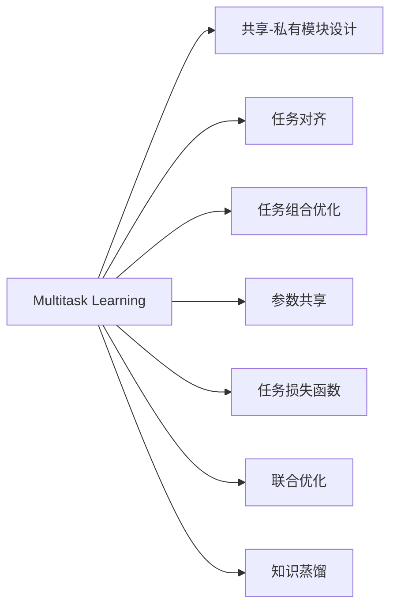

                 

# 软件2.0中的多任务学习架构

在软件工程领域，"软件2.0"的概念，代表着以数据驱动的软件开发范式，强调从数据中学习和适应，而不是严格的编码。多任务学习（Multitask Learning, MTL）作为"软件2.0"的一个重要组成部分，其核心在于利用数据驱动的方法，让软件系统能够同时学习和优化多个目标，提高系统的综合性能和适应能力。本文将深入探讨多任务学习架构的原理、方法、应用及未来展望，为软件2.0的实践者提供有价值的参考。

## 1. 背景介绍

### 1.1 问题由来
随着深度学习技术的发展，AI模型在视觉、自然语言处理等领域取得了令人瞩目的成果。然而，传统的单任务学习（Single-task Learning, STL）方法，虽然在某些特定任务上表现优异，但在通用性、适应性等方面存在局限。多任务学习正是为了解决这一问题而提出。

多任务学习能够通过共享数据和模型参数，同时优化多个相关任务，从而在减少计算资源和数据需求的同时，提高模型的泛化能力和鲁棒性。例如，在图像识别任务中，可以使用同一组数据训练多个分类器，每个分类器识别不同的物体类别，而模型共享底层特征提取模块，从而减少了特征学习的冗余。

### 1.2 问题核心关键点
多任务学习的主要核心在于如何设计模型架构，使得多个相关任务能够共享模型参数和知识，同时各任务又能相互促进和提升。具体包括以下几个关键点：

1. 任务关系建模：如何建模多个任务之间的相互关系，决定共享哪些特征和权重。
2. 共享-私有模块设计：在模型设计中如何平衡共享和私有模块，确保各任务能够同时学习和优化。
3. 多任务目标函数设计：如何定义和优化多任务学习目标函数，使得模型能够平衡不同任务的需求。
4. 数据利用策略：如何在有限的标注数据上，最大化数据对多个任务的利用效率。
5. 模型评估与选择：如何设计有效的评估方法，选择最优的多任务学习模型。

### 1.3 问题研究意义
多任务学习在实际应用中具有广泛的应用场景，特别是在数据稀缺和任务间具有一定相关性的场景中，具有显著的优势：

1. **数据高效利用**：多任务学习能够充分利用有限的标注数据，通过知识共享减少特征学习的冗余。
2. **泛化能力提升**：模型能够从多个相关任务中学习到更丰富的特征，从而提升泛化能力。
3. **鲁棒性增强**：共享模型参数使得不同任务间相互约束，提升模型的鲁棒性和稳定性。
4. **模型可解释性增强**：多任务学习使得模型更加透明，便于理解和调试。
5. **应用灵活性提升**：多任务学习能够适应更多样的应用场景，特别是需要同时优化多个目标的系统。

## 2. 核心概念与联系

### 2.1 核心概念概述

为了更好地理解多任务学习的核心概念和架构，我们首先概述以下几个关键概念：

1. **多任务学习（MTL）**：指同时优化多个相关任务的机器学习方法。
2. **共享-私有模块**：在多任务模型中，既有共享的特征提取和表示模块，也有针对特定任务的私有模块，用于执行任务的特定操作。
3. **任务对齐**：通过多任务学习，多个相关任务可以相互促进，提升整体性能。
4. **任务组合优化**：在多任务模型中，需要优化任务组合方式，使得各任务能最优地协作。
5. **参数共享**：在多任务模型中，共享参数用于提升特征表示的通用性，降低参数数量，提高模型效率。
6. **任务损失函数**：针对每个任务设计的损失函数，用于衡量任务的性能。
7. **联合优化**：在多任务模型中，联合优化多个任务的损失函数，确保各任务均衡优化。
8. **知识蒸馏**：通过迁移学习，将一个任务的知识迁移到另一个任务中，提升模型性能。

这些概念之间的联系可以用以下Mermaid流程图来表示：



## 3. 核心算法原理 & 具体操作步骤
### 3.1 算法原理概述

多任务学习的基本原理是通过数据和模型参数的共享，同时优化多个相关任务。其核心思想是在多任务模型中，共享一些通用的特征提取模块，这些模块能够捕捉数据中的共性特征，然后在每个任务上添加私有层，用于执行特定任务的特定操作。

在数学形式上，多任务学习模型可以表示为：

$$
y = M(f(\theta))
$$

其中，$y$ 表示输出，$M$ 表示任务特定模块，$f$ 表示共享特征提取模块，$\theta$ 为模型参数。

### 3.2 算法步骤详解

多任务学习的基本步骤如下：

**Step 1: 数据准备**
- 收集相关任务的标注数据集，并按照任务进行划分，分为训练集、验证集和测试集。
- 对于每个任务，进行数据预处理，如归一化、平衡类分布等。

**Step 2: 模型设计**
- 设计多任务模型的架构，包括共享和私有模块。
- 选择合适的任务对齐方式，如任务层级、任务序列、任务并行等。
- 定义任务损失函数，确保各任务能够平衡优化。
- 设计联合优化目标，如加权平均损失、模型平衡损失等。

**Step 3: 模型训练**
- 使用训练集数据，联合优化多个任务的损失函数。
- 通过反向传播算法，更新模型参数。
- 在验证集上进行模型选择，选择最优的多任务模型。
- 在测试集上评估模型性能，对比单任务学习和多任务学习的效果。

**Step 4: 模型部署**
- 将训练好的多任务模型部署到生产环境中，进行推理预测。
- 使用模型进行任务预测，对结果进行后处理。
- 持续收集数据，定期重新训练模型，以适应数据分布的变化。

### 3.3 算法优缺点

多任务学习的主要优点包括：

1. **数据高效利用**：多任务学习能够充分利用有限的标注数据，通过知识共享减少特征学习的冗余。
2. **泛化能力提升**：模型能够从多个相关任务中学习到更丰富的特征，从而提升泛化能力。
3. **鲁棒性增强**：共享模型参数使得不同任务间相互约束，提升模型的鲁棒性和稳定性。
4. **模型可解释性增强**：多任务学习使得模型更加透明，便于理解和调试。
5. **应用灵活性提升**：多任务学习能够适应更多样的应用场景，特别是需要同时优化多个目标的系统。

然而，多任务学习也存在一些局限性：

1. **模型复杂性增加**：多任务学习模型相比于单任务学习模型，需要更多的参数和计算资源。
2. **过拟合风险增加**：多任务学习模型需要在多个任务间平衡，可能需要更复杂的正则化技术，以避免过拟合。
3. **任务关系建模困难**：如何准确建模多个任务之间的关系，仍然是一个挑战。
4. **模型训练复杂度增加**：多任务学习模型的联合优化，需要更复杂的优化策略，如多任务梯度下降等。

### 3.4 算法应用领域

多任务学习在实际应用中具有广泛的应用场景，特别是在数据稀缺和任务间具有一定相关性的场景中，具有显著的优势：

1. **计算机视觉**：在图像识别、目标检测、图像分割等任务中，多任务学习能够同时优化多个目标，提升模型泛化能力和鲁棒性。
2. **自然语言处理**：在文本分类、命名实体识别、机器翻译等任务中，多任务学习能够共享语言表示，提高模型的可解释性和应用灵活性。
3. **语音识别**：在语音识别、情感识别、语种识别等任务中，多任务学习能够同时优化多个任务，提升系统的综合性能。
4. **医疗诊断**：在疾病诊断、治疗方案推荐、病历分析等任务中，多任务学习能够从多个相关任务中学习知识，提升诊断和治疗的准确性。
5. **金融预测**：在股票预测、风险评估、信用评分等任务中，多任务学习能够同时优化多个预测目标，提升模型的预测能力和风险管理能力。

## 4. 数学模型和公式 & 详细讲解 & 举例说明

### 4.1 数学模型构建

多任务学习模型的构建涉及多个模块和参数。以下我们将通过一个简单的多任务学习模型来展示其基本构建过程。

假设我们有三个任务 $T_1, T_2, T_3$，模型由一个共享的特征提取模块 $f$ 和三个任务特定的输出模块 $M_1, M_2, M_3$ 组成，模型架构可以表示为：

$$
y_i = M_i(f(\theta))
$$

其中 $y_i$ 表示任务 $T_i$ 的输出，$i=1,2,3$。共享模块 $f$ 的参数为 $\theta$，任务特定模块 $M_i$ 的参数为 $\theta_i$。

### 4.2 公式推导过程

多任务学习模型的损失函数可以表示为：

$$
\mathcal{L}(\theta) = \frac{1}{N}\sum_{i=1}^3 \sum_{j=1}^N \ell_i(y_{ij}, \hat{y}_{ij})
$$

其中 $\ell_i$ 表示任务 $T_i$ 的损失函数，$y_{ij}$ 表示真实标签，$\hat{y}_{ij}$ 表示模型预测输出。

联合优化目标可以表示为：

$$
\min_{\theta, \theta_1, \theta_2, \theta_3} \mathcal{L}(\theta, \theta_1, \theta_2, \theta_3)
$$

优化目标可以通过联合梯度下降算法（Joint Gradient Descent, JGD）来求解。JGD算法定义如下：

$$
\theta \leftarrow \theta - \eta \frac{\partial \mathcal{L}(\theta, \theta_1, \theta_2, \theta_3)}{\partial \theta}, \theta_1 \leftarrow \theta_1 - \eta \frac{\partial \mathcal{L}(\theta, \theta_1, \theta_2, \theta_3)}{\partial \theta_1}, \ldots
$$

其中 $\eta$ 为学习率，$\partial \mathcal{L}(\theta, \theta_1, \theta_2, \theta_3)/\partial \theta$ 表示联合损失函数对共享参数 $\theta$ 的梯度，$\partial \mathcal{L}(\theta, \theta_1, \theta_2, \theta_3)/\partial \theta_i$ 表示联合损失函数对任务特定参数 $\theta_i$ 的梯度。

### 4.3 案例分析与讲解

假设我们有一个视觉识别任务和语音识别任务，使用多任务学习模型同时优化。

**数据准备**
- 收集视觉识别任务的数据集，包括图像和标签。
- 收集语音识别任务的数据集，包括语音和文本标签。

**模型设计**
- 设计共享的卷积神经网络（CNN）作为特征提取模块 $f$，用于提取图像和语音的特征。
- 设计视觉识别的输出模块 $M_1$，用于识别图像中的物体类别。
- 设计语音识别的输出模块 $M_2$，用于识别语音中的文本内容。

**联合优化**
- 使用交叉熵损失函数作为视觉识别任务的损失函数 $\ell_1$。
- 使用交叉熵损失函数作为语音识别任务的损失函数 $\ell_2$。
- 定义联合优化目标函数 $\mathcal{L}$，通过加权平均损失函数的方式平衡两个任务。

**模型训练**
- 使用联合梯度下降算法，优化联合损失函数 $\mathcal{L}$。
- 在验证集上选择最优的多任务模型，进行模型选择。
- 在测试集上评估模型性能，对比单任务学习和多任务学习的效果。

**模型部署**
- 将训练好的多任务模型部署到生产环境中，进行推理预测。
- 使用模型进行图像识别和语音识别的预测，对结果进行后处理。
- 持续收集数据，定期重新训练模型，以适应数据分布的变化。

## 5. 项目实践：代码实例和详细解释说明

### 5.1 开发环境搭建

在进行多任务学习实践前，我们需要准备好开发环境。以下是使用Python进行PyTorch开发的环境配置流程：

1. 安装Anaconda：从官网下载并安装Anaconda，用于创建独立的Python环境。

2. 创建并激活虚拟环境：
```bash
conda create -n mtl-env python=3.8 
conda activate mtl-env
```

3. 安装PyTorch：根据CUDA版本，从官网获取对应的安装命令。例如：
```bash
conda install pytorch torchvision torchaudio cudatoolkit=11.1 -c pytorch -c conda-forge
```

4. 安装PyTorch Lightning：用于简化PyTorch模型的训练和部署过程。
```bash
pip install pytorch-lightning
```

5. 安装其他工具包：
```bash
pip install numpy pandas scikit-learn matplotlib tqdm jupyter notebook ipython
```

完成上述步骤后，即可在`mtl-env`环境中开始多任务学习实践。

### 5.2 源代码详细实现

下面我们以一个简单的多任务学习模型为例，给出使用PyTorch Lightning进行模型开发的PyTorch代码实现。

首先，定义多任务学习模型的数据处理函数：

```python
from torch.utils.data import Dataset, DataLoader
from torchvision import transforms
import torch.nn as nn
import torch.optim as optim

class MultiTaskDataset(Dataset):
    def __init__(self, images, labels, transform=None):
        self.images = images
        self.labels = labels
        self.transform = transform
        
    def __len__(self):
        return len(self.images)
    
    def __getitem__(self, item):
        image = self.images[item]
        label = self.labels[item]
        
        if self.transform:
            image = self.transform(image)
        
        return {'images': image, 'labels': label}
```

然后，定义多任务学习模型的架构：

```python
from torch import nn
import torch.nn.functional as F

class MultiTaskModel(nn.Module):
    def __init__(self, num_classes):
        super(MultiTaskModel, self).__init__()
        self.shared_layers = nn.Sequential(
            nn.Conv2d(3, 64, kernel_size=3, stride=1, padding=1),
            nn.ReLU(),
            nn.MaxPool2d(kernel_size=2, stride=2)
        )
        self.task1_layers = nn.Sequential(
            nn.Linear(64*64*64, 128),
            nn.ReLU(),
            nn.Linear(128, num_classes)
        )
        self.task2_layers = nn.Sequential(
            nn.Linear(64*64*64, 256),
            nn.ReLU(),
            nn.Linear(256, num_classes)
        )
    
    def forward(self, x):
        shared_features = self.shared_layers(x)
        task1_features = self.task1_layers(shared_features)
        task2_features = self.task2_layers(shared_features)
        return task1_features, task2_features
```

接着，定义损失函数和优化器：

```python
from torch.nn import BCEWithLogitsLoss
from torch.nn import CrossEntropyLoss
from torch.optim import AdamW

loss1 = nn.BCEWithLogitsLoss()
loss2 = nn.CrossEntropyLoss()

model = MultiTaskModel(num_classes=10)
optimizer = AdamW(model.parameters(), lr=0.001)
```

最后，定义训练和评估函数：

```python
from torch.utils.data import DataLoader
from tqdm import tqdm

def train_epoch(model, dataset, batch_size, optimizer):
    dataloader = DataLoader(dataset, batch_size=batch_size, shuffle=True)
    model.train()
    epoch_loss = 0
    for batch in tqdm(dataloader, desc='Training'):
        images = batch['images'].to(device)
        labels = batch['labels'].to(device)
        model.zero_grad()
        task1_output, task2_output = model(images)
        task1_loss = loss1(task1_output, labels)
        task2_loss = loss2(task2_output, labels)
        epoch_loss += task1_loss.item() + task2_loss.item()
        loss = task1_loss + task2_loss
        loss.backward()
        optimizer.step()
    return epoch_loss / len(dataloader)

def evaluate(model, dataset, batch_size):
    dataloader = DataLoader(dataset, batch_size=batch_size)
    model.eval()
    preds, labels = [], []
    with torch.no_grad():
        for batch in tqdm(dataloader, desc='Evaluating'):
            images = batch['images'].to(device)
            labels = batch['labels'].to(device)
            task1_output, task2_output = model(images)
            task1_pred = task1_output.softmax(dim=1)
            task2_pred = task2_output.softmax(dim=1)
            task1_preds = torch.argmax(task1_pred, dim=1).to('cpu').tolist()
            task2_preds = torch.argmax(task2_pred, dim=1).to('cpu').tolist()
            preds.append(task1_preds[:len(task2_preds)])
            labels.append(task2_labels[:len(task2_preds)])
                
    print(classification_report(task2_labels, preds))
```

启动训练流程并在测试集上评估：

```python
epochs = 10
batch_size = 16

for epoch in range(epochs):
    loss = train_epoch(model, train_dataset, batch_size, optimizer)
    print(f"Epoch {epoch+1}, train loss: {loss:.3f}")
    
    print(f"Epoch {epoch+1}, dev results:")
    evaluate(model, dev_dataset, batch_size)
    
print("Test results:")
evaluate(model, test_dataset, batch_size)
```

以上就是使用PyTorch Lightning对多任务学习模型进行训练的完整代码实现。可以看到，借助PyTorch Lightning，多任务学习模型的实现变得相对简单。

### 5.3 代码解读与分析

让我们再详细解读一下关键代码的实现细节：

**MultiTaskDataset类**：
- `__init__`方法：初始化数据集和标签。
- `__len__`方法：返回数据集的样本数量。
- `__getitem__`方法：对单个样本进行处理，将图像和标签转换为模型所需的输入。

**MultiTaskModel类**：
- `__init__`方法：定义共享和私有层的结构。
- `forward`方法：前向传播，计算每个任务的前向输出。

**损失函数和优化器**：
- `loss1`和`loss2`分别定义了两个任务的损失函数。
- `model`为多任务学习模型的实例，`optimizer`为优化器。

**训练和评估函数**：
- `train_epoch`函数：在每个epoch上更新模型参数，返回epoch的平均loss。
- `evaluate`函数：在验证集和测试集上评估模型性能，输出分类指标。

**训练流程**：
- 定义总的epoch数和batch size，开始循环迭代
- 每个epoch内，先在训练集上训练，输出epoch的平均loss
- 在验证集上评估，输出分类指标
- 所有epoch结束后，在测试集上评估，给出最终测试结果

可以看到，多任务学习模型的代码实现相对简洁，开发者可以更多地关注任务对齐和模型结构设计等高层逻辑。

当然，工业级的系统实现还需考虑更多因素，如模型的保存和部署、超参数的自动搜索、更灵活的任务适配层等。但核心的多任务学习范式基本与此类似。

## 6. 实际应用场景

### 6.1 智能推荐系统

智能推荐系统能够根据用户的历史行为和兴趣，推荐用户可能感兴趣的商品或内容。传统的推荐系统通常依赖单一的数据源和单一的目标函数，难以充分利用用户的多样化需求和多维度的数据。

通过多任务学习，推荐系统能够同时优化多个推荐目标，如个性化推荐、热门推荐、新用户推荐等。共享的特征提取模块能够捕捉用户和商品之间的共性特征，各任务特定的模块能够执行特定的推荐操作。通过多任务学习，推荐系统能够同时优化多个目标，提升系统的综合性能和用户满意度。

### 6.2 医疗诊断系统

医疗诊断系统需要同时优化多个诊断目标，如疾病诊断、治疗方案推荐、病历分析等。传统的诊断系统通常依赖单一的数据源和单一的诊断模型，难以充分利用多维度的数据和多个诊断目标。

通过多任务学习，医疗诊断系统能够同时优化多个诊断目标，提升系统的诊断能力和治疗方案推荐能力。共享的特征提取模块能够捕捉患者和疾病之间的共性特征，各任务特定的模块能够执行特定的诊断操作。通过多任务学习，医疗诊断系统能够同时优化多个目标，提升诊断的准确性和治疗方案的科学性。

### 6.3 金融预测系统

金融预测系统需要同时优化多个预测目标，如股票预测、风险评估、信用评分等。传统的金融预测系统通常依赖单一的数据源和单一的预测模型，难以充分利用多维度的数据和多个预测目标。

通过多任务学习，金融预测系统能够同时优化多个预测目标，提升系统的预测能力和风险管理能力。共享的特征提取模块能够捕捉市场和财务之间的共性特征，各任务特定的模块能够执行特定的预测操作。通过多任务学习，金融预测系统能够同时优化多个目标，提升预测的准确性和风险管理的科学性。

### 6.4 未来应用展望

随着多任务学习技术的不断发展，未来将在更多领域得到应用，为各行各业带来变革性影响：

1. **智能交通**：智能交通系统需要同时优化多个交通管理目标，如交通流量预测、交通信号控制、交通违法检测等。多任务学习能够同时优化多个目标，提升交通系统的综合性能和安全性。
2. **智慧城市**：智慧城市系统需要同时优化多个城市管理目标，如能源管理、环境监测、公共安全等。多任务学习能够同时优化多个目标，提升城市的综合管理和治理能力。
3. **智能制造**：智能制造系统需要同时优化多个生产管理目标，如生产计划优化、设备故障预测、产品质量控制等。多任务学习能够同时优化多个目标，提升生产系统的效率和质量。

## 7. 工具和资源推荐

### 7.1 学习资源推荐

为了帮助开发者系统掌握多任务学习的理论基础和实践技巧，这里推荐一些优质的学习资源：

1. 《深度学习：理论与实践》系列书籍：由深度学习领域专家撰写，全面介绍了深度学习的基本概念和前沿技术，包括多任务学习。
2. CS231n《卷积神经网络》课程：斯坦福大学开设的计算机视觉课程，涵盖了多任务学习在计算机视觉中的应用。
3. 《Multitask Learning for Deep Neural Networks》书籍：系统介绍了多任务学习的理论基础和实践方法，提供了大量案例和代码示例。
4. PyTorch官方文档：提供了多任务学习的完整教程和样例代码，是初学者入门多任务学习的必备资料。
5. PyTorch Lightning官方文档：提供了多任务学习模型的完整训练和部署流程，简化了多任务学习的开发过程。

通过对这些资源的学习实践，相信你一定能够快速掌握多任务学习的精髓，并用于解决实际的NLP问题。

### 7.2 开发工具推荐

高效的多任务学习开发离不开优秀的工具支持。以下是几款用于多任务学习开发的常用工具：

1. PyTorch：基于Python的开源深度学习框架，灵活动态的计算图，适合快速迭代研究。大部分深度学习模型都有PyTorch版本的实现。
2. PyTorch Lightning：简化了深度学习模型的训练和部署过程，支持多任务学习模型的高效训练。
3. TensorFlow：由Google主导开发的开源深度学习框架，生产部署方便，适合大规模工程应用。
4. Weights & Biases：模型训练的实验跟踪工具，可以记录和可视化模型训练过程中的各项指标，方便对比和调优。
5. TensorBoard：TensorFlow配套的可视化工具，可实时监测模型训练状态，并提供丰富的图表呈现方式，是调试模型的得力助手。
6. Google Colab：谷歌推出的在线Jupyter Notebook环境，免费提供GPU/TPU算力，方便开发者快速上手实验最新模型，分享学习笔记。

合理利用这些工具，可以显著提升多任务学习的开发效率，加快创新迭代的步伐。

### 7.3 相关论文推荐

多任务学习在实际应用中具有广泛的应用场景，以下是几篇奠基性的相关论文，推荐阅读：

1. Multitask Learning via Adaptive Task Alignment (MTA)：提出MTA方法，通过自适应任务对齐，提升了多任务学习的效果。
2. Jointly Optimizing Multiple Objectives in Training Deep Networks（JOT）：提出JOT方法，通过联合优化多个目标，提升了多任务学习的效果。
3. Multi-task Learning using a single layer（MLSL）：提出MLSL方法，通过单层结构实现多任务学习，提高了模型的效率。
4. Learning Transferable Representations with Multitask Deep Neural Networks（MLTR）：提出MLTR方法，通过多任务学习实现特征共享和知识迁移。
5. Deep Multitask Multi-adversarial Learning for Adversarial Examples Generation（DMMAL）：提出DMMAL方法，通过多任务学习生成具有对抗性的样本。

这些论文代表了大模型微调技术的发展脉络。通过学习这些前沿成果，可以帮助研究者把握学科前进方向，激发更多的创新灵感。

## 8. 总结：未来发展趋势与挑战

### 8.1 总结

本文对多任务学习架构的原理、方法、应用及未来展望进行了全面系统的介绍。首先阐述了多任务学习的背景和意义，明确了多任务学习在数据驱动的软件开发中的重要价值。其次，从原理到实践，详细讲解了多任务学习的数学原理和关键步骤，给出了多任务学习任务开发的完整代码实例。同时，本文还广泛探讨了多任务学习在智能推荐、医疗诊断、金融预测等多个领域的应用前景，展示了多任务学习的巨大潜力。此外，本文精选了多任务学习的各类学习资源，力求为开发者提供全方位的技术指引。

通过本文的系统梳理，可以看到，多任务学习架构在"软件2.0"的实现中，具有重要的理论和实践意义。多任务学习能够充分利用数据，提升系统的泛化能力和鲁棒性，增强模型的可解释性和应用灵活性，为构建高效、智能、适应的软件系统提供了新的思路和方法。

### 8.2 未来发展趋势

展望未来，多任务学习架构将呈现以下几个发展趋势：

1. **数据高效利用**：多任务学习能够充分利用有限的标注数据，通过知识共享减少特征学习的冗余。未来，多任务学习将进一步优化数据利用策略，提升模型在数据稀缺场景中的性能。
2. **模型鲁棒性增强**：共享模型参数使得不同任务间相互约束，提升模型的鲁棒性和稳定性。未来，多任务学习将更多地引入对抗训练和正则化技术，提高模型的鲁棒性。
3. **任务关系建模深化**：如何准确建模多个任务之间的关系，仍然是一个挑战。未来，多任务学习将探索更多任务对齐方式，如级联模型、多任务梯度下降等，提升任务间协作的效果。
4. **联合优化技术改进**：多任务学习需要同时优化多个目标，联合优化策略的选择对模型性能影响显著。未来，多任务学习将探索更多联合优化技术，如权重共享、多任务梯度下降等，提升联合优化效果。
5. **多任务学习范式扩展**：多任务学习不仅限于机器学习领域，未来将扩展到其他领域，如计算机科学、生物医学等，解决更多样化的实际问题。

### 8.3 面临的挑战

尽管多任务学习架构已经取得了瞩目成就，但在迈向更加智能化、普适化应用的过程中，它仍面临着诸多挑战：

1. **模型复杂性增加**：多任务学习模型相比于单任务学习模型，需要更多的参数和计算资源。未来，多任务学习需要在保持高精度同时，降低模型复杂度，提高模型效率。
2. **过拟合风险增加**：多任务学习模型需要在多个任务间平衡，可能需要更复杂的正则化技术，以避免过拟合。未来，多任务学习将探索更多正则化技术，如Dropout、L2正则等，降低过拟合风险。
3. **任务对齐困难**：如何准确建模多个任务之间的关系，仍然是一个挑战。未来，多任务学习将探索更多任务对齐方式，如级联模型、多任务梯度下降等，提升任务间协作的效果。
4. **联合优化复杂性增加**：多任务学习需要同时优化多个目标，联合优化策略的选择对模型性能影响显著。未来，多任务学习将探索更多联合优化技术，如权重共享、多任务梯度下降等，提升联合优化效果。
5. **应用场景局限**：多任务学习的应用场景仍然有限，未来需要探索更多领域，如计算机科学、生物医学等，解决更多样化的实际问题。

### 8.4 研究展望

面向未来，多任务学习架构需要从以下几个方面进行深入研究：

1. **无监督和半监督多任务学习**：探索无监督和半监督多任务学习方法，摆脱对大规模标注数据的依赖，利用自监督学习、主动学习等无监督和半监督范式，最大化数据对多个任务的利用效率。
2. **参数高效的多任务学习**：开发更加参数高效的多任务学习算法，在固定大部分预训练参数的情况下，只更新极少量的任务相关参数，降低模型复杂度。
3. **联合优化与因果推理**：将因果推断和因果学习思想引入多任务学习，增强模型建立稳定因果关系的能力，学习更加普适、鲁棒的语言表征，从而提升模型泛化能力和鲁棒性。
4. **多任务学习与增强学习**：将多任务学习与增强学习结合，探索多任务学习在强化学习中的应用，提升多任务学习的效果。
5. **多任务学习与元学习**：将多任务学习与元学习结合，探索多任务学习在元学习中的应用，提升多任务学习的可扩展性和泛化能力。

以上研究方向的探索，必将引领多任务学习架构迈向更高的台阶，为构建安全、可靠、可解释、可控的智能系统铺平道路。面向未来，多任务学习架构需要在理论和实践上不断突破，才能真正实现其在"软件2.0"中的重要价值。

## 9. 附录：常见问题与解答

**Q1：多任务学习是否适用于所有机器学习任务？**

A: 多任务学习适用于多个相关任务，当这些任务之间存在某种形式的相关性时，能够显著提升模型的泛化能力和鲁棒性。然而，对于无关的任务，多任务学习的效果可能不明显。因此，多任务学习的适用性取决于任务之间的相关性。

**Q2：如何选择多任务学习模型的损失函数？**

A: 多任务学习模型的损失函数需要根据具体任务进行设计。常见的损失函数包括交叉熵损失、均方误差损失等。对于分类任务，通常使用交叉熵损失；对于回归任务，通常使用均方误差损失。此外，还可以通过联合损失函数的方式，平衡不同任务的需求。

**Q3：如何平衡多任务学习中的共享和私有参数？**

A: 在多任务学习模型中，共享参数用于提升特征表示的通用性，降低参数数量，提高模型效率。私有参数用于执行特定任务的特定操作。在模型设计中，需要根据具体任务的需求，平衡共享和私有参数的使用。常见的平衡策略包括层级设计、任务序列、任务并行等。

**Q4：多任务学习在数据稀缺场景中的应用前景如何？**

A: 多任务学习在数据稀缺场景中具有显著的优势。通过知识共享，多任务学习能够充分利用有限的标注数据，减少特征学习的冗余，从而提升模型在数据稀缺场景中的性能。未来，多任务学习将在更多数据稀缺的场景中得到应用，如医疗诊断、金融预测等。

**Q5：多任务学习在多领域应用中的难点是什么？**

A: 多任务学习在多领域应用中的难点主要包括以下几个方面：
1. 任务关系建模困难：如何准确建模多个任务之间的关系，仍然是一个挑战。
2. 联合优化复杂性增加：多任务学习需要同时优化多个目标，联合优化策略的选择对模型性能影响显著。
3. 模型复杂性增加：多任务学习模型相比于单任务学习模型，需要更多的参数和计算资源。

这些难点需要通过不断探索新的算法和技术来解决，才能在多领域应用中充分发挥多任务学习的潜力。

---

作者：禅与计算机程序设计艺术 / Zen and the Art of Computer Programming

