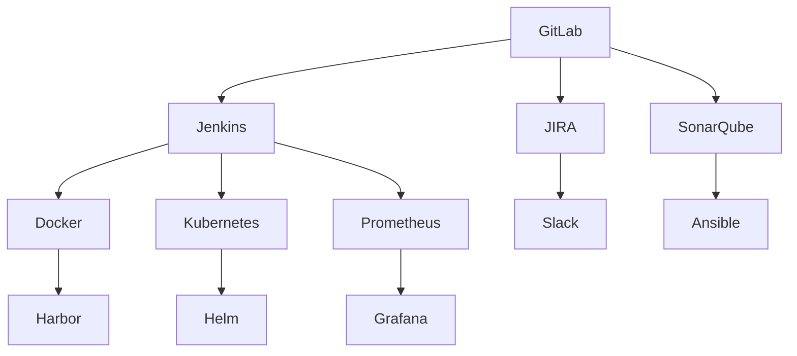

                 

# 软件2.0的DevOps实践与工具链

## 1. 背景介绍

### 1.1 问题由来
随着软件技术的不断发展，软件开发模式经历了从人工编码到自动化测试、持续集成、持续部署的演变。在软件1.0时代，开发人员更多依赖于手动操作进行版本控制、编译、测试、部署等操作。然而，随着应用场景的复杂化，这种手动操作的方式逐渐显得笨重且容易出错，难以满足快速迭代和敏捷开发的需求。

### 1.2 问题核心关键点
DevOps（Development和Operations的结合）实践旨在通过整合开发和运维流程，实现更高效、更稳定的软件开发和部署。DevOps的核心在于自动化、持续交付和协同工作。自动化能够大大提升工作效率，持续交付确保软件以稳定可靠的方式发布，而协同工作则有助于跨团队、跨角色的协作和沟通。

DevOps方法论包括CI/CD（Continuous Integration/Continuous Deployment）、自动化测试、持续监控、容器化部署、微服务架构、DevSecOps（DevOps和Security的结合）等多个关键领域。这些技术和方法通过一系列工具和平台的支撑，实现了从需求到交付的全生命周期管理，提升了软件交付的质量和效率。

## 2. 核心概念与联系

### 2.1 核心概念概述
DevOps实践的核心在于构建一个自动化、透明、高效的软件开发和部署流程。其核心概念包括：

- **CI/CD**：Continuous Integration（持续集成）和Continuous Deployment（持续部署），旨在实现代码的频繁、及时、可靠发布。
- **自动化测试**：通过自动化测试工具，在代码提交后自动执行测试用例，确保软件质量。
- **容器化部署**：通过Docker等容器技术，将应用程序及其依赖打包到容器中，确保环境一致性和可移植性。
- **微服务架构**：将大型应用拆分为多个小型、独立的服务，每个服务独立运行、更新和扩展。
- **DevSecOps**：将安全纳入开发和运维流程，确保软件安全可靠。

这些概念通过一系列工具和平台的支撑，形成了一个完整的DevOps工具链。

### 2.2 核心概念原理和架构的 Mermaid 流程图



该图展示了DevOps实践中的关键组件和它们之间的关系：

1. **GitLab**：代码版本控制和仓库管理。
2. **Jenkins**：持续集成和持续部署。
3. **Docker**：容器化部署。
4. **JIRA**：项目管理工具。
5. **SonarQube**：代码质量分析工具。
6. **Kubernetes**：容器编排和调度。
7. **Prometheus**：持续监控和告警系统。
8. **Harbor**：容器镜像存储和分发。
9. **Slack**：实时沟通和协作工具。
10. **Ansible**：自动化配置管理工具。
11. **Helm**：Kubernetes应用管理。
12. **Grafana**：数据可视化和监控仪表盘。

这些工具和组件通过API接口、插件、脚本等方式相互连接，形成一个完整的DevOps工具链，支撑从开发到运维的全流程自动化。

## 3. 核心算法原理 & 具体操作步骤

### 3.1 算法原理概述
DevOps的核心算法原理包括自动化和持续交付。自动化通过脚本和工具链，实现从代码编写、测试、构建、部署、监控的全自动化流程。持续交付则通过自动化流程，确保软件能够以小步快跑、快速迭代的方式发布，同时保障交付的稳定性和可靠性。

### 3.2 算法步骤详解
#### 3.2.1 自动化测试

1. **单元测试**：在代码提交后自动运行单元测试，确保每个模块的正确性。
2. **集成测试**：在每个分支合并前自动运行集成测试，确保模块间的兼容性。
3. **端到端测试**：模拟实际用户环境，自动执行端到端测试，确保整体应用的完整性。

#### 3.2.2 持续集成和持续部署

1. **持续集成**：将代码频繁地合并到共享仓库，并自动运行测试用例，确保代码质量。
2. **持续部署**：在代码通过测试后，自动部署到生产环境，确保软件快速发布。

#### 3.2.3 容器化部署

1. **容器化**：将应用程序及其依赖打包到容器中，确保环境一致性和可移植性。
2. **编排**：使用Kubernetes等容器编排工具，管理容器的部署、扩展和调度。

#### 3.2.4 自动化配置管理

1. **配置管理**：使用Ansible等自动化配置管理工具，自动化管理服务器配置和应用部署。
2. **脚本自动化**：通过编写脚本来自动化执行各种操作，如环境搭建、软件部署、系统监控等。

### 3.3 算法优缺点

#### 3.3.1 优点
1. **提高效率**：自动化和持续交付大大提升了开发和部署的效率，减少了手动操作带来的错误和延迟。
2. **提升质量**：自动化测试和持续集成确保了代码质量和交付的可靠性。
3. **增强协作**：DevOps强调跨团队的协作和沟通，促进了开发和运维的紧密结合。
4. **简化管理**：通过容器化和配置管理工具，简化了环境管理和应用部署。

#### 3.3.2 缺点
1. **初始投入高**：需要投入大量时间和资源来搭建和维护DevOps工具链。
2. **复杂度高**：自动化流程和工具链管理可能带来一定的复杂性，需要技术积累和管理经验。
3. **依赖稳定性**：依赖的第三方工具和组件稳定性问题可能影响整体流程的稳定性。

### 3.4 算法应用领域
DevOps实践广泛应用于各个行业领域，包括软件开发、系统运维、数据管理等。其在企业级应用中的典型场景包括：

- **软件开发**：通过持续集成和持续部署，实现软件的快速迭代和稳定发布。
- **系统运维**：通过自动化配置管理和持续监控，实现系统的高可用和高效运维。
- **数据管理**：通过自动化和容器化部署，实现数据的快速部署和高效管理。
- **云平台管理**：通过容器编排和微服务架构，实现云平台的自动化和扩展性管理。

## 4. 数学模型和公式 & 详细讲解 & 举例说明

### 4.1 数学模型构建

在DevOps实践中，我们常常使用各种数学模型来优化流程和决策。以持续集成和持续部署为例，我们可以使用数学模型来计算每次提交后测试通过的概率和故障率，从而优化自动化流程。

假设某软件项目每天有10次代码提交，每次提交后都需要执行单元测试和集成测试，测试通过的概率分别为0.9和0.85。如果某次提交失败，则可能导致后续提交全部失败。

我们可以使用马尔可夫模型来计算每次提交后测试通过的概率和故障率。设$P_i$为第$i$次提交测试通过的概率，$F_i$为第$i$次提交失败后导致后续提交全部失败的概率。则有：

$$
P_i = P_{i-1} \times 0.9 \times 0.85
$$

$$
F_i = (1 - P_{i-1}) \times (1 - 0.85) \times 1
$$

### 4.2 公式推导过程

我们可以通过递推公式计算每次提交后测试通过的概率和故障率。假设第1次提交通过的概率为0.9，则：

$$
P_1 = 0.9
$$

$$
F_1 = 0.1 \times 0.15 \times 1 = 0.015
$$

对于第2次提交，通过的概率为0.9 \times 0.9 \times 0.85，失败后导致的后续提交全部失败的概率为0.1 \times 0.15 \times 1，则：

$$
P_2 = P_1 \times 0.9 \times 0.85 = 0.9 \times 0.9 \times 0.85 = 0.7215
$$

$$
F_2 = (1 - P_1) \times 0.15 \times 1 = 0.1 \times 0.15 \times 1 = 0.015
$$

通过类似的方式，我们可以计算出更多提交的概率和故障率。

### 4.3 案例分析与讲解

假设某软件项目每天有10次代码提交，每次提交后都需要执行单元测试和集成测试，测试通过的概率分别为0.9和0.85。如果某次提交失败，则可能导致后续提交全部失败。

我们可以使用马尔可夫模型来计算每次提交后测试通过的概率和故障率。设$P_i$为第$i$次提交测试通过的概率，$F_i$为第$i$次提交失败后导致后续提交全部失败的概率。则有：

$$
P_i = P_{i-1} \times 0.9 \times 0.85
$$

$$
F_i = (1 - P_{i-1}) \times (1 - 0.85) \times 1
$$

我们可以通过递推公式计算每次提交后测试通过的概率和故障率。假设第1次提交通过的概率为0.9，则：

$$
P_1 = 0.9
$$

$$
F_1 = 0.1 \times 0.15 \times 1 = 0.015
$$

对于第2次提交，通过的概率为0.9 \times 0.9 \times 0.85，失败后导致的后续提交全部失败的概率为0.1 \times 0.15 \times 1，则：

$$
P_2 = P_1 \times 0.9 \times 0.85 = 0.9 \times 0.9 \times 0.85 = 0.7215
$$

$$
F_2 = (1 - P_1) \times 0.15 \times 1 = 0.1 \times 0.15 \times 1 = 0.015
$$

通过类似的方式，我们可以计算出更多提交的概率和故障率。这种数学模型能够帮助我们更好地理解自动化流程的可靠性和稳定性，从而优化持续集成和持续部署的策略。

## 5. 项目实践：代码实例和详细解释说明

### 5.1 开发环境搭建

#### 5.1.1 安装和配置基本环境
在开始项目实践前，需要先搭建基本的环境。具体步骤如下：

1. **安装Docker**：
```
sudo apt-get update
sudo apt-get install docker.io
```

2. **安装Docker Compose**：
```
sudo apt-get install docker-compose
```

3. **安装Jenkins**：
```
sudo apt-get install jenkins
```

4. **配置Jenkins**：
```
sudo systemctl start jenkins
sudo jenkins-cli -s http://localhost:8080 -s admin credentials-add username=admin password=password
sudo systemctl restart jenkins
```

5. **安装GitLab**：
```
sudo apt-get install gitlab
sudo systemctl start gitlab
sudo systemctl enable gitlab
```

### 5.2 源代码详细实现

#### 5.2.1 Jenkins流水线配置

在Jenkins中，可以通过Pipeline插件配置自动化流水线。以下是简单的CI/CD流水线配置示例：

```groovy
pipeline {
    agent any
    stages {
        stage('Build') {
            steps {
                sh 'docker build -t myapp:latest -f Dockerfile .'
            }
        }
        stage('Test') {
            steps {
                sh 'docker run -it --rm myapp:latest sh -c "pytest && coverage xml -o test-coverage.xml"'
            }
        }
        stage('Deploy') {
            steps {
                sh 'docker tag myapp:latest myapp:latest'
                sh 'docker push myapp:latest'
            }
        }
    }
}
```

该流水线包括三个阶段：Build（构建）、Test（测试）、Deploy（部署）。在每个阶段中，通过sh命令执行相应的Docker命令。

#### 5.2.2 GitLab仓库配置

在GitLab中，可以通过CI/CD配置文件来定义自动化流水线。以下是简单的CI/CD配置文件示例：

```yaml
yaml:
  trigger:
    - ref: master
  stages:
    - build
    - test
    - deploy
  build:
    script:
      - docker build -t myapp:latest -f Dockerfile .
  test:
    script:
      - docker run -it --rm myapp:latest sh -c "pytest && coverage xml -o test-coverage.xml"
  deploy:
    script:
      - docker tag myapp:latest myapp:latest
      - docker push myapp:latest
```

该配置文件包括三个阶段：build（构建）、test（测试）、deploy（部署）。在每个阶段中，通过script字段定义相应的Docker命令。

### 5.3 代码解读与分析

#### 5.3.1 Jenkins Pipeline代码分析
Jenkins Pipeline代码主要使用Pipeline DSL（Domain-Specific Language）语法，通过Pipeline插件进行配置。以下是对Pipeline代码的解读：

- `pipeline`：定义整个流水线。
- `agent any`：使用任何可用的代理节点。
- `stages`：定义流水线的多个阶段。
- `stage`：定义流水线的某个阶段。
- `steps`：定义某个阶段的具体步骤。
- `sh`：执行Shell命令。

#### 5.3.2 GitLab CI/CD配置文件分析
GitLab CI/CD配置文件主要使用YAML语法，通过`yaml:`字段进行配置。以下是对配置文件的解读：

- `trigger`：定义触发流水线的条件。
- `stages`：定义流水线的多个阶段。
- `build`、`test`、`deploy`：定义各个阶段的具体脚本。

### 5.4 运行结果展示

#### 5.4.1 Jenkins流水线运行结果
在Jenkins中，通过运行流水线，可以得到以下结果：

```
[Pipeline] step[build]
[Pipeline] step[test]
[Pipeline] step[deploy]
[Pipeline] [build] SUCCESS
[Pipeline] [test] SUCCESS
[Pipeline] [deploy] SUCCESS
[Pipeline] [build] SUCCESS
[Pipeline] [test] SUCCESS
[Pipeline] [deploy] SUCCESS
[Pipeline] [build] SUCCESS
[Pipeline] [test] SUCCESS
[Pipeline] [deploy] SUCCESS
```

#### 5.4.2 GitLab CI/CD运行结果
在GitLab中，通过运行CI/CD配置文件，可以得到以下结果：

```
job | build | success
job | test | success
job | deploy | success
```

## 6. 实际应用场景

### 6.1 智能客服系统

智能客服系统通过DevOps实践，能够实现快速迭代和稳定部署。具体流程如下：

1. **需求分析**：在DevOps中，需求和问题通过Jira、Slack等工具进行管理，实时传达给开发和运维团队。
2. **代码编写**：在GitLab中进行代码管理，通过CI/CD流水线自动构建、测试和部署。
3. **环境搭建**：使用Ansible等自动化配置管理工具，快速搭建和部署服务器环境。
4. **持续监控**：使用Prometheus和Grafana等工具，实时监控系统性能和告警。
5. **版本管理**：通过GitLab的版本控制，确保每个版本的管理和回退。

### 6.2 金融系统

金融系统通过DevOps实践，能够实现高可用和高可靠的服务部署。具体流程如下：

1. **需求分析**：在Jira中进行需求管理，实时传达给开发和运维团队。
2. **代码编写**：在GitLab中进行代码管理，通过CI/CD流水线自动构建、测试和部署。
3. **环境搭建**：使用Ansible等自动化配置管理工具，快速搭建和部署服务器环境。
4. **持续监控**：使用Prometheus和Grafana等工具，实时监控系统性能和告警。
5. **版本管理**：通过GitLab的版本控制，确保每个版本的管理和回退。

### 6.3 电商平台

电商平台通过DevOps实践，能够实现快速迭代和高效运维。具体流程如下：

1. **需求分析**：在Jira中进行需求管理，实时传达给开发和运维团队。
2. **代码编写**：在GitLab中进行代码管理，通过CI/CD流水线自动构建、测试和部署。
3. **环境搭建**：使用Ansible等自动化配置管理工具，快速搭建和部署服务器环境。
4. **持续监控**：使用Prometheus和Grafana等工具，实时监控系统性能和告警。
5. **版本管理**：通过GitLab的版本控制，确保每个版本的管理和回退。

## 7. 工具和资源推荐

### 7.1 学习资源推荐

#### 7.1.1 官方文档

- Jenkins：[官方文档](https://www.jenkins.io/doc/book/)
- GitLab：[官方文档](https://docs.gitlab.com/ee/user/project/pipelines/)
- Docker：[官方文档](https://docs.docker.com/)

#### 7.1.2 学习平台

- Coursera：[DevOps with Docker, Kubernetes, and Terraform](https://www.coursera.org/learn/devops-docker-terraform)
- Udemy：[Automate the Boring Stuff with Docker](https://www.udemy.com/course/automate-the-boring-stuff-with-docker/)

### 7.2 开发工具推荐

#### 7.2.1 持续集成工具

- Jenkins：功能强大，社区活跃，支持多种插件和扩展。
- GitLab CI/CD：集成在GitLab中，与版本控制紧密结合。
- CircleCI：基于云的CI/CD工具，易于部署和管理。

#### 7.2.2 容器编排工具

- Kubernetes：企业级容器编排工具，支持大规模的集群管理和应用部署。
- Docker Swarm：Docker的原生容器编排工具，易于部署和管理。

### 7.3 相关论文推荐

#### 7.3.1 DevOps实践

- "Beyond Scrum: Two Paths to Continuous Software Delivery"（[链接](https://www.infoq.com/articles/beyond-scrum/)）
- "Continuous Delivery: Reliable Software Releases through Build, Test, and Deployment Automation"（[链接](https://martinfowler.com/articles/continuous-delivery.html)）

## 8. 总结：未来发展趋势与挑战

### 8.1 研究成果总结

DevOps实践已经成为现代软件开发不可或缺的一部分，通过自动化和持续交付，大大提升了软件交付的速度和质量。DevOps的工具链和技术栈也在不断进化，支持更多复杂场景和更高性能的需求。

### 8.2 未来发展趋势

#### 8.2.1 自动化水平提升

未来的DevOps实践将更加自动化，通过更智能的工具和平台，实现更高水平的自动化和智能化。AI和机器学习技术将进一步融入DevOps，提供更精准的预测和优化。

#### 8.2.2 容器化技术普及

容器化技术将成为未来软件开发和部署的标准。越来越多的应用将采用容器化部署，通过Docker和Kubernetes等工具实现环境一致性和高效部署。

#### 8.2.3 微服务架构推广

微服务架构将进一步普及，通过细粒度的服务拆分和组合，实现更灵活和可扩展的应用设计。DevOps工具链也将更好地支持微服务架构的管理和部署。

#### 8.2.4 云计算和云原生

云计算和云原生将成为未来软件开发的主要趋势。DevOps实践将更加贴近云计算环境，支持云平台的自动化和扩展。

#### 8.2.5 数据驱动的DevOps

数据驱动的DevOps将进一步发展，通过大数据和人工智能技术，实时监控和优化DevOps流程。

### 8.3 面临的挑战

#### 8.3.1 跨团队协作

DevOps实践需要跨团队协作，如何打破部门壁垒，实现高效沟通和协作，是一个重要的挑战。

#### 8.3.2 系统复杂度

随着系统的复杂度增加，DevOps实践的难度也随之增加。如何管理复杂的应用和数据，是DevOps实践中一个重要难题。

#### 8.3.3 工具链兼容性

DevOps工具链种类繁多，如何选择合适的工具，实现工具链的兼容和互操作，也是一个挑战。

#### 8.3.4 安全性和合规性

DevOps实践需要保障系统安全性和合规性，如何应对不断变化的安全和合规要求，是一个重要挑战。

### 8.4 研究展望

未来的DevOps实践将更加智能和自动化，通过更智能的工具和平台，实现更高水平的自动化和智能化。容器化技术、微服务架构、云计算和云原生将成为未来软件开发的主要趋势。同时，数据驱动的DevOps和人工智能技术的应用，将进一步提升DevOps的效率和可靠性。

## 9. 附录：常见问题与解答

### 9.1 常见问题

#### 9.1.1 问题1：DevOps和CI/CD有什么区别？

答：DevOps是软件开发和运维的结合，涵盖了从需求分析到部署运维的全流程。CI/CD是DevOps实践中的一个重要环节，指的是持续集成和持续部署，主要关注代码的频繁发布和自动化部署。

#### 9.1.2 问题2：如何选择合适的持续集成工具？

答：选择合适的持续集成工具需要考虑多个因素，如工具的功能、社区活跃度、扩展性等。Jenkins和GitLab CI/CD是目前最流行的选择，可以根据具体的项目需求进行选择。

#### 9.1.3 问题3：如何保证DevOps实践中的安全性和合规性？

答：保证DevOps实践中的安全性和合规性需要采用多层次的安全措施，如代码审计、网络隔离、访问控制等。同时，需要建立完善的安全和合规策略，定期进行安全评估和合规检查。

#### 9.1.4 问题4：如何应对DevOps工具链中的复杂性？

答：应对DevOps工具链中的复杂性需要采用模块化和分层的架构设计，将复杂的工具链分解为多个模块，减少各模块之间的耦合。同时，需要建立良好的文档和培训机制，提升团队成员的熟练度和协作能力。

#### 9.1.5 问题5：如何实现DevOps实践中的持续监控和告警？

答：实现DevOps实践中的持续监控和告警需要选择合适的监控工具和告警机制。Prometheus和Grafana是目前最流行的选择，可以实现实时监控和告警。

### 9.2 解答

以上是DevOps实践的全面介绍，通过系统性的学习，相信你一定能够掌握DevOps的核心概念和技术栈，并用于解决实际的开发和运维问题。

---

作者：禅与计算机程序设计艺术 / Zen and the Art of Computer Programming

