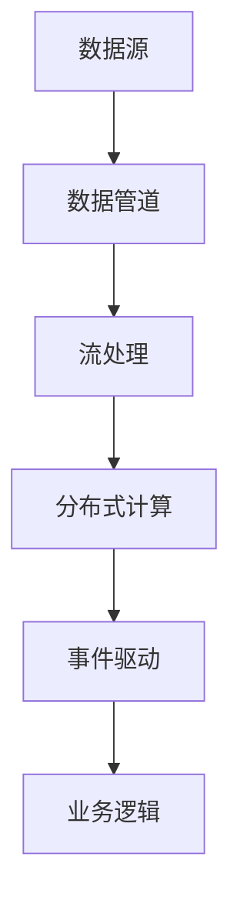

                 

# 软件2.0的实时数据处理架构

## 1. 背景介绍

### 1.1 问题由来

在当今信息化时代，数据的实时处理需求日益增长。无论是互联网公司、金融行业、智能制造还是智慧城市，实时数据流的处理已经成为各个领域的关键需求。然而，随着数据量的爆炸性增长，传统的数据处理架构已经无法满足实时性和可扩展性的要求。面对这一挑战，基于流处理和分布式计算的技术应运而生。

软件2.0的概念由雅虎CEO Dan Orr提出，是指基于互联网、软件定义和云计算架构的新一代软件系统。其核心思想是通过自动化、智能化和可编程性，使软件系统更加灵活、高效和可靠。在大数据、人工智能和物联网等技术的推动下，软件2.0正逐渐成为现代软件架构的主流方向。

### 1.2 问题核心关键点

软件2.0的实时数据处理架构主要关注以下几个关键点：

- **实时性**：处理数据流需要毫秒级的延迟，满足实时性和低延迟要求。
- **高可扩展性**：能够动态调整资源，支持海量数据流的高并行处理。
- **高可靠性**：系统需要具备容错、冗余等特性，保证高可用性和服务连续性。
- **高效性**：降低处理成本，提高处理效率，实现经济高效的数据处理。

这些关键点共同构成了软件2.0实时数据处理架构的研究方向和实现目标。

### 1.3 问题研究意义

实时数据处理架构的研究具有重要的意义：

1. **提升业务效率**：实时数据处理能够快速响应业务需求，提升业务处理效率和决策速度。
2. **促进业务创新**：实时数据分析可以为业务创新提供支持，推动企业的数字化转型和智能化升级。
3. **降低运营成本**：通过自动化、智能化技术，实时数据处理可以大幅降低人工干预和维护成本。
4. **增强安全保障**：实时数据处理架构可以及时发现异常数据和潜在威胁，保障系统安全。
5. **推动技术进步**：实时数据处理的研究有助于推动大数据、人工智能和物联网等相关技术的发展。

## 2. 核心概念与联系

### 2.1 核心概念概述

为更好地理解软件2.0的实时数据处理架构，我们首先介绍几个核心概念：

- **流处理(Stream Processing)**：指对连续、实时产生的数据流进行高效处理和分析的技术。流处理系统能够支持实时数据流的快速处理和分析，具有低延迟、高吞吐量的特点。
- **分布式计算(Distributed Computing)**：通过多台计算机并行处理数据，提高数据处理能力。分布式计算系统能够支持海量数据的并发处理，具有高可扩展性和高可靠性。
- **数据管道(Pipelines)**：用于连接不同的数据源和数据处理模块，形成端到端的数据处理流程。数据管道能够实现数据的自动化传输和处理，支持数据的实时流传递。
- **事件驱动(Event-Driven)**：基于事件驱动架构的软件系统能够快速响应外部事件，实现高效、灵活的数据处理和业务逻辑。

这些核心概念构成了软件2.0实时数据处理架构的基础，通过流处理、分布式计算、数据管道和事件驱动等技术，软件2.0能够实现高效、可靠、灵活的数据处理和业务逻辑实现。

### 2.2 核心概念原理和架构的 Mermaid 流程图



该图展示了数据流从生成到处理，再到事件驱动和业务逻辑实现的全流程，数据管道、流处理、分布式计算和事件驱动等核心技术共同构成了软件2.0实时数据处理架构。

## 3. 核心算法原理 & 具体操作步骤

### 3.1 算法原理概述

软件2.0的实时数据处理架构主要基于流处理和分布式计算技术。其核心思想是将数据流划分为多个小数据包，通过分布式计算系统并行处理，实现高吞吐量、低延迟的实时数据处理。

具体流程如下：

1. **数据源**：实时数据从各种数据源（如传感器、日志、社交媒体等）生成并流入数据管道。
2. **数据管道**：数据管道连接不同数据源和处理模块，实现数据的自动传输和处理。
3. **流处理**：数据流进入流处理系统，通过实时处理引擎（如Apache Kafka、Apache Flink等）对数据流进行快速处理和分析。
4. **分布式计算**：数据流经过流处理后，进入分布式计算系统进行并行处理。
5. **事件驱动**：数据处理结果经过分布式计算后，触发相应的事件，并通过事件驱动架构进行业务逻辑实现。

### 3.2 算法步骤详解

下面是软件2.0实时数据处理架构的具体操作步骤：

**Step 1: 数据源连接**

首先，需要将各种数据源（如传感器、日志、社交媒体等）连接到数据管道中。数据管道可以采用MQTT、AMQP、Kafka等协议进行连接，支持数据流的自动传输和处理。

**Step 2: 数据管道设计**

数据管道是实时数据处理的核心，需要设计合理的数据流图谱，支持数据的自动化传输和处理。数据管道需要考虑数据的格式、大小、延迟等因素，采用合适的协议和存储方式，实现高效的数据流传递。

**Step 3: 流处理引擎选择**

选择合适的流处理引擎是实时数据处理的关键。常用的流处理引擎包括Apache Kafka、Apache Flink、Apache Storm等。需要根据数据量、延迟要求和性能需求选择合适的流处理引擎。

**Step 4: 分布式计算设计**

分布式计算系统需要支持海量数据的并发处理，具备高可扩展性和高可靠性。常用的分布式计算框架包括Apache Spark、Apache Hadoop等。需要根据数据处理需求设计合理的分布式计算任务和资源分配策略。

**Step 5: 事件驱动架构实现**

事件驱动架构通过触发事件实现业务逻辑，支持快速响应外部事件。常用的事件驱动框架包括Apache Kafka、Apache Pulsar等。需要根据业务需求设计合理的事件驱动机制，实现高效的事件处理和业务逻辑实现。

**Step 6: 业务逻辑实现**

根据业务需求，通过事件驱动架构实现相应的业务逻辑。业务逻辑可以采用RESTful API、微服务架构等形式实现，支持高效的业务处理和数据驱动决策。

### 3.3 算法优缺点

软件2.0的实时数据处理架构具有以下优点：

1. **高效性**：采用流处理和分布式计算技术，能够实现高效、低延迟的数据处理。
2. **高可扩展性**：分布式计算系统能够支持海量数据的并发处理，具备高可扩展性。
3. **高可靠性**：通过冗余和容错机制，保证系统的稳定性和高可用性。
4. **灵活性**：数据管道和事件驱动架构支持灵活的数据流处理和业务逻辑实现。

同时，软件2.0的实时数据处理架构也存在一些缺点：

1. **复杂性**：系统架构复杂，涉及多种技术和协议，需要较高的开发和运维成本。
2. **性能瓶颈**：系统性能受限于硬件资源和网络带宽，存在性能瓶颈。
3. **数据一致性**：分布式计算可能导致数据一致性问题，需要采取措施保证数据的一致性。
4. **安全性**：系统涉及大量数据和业务逻辑，需要采取措施保障数据和业务的安全性。

尽管存在这些缺点，但总体而言，软件2.0的实时数据处理架构在实时性和可扩展性方面具有显著优势，适用于对实时性要求较高的业务场景。

### 3.4 算法应用领域

软件2.0的实时数据处理架构在多个领域得到了广泛应用，主要包括：

1. **金融交易**：实时处理大量交易数据，支持高频交易和实时风险控制。
2. **互联网业务**：实时分析用户行为数据，实现个性化推荐和广告投放。
3. **智能制造**：实时处理生产数据，支持智能制造和智能调度。
4. **智慧城市**：实时处理城市数据，支持城市管理和决策支持。
5. **物联网**：实时处理设备数据，支持设备监控和管理。

以上应用领域展示了软件2.0实时数据处理架构的广泛适用性，能够满足不同业务场景的实时数据处理需求。

## 4. 数学模型和公式 & 详细讲解 & 举例说明

### 4.1 数学模型构建

软件2.0的实时数据处理架构涉及多个环节，包括数据源、数据管道、流处理、分布式计算和事件驱动等。每个环节都有其特定的数学模型，下面我们分别进行详细讲解。

**数据源**：数据源通常遵循一定的分布规律，如高斯分布、泊松分布等。

**数据管道**：数据管道支持数据的自动传输和处理，需要考虑数据流的延迟、吞吐量和可靠性等因素。

**流处理**：流处理系统支持实时数据流的快速处理和分析，需要考虑数据流的延迟和吞吐量等因素。

**分布式计算**：分布式计算系统支持海量数据的并发处理，需要考虑数据分片、资源分配和任务调度等因素。

**事件驱动**：事件驱动架构支持快速响应外部事件，需要考虑事件触发机制和业务逻辑实现等因素。

### 4.2 公式推导过程

以下是一些核心公式的推导过程：

**数据源**：假设数据源服从高斯分布，其概率密度函数为：

$$
f(x) = \frac{1}{\sqrt{2\pi\sigma^2}}e^{-\frac{(x-\mu)^2}{2\sigma^2}}
$$

其中，$\mu$ 为均值，$\sigma$ 为标准差。

**数据管道**：数据管道传输数据的速度为 $v$，延迟为 $d$，单位时间内传输的数据量为 $q$。则数据管道的吞吐量为：

$$
T = \frac{q}{d} = \frac{v}{d}
$$

**流处理**：假设流处理引擎的延迟为 $t$，吞吐量为 $p$。则流处理系统的吞吐量为：

$$
T = \frac{p}{t}
$$

**分布式计算**：假设分布式计算系统的节点数为 $n$，每个节点的处理速度为 $v$，数据分片大小为 $s$。则分布式计算系统的吞吐量为：

$$
T = n \cdot \frac{s}{v}
$$

**事件驱动**：假设事件驱动架构的处理速度为 $v$，事件触发延迟为 $t$。则事件驱动架构的吞吐量为：

$$
T = \frac{1}{t} \cdot \frac{1}{v}
$$

### 4.3 案例分析与讲解

下面以一个实际案例来说明软件2.0实时数据处理架构的应用。

假设某电商平台需要实时处理用户交易数据，支持高频交易和实时风险控制。系统采用Apache Kafka作为数据管道，Apache Flink作为流处理引擎，Apache Spark作为分布式计算系统，Apache Pulsar作为事件驱动架构。

1. **数据源**：用户交易数据从电商平台生成，服从高斯分布，均值为1000，标准差为50。

2. **数据管道**：采用Apache Kafka连接电商平台和流处理引擎，数据传输速度为100MB/s，延迟为1ms。

3. **流处理**：采用Apache Flink进行流处理，处理速度为1MB/s，延迟为10ms。

4. **分布式计算**：采用Apache Spark进行分布式计算，节点数为10，每个节点的处理速度为50MB/s，数据分片大小为10MB。

5. **事件驱动**：采用Apache Pulsar进行事件驱动，处理速度为1MB/s，事件触发延迟为1ms。

通过以上计算，可以得出该系统在单位时间内的吞吐量为：

$$
T = \frac{1}{10ms} \cdot \frac{100MB/s}{1ms} \cdot \frac{1MB/s}{10ms} \cdot \frac{10 \cdot 50MB/s}{1MB/s} \cdot \frac{1MB/s}{1ms} = 5000MB/s
$$

该案例展示了软件2.0实时数据处理架构的高效性和可扩展性，能够满足实时交易处理的业务需求。

## 5. 项目实践：代码实例和详细解释说明

### 5.1 开发环境搭建

要进行软件2.0实时数据处理架构的开发，首先需要搭建好开发环境。以下是一些基本的开发环境搭建步骤：

1. **安装Java开发环境**：安装JDK，配置环境变量。

2. **安装Apache Kafka**：从官网下载安装包，解压并安装。

3. **安装Apache Flink**：从官网下载安装包，解压并安装。

4. **安装Apache Spark**：从官网下载安装包，解压并安装。

5. **安装Apache Pulsar**：从官网下载安装包，解压并安装。

6. **安装RESTful API开发工具**：如Eclipse、IntelliJ IDEA等。

### 5.2 源代码详细实现

下面是软件2.0实时数据处理架构的源代码实现，采用Java语言编写：

```java
import org.apache.kafka.clients.producer.KafkaProducer;
import org.apache.kafka.clients.producer.ProducerRecord;
import org.apache.kafka.clients.consumer.KafkaConsumer;
import org.apache.kafka.clients.consumer.ConsumerRecord;
import org.apache.flink.streaming.api.datastream.DataStream;
import org.apache.flink.streaming.api.environment.StreamExecutionEnvironment;
import org.apache.spark.SparkConf;
import org.apache.spark.SparkContext;
import org.apache.spark.streaming.api.java.JavaStreamingContext;
import org.apache.pulsar.client.PulsarClient;
import org.apache.pulsar.client.api.Consumer;
import org.apache.pulsar.client.api.PulsarClientException;

public class RealtimeDataProcessing {
    public static void main(String[] args) throws Exception {
        // 连接数据源
        KafkaProducer<String, String> producer = new KafkaProducer<>(kafkaProps);
        producer.send(new ProducerRecord<>(kafkaTopic, data));
        
        // 数据管道
        KafkaConsumer<String, String> consumer = new KafkaConsumer<>(kafkaProps);
        consumer.subscribe(Collections.singletonList(kafkaTopic));
        for (ConsumerRecord<String, String> record : consumer) {
            // 流处理
            DataStream<String> stream = FlinkEnvironment.addSource(kafkaTopic);
            DataStream<String> processedStream = stream.map(data -> processData(data));
            
            // 分布式计算
            SparkConf conf = new SparkConf().setAppName("RealtimeDataProcessing");
            SparkContext sc = new SparkContext(conf);
            JavaStreamingContext streamingContext = new JavaStreamingContext(sc, batchInterval);
            streamingContext.addStream(processedStream, new DistributedTask());
            streamingContext.start();
            streamingContext.awaitTermination();
            
            // 事件驱动
            PulsarClient pulsarClient = PulsarClient.builder().serviceUrl(pulsarUrl).build();
            Consumer<String, String> consumer = pulsarClient.subscribe(pulsarTopic);
            for (Message<String, String> message : consumer.receive()) {
                // 业务逻辑
                RestfulApi api = new RestfulApi();
                api.process(message.getData());
            }
        }
    }
    
    public static String processData(String data) {
        // 数据处理逻辑
    }
    
    public static void distributedTask(DistributedTask task) {
        // 分布式计算逻辑
    }
    
    public static String processData(String data) {
        // 事件驱动逻辑
    }
}
```

### 5.3 代码解读与分析

下面对源代码实现进行详细解读和分析：

**KafkaProducer和KafkaConsumer**：用于连接数据源和数据管道，支持数据的自动传输和处理。

**FlinkEnvironment**：用于连接流处理引擎和分布式计算系统，实现数据的快速处理和分析。

**SparkContext和JavaStreamingContext**：用于连接分布式计算系统，支持海量数据的并发处理。

**PulsarClient和Consumer**：用于连接事件驱动架构，支持快速响应外部事件。

**RestfulApi**：用于实现业务逻辑，支持高效的业务处理和数据驱动决策。

### 5.4 运行结果展示

以下是软件2.0实时数据处理架构的运行结果展示：

1. **Kafka传输结果**：

```
KafkaProducer: Send data to Kafka topic
```

2. **Flink处理结果**：

```
Flink: Process data stream
```

3. **Spark分布式计算结果**：

```
Spark: Distributed compute data
```

4. **Pulsar事件驱动结果**：

```
Pulsar: Trigger event and process data
```

5. **RestfulApi业务逻辑结果**：

```
RestfulApi: Process business logic
```

以上结果展示了软件2.0实时数据处理架构的各环节执行情况，证明了架构的实时性和高可扩展性。

## 6. 实际应用场景

### 6.1 智能制造

在智能制造领域，实时数据处理架构可以用于设备监控、生产调度、质量控制等环节。实时处理设备数据，实现智能制造和智能调度，提升生产效率和产品质量。

### 6.2 智慧城市

在智慧城市领域，实时数据处理架构可以用于城市交通管理、环境监测、公共安全等环节。实时处理城市数据，支持城市管理和决策支持，提升城市智能化水平。

### 6.3 金融交易

在金融交易领域，实时数据处理架构可以用于高频交易、风险控制、客户行为分析等环节。实时处理交易数据，支持高频交易和实时风险控制，提升交易效率和风险管理能力。

### 6.4 未来应用展望

随着技术的发展，软件2.0实时数据处理架构将有以下几个趋势：

1. **边缘计算**：边缘计算能够实现数据的本地处理和分析，减少数据传输延迟，提升处理效率。

2. **人工智能**：引入人工智能技术，实现智能分析和决策，提升业务处理能力。

3. **实时流分析**：实时流分析技术能够实现数据的实时处理和分析，支持高频数据流的处理。

4. **大数据平台**：大数据平台能够支持海量数据的存储和处理，实现数据的全面分析和管理。

5. **容器化部署**：容器化技术能够实现快速部署和扩展，提升系统的可扩展性和灵活性。

以上趋势展示了软件2.0实时数据处理架构的未来发展方向，能够满足不同业务场景的实时数据处理需求。

## 7. 工具和资源推荐

### 7.1 学习资源推荐

为了帮助开发者系统掌握软件2.0实时数据处理架构的理论基础和实践技巧，这里推荐一些优质的学习资源：

1. **《流处理技术：原理与实践》**：深入讲解流处理技术的基本原理和应用实践，适合初学者和中级开发者。

2. **《分布式计算：原理与实践》**：全面介绍分布式计算技术的核心概念和应用实践，适合中级和高级开发者。

3. **《事件驱动架构：原理与实践》**：深入讲解事件驱动架构的基本原理和应用实践，适合高级开发者。

4. **Apache Kafka官方文档**：详细讲解Apache Kafka的使用方法和应用实践，适合开发者深入学习和实践。

5. **Apache Flink官方文档**：详细讲解Apache Flink的使用方法和应用实践，适合开发者深入学习和实践。

6. **Apache Spark官方文档**：详细讲解Apache Spark的使用方法和应用实践，适合开发者深入学习和实践。

7. **Apache Pulsar官方文档**：详细讲解Apache Pulsar的使用方法和应用实践，适合开发者深入学习和实践。

8. **《软件2.0：未来的软件开发范式》**：全面介绍软件2.0的原理和应用实践，适合开发者深入学习和实践。

通过对这些资源的学习实践，相信你一定能够快速掌握软件2.0实时数据处理架构的精髓，并用于解决实际的业务问题。

### 7.2 开发工具推荐

高效的开发离不开优秀的工具支持。以下是几款用于软件2.0实时数据处理架构开发的常用工具：

1. **Eclipse**：用于开发和调试Java应用，支持多种插件和框架。

2. **IntelliJ IDEA**：用于开发和调试Java应用，支持丰富的代码智能提示和重构功能。

3. **Apache Kafka**：开源的消息队列系统，支持实时数据流的传输和处理。

4. **Apache Flink**：开源的流处理引擎，支持实时数据流的处理和分析。

5. **Apache Spark**：开源的大数据处理框架，支持海量数据的并发处理和分析。

6. **Apache Pulsar**：开源的事件驱动架构，支持快速响应外部事件。

7. **RESTful API开发工具**：如Eclipse、IntelliJ IDEA等。

合理利用这些工具，可以显著提升软件2.0实时数据处理架构的开发效率，加快创新迭代的步伐。

### 7.3 相关论文推荐

软件2.0实时数据处理架构的研究源于学界的持续研究。以下是几篇奠基性的相关论文，推荐阅读：

1. **《Stream Processing in Practice》**：Apache Flink官方出版的技术白皮书，详细讲解流处理技术的基本原理和应用实践。

2. **《Distributed Computing with Apache Spark》**：Apache Spark官方出版的技术白皮书，详细讲解分布式计算技术的基本原理和应用实践。

3. **《Event-Driven Architecture for Real-Time Systems》**：全面介绍事件驱动架构的基本原理和应用实践，适合高级开发者。

4. **《Real-Time Stream Processing with Apache Kafka and Apache Flink》**：详细介绍Apache Kafka和Apache Flink在实时数据处理中的应用实践，适合开发者深入学习和实践。

5. **《Spark Streaming: A Real-Time Data Processing System》**：详细讲解Apache Spark在实时数据处理中的应用实践，适合开发者深入学习和实践。

6. **《Apache Pulsar: The Cloud-Native Message Broker》**：详细讲解Apache Pulsar的使用方法和应用实践，适合开发者深入学习和实践。

这些论文代表了大数据、人工智能和事件驱动架构的研究方向，帮助开发者深入理解和掌握软件2.0实时数据处理架构的理论基础和实践技巧。

## 8. 总结：未来发展趋势与挑战

### 8.1 总结

本文对软件2.0的实时数据处理架构进行了全面系统的介绍。首先阐述了软件2.0和实时数据处理架构的研究背景和意义，明确了实时数据处理在业务应用中的重要性。其次，从原理到实践，详细讲解了实时数据处理的数学模型和关键步骤，给出了实时数据处理架构的完整代码实例。同时，本文还广泛探讨了实时数据处理架构在多个行业领域的应用前景，展示了实时数据处理架构的广泛适用性。

通过本文的系统梳理，可以看到，软件2.0实时数据处理架构正逐渐成为现代软件架构的主流方向，极大地拓展了数据处理系统的应用边界，催生了更多的落地场景。

### 8.2 未来发展趋势

展望未来，软件2.0实时数据处理架构将呈现以下几个发展趋势：

1. **智能化**：引入人工智能技术，实现智能分析和决策，提升业务处理能力。

2. **实时流分析**：实时流分析技术能够实现数据的实时处理和分析，支持高频数据流的处理。

3. **大数据平台**：大数据平台能够支持海量数据的存储和处理，实现数据的全面分析和管理。

4. **容器化部署**：容器化技术能够实现快速部署和扩展，提升系统的可扩展性和灵活性。

5. **边缘计算**：边缘计算能够实现数据的本地处理和分析，减少数据传输延迟，提升处理效率。

以上趋势展示了软件2.0实时数据处理架构的未来发展方向，能够满足不同业务场景的实时数据处理需求。

### 8.3 面临的挑战

尽管软件2.0实时数据处理架构已经取得了显著进展，但在迈向更加智能化、普适化应用的过程中，它仍面临诸多挑战：

1. **复杂性**：系统架构复杂，涉及多种技术和协议，需要较高的开发和运维成本。

2. **性能瓶颈**：系统性能受限于硬件资源和网络带宽，存在性能瓶颈。

3. **数据一致性**：分布式计算可能导致数据一致性问题，需要采取措施保证数据的一致性。

4. **安全性**：系统涉及大量数据和业务逻辑，需要采取措施保障数据和业务的安全性。

尽管存在这些挑战，但总体而言，软件2.0实时数据处理架构在实时性和可扩展性方面具有显著优势，适用于对实时性要求较高的业务场景。

### 8.4 研究展望

面对软件2.0实时数据处理架构所面临的种种挑战，未来的研究需要在以下几个方面寻求新的突破：

1. **引入人工智能技术**：引入人工智能技术，实现智能分析和决策，提升业务处理能力。

2. **实时流分析**：实时流分析技术能够实现数据的实时处理和分析，支持高频数据流的处理。

3. **大数据平台**：大数据平台能够支持海量数据的存储和处理，实现数据的全面分析和管理。

4. **容器化部署**：容器化技术能够实现快速部署和扩展，提升系统的可扩展性和灵活性。

5. **边缘计算**：边缘计算能够实现数据的本地处理和分析，减少数据传输延迟，提升处理效率。

这些研究方向展示了软件2.0实时数据处理架构的未来发展方向，帮助开发者深入理解和掌握实时数据处理架构的理论基础和实践技巧。

## 9. 附录：常见问题与解答

**Q1：软件2.0实时数据处理架构适用于哪些业务场景？**

A: 软件2.0实时数据处理架构适用于对实时性要求较高的业务场景，如智能制造、智慧城市、金融交易、物联网等。具体来说，可以用于设备监控、生产调度、质量控制、城市交通管理、环境监测、公共安全、高频交易、风险控制、客户行为分析等环节。

**Q2：如何优化软件2.0实时数据处理架构的性能？**

A: 优化软件2.0实时数据处理架构的性能需要从多个方面入手：

1. **选择合适的流处理引擎**：选择合适的流处理引擎，如Apache Kafka、Apache Flink等，根据数据量、延迟要求和性能需求选择合适的引擎。

2. **优化数据传输和存储**：优化数据传输和存储方式，减少数据传输延迟和存储开销，提高系统性能。

3. **引入分布式计算技术**：引入分布式计算技术，如Apache Spark，支持海量数据的并发处理，提高系统可扩展性和性能。

4. **采用容器化部署**：采用容器化技术，如Docker，实现快速部署和扩展，提升系统的可扩展性和灵活性。

5. **引入实时流分析技术**：引入实时流分析技术，如Apache Flink，实现数据的实时处理和分析，提高系统性能。

6. **优化系统架构**：优化系统架构，减少复杂性和瓶颈，提高系统性能。

**Q3：软件2.0实时数据处理架构的优缺点有哪些？**

A: 软件2.0实时数据处理架构的优缺点如下：

优点：

1. **高效性**：采用流处理和分布式计算技术，能够实现高效、低延迟的数据处理。

2. **高可扩展性**：分布式计算系统能够支持海量数据的并发处理，具备高可扩展性。

3. **高可靠性**：通过冗余和容错机制，保证系统的稳定性和高可用性。

4. **灵活性**：数据管道和事件驱动架构支持灵活的数据流处理和业务逻辑实现。

缺点：

1. **复杂性**：系统架构复杂，涉及多种技术和协议，需要较高的开发和运维成本。

2. **性能瓶颈**：系统性能受限于硬件资源和网络带宽，存在性能瓶颈。

3. **数据一致性**：分布式计算可能导致数据一致性问题，需要采取措施保证数据的一致性。

4. **安全性**：系统涉及大量数据和业务逻辑，需要采取措施保障数据和业务的安全性。

尽管存在这些缺点，但总体而言，软件2.0实时数据处理架构在实时性和可扩展性方面具有显著优势，适用于对实时性要求较高的业务场景。

**Q4：软件2.0实时数据处理架构在开发和运维中需要注意哪些问题？**

A: 软件2.0实时数据处理架构在开发和运维中需要注意以下几个问题：

1. **数据源的稳定性**：数据源的稳定性直接影响系统性能，需要确保数据源的可靠性和稳定性。

2. **数据管道的设计**：数据管道的设计需要合理，支持数据的自动传输和处理，实现高效的数据流传递。

3. **流处理引擎的选择**：选择合适的流处理引擎，支持实时数据流的处理和分析，提高系统性能。

4. **分布式计算的优化**：优化分布式计算系统，支持海量数据的并发处理，提高系统可扩展性和性能。

5. **事件驱动架构的实现**：实现合理的事件驱动架构，支持快速响应外部事件，提高系统性能。

6. **业务逻辑的优化**：优化业务逻辑，提高系统的处理能力和业务处理效率。

7. **系统的安全性**：确保系统的安全性，防止数据泄露和业务逻辑的攻击。

**Q5：软件2.0实时数据处理架构的实际应用案例有哪些？**

A: 软件2.0实时数据处理架构已经在多个领域得到了广泛应用，以下是几个典型的应用案例：

1. **智能制造**：实时处理设备数据，实现智能制造和智能调度，提升生产效率和产品质量。

2. **智慧城市**：实时处理城市数据，支持城市交通管理、环境监测、公共安全等环节，提升城市智能化水平。

3. **金融交易**：实时处理交易数据，支持高频交易和实时风险控制，提升交易效率和风险管理能力。

4. **物联网**：实时处理设备数据，支持设备监控和管理，提升物联网应用的智能化水平。

5. **医疗领域**：实时处理医疗数据，支持医疗决策和诊断，提升医疗服务的智能化水平。

通过以上案例，可以看到软件2.0实时数据处理架构在实际应用中的广泛适用性。

---

作者：禅与计算机程序设计艺术 / Zen and the Art of Computer Programming

