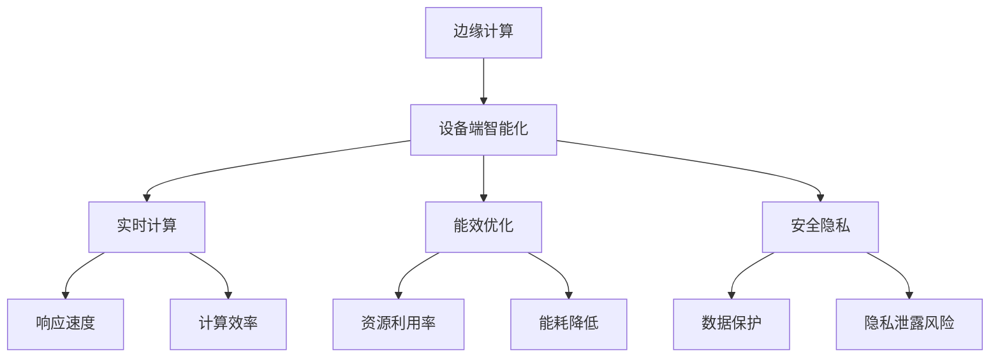

                 

# 边缘AI：设备端智能化的技术与挑战

> 关键词：边缘AI, 设备端智能化, 实时计算, 能效优化, 安全隐私, 边缘计算

## 1. 背景介绍

随着人工智能(AI)技术在各个领域的应用逐渐深入，其对计算资源和网络带宽的需求也随之增加。传统的集中式计算方式已无法满足AI应用的实时性、安全性与隐私保护等要求，特别是对于涉及大量个人隐私数据的应用场景。因此，边缘计算（Edge Computing）作为一种新兴的计算模式，成为了AI应用的重要发展方向。

边缘AI（Edge AI）是指将AI模型部署在接近数据源的边缘设备上，通过本地计算，减少对中心服务器的依赖，实现更加实时、高效、安全的应用。随着物联网(IoT)设备的普及，边缘AI技术的发展潜力日益凸显，成为AI应用落地过程中的关键技术。

## 2. 核心概念与联系

### 2.1 核心概念概述

边缘AI技术基于边缘计算模式，将AI模型与计算资源部署到靠近数据源的设备端，实现数据本地化处理，减少网络传输延迟，提高应用响应速度和隐私保护能力。核心概念包括：

- **边缘计算**：靠近数据源的分布式计算模式，通过就近处理数据，降低网络延迟，提高数据处理效率。
- **设备端智能化**：通过在嵌入式设备上部署AI模型，实现本地化决策与控制，提升设备的功能和用户体验。
- **实时计算**：支持毫秒级响应时间，处理动态变化的复杂数据流，实现高性能的实时应用。
- **能效优化**：优化计算资源的使用，延长设备电池寿命，提升整体系统能效。
- **安全隐私**：通过本地计算，减少数据传输与集中存储的风险，保护用户隐私与数据安全。

这些核心概念相互交织，共同构成了边缘AI技术的核心体系。以下是一个Mermaid流程图，展示这些概念之间的联系：



### 2.2 核心概念原理和架构

#### 边缘计算原理
边缘计算通过将计算任务分解成多个部分，在地理位置上分布式部署，从而降低了集中计算的延迟和带宽需求。数据先被传输到边缘节点进行处理，然后再通过互联网传输到云端进行进一步分析，最终结果再返回给用户或设备端。这种分布式计算模式显著提升了数据处理速度，支持实时应用。

#### 设备端智能化原理
设备端智能化是将AI模型直接部署到嵌入式设备上，利用设备本身的计算能力，实现本地化处理。相比于云端的集中计算，设备端智能化具有更低的延迟和更高的隐私保护能力，适用于对响应速度和数据隐私要求较高的应用场景。

#### 实时计算原理
实时计算是指在数据到达时，能够快速响应的计算能力。边缘AI通过在设备端部署AI模型，能够立即处理来自传感器或用户交互的实时数据，实现毫秒级的响应时间，满足对实时性要求高的应用需求。

#### 能效优化原理
能效优化通过优化计算资源的使用，减少功耗，延长设备电池寿命，提高整体系统能效。在边缘AI中，通过硬件加速和软件优化，如异构计算、低功耗优化等手段，实现高效能低功耗的计算。

#### 安全隐私原理
安全隐私通过在设备端进行数据处理，减少了数据传输与集中存储的风险。数据直接在本地进行处理和分析，无需上传至云端，大大提高了数据的安全性和隐私保护能力。

## 3. 核心算法原理 & 具体操作步骤

### 3.1 算法原理概述

边缘AI的核心算法主要包括以下几个部分：

- **数据预处理算法**：在本地对数据进行预处理，如去噪、归一化、特征提取等，减少对计算资源的需求。
- **模型压缩算法**：对AI模型进行量化、剪枝、蒸馏等操作，减小模型大小，提升推理效率。
- **优化算法**：优化模型参数，提高训练速度和推理速度，同时保证模型的性能。
- **实时推理算法**：实现毫秒级的响应时间，满足实时应用的需求。

### 3.2 算法步骤详解

#### 数据预处理算法
数据预处理是边缘AI中不可或缺的一环，其主要步骤包括：

1. **数据采集**：通过传感器、摄像头等设备采集数据，并将数据传输到边缘设备。
2. **数据清洗**：去除噪声数据，确保数据的准确性和完整性。
3. **特征提取**：提取关键特征，减少计算量。
4. **数据编码**：将数据编码为模型可以处理的格式。

#### 模型压缩算法
模型压缩主要通过量化和剪枝等方法减少模型大小，提高推理效率。主要步骤包括：

1. **量化**：将模型参数从浮点数转换为整数，减少存储空间和计算量。
2. **剪枝**：删除不必要的模型参数，保留核心参数，减小模型复杂度。
3. **蒸馏**：通过迁移学习，将大模型压缩为小模型，提高推理速度。

#### 优化算法
优化算法主要通过优化模型参数，提高训练速度和推理速度，同时保证模型的性能。主要步骤包括：

1. **权重调整**：调整模型权重，提高模型的收敛速度和精度。
2. **正则化**：使用L2正则、Dropout等方法，防止过拟合。
3. **自适应学习率**：根据模型状态动态调整学习率，提升训练效果。

#### 实时推理算法
实时推理算法主要通过硬件加速和软件优化，实现毫秒级的响应时间。主要步骤包括：

1. **模型部署**：将训练好的模型部署到边缘设备上。
2. **硬件加速**：利用GPU、TPU等硬件加速器，提升推理速度。
3. **优化算法**：优化推理过程，减少计算时间。
4. **数据流管理**：管理数据流，确保实时性。

### 3.3 算法优缺点

#### 优点
- **降低延迟**：边缘计算减少了数据传输的延迟，提高了应用响应速度。
- **提升隐私保护**：本地处理减少了数据传输，提高了数据安全性。
- **节省带宽**：减少对网络带宽的需求，降低了通信成本。
- **增强可靠性**：减少了网络故障对系统的影响，提高了系统可靠性。

#### 缺点
- **资源限制**：边缘设备的计算资源和存储资源有限，可能导致性能下降。
- **部署复杂**：模型部署和优化需要专业知识，增加了开发难度。
- **维护困难**：边缘设备分散，维护和管理较为复杂。

### 3.4 算法应用领域

边缘AI技术已经在多个领域得到了广泛应用，例如：

- **智能家居**：通过本地处理，实现智能家电控制、环境监测等功能。
- **工业物联网**：通过本地推理，提高生产效率，优化供应链管理。
- **智慧城市**：通过本地计算，实现交通流量监测、环境监控等功能。
- **医疗健康**：通过本地推理，实现疾病预测、远程诊疗等功能。
- **零售电商**：通过本地处理，实现个性化推荐、库存管理等功能。

这些应用场景展示了边缘AI技术的广泛应用前景，为各行业的智能化升级提供了新的解决方案。

## 4. 数学模型和公式 & 详细讲解 & 举例说明

### 4.1 数学模型构建

边缘AI中常用的数学模型包括数据预处理、模型压缩、优化算法和实时推理算法。这里以数据预处理和模型压缩为例，介绍其数学模型构建。

#### 数据预处理模型
假设采集到的原始数据为 $\{x_i\}_{i=1}^N$，预处理后得到处理后的数据 $\{y_i\}_{i=1}^N$。预处理算法可以表示为：

$$
y_i = f(x_i)
$$

其中，$f$ 为预处理函数。

#### 模型压缩模型
假设原始模型参数为 $\theta$，压缩后的模型参数为 $\hat{\theta}$。模型压缩算法可以表示为：

$$
\hat{\theta} = g(\theta)
$$

其中，$g$ 为压缩函数。

### 4.2 公式推导过程

#### 数据预处理公式推导
以特征提取为例，假设原始数据维度为 $D$，经过特征提取后变为 $d$。特征提取过程可以表示为：

$$
y_i = \mathbf{W} x_i + b
$$

其中，$\mathbf{W}$ 为权重矩阵，$b$ 为偏置向量。

#### 模型压缩公式推导
以量化为例，假设原始模型参数 $\theta$ 中每个元素取值范围为 $[-C, C]$，量化后参数取值范围变为 $[-\hat{C}, \hat{C}]$。量化过程可以表示为：

$$
\hat{\theta} = \frac{\theta}{C} \in [-1, 1]
$$

其中，$\hat{C}$ 为量化后的取值范围。

### 4.3 案例分析与讲解

以医疗健康领域的边缘AI为例，分析其实际应用场景。

#### 数据预处理案例
假设采集到的原始数据为患者的生理参数，如心率、血压、血氧等。预处理算法可以对数据进行归一化，将不同生理参数的数据转化为标准化的数值。预处理后的数据可以输入到模型中进行推理，如疾病预测、治疗方案推荐等。

#### 模型压缩案例
假设原始模型为大规模深度学习模型，推理速度较慢。通过量化和剪枝等方法，将模型压缩为轻量级模型。压缩后的模型可以在边缘设备上高效运行，提升疾病预测的实时性。

## 5. 项目实践：代码实例和详细解释说明

### 5.1 开发环境搭建

边缘AI项目开发需要具备以下几个环境：

1. **边缘设备**：如嵌入式设备、工控机等。
2. **计算资源**：如GPU、TPU等加速器。
3. **编程语言**：如Python、C++等。
4. **开发工具**：如TensorFlow Lite、ONNX Runtime等。

### 5.2 源代码详细实现

以下是一个基于TensorFlow Lite的图像分类示例，展示边缘AI在嵌入式设备上的实现。

```python
import tensorflow as tf
import tensorflow_lite as tflite

# 加载模型
model_path = 'model.tflite'
interpreter = tflite.Interpreter(model_path=model_path)
interpreter.allocate_tensors()

# 获取输入输出
input_details = interpreter.get_input_details()
output_details = interpreter.get_output_details()

# 准备输入数据
input_data = tf.convert_to_tensor([[[224, 224, 3], [224, 224, 3]]])
input_data = input_data.astype(np.float32)
input_data = np.expand_dims(input_data, axis=0)

# 推理计算
interpreter.set_tensor(input_details[0]['index'], input_data)
interpreter.invoke()

# 获取输出结果
output_data = interpreter.get_tensor(output_details[0]['index'])
result = np.squeeze(output_data)
print(result)
```

### 5.3 代码解读与分析

代码实现了使用TensorFlow Lite对预训练的图像分类模型进行推理计算。具体步骤如下：

1. **加载模型**：使用TensorFlow Lite的Interpreter类加载模型，并分配内存。
2. **获取输入输出**：获取模型的输入输出信息，包括张量的名称、形状、数据类型等。
3. **准备输入数据**：将原始数据转换为模型所需的格式，并进行归一化等预处理。
4. **推理计算**：设置输入数据，调用Interpreter的invoke方法进行推理计算。
5. **获取输出结果**：获取推理结果，并进行解码。

### 5.4 运行结果展示

运行上述代码，可以得到模型对图像的分类结果。例如，输入两张224x224的RGB图像，模型输出可能为[0.1, 0.9, 0.2]，表示模型将第一张图像分类为第二类。

## 6. 实际应用场景

### 6.1 智能家居

智能家居通过边缘AI技术，可以实现更加智能化的家居管理。例如，通过本地处理，实现以下功能：

- **环境监测**：实时监测室内温度、湿度、空气质量等，自动调节空调、加湿器等设备。
- **安全监控**：实时分析视频流，检测异常行为，及时报警。
- **能源管理**：根据室内外温度变化，优化电力分配，降低能源消耗。

### 6.2 工业物联网

工业物联网通过边缘AI技术，可以实现高效的生产管理。例如，通过本地推理，实现以下功能：

- **设备监控**：实时监测设备状态，预测设备故障，提前进行维护。
- **质量控制**：实时分析生产数据，优化生产流程，提高产品质量。
- **供应链管理**：实时监控供应链状态，优化库存管理，减少物流成本。

### 6.3 智慧城市

智慧城市通过边缘AI技术，可以实现更加高效的城市管理。例如，通过本地处理，实现以下功能：

- **交通流量监测**：实时分析交通数据，优化交通信号灯，减少交通拥堵。
- **环境监测**：实时监测空气质量、水质、噪音等环境指标，及时采取措施。
- **应急响应**：实时分析监控数据，快速响应突发事件，提高应急反应速度。

### 6.4 未来应用展望

随着边缘AI技术的不断发展，未来将有更多应用场景得到开发。例如：

- **医疗健康**：通过本地推理，实现疾病预测、远程诊疗等功能，提高医疗效率。
- **零售电商**：通过本地处理，实现个性化推荐、库存管理等功能，提升用户体验。
- **智慧农业**：通过本地推理，实现智能灌溉、病虫害预测等功能，提高农业生产效率。

## 7. 工具和资源推荐

### 7.1 学习资源推荐

为了帮助开发者掌握边缘AI技术，推荐以下学习资源：

1. **TensorFlow Lite官方文档**：提供了详细的API文档和示例代码，帮助开发者快速上手。
2. **ONNX Runtime官方文档**：提供了跨平台的优化库，支持多种模型格式，帮助开发者实现高效的推理计算。
3. **PyTorch官方文档**：提供了丰富的模型和算法，支持多种硬件加速，帮助开发者实现高效的模型训练和推理。
4. **边缘计算标准**：如IEEE 802.11rt、5G等，帮助开发者了解边缘计算的标准和协议。
5. **边缘计算平台**：如AWS Greengrass、Azure IoT Edge等，提供平台级的支持和服务，帮助开发者实现边缘计算应用。

### 7.2 开发工具推荐

以下是一些常用的边缘AI开发工具：

1. **TensorFlow Lite**：谷歌开源的轻量级模型推理库，支持多种硬件加速，适用于嵌入式设备。
2. **ONNX Runtime**：微软开源的跨平台优化库，支持多种模型格式，适用于多种平台。
3. **PyTorch Mobile**：Facebook开源的移动端深度学习框架，支持多种硬件加速，适用于移动设备。
4. **AWS Greengrass**：亚马逊的物联网边缘计算平台，提供丰富的云服务，支持多种设备类型。
5. **Azure IoT Edge**：微软的物联网边缘计算平台，提供丰富的云服务，支持多种设备类型。

### 7.3 相关论文推荐

以下是一些关于边缘AI的论文，推荐阅读：

1. **Edge Computing: A Survey**：一篇关于边缘计算的综述论文，涵盖了边缘计算的基本概念、技术架构和应用场景。
2. **Edge Machine Learning**：一篇关于边缘AI的综述论文，涵盖了边缘AI的基本概念、技术架构和应用场景。
3. **Edge AI for Smart Home**：一篇关于边缘AI在智能家居领域应用的论文，展示了边缘AI在智能家居中的具体应用。
4. **Edge AI in Industry IoT**：一篇关于边缘AI在工业物联网领域应用的论文，展示了边缘AI在工业物联网中的具体应用。
5. **Edge AI in Smart City**：一篇关于边缘AI在智慧城市领域应用的论文，展示了边缘AI在智慧城市中的具体应用。

## 8. 总结：未来发展趋势与挑战

### 8.1 研究成果总结

边缘AI技术在近年来得到了快速发展，已经在多个领域得到了广泛应用。未来，边缘AI将朝着更加智能化、普适化、高效化的方向发展，为各行业带来更加智能化的解决方案。

### 8.2 未来发展趋势

未来的边缘AI将呈现以下几个发展趋势：

1. **计算资源下沉**：边缘设备的计算能力将不断提升，支持更复杂、更高精度的模型。
2. **数据融合共享**：边缘设备之间将实现数据共享和融合，实现更全面、更深入的分析。
3. **安全隐私保护**：边缘AI将更注重数据隐私和安全，通过本地处理减少数据传输。
4. **实时性提升**：通过优化计算资源和算法，边缘AI将实现更高的实时性，支持更加复杂的实时应用。
5. **应用场景拓展**：边缘AI将不断拓展新的应用场景，如医疗健康、智慧农业等。

### 8.3 面临的挑战

尽管边缘AI技术有着广阔的应用前景，但在其发展过程中，仍面临诸多挑战：

1. **资源限制**：边缘设备的计算资源和存储资源有限，可能导致性能下降。
2. **部署复杂**：模型部署和优化需要专业知识，增加了开发难度。
3. **维护困难**：边缘设备分散，维护和管理较为复杂。
4. **安全隐私**：边缘AI需要保护数据隐私和安全，防止数据泄露和攻击。
5. **标准化问题**：边缘AI需要统一的标准和协议，实现跨平台和跨设备的互通。

### 8.4 研究展望

未来的研究需要在以下几个方面寻求新的突破：

1. **模型压缩与优化**：开发更加高效、轻量级的模型，支持更复杂的推理计算。
2. **硬件加速**：开发更高效、更通用的硬件加速器，提升计算效率。
3. **跨平台互操作**：实现边缘设备之间的数据共享和互通，提升系统的灵活性和可扩展性。
4. **隐私保护**：开发更强大的隐私保护算法，保护用户数据隐私。
5. **标准化与规范化**：制定统一的标准和协议，推动边缘AI的普及和应用。

## 9. 附录：常见问题与解答

**Q1: 什么是边缘AI？**

A: 边缘AI是将AI模型和计算资源部署到边缘设备上，实现数据本地化处理，减少网络延迟和带宽需求，提升应用响应速度和隐私保护能力的一种计算模式。

**Q2: 边缘AI的优点是什么？**

A: 边缘AI的优点包括降低延迟、提升隐私保护、节省带宽、增强可靠性等。

**Q3: 边缘AI的缺点是什么？**

A: 边缘AI的缺点包括资源限制、部署复杂、维护困难、安全隐私、标准化问题等。

**Q4: 边缘AI在哪些领域得到了应用？**

A: 边缘AI在智能家居、工业物联网、智慧城市、医疗健康、零售电商、智慧农业等领域得到了广泛应用。

**Q5: 边缘AI的未来发展趋势是什么？**

A: 边缘AI的未来发展趋势包括计算资源下沉、数据融合共享、实时性提升、应用场景拓展等。

---

作者：禅与计算机程序设计艺术 / Zen and the Art of Computer Programming

